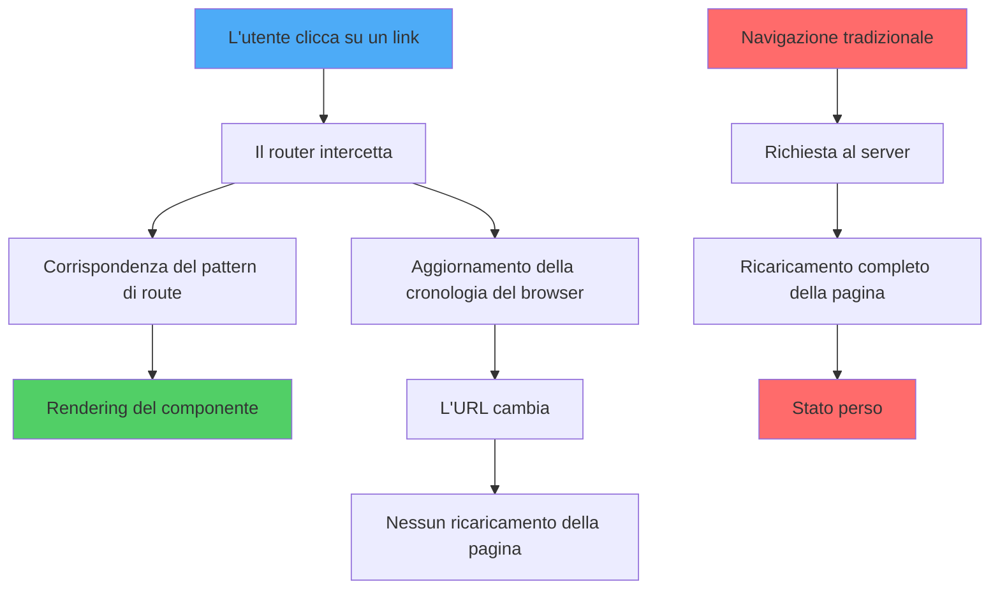
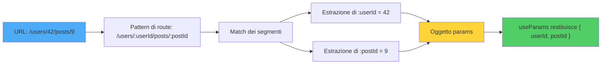
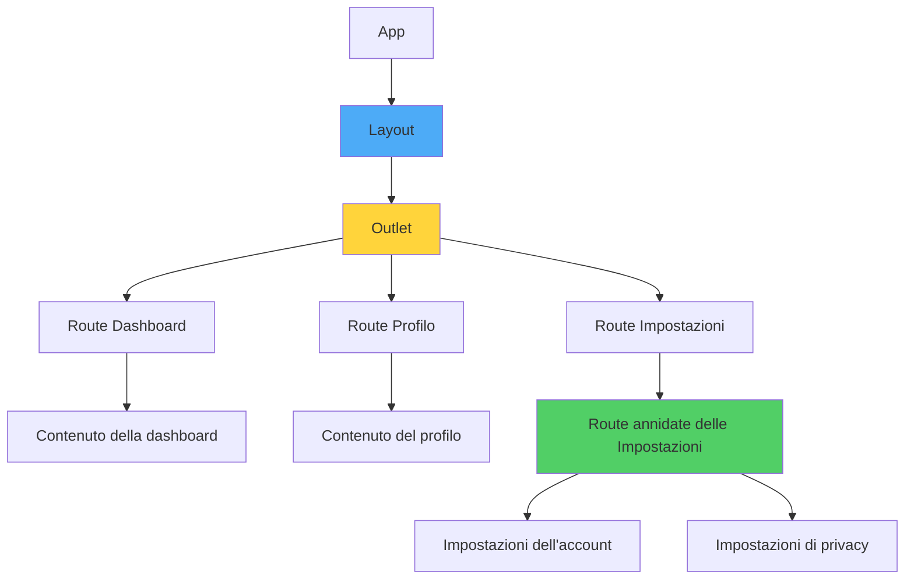
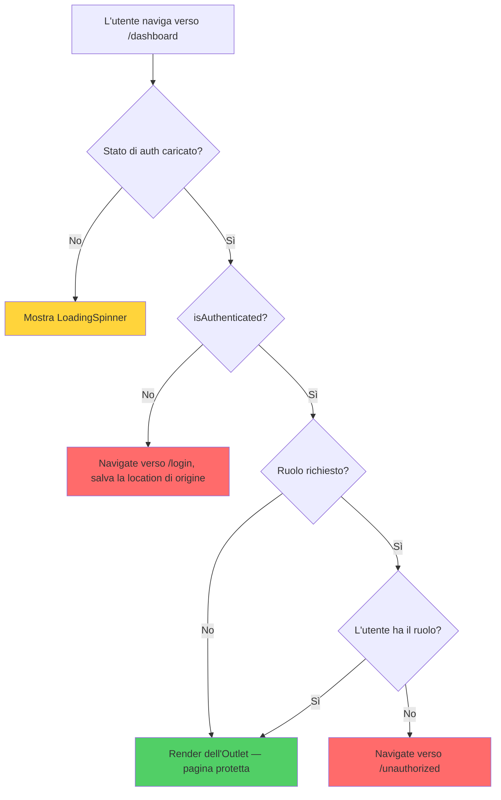
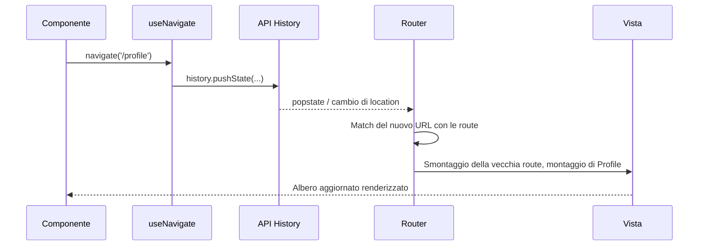
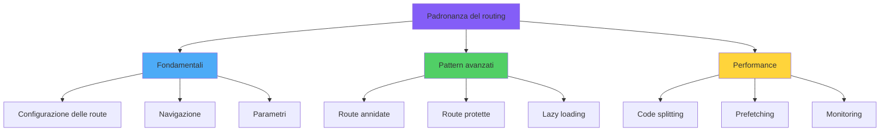

# Routing in React

> Navigazione client-side con React Router

---

## 1. Routing Paradigms and Architecture

### Routing in SPA

In una Single Page Application il routing è gestito lato client: l'URL cambia ma la pagina non viene ricaricata. React Router intercetta la navigazione e renderizza il componente associato all'URL.



### Componenti, non configurazione

In React Router le route sono dichiarate come componenti (`<Route path="..." element={...} />`), non come oggetti di configurazione statici. Puoi comporle, annidarle e proteggerle con wrapper come qualsiasi altro componente React.

---

## 2. React Router Fundamentals

### Installazione

```bash
npm install react-router-dom
```

### Setup di Base

```tsx
import { BrowserRouter, Routes, Route, Link } from 'react-router-dom';

function App() {
  return (
    <BrowserRouter>
      <nav>
        <Link to="/">Home</Link>
        <Link to="/about">Chi siamo</Link>
      </nav>
      <Routes>
        <Route path="/" element={<Home />} />
        <Route path="/about" element={<About />} />
        <Route path="*" element={<NotFound />} />
      </Routes>
    </BrowserRouter>
  );
}
```

---

## 3. Route Configuration and Navigation

### `<Link>` vs `<NavLink>`

- `<Link>`: navigazione semplice senza ricarica.
- `<NavLink>`: come `Link` ma aggiunge classe `active` quando l'URL corrisponde.

```tsx
<NavLink to="/profilo" className={({ isActive }) => isActive ? 'attivo' : ''}>
  Profilo
</NavLink>
```

### Navigation API

`useNavigate()` per navigare programmaticamente, `useLocation()` per leggere l'URL corrente.

---

## 4. Dynamic Routing with Parameters

### Come il pattern matching produce un oggetto params

Quando il router vede un URL come `/users/42`, percorre le route registrate e confronta ogni pattern segmento per segmento. I token che iniziano con `:` vengono catturati nell'oggetto `params` restituito da `useParams`.



### Parametri URL

```tsx
<Route path="/utenti/:id" element={<Utente />} />

function Utente() {
  const { id } = useParams();
  return <div>ID: {id}</div>;
}
```

### Query String

```tsx
const [searchParams, setSearchParams] = useSearchParams();
const filtro = searchParams.get('filtro');
```

---

## 5. Nested Routes and Layouts

### Albero delle route annidate

Le route annidate formano un albero: un layout padre espone un `Outlet` in cui vengono renderizzate le route figlie. Questo permette di condividere header, sidebar e contesto senza duplicare la struttura.



### Layout con Outlet

```tsx
function Layout() {
  return (
    <div>
      <Header />
      <Outlet /> {/* le route figlie vengono renderizzate qui */}
    </div>
  );
}

<Routes>
  <Route element={<Layout />}>
    <Route path="/" element={<Home />} />
    <Route path="/about" element={<About />} />
  </Route>
</Routes>
```

### Route Annidate

```tsx
<Route path="/dashboard" element={<Dashboard />}>
  <Route index element={<Panoramica />} />
  <Route path="impostazioni" element={<Impostazioni />} />
</Route>
```

---

## 6. Protected Routes and Authentication

### L'albero decisionale della protezione

Una route protetta esegue un piccolo albero decisionale a ogni render: il controllo di autenticazione è ancora in caricamento, l'utente è autenticato, possiede il ruolo richiesto? Il diagramma sottostante mostra i rami e dove ciascuno si conclude.



### Wrapper di Protezione

```tsx
function Protetta({ children }: { children: ReactNode }) {
  const { utente } = useAuth();
  if (!utente) return <Navigate to="/login" replace />;
  return <>{children}</>;
}

<Route
  path="/dashboard"
  element={<Protetta><Dashboard /></Protetta>}
/>
```

### Redirect dopo Login

Mantieni la location originale e fai redirect dopo l'autenticazione:

```tsx
const location = useLocation();
<Navigate to="/login" state={{ from: location }} replace />;
```

---

## 7. Programmatic Navigation

### Come `useNavigate` innesca un nuovo render

Chiamare `navigate('/profile')` non è un render diretto — inserisce un'entrata nello stack della cronologia del browser, che fa sì che il router faccia un nuovo match dell'URL e renderizzi il nuovo sottoalbero di componenti.



### useNavigate

```tsx
const navigate = useNavigate();
navigate('/profilo');              // push
navigate('/profilo', { replace: true });
navigate(-1);                       // indietro
navigate('/profilo', { state: { da: 'admin' } });
```

### Bloccare la Navigazione

Per modulistica non salvata: usa `useBlocker` (React Router v6.4+) o un `onBeforeUnload` per la chiusura della tab.

---

## 8. Route Guards and Redirects

### Pattern Tipico

In React Router non esiste un'API dedicata ai guard: si usa un componente wrapper o un layout protetto.

```tsx
function GuardAdmin({ children }) {
  const { ruolo } = useAuth();
  if (ruolo !== 'admin') return <Navigate to="/forbidden" replace />;
  return <>{children}</>;
}
```

### Loader (Data API)

In React Router v6.4+ puoi caricare i dati prima della navigazione tramite `loader`, evitando "flash" di stato vuoto:

```tsx
const router = createBrowserRouter([
  {
    path: '/utenti/:id',
    element: <Utente />,
    loader: ({ params }) => fetch(`/api/utenti/${params.id}`).then(r => r.json()),
  },
]);
```

---

## 9. Advanced Routing Patterns

### Lazy Loading

```tsx
const Dashboard = lazy(() => import('./Dashboard'));

<Route
  path="/dashboard"
  element={
    <Suspense fallback={<Caricamento />}>
      <Dashboard />
    </Suspense>
  }
/>
```

### Pattern di URL

- `/utenti?pagina=2` per filtri.
- `/utenti/123/post/456` per gerarchie.
- Modali come stato in URL (`?modale=conferma`) per shareable links.

---

## 10. Performance Optimization

### Best Practice

1. **Code splitting per route** con `React.lazy()`.
2. **Prefetch** dei chunk delle route più probabili.
3. **Loaders** per evitare loading sequenziali.
4. **Memoizzare** componenti pesanti che persistono tra le navigazioni (`<Outlet />` mantiene gli antenati).

---

## Conclusion: Mastering Navigation Architecture

### Sintesi



### Conclusione

React Router è leggero e componibile. Le route sono **componenti**, non configurazioni statiche, quindi puoi comporle liberamente. Tre cose da ricordare:

1. **Layout via `<Outlet />`** invece di replicare la struttura.
2. **Protezione tramite wrapper**, non guard implicite.
3. **Code splitting** e **loader** per UX fluida e veloce.
