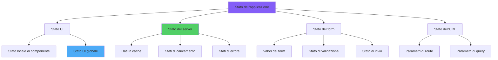
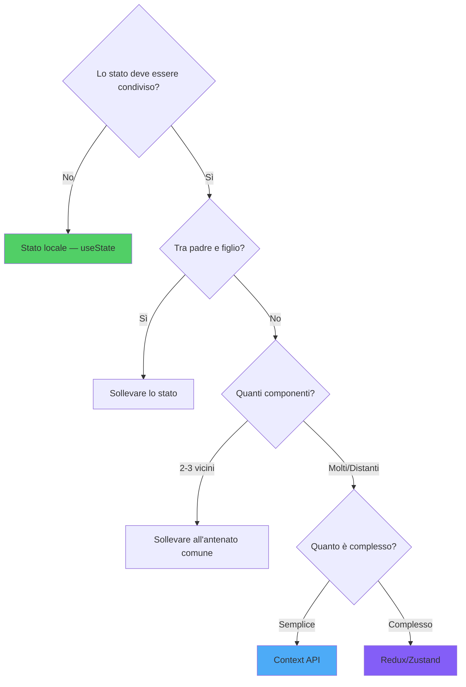
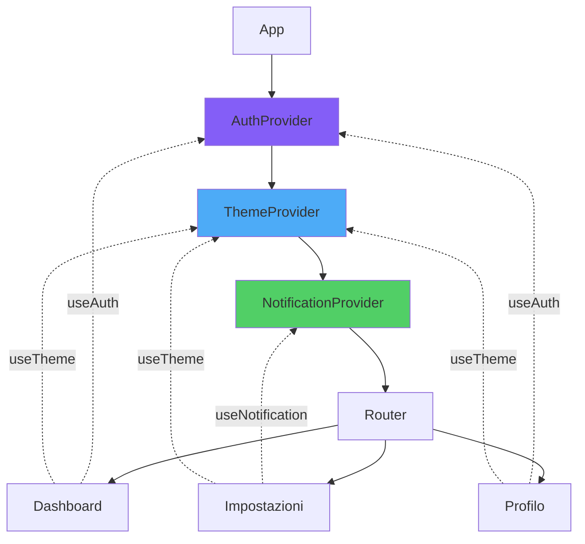
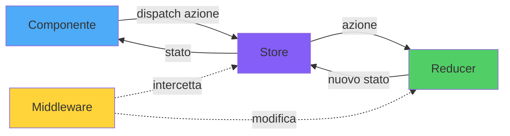
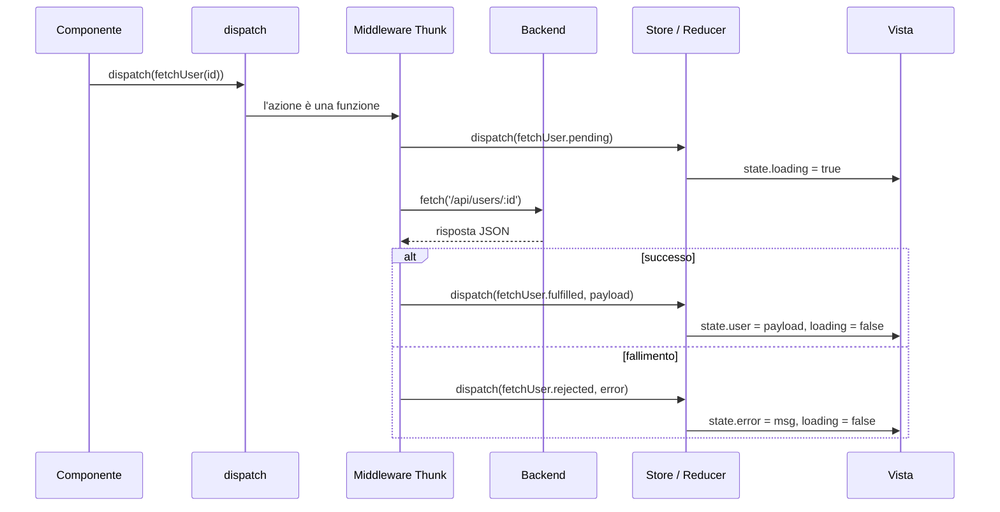
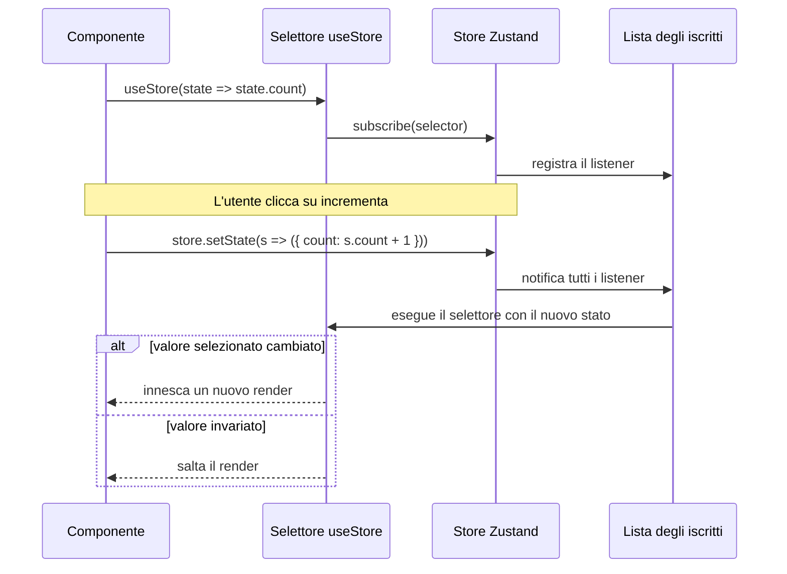
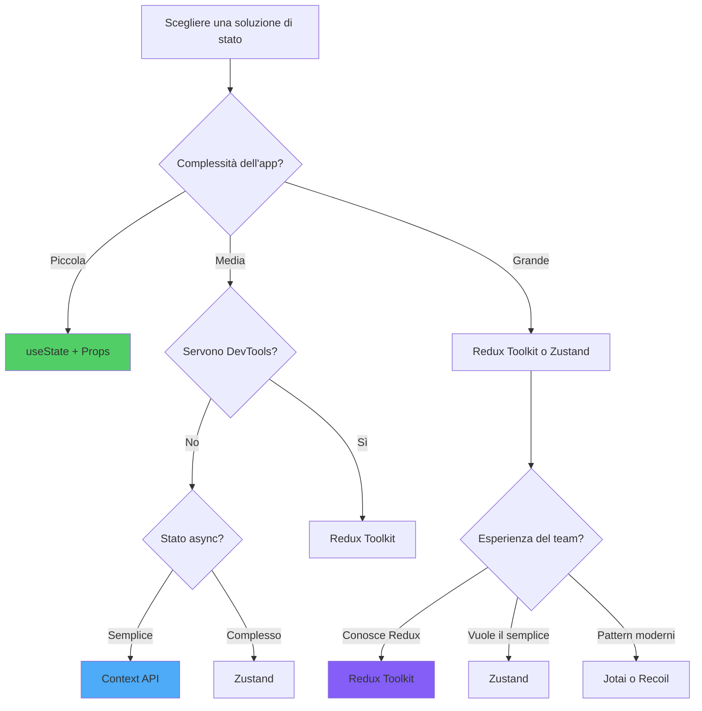

# Gestione dello Stato in React

> Strategie e librerie per gestire lo stato di un'applicazione React

---

## 1. State Management Paradigms

### Tipi di Stato

1. **Stato locale**: dentro un singolo componente (`useState`, `useReducer`).
2. **Stato sollevato**: condiviso fra fratelli tramite un antenato comune.
3. **Stato globale**: necessario in più rami dell'albero (Context, store dedicato).
4. **Stato del server**: dati remoti, cache (React Query, SWR).
5. **Stato dell'URL**: filtri, pagine, query string.
6. **Stato del form**: locale o gestito da librerie (React Hook Form).



### Regola Pratica

Inizia sempre dal **livello più basso possibile**. Sali solo quando lo stato deve essere condiviso o persistente.

---

## 2. Local vs Global State: Decision Framework

### Diagramma di Decisione

```
Lo stato è usato da un solo componente?
├─ Sì → useState / useReducer locale
└─ No → È usato da componenti fratelli?
       ├─ Sì → Sollevare allo stato dell'antenato comune
       └─ No → È dato remoto?
              ├─ Sì → React Query / SWR
              └─ No → Context API o store globale
```



### Errori Comuni

- Mettere troppe cose in Context globale → re-render eccessivi.
- Mantenere dati derivati nello stato → meglio calcolarli con `useMemo`.
- Duplicare dati server in stato locale → fonte di sincronizzazione mancata.

---

## 3. Context API: Simple Global State

### Albero dei Provider e portata dei consumatori

Ogni `Provider` inietta un valore nel sottoalbero al di sotto. I consumatori risalgono nell'albero fino al `Provider` corrispondente più vicino — l'ordine di composizione conta perché un provider interno può sovrascrivere uno esterno.



### Quando Usarlo

Per dati globali che cambiano raramente: tema, lingua, utente autenticato.

```tsx
const TemaContext = createContext<{ tema: 'chiaro' | 'scuro'; toggle: () => void } | null>(null);

function TemaProvider({ children }: { children: ReactNode }) {
  const [tema, setTema] = useState<'chiaro' | 'scuro'>('chiaro');
  const toggle = () => setTema(t => (t === 'chiaro' ? 'scuro' : 'chiaro'));
  return (
    <TemaContext.Provider value={{ tema, toggle }}>
      {children}
    </TemaContext.Provider>
  );
}

function useTema() {
  const ctx = useContext(TemaContext);
  if (!ctx) throw new Error('useTema fuori da TemaProvider');
  return ctx;
}
```

### Limiti

Context **non è ottimizzato** per aggiornamenti frequenti. Per stati che cambiano molto, considera Zustand o Jotai.

---

## 4. Redux Toolkit: Modern Redux

### Setup Moderno

Redux Toolkit (RTK) elimina la boilerplate del Redux classico.

```tsx
import { createSlice, configureStore } from '@reduxjs/toolkit';

const contatoreSlice = createSlice({
  name: 'contatore',
  initialState: { valore: 0 },
  reducers: {
    incrementa: (state) => { state.valore += 1; },
    decrementa: (state) => { state.valore -= 1; },
    impostaValore: (state, action: PayloadAction<number>) => { state.valore = action.payload; },
  },
});

export const { incrementa, decrementa, impostaValore } = contatoreSlice.actions;

export const store = configureStore({
  reducer: { contatore: contatoreSlice.reducer },
});
```

### Uso nel Componente

```tsx
const valore = useSelector((s: RootState) => s.contatore.valore);
const dispatch = useDispatch();
dispatch(incrementa());
```

---

## 5. Redux Core Concepts Deep Dive

### Flusso dei dati in Redux

Redux impone un flusso unidirezionale: un componente fa `dispatch` di un'azione, lo store invoca il reducer, che produce un nuovo stato, e i componenti sottoscritti vengono notificati.



### Concetti Chiave

- **Store**: singola fonte di verità.
- **Action**: oggetto descrittivo `{ type, payload }`.
- **Reducer**: funzione pura `(state, action) => newState`.
- **Selector**: funzione che estrae dati dallo store.
- **Dispatch**: invio di un'azione.

### Immer Integrato

In RTK puoi scrivere "mutazioni" nel reducer: Immer si occupa di produrre un nuovo stato immutabile.

---

## 6. Middleware and Async Operations

### Ciclo di vita di un thunk asincrono da capo a fondo

`createAsyncThunk` dispatcha automaticamente le azioni `pending`, `fulfilled` o `rejected` attorno alla tua funzione async. Il middleware si trova tra `dispatch` e il reducer: è qui che la funzione thunk viene effettivamente eseguita invece di essere inoltrata come azione ordinaria.



### Thunk

```tsx
import { createAsyncThunk } from '@reduxjs/toolkit';

export const caricaUtente = createAsyncThunk('utente/carica', async (id: string) => {
  const r = await fetch(`/api/utenti/${id}`);
  return r.json();
});

const utenteSlice = createSlice({
  name: 'utente',
  initialState: { dati: null, stato: 'idle' },
  reducers: {},
  extraReducers: (builder) => {
    builder
      .addCase(caricaUtente.pending, (s) => { s.stato = 'caricamento'; })
      .addCase(caricaUtente.fulfilled, (s, a) => { s.stato = 'pronto'; s.dati = a.payload; })
      .addCase(caricaUtente.rejected, (s) => { s.stato = 'errore'; });
  },
});
```

### Quando Usare Thunk vs React Query

- **Thunk**: quando il dato remoto è strettamente legato ad altri stati Redux.
- **React Query/SWR**: nella maggior parte dei casi, perché gestiscono cache, refetch, invalidation e stale data automaticamente.

---

## 7. Zustand: Minimalist State Management

### Come uno store fuori da React innesca il re-render dei componenti

Zustand mantiene lo stato in uno store JavaScript ordinario che vive fuori dall'albero React. I componenti si sottoscrivono tramite un selettore; quando lo store cambia, vengono ri-renderizzati solo i componenti il cui slice selezionato è cambiato.



### API Semplicissima

```tsx
import { create } from 'zustand';

const useContatore = create<{ valore: number; incrementa: () => void }>((set) => ({
  valore: 0,
  incrementa: () => set((s) => ({ valore: s.valore + 1 })),
}));

function Contatore() {
  const valore = useContatore((s) => s.valore);
  const incrementa = useContatore((s) => s.incrementa);
  return <button onClick={incrementa}>{valore}</button>;
}
```

### Vantaggi

- Niente Provider obbligatorio.
- Selector per evitare re-render inutili.
- Middleware per persistenza, devtools, redux compatibility.

---

## 8. Jotai: Atomic State Management

### Atomi

Jotai modella lo stato come piccoli "atomi" combinabili:

```tsx
import { atom, useAtom } from 'jotai';

const contatoreAtom = atom(0);
const doppioAtom = atom((get) => get(contatoreAtom) * 2);

function Comp() {
  const [valore, setValore] = useAtom(contatoreAtom);
  const [doppio] = useAtom(doppioAtom);
  return <button onClick={() => setValore((v) => v + 1)}>{valore} — {doppio}</button>;
}
```

### Quando Usarlo

Quando vuoi reactivity granulare senza store centrale, e ami il pattern atomico stile Recoil ma più leggero.

---

## 9. Recoil: Graph-Based State

### Concetti

- **atom**: unità di stato.
- **selector**: stato derivato.
- **family**: atomi parametrizzati.

Recoil è stato pionieristico ma oggi viene scelto meno spesso a favore di Jotai/Zustand. Resta valido per app già investite.

---

## 10. State Management Selection Matrix

### Albero decisionale



### Quale Libreria?

| Esigenza | Soluzione |
|----------|-----------|
| Stato di un singolo componente | `useState`/`useReducer` |
| Stato condiviso fra 2-3 componenti | sollevamento via props |
| Tema, autenticazione | Context API |
| Stato server (CRUD, cache) | React Query / SWR |
| Stato globale frequente | Zustand |
| Stato globale tipizzato e strutturato | Redux Toolkit |
| Reattività atomica | Jotai |

---

## Conclusion: State Management Mastery

### Conclusione

Non esiste una libreria "giusta". Tre principi guida:

1. **Comincia locale**, sali solo quando serve.
2. **Separa server state e client state**: usa React Query per i dati remoti.
3. **Scegli la libreria in base al team e alla scala**, non al hype.
