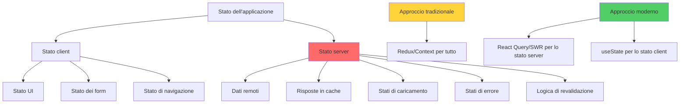
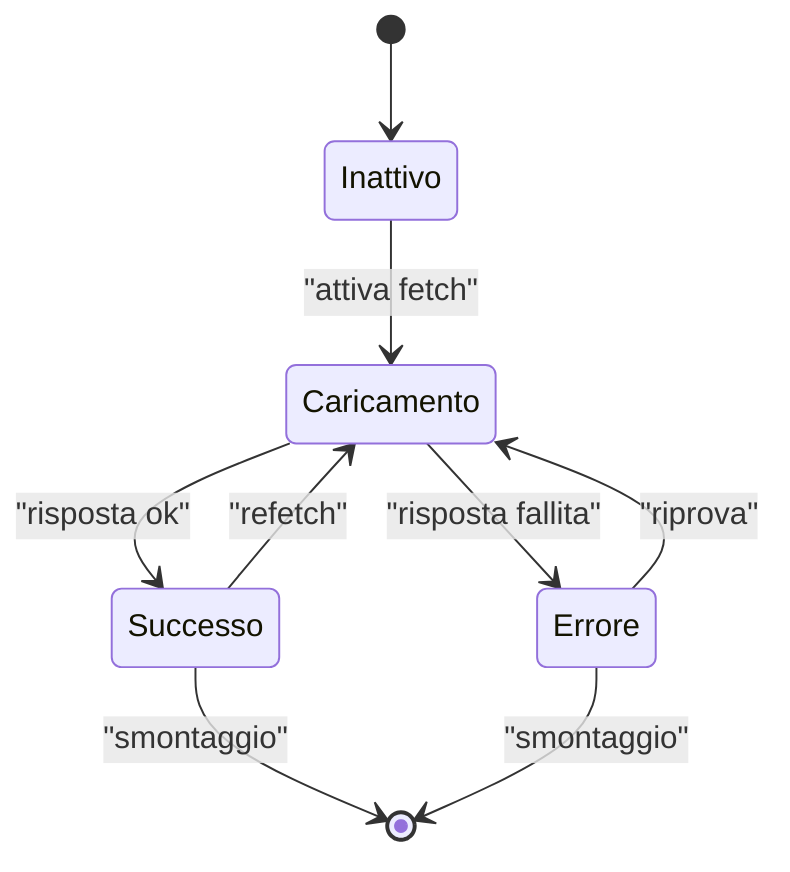
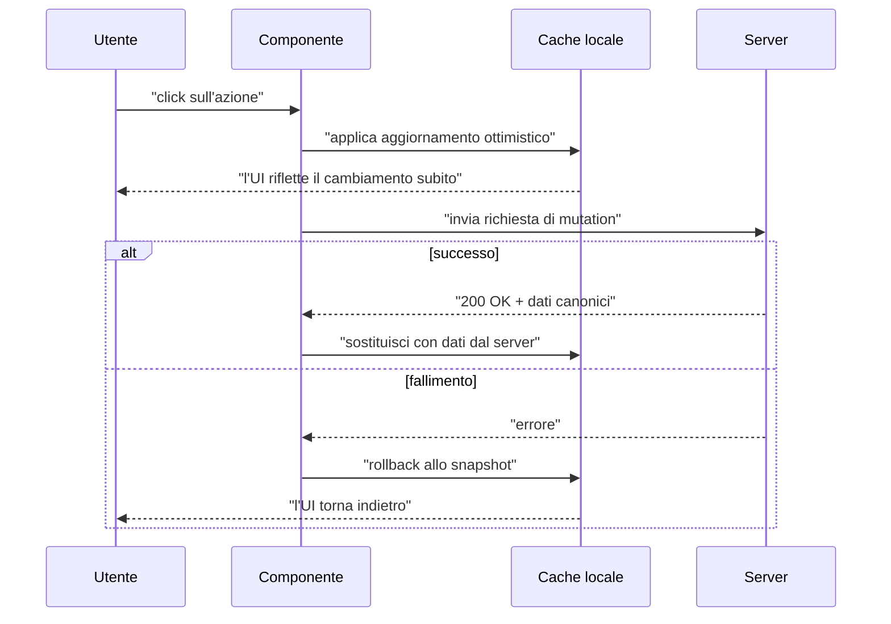
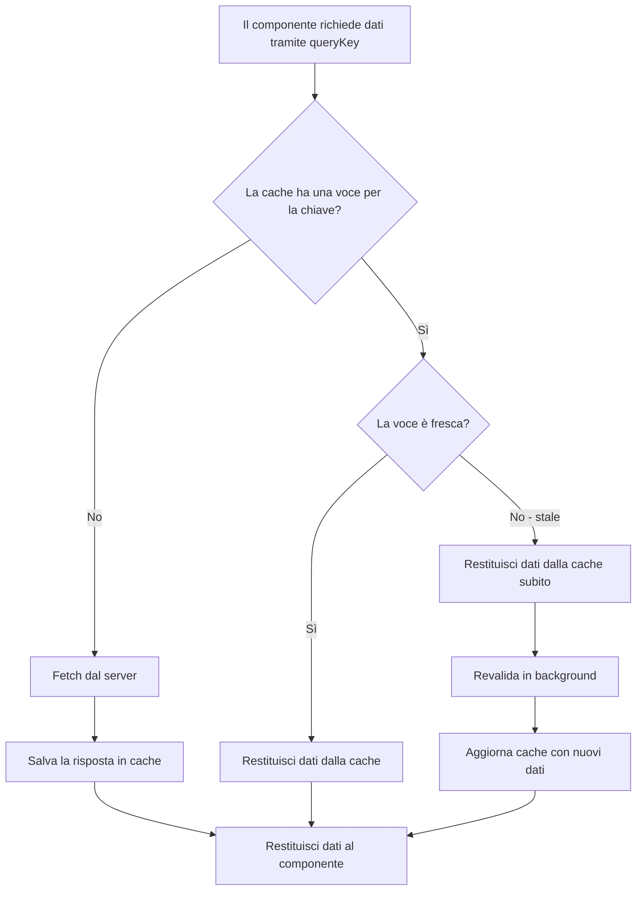
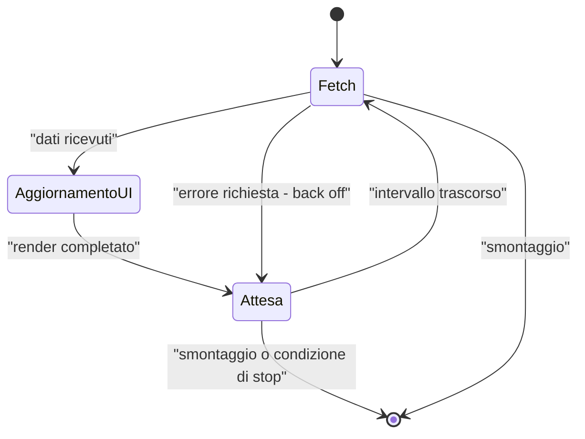
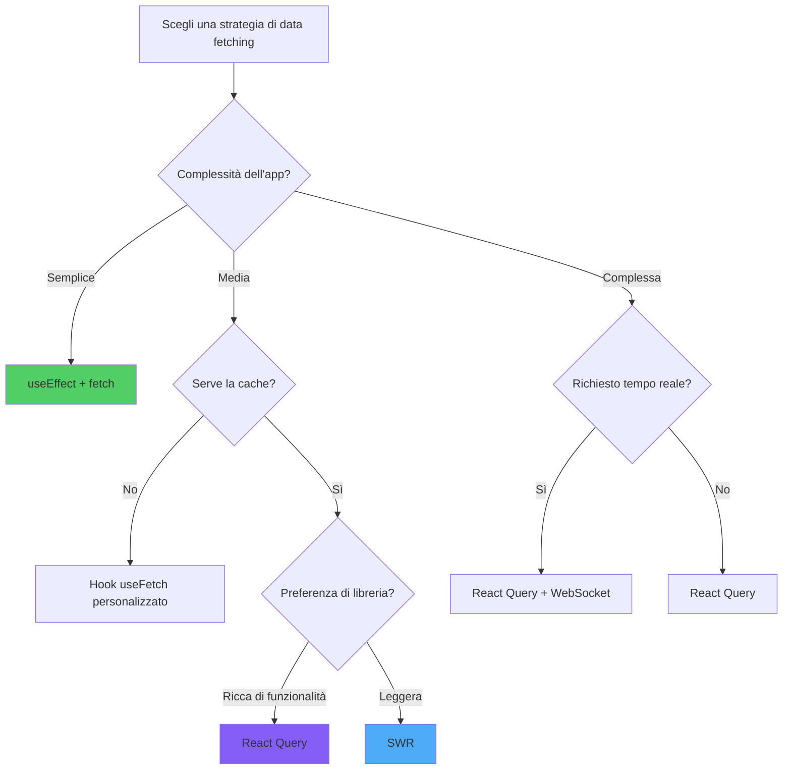

# Recupero Dati in React

> Strategie e librerie per gestire dati remoti in applicazioni React

---

## 1. Data Fetching Paradigms

### Approcci

1. **Imperativo**: `fetch` o `axios` dentro `useEffect`, gestendo manualmente stati di caricamento/errore.
2. **Dichiarativo**: librerie come React Query o SWR che gestiscono cache, dedup, refetch.
3. **Suspense** (React 18+): integrazione nativa con `<Suspense>` per loading boundary.
4. **Server Components** (Next.js, ecc.): fetch direttamente lato server.

### Stato server vs stato client

Lo stato server è asincrono, potenzialmente obsoleto ed esiste all'esterno dell'applicazione. Gli approcci moderni lo separano esplicitamente dallo stato client.



### Quando Cosa

- Progetti piccoli, una sola chiamata: `fetch` + `useEffect`.
- Tutto il resto: **React Query** è oggi lo standard de facto.

---

## 2. Native Fetch API and Axios

### Fetch Base

```tsx
useEffect(() => {
  let cancellato = false;
  fetch('/api/utenti')
    .then(r => {
      if (!r.ok) throw new Error('HTTP ' + r.status);
      return r.json();
    })
    .then(data => { if (!cancellato) setUtenti(data); })
    .catch(err => { if (!cancellato) setErrore(err); });
  return () => { cancellato = true; };
}, []);
```

### Axios

Axios offre intercettori, transform e gestione errori più completa di base:

```tsx
import axios from 'axios';

const api = axios.create({ baseURL: '/api', timeout: 5000 });
api.interceptors.request.use((cfg) => {
  cfg.headers.Authorization = `Bearer ${token}`;
  return cfg;
});
```

---

## 3. Loading States and Error Handling

### Ciclo di vita di una richiesta come macchina a stati

Modellare una richiesta fetch come macchina a stati finiti rende espliciti i quattro stati esclusivi e impedisce UI impossibili come "caricamento + errore mostrati insieme".



### Pattern Comune

```tsx
const [stato, setStato] = useState<'idle' | 'caricamento' | 'pronto' | 'errore'>('idle');
const [dati, setDati] = useState<Utente[] | null>(null);
const [errore, setErrore] = useState<Error | null>(null);

useEffect(() => {
  setStato('caricamento');
  fetch('/api/utenti')
    .then(r => r.json())
    .then(d => { setDati(d); setStato('pronto'); })
    .catch(e => { setErrore(e); setStato('errore'); });
}, []);
```

### Error Boundaries

Per errori di render:

```tsx
class ErrorBoundary extends Component<{ children: ReactNode }, { errore: Error | null }> {
  state = { errore: null };
  static getDerivedStateFromError(errore: Error) { return { errore }; }
  render() {
    if (this.state.errore) return <p>Qualcosa è andato storto: {this.state.errore.message}</p>;
    return this.props.children;
  }
}
```

---

## 4. React Query: Server State Management

### Concetto

React Query (TanStack Query) gestisce automaticamente:

- Cache delle risposte
- Dedup di richieste concorrenti
- Refetch su focus/finestra/rete
- Invalidazione e refetch programmatico
- Stati di caricamento, errore, success

### Setup

```tsx
import { QueryClient, QueryClientProvider, useQuery } from '@tanstack/react-query';

const queryClient = new QueryClient();

function App() {
  return (
    <QueryClientProvider client={queryClient}>
      <Utenti />
    </QueryClientProvider>
  );
}
```

### useQuery

```tsx
function Utenti() {
  const { data, isLoading, error } = useQuery({
    queryKey: ['utenti'],
    queryFn: () => fetch('/api/utenti').then(r => r.json()),
  });

  if (isLoading) return <p>Caricamento…</p>;
  if (error) return <p>Errore: {(error as Error).message}</p>;
  return <ul>{data.map((u: Utente) => <li key={u.id}>{u.nome}</li>)}</ul>;
}
```

### useMutation

```tsx
const mutazione = useMutation({
  mutationFn: (nuovo: Utente) => fetch('/api/utenti', { method: 'POST', body: JSON.stringify(nuovo) }),
  onSuccess: () => queryClient.invalidateQueries({ queryKey: ['utenti'] }),
});

mutazione.mutate({ nome: 'Mario' });
```

---

## 5. SWR: Stale-While-Revalidate

### Alternativa Più Leggera

```tsx
import useSWR from 'swr';

const fetcher = (url: string) => fetch(url).then(r => r.json());

function Utenti() {
  const { data, error, isLoading } = useSWR('/api/utenti', fetcher);
  if (isLoading) return <p>Caricamento…</p>;
  if (error) return <p>Errore</p>;
  return <Lista utenti={data} />;
}
```

### Differenze con React Query

- SWR è più piccolo e con API minimale.
- React Query ha più funzionalità (mutation, query cancellation, paginazione, infinito) e devtools.

---

## 6. Optimistic Updates

### Flusso di aggiornamento ottimistico

L'UI applica il cambiamento localmente prima che la rete risolva, poi conferma con la risposta del server o fa rollback in caso di errore. È ciò che rende le interazioni istantanee.



### Concetto

Aggiornare l'UI **prima** della conferma del server, rollback in caso di errore.

```tsx
const mutazione = useMutation({
  mutationFn: aggiornaTodo,
  onMutate: async (nuovo) => {
    await queryClient.cancelQueries({ queryKey: ['todos'] });
    const precedente = queryClient.getQueryData(['todos']);
    queryClient.setQueryData(['todos'], (vecchio: Todo[]) =>
      vecchio.map(t => t.id === nuovo.id ? nuovo : t)
    );
    return { precedente };
  },
  onError: (_err, _nuovo, contesto) => {
    queryClient.setQueryData(['todos'], contesto?.precedente);
  },
  onSettled: () => {
    queryClient.invalidateQueries({ queryKey: ['todos'] });
  },
});
```

---

## 7. Cache Management Strategies

### Decisione hit/miss della cache

Ogni query consulta prima la cache tramite la sua chiave. Un hit fresco restituisce istantaneamente senza costo di rete; un miss (o voce stale) attiva un fetch reale e popola la cache per la prossima volta.



### Politiche di Cache

- **staleTime**: dopo quanto tempo una query diventa "stale" (default 0).
- **gcTime** (ex cacheTime): quanto i dati restano in memoria dopo l'unmount (default 5min).
- **refetchOnWindowFocus**: rifetch quando torni alla tab.

### Pattern Tipici

- Liste con `staleTime` lungo, dettagli con `staleTime` corto.
- Invalidare cache correlate dopo una mutation.
- Prefetch al hover di un link per UX istantanea.

---

## 8. Polling and Real-Time Updates

### Ciclo di polling

Il polling è un loop: fetch, aggiorna UI, attendi, ripeti — finché un segnale di stop (smontaggio, condizione di successo, o perdita di focus della tab) interrompe il ciclo.



### Polling

```tsx
useQuery({
  queryKey: ['stato'],
  queryFn: fetchStato,
  refetchInterval: 5000,
});
```

### WebSocket

Combina React Query (snapshot iniziale) + WebSocket (aggiornamenti push):

```tsx
useEffect(() => {
  const ws = new WebSocket('/api/stream');
  ws.onmessage = (msg) => {
    queryClient.setQueryData(['stato'], JSON.parse(msg.data));
  };
  return () => ws.close();
}, []);
```

---

## 9. Advanced Patterns

### Pagination

```tsx
const { data } = useQuery({
  queryKey: ['utenti', pagina],
  queryFn: () => fetch(`/api/utenti?pagina=${pagina}`).then(r => r.json()),
  keepPreviousData: true,
});
```

### Infinite Scroll

```tsx
const { data, fetchNextPage, hasNextPage } = useInfiniteQuery({
  queryKey: ['post'],
  queryFn: ({ pageParam = 0 }) => fetchPost(pageParam),
  getNextPageParam: (last) => last.nextCursor,
});
```

### Suspense con React Query

```tsx
useSuspenseQuery({ queryKey: ['utente', id], queryFn: () => fetchUtente(id) });
```

---

## 10. Data Fetching Strategy Selection

### Albero di decisione

Una guida rapida per scegliere una strategia in base alla complessità dell'app e ai requisiti.



### Matrice di Decisione

| Esigenza | Soluzione |
|----------|-----------|
| Una sola GET semplice | `fetch` + `useEffect` |
| Più chiamate con cache | React Query / SWR |
| Sincronizzazione real-time | WebSocket + React Query |
| Form submission + invalidazione | useMutation |
| Pagination/infinito | useInfiniteQuery |
| SSR/Server Components | Next.js / Remix |

---

## Conclusion: Mastering Data Fetching

### Conclusione

Il "data fetching" non è solo HTTP: è **gestione di server state**. React Query lo modella bene. Tre regole:

1. **Non duplicare server state in stato locale**.
2. **Cache è la regola, fetch è l'eccezione**: pensa a cosa invalida cosa.
3. **Loading e error** sono parte dell'UX, non un dettaglio: progettali sin dall'inizio.
