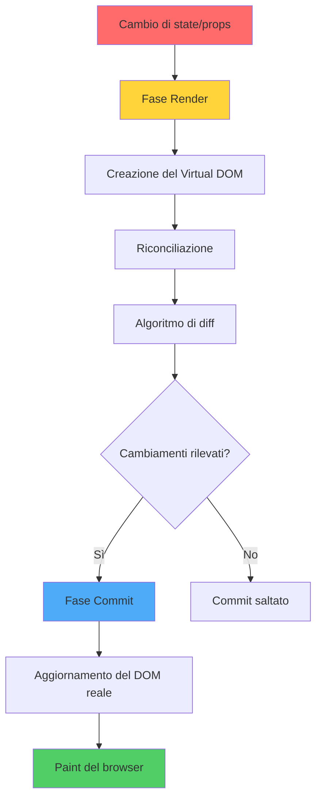
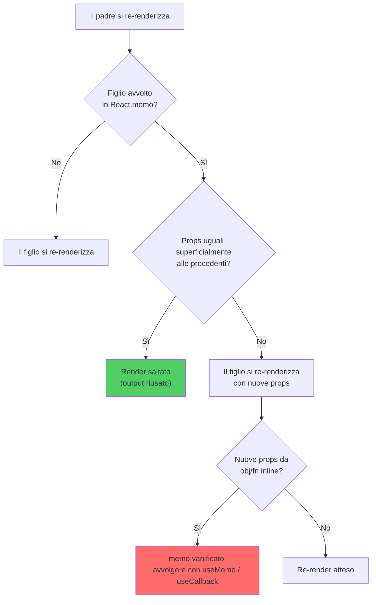
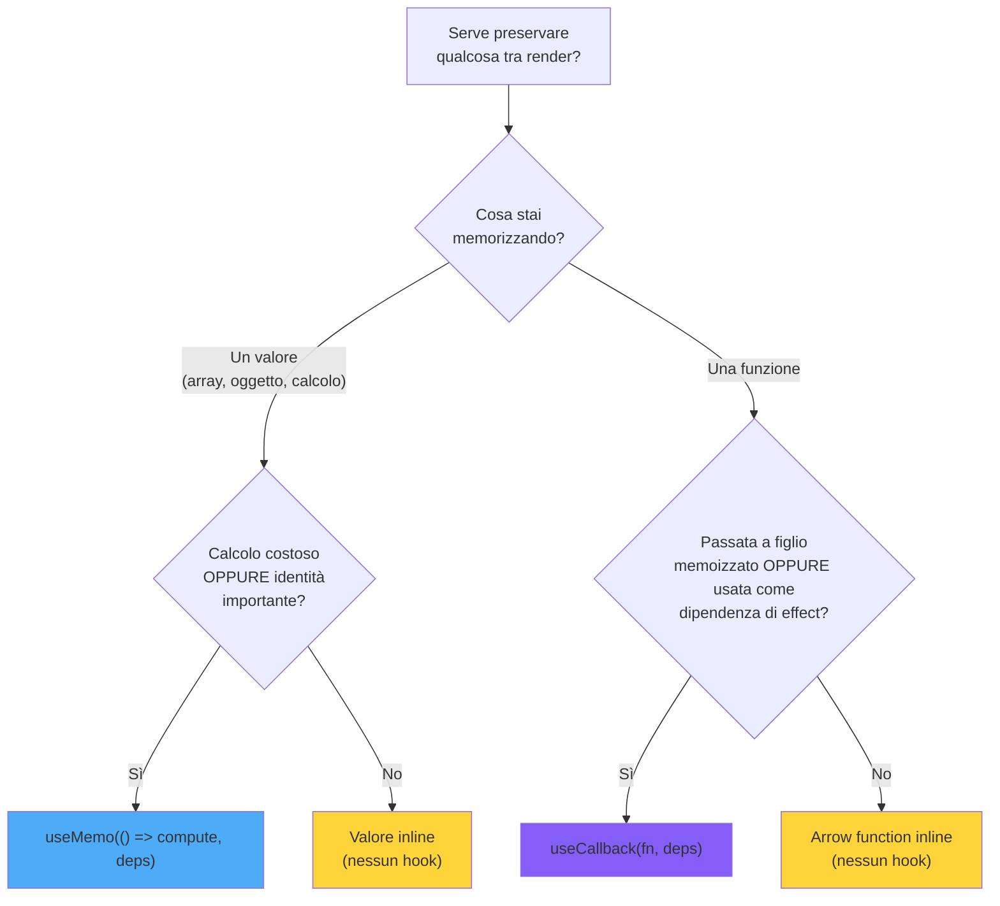
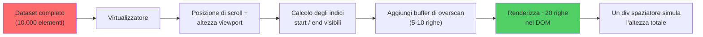
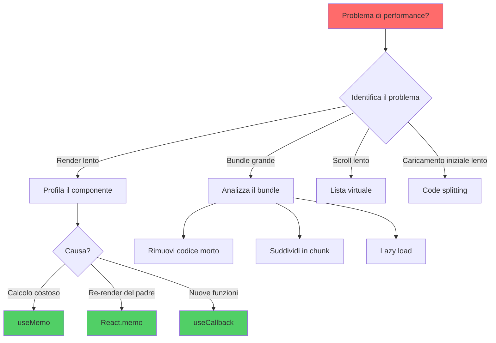

# Ottimizzazione delle Prestazioni in React

> Tecniche per applicazioni React veloci e reattive

---

## 1. React Rendering Behavior

### Il processo di rendering

Il processo di rendering di React si compone di due fasi principali: **render** (creazione del Virtual DOM) e **commit** (aggiornamento del DOM reale).



### Quando React Renderizza

Un componente si renderizza di nuovo quando:

1. Il suo **stato** cambia.
2. Le sue **props** cambiano.
3. Il **context** che consuma cambia.
4. Il suo **componente padre** si renderizza (a meno di memoization).

### Render vs Commit

- **Render**: React calcola il nuovo Virtual DOM.
- **Commit**: applica le differenze al DOM reale.

Un render senza differenze nel DOM è economico ma non gratis: i calcoli costosi durante il render impattano comunque.

---

## 2. React.memo: Preventing Re-renders

### Albero decisionale di React.memo

Quando il padre si re-renderizza, React attraversa questa decisione per capire se un figlio memoizzato debba renderizzarsi. Il confronto superficiale è la porta critica: oggetti/funzioni inline lo vanificano.



### Come Funziona

`React.memo` memoizza un componente, saltando i render se le props sono superficialmente uguali.

```tsx
const Pesante = React.memo(function Pesante({ dati }: { dati: Dati }) {
  return <div>{calcola(dati)}</div>;
});
```

### Quando Funziona

- Props **stabili** (riferimenti immutati tra render).
- Componenti **costosi** da renderizzare.
- Re-render del padre **frequenti**.

### Quando NON Aiuta

- Props ricreate ogni render (oggetti/funzioni inline).
- Componenti già leggeri.
- Componenti che ricevono `children`.

---

## 3. useMemo and useCallback Patterns

### useMemo vs useCallback: quale usare?

Entrambi memorizzano qualcosa tra render, ma cose diverse. Quest'albero aiuta a scegliere lo strumento giusto — e ricorda che la risposta giusta è spesso "nessuno dei due".



### useMemo per Valori

Quando il calcolo è pesante o serve preservare l'identità referenziale:

```tsx
const items = useMemo(() => filtra(dati, filtro), [dati, filtro]);
```

### useCallback per Funzioni

Quando passi una funzione a un figlio memoizzato:

```tsx
const onClick = useCallback(() => fai(id), [id]);
```

### Errore Comune

Avvolgere **tutto** in useMemo/useCallback non è gratuito: ogni chiamata ha un costo. Memoizza solo dove c'è un beneficio misurabile.

---

## 4. Code Splitting and Lazy Loading

### React.lazy + Suspense

```tsx
const Dashboard = lazy(() => import('./Dashboard'));

<Suspense fallback={<Loader />}>
  <Dashboard />
</Suspense>
```

### Split Strategici

- **Per route**: ogni pagina diventa un chunk separato.
- **Per heavy feature**: editor, grafici, modali con dipendenze pesanti.
- **Per condizione**: feature visibili solo a subset di utenti.

---

## 5. Bundle Size Optimization

### Strategie

1. **Tree shaking**: usa `import { foo } from 'libreria'` invece di `import * as`.
2. **Sostituisci dipendenze pesanti**: moment → date-fns/dayjs.
3. **Polyfill mirati**: usa `core-js` con `useBuiltIns: 'usage'`.
4. **Compressione**: brotli/gzip lato server.
5. **CDN per librerie comuni**: React stesso può venire da CDN in alcuni setup.

### Analisi

Tool: `vite-bundle-visualizer`, `webpack-bundle-analyzer`, `rollup-plugin-visualizer`.

---

## 6. Virtual Scrolling for Large Lists

### Come funziona la virtualizzazione

Invece di renderizzare in anticipo tutte le 10.000 righe, un virtualizzatore misura il viewport, calcola quale fetta della lista è visibile (più un piccolo buffer per uno scroll fluido) e monta solo quelle righe. Il resto è rappresentato da un singolo spaziatore alto.



### Problema

Renderizzare 10.000 elementi in DOM rallenta tutto.

### Soluzione

Renderizza solo gli elementi visibili. Librerie: `react-window`, `@tanstack/react-virtual`.

```tsx
import { FixedSizeList } from 'react-window';

<FixedSizeList height={500} width={300} itemSize={32} itemCount={items.length}>
  {({ index, style }) => <div style={style}>{items[index].nome}</div>}
</FixedSizeList>
```

---

## 7. Profiling with React DevTools

### Profiler

React DevTools offre un tab "Profiler" che registra i render e mostra:

- Quali componenti si sono renderizzati
- Quanto è durato ogni render
- Perché si è renderizzato (props, state, parent)

### Strategia

1. Profila prima di ottimizzare.
2. Identifica i 2-3 componenti più costosi.
3. Memoizza/refattorizza solo quelli.
4. Verifica il miglioramento misurato.

---

## 8. Advanced Optimization Techniques

### Tecniche

- **Splitting state**: stato globale spezzato in slice per ridurre il blast radius dei re-render.
- **Context selectors**: librerie come `use-context-selector` per evitare re-render quando solo una parte del valore cambia.
- **Concurrent features** (React 18): `useTransition`, `useDeferredValue` per UI responsive durante calcoli pesanti.

### useTransition

```tsx
const [isPending, startTransition] = useTransition();

const onChange = (val: string) => {
  setInput(val); // urgente
  startTransition(() => {
    setLista(filtra(big, val)); // non urgente
  });
};
```

---

## 9. Performance Monitoring

### Metriche Web Vitals

- **LCP** (Largest Contentful Paint)
- **FID** (First Input Delay) / **INP** (Interaction to Next Paint)
- **CLS** (Cumulative Layout Shift)

Tool: `web-vitals` npm, Lighthouse, RUM (Real User Monitoring) come Sentry o Datadog.

### Budget di Performance

Imposta soglie nel CI:
- Bundle iniziale < X KB
- LCP < 2,5s
- Render del componente principale < 50ms

---

## 10. Optimization Strategy Selection

### Matrice decisionale



### Quando Usare Cosa

| Problema | Soluzione |
|----------|-----------|
| Bundle grande | Code splitting, tree shaking |
| Liste lunghe | Virtualizzazione |
| Calcoli pesanti | useMemo, Web Worker |
| Re-render eccessivi | React.memo, selectors |
| Form lento | Componenti non controllati |
| Navigazione lenta | Prefetch chunks |

---

## Conclusion: Performance Mastery

### Conclusione

La regola d'oro: **misura prima, ottimizza dopo**. L'ottimizzazione prematura è il più grande nemico della manutenibilità. Tre punti chiave:

1. **Profila con React DevTools** prima di toccare codice.
2. **Memoizza solo dove c'è un beneficio reale**.
3. **Performance è UX**: budget e metriche dovrebbero essere parte del CI.
