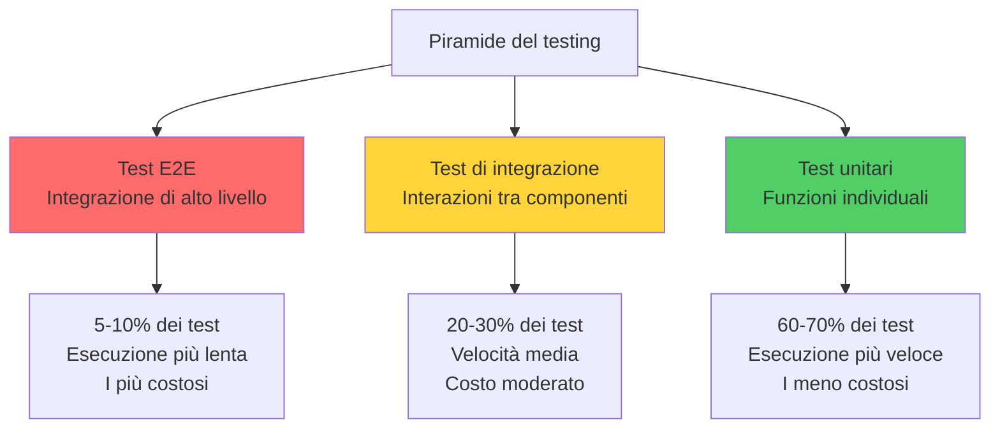
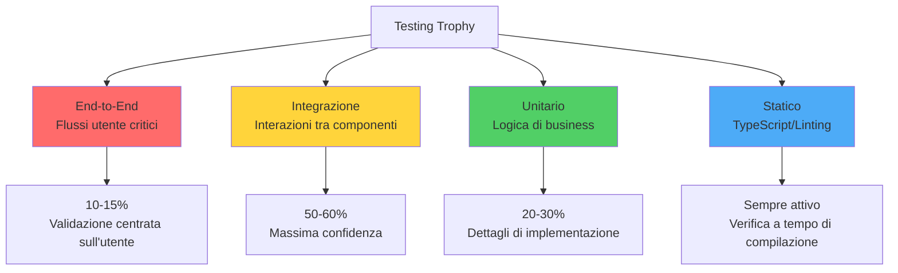
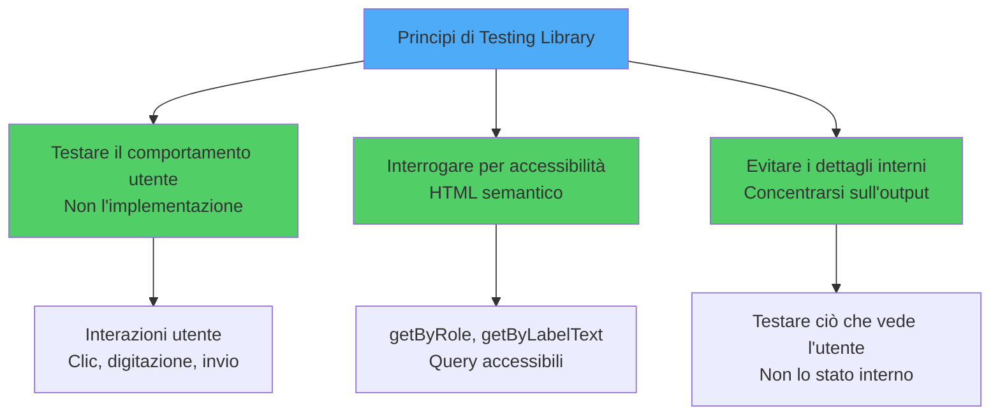
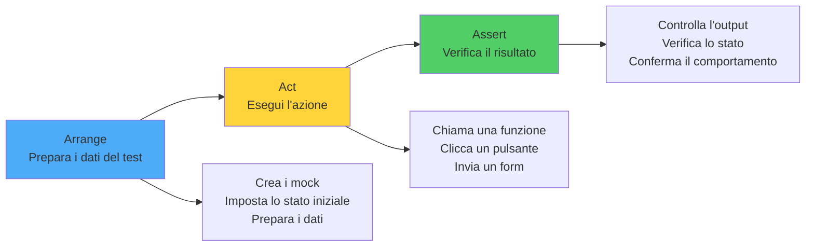
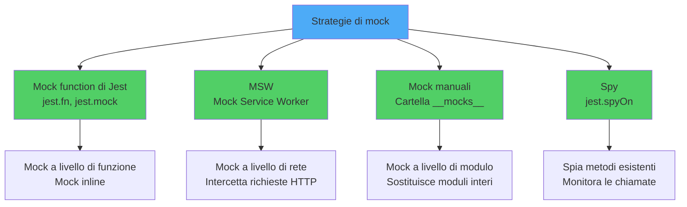
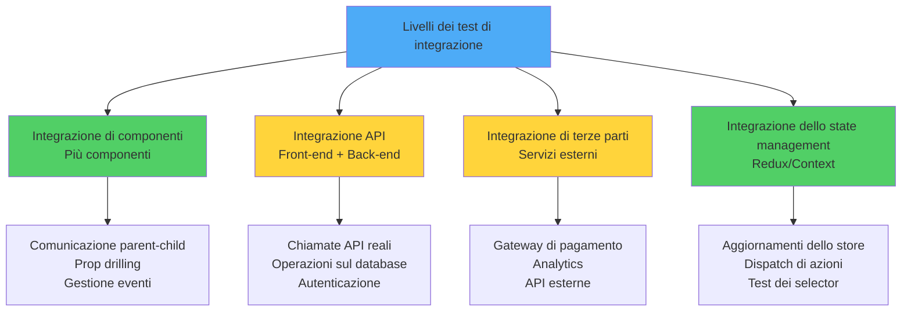
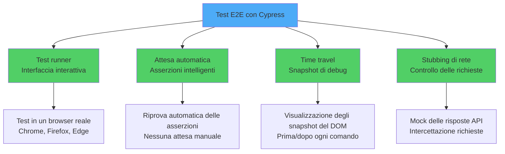
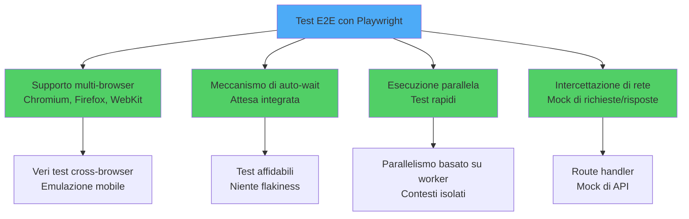
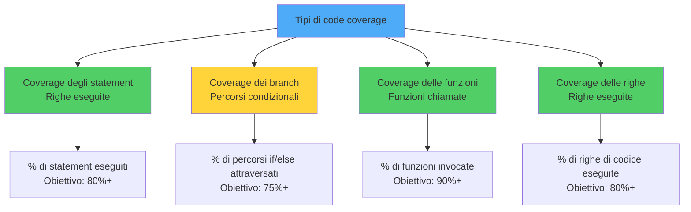

# Testing in React

> Strategie e strumenti per testare componenti, hooks e applicazioni React

---

## 1. Testing Fundamentals and Philosophy

### Piramide del Testing

```
       ╱─────────╲
      ╱   E2E    ╲       <- pochi, lenti, alta confidenza
     ╱─────────────╲
    ╱  Integrazione ╲    <- molti, moderati
   ╱─────────────────╲
  ╱       Unit         ╲ <- moltissimi, veloci, focalizzati
```

Rappresentata come grafo, la piramide evidenzia le proporzioni e il costo relativo di ogni livello:



### Modello "Testing Trophy" (ecosistema React)

Reso popolare da Kent C. Dodds, il trofeo sposta il baricentro verso i test di integrazione e aggiunge una base statica (TypeScript, linting):



### Ciclo Test-Driven Development (TDD)

Il TDD si basa su tre fasi ripetute in loop, comunemente chiamate **Red-Green-Refactor**:

```mermaid
graph LR
    A[Scrivere un test che fallisce<br/>RED] --> B[Scrivere il codice minimo<br/>GREEN]
    B --> C[Refactoring del codice<br/>REFACTOR]
    C --> A

    A --> A1[Definire il comportamento atteso<br/>Mentalità "test first"]
    B --> B1[Implementare la funzionalità<br/>Far passare il test]
    C --> C1[Migliorare la qualità del codice<br/>Mantenere lo stato verde]

    style A fill:#ff6b6b
    style B fill:#51cf66
    style C fill:#4dabf7
```

### Filosofia "Test Like a User"

Test che si focalizzano sul **comportamento osservabile** invece che sui dettagli implementativi. Cita Kent C. Dodds: *"The more your tests resemble the way your software is used, the more confidence they can give you."*

---

## 2. Unit Testing with Jest

### Setup di Base

```tsx
// somma.test.ts
import { somma } from './somma';

describe('somma', () => {
  it('somma due numeri positivi', () => {
    expect(somma(2, 3)).toBe(5);
  });
});
```

### Matcher Essenziali

- `toBe`: uguaglianza per primitivi.
- `toEqual`: confronto profondo di oggetti.
- `toContain`: array/stringhe.
- `toThrow`: una funzione lancia.
- `toHaveBeenCalledWith`: spy chiamato con argomenti specifici.

### Lifecycle

`beforeAll`, `beforeEach`, `afterEach`, `afterAll` per setup/teardown.

---

## 3. Component Testing with React Testing Library

### Filosofia di React Testing Library

React Testing Library incoraggia a interrogare il DOM come farebbe un utente — tramite ruoli ARIA, label e testo visibile — invece di ispezionare lo stato interno:



### Esempio

```tsx
import { render, screen } from '@testing-library/react';
import userEvent from '@testing-library/user-event';
import { Contatore } from './Contatore';

it('incrementa al click', async () => {
  const utente = userEvent.setup();
  render(<Contatore />);

  expect(screen.getByText('Conteggio: 0')).toBeInTheDocument();
  await utente.click(screen.getByRole('button', { name: /incrementa/i }));
  expect(screen.getByText('Conteggio: 1')).toBeInTheDocument();
});
```

### Query Consigliate

1. `getByRole` (preferito, accessibile)
2. `getByLabelText` (form)
3. `getByPlaceholderText`
4. `getByText`
5. `getByTestId` (ultima risorsa)

---

## 4. Writing Effective Test Cases

### Pattern AAA

- **Arrange**: prepara stato e mock.
- **Act**: esegui l'azione.
- **Assert**: verifica il risultato atteso.

Visualizzato come flusso lineare:



### Nomi Descrittivi

```tsx
it('mostra messaggio di errore quando l’email è invalida', ...);
it('disabilita il pulsante mentre il form viene inviato', ...);
```

Evita: `it('funziona', ...)` o `it('test 1', ...)`.

### Una Asserzione per Concetto

Più asserzioni vanno bene se misurano lo stesso comportamento. Suddividi i test quando descrivono concetti diversi.

---

## 5. Mocking API Calls and Dependencies

### Panoramica delle strategie di mock

Sono possibili diversi livelli di isolamento, dal mock di funzione fino all'intercettazione di rete:



### Mock di fetch

```tsx
beforeEach(() => {
  global.fetch = jest.fn(() =>
    Promise.resolve({
      ok: true,
      json: () => Promise.resolve({ id: 1, nome: 'Mario' }),
    }) as any
  );
});
```

### MSW (Mock Service Worker)

Approccio moderno: intercetta le richieste HTTP a livello di rete, mantieni i componenti inalterati:

```tsx
import { rest } from 'msw';
import { setupServer } from 'msw/node';

const server = setupServer(
  rest.get('/api/utenti', (req, res, ctx) => res(ctx.json([{ id: 1, nome: 'Mario' }])))
);

beforeAll(() => server.listen());
afterEach(() => server.resetHandlers());
afterAll(() => server.close());
```

---

## 6. Integration Testing Strategies

### Architettura dei test di integrazione

I test di integrazione coprono più livelli: componenti, API, servizi di terze parti e gestione dello stato:



### Cosa Testare

Una funzionalità completa: form + invio + risposta API + UI aggiornata. Mantieni il mock il più vicino al confine (rete, DB), non al livello del componente.

### Esempio

```tsx
it('completa il flusso di login', async () => {
  const utente = userEvent.setup();
  render(<App />);

  await utente.type(screen.getByLabelText(/email/i), 'mario@example.com');
  await utente.type(screen.getByLabelText(/password/i), 'segreta');
  await utente.click(screen.getByRole('button', { name: /accedi/i }));

  expect(await screen.findByText(/benvenuto, mario/i)).toBeInTheDocument();
});
```

---

## 7. End-to-End Testing with Cypress

### Architettura di Cypress

Cypress combina un test runner interattivo, l'attesa automatica, il time travel e lo stubbing di rete:



### Setup

```bash
npm install --save-dev cypress
npx cypress open
```

### Esempio

```js
describe('Login', () => {
  it('login con credenziali valide', () => {
    cy.visit('/login');
    cy.findByLabelText(/email/i).type('mario@example.com');
    cy.findByLabelText(/password/i).type('segreta');
    cy.findByRole('button', { name: /accedi/i }).click();
    cy.findByText(/benvenuto/i).should('be.visible');
  });
});
```

### Vantaggi

- Esecuzione reale nel browser.
- Time travel debugger.
- Network mocking incorporato.

---

## 8. End-to-End Testing with Playwright

### Architettura di Playwright

Playwright punta a test multi-browser realmente paralleli, con attesa integrata e intercettazione di rete:



### Esempio

```ts
import { test, expect } from '@playwright/test';

test('login', async ({ page }) => {
  await page.goto('/login');
  await page.getByLabel('Email').fill('mario@example.com');
  await page.getByLabel('Password').fill('segreta');
  await page.getByRole('button', { name: 'Accedi' }).click();
  await expect(page.getByText('Benvenuto')).toBeVisible();
});
```

### Cypress vs Playwright

- **Cypress**: ottimo developer experience, ecosistema maturo.
- **Playwright**: multi-browser (Chromium, Firefox, WebKit), più veloce, parallelizzazione nativa.

---

## 9. Test Coverage and Quality Metrics

### Coverage

```bash
jest --coverage
```

Quattro metriche principali misurano la coverage, ognuna con la propria soglia obiettivo:



Soglie tipiche:
- Statements: 80%
- Branches: 75%
- Functions: 80%

### Attenzione

**100% di coverage non garantisce qualità**. Una linea coperta può non essere veramente testata. Le metriche servono come early warning, non come obiettivo finale.

---

## 10. Testing Best Practices and Patterns

### Best Practice

1. **Test deterministici**: niente date casuali, niente API reali.
2. **Test indipendenti**: ognuno può girare da solo.
3. **Naming chiaro**: il nome dice cosa fa il test.
4. **Setup minimale**: usa helpers e factory.
5. **Test veloci**: split unit/integration/e2e.
6. **Run in CI**: blocca i merge se i test falliscono.

### Anti-pattern

- Testare l'implementazione (es. nomi di metodi privati).
- Snapshot enormi e fragili.
- Mock troppo profondi che riproducono la logica.
- Test che girano in sequenza dipendendo l'uno dall'altro.

---

## Conclusion

### Conclusione

Il testing in React è una disciplina. Tre cose da ricordare:

1. **Testa come un utente**: usa React Testing Library e query accessibili.
2. **Mock al confine**: usa MSW invece di mock manuali profondi.
3. **Piramide bilanciata**: molti unit, alcuni integration, pochi e2e critici.
