# Prerequisiti: cosa ti serve prima di React Native

> Le conoscenze di React, JavaScript, tooling e mobile che devi possedere prima di scrivere il tuo primo componente React Native.

---

## Table of Contents

1. [React (Non-Negotiable)](#1-react-non-negotiable)
2. [JavaScript / TypeScript](#2-javascript--typescript)
3. [Tooling](#3-tooling)
4. [Mobile Concepts](#4-mobile-concepts)

---

## 1. React (Non Negoziabile)

### Perché la conoscenza di React viene prima di tutto

React Native non è un framework separato che per caso assomiglia a React. **È** React — lo stesso modello a componenti, gli stessi hooks, lo stesso motore di reconciliation — eseguito su un renderer diverso. Sul web, React dialoga con `react-dom` e produce elementi `<div>` e `<span>`. In React Native, React dialoga con un bridge (o con la JSI della nuova architettura) e produce istanze native `UIView` e `android.view.View`. Il codice dei componenti che scrivi è lo stesso. Se non comprendi già React, ti troverai a combattere due curve di apprendimento contemporaneamente, e le perderai entrambe.

Ecco il modello mentale chiave. React di per sé è semplicemente una libreria che decide **cosa** debba apparire sullo schermo — costruisce un albero di elementi e capisce cosa è cambiato. **Non** sa come disegnare alcunché. Il disegno è delegato a un "renderer". `react-dom` è il renderer per i browser. `react-native` è il renderer per i telefoni. Stesso cervello, mani diverse.

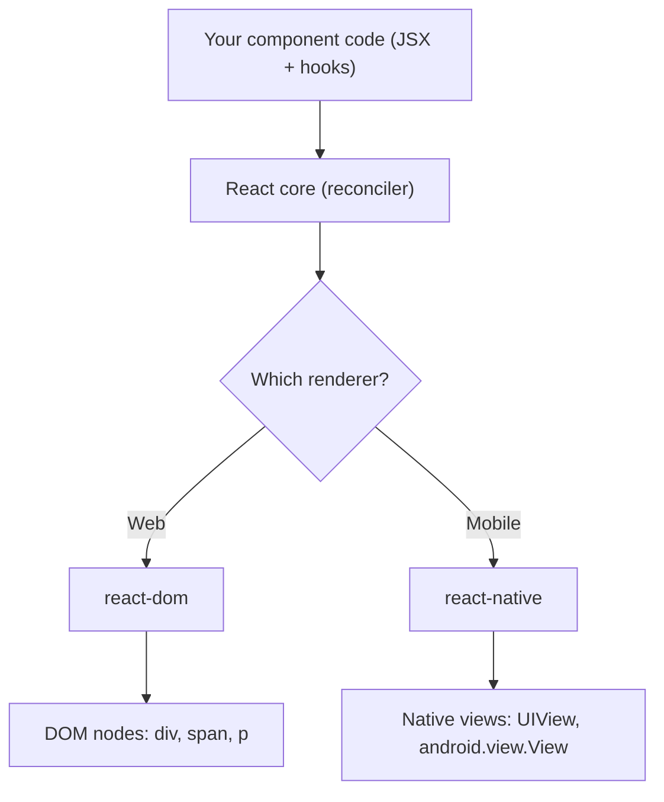

Questa è una checklist, non un tutorial. Se qualsiasi voce qui sotto ti risulta poco familiare, torna ai capitoli su React e colma la lacuna prima di proseguire. Considera un "no" su una qualsiasi riga come uno stop definitivo.

### Componenti funzionali, JSX, props e state

Ogni schermata React Native è un albero di componenti funzionali. Devi sentirti a tuo agio nello scrivere un componente che accetta props, mantiene state locale e restituisce JSX. I componenti a classe funzionano ancora, ma l'ecosistema — librerie di navigazione, librerie di animazione, gestori di state — assume ovunque funzioni e hooks. Non perdere tempo a imparare il ciclo di vita delle classi per il lavoro con React Native.

```tsx
// This component works identically in React web and React Native
// (swap <div> / <p> for <View> / <Text> and you're done)
type GreetingProps = {
  name: string;
};

function Greeting({ name }: GreetingProps) {
  const [visits, setVisits] = useState(0);

  useEffect(() => {
    setVisits(prev => prev + 1);
  }, []);

  return (
    <View>
      <Text>Hello, {name}. Visit #{visits}</Text>
    </View>
  );
}
```

Sul web restituisci `<div>` e `<p>`. In React Native restituisci `<View>` e `<Text>`. La conoscenza di React — la tipizzazione delle props, l'inizializzazione dello state, l'effect — è identica.

C'è una regola di JSX che mette in difficoltà ogni sviluppatore web nella sua prima ora: **in React Native, il testo grezzo deve risiedere all'interno di un componente `<Text>`.** Sul web, `<div>Hello</div>` va bene. In React Native, `<View>Hello</View>` è un crash a runtime. `<View>` è più simile a un `<div>` con `display: flex` integrato — un contenitore di layout — e non può contenere caratteri liberi.

| Web (react-dom) | React Native | Note |
|-----------------|--------------|-------|
| `<div>` | `<View>` | Contenitore di layout. Flexbox di default, niente testo direttamente al suo interno. |
| `<p>`, `<span>`, `<h1>` | `<Text>` | L'UNICO posto in cui è ammesso testo grezzo. |
| `` | `<Image>` | Richiede width/height esplicite; nessuna dimensione intrinseca da una URL. |
| `<button>` | `<Pressable>` / `<Button>` | Nessuno stile predefinito su `Pressable`; lo costruisci tu. |
| `<input>` | `<TextInput>` | |
| File CSS / className | `StyleSheet.create` + prop `style` | Nessuna cascata CSS, nessun foglio di stile globale. |

> **Errore comune:** `Invariant Violation: Text strings must be rendered within a <Text> component.` Quasi sempre significa che hai inserito del testo (o uno spazio finale, o un `{condition && 'text'}` vagante) direttamente dentro un `<View>`. Avvolgilo in un `<Text>`.

### Tutti gli hook fondamentali

Hai bisogno di esperienza pratica con ogni hook di questo elenco prima di mettere mano a React Native, perché le librerie specifiche per il mobile vi si appoggiano pesantemente:

| Hook | Perché è importante in RN |
|------|----------------------|
| `useState` | State locale dell'UI — modali, toggle, campi di form |
| `useEffect` | Sottoscrizione a eventi del dispositivo (tastiera, stato dell'app, deep links) |
| `useRef` | Mantenere riferimenti a view native per metodi imperativi (scroll, focus, measure) |
| `useMemo` | Trasformazioni costose di liste su hardware mobile limitato |
| `useCallback` | Callback stabili per gli elementi renderizzati di `FlatList` (evita re-render completi di liste lunghe) |
| `useContext` | Tema, locale, autenticazione — le app RN li propagano in profondità |
| `useReducer` | State complesso di schermata in cui più campi cambiano insieme |

Se hai usato solo `useState` e `useEffect`, non sei pronto. Le performance di React Native dipendono dal sapere quando ricorrere a `useMemo` e `useCallback` — i dispositivi mobili non hanno il margine per fare re-render con leggerezza.

Ecco un esempio concreto di `useMemo` + `useCallback` che si guadagnano il loro posto in una schermata con lista, lo scenario di performance più comune in assoluto nelle app mobili:

```tsx
function ContactList({ contacts, query }: { contacts: Contact[]; query: string }) {
  // useMemo: only re-filter when the inputs actually change.
  // On a 5,000-row list on a budget Android phone, re-filtering on every
  // keystroke-driven re-render would drop frames.
  const filtered = useMemo(
    () => contacts.filter(c => c.name.toLowerCase().includes(query.toLowerCase())),
    [contacts, query],
  );

  // useCallback: a STABLE function identity so FlatList doesn't think
  // renderItem changed on every render (which would re-render every row).
  const renderItem = useCallback(
    ({ item }: { item: Contact }) => <ContactRow contact={item} />,
    [],
  );

  return <FlatList data={filtered} renderItem={renderItem} keyExtractor={c => c.id} />;
}
```

> **Consiglio da esperto:** Il web perdona i render sprecati perché il diff del DOM è economico e gira sulla stessa macchina veloce davanti a cui siede l'utente. Su un telefono Android da 150 dollari, quello stesso spreco si manifesta come uno stutter visibile. `useMemo`/`useCallback` non sono un'ottimizzazione prematura nel codice delle liste in RN — sono il minimo indispensabile.

### Custom hooks e regole degli hooks

Le librerie di navigazione come React Navigation espongono hooks (`useNavigation`, `useFocusEffect`). Le librerie di animazione espongono hooks (`useSharedValue`, `useAnimatedStyle`). Consumerai decine di custom hooks e ne scriverai di tuoi (`useKeyboardHeight`, `useAppState`, `useDebounce`). Se non comprendi come i custom hooks compongono gli hooks integrati, o perché gli hooks non possono essere chiamati in modo condizionale, produrrai bug che restano invisibili finché non causano un crash.

```tsx
// A custom hook you'll write within your first week of RN
function useAppState() {
  const [appState, setAppState] = useState(AppState.currentState);

  useEffect(() => {
    const sub = AppState.addEventListener('change', setAppState);
    return () => sub.remove();
  }, []);

  return appState;
}
```

Questo è puro React — `useState` più `useEffect` con una cleanup. L'unica parte specifica di RN è `AppState`. Se il pattern degli hook ti risulta poco familiare, fermati qui e studia prima gli hooks.

Le "regole degli hooks" esistono perché React identifica ogni hook in base all'**ordine** in cui viene chiamato, non in base a un nome. Ogni render deve chiamare gli stessi hooks nella stessa sequenza. Se nascondi un hook dietro un `if`, l'ordine si sposta tra un render e l'altro e la contabilità interna di React punta allo slot sbagliato.

```tsx
// WRONG — hook called conditionally. The hook order changes when
// `isLoggedIn` flips, and React's state slots get misaligned.
function Profile({ isLoggedIn }: { isLoggedIn: boolean }) {
  if (isLoggedIn) {
    const [name, setName] = useState(''); // ❌ sometimes called, sometimes not
  }
  // ...
}

// RIGHT — always call the hook, branch on the value instead.
function Profile({ isLoggedIn }: { isLoggedIn: boolean }) {
  const [name, setName] = useState(''); // ✅ always called, always in order
  if (!isLoggedIn) return <LoginPrompt />;
  // ...
}
```

> **Trappola:** La regola ESLint `react-hooks/rules-of-hooks` intercetta la maggior parte delle violazioni al momento della scrittura. Installa ESLint fin dal primo giorno (vedi la sezione Tooling) — su mobile non hai una console del browser a farti da balia, quindi lascia che il linter sia la tua prima linea di difesa.

### Il modello di rendering

React Native usa lo stesso reconciler di React web. Quando lo state cambia, il componente fa re-render, React confronta l'albero virtuale e solo i nodi modificati vengono inviati al lato nativo. Comprendere i re-render, le chiavi di reconciliation e il motivo per cui restituire un nuovo oggetto da un genitore costringe i figli a fare re-render non è conoscenza opzionale — è la principale leva di performance a tua disposizione.

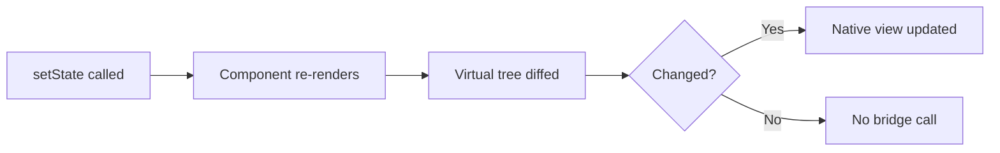

Sul web, un re-render non necessario costa un aggiornamento economico del DOM. Su mobile, un re-render non necessario può attraversare il bridge da JS a nativo e innescare un passaggio di layout sul thread dell'UI. Il costo è più alto, quindi la conoscenza conta di più.

Una trappola subdola che colpisce allo stesso modo gli sviluppatori web e mobile: passare verso il basso come prop un oggetto, un array o una funzione appena creati vanifica la memoization, perché un nuovo riferimento è `!==` rispetto al precedente anche quando i contenuti sono identici.

```tsx
// Every render creates a NEW style object and a NEW onPress function.
// A memoized <Row> would re-render anyway because the props "changed".
<Row style={{ padding: 8 }} onPress={() => doThing(id)} />

// Fix: hoist the style (StyleSheet.create) and stabilize the callback.
const styles = StyleSheet.create({ row: { padding: 8 } });
const onPress = useCallback(() => doThing(id), [id]);
<Row style={styles.row} onPress={onPress} />
```

> **Consiglio da esperto:** `StyleSheet.create({...})` non è soltanto una convenzione. Registra i tuoi stili una volta sola e consente a RN di passare un ID intero attraverso il bridge anziché un oggetto nuovo a ogni render. È al tempo stesso un guadagno di performance e un riferimento stabile — due benefici in uno.

### Refs, handle imperativi e Suspense

Chiamerai `.scrollToIndex()` su una ref di `FlatList`, `.focus()` su una ref di `TextInput` e `.measure()` su una ref di `View`. `useRef` e `forwardRef` / `useImperativeHandle` non sono casi limite in React Native — sono strumenti quotidiani.

```tsx
// Imperative focus — extremely common in forms where tapping
// "Next" on the keyboard should jump to the following field.
function LoginForm() {
  const passwordRef = useRef<TextInput>(null);

  return (
    <>
      <TextInput
        placeholder="Email"
        returnKeyType="next"
        onSubmitEditing={() => passwordRef.current?.focus()} // imperative jump
      />
      <TextInput ref={passwordRef} placeholder="Password" secureTextEntry />
    </>
  );
}
```

Le refs sono la via di fuga per quel ristretto insieme di operazioni che sono intrinsecamente imperative — dare il focus a un input, scorrere una lista fino a una riga, misurare la posizione in pixel di una view. Sul web ricorrevi alle refs per chiamare `.focus()` o `.play()` su un `<video>`; in RN vale lo stesso istinto, solo applicato a componenti nativi.

Suspense è più recente nel mondo mobile, ma le librerie di data-fetching (React Query, SWR) e la New Architecture di React Native sono sempre più costruite attorno a esso. Dovresti comprendere i confini di `<Suspense>` e come interagiscono con la fallback UI a livello concettuale, anche se non li hai ancora usati in produzione.

---

## 2. JavaScript / TypeScript

### Funzionalità ES2022+ che userai ogni giorno

I progetti React Native vengono transpilati da Metro (il bundler), quindi hai a disposizione la sintassi moderna fin da subito. Il codice che leggi — sorgenti di librerie, risposte su Stack Overflow, documentazione ufficiale — dà per scontato che tu conosca tutto questo con disinvoltura:

```tsx
// Destructuring (props, hook returns, API responses)
const { userId, token } = route.params;
const [items, setItems] = useState<Item[]>([]);

// Spread (immutable state updates, merging style objects)
const updated = { ...user, name: newName };
const combined = StyleSheet.compose(baseStyle, overrideStyle);

// Optional chaining (deeply nested API responses)
const city = response?.data?.address?.city ?? 'Unknown';

// Nullish coalescing (default values that respect 0 and '')
const pageSize = config.pageSize ?? 20;

// Template literals, array methods (map, filter, find, reduce)
const ids = users.filter(u => u.isActive).map(u => u.id);
```

Se qualcuno di questi ti risulta poco familiare, non proseguire. Il codice React Native è denso di destructuring e optional chaining. Leggerlo sarà doloroso senza disinvoltura.

Una distinzione che causa bug reali: `??` (nullish coalescing) **non** è lo stesso di `||` (or logico). `||` tratta `0`, `''` e `false` come "mancanti"; `??` tratta in quel modo solo `null` e `undefined`. In una schermata delle impostazioni in cui `0` è un valore valido (volume, luminosità, un conteggio), usare `||` sovrascrive silenziosamente lo `0` dell'utente con il tuo valore di default.

```tsx
const volume = settings.volume || 10; // ❌ user's volume of 0 becomes 10
const volume = settings.volume ?? 10; // ✅ only undefined/null falls back to 10
```

> **Trappola:** `a?.b.c` cortocircuita l'INTERA catena a `undefined` se `a` è nullish — non lancia eccezioni. Ma `(a?.b).c` lancia un'eccezione se `a` è nullish, perché le parentesi costringono `.c` a essere eseguito su `undefined`. Mantieni il `?.` che scorre attraverso ogni passaggio incerto.

### Promise, async/await e propagazione degli errori

Ogni chiamata di rete, ogni lettura da storage, ogni richiesta di permesso in React Native è asincrona. Devi sentirti a tuo agio nel concatenare `async/await`, propagare gli errori con try/catch e comprendere cosa succede quando una Promise viene rifiutata all'interno di un `useEffect`.

```tsx
// A pattern you'll write hundreds of times in RN
useEffect(() => {
  let cancelled = false;

  async function loadProfile() {
    try {
      const res = await fetch(`https://api.example.com/user/${id}`);
      if (!res.ok) throw new Error(`HTTP ${res.status}`);
      const data = await res.json();
      if (!cancelled) setProfile(data);
    } catch (err) {
      if (!cancelled) setError(err instanceof Error ? err.message : 'Unknown');
    }
  }

  loadProfile();
  return () => { cancelled = true; };
}, [id]);
```

Il pattern del flag `cancelled` è cruciale su mobile. Quando un utente lascia una schermata, il componente viene smontato, ma la richiesta di rete continua. Senza il flag, chiami `setState` su un componente smontato. Sul web questo è un warning; su mobile può causare bug di navigazione subdoli.

Questo diagramma mostra perché il flag è importante — la sequenza temporale di un tocco-e-via rapido:

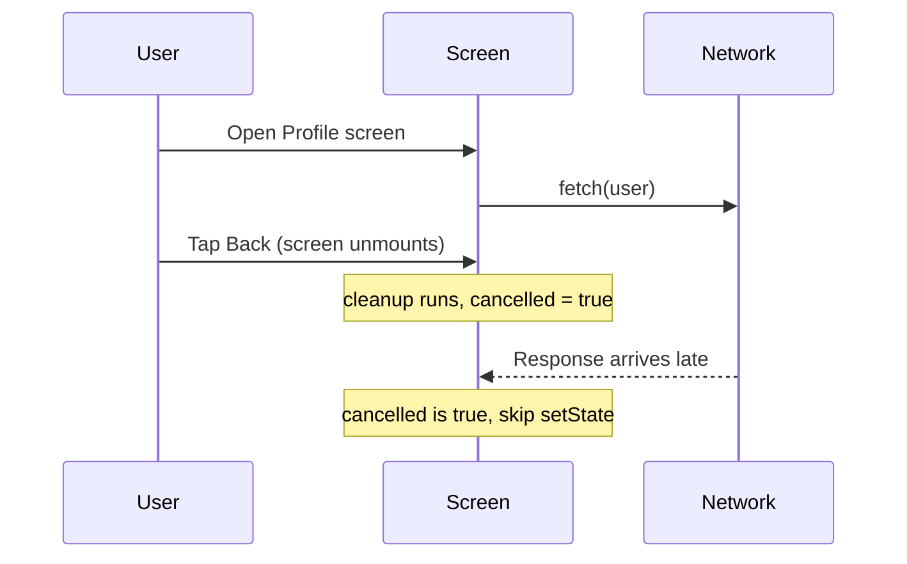

> **Errore comune:** Marcare come `async` la callback dell'effect stessa — `useEffect(async () => {...})`. Una funzione async restituisce una Promise, ma `useEffect` si aspetta che il valore di ritorno sia una funzione di cleanup (o niente). React tratterà la Promise come una "funzione di cleanup" e la tua vera cleanup non verrà mai eseguita. Dichiara sempre una funzione `async` interna e chiamala, come mostrato sopra.

### Closure ed event loop

Sul web, i bug delle closure si manifestano come state obsoleto negli event handler. Su mobile, gli stessi bug si manifestano nelle callback dei gesti, nei driver delle animazioni e nei listener di eventi nativi — e sono più difficili da debuggare perché non puoi semplicemente aprire i DevTools del browser.

```tsx
// The classic stale closure bug — even more painful in RN
function BrokenTimer() {
  const [count, setCount] = useState(0);

  useEffect(() => {
    const id = setInterval(() => {
      // count is captured from the first render — always 0
      setCount(count + 1); // stuck at 1
    }, 1000);
    return () => clearInterval(id);
  }, []); // empty deps = effect runs once, closure captures initial count

  // Fix: use functional update
  // setCount(prev => prev + 1);
}
```

Perché succede? Una closure "congela" le variabili che riesce a vedere nel momento in cui la funzione viene creata. La callback di `setInterval` è stata creata durante il primo render, quando `count` era `0`, quindi vede per sempre `0`. L'aggiornamento funzionale `setCount(prev => prev + 1)` aggira la trappola chiedendo a React il valore *corrente* invece di leggere quello obsoleto catturato.

Devi anche comprendere l'event loop — in particolare il fatto che del lavoro sincrono di lunga durata sul thread JS blocca il bridge e congela le animazioni. Se non sai perché `JSON.parse` su un payload da 2 MB congela lo scroll, non sei pronto.

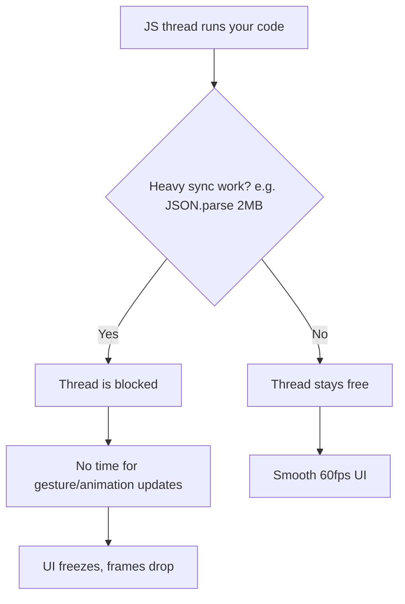

> **Consiglio da esperto:** React Native (nell'architettura classica) esegue il tuo JavaScript su un singolo thread, separato dal thread nativo dell'UI. Finché il thread JS tiene il passo, le animazioni gestite nativamente restano fluide — ma qualsiasi cosa tu faccia in modo sincrono in JS (parsing, ordinamento di un array enorme, un loop serrato) blocca tutto ciò che controlli. Sposta il lavoro pesante altrove, suddividilo in blocchi o portalo fuori dal thread JS (es. `InteractionManager`, worklets) invece di eseguirlo inline durante un'interazione.

### TypeScript: generics, utility types, discriminated unions

React Native nel 2026 è TypeScript-first. Il template ufficiale viene fornito con TypeScript. I parametri di navigazione, le risposte delle API e le props dei componenti traggono tutti vantaggio da una tipizzazione forte.

```tsx
// Generics: you'll type API responses and hook returns
async function fetchData<T>(url: string): Promise<T> {
  const res = await fetch(url);
  return res.json() as Promise<T>;
}

// Utility types: Partial for optional updates, Pick for subsets
type UserUpdate = Partial<Pick<User, 'name' | 'email' | 'avatar'>>;

// Discriminated unions: great for screen states
type ScreenState =
  | { status: 'loading' }
  | { status: 'error'; message: string }
  | { status: 'success'; data: User[] };

function renderScreen(state: ScreenState) {
  switch (state.status) {
    case 'loading': return <ActivityIndicator />;
    case 'error':   return <Text>{state.message}</Text>;
    case 'success': return <UserList data={state.data} />;
  }
}

// as const: useful for action types and config objects
const ROUTES = {
  HOME: 'Home',
  PROFILE: 'Profile',
  SETTINGS: 'Settings',
} as const;

type RouteName = typeof ROUTES[keyof typeof ROUTES];
// => 'Home' | 'Profile' | 'Settings'
```

Le discriminated unions meritano un'attenzione particolare perché si mappano alla perfezione sul ciclo di vita di ogni schermata che carica dati. Il campo condiviso `status` (il "discriminante") consente a TypeScript di *restringere* il tipo all'interno di ogni `case` — nel ramo `'error'` sa che `message` esiste; nel ramo `'success'` sa che `data` esiste. Questo rende impossibili gli stati impossibili: non potrai mai leggere accidentalmente `state.data` mentre `status` è `'loading'`, perché quel campo non esiste in quella variante.

| Funzionalità TS | Cosa ti garantisce in RN | Uso tipico |
|------------|----------------------|-------------|
| Generics `<T>` | Un unico helper tipizzato per molte forme di risposta | `fetchData<User>(url)` |
| `Partial<T>` | Tutto-opzionale per aggiornamenti/patch | Form di modifica, body `PATCH` |
| `Pick<T, K>` / `Omit<T, K>` | Ritagliare un sottoinsieme di un tipo esistente | Props derivate da un modello |
| Discriminated union | Stati di schermata/render esaustivi e sicuri | loading / error / success |
| `as const` | Congelare i literal in tipi string-literal ristretti | Nomi di rotte, tipi di azione |

> **Trappola:** Il sistema di tipi di React Navigation è uno dei setup di generics più complessi che incontrerai. Se non riesci a leggere `NativeStackScreenProps<RootStackParamList, 'Profile'>` e a capire cosa significa, ripassa i generics prima di iniziare.

---

## 3. Tooling

### Package manager: npm, yarn, pnpm

I progetti React Native usano gli stessi package manager Node.js dei progetti web. L'ecosistema si è ormai per lo più assestato: **yarn** (Classic o Berry) è il più comune nei progetti RN, ma **npm** funziona benissimo e **pnpm** sta guadagnando terreno. Scegline uno e imparalo bene.

| Manager | Punti di forza | Quando usarlo |
|---------|-----------|-------------|
| **npm** | Incluso con Node, zero setup, va bene per RN | Progetti individuali, percorso più semplice, default in CI |
| **yarn (Classic/Berry)** | Il più comune nelle repo RN esistenti, veloce, maturo | Quando entri in un team che lo usa già |
| **pnpm** | Efficiente su disco (store condiviso), dipendenze rigorose | Monorepo, molti progetti su una sola macchina |

> **Trappola:** Non mescolare mai i manager in una stessa repo. Un progetto con sia un `package-lock.json` sia uno `yarn.lock` risolverà alberi di dipendenze diversi a seconda di chi esegue `install`, e i moduli nativi di RN sono esattamente il tipo di dipendenza in cui una deriva di versione si trasforma in un build rotto. Committa un solo lockfile, cancella gli altri.

Ciò che conta più di quale manager scegli:

- **Lockfile.** `package-lock.json`, `yarn.lock` o `pnpm-lock.yaml` devono essere committati. React Native è notoriamente sensibile alle discrepanze di versione delle dipendenze — un bump di versione minore in un modulo nativo può rompere il tuo build iOS. Se non committi il tuo lockfile, l'`install` del tuo collega scarica versioni diverse e il suo build fallisce mentre il tuo funziona. Non è ipotetico; succede ogni settimana.

- **Semver.** Devi saper leggere `^1.2.3` e sapere che consente `1.x.x` ma non `2.0.0`. Devi sapere che `~1.2.3` consente solo `1.2.x`. Le librerie React Native introducono frequentemente breaking change in versioni minori (l'ecosistema si muove in fretta e non tutti seguono il semver in modo rigoroso), quindi capire cosa il tuo lockfile fissa e cosa lascia fluttuare è essenziale.

| Range | Consente | Blocca | Significato |
|-------|--------|--------|-------------|
| `1.2.3` | solo `1.2.3` | tutto il resto | Pin esatto |
| `~1.2.3` | `1.2.3` → `1.2.x` | `1.3.0` | Solo aggiornamenti di patch |
| `^1.2.3` | `1.2.3` → `1.x.x` | `2.0.0` | Aggiornamenti minor + patch |
| `*` | qualsiasi cosa | niente | Non farlo mai in RN |

```bash
# Commands you should be able to run without thinking
npm install                    # Install from lockfile
npm install react-native-svg  # Add a dependency
npm ls react-native            # Check installed version
npx react-native doctor       # Diagnose environment issues
```

### Git: branching, rebasing, risoluzione dei conflitti

Le release mobile sono più strutturate dei deploy web. Tipicamente avrai un branch `main`, branch di feature e branch di release. Devi sentirti a tuo agio con:

- Creare branch e passare da uno all'altro
- Fare rebase dei branch di feature su `main` per mantenere pulita la history
- Risolvere i conflitti di merge in `package.json` e nei lockfile (sono comuni e fastidiosi)
- Fare cherry-pick di una fix da `main` in un branch di release quando un bug critico deve essere distribuito

Perché il mobile è più orientato ai branch rispetto al web? Sul web, distribuisci una fix e ogni utente ce l'ha al successivo caricamento della pagina. Su mobile, una versione viene **congelata** nel momento in cui arriva allo store — gli utenti su v1.2 restano su v1.2 finché non aggiornano. Quindi i team mantengono in vita un branch di release per ogni versione distribuita, per riportare indietro hotfix critici, mentre `main` corre avanti con il nuovo lavoro. Ecco a cosa serve il cherry-pick.

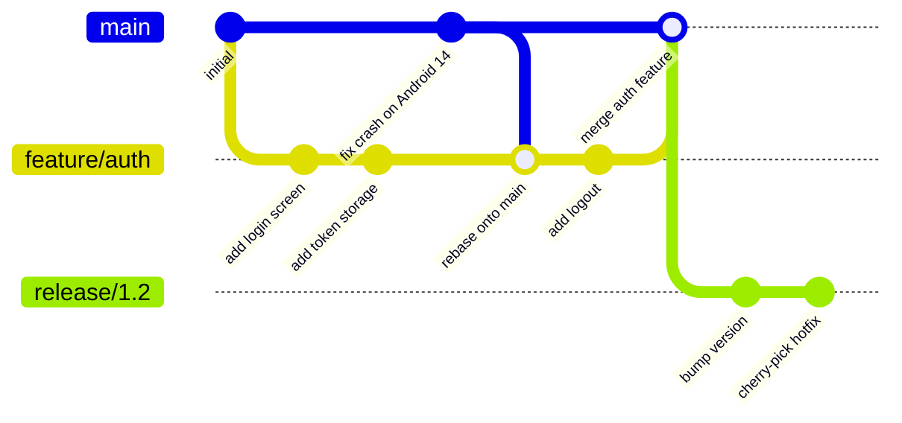

> **Trappola:** I conflitti di merge in `yarn.lock` sembrano spaventosi — migliaia di righe di hash. Non provare a risolverli a mano. Cancella il lockfile, esegui `yarn install` e committa il lockfile rigenerato. Questo è sicuro perché i vincoli in `package.json` sono la fonte di verità.

### Padronanza della CLI

Passerai del tempo nel terminale. La CLI di React Native è il modo in cui fai build, esegui, colleghi moduli nativi e diagnostichi problemi. Dovresti sentirti a tuo agio nell'eseguire comandi, leggere l'output degli errori e navigare la struttura delle directory di un progetto dalla riga di comando.

```bash
# Commands you'll run every day
npx react-native start              # Start Metro bundler
npx react-native run-ios            # Build and run on iOS simulator
npx react-native run-android        # Build and run on Android emulator
npx react-native doctor             # Check environment setup
npx pod-install                     # Install CocoaPods (iOS deps)
```

Se usi Expo (consigliato per i nuovi progetti), i comandi cambiano ma il principio è lo stesso:

```bash
npx expo start                      # Start development server
npx expo run:ios                    # Build native iOS
npx expo run:android                # Build native Android
npx expo install react-native-svg   # Install with correct version
```

Aiuta sapere cosa sono effettivamente questi due livelli. **Metro** è il bundler — l'equivalente in RN di Webpack/Vite. Osserva i tuoi file, transpila JS/TS moderno e serve un singolo bundle JavaScript all'app in esecuzione. Il **native build** (Xcode per iOS, Gradle per Android) compila il guscio effettivo dell'app che carica quel bundle. In fase di sviluppo lavorano insieme: l'app nativa viene eseguita una volta, e Metro fa hot-swap del tuo JS mentre lo modifichi.

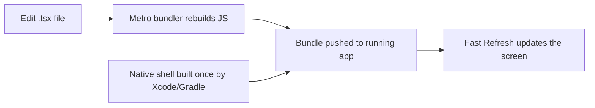

> **Trappola:** "Ieri funzionava e adesso è rotto" è molto spesso una cache di Metro obsoleta. Prima di metterti a debuggare in profondità, prova `npx react-native start --reset-cache` (oppure `npx expo start -c`). Risolve una quota sorprendente di misteriose schermate rosse.

### VS Code

VS Code è l'editor usato dalla maggior parte degli sviluppatori React Native. Installa queste estensioni prima di iniziare:

- **ESLint** — intercetta le violazioni delle regole degli hook e gli errori comuni
- **Prettier** — formattazione coerente in tutto il team
- **React Native Tools** — integrazione del debugger, IntelliSense per le API di RN
- **Error Lens** — visualizzazione inline degli errori, così vedi subito gli errori TypeScript

> **Opinione netta:** Usa Expo per ogni nuovo progetto a meno che tu non abbia una ragione specifica e comprovata per non farlo. Il workflow gestito di Expo si occupa del linking dei moduli nativi, della configurazione del build e degli aggiornamenti over-the-air. La via di fuga del "bare workflow" esiste se vai a sbattere contro un muro. Iniziare con la bare React Native CLI nel 2026 è come iniziare un progetto web configurando Webpack da zero — possibile, ma uno spreco della tua prima settimana.

| Approccio | Costo di setup | Controllo nativo | Ideale per |
|----------|-----------|----------------|---------|
| **Expo (managed)** | Minuti, nessun Xcode necessario per iniziare | Alto tramite config plugins + EAS | Quasi ogni nuova app |
| **Expo (con dev client)** | Basso | Codice nativo personalizzato completo consentito | App che necessitano di un modulo nativo personalizzato |
| **Bare RN CLI** | Ore, intera toolchain nativa | Totale, manuale | App native esistenti, vincoli di nicchia |

---

## 4. Mobile Concepts

### iOS vs Android: due mondi, una sola codebase

React Native promette "impara una volta, scrivi ovunque" — non "scrivi una volta, esegui ovunque". La distinzione è importante. Scrivi un'unica codebase JavaScript, ma le due piattaforme hanno paradigmi di navigazione diversi, linguaggi di design diversi, vincoli hardware diversi e processi di review diversi. Hai bisogno di un modello mentale di come funziona ciascuna piattaforma, anche se stai scrivendo JavaScript.

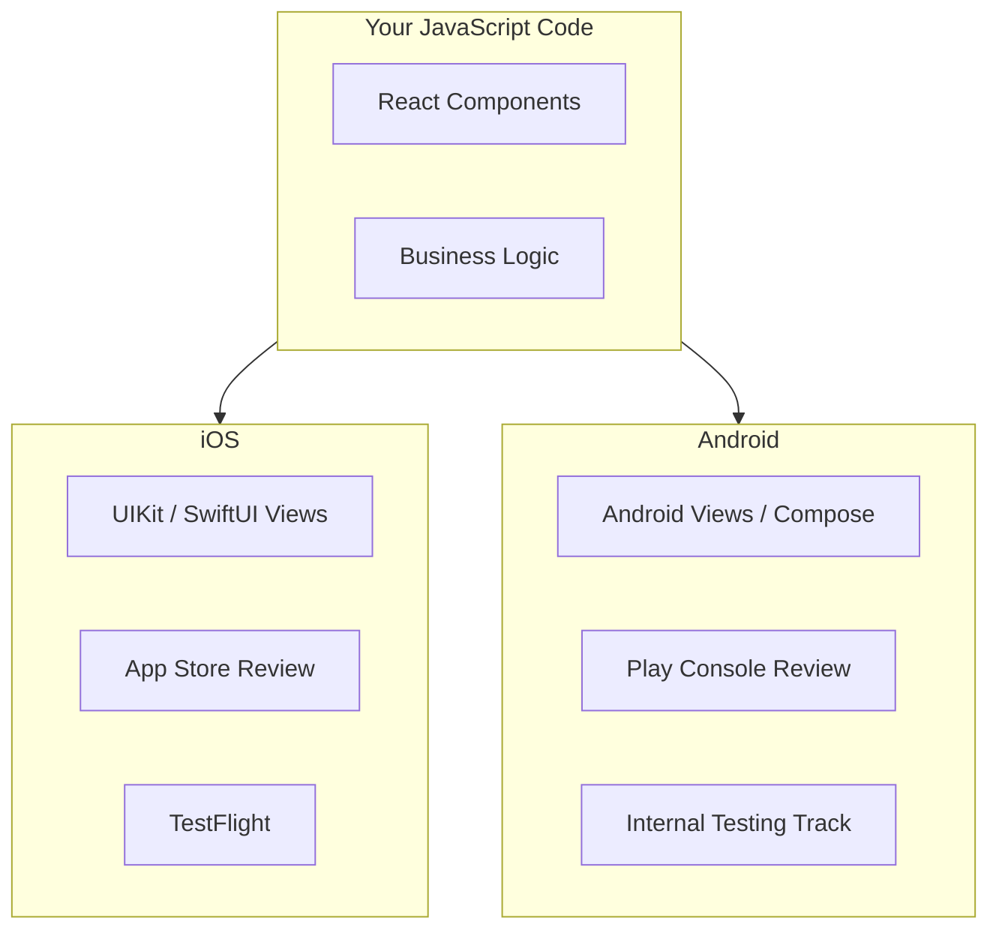

Ecco un rapido riferimento per le differenze che percepirai davvero come sviluppatore:

| Aspetto | iOS | Android |
|--------|-----|---------|
| Linguaggio di design | Human Interface Guidelines | Material Design |
| Navigazione indietro | Nessun pulsante hardware indietro; swipe / barra di navigazione | Pulsante indietro hardware/gesture (gestiscilo!) |
| Distribuzione | App Store + TestFlight | Play Store + tracks |
| Attesa per la review | Da ore a circa un giorno | Spesso quasi istantanea per i test track |
| Terminazione del processo | Sospende, meno aggressivo | Può distruggere l'Activity in qualsiasi momento |

> **Errore comune:** Dimenticare il pulsante hardware indietro di Android. iOS non ha un equivalente, quindi gli sviluppatori web che lavorano su un Mac/simulatore non se ne accorgono mai — poi un utente Android tocca Indietro dentro un modale e l'intera app si chiude. Gestiscilo esplicitamente (React Navigation fa molto di questo per te, ma i modali e i flussi personalizzati necessitano di `BackHandler`).

**Il ciclo di vita dell'app** funziona in modo diverso su ciascuna piattaforma. Su iOS, un'app attraversa degli stati: inactive, active, background, suspended. Su Android, il sistema può distruggere e ricreare la tua Activity in qualsiasi momento (rotazione dello schermo, pressione sulla memoria). React Native astrae la maggior parte di questo tramite l'API `AppState`, ma devi conoscere il modello sottostante per poter gestire i casi limite — come salvare i dati di un form quando l'OS termina la tua app in background.

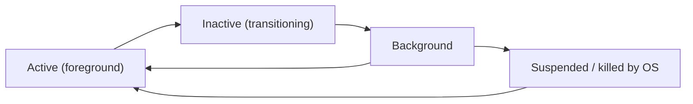

```tsx
// Persist draft state when the app leaves the foreground,
// because the OS may kill it before the user returns.
useEffect(() => {
  const sub = AppState.addEventListener('change', state => {
    if (state === 'background') {
      saveDraft(formValues); // last chance before a possible kill
    }
  });
  return () => sub.remove();
}, [formValues]);
```

### Distribuzione tramite app store

Non puoi semplicemente distribuire a una URL. Le app mobili passano attraverso un processo di review, e portare la tua app ai tester richiede tooling specifico:

- **iOS / TestFlight:** Crei un archive in Xcode (o tramite EAS Build), lo carichi su App Store Connect e inviti i tester tramite TestFlight. Apple effettua la review anche dei build TestFlight (sebbene la review sia più leggera). Aspettati 24-48 ore per la review del primo build. I build successivi sullo stesso gruppo sono di solito disponibili entro un'ora.

- **Android / Play Internal Testing:** Carichi un AAB (Android App Bundle) sulla Google Play Console e crei un internal testing track. I tester ricevono un link. I build dell'internal track sono disponibili quasi immediatamente — nessuna attesa per la review. La review avviene quando promuovi alla produzione.

Il più grande cambio di mentalità rispetto al web: c'è un guardiano tra il tuo codice e i tuoi utenti.

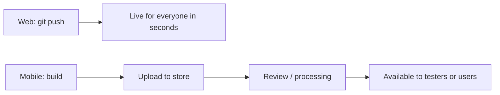

> **Trappola:** I build iOS scadono dopo 90 giorni su TestFlight. Se il tuo programma beta dura a lungo, le app dei tester smetteranno di avviarsi. Hai bisogno di una pipeline CI che produca regolarmente build freschi. Non affidarti all'archiviazione manuale dal tuo laptop.

> **Consiglio da esperto:** Poiché la review degli store è lenta, l'ecosistema si appoggia agli **aggiornamenti over-the-air (OTA)** (Expo Updates / EAS Update) per distribuire fix solo-JavaScript senza un nuovo binario. Questo funziona proprio perché il tuo bundle JS è separato dal guscio nativo (vedi il diagramma di Metro precedente) — ma nota che gli store consentono OTA solo per modifiche a JS/asset, non per nuovo codice nativo.

### Il modello dei permessi

Sul web, chiedi l'accesso alla fotocamera con `navigator.mediaDevices.getUserMedia()` e il browser mostra un prompt. Su mobile, i permessi sono più granulari, più permanenti e più rilevanti.

Entrambe le piattaforme ti richiedono di **dichiarare** i permessi in anticipo (in `Info.plist` su iOS, in `AndroidManifest.xml` su Android) e poi di **richiederli** a runtime. Se dimentichi la dichiarazione, la richiesta a runtime fallisce silenziosamente. Se la richiedi al momento sbagliato (all'avvio dell'app invece che quando l'utente tocca il pulsante della fotocamera), l'utente la nega e potresti non avere un'altra occasione — iOS limita la frequenza dei prompt dei permessi.

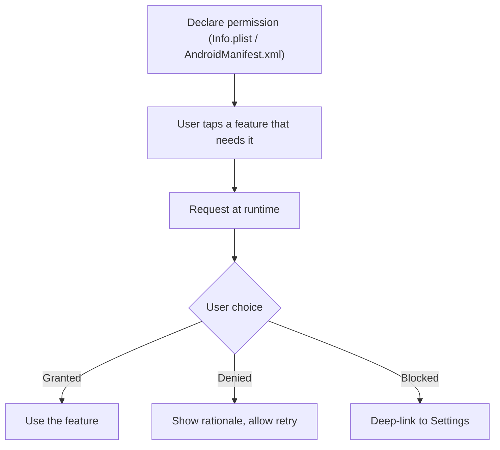

```tsx
// react-native-permissions — the standard library for this
import { request, PERMISSIONS, RESULTS } from 'react-native-permissions';
import { Platform } from 'react-native';

async function requestCamera(): Promise<boolean> {
  const permission = Platform.select({
    ios: PERMISSIONS.IOS.CAMERA,
    android: PERMISSIONS.ANDROID.CAMERA,
  });

  if (!permission) return false;

  const result = await request(permission);

  switch (result) {
    case RESULTS.GRANTED:
      return true;
    case RESULTS.DENIED:
      // User said no — can ask again (iOS) or is permanent (Android varies)
      return false;
    case RESULTS.BLOCKED:
      // User previously denied and checked "don't ask again"
      // Must direct them to Settings
      return false;
    default:
      return false;
  }
}
```

> **Differenza chiave rispetto al web:** Sul web, negare un prompt di permesso significa solo che verrai interpellato di nuovo la volta successiva. Su iOS, dopo un rifiuto, il sistema potrebbe non mostrare più il prompt — devi indirizzare l'utente all'app Impostazioni. Progetta la tua UX attorno a questo: spiega *perché* hai bisogno del permesso prima di innescare il prompt di sistema.

> **Consiglio da esperto:** Il pattern "pre-permission" è uno standard del settore: mostra una tua schermata amichevole ("Usiamo la fotocamera così puoi scansionare le ricevute — pronto?") *prima* di innescare il vero prompt dell'OS. Se l'utente dice "non ora" sulla tua schermata, non hai speso nulla — il prezioso prompt dell'OS, forse irripetibile, è ancora in tasca per quando saranno pronti a dire sì.

### Safe area: notch, Dynamic Island e barre di sistema

Sul web, il tuo contenuto parte da `(0, 0)` e non ti preoccupi che l'hardware si sovrapponga alla tua UI. Su mobile, la barra di stato, l'home indicator (iPhone), la Dynamic Island (iPhone 14 Pro+), la barra di navigazione (Android) e il notch della fotocamera mangiano tutti spazio sullo schermo. Se non ne tieni conto, il tuo contenuto viene renderizzato dietro la barra di stato o sotto l'home indicator.

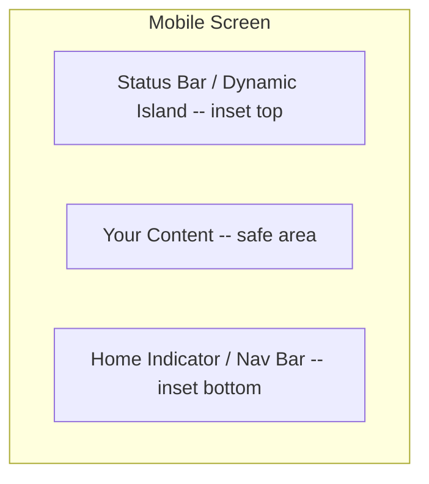

React Native fornisce il componente `SafeAreaView` (solo iOS) e la più completa libreria `react-native-safe-area-context` (cross-platform). Avvolgerai le tue schermate in un `SafeAreaProvider` e userai l'hook `useSafeAreaInsets` per ottenere i valori esatti in pixel di ciascun bordo.

```tsx
import { useSafeAreaInsets } from 'react-native-safe-area-context';

function MyScreen() {
  const insets = useSafeAreaInsets();

  return (
    <View style={{
      flex: 1,
      paddingTop: insets.top,
      paddingBottom: insets.bottom,
    }}>
      <Text>Content that never hides behind the notch</Text>
    </View>
  );
}
```

Pensa agli insets come a quattro numeri — `top`, `bottom`, `left`, `right` — che descrivono di quanti punti di padding ha bisogno ciascun bordo per liberarsi dall'hardware. L'hook ti fornisce valori live che si aggiornano alla rotazione e differiscono da dispositivo a dispositivo, quindi li applichi come padding (o margin) anziché tirare a indovinare.

| Opzione | Piattaforme | Cosa ti offre | Verdetto |
|--------|-----------|-----------|---------|
| Core `SafeAreaView` | Solo iOS | Padding automatico, nessun numero grezzo | Da evitare — incompleto |
| `react-native-safe-area-context` (`SafeAreaView`) | iOS + Android | Padding automatico, cross-platform | Buon default |
| `useSafeAreaInsets()` | iOS + Android | Numeri di inset grezzi per ciascun bordo | Il migliore per layout personalizzati |

> **Trappola:** Il `SafeAreaView` integrato del core di React Native funziona solo su iOS e applica solo il padding. Usa invece `react-native-safe-area-context` — funziona su entrambe le piattaforme, ti fornisce i valori di inset grezzi e si integra bene con React Navigation (che ha bisogno degli insets per i calcoli del suo header e della tab bar).

I valori cambiano a seconda del dispositivo e dell'orientamento. Un iPhone SE ha un inset superiore di 20 punti. Un iPhone 15 Pro ha un inset superiore di 59 punti (Dynamic Island). Un dispositivo Android con un hole-punch per la fotocamera ha un inset superiore che varia da produttore a produttore. Non hard-codare mai questi numeri — leggili sempre dal safe area context.