# React Native Fundamentals: Comprendere il Runtime

> Cos'è realmente React Native sotto il cofano, e il cambiamento mentale critico dal web al mobile.

---

## Table of Contents

1. [Cos'è Realmente React Native](#1-what-react-native-actually-is)
2. [Cambiamento di Modello Mentale dal Web](#2-mental-model-shift-from-web)
3. [Panoramica dell'Architettura](#3-architecture-overview)

Questo capitolo presuppone che tu conosca già React per il web: componenti, props, state, hooks, JSX. Non hai bisogno di alcuna esperienza precedente di sviluppo mobile. Alla fine capirai cosa succede quando il tuo JavaScript viene eseguito su un telefono, perché alcuni istinti del web ti tradiranno, e come la vecchia e la nuova architettura di React Native differiscono in modi che contano per il tuo lavoro quotidiano.

> **Come leggere questo capitolo:** Non cercare di memorizzare i nomi (Hermes, Metro, JSI, Fabric, Yoga). Costruisci invece il film mentale di "il mio file `.tsx` diventa pixel su un telefono." Ogni sezione aggiunge un fotogramma a quel film. Entro la sezione 3 sarai in grado di raccontare l'intero percorso da solo.

---

## 1. Cos'è Realmente React Native

### Partiamo dall'equivoco

La maggior parte degli sviluppatori sente "React Native" e immagina una WebView — un mini browser incorporato all'interno di un'app per telefono, che renderizza il tuo HTML e CSS come un iframe elegante. Non è questo che è React Native. Se così fosse, sarebbe solo Cordova con qualche passaggio in più, e le prestazioni sarebbero pessime.

React Native è un **runtime** che prende il tuo albero di componenti React e lo renderizza in **primitive UI native, reali e specifiche della piattaforma**. Quando scrivi `<View>`, non ottieni un `<div>` in un browser nascosto. Su iOS ottieni un `UIView`. Su Android ottieni un `android.view.View`. Il pulsante che l'utente tocca è esattamente lo stesso pulsante che ogni altra app nativa su quel telefono utilizza. La fisica dello scroll, il rendering del testo, il livello di accessibilità — tutto nativo.

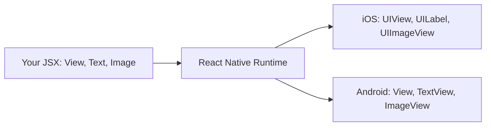

Questa è l'intuizione chiave: **React è il modello di programmazione, non il target di rendering.** Sul web, React renderizza in nodi DOM (`div`, `span`, `input`). In React Native, React renderizza in view native della piattaforma. Il ciclo di vita dei componenti, gli hooks, la gestione dello state, il context — tutto questo funziona in modo identico. Ciò che cambia è l'insieme delle primitive con cui componi.

### Un'analogia: lo stesso autista, un'auto diversa

Pensa a React (la libreria) come a un autista esperto, e al target di rendering come all'auto. Sul web, l'autista siede in un'"auto-browser" i cui comandi sono nodi DOM. In React Native, lo stesso autista siede in un'"auto nativa" i cui comandi sono `UIView` e `TextView`. Le abilità di guida (la tua conoscenza di componenti, props, state, hooks) si trasferiscono completamente. Devi solo imparare il nuovo cruscotto. Questo è il motivo per cui React Native è così accessibile per gli sviluppatori React — ed è anche il motivo per cui le poche differenze che *esistono* sono così sorprendenti quando le incontri.

### Tre famiglie di "React"

È utile essere precisi su quale "React" fa cosa, perché i nomi si confondono tra loro:

| Pacchetto | Ruolo | Analogia |
|---|---|---|
| `react` | Il motore centrale: componenti, hooks, riconciliazione. Non sa nulla degli schermi. | Il cervello dell'autista |
| `react-dom` | Il renderer web. Trasforma l'output di React in nodi DOM. | L'auto-browser |
| `react-native` | Il renderer nativo. Trasforma l'output di React in view native. | L'auto nativa |

Importi `useState` e `useEffect` da `react` in *entrambi* i mondi — codice identico. Importi `View` e `Text` da `react-native` invece di scrivere `div` e `span`. Quella singola sostituzione è la maggior parte di ciò che cambia a livello di componente.

### Il motore JavaScript: Hermes

Il tuo JavaScript deve essere eseguito da qualche parte. Sul web, quello è V8 (Chrome) o JavaScriptCore (Safari). React Native era solito spedire JavaScriptCore su entrambe le piattaforme, ma dalla versione 0.70 di React Native, il motore predefinito è **Hermes** — un motore JavaScript che Meta ha costruito specificamente per il mobile.

Perché costruire un motore completamente nuovo? Perché i vincoli del mobile sono diversi dai vincoli del browser desktop:

- **Il tempo di avvio conta più del throughput di picco.** Gli utenti si aspettano che un'app si apra in meno di un secondo. Hermes compila il tuo JS in bytecode al momento del build (compilazione ahead-of-time), in modo che il motore non debba analizzare e compilare JavaScript sul telefono dell'utente ogni volta che l'app viene avviata.
- **La memoria è più ristretta.** Un telefono ha 4-8 GB di RAM condivisi tra tutte le app in esecuzione. Hermes utilizza meno memoria di JavaScriptCore per progettazione.
- **La dimensione del binario conta.** Hermes produce un binario del motore più piccolo, il che significa un download dell'app più piccolo.

Ecco la differenza cruciale in *quando* avviene il lavoro. Un browser spedisce il tuo testo JavaScript grezzo e lo analizza sul dispositivo dell'utente a ogni singolo avvio. Hermes esegue quell'analisi una sola volta, sulla tua macchina di build, e spedisce invece bytecode compatto — così il telefono passa direttamente all'esecuzione.

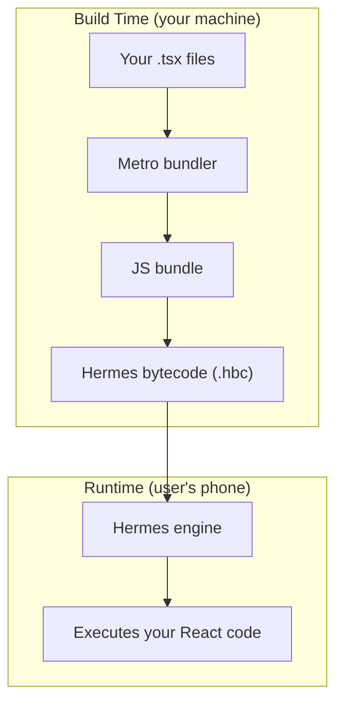

| | Browser (V8/JSC) | Hermes (mobile) |
|---|---|---|
| Quando viene compilato il JS? | Sul dispositivo, a ogni avvio | In anticipo, sulla tua macchina di build |
| Spedito al dispositivo come | Testo sorgente | Bytecode compatto |
| Ottimizzato per | Throughput di picco su sessioni lunghe | Avvio veloce, bassa memoria |
| Costo di avvio | Parse + compile all'avvio | Quasi nullo — il bytecode è pronto |

Non interagisci direttamente con Hermes. Scrivi normale TypeScript, e il toolchain di build gestisce il resto. Ma dovresti sapere che è lì, perché spiega perché certe cose funzionano in modo diverso rispetto a un browser:

- Hermes non supporta ogni funzionalità JavaScript all'avanguardia. Copre bene ES2020+, ma se usi una proposta molto recente potresti incontrare un errore di sintassi che non si verificherebbe in Chrome.
- Il debugging si connette a Hermes tramite il protocollo Chrome DevTools. Quando apri il debugger, stai parlando con Hermes, non con un browser.
- Gli strumenti di profiling delle prestazioni (React DevTools, il profiler Hermes integrato) sono consapevoli di Hermes e possono mostrarti informazioni a livello di bytecode.

> **Consiglio da esperto:** Puoi confermare che Hermes è attivo a runtime controllando l'oggetto globale `HermesInternal` — `const isHermes = !!(global as any).HermesInternal;`. Se è truthy, stai eseguendo su Hermes.

> **Nota:** Puoi ancora rinunciare a Hermes e usare JavaScriptCore se hai una ragione specifica, ma quasi mai c'è una buona ragione per farlo in un nuovo progetto. Hermes è il predefinito consigliato.

### Metro: il bundler

Sul web usi Vite o Webpack per fare il bundle del tuo codice. In React Native il bundler è **Metro**. Osserva i tuoi file, risolve gli import, trasforma TypeScript/JSX, e serve il bundle all'app in esecuzione su un server HTTP locale durante lo sviluppo. In produzione produce un singolo bundle ottimizzato che viene incorporato nel binario.

Perché React Native ha bisogno del *proprio* bundler invece di riutilizzare Webpack o Vite? Perché il target di output è diverso. Un bundler web produce file che un browser scarica via HTTP e suddivide in codice (code-split) su molte richieste. Metro produce un solo bundle su misura per un motore JS su un telefono, con la risoluzione specifica della piattaforma incorporata: quando importi `./Button`, Metro può scegliere in modo trasparente `Button.ios.tsx` o `Button.android.tsx` in base al target di build. I bundler web non hanno alcun concetto di questo.

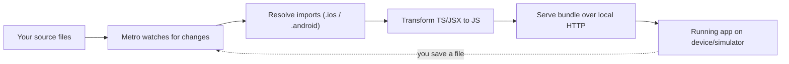

Metro è più semplice di Webpack (niente loader, niente configurazione complessa) ma anche meno flessibile. Lo configuri tramite `metro.config.js`, e per la maggior parte dei progetti non lo tocchi mai.

```bash
# Metro starts automatically when you run:
npx react-native start

# Or if using Expo:
npx expo start

# Press 'r' in the terminal to reload, 'i' to open iOS, 'a' to open Android
```

| Aspetto | Web (Webpack/Vite) | React Native (Metro) |
|---|---|---|
| Output | Asset pronti per il browser, code-split | Un bundle per un motore JS |
| File specifici della piattaforma | Non è un concetto integrato | Risoluzione automatica `.ios.tsx` / `.android.tsx` |
| Distribuzione in dev | HMR su dev server | Fast Refresh su HTTP locale |
| Superficie di configurazione | Ampia (loader, plugin) | Ridotta (`metro.config.js`, raramente toccata) |

> **Trabocchetto:** Se Metro inizia a comportarsi in modo strano dopo aver installato un pacchetto o cambiato branch (moduli obsoleti, errori "unable to resolve module"), la soluzione è quasi sempre svuotare la sua cache: `npx react-native start --reset-cache` (o `npx expo start -c`). Questo è l'equivalente React Native di "spegnilo e riaccendilo."

### Primitive native, non elementi HTML

Ecco la mappatura che conta di più quando si proviene dal web:

| Web (React DOM)       | React Native            | Risultato nativo (iOS)        | Risultato nativo (Android)         |
|-----------------------|-------------------------|----------------------------|---------------------------------|
| `<div>`               | `<View>`                | `UIView`                   | `android.view.View`             |
| `<span>`, `<p>`, `<h1>` | `<Text>`             | `UILabel`                  | `TextView`                      |
| ``               | `<Image>`               | `UIImageView`              | `ImageView`                     |
| `<input>`             | `<TextInput>`           | `UITextField`              | `EditText`                      |
| `<button>`            | `<Pressable>` / `<TouchableOpacity>` | `UIView` con gesture recognizer | `View` con touch handler |
| `<div style="overflow:scroll">` | `<ScrollView>` | `UIScrollView`            | `ScrollView`                    |
| `<ul>` con virtualizzazione | `<FlatList>`       | `UICollectionView`         | `RecyclerView`                  |

Un rapido esempio per sentire la differenza:

```tsx
// Web React
const WebCard = () => (
  <div className="card">
    <h2>Hello</h2>
    <p>This is a paragraph.</p>
    
    <button onClick={() => alert('clicked')}>Press me</button>
  </div>
);

// React Native
import { View, Text, Image, Pressable, Alert, StyleSheet } from 'react-native';

const NativeCard = () => (
  <View style={styles.card}>
    <Text style={styles.title}>Hello</Text>
    <Text>This is a paragraph.</Text>
    <Image source={{ uri: 'https://example.com/photo.jpg' }} style={styles.image} />
    <Pressable onPress={() => Alert.alert('clicked')}>
      <Text>Press me</Text>
    </Pressable>
  </View>
);

const styles = StyleSheet.create({
  card: { padding: 16, backgroundColor: '#fff', borderRadius: 8 },
  title: { fontSize: 24, fontWeight: 'bold' },
  image: { width: 200, height: 200 },
});
```

Nota le differenze, e *perché* ognuna esiste:

- **Non c'è `className` e non c'è alcun file CSS.** Le view native non hanno un motore di stylesheet, quindi gli stili sono semplici oggetti JavaScript passati tramite la prop `style`. `StyleSheet.create` è solo un wrapper di ottimizzazione attorno a quegli oggetti (più dettagli nel capitolo sullo styling).
- **Non c'è `<div>` o `<span>`.** Quelli sono concetti HTML. Le UI native sono costruite a partire da `View` (un contenitore generico) e `Text` (una primitiva per il disegno del testo).
- **Ogni porzione di testo deve trovarsi all'interno di un componente `<Text>`.** Una stringa nuda al di fuori di `<Text>` — come `<View>Hello</View>` — genera un errore. Sul web un `<div>` può contenere testo grezzo perché il browser sa come renderizzare nodi di testo ovunque. Il `UIView`/`View` nativo non può disegnare testo; solo un `UILabel`/`TextView` (cioè `<Text>`) può farlo. Quindi la regola è una diretta conseguenza delle primitive native.
- **`<Image>` ha bisogno di una larghezza e di un'altezza esplicite.** Un'immagine remota non ha dimensione intrinseca finché non viene scaricata, e il layout nativo non farà il "reflow" attorno ad essa come fa un browser, quindi la dimensioni in anticipo.

> **Errore comune:** `Text strings must be rendered within a <Text> component.` è uno dei primi errori in cui incappa ogni principiante di React Native. Se lo vedi, cerca una stringa vagante, uno spazio `{' '}`, o un `{condition && 'some text'}` posizionato direttamente all'interno di un `<View>`. Avvolgilo in `<Text>`.

Queste non sono differenze estetiche; sono vincoli fondamentali del modello di rendering nativo.

---

## 2. Cambiamento di Modello Mentale dal Web

Questa è la sezione più importante del capitolo. L'architettura è una curiosità interessante, ma sono *questi* cambiamenti che ti faranno inciampare il primo giorno. Ogni sottosezione è un istinto del web che si rompe silenziosamente sul mobile, e la sostituzione nativa per esso.

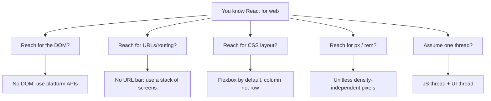

### Non c'è il DOM

Sembra ovvio una volta detto, ma le conseguenze sono profonde. Sul web, tutto è un nodo nel Document Object Model. Puoi fare `document.querySelector` su qualsiasi cosa, ispezionare gli stili calcolati, misurare i rettangoli di delimitazione, manipolare l'albero in modo imperativo. In React Native, niente di tutto questo esiste. Non c'è `document`, non c'è `window`, non c'è `navigator.userAgent`, non c'è `localStorage`.

Il motivo è semplice: quei globali sono API del *browser*, fornite dal browser. React Native non viene eseguito all'interno di un browser, quindi non sono mai stati lì in primo luogo. Il tuo JavaScript viene eseguito in un motore nudo (Hermes) con solo i built-in standard del linguaggio più ciò che React Native inietta.

Se hai mai scritto:

```tsx
// This will crash in React Native
const width = window.innerWidth;
localStorage.setItem('token', value);
document.title = 'My App';
```

...devi sostituirli con API della piattaforma:

```tsx
import { Dimensions } from 'react-native';
import AsyncStorage from '@react-native-async-storage/async-storage';

// Screen dimensions
const { width } = Dimensions.get('window');

// Persistent storage (async, not sync like localStorage)
await AsyncStorage.setItem('token', value);

// There is no document.title — mobile apps do not have a title bar controlled by you
```

Ecco una scheda di riferimento dei globali web più comuni e delle loro sostituzioni React Native:

| API Web | Cosa fa | Sostituzione React Native |
|---|---|---|
| `window.innerWidth/Height` | Dimensione del viewport | `Dimensions.get('window')` o `useWindowDimensions()` |
| `localStorage` (sync) | Archiviazione chiave-valore persistente | `AsyncStorage` (async) o `react-native-mmkv` (sync, veloce) |
| `fetch` | Richieste di rete | `fetch` — questo *esiste* (lo fornisce RN) |
| `document.querySelector` | Trovare/misurare nodi DOM | `ref` + `measure()` sul componente |
| `navigator.geolocation` | Posizione | `expo-location` o `@react-native-community/geolocation` |
| `document.cookie` | Cookie | Gestiti dal livello di rete nativo; oppure una libreria per i cookie |
| `alert()` | Dialogo | `Alert.alert()` da `react-native` |

> **Trabocchetto:** `localStorage` è *sincrono* — leggi un valore e lo ottieni immediatamente. `AsyncStorage` è *asincrono* — ogni lettura e scrittura restituisce una Promise. Il codice che presumeva letture istantanee (`const t = localStorage.getItem('token')`) deve diventare `const t = await AsyncStorage.getItem('token')`. Dimenticare l'`await` è un bug classico che restituisce un oggetto Promise dove ti aspettavi una stringa.

Questo significa anche che qualsiasi pacchetto npm che tocca il DOM non funzionerà. Librerie come `react-helmet`, `react-modal` (quella per il web), o qualsiasi cosa che chiami `document.createElement` sono solo per il web. Verifica sempre che una libreria supporti React Native prima di installarla — cerca "React Native" nel suo README, o una voce `react-native` nel suo `package.json`.

### Non c'è la barra degli URL

Sul web, la navigazione riguarda fondamentalmente gli URL. L'utente digita un URL, clicca un link, preme il pulsante indietro — tutto è guidato dall'URL. React Router mappa i percorsi URL sui componenti, e il browser mantiene lo stack della cronologia per te.

Sul mobile, non c'è la barra degli URL. La navigazione è uno **stack di schermate** — ne spingi una nuova in cima, e il pulsante indietro (o il gesto di swipe) la fa uscire. Questo è più vicino a una struttura dati stack (last in, first out) che al routing tramite URL. La schermata che stai guardando è sempre quella in cima allo stack.

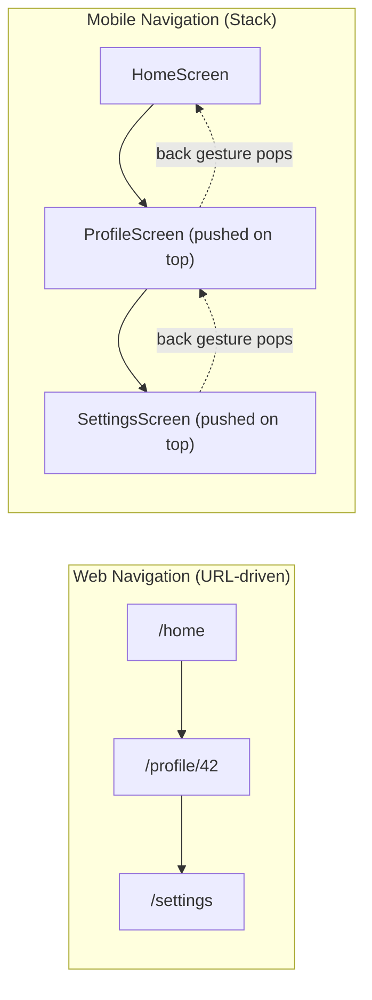

La libreria di navigazione standard è **React Navigation** (non React Router). Ti offre stack navigator, tab navigator e drawer navigator che si comportano come i pattern di navigazione nativi di iOS e Android — incluse le transizioni corrette per la piattaforma e il gesto iOS di swipe-dal-bordo-per-tornare-indietro, che ottieni gratuitamente.

```tsx
import { NavigationContainer } from '@react-navigation/native';
import { createNativeStackNavigator } from '@react-navigation/native-stack';

const Stack = createNativeStackNavigator();

const App = () => (
  <NavigationContainer>
    <Stack.Navigator>
      <Stack.Screen name="Home" component={HomeScreen} />
      <Stack.Screen name="Profile" component={ProfileScreen} />
    </Stack.Navigator>
  </NavigationContainer>
);

// Inside a screen, you move around imperatively instead of changing a URL:
const HomeScreen = ({ navigation }) => (
  <Pressable onPress={() => navigation.navigate('Profile', { userId: 42 })}>
    <Text>Go to profile</Text>
  </Pressable>
);
```

Ecco come i concetti centrali di navigazione si mappano attraverso il divario:

| Web (React Router) | Mobile (React Navigation) | Nota |
|---|---|---|
| `<Link to="/profile/42">` | `navigation.navigate('Profile', { userId: 42 })` | I parametri vengono passati come oggetti, non come segmenti di URL |
| `useParams()` | `route.params` | |
| Pulsante indietro del browser | Pulsante indietro dell'OS / gesto di swipe | Gestito nativamente dallo stack |
| `useNavigate()` | `useNavigation()` | |
| L'URL è la fonte di verità | L'albero dello stato di navigazione è la fonte di verità | |

> **Nota:** Expo Router è una soluzione di routing più recente basata sui file che porta un routing simile agli URL a React Native — crei un file in una cartella `app/` e diventa una schermata, proprio come Next.js. È costruito sopra React Navigation ed è eccellente per il deep linking e gli universal link. Ma comprendi prima il modello a stack — è ciò che accade sotto, indipendentemente dall'API che usi.

### Flexbox è il default (ma capovolto)

Sul web, il layout predefinito è `display: block` con `flex-direction: row` quando opti per flexbox. In React Native, **ogni `<View>` è un contenitore flex per impostazione predefinita**, e il `flexDirection` predefinito è `column`, non `row`.

Perché `column`? Perché i telefoni sono alti e stretti, e il layout di gran lunga più comune è una pila verticale di contenuti che scorre verso il basso sullo schermo. Avere `column` come predefinito si allinea alla natura della UI mobile, quindi la maggior parte dei layout non ha bisogno di alcun `flexDirection`.

Questo significa che il tuo modello mentale deve capovolgersi:

```tsx
// Web: items go left-to-right by default in a flex container
// <div style={{ display: 'flex' }}> -> row (horizontal)

// React Native: items go top-to-bottom by default
// <View> -> column (vertical) — no need to write display:'flex', it is always on
```

Un esempio concreto:

```tsx
import { View, Text, StyleSheet } from 'react-native';

const FlexExample = () => (
  <View style={styles.container}>
    <Text>First</Text>
    <Text>Second</Text>
    <Text>Third</Text>
  </View>
);

const styles = StyleSheet.create({
  container: {
    flex: 1,
    // These items stack vertically by default (flexDirection: 'column')
    // To make them horizontal, you would add: flexDirection: 'row'
    justifyContent: 'center', // centers along the MAIN axis (vertical here)
    alignItems: 'center',     // centers along the CROSS axis (horizontal here)
  },
});
```

La cosa più importante da interiorizzare riguardo a Flexbox è l'**asse principale vs asse trasversale**, perché `justifyContent` e `alignItems` scambiano significato a seconda di `flexDirection`:

| flexDirection | Asse principale | `justifyContent` controlla | `alignItems` controlla |
|---|---|---|---|
| `column` (default) | Verticale | Posizione verticale | Posizione orizzontale |
| `row` | Orizzontale | Posizione orizzontale | Posizione verticale |

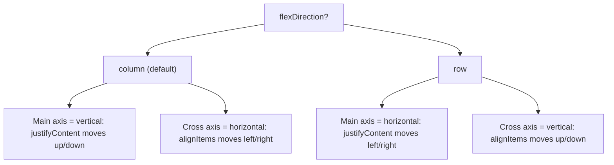

Il sistema di layout completo è un sottoinsieme di CSS Flexbox. Proprietà come `justifyContent`, `alignItems`, `flex`, `flexWrap` e `gap` funzionano tutte come ti aspetti — ricorda solo che la direzione predefinita è capovolta.

> **Trabocchetto:** Provenendo dal web, le persone ricorrono a `flexDirection: 'row'` e poi si chiedono perché `alignItems: 'center'` non centra più le cose orizzontalmente. Non è rotto — gli assi si sono capovolti. In caso di dubbio, dì ad alta voce quale direzione è l'asse principale, e le due proprietà si sistemeranno da sole.

### Valori senza unità (pixel indipendenti dalla densità)

Sul web, specifichi `fontSize: '16px'` o `margin: '1rem'`. In React Native, tutti i valori di layout sono **numeri senza unità** che rappresentano **pixel indipendenti dalla densità (dp)**.

```tsx
const styles = StyleSheet.create({
  box: {
    width: 100,      // 100dp, not 100px
    height: 100,     // 100dp
    margin: 16,      // 16dp
    fontSize: 14,    // 14dp
    borderRadius: 8, // 8dp
  },
});
```

Un pixel indipendente dalla densità ha all'incirca la stessa dimensione *fisica* tra i vari dispositivi. Ecco il meccanismo: i telefoni hanno densità di pixel estremamente diverse. Un telefono più vecchio potrebbe stipare 160 pixel fisici in un pollice; un flagship moderno ne stipa 460+. Se dimensionassi le cose in pixel fisici grezzi, un pulsante da 100px apparirebbe bene sul vecchio telefono e microscopico su quello nuovo. Quindi React Native misura in `dp` e moltiplica per il **pixel ratio** del dispositivo al momento del render. Su un telefono con densità 3x, `width: 100` diventa 300 pixel fisici — ma occupa la stessa frazione dello schermo, quindi *appare* della stessa dimensione all'utente.

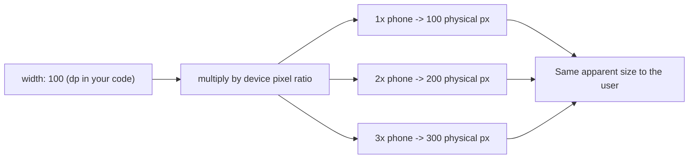

Non scrivi mai `px`, `em`, `rem`, `vh`, o `%` (con alcune eccezioni come `width: '50%'`, che è supportato come stringa). Puoi leggere il ratio del dispositivo con `PixelRatio.get()` se mai ti serve la matematica dei pixel fisici, ma raramente ne avrai bisogno.

> **Trabocchetto:** Non c'è `calc()`, non c'è `clamp()`, e non ci sono media query. Per i layout responsive, usi le proporzioni `flex` (lasci che il motore di layout divida lo spazio), le percentuali, l'API `Dimensions`, o — la cosa migliore per i componenti che dovrebbero reagire alla rotazione — l'hook `useWindowDimensions`, che ri-renderizza il tuo componente quando la dimensione dello schermo cambia:

```tsx
import { useWindowDimensions } from 'react-native';

const Responsive = () => {
  const { width } = useWindowDimensions(); // updates on rotation/resize
  const isTablet = width >= 768;
  return <View style={{ flexDirection: isTablet ? 'row' : 'column' }} />;
};
```

### Due thread, non uno

Sul web, JavaScript e rendering avvengono entrambi sul thread principale (con i Web Worker come via di fuga opzionale). In React Native, ci sono (come minimo) due thread che contano:

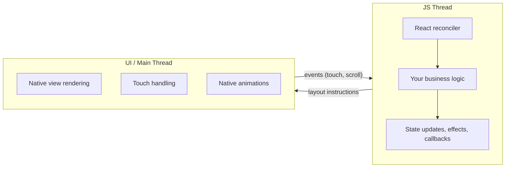

Il **JS thread** esegue il tuo codice JavaScript: rendering dei componenti, aggiornamenti dello state, chiamate API, logica di business. Lo **UI thread** (chiamato anche main thread) è dove le view native vengono disegnate sullo schermo e dove originano gli eventi di tocco.

Perché separarli? Perché lo schermo deve aggiornarsi in modo fluido a 60 (o 120) fotogrammi al secondo indipendentemente da ciò che sta facendo il tuo JavaScript. Se il disegno e la tua logica di business condividessero un solo thread — come fanno in un browser — una funzione lenta congelerebbe la grafica. Dando alla UI il proprio thread, il telefono può continuare a scorrere e animare anche mentre il JS thread è momentaneamente occupato.

Questi due thread comunicano in modo asincrono. Quando il tuo componente viene ri-renderizzato e produce nuove istruzioni di layout, quelle istruzioni vengono consegnate allo UI thread, che aggiorna le view native. Quando l'utente tocca un pulsante, lo UI thread invia l'evento di tocco al JS thread, che esegue il tuo handler `onPress`.

Questa separazione è per lo più invisibile per te, ma spiega alcune cose che altrimenti sembrerebbero magia o bug:

- **Le animazioni che girano sul JS thread possono scattare.** Se il tuo JS thread è occupato (esegue un grande calcolo, ri-renderizza una lista grande), le animazioni guidate da JavaScript perderanno fotogrammi. Questo è il motivo per cui l'API `Animated` di React Native con `useNativeDriver: true` spinge l'animazione sullo UI thread, mantenendola fluida anche quando il JS è occupato.
- **I calcoli pesanti bloccano la tua UI indirettamente.** Un `JSON.parse` sincrono di un payload da 5 MB sul JS thread congelerà la reattività della tua app, perché gli eventi di tocco si accodano in attesa che il JS thread sia di nuovo libero.
- **`console.log` in produzione costa più di quanto pensi.** Ogni istruzione di log serializza dati da inviare al debugger. Rimuovili prima di spedire.

```tsx
import { Animated } from 'react-native';

// Good: animation runs on the UI thread, smooth even if JS is busy
Animated.timing(opacity, {
  toValue: 1,
  duration: 300,
  useNativeDriver: true, // this is the critical flag
}).start();

// Bad: animation runs on the JS thread (will stutter under load)
Animated.timing(opacity, {
  toValue: 1,
  duration: 300,
  useNativeDriver: false,
}).start();
```

> **Trabocchetto:** `useNativeDriver: true` supporta solo un sottoinsieme di proprietà animabili — `opacity` e `transform` (translate, scale, rotate) sono sicure. *Non puoi* usarlo per `backgroundColor`, `width`, `height`, o altre proprietà di layout, perché quelle richiedono al motore di layout di ricalcolare sullo UI thread. Per quelle, ricorri a **`react-native-reanimated`**, una libreria di animazione più potente che esegue la tua logica di animazione interamente sullo UI thread — incluse le animazioni di layout e colore — compilando piccoli "worklet" che vengono eseguiti nativamente.

---

## 3. Panoramica dell'Architettura

Questa sezione è il "film" promesso all'inizio: come il tuo codice viaggia da un file `.tsx` ai pixel nativi, e come quel viaggio è cambiato tra la vecchia e la nuova versione di React Native. Non avrai bisogno della maggior parte di questi dettagli interni giorno per giorno, ma conoscerli trasforma messaggi di errore confusi e vecchi articoli di blog in cose su cui puoi ragionare.

### La vecchia architettura: il Bridge

Prima di React Native 0.68, tutta la comunicazione tra codice JavaScript e nativo passava attraverso un'unica astrazione chiamata **il Bridge**. Comprenderlo ti aiuta a leggere vecchi articoli di blog, a fare il debug di app legacy, e ad apprezzare perché esiste la nuova architettura.

Il Bridge funziona così:

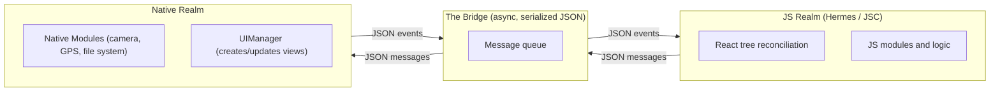

Ogni interazione — creare una view, aggiornare uno stile, leggere le coordinate GPS, gestire un tocco — è un messaggio JSON passato attraverso questa coda. Il Bridge è:

1. **Asincrono.** I messaggi vengono raggruppati e inviati a blocchi. Questo significa che non puoi chiamare una funzione nativa e ottenere un valore di ritorno sincrono.
2. **Serializzato.** Ogni messaggio viene convertito in testo JSON e analizzato dall'altra parte. Passare un array grande significa serializzarlo, copiarlo attraverso il bridge, e deserializzarlo.
3. **Un singolo collo di bottiglia.** Tutte le chiamate ai moduli nativi e tutti gli aggiornamenti della UI condividono la stessa coda. Una raffica di rapidi aggiornamenti della UI può ritardare una chiamata di accesso alla fotocamera che sta dietro di essi.

Il modo più chiaro per immaginare il costo: pensa a due persone in stanze separate che possono comunicare solo scrivendo biglietti, facendoli scivolare sotto una porta, e aspettando una risposta. Anche domande semplici richiedono un viaggio di andata e ritorno, e un'inondazione di biglietti (diciamo, durante uno scroll veloce) intasa lo spazio sotto la porta.

Questo funzionava abbastanza bene per molte app, ma introduceva un overhead misurabile:

- **Penalità all'avvio.** Tutti i moduli nativi dovevano essere inizializzati all'avvio, anche quelli che l'utente potrebbe non usare mai.
- **Costo di serializzazione.** Messaggi frequenti e piccoli (come quelli generati a ogni fotogramma di uno scroll) significavano una continua codifica e decodifica JSON.
- **Nessuna chiamata sincrona.** Alcune API (come ottenere le dimensioni dello schermo) sono intrinsecamente sincrone, ma il Bridge le costringeva a essere asincrone o richiedeva soluzioni alternative poco pulite.

### La nuova architettura: JSI, Fabric e TurboModules

A partire da React Native 0.68 e stabilizzata nella 0.73+, la **New Architecture** sostituisce il Bridge con tre componenti interconnessi, tutti costruiti su una base comune:

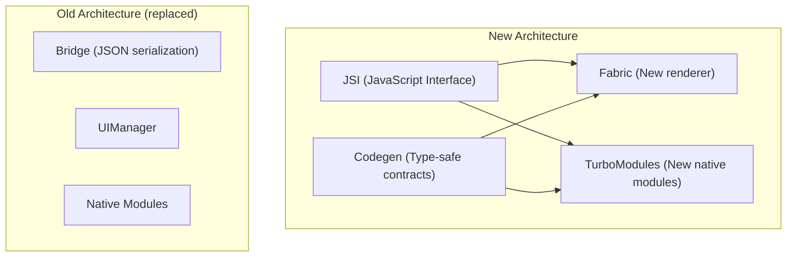

**JSI (JavaScript Interface)** è la base. Invece di serializzare messaggi in JSON e passarli attraverso una coda, JSI permette a JavaScript di mantenere **riferimenti diretti a host object C++**. Il tuo codice JS può chiamare una funzione nativa come se fosse una normale funzione JavaScript — niente serializzazione, niente coda asincrona, niente Bridge.

Tornando all'analogia: il vecchio Bridge era due persone che si passavano biglietti sotto una porta. JSI abbatte il muro così possono parlare faccia a faccia — istantaneamente, e senza dover prima tradurre tutto in biglietti scritti (JSON).

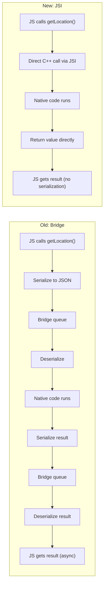

**Fabric** è il nuovo sistema di rendering che sostituisce il vecchio `UIManager`. Con il Bridge, creare e aggiornare view native richiedeva l'invio di messaggi JSON attraverso il bridge. Con Fabric:

- Lo **shadow tree** (l'albero di layout interno di React Native, analogo al render tree del browser) può essere creato e aggiornato in modo sincrono da JavaScript tramite JSI.
- Il layout viene calcolato usando **Yoga** (un motore Flexbox multipiattaforma scritto in C++) e i risultati vengono condivisi tra codice JS e nativo senza serializzazione.
- Il **concurrent rendering** è supportato — Fabric funziona con le funzionalità concurrent di React 18, permettendo rendering interrompibile, transizioni, e `Suspense`.

**TurboModules** sostituiscono il vecchio sistema dei Native Modules. I miglioramenti chiave:

- **Lazy loading.** Un TurboModule viene inizializzato solo quando il tuo codice lo importa per la prima volta, non all'avvio dell'app. Se la tua app ha 50 moduli nativi ma un dato flusso utente ne tocca solo 5, solo quei 5 vengono caricati — riducendo direttamente il tempo di avvio.
- **Accesso sincrono.** Poiché i TurboModules sono collegati tramite JSI, puoi effettuare chiamate sincrone quando l'API ha senso (leggere un valore dallo storage, ottenere informazioni sul dispositivo) invece di costringere tutto a essere una Promise.
- **Type safety tramite Codegen.** Definisci l'interfaccia del modulo in un file di specifica TypeScript o Flow, e il Codegen di React Native genera automaticamente il boilerplate nativo (Objective-C++ su iOS, Java/Kotlin su Android) e i binding JSI. Questo elimina un'intera classe di errori a runtime in cui JS e nativo non erano d'accordo sui tipi degli argomenti.

```tsx
// A TurboModule spec (simplified)
// This TypeScript interface generates native code via Codegen
import type { TurboModule } from 'react-native';
import { TurboModuleRegistry } from 'react-native';

export interface Spec extends TurboModule {
  getDeviceName(): string;            // synchronous — returns immediately
  getBatteryLevel(): Promise<number>; // async when it makes sense
}

export default TurboModuleRegistry.getEnforcing<Spec>('DeviceInfo');
```

Ecco un confronto fianco a fianco delle due architetture, in modo che i nomi smettano di confondersi:

| Aspetto | Vecchia (Bridge) | Nuova (JSI / Fabric / TurboModules) |
|---|---|---|
| Comunicazione JS ↔ nativo | JSON serializzato su una coda | Riferimenti C++ diretti tramite JSI |
| Chiamate sincrone possibili? | No, tutto asincrono | Sì, quando l'API ha senso |
| Caricamento dei moduli nativi | Tutti all'avvio | Lazy, al primo import |
| Renderer | UIManager | Fabric (pronto per il concurrent) |
| Type safety JS ↔ nativo | Nessuna (incongruenze a runtime) | A compile-time tramite Codegen |
| Funzionalità concurrent di React 18 | Limitate | Supportate |

### Cosa significa per te in pratica

Se stai iniziando un nuovo progetto React Native oggi (specialmente con un recente Expo SDK o bare React Native 0.76+), sei sulla New Architecture per impostazione predefinita. Ecco cosa cambia nel tuo lavoro quotidiano:

1. **Avvio più veloce.** Il lazy loading dei TurboModules significa che la tua app carica solo ciò di cui ha bisogno.
2. **Interazioni più fluide.** Il layout sincrono di Fabric significa meno fotogrammi persi durante aggiornamenti complessi della UI.
3. **Migliore compatibilità delle librerie.** L'ecosistema è in gran parte migrato. Librerie come `react-native-reanimated`, `react-native-gesture-handler`, e `react-native-screens` la supportano già. Tuttavia, verifica la compatibilità di una libreria prima di adottarla — alcune librerie più vecchie sono indietro.
4. **Moduli nativi type-safe.** Se mai scrivi il tuo modulo nativo (per accedere a un sensore del dispositivo, ad esempio), Codegen rileva le incongruenze di tipo al momento del build invece di crashare a runtime.

> **Trabocchetto:** Alcuni tutorial più vecchi e risposte di Stack Overflow fanno riferimento a `NativeModules` da `react-native` — quella è la vecchia API basata sul Bridge. Funziona ancora (c'è un livello di compatibilità chiamato "interop layer"), ma per il nuovo codice usa i TurboModules. Se stai usando il workflow gestito di Expo, raramente scrivi moduli nativi tu stesso — il sistema di moduli di Expo gestisce l'astrazione per te.

> **Consiglio da esperto:** Non devi capire JSI per *usare* la New Architecture — è attiva per impostazione predefinita e invisibile. Il motivo per imparare il vocabolario è il debugging: quando il README di una libreria dice "New Architecture support landed in v3" o un errore menziona "Fabric" o "TurboModule," saprai esattamente di quale livello sta parlando.

### Mettendo tutto insieme: il quadro completo

Ecco il quadro completo del runtime di un'app React Native sulla New Architecture — il film completo, dall'inizio alla fine:

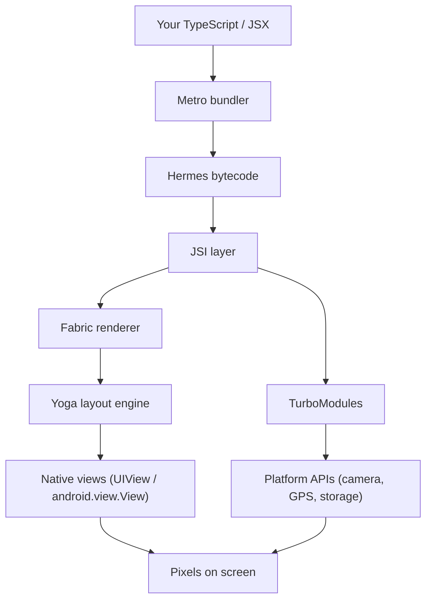

Leggilo come una storia: scrivi componenti React in TypeScript. **Metro** ne fa il bundle. **Hermes** li trasforma in bytecode e lo esegue. Quando i tuoi componenti vengono renderizzati, il reconciler di React produce un albero di descrizioni di view native. **Fabric**, tramite **JSI**, crea e aggiorna le effettive view native sullo UI thread. **Yoga** calcola il layout Flexbox (lo stesso Flexbox che hai scritto nella sezione 2). **TurboModules**, anch'essi tramite JSI, danno al tuo codice JS accesso alle capacità della piattaforma come la fotocamera, il file system, o i sensori — in modo lazy, type-safe, e senza l'overhead di serializzazione del vecchio Bridge.

Questo è l'intero stack dal tuo file `.tsx` ai pixel sullo schermo dell'utente. Se riesci a raccontare quel paragrafo con parole tue, capisci cos'*è* React Native — e ogni capitolo successivo non fa altro che riempire i dettagli di una di queste caselle.

---