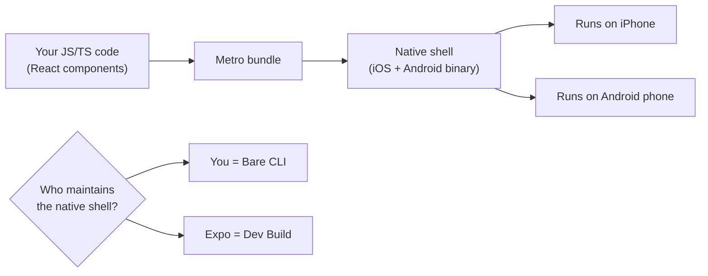
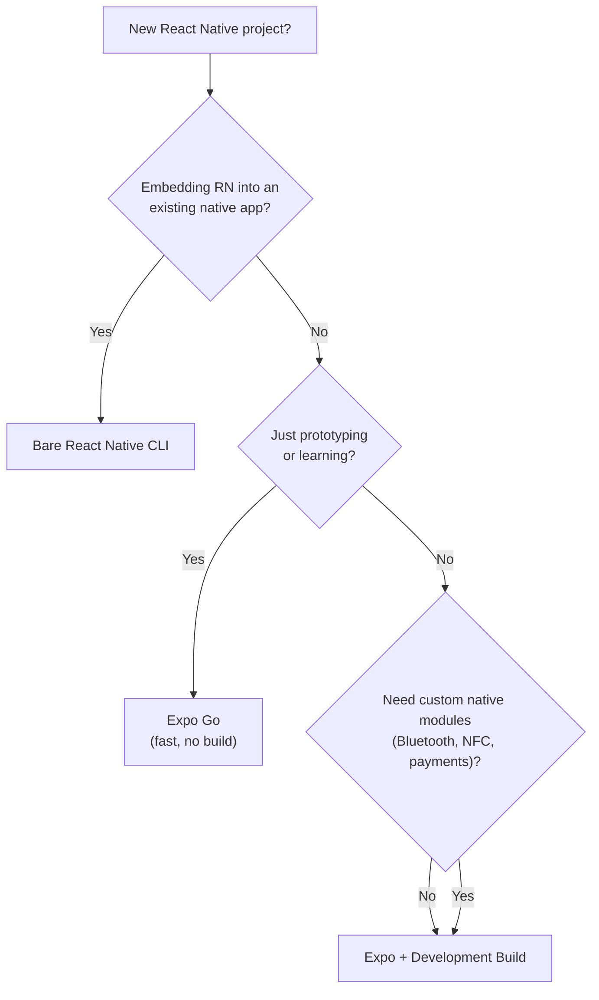
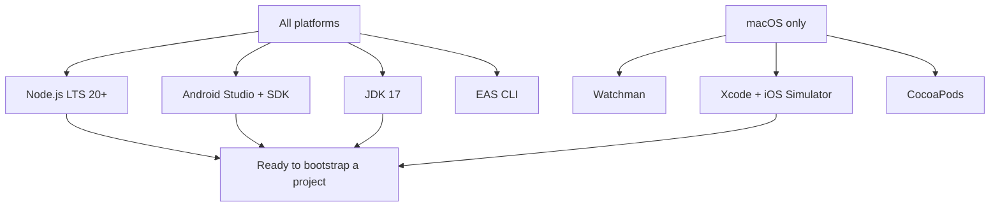
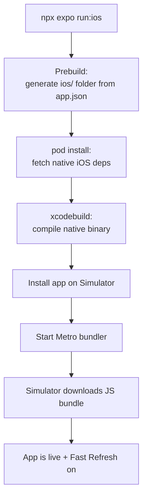
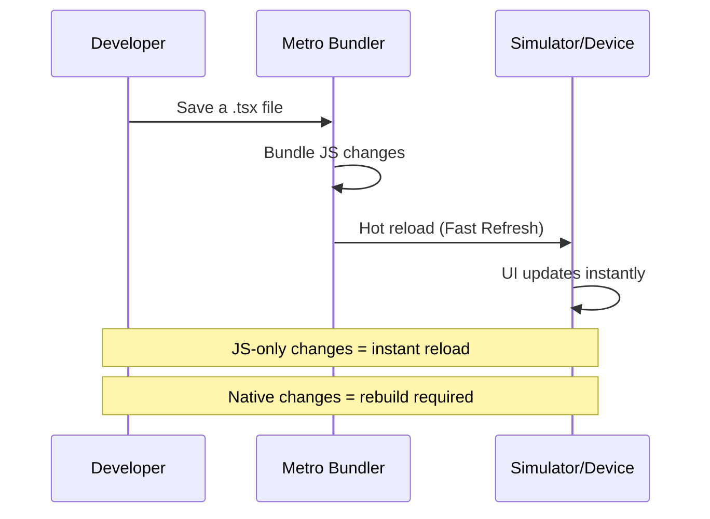
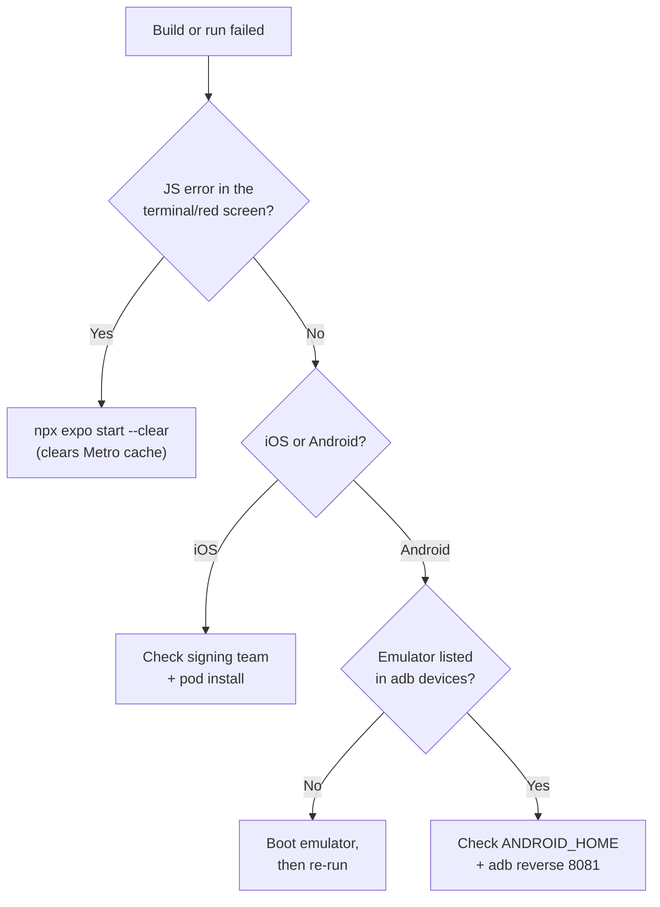

# Configurazione dell'ambiente: da zero all'app in esecuzione

> Configurare Expo, i simulatori e il tuo primo progetto React Native funzionante in meno di 10 minuti.

---

## Table of Contents

1. [Expo vs Bare React Native CLI](#1-expo-vs-bare-react-native-cli)
2. [Required Installs](#2-required-installs)
3. [Project Bootstrap](#3-project-bootstrap)

---

## 1. Expo vs Bare React Native CLI

### La prima decisione che nessuno spiega come si deve

Quando inizi un progetto React per il web, la risposta è semplice: esegui `npm create vite@latest` e prosegui con la tua vita. React Native non è così pulito. Ti trovi subito davanti a un bivio: **Expo** oppure la **bare React Native CLI**. Scegli quella sbagliata e finirai per fare l'eject a metà progetto o per combattere con tooling di cui non avevi mai avuto bisogno. Quindi chiariamo la questione adesso.

La React Native CLI (a volte chiamata RN "bare" o "vanilla") ti consegna un progetto Xcode grezzo e un progetto Android Gradle grezzo collocati proprio nel tuo repo. Hai il controllo totale — e la responsabilità totale. Configuri tu stesso il signing di Xcode, le build variant di Gradle, CocoaPods, il linking dei moduli nativi e le regole ProGuard. È l'equivalente di fare l'eject da Create React App nel 2018 e cablare Webpack a mano.

**Expo** si colloca sopra React Native e gestisce i progetti nativi al posto tuo. È nato come una sandbox chiusa (il vecchio "Managed Workflow") ma si è evoluto in modo radicale. L'approccio moderno — **Expo con i Development Build** — ti fornisce un binario nativo personalizzato che include qualsiasi modulo nativo ti serva davvero, compilato nel cloud o in locale, mentre Expo gestisce la pipeline di build, gli aggiornamenti OTA e la configurazione tramite un unico file `app.json`.

### Cosa significa davvero "gestire i progetti nativi"

Ecco il modello mentale. Un'app React Native è in realtà *due* programmi incollati insieme:

1. Un **guscio nativo** — un'effettiva app iOS (Swift/Objective-C, compilata da Xcode) e un'effettiva app Android (Kotlin/Java, compilata da Gradle). Questo guscio sa come avviarsi, disegnare una finestra e dialogare con la fotocamera, il GPS e il filesystem.
2. Un **bundle JavaScript** — i tuoi componenti React, la logica di business e gli stili, eseguiti all'interno di quel guscio da un motore JS (Hermes).

Il guscio nativo cambia raramente. Il JavaScript cambia ogni volta che salvi un file. L'intero dibattito "Expo vs bare" si riduce a una singola domanda: **chi possiede e mantiene quel guscio nativo — tu o uno strumento?**



> **Perché è importante:** Sul web, il "guscio" è il browser, e tu non lo mantieni mai — Chrome viene rilasciato, tu scrivi solo JS. La bare React Native fa di *te* il fornitore del browser: possiedi il sorgente del guscio e devi far sì che continui a compilare. Expo restituisce quel lavoro a uno strumento, il che è più vicino all'esperienza web che già conosci.

### Il confronto di cui hai davvero bisogno

| Criterio | Expo + Dev Build | Bare React Native CLI |
|---|---|---|
| **Tempo di setup** | ~5 minuti | 30-60 minuti |
| **Accesso al codice nativo** | Completo (tramite config plugin + dev client) | Completo (possiedi tu i progetti Xcode/Android) |
| **Aggiornamenti OTA** | Integrati con `expo-updates` | Setup manuale con CodePush o personalizzato |
| **Pipeline di build** | EAS Build (cloud) o locale | Xcode + Gradle in locale |
| **Percorso di aggiornamento** | `npx expo install` gestisce la compatibilità | `react-native upgrade` manuale e soggetto a errori |
| **Chi possiede ios/ e android/** | Expo li rigenera su richiesta | Li committi e li mantieni a mano |
| **Ideale per** | il 95% dei nuovi progetti | App brownfield, codice nativo profondamente personalizzato |

### Una terza opzione di cui sentirai parlare: Expo Go

Prima dei Development Build, c'era **Expo Go** — un'app pre-compilata che scarichi dall'App Store / Play Store e che può eseguire *qualsiasi* JavaScript Expo senza compilare un binario nativo. Per la prima ora sembra magico, poi si va a sbattere contro un muro: include un set *fisso* di moduli nativi. Nel momento in cui ti serve una libreria che Expo Go non ha incluso (Bluetooth, acquisti in-app, un SDK personalizzato), semplicemente non riesce a caricare la tua app.

| Approccio | Compili un binario nativo? | Puoi aggiungere QUALSIASI modulo nativo? | Ideale per |
|---|---|---|---|
| **Expo Go** | No — usi l'app pre-compilata | No — solo i moduli inclusi | Prototipi rapidi, apprendimento, demo |
| **Expo Dev Build** | Sì — il tuo client personalizzato | Sì — qualsiasi modulo + config plugin | App reali (consigliato) |
| **Bare CLI** | Sì — Xcode/Gradle grezzi | Sì — ma lo cabli manualmente | Brownfield, team nativi |

> **Errore comune:** I principianti costruiscono l'intera app in Expo Go, per poi scoprire a metà strada che la libreria di pagamenti di cui hanno bisogno non si carica. Passare a un Dev Build in seguito è facile, ma è meno sorprendente partire da lì. Usa Expo Go per *imparare*; usa un Dev Build per qualsiasi cosa tu intenda rilasciare.

### La raccomandazione

Usa **Expo con i Development Build**. Non si tratta della vecchia sandbox "Expo Go" che non poteva usare moduli nativi personalizzati. Lo stack Expo moderno ti offre tutto ciò che offre la bare CLI, meno il pe�so della manutenzione dei progetti Xcode e Gradle grezzi. Puoi comunque scrivere Objective-C, Swift, Java o Kotlin nativo quando serve — il sistema di config plugin di Expo ed `expo-modules-core` rendono il tutto trasparente.

L'unica situazione in cui la bare CLI ha senso oggi è se stai integrando React Native in un'**app nativa esistente** (uno scenario "brownfield") oppure se la tua azienda ha un team di build nativi che insiste nel possedere direttamente il progetto Xcode.



> **Nota:** Se provieni dal React per il web e hai usato `create-react-app` o Vite, pensa a Expo come al Vite di React Native — si occupa del complesso tooling di build così puoi concentrarti sulla scrittura dei componenti. La bare CLI è come configurare Webpack, Babel e PostCSS da zero.

---

## 2. Required Installs

### Lo stack di dipendenze è più grande di quanto ti aspetti

Sul web, ti servono Node.js e un browser. Tutto qui. React Native compila in vero codice nativo, quindi ti serve l'intera toolchain nativa per ogni piattaforma che vuoi targettizzare. Questa è la parte più dolorosa per iniziare — ma la fai una volta sola.

Il motivo per cui la lista è lunga: ogni piattaforma target ha il *proprio* compilatore, il *proprio* package manager e il *proprio* dispositivo virtuale. Le build iOS girano solo su macOS (regola di Apple, non di React Native), quindi la toolchain si divide naturalmente nei gruppi "tutti" e "solo macOS".



Ecco ogni strumento di cui hai bisogno, in ordine di installazione.

### Node.js (LTS 20+)

Lo hai già se fai lavoro con React per il web. Verifica:

```bash
node --version
# Should print v20.x.x or higher
```

In caso contrario, installalo da [nodejs.org](https://nodejs.org) o usa un version manager come `nvm` (macOS/Linux) o `nvm-windows`. Expo SDK 52+ richiede come minimo Node 18, ma dovresti stare su LTS 20 o 22.

> **Consiglio da esperto:** Usa un version manager invece dell'installer di sistema. Progetti diversi fissano versioni di Node diverse, e `nvm use 20` è meglio che reinstallare Node a mano. Su macOS/Linux un file `.nvmrc` nel repo ti permette di digitare semplicemente `nvm use`.

### Watchman (solo macOS)

Watchman è un servizio di file-watching di Meta che rende il Metro bundler (l'equivalente di Vite/Webpack per React Native) drasticamente più veloce su macOS. Senza di esso, gli hot reload su progetti grandi possono rallentare.

```bash
brew install watchman
```

Su Windows e Linux, Metro usa il proprio file watcher. Lì non ti serve Watchman.

> **Perché esiste:** L'API nativa di macOS per i cambiamenti dei file è lenta quando si osservano migliaia di file contemporaneamente (e `node_modules` è esattamente questo). Watchman mantiene un indice in memoria così Metro viene a sapere del tuo salvataggio in millisecondi invece di interrogare il disco. Pensalo come la differenza tra qualcuno che *ti dice* che un file è cambiato e tu che ricontrolli ripetutamente ogni file.

### Xcode e iOS Simulator (solo macOS)

**Non puoi** compilare app iOS su Windows o Linux. Punto. Se non hai un Mac, salta iOS per ora e lavora solo con Android — oppure usa EAS Build nel cloud e testa su un iPhone fisico.

1. Installa Xcode dal Mac App Store (è di circa 12 GB, avvia il download adesso).
2. Apri Xcode almeno una volta e accetta il contratto di licenza.
3. Installa gli Xcode Command Line Tools:

```bash
xcode-select --install
```

4. Installa CocoaPods (gestore di dipendenze iOS):

```bash
sudo gem install cocoapods
```

> **Cos'è CocoaPods:** È l'`npm` del mondo iOS. Le librerie native iOS sono distribuite come "pod", e `pod install` le collega al progetto Xcode. Raramente lo chiami direttamente con Expo — `npx expo run:ios` lo esegue per te — ma quando una build iOS si rompe, una cartella Pods obsoleta è spesso la colpevole.

> **Trabocchetto:** Se `gem install` fallisce con un errore di permessi sulle versioni più recenti di macOS, usa invece `brew install cocoapods`. La versione di Homebrew evita di scontrarsi con il Ruby di sistema di Apple.

5. Apri Xcode, vai su **Settings > Platforms** e scarica almeno un runtime dell'iOS Simulator (iOS 17+ consigliato).

> **Simulator vs emulator — la terminologia conta:** Apple chiama il suo dispositivo iOS "il **Simulator**"; Google chiama il suo dispositivo Android "l'**Emulator**". Non sono termini intercambiabili. L'iOS Simulator esegue la tua app contro una *re-implementazione* dei framework iOS sul tuo Mac (veloce, ma non un vero OS). L'Android Emulator avvia un'*effettiva* immagine dell'OS Android all'interno di una macchina virtuale (più lenta, più fedele). Sapere quale sia quale evita confusione nella lettura dei messaggi di errore.

### Android Studio, Android SDK ed Emulator

Questo è richiesto su **tutti** i sistemi operativi se vuoi eseguire su Android.

1. Scarica e installa [Android Studio](https://developer.android.com/studio).
2. Durante il setup, assicurati che questi componenti siano selezionati:
   - Android SDK
   - Android SDK Platform-Tools
   - Android Virtual Device (AVD)
3. Apri Android Studio, vai su **SDK Manager** (Settings > Languages & Frameworks > Android SDK) e installa:
   - **Scheda SDK Platforms:** Android 14 (API 34) o più recente
   - **Scheda SDK Tools:** Android SDK Build-Tools, Android Emulator, Android SDK Platform-Tools

4. Crea un emulatore tramite **Device Manager**:

```
Device: Pixel 7 (or Pixel 8)
System Image: API 34 (x86_64 or arm64 depending on your machine)
```

> **Consiglio da esperto:** Scegli la system image che corrisponde all'architettura della tua CPU. Sui Mac Apple Silicon (M1/M2/M3), scegli **arm64**; sui Mac Intel e sulla maggior parte dei PC Windows, scegli **x86_64**. L'architettura sbagliata viene eseguita attraverso una lenta traduzione software e l'emulatore arranca.

5. Imposta le variabili d'ambiente. Su macOS/Linux, aggiungi al tuo `~/.zshrc` o `~/.bashrc`:

```bash
export ANDROID_HOME=$HOME/Library/Android/sdk
export PATH=$PATH:$ANDROID_HOME/emulator
export PATH=$PATH:$ANDROID_HOME/platform-tools
```

Su Windows, imposta `ANDROID_HOME` su `%LOCALAPPDATA%\Android\Sdk` nelle Variabili d'Ambiente di Sistema, e aggiungi le sottocartelle `emulator` e `platform-tools` al tuo `PATH`.

> **Perché queste voci del PATH contano:** `platform-tools` contiene `adb` (l'Android Debug Bridge — lo strumento che installa e dialoga con la tua app su un dispositivo). `emulator` contiene il comando per avviare i dispositivi virtuali dal terminale. Se non sono nel tuo `PATH`, Expo riesce a trovare l'SDK ma tu non puoi eseguire `adb` da solo durante il debug — e metà dei passaggi di troubleshooting più avanti in questo capitolo dipendono da `adb`.

6. Verifica che funzioni:

```bash
adb --version
# Should print Android Debug Bridge version
```

### JDK 17

La build Android di React Native richiede JDK 17. Android Studio include un JDK, ma è più sicuro averne uno standalone:

```bash
# macOS
brew install --cask zulu@17

# Windows (via Chocolatey)
choco install zulu17

# Verify
java -version
# Should print openjdk version "17.x.x"
```

> **Perché un JDK?** Le app Android sono costruite da Gradle, e Gradle gira sulla Java Virtual Machine. Il JDK (Java Development Kit) fornisce quel runtime più il compilatore Java. Non scriverai Java — ma la toolchain di build sotto la tua app React Native è Java fino in fondo.

> **Trabocchetto:** JDK 21 potrebbe sembrare una buona idea dato che è l'ultimo LTS, ma la configurazione Gradle di React Native è pensata specificamente per JDK 17. Usare il 21 può produrre errori di build criptici. Resta sul 17.

### EAS CLI

EAS (Expo Application Services) è il modo in cui costruisci e invii le app senza lottare direttamente con Xcode e Gradle. Installalo globalmente:

```bash
npm install -g eas-cli
```

EAS Build compila la tua app sulle macchine cloud di Expo — il che significa che puoi produrre una **build iOS senza possedere un Mac** e una build Android senza una potente macchina locale. È la via di fuga per il problema "sono su Windows e mi serve una build per iPhone".

```bash
# Typical EAS first-run flow (later chapter covers this in depth)
eas login                 # sign into your Expo account
eas build:configure       # creates eas.json with build profiles
eas build --platform ios  # compiles in the cloud, returns an installable build
```

### La checklist completa

```
┌─────────────────────────────────────────────────────────────┐
│                  Required Installs Checklist                │
├─────────────────────────────────────────────────────────────┤
│                                                             │
│  All platforms:                                             │
│  ✓ Node.js LTS 20+                                         │
│  ✓ Android Studio + Android SDK (API 34+)                   │
│  ✓ Android Emulator (Pixel 7, API 34)                       │
│  ✓ JDK 17 (Azul Zulu recommended)                           │
│  ✓ EAS CLI (npm install -g eas-cli)                         │
│                                                             │
│  macOS additional:                                          │
│  ✓ Watchman                                                 │
│  ✓ Xcode + iOS Simulator runtime                            │
│  ✓ CocoaPods                                                │
│  ✓ Xcode Command Line Tools                                 │
│                                                             │
│  Not required:                                              │
│  ✗ Expo Go app (we use Development Builds instead)          │
│  ✗ Ruby version manager (unless CocoaPods demands it)       │
│                                                             │
└─────────────────────────────────────────────────────────────┘
```

> **Consiglio da esperto:** Expo include una diagnostica a comando singolo che controlla gran parte di quanto sopra al posto tuo. Esegui `npx expo-doctor` all'interno di un progetto (o `npx expo install --check`) e segnalerà strumenti mancanti, versioni non corrispondenti e problemi dell'SDK prima che si trasformino in una build fallita.

> **Errore comune:** Molti tutorial ti dicono di installare il pacchetto `react-native-cli` globalmente. **Non farlo.** Va in conflitto con il workflow Expo moderno e non è più consigliato nemmeno per i progetti bare. Il comando `npx` gestisce tutto ciò di cui hai bisogno.

---

## 3. Project Bootstrap

### Dalla cartella vuota all'app in esecuzione

Sul web, `npm create vite@latest` ti dà un dev server funzionante in circa 15 secondi. React Native richiede un po' di più perché deve installare le dipendenze native e costruire un binario nativo — ma Expo lo mantiene il più indolore possibile.

### Crea il progetto

```bash
npx create-expo-app@latest my-app
cd my-app
```

Questo crea lo scaffold di un nuovo progetto Expo con TypeScript, routing basato sui file (tramite Expo Router) e una struttura di default sensata. Vedrai qualcosa del genere:

```
my-app/
├── app/                    # File-based routes (like Next.js pages/)
│   ├── (tabs)/             # Tab navigator group
│   │   ├── index.tsx       # Home tab
│   │   └── explore.tsx     # Explore tab
│   ├── _layout.tsx         # Root layout
│   └── +not-found.tsx      # 404 screen
├── assets/                 # Images, fonts
├── components/             # Shared components
├── constants/              # Theme colors, config
├── app.json                # Expo configuration
├── package.json
└── tsconfig.json
```

Nota che non c'è ancora alcuna cartella `ios/` o `android/`. Expo le genera quando crei un development build. Questa è una funzionalità, non una limitazione — significa che quelle cartelle sono artefatti derivati, non codice sorgente che mantieni.

> **Confronto web:** `app.json` in Expo è come `vite.config.ts` sul web — è il tuo file di configurazione centrale. Solo che controlla anche l'icona dell'app, lo splash screen, i permessi e le impostazioni dei moduli nativi. Un unico file per governarli tutti.

### Come un comando "run" si trasforma in un'app in esecuzione

Prima di eseguire qualsiasi cosa, è utile vedere cosa orchestra davvero `npx expo run:ios` sotto il cofano. La stessa struttura si applica ad Android — cambiano solo gli strumenti (Gradle invece di Xcode, APK invece di `.app`).



La parte lenta è **compile** — trasformare il sorgente nativo in un binario. Questo avviene una volta sola. Dopodiché, ogni modifica che fai attraversa solo i due passaggi in basso (Metro → JS bundle), motivo per cui i reload successivi sembrano istantanei.

### Esegui su iOS Simulator (solo macOS)

```bash
npx expo run:ios
```

La prima esecuzione richiede 3-5 minuti perché sta compilando l'intero progetto nativo. Le esecuzioni successive sono molto più veloci grazie alla cache. Questo comando:

1. Genera la directory `ios/` se non esiste
2. Installa le dipendenze CocoaPods
3. Compila il binario nativo tramite `xcodebuild`
4. Installa l'app sull'iOS Simulator
5. Avvia il Metro bundler (il dev server JS)

Dovresti vedere l'app di default basata su tab sul simulatore.

> **Consiglio da esperto:** Per avviare su un simulatore *specifico* invece che su quello di default, passa `--device`: `npx expo run:ios --device "iPhone 15 Pro"`. Senza un flag, Expo sceglie il simulatore che si è avviato per ultimo.

### Esegui su Android Emulator

Assicurati prima che il tuo emulatore Android sia in esecuzione (avvialo dal Device Manager di Android Studio), poi:

```bash
npx expo run:android
```

Stessa storia: la prima build è lenta, le successive sono veloci. Questo genera la directory `android/`, esegue `gradlew assembleDebug` e installa l'APK sull'emulatore.

> **Trabocchetto:** A differenza di `run:ios`, `run:android` *non* avvia sempre un emulatore al posto tuo. Se nessun emulatore è in esecuzione e nessun dispositivo fisico è collegato, la build termina ma non ha dove installare l'app e fallisce all'ultimo passaggio. Avvia prima l'emulatore, poi esegui il comando.

Ecco la stessa pipeline passo-passo di iOS, mappata sulla toolchain Android così puoi vedere i parallelismi:

| Passaggio | iOS | Android |
|---|---|---|
| Genera il progetto nativo | `prebuild` → `ios/` | `prebuild` → `android/` |
| Recupera le dipendenze native | `pod install` | Gradle risolve le dipendenze |
| Compila il binario | `xcodebuild` | `gradlew assembleDebug` |
| Artefatto in output | `.app` | `.apk` |
| Target di installazione | iOS Simulator | Android Emulator / dispositivo |
| Dev server JS | Metro | Metro (condiviso) |

### Il loop di sviluppo

Una volta che l'app è in esecuzione, il tuo workflow ha questo aspetto:



**Fast Refresh** funziona esattamente come l'HMR sul web — salvi un file, e il componente viene ri-renderizzato senza perdere lo state. La differenza chiave: se aggiungi una nuova dipendenza **nativa** (come una libreria per la fotocamera che include codice Objective-C o Java), devi ricostruire il binario nativo con `npx expo run:ios` o `npx expo run:android`. Le modifiche puramente JavaScript/TypeScript non richiedono mai una ricostruzione.

La regola pratica per "devo ricostruire?":

| Hai modificato... | Ricostruire il binario nativo? | Perché |
|---|---|---|
| Un componente `.tsx` o uno stile | No — Fast Refresh | JS puro, vive nel Metro bundle |
| Logica dell'app, hooks, navigazione | No — Fast Refresh | È ancora JS |
| Aggiunto un pacchetto npm solo-JS | No (di solito) | Nessun codice nativo da compilare |
| Aggiunto un pacchetto con codice nativo | **Sì** | Il nuovo Objective-C/Kotlin deve essere compilato |
| Modificato `app.json` (icona, permessi, plugin) | **Sì** | La config alimenta il progetto nativo in fase di prebuild |
| Cambiata una variabile d'ambiente usata a livello nativo | **Sì** | Incorporata nel binario in fase di build |

> **Consiglio da esperto:** Una grande parte dei momenti "perché la mia modifica non compare?" è qualcuno che modifica `app.json` o installa un modulo nativo aspettandosi che Fast Refresh lo recepisca. Nel dubbio, ferma il bundler e riesegui `npx expo run:ios/android`.

### Verificare che tutto funzioni

Apri `app/(tabs)/index.tsx` nel tuo editor e cambia del testo. Salva il file e osserva il simulatore aggiornarsi entro un secondo o due. Se funziona, il tuo ambiente è configurato correttamente.

Andiamo un passo oltre e assicuriamoci che tu sappia scrivere un componente. Sostituisci il contenuto di `app/(tabs)/index.tsx` con:

```tsx
import { StyleSheet, Text, View } from 'react-native';

export default function HomeScreen() {
  return (
    <View style={styles.container}>
      <Text style={styles.title}>It works!</Text>
      <Text style={styles.subtitle}>
        Your React Native environment is ready.
      </Text>
    </View>
  );
}

const styles = StyleSheet.create({
  container: {
    flex: 1,
    alignItems: 'center',
    justifyContent: 'center',
    backgroundColor: '#fff',
  },
  title: {
    fontSize: 32,
    fontWeight: 'bold',
    marginBottom: 8,
  },
  subtitle: {
    fontSize: 16,
    color: '#666',
  },
});
```

Salva. Il simulatore dovrebbe mostrare la tua nuova schermata istantaneamente.

> **Confronto web:** Nota che non c'è alcun `className` né alcun file CSS. In React Native, usi `StyleSheet.create` con oggetti JavaScript che assomigliano al CSS ma usano nomi di proprietà in camelCase. Non c'è cascade, non c'è specificità, non c'è `!important`. Ogni stile è limitato al suo componente. Tratteremo lo styling in dettaglio in un capitolo successivo.

Altre due cose in quello snippet che spiazzano gli sviluppatori web:

- **`<View>` invece di `<div>`, `<Text>` invece di `<span>`/`<p>`.** React Native non ha DOM. `View` corrisponde a un `UIView` nativo (iOS) / `android.view.View` (Android); `Text` corrisponde a un elemento di testo nativo. Sul web qualsiasi testo può stare sciolto dentro un `div` — in React Native, *tutto* il testo deve essere racchiuso in `<Text>` o solleva un errore.
- **`flex: 1` sta facendo un lavoro reale.** React Native usa Flexbox per *tutto* il layout (non esiste `block`, `inline` o `grid`), e soprattutto `flexDirection` ha come default `column`, non `row` come sul web. `flex: 1` qui dice al container di riempire l'intero schermo così il contenuto può centrarsi al suo interno.

### Risoluzione dei problemi comuni di setup

Quando una build fallisce, procedi dall'alto verso il basso attraverso questo albero decisionale prima di farti prendere dal panico — la maggior parte dei fallimenti rientra in una manciata di cause note:



**Conflitto di porta del Metro bundler:**

```bash
# If port 8081 is already in use
npx expo start --port 8082
```

**La build iOS fallisce con un errore di "signing":**
Apri `ios/myapp.xcworkspace` in Xcode, seleziona il target del progetto e imposta un Development Team valido sotto Signing & Capabilities. Ti serve un account Apple Developer gratuito o a pagamento.

> **Perché esiste il signing:** Apple rifiuta di installare un'app su un dispositivo a meno che non sia firmata crittograficamente da uno sviluppatore noto. Il Simulator è più permissivo, ma i dispositivi reali e alcuni passaggi di build esigono un team valido. Un Apple ID *gratuito* è sufficiente per firmare per lo sviluppo locale — ti serve l'account a pagamento (99 $/anno) solo per pubblicare sull'App Store.

**Emulatore Android non rilevato:**
Assicurati che l'emulatore sia completamente avviato prima di eseguire `npx expo run:android`. Puoi verificare che ADB lo veda:

```bash
adb devices
# Should list your emulator
```

**`pod install` fallisce su macOS:**
Di solito significa un mismatch di versione di Ruby o CocoaPods. La soluzione drastica:

```bash
cd ios
bundle install        # If a Gemfile exists
bundle exec pod install
cd ..
```

**La build Gradle fallisce con "SDK location not found":**
La tua variabile d'ambiente `ANDROID_HOME` non è impostata o punta al percorso sbagliato. Ricontrollala:

```bash
echo $ANDROID_HOME
# macOS/Linux: should print something like /Users/you/Library/Android/sdk
# Windows (PowerShell): echo $env:ANDROID_HOME
```

**"Unable to load script" su Android:**
Il Metro bundler potrebbe non essere raggiungibile dall'emulatore. Esegui:

```bash
adb reverse tcp:8081 tcp:8081
```

Questo inoltra la porta 8081 dell'emulatore alla porta 8081 della tua macchina.

> **Perché succede:** L'emulatore è di fatto una macchina separata su una rete virtuale. `localhost:8081` all'interno dell'emulatore significa *l'emulatore stesso*, non il tuo Mac/PC dove gira Metro. `adb reverse` apre un tunnel così il `localhost:8081` dell'emulatore raggiunge il server Metro della tua macchina. (Su un dispositivo *fisico* sulla stessa Wi-Fi, Expo risolve la cosa in modo diverso — di solito tramite un URL LAN.)

> **Consiglio da esperto:** Quando le cose vanno davvero storte, il comando di reset è tuo amico:
> ```bash
> npx expo start --clear
> ```
> Questo svuota la cache di Metro e spesso risolve misteriosi errori di bundling. È l'equivalente React Native di cancellare `node_modules` e reinstallare — ma più veloce.

> **Il martello di reset più grosso:** Se `--clear` non basta, i progetti nativi stessi potrebbero essere obsoleti. Poiché Expo tratta `ios/` e `android/` come artefatti *generati*, puoi cancellarli tranquillamente ed eseguire `npx expo prebuild --clean` per rigenerarne di nuovi a partire da `app.json`. Questo risolve un'intera classe di problemi del tipo "la settimana scorsa compilava e ora no" che sarebbero terrificanti in un progetto bare dove quelle cartelle sono sorgenti mantenuti a mano.

---