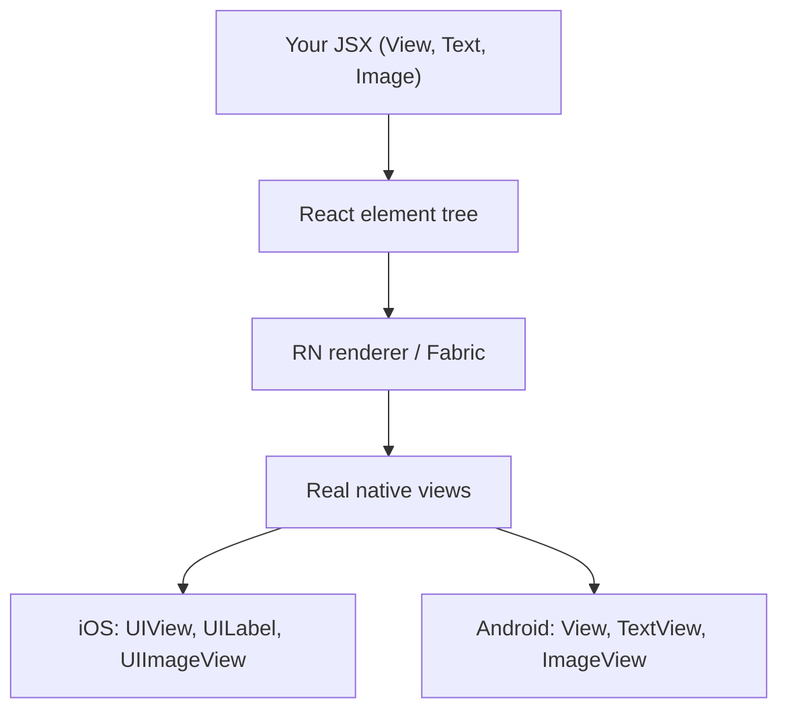
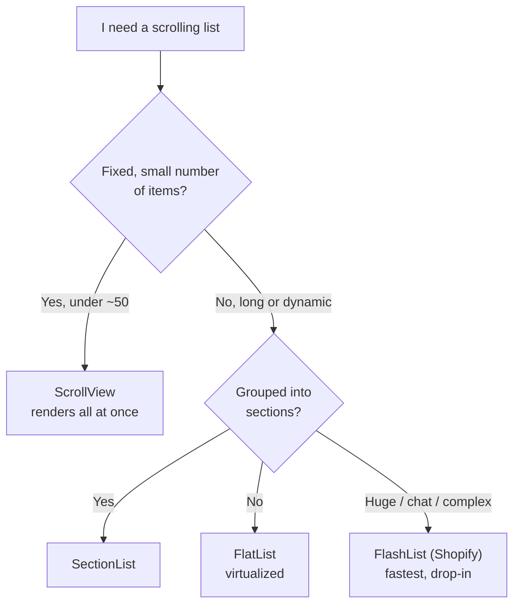
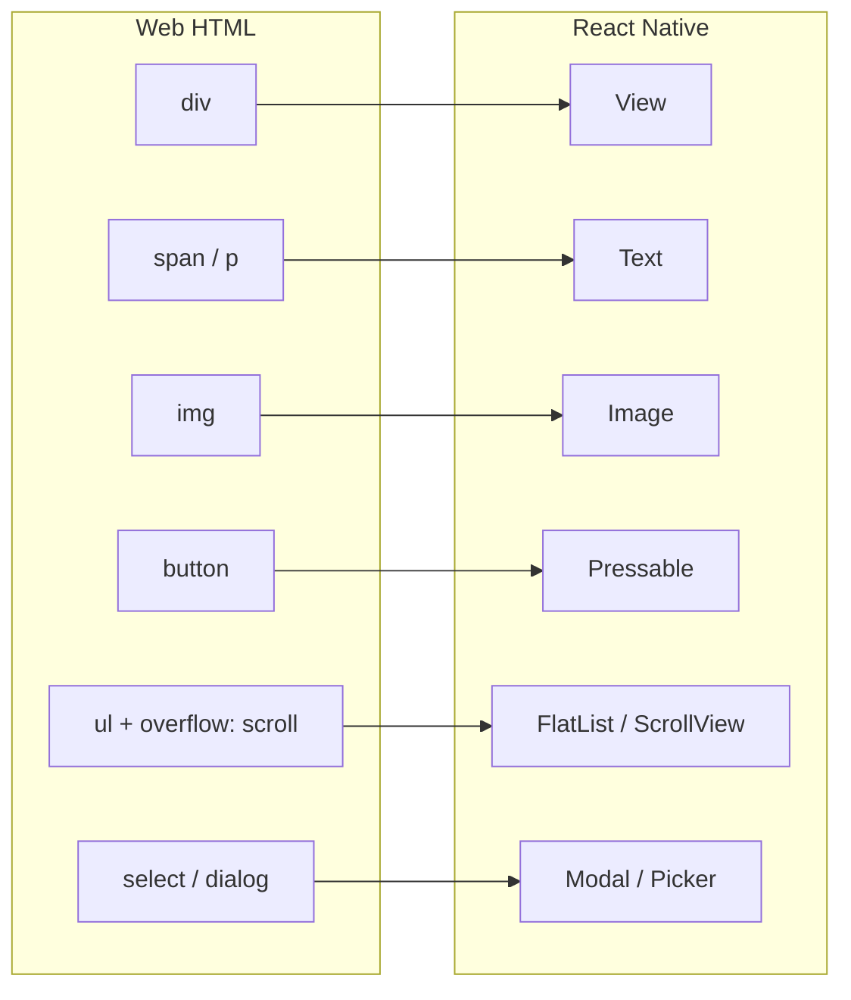
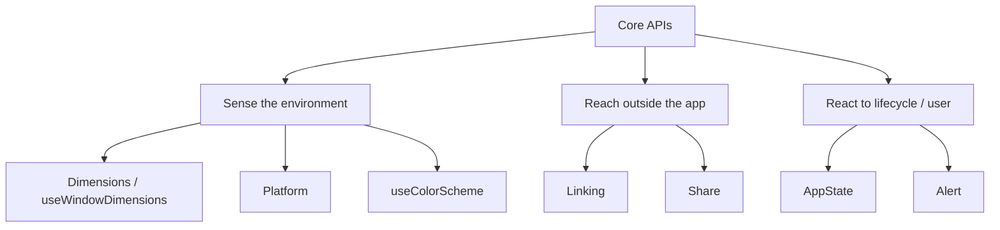
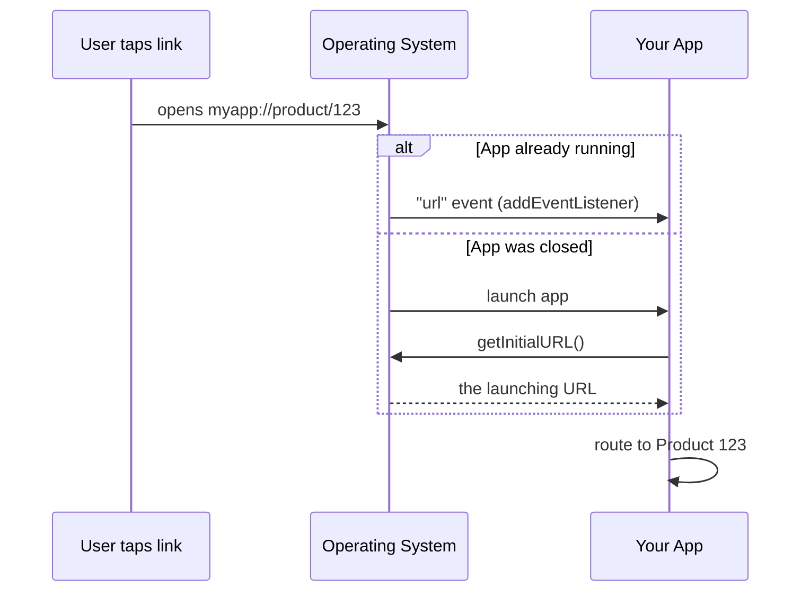
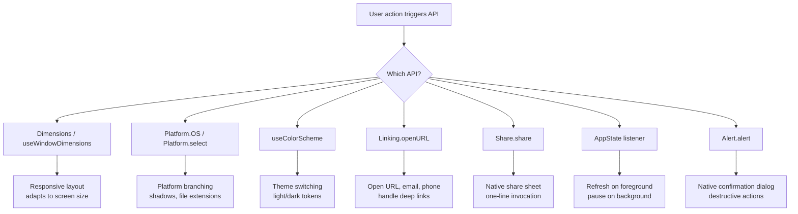

# Componenti e API di Base: i Mattoni Fondamentali

> Le primitive native che sostituiscono gli elementi HTML, e le API di piattaforma che userai ogni giorno.

---

## Table of Contents
1. [Building-Block Components](#1-building-block-components)
2. [Core APIs to Internalize](#2-core-apis-to-internalize)

---

## 1. Componenti Mattone

Sul web hai `<div>`, `<span>`, ``, `<button>`, `<ul>` e il resto della specifica HTML. In React Native disponi di un insieme di primitive più ridotto e più intenzionale. Ogni pixel sullo schermo nasce dalla composizione di questi mattoni. Imparali a fondo: sono il tuo intero vocabolario.

### Perché così poche primitive?

Sul web, il browser include centinaia di elementi HTML e il motore del browser mappa ciascuno su un comportamento di rendering nativo. React Native adotta un approccio diverso: ogni componente di base è un sottile wrapper JavaScript attorno a una **vera view nativa** — `UIView` / `RCTView` su iOS, `android.view.View` su Android. Quando scrivi `<View>`, il framework istanzia un widget nativo reale che il sistema operativo disegna. Non c'è alcun DOM, nessun HTML, nessun motore CSS nel mezzo.

È tutto qui il cambiamento di modello mentale. Sul web descrivi un documento e il browser lo dipinge. In React Native assembli un albero di widget nativi, e React mantiene quell'albero nativo sincronizzato con lo state dei tuoi componenti.



> **Modello mentale:** un componente React Native non è "come" un widget nativo — a runtime *è* un widget nativo. È per questo che la tua app sembra nativa: non c'è alcuna web view, nessuno scrolling emulato, nessun pulsante finto. Il compromesso è che ottieni solo le primitive che il framework espone, quindi componi UI più ricche a partire da questo piccolo insieme.

Ecco lo schema riassuntivo che mappa il vocabolario web che già conosci su quello nativo:

| Web (HTML/CSS) | React Native | Note |
| --- | --- | --- |
| `<div>` | `View` | Contenitore di layout, niente testo, niente scroll |
| `<span>` / `<p>` | `Text` | L'unico posto in cui possono vivere le stringhe |
| `` | `Image` | Le immagini remote richiedono una dimensione esplicita |
| `<button>` / `<a onClick>` | `Pressable` | Gestione del tocco + stati di pressione |
| `<ul>` con `overflow: scroll` | `ScrollView` / `FlatList` | Liste piccole vs. grandi |
| `<input>` / `<textarea>` | `TextInput` | Controllato allo stesso modo del web |
| `<dialog>` / overlay modale | `Modal` | Presentazione nativa |
| `<select>` | `Picker` della community | Non più nel core |

### View: il Contenitore Universale

`View` è il tuo `<div>`. È un contenitore non scrollabile che supporta il layout flexbox, lo styling, la gestione del tocco e l'accessibilità. A differenza di un div, non renderizza testo — prova a mettere una stringa grezza dentro una `View` e otterrai una schermata rossa.

```tsx
import { View, StyleSheet } from "react-native";

function Card({ children }: { children: React.ReactNode }) {
  return <View style={styles.card}>{children}</View>;
}

const styles = StyleSheet.create({
  card: {
    padding: 16,
    borderRadius: 12,
    backgroundColor: "#fff",
    // Shadow on iOS
    shadowColor: "#000",
    shadowOffset: { width: 0, height: 2 },
    shadowOpacity: 0.1,
    shadowRadius: 4,
    // Shadow on Android
    elevation: 3,
  },
});
```

Due cose della `View` sorprendono gli sviluppatori web:

- **Il flexbox è il comportamento predefinito, e `flexDirection` ha come valore di default `column`, non `row`.** Sul web, un `<div>` dispone i propri figli dall'alto verso il basso nel flusso del documento, e il flexbox è opt-in con `display: flex` (che ha come default `row`). In React Native ogni `View` è già un contenitore flex, e l'asse principale scorre verticalmente perché gli schermi dei telefoni sono alti. Se la tua riga di pulsanti si impila verticalmente quando ti aspettavi fossero affiancati, hai dimenticato `flexDirection: "row"`.
- **Non esistono `display`, né `float`, né `position: sticky`, né grid.** Il layout è flexbox più il posizionamento assoluto, e questo è tutto. Sembra limitante ma in realtà è liberatorio — c'è esattamente un solo sistema di layout da imparare.

> **Trabocchetto:** le ombre funzionano in modo completamente diverso su iOS rispetto ad Android. iOS usa le proprietà `shadow*`; Android usa `elevation`. Le scriverai entrambe, ogni volta. Esistono librerie come `react-native-shadow-2`, ma la maggior parte dei team accetta semplicemente la duplicazione. (A partire dalle versioni recenti di RN sta arrivando una prop di stile unificata `boxShadow` — ma `elevation` + `shadow*` rimane oggi l'approccio portabile.)

> **Consiglio da esperto:** la `View` può catturare i tocchi senza essere un pulsante. Aggiungi `onStartShouldSetResponder` per il lavoro di gesture a basso livello, ma nel 95% dei casi vorrai invece `Pressable` — opta per quello, non per una `View` che gestisce il tocco.

### Text: l'Unico Posto in cui Possono Vivere le Stringhe

Sul web puoi inserire del testo ovunque — dentro un `<div>`, uno `<span>`, persino direttamente nel body. React Native è rigoroso: tutto il testo deve vivere dentro un componente `<Text>`. I componenti Text si annidano, e quelli interni ereditano gli stili dal genitore, proprio come l'annidamento degli `<span>` in HTML.

```tsx
import { Text, StyleSheet } from "react-native";

function Greeting() {
  return (
    <Text style={styles.body}>
      Welcome back, <Text style={styles.bold}>Alex</Text>. You have{" "}
      <Text style={styles.highlight}>3 new messages</Text>.
    </Text>
  );
}

const styles = StyleSheet.create({
  body: { fontSize: 16, color: "#333" },
  bold: { fontWeight: "700" },
  highlight: { color: "#007AFF" },
});
```

**Perché tanto rigore?** Il rendering del testo nativo è fondamentalmente diverso dal rendering delle view native. Su iOS un `Text` diventa una primitiva di text-layout; una `View` diventa un contenitore generico. Il framework non può indovinare a quale dei due appartenga una stringa nuda, quindi ti obbliga a essere esplicito. Questo significa anche che **l'ereditarietà degli stili avviene solo all'interno di un albero `Text`** — a differenza del web, un `color` impostato su una `View` genitore *non* si propaga in cascata fino al testo. L'unica ereditarietà in RN è `Text`-dentro-`Text`.

```tsx
// This does NOT work the way web developers expect:
<View style={{ color: "red" }}>
  <Text>I am still the default color, not red.</Text>
</View>

// Color must live on the Text itself (or a parent Text):
<Text style={{ color: "red" }}>
  Now I am red, <Text>and so am I (inherited).</Text>
</Text>
```

Differenze chiave rispetto al web:
- Nessuna cascata CSS di `font-family`. Imposti `fontFamily` esplicitamente, e deve essere un font che hai caricato (tramite `expo-font` o un link a un asset nativo).
- `numberOfLines` con `ellipsizeMode` sostituisce il CSS `text-overflow: ellipsis`.
- Il testo non è selezionabile per impostazione predefinita. Aggiungi la prop `selectable` quando vuoi il copia-incolla.
- `onPress` funziona direttamente su `Text` — comodo per i link inline all'interno di un paragrafo.

```tsx
// Truncate a long title to one line with an ellipsis:
<Text numberOfLines={1} ellipsizeMode="tail" style={{ fontSize: 16 }}>
  This is an extremely long product title that will not fit on one line
</Text>

// Inline tappable link, mid-paragraph:
<Text style={{ fontSize: 15 }}>
  By continuing you agree to our{" "}
  <Text style={{ color: "#007AFF" }} onPress={openTerms}>
    Terms of Service
  </Text>.
</Text>
```

> **Trabocchetto:** uno spazio vagante o un `{" "}` tra nodi `Text` annidati conta — RN non collassa gli spazi bianchi come fa l'HTML. Ciò che scrivi è ciò che viene renderizzato.

### Image: Locale e Remota

`Image` sostituisce ``. Le immagini locali vengono caricate con `require()` in fase di build (il bundler gestisce i suffissi di risoluzione come `@2x` e `@3x`). Le immagini remote **devono** avere `width` e `height` esplicite — non esiste un dimensionamento intrinseco a partire da un URL.

```tsx
import { Image, StyleSheet } from "react-native";

// Local — dimensions are known at build time
<Image source={require("./assets/logo.png")} style={styles.logo} />

// Remote — you MUST specify dimensions
<Image
  source={{ uri: "https://example.com/avatar.jpg" }}
  style={styles.avatar}
  resizeMode="cover"
/>
```

**Perché locale e remoto si comportano diversamente:** quando esegui `require("./logo.png")`, il bundler legge il file *in fase di build*, ne conosce le dimensioni in pixel, sceglie la variante `@2x`/`@3x` corretta per la densità dello schermo del dispositivo e integra tutto ciò nel bundle. Un URL remoto è un'incognita a runtime — il framework non ha idea di quanto sia grande l'immagine finché non la scarica, quindi non può riservare spazio di layout per te. Ecco perché devi fornirgli dimensioni esplicite, esattamente come imposteresti `width`/`height` su un `` web per evitare lo spostamento del layout.

`resizeMode` controlla come l'immagine riempie il suo riquadro — è l'analogo diretto del CSS `object-fit`:

| `resizeMode` | Equivalente CSS | Comportamento |
| --- | --- | --- |
| `cover` | `object-fit: cover` | Scala per riempire il riquadro, ritagliando l'eccedenza |
| `contain` | `object-fit: contain` | Scala per entrare interamente, con bande nere |
| `stretch` | `object-fit: fill` | Distorce per riempire esattamente (raramente ciò che vuoi) |
| `center` | `object-fit: none` (centrato) | Nessuna scalatura, centrato |
| `repeat` | `background-repeat` | Affianca l'immagine a mosaico |

> **Raccomandazione:** l'`Image` integrato non ha caching su disco per gli URI remoti su Android. Usa `expo-image` o `react-native-fast-image` in qualsiasi app di produzione. `expo-image` è la scelta moderna — usa un caching nativo condiviso, supporta i placeholder blurhash, i formati animati e funziona sia in Expo che nei progetti bare.

```tsx
// expo-image with a blurhash placeholder shown while the real image loads:
import { Image } from "expo-image";

<Image
  source={{ uri: avatarUrl }}
  placeholder={{ blurhash: "LEHV6nWB2yk8pyo0adR*..." }}
  contentFit="cover"          // expo-image renames resizeMode -> contentFit
  transition={200}            // fade-in over 200ms
  style={{ width: 64, height: 64, borderRadius: 32 }}
/>
```

### ScrollView: Quando Tutto Entra in Memoria

Sul web, il browser scrolla la pagina gratis. In React Native, niente scrolla a meno che tu non lo avvolga in una `ScrollView`. Essa renderizza **tutti** i suoi figli in una volta, il che va bene per una schermata di impostazioni con 20 elementi ma è fatale per un feed con 10.000.

```tsx
import { ScrollView, RefreshControl, Text } from "react-native";

function SettingsScreen() {
  const [refreshing, setRefreshing] = React.useState(false);

  const onRefresh = async () => {
    setRefreshing(true);
    await fetchSettings();
    setRefreshing(false);
  };

  return (
    <ScrollView
      contentContainerStyle={{ padding: 16 }}
      refreshControl={
        <RefreshControl refreshing={refreshing} onRefresh={onRefresh} />
      }
    >
      <Text>Profile</Text>
      <Text>Notifications</Text>
      <Text>Privacy</Text>
      {/* This is fine — bounded, small list */}
    </ScrollView>
  );
}
```

**Perché "tutto in una volta" è importante:** renderizzare tutti i figli significa che ogni figlio è una view nativa attiva che occupa memoria, anche quelli scrollati fuori dallo schermo. Per 20 righe di impostazioni non è nulla. Per un feed di 10.000 elementi alloca 10.000 view native, fa esplodere la memoria e blocca lo scroll. Il browser ti nasconde questo costo perché il suo motore virtualizza il render del DOM sotto il cofano — React Native rende il costo esplicito e ti lascia la scelta.

> **Trabocchetto:** `style` vs `contentContainerStyle` inganna tutti. `style` definisce lo stile del *viewport* di scroll (la finestra visibile). `contentContainerStyle` definisce lo stile del *contenuto* che scorre al suo interno. Il padding appartiene quasi sempre a `contentContainerStyle`; un `flex: 1` per far riempire allo scroll lo schermo appartiene a `style`.

Regola pratica: se il numero di figli è limitato e piccolo (sotto i ~50 elementi semplici), `ScrollView` va bene. Altrimenti, opta per `FlatList`. Ecco la decisione in un'unica immagine:



### FlatList: Liste Virtualizzate

`FlatList` è il cavallo di battaglia di React Native. Renderizza solo gli elementi visibili sullo schermo (più un piccolo buffer), riciclando le view man mano che scrolli. Questo è il tuo `<ul>` per qualsiasi lista di lunghezza dinamica.

**Cosa significa "virtualizzata":** invece di montare una view nativa per ogni elemento di dati, `FlatList` monta solo la manciata di elementi all'interno della "finestra" visibile più un buffer sopra e sotto. Man mano che scrolli, gli elementi che lasciano la finestra vengono smontati e le loro view riutilizzate per gli elementi che vi entrano. Così una lista di 10.000 righe costa all'incirca la stessa memoria di una da 20. Questo è lo strumento di performance più importante in assoluto in React Native, e vi ricorri di continuo.

```tsx
import { FlatList, Text, View } from "react-native";

type Message = { id: string; text: string; sender: string };

function MessageList({ messages }: { messages: Message[] }) {
  return (
    <FlatList
      data={messages}
      keyExtractor={(item) => item.id}
      renderItem={({ item }) => (
        <View style={{ padding: 12 }}>
          <Text style={{ fontWeight: "600" }}>{item.sender}</Text>
          <Text>{item.text}</Text>
        </View>
      )}
      // Performance essentials
      initialNumToRender={15}
      maxToRenderPerBatch={10}
      windowSize={5}
      // Pull to refresh
      onRefresh={handleRefresh}
      refreshing={isRefreshing}
      // Infinite scroll
      onEndReached={loadMore}
      onEndReachedThreshold={0.5}
    />
  );
}
```

Le prop di tuning all'inizio sembrano criptiche. Ecco cosa controlla effettivamente ciascuna:

| Prop | Cosa fa | Quando modificarla |
| --- | --- | --- |
| `initialNumToRender` | Elementi renderizzati al primo paint | Abbassala se il primo paint è lento |
| `maxToRenderPerBatch` | Elementi aggiunti per batch di scroll | Più basso per uno scroll più fluido, più alto per riempire più velocemente |
| `windowSize` | Multipli dello schermo tenuti montati (default 21) | Abbassalo per risparmiare memoria, alzalo per ridurre i lampi vuoti |
| `onEndReachedThreshold` | Quanto vicino alla fine (0–1) prima che scatti `onEndReached` | 0.5 significa "quando rimane mezza schermata" |
| `getItemLayout` | Permette alla lista di saltare la misurazione per righe ad altezza fissa | Forniscilo sempre quando l'altezza delle righe è costante |

```tsx
// If every row is exactly 72px tall, this is a free, large performance win —
// the list no longer has to measure each row to know where it sits:
const ROW_HEIGHT = 72;

<FlatList
  data={messages}
  getItemLayout={(_, index) => ({
    length: ROW_HEIGHT,
    offset: ROW_HEIGHT * index,
    index,
  })}
  renderItem={renderMessage}
/>
```

> **Trabocchetto:** l'errore di performance più comune in assoluto con FlatList è passare una arrow function inline a `renderItem` o creare nuovi oggetti in `keyExtractor`. Questi causano re-render a ogni frame durante lo scroll. Estrai la tua funzione di render e assicurati che `keyExtractor` restituisca una stringa stabile. Avvolgi il componente riga in `React.memo` così le righe invariate saltano del tutto il re-render.

> **Consiglio da esperto:** per liste molto grandi o complesse (chat, feed social), `@shopify/flash-list` di Shopify è un sostituto quasi drop-in che ricicla le view in modo più aggressivo e misura meno. Stessa forma di API (`data`, `renderItem`, `keyExtractor`), spesso drasticamente più fluido. Inizia con `FlatList`; passa a `FlashList` quando il profiling lo suggerisce.

### SectionList: Dati Raggruppati

`SectionList` è `FlatList` con intestazioni. Pensa a una lista di contatti raggruppata per iniziale, o a un menu raggruppato per categoria. È virtualizzata esattamente come `FlatList`, ma i suoi dati sono strutturati come un array di sezioni `{ title, data }` anziché come un array piatto, e può fissare le intestazioni di sezione in cima mentre scrolli.

```tsx
import { SectionList, Text } from "react-native";

const DATA = [
  { title: "Fruits", data: ["Apple", "Banana", "Cherry"] },
  { title: "Vegetables", data: ["Carrot", "Peas", "Spinach"] },
];

function GroceryList() {
  return (
    <SectionList
      sections={DATA}
      keyExtractor={(item, index) => item + index}
      renderItem={({ item }) => <Text style={{ padding: 8 }}>{item}</Text>}
      renderSectionHeader={({ section: { title } }) => (
        <Text style={{ fontWeight: "bold", padding: 8, backgroundColor: "#eee" }}>
          {title}
        </Text>
      )}
      stickySectionHeadersEnabled
    />
  );
}
```

> **Consiglio da esperto:** `stickySectionHeadersEnabled` ti dà l'effetto dell'app Contatti di iOS in cui l'intestazione con la lettera resta fissata in cima finché la sezione successiva non la spinge via. È attivo per impostazione predefinita su iOS, disattivo su Android — impostalo esplicitamente se vuoi un comportamento coerente tra le piattaforme.

### Pressable: la Primitiva Moderna per il Tocco

Dimentica `TouchableOpacity`, `TouchableHighlight` e `TouchableWithoutFeedback`. Sono legacy. `Pressable` è l'unico componente per il tocco che dovresti usare — ti dà un controllo fine sugli stati di pressione tramite una funzione di stile.

```tsx
import { Pressable, Text, StyleSheet } from "react-native";

function PrimaryButton({ title, onPress }: { title: string; onPress: () => void }) {
  return (
    <Pressable
      onPress={onPress}
      style={({ pressed }) => [
        styles.button,
        pressed && styles.buttonPressed,
      ]}
      android_ripple={{ color: "rgba(0,0,0,0.1)" }}
    >
      <Text style={styles.buttonText}>{title}</Text>
    </Pressable>
  );
}

const styles = StyleSheet.create({
  button: {
    backgroundColor: "#007AFF",
    paddingVertical: 12,
    paddingHorizontal: 24,
    borderRadius: 8,
    alignItems: "center",
  },
  buttonPressed: { opacity: 0.7 },
  buttonText: { color: "#fff", fontWeight: "600", fontSize: 16 },
});
```

Lo stato `pressed` nella funzione di stile è il pattern chiave. **Il motivo per cui `Pressable` ha vinto** è che la vecchia famiglia `Touchable*` integrava ciascuna un solo comportamento di feedback fisso (dissolvenza dell'opacità, colore di evidenziazione, niente). `Pressable` non è opinionato: ti consegna lo stato grezzo dell'interazione — `pressed`, più `onPressIn`, `onPressOut`, `onLongPress` e un `hitSlop` per ingrandire l'area di tocco — e lascia decidere a *te* l'aspetto visivo. Una sola primitiva, qualunque feedback tu voglia.

```tsx
// hitSlop enlarges the touchable area beyond the visible bounds —
// essential for small icons so users do not "miss" the tap:
<Pressable
  onPress={onClose}
  hitSlop={{ top: 12, bottom: 12, left: 12, right: 12 }}
  onLongPress={showContextMenu}
>
  <Icon name="close" size={16} />
</Pressable>
```

Su Android, usa anche `android_ripple` per l'effetto ripple Material nativo che gli utenti si aspettano — senza di esso, i tocchi su Android sembrano "morti" rispetto al resto del sistema operativo. Ecco come i componenti legacy si mappano su `Pressable`:

| Componente legacy | Feedback integrato | Equivalente `Pressable` |
| --- | --- | --- |
| `TouchableOpacity` | Dissolve l'opacità alla pressione | `style={({pressed}) => pressed && {opacity:0.7}}` |
| `TouchableHighlight` | Sovrappone un colore di evidenziazione | `style={({pressed}) => pressed && {backgroundColor:...}}` |
| `TouchableWithoutFeedback` | Nessuno | `Pressable` senza styling sullo stato pressed |
| `TouchableNativeFeedback` | Ripple Android | `android_ripple={{ color: ... }}` |

> **Trabocchetto:** avvolgere un `Pressable` attorno a un'area ampia senza alcun feedback visibile fa sembrare l'app rotta agli utenti — toccano e nulla lo conferma. Dai sempre *qualche* feedback (opacità, ripple, scala) così la pressione viene registrata visivamente.

### Modal, SafeAreaView, KeyboardAvoidingView e ActivityIndicator

Questi quattro sono utilità a cui ricorrerai di continuo. Ciascuno risolve un problema che semplicemente non esiste sul web, dove il chrome del browser lo gestisce al posto tuo.

```tsx
import {
  Modal,
  SafeAreaView,
  KeyboardAvoidingView,
  ActivityIndicator,
  Platform,
  View,
  Text,
  TextInput,
} from "react-native";

function CreatePostModal({ visible, onClose }: { visible: boolean; onClose: () => void }) {
  return (
    <Modal visible={visible} animationType="slide" onRequestClose={onClose}>
      <SafeAreaView style={{ flex: 1 }}>
        <KeyboardAvoidingView
          behavior={Platform.OS === "ios" ? "padding" : "height"}
          style={{ flex: 1, padding: 16 }}
        >
          <Text style={{ fontSize: 20, fontWeight: "bold" }}>New Post</Text>
          <TextInput
            placeholder="What's on your mind?"
            multiline
            style={{ flex: 1, textAlignVertical: "top", marginTop: 12 }}
          />
        </KeyboardAvoidingView>
      </SafeAreaView>
    </Modal>
  );
}

// Loading spinner — simple, but you will use it everywhere
function LoadingScreen() {
  return (
    <View style={{ flex: 1, justifyContent: "center", alignItems: "center" }}>
      <ActivityIndicator size="large" color="#007AFF" />
    </View>
  );
}
```

A cosa serve ciascuno:

| Componente | Problema che risolve | Analogo web |
| --- | --- | --- |
| `Modal` | Presenta contenuto sopra l'intera app con una transizione nativa | `<dialog>` / un overlay portal |
| `SafeAreaView` | Tiene il contenuto lontano dal notch, dalla barra di stato, dall'home indicator | (lo gestisce il browser) |
| `KeyboardAvoidingView` | Impedisce alla tastiera a schermo di coprire i tuoi input | (il browser scrolla gli input in vista) |
| `ActivityIndicator` | Spinner di caricamento nativo della piattaforma | Uno spinner CSS o `<progress>` |

**Perché esiste `SafeAreaView`:** i telefoni moderni hanno notch, angoli arrotondati, barre di stato e una barra dell'home indicator in basso. Se disegni una schermata da bordo a bordo, il contenuto può scivolare *sotto* quegli elementi hardware e diventare illeggibile o non toccabile. `SafeAreaView` inserisce un padding pari agli inset "non sicuri" del dispositivo così il tuo contenuto rimane nella regione visibile. Il browser non ti fa mai pensare a questo perché il viewport esclude già il chrome di sistema.

> **Raccomandazione:** la `SafeAreaView` integrata funziona solo su iOS e ha bug noti con le animazioni. Usa invece `SafeAreaView` di `react-native-safe-area-context` — funziona su entrambe le piattaforme, fornisce l'hook `useSafeAreaInsets()` per un controllo granulare, ed è ciò da cui dipende ogni libreria di navigazione importante.

```tsx
// The hook gives you raw inset values so you can apply them surgically —
// e.g. pad only the bottom for a floating action button:
import { useSafeAreaInsets } from "react-native-safe-area-context";

function FloatingButton() {
  const insets = useSafeAreaInsets();
  return (
    <View style={{ position: "absolute", bottom: insets.bottom + 16, right: 16 }}>
      {/* ... */}
    </View>
  );
}
```

> **Trabocchetto:** `KeyboardAvoidingView` con `behavior="padding"` funziona bene su iOS. Su Android, il valore predefinito `android:windowSoftInputMode="adjustResize"` in `AndroidManifest.xml` di solito lo gestisce, ma l'interazione tra i due può essere imprevedibile. Testa entrambe le piattaforme presto. Per i form complessi, molti team usano `react-native-keyboard-aware-scroll-view` o `react-native-keyboard-controller` invece di combattere con la soluzione integrata.

Ecco come appare la mappatura dei componenti dal web al nativo:



---

## 2. API di Base da Interiorizzare

I componenti mettono le cose sullo schermo. Le API ti danno accesso al dispositivo e al sistema operativo sottostante. Mentre un componente è qualcosa che *renderizzi*, un'API è qualcosa che *chiami* — la maggior parte di queste sono semplici funzioni e hooks, non JSX. Queste sono quelle che importerai in quasi ogni progetto.

Un modo utile per raggrupparle: alcune riportano **l'ambiente** (`Dimensions`, `Platform`, `useColorScheme`), alcune ti permettono di **raggiungere l'esterno dell'app** (`Linking`, `Share`), e alcune riportano **il ciclo di vita dell'app stessa** (`AppState`, `Alert`).



### Dimensions e useWindowDimensions

Hai bisogno della dimensione dello schermo per i layout responsive. Ci sono due modi per ottenerla, e uno è migliore.

```tsx
import { Dimensions, useWindowDimensions, View } from "react-native";

// OLD WAY — static, does not update on rotation or foldables
const { width, height } = Dimensions.get("window");

// RIGHT WAY — reactive hook, updates when dimensions change
function ResponsiveGrid() {
  const { width } = useWindowDimensions();
  const numColumns = width > 768 ? 3 : 2;

  return (
    <FlatList
      data={items}
      numColumns={numColumns}
      key={numColumns} // Force re-mount when columns change
      renderItem={({ item }) => (
        <View style={{ width: width / numColumns, height: 200 }}>
          {/* ... */}
        </View>
      )}
    />
  );
}
```

**Perché l'hook batte la chiamata statica:** `Dimensions.get("window")` legge la dimensione *una volta sola*, nel momento in cui quella riga viene eseguita. Se l'utente ruota il dispositivo, apre un pieghevole o divide lo schermo su un tablet, quel valore è ormai obsoleto e il tuo layout è sbagliato. `useWindowDimensions` è un hook che si sottoscrive ai cambiamenti di dimensione e ri-renderizza il componente con i numeri aggiornati — lo stesso contratto reattivo di `useState`. Sul web collegheresti un listener `resize` e forzeresti un aggiornamento; l'hook è la versione integrata di RN esattamente di questo.

C'è anche una sottile distinzione tra `"window"` e `"screen"`:

| Argomento | Significa | Usalo per |
| --- | --- | --- |
| `"window"` | L'area disegnabile dell'app (esclude barre di stato/navigazione Android) | Quasi sempre — questa è la tua vera tela |
| `"screen"` | L'intero display fisico | Raro; calcoli a schermo intero che includono le barre di sistema |

Usa sempre `useWindowDimensions` all'interno dei componenti. Usa `Dimensions.get()` solo nelle costanti a livello di modulo dove gli hooks non sono disponibili (come la definizione di uno stile statico).

> **Trabocchetto:** non memorizzare un valore di `Dimensions.get()` in una `const` di primo livello e riutilizzarlo come se fosse live — si congela al lancio dell'app e non si aggiorna mai. Questo è il classico bug "il mio layout per tablet è sbagliato dopo la rotazione".

### Platform: Diramazione per OS

`Platform.OS` è `"ios"` o `"android"` (oppure `"web"` se usi React Native Web). `Platform.select` è più pulito dei ternari quando hai più diramazioni.

```tsx
import { Platform, StyleSheet } from "react-native";

const styles = StyleSheet.create({
  shadow: Platform.select({
    ios: {
      shadowColor: "#000",
      shadowOffset: { width: 0, height: 2 },
      shadowOpacity: 0.15,
      shadowRadius: 4,
    },
    android: {
      elevation: 4,
    },
    default: {
      // Web or other platforms
      boxShadow: "0 2px 4px rgba(0,0,0,0.15)",
    },
  }),
});

// For larger branching, use platform-specific files:
// MyComponent.ios.tsx
// MyComponent.android.tsx
// The bundler automatically resolves the right one.
```

Hai tre strumenti a crescente intensità per gestire le differenze di piattaforma. Opta per il più leggero che si adatti al caso:

| Strumento | Ideale per | Costo |
| --- | --- | --- |
| `Platform.OS === "ios"` | Una singola diramazione inline | Controllo a runtime |
| `Platform.select({...})` | Un valore con 2–3 varianti di piattaforma (stili, costanti) | Controllo a runtime |
| File `*.ios.tsx` / `*.android.tsx` | Componenti che divergono molto | Zero — risolto in fase di build |

L'approccio basato sui file (`*.ios.tsx` / `*.android.tsx`) è potente per i componenti che differiscono significativamente tra le piattaforme. Il bundler sceglie il file giusto in fase di build — costo a runtime zero, e il codice della piattaforma non utilizzata non viene nemmeno incluso nell'altro bundle.

> **Consiglio da esperto:** `Platform.Version` ti dice la versione dell'OS (un intero che indica il livello di API su Android, una stringa come `"17.2"` su iOS). Usalo per proteggere le funzionalità che esistono solo su versioni più recenti dell'OS, anziché presumere che ogni dispositivo esegua l'ultima.

### Appearance e useColorScheme: Dark Mode

Ogni app moderna ha bisogno del supporto al dark mode. React Native ti fornisce la preferenza dell'utente di serie.

```tsx
import { useColorScheme, View, Text, StyleSheet } from "react-native";

function ThemedCard({ title }: { title: string }) {
  const colorScheme = useColorScheme(); // "light" | "dark" | null
  const isDark = colorScheme === "dark";

  return (
    <View
      style={[
        styles.card,
        { backgroundColor: isDark ? "#1c1c1e" : "#ffffff" },
      ]}
    >
      <Text style={{ color: isDark ? "#fff" : "#000" }}>{title}</Text>
    </View>
  );
}

const styles = StyleSheet.create({
  card: { padding: 16, borderRadius: 12, margin: 8 },
});
```

**Come funziona sotto il cofano:** `useColorScheme` è un sottile hook sopra l'API `Appearance`, che legge l'impostazione chiaro/scuro del *sistema operativo* ed emette un evento di cambiamento quando l'utente la commuta nel Centro di Controllo o nelle Impostazioni. Poiché è un hook, il tuo componente si ri-renderizza nell'istante in cui il tema dell'OS cambia — nessun riavvio dell'app, nessun listener manuale. Il valore `null` significa "nessuna preferenza ancora riportata", quindi tratta sempre `null` come un fallback (di solito chiaro).

```tsx
// The imperative Appearance API, for non-component code (e.g. a logger or store):
import { Appearance } from "react-native";

const current = Appearance.getColorScheme(); // read once
const sub = Appearance.addChangeListener(({ colorScheme }) => {
  console.log("OS theme is now", colorScheme);
});
// later: sub.remove();
```

> **Raccomandazione:** non disseminare `useColorScheme` in ogni componente. Crea un context per il tema o usa una libreria come il supporto al tema integrato di `@react-navigation/native`. Definisci i tuoi color token una volta sola (`background`, `text`, `accent`...), consumali ovunque. Quando in seguito aggiungerai un toggle manuale "Scuro / Chiaro / Sistema", modificherai un solo provider invece di scovare un centinaio di ternari `isDark`.

### Linking: URL e Deep Link

`Linking` è il modo in cui apri URL, numeri di telefono, email, e in cui la tua app risponde ai deep link in entrata. Funziona in due direzioni: **in uscita** (la tua app chiede all'OS di aprire qualcosa) e **in entrata** (l'OS consegna alla tua app un URL che l'ha lanciata o ripresa).

```tsx
import { Linking, Alert, Pressable, Text } from "react-native";

// Opening external URLs
async function openWebsite(url: string) {
  const supported = await Linking.canOpenURL(url);
  if (supported) {
    await Linking.openURL(url);
  } else {
    Alert.alert("Error", `Cannot open URL: ${url}`);
  }
}

// Phone, email, maps
await Linking.openURL("tel:+15551234567");
await Linking.openURL("mailto:support@example.com?subject=Help");
await Linking.openURL("https://maps.apple.com/?q=coffee");

// Listening for incoming deep links
function App() {
  React.useEffect(() => {
    const subscription = Linking.addEventListener("url", (event) => {
      handleDeepLink(event.url); // e.g., "myapp://product/123"
    });

    // Check if app was opened via a deep link (cold start)
    Linking.getInitialURL().then((url) => {
      if (url) handleDeepLink(url);
    });

    return () => subscription.remove();
  }, []);

  // ...
}
```

**Il modello dello schema URL:** i link in uscita usano lo stesso sistema di schemi che l'OS usa ovunque — `tel:`, `mailto:`, `sms:`, `https:`, e schemi specifici delle app come `instagram://`. `canOpenURL` chiede all'OS "c'è qualche app installata registrata per gestire questo schema?" prima che tu provi, così puoi ricorrere con grazia a un fallback. I deep link in entrata sono l'immagine speculare: la tua app registra uno schema (`myapp://`) o un universal/app link (`https://myapp.com/...`), e quando qualcosa apre un URL del genere l'OS lancia la tua app e glielo consegna.

Ci sono due casi distinti in entrata, e i principianti dimenticano quello del cold-start:



In produzione, probabilmente userai `expo-linking` o l'integrazione del deep linking di una libreria di navigazione anziché l'API grezza. Ma comprendere la primitiva ti aiuta a fare il debug quando i link non vengono instradati correttamente — specialmente il percorso del cold-start, che `getInitialURL` esiste appositamente per gestire.

### Share: il Foglio di Condivisione Nativo

Una sola riga per invocare il foglio di condivisione della piattaforma — qualcosa che richiede uno sforzo considerevole sul web. `Share.share()` consegna un payload all'OS, che presenta il proprio foglio nativo elencando Messaggi, Mail, AirDrop e ogni app che l'utente ha in grado di ricevere il contenuto. Non costruisci nulla di quella UI; fornisci semplicemente i dati.

```tsx
import { Share } from "react-native";

async function shareArticle(title: string, url: string) {
  try {
    const result = await Share.share({
      message: `Check out "${title}": ${url}`,
      // iOS-only: separate url field shows a link preview
      url: url,
      title: title,
    });

    if (result.action === Share.sharedAction) {
      // User shared successfully
    }
  } catch (error) {
    // User cancelled or error occurred
  }
}
```

> **Trabocchetto:** i campi del payload sono gestiti in modo diverso a seconda della piattaforma. iOS legge `message` *e* `url` (e renderizza un'anteprima ricca del link da `url`); Android legge solo `message`, quindi devi concatenare l'URL nella stringa del messaggio affinché viaggi. Il campo `title` diventa l'oggetto quando si condivide via email. Includi sempre l'URL in `message` se Android ti interessa.

> **Consiglio da esperto:** `Share.share` condivide solo testo e URL. Per condividere un file, un'immagine o un PDF, usa `expo-sharing` o `react-native-share`, che accettano percorsi di file locali e payload più ricchi.

### AppState: Primo Piano e Sfondo

Sul web hai `visibilitychange`. In React Native hai `AppState`. Ti dice se l'app è in primo piano (`active`), in background (`background`) o in transizione (`inactive` su iOS — ad esempio l'app switcher è aperto o sta arrivando una chiamata).

```tsx
import { AppState } from "react-native";

function useAppStateRefresh(onForeground: () => void) {
  const appState = React.useRef(AppState.currentState);

  React.useEffect(() => {
    const subscription = AppState.addEventListener("change", (nextState) => {
      // App came back to foreground
      if (appState.current.match(/inactive|background/) && nextState === "active") {
        onForeground();
      }
      appState.current = nextState;
    });

    return () => subscription.remove();
  }, [onForeground]);
}

// Usage: refresh data when user returns to app
function HomeScreen() {
  useAppStateRefresh(() => {
    queryClient.invalidateQueries(["notifications"]);
  });
  // ...
}
```

**Perché tracci lo stato *precedente*:** l'evento ti dice solo il nuovo stato. Per rilevare la transizione specifica "tornato in primo piano", devi confrontarlo con dov'eri — da qui il `useRef` che mantiene il valore precedente. Far scattare il tuo refresh a ogni evento `active` senza quella protezione causerebbe un doppio scatto in casi limite. Ecco gli stati e cosa significano:

| Stato | iOS | Android | Significato |
| --- | --- | --- | --- |
| `active` | Sì | Sì | L'app è in primo piano e riceve eventi |
| `background` | Sì | Sì | L'app non è visibile (l'utente è passato altrove) |
| `inactive` | Sì | (raro) | In transizione — app switcher, chiamata in arrivo, prompt di sistema |

Questo pattern — "aggiorna i dati obsoleti quando l'utente torna" — è uno degli usi più comuni. Librerie come TanStack Query hanno un'integrazione `focusManager` incorporata per questo, ma conoscere l'API sottostante ti permette di gestire casi personalizzati come mettere in pausa un video, disconnettere un WebSocket o interrompere una sottoscrizione alla posizione per risparmiare batteria quando l'app è in background.

### Alert: Dialoghi Nativi

`Alert.alert()` attiva il dialogo nativo della piattaforma. Non è un componente React — è una chiamata API imperativa. Non lo renderizzi; lo *chiami*, e l'OS disegna il proprio dialogo modale sopra ogni cosa.

```tsx
import { Alert } from "react-native";

function confirmDelete(itemName: string, onConfirm: () => void) {
  Alert.alert(
    "Delete Item",
    `Are you sure you want to delete "${itemName}"? This cannot be undone.`,
    [
      { text: "Cancel", style: "cancel" },
      { text: "Delete", style: "destructive", onPress: onConfirm },
    ]
  );
}
```

**Imperativo vs. dichiarativo — perché conta:** la maggior parte di React Native è dichiarativa (descrivi la UI a partire dallo state, React la renderizza). `Alert` è l'opposto: è una chiamata di funzione fire-and-forget, più simile al `window.confirm()` del browser che a un `<Modal>` JSX. Questo lo rende perfetto per rapide conferme sì/no attivate da event handler, ma significa che non puoi applicargli stili né inserirvi contenuto personalizzato — l'aspetto lo possiede l'OS.

I valori di `style` dei pulsanti si mappano sulle convenzioni native:

| `style` | Resa su iOS | Resa su Android |
| --- | --- | --- |
| `"default"` | Testo blu normale | Testo normale |
| `"cancel"` | Grassetto, si chiude al tocco sullo sfondo | Testo normale |
| `"destructive"` | Testo rosso | Testo normale (stile ignorato) |

Su iOS, lo stile `destructive` renderizza il pulsante in rosso. Su Android viene ignorato — i pulsanti hanno sempre lo stesso aspetto. Se hai bisogno di dialoghi più ricchi con UI personalizzata, colori personalizzati o campi di form al loro interno, dovrai costruirli con `Modal` e i tuoi componenti.



> **Errore Comune:** ricorrere a una libreria di terze parti prima di provare l'API integrata. Queste API di base coprono l'80% delle esigenze di interazione con il dispositivo. Impara cosa viene fornito con React Native, poi aggiungi librerie per il restante 20% — fotocamera, feedback aptico, biometria, file system — dove i moduli nativi sono genuinamente necessari.

---