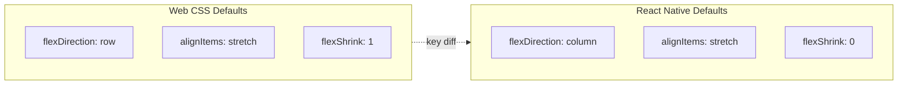
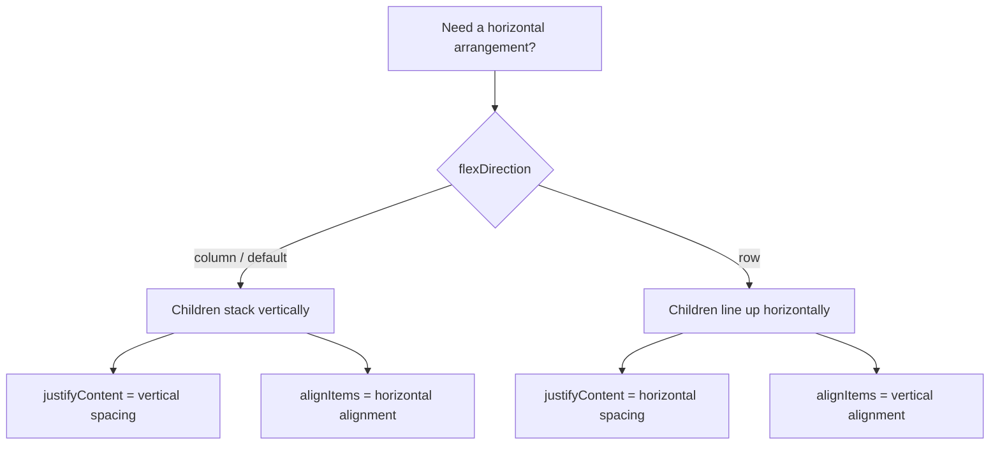
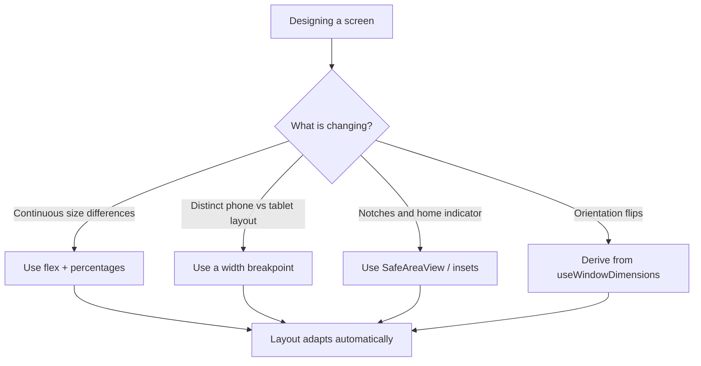
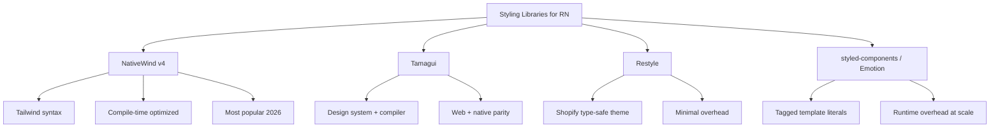
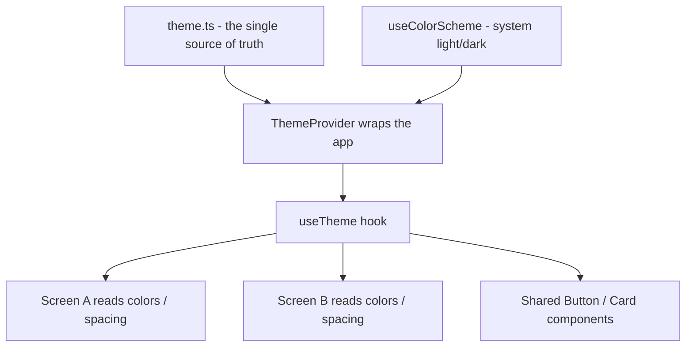
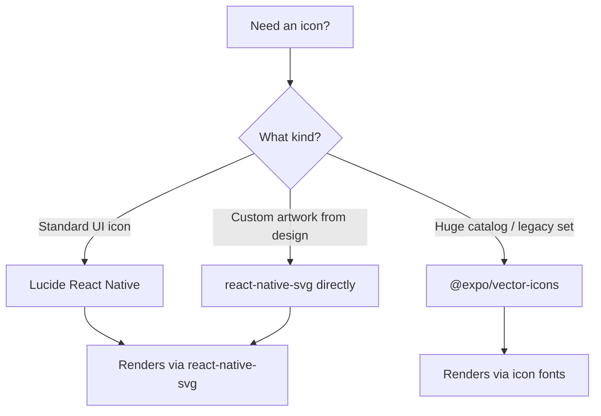

# Stile e Layout: Flexbox senza il Web

> Come funziona lo stile in React Native — niente CSS, niente Grid, solo Flexbox e pixel indipendenti dalla densità.

---

## Table of Contents

1. [Core Mechanics](#1-core-mechanics)
2. [Responsive Design](#2-responsive-design)
3. [Styling Libraries](#3-styling-libraries)
4. [Theming](#4-theming)
5. [Icons and Assets](#5-icons-and-assets)

---

## 1. Meccaniche fondamentali

### La prima sorpresa

Se arrivi da React per il web, la tua memoria muscolare ti dice: scrivi un file `.css`, importalo, applica i nomi delle classi. In React Native non ci sono file CSS, niente nomi di classe, niente cascading, nessuna ereditarietà dagli elementi genitori e nessun browser che interpreti le tue regole. Ogni stile è un oggetto JavaScript passato direttamente a un componente tramite la prop `style`. Questo è l'intero sistema.

Non è una limitazione — è una semplificazione. Sul web combatti guerre di specificità, ti preoccupi delle perdite globali e fai debug sul perché un `div` tre livelli più in alto stia sovrascrivendo la tua dimensione del font. Niente di tutto questo esiste qui. Ogni componente dà uno stile a se stesso e solo a se stesso.

Perché funziona così? Non c'è un motore di browser sul telefono che fa il parsing dei selettori CSS e costruisce una cascata. React Native parla direttamente con le primitive UI native — una `UIView` su iOS, una `View` su Android. Una view nativa non capisce "il terzo figlio di qualsiasi elemento con classe `card`". Capisce un insieme piatto di proprietà: questa view ha questo sfondo, questo padding, questo raggio degli angoli. Quindi React Native ti dà esattamente questo — un semplice oggetto di proprietà — e salta l'intera macchina di matching dei selettori. Pensalo come la differenza tra scrivere una ricetta con regole ("condisci tutto in cucina con il sale") e consegnare a ogni piatto il suo proprio piatto già finito.

> **Cambio di modello mentale:** Sul web un foglio di stile è un insieme di *regole* che vengono confrontate con gli elementi. In React Native uno stile è un *valore* che consegni a un elemento. Non c'è alcun passaggio di matching, quindi non c'è nulla da vincere o perdere in una guerra di specificità.

### StyleSheet.create

React Native fornisce `StyleSheet.create` per definire i tuoi stili. Sembra quasi identico agli oggetti inline, ma con una differenza importante: gli stili vengono validati e inviati al lato nativo una volta sola all'avvio, non ricreati a ogni render.

```tsx
import { StyleSheet, View, Text } from 'react-native';

const ProfileCard = () => (
  <View style={styles.card}>
    <Text style={styles.name}>Ada Lovelace</Text>
    <Text style={styles.role}>Engineer</Text>
  </View>
);

const styles = StyleSheet.create({
  card: {
    backgroundColor: '#ffffff',
    borderRadius: 12,
    padding: 16,
    // Shadow on iOS
    shadowColor: '#000',
    shadowOffset: { width: 0, height: 2 },
    shadowOpacity: 0.1,
    shadowRadius: 4,
    // Shadow on Android
    elevation: 3,
  },
  name: {
    fontSize: 18,
    fontWeight: '700',
    color: '#1a1a2e',
  },
  role: {
    fontSize: 14,
    color: '#6b7280',
    marginTop: 4,
  },
});
```

Nota la gestione dell'ombra qui sopra — è il tuo primo assaggio di divergenza tra piattaforme. iOS legge le quattro proprietà `shadow*`; Android le ignora completamente e onora solo `elevation`. Non c'è una singola primitiva cross-platform per le ombre nel core di React Native, quindi imposti entrambe e ogni piattaforma sceglie quella che comprende. (Le librerie e le API più recenti come `boxShadow` stanno appianando questa differenza, ma l'abitudine alle due proprietà rimane comunque la scelta sicura di default.)

Cosa ti offre concretamente `StyleSheet.create` rispetto a un semplice oggetto? Tre cose:

- **Validazione** — refusi e valori non validi vengono individuati subito invece di essere silenziosamente ignorati.
- **Un'identità stabile** — l'oggetto viene creato una sola volta, quindi React può confrontare a basso costo `styles.card === styles.card` tra i render invece di vedere ogni volta un oggetto nuovo di zecca.
- **Codice auto-documentante** — chiavi con nome (`card`, `name`, `role`) si leggono meglio di blocchi inline anonimi.

> **Suggerimento sulle prestazioni:** Definisci sempre `StyleSheet.create` al di fuori del corpo del componente. Se lo metti all'interno, paghi il costo di ricreare quegli oggetti a ogni render. Spostalo in fondo al file — è una convenzione che segue l'intero ecosistema.

> **Errore comune:** Ricorrere a `StyleSheet.create` aspettandosi le funzionalità del CSS. Non c'è `:hover`, niente `::before`, niente selettori discendenti, niente `calc()`, niente animazioni tramite keyframe. Quelle esigenze vengono soddisfatte invece da props, state e dalle API `Animated`/Reanimated.

### Oggetti inline per stili dinamici

Quando uno stile dipende da props o state, non puoi metterlo in `StyleSheet.create` perché non conosci il valore al momento della definizione. Usa invece un oggetto inline e combinalo con i tuoi stili statici usando la sintassi ad array:

```tsx
const Badge = ({ color, large }: { color: string; large?: boolean }) => (
  <View
    style={[
      styles.badge,
      { backgroundColor: color },
      large && styles.badgeLarge,
    ]}
  >
    <Text style={styles.badgeText}>New</Text>
  </View>
);

const styles = StyleSheet.create({
  badge: {
    paddingHorizontal: 8,
    paddingVertical: 4,
    borderRadius: 999,
  },
  badgeLarge: {
    paddingHorizontal: 16,
    paddingVertical: 8,
  },
  badgeText: {
    color: '#fff',
    fontSize: 12,
    fontWeight: '600',
  },
});
```

La prop `style` accetta un singolo oggetto, un array di oggetti o un array annidato. Le voci successive sovrascrivono quelle precedenti — l'ultimo a scrivere vince, nessun calcolo di specificità. Questo è il tuo sostituto della composizione di classi CSS. Dove sul web scriveresti `className="badge badge--large"` lasciando che la cascata risolva, qui costruisci un array e l'*ordine* dell'array è l'unica regola.

Alcuni dettagli che fanno inciampare:

- **Le voci falsy vengono saltate.** `large && styles.badgeLarge` viene valutato come `false` quando `large` è undefined, e React Native ignora `false`, `null` e `undefined` all'interno di un array di stili. È per questo che il pattern `condition && style` è ovunque.
- **Solo le chiavi corrispondenti sovrascrivono.** Mettere `styles.badgeLarge` dopo `styles.badge` *non* sostituisce l'intero stile di base — si fonde, sovrascrivendo solo le chiavi che definisce (`paddingHorizontal`, `paddingVertical`) e lasciando intatto `borderRadius`.

```tsx
// Web mental model:           RN equivalent:
// className={clsx(            style={[
//   'badge',                    styles.badge,
//   isLarge && 'badge--large',  isLarge && styles.badgeLarge,
//   `bg-${color}`,              { backgroundColor: color },
// )}                          ]}
```

> **Consiglio da esperto:** Riserva gli oggetti inline ai valori che cambiano davvero a runtime (un colore dalle props, una larghezza calcolata). Tieni tutto ciò che è statico in `StyleSheet.create`. Mescolare i due con la sintassi ad array ti dà il meglio di entrambi: stili statici a basso costo più una piccola patch dinamica sopra.

### Flexbox: stesso concetto, default diversi

React Native usa Flexbox per tutto il layout. Non c'è CSS Grid, niente `float`, niente `position: absolute` come trucco di layout (anche se il posizionamento `absolute` esiste per gli overlay). Se conosci Flexbox dal web, conosci il 90% di ciò che ti serve. L'altro 10% sono i default.

Sotto il cofano, il layout viene calcolato da **Yoga**, un motore di layout cross-platform scritto in C++ che viene fornito all'interno di React Native. Yoga implementa la specifica Flexbox — ma poiché è stato progettato per le UI delle app piuttosto che per i documenti, sono stati scelti alcuni default per corrispondere al modo in cui gli schermi mobili si comportano naturalmente. È questa la fonte delle sorprese descritte di seguito.



Sul web, i container flex hanno come default `row` — i figli si dispongono da sinistra a destra. In React Native, il default è `column` — i figli si impilano dall'alto verso il basso, come si legge naturalmente uno schermo mobile. Questo fa inciampare ogni sviluppatore web esattamente una volta. Se il tuo layout sembra sbagliato e tutto è impilato verticalmente, probabilmente hai dimenticato di aggiungere `flexDirection: 'row'`.

```tsx
const Row = ({ children }: { children: React.ReactNode }) => (
  <View style={{ flexDirection: 'row', alignItems: 'center', gap: 8 }}>
    {children}
  </View>
);
```

Ecco un riepilogo delle proprietà Flexbox a cui ricorrerai quotidianamente, e cosa significa ciascun asse una volta che ricordi che la direzione di default è `column`:

| Proprietà | Cosa controlla | Valori comuni |
| --- | --- | --- |
| `flexDirection` | Direzione dell'asse principale | `'column'` (default), `'row'`, `'row-reverse'` |
| `justifyContent` | Spaziatura **lungo** l'asse principale | `'flex-start'`, `'center'`, `'space-between'`, `'space-around'` |
| `alignItems` | Posizione **attraverso** l'asse trasversale | `'stretch'` (default), `'center'`, `'flex-start'`, `'flex-end'` |
| `flex` | Quanto un figlio cresce per riempire | `1` (prende tutto lo spazio libero), `0`, frazioni |
| `gap` | Spazio tra i figli | qualsiasi numero in dp |
| `flexWrap` | Se i figli vanno a capo su nuove righe | `'nowrap'` (default), `'wrap'` |

L'ancora mentale più importante in assoluto: **`justifyContent` segue `flexDirection`, `alignItems` è perpendicolare a esso.** In un container `column`, `justifyContent` muove i figli su/giù e `alignItems` li muove a sinistra/destra. Passa a `row` e i due si scambiano di significato. Questo è identico al web — l'unica cosa che è cambiata è quale dei due è verticale per default.



> **Attenzione:** La proprietà `gap` funziona in React Native 0.71+ ed Expo SDK 48+. Sulle versioni più vecchie servono i margin. Se stai avviando un nuovo progetto nel 2026, hai `gap` — usalo.

> **Consiglio da esperto:** `flex: 1` su un figlio significa "cresci per riempire lo spazio rimanente sull'asse principale". È il trucco di layout più utile in assoluto del framework — usalo per far riempire a un'area di contenuto lo schermo tra un header e un footer fissi, oppure per dividere due colonne in parti uguali.

### Tutti i valori sono pixel indipendenti dalla densità

Non ci sono unità `rem`, `em`, `vh`, `vw`, `%` (tranne in flex) o `px`. Ogni valore numerico è un **pixel indipendente dalla densità (dp)**. Il framework mappa questo sui pixel fisici usando il pixel ratio del dispositivo. Una `width: 100` ha all'incirca la stessa dimensione fisica su un telefono con uno schermo 2x e su un tablet con uno schermo 3x. Non scrivi mai `'16px'` — solo `16`.

Perché è importante: gli schermi dei telefoni hanno densità di pixel estremamente diverse. Un vecchio telefono potrebbe avere 320 pixel fisici per pollice; un flagship moderno ne ha 460+. Se le dimensioni fossero misurate in pixel fisici grezzi, un pulsante `100px` apparirebbe comodamente toccabile sul vecchio telefono e microscopico su quello nuovo. L'unità `dp` cancella questa differenza — progetti in unità logiche e l'OS moltiplica per il pixel ratio del dispositivo per calcolare i pixel reali.

```tsx
// On the web you write:
//   fontSize: '16px', padding: '1rem'
//
// In React Native you write:
//   fontSize: 16, padding: 16
//
// No units. No strings. Just numbers (except fontWeight, which is a string).
```

Una rapida tabella di conversione dalle unità che conosci a ciò che scrivi qui:

| Unità web | Equivalente React Native | Note |
| --- | --- | --- |
| `16px` | `16` | Numero semplice, nessuna stringa di unità |
| `1rem` | un valore dalla tua scala di spacing del tema | Definisci `spacing.md = 16` e riferiscilo |
| `50%` (dimensionamento) | `'50%'` o `flex` | Le stringhe percentuali funzionano per width/height; `flex` è di solito meglio |
| `100vh` | `flex: 1` all'interno di un genitore a tutta altezza | Niente unità di viewport — riempi invece il genitore |
| bordo `0.5px` | `StyleSheet.hairlineWidth` | La linea più sottile che il dispositivo può disegnare |

> **Attenzione:** Alcune proprietà accettano ancora stringhe anche se la maggior parte accetta numeri. `fontWeight` è `'700'` non `700`. Le percentuali per width/height sono stringhe come `'50%'`. E `aspectRatio` accetta un numero (`16 / 9`). In caso di dubbio, i tipi TypeScript sulla prop `style` ti diranno qual è quale.

> **Consiglio da esperto:** Hai bisogno di conoscere il pixel ratio del dispositivo? Importa `PixelRatio` da `react-native`. Raramente ti serve, ma `PixelRatio.roundToNearestPixel()` è comodo per agganciare una dimensione calcolata a un confine di pixel fisico nitido, così le linee sottili non vengono renderizzate sfocate.

---

## 2. Design responsive

### Il problema è diverso su mobile

Sul web, il design responsive significa adattarsi da un telefono da 320px a un ultrawide da 2560px. Su mobile, l'intervallo è più ristretto — all'incirca da 360dp a 430dp per i telefoni — ma devi anche affrontare i tablet (768dp+), i foldable con dimensioni dello schermo che cambiano a metà sessione, e l'orientamento landscape rispetto a portrait. La strategia si sposta dai breakpoint-per-tutto a layout flessibili che si estendono con grazia più qualche breakpoint esplicito per i tablet.

C'è anche una categoria di "responsività" che sul web non esiste affatto: le **safe area**. Notch, fotocamere a foro nello schermo, angoli arrotondati, l'home indicator sui telefoni con navigazione a gesture e la barra di stato ritagliano tutti regioni dello schermo in cui non devi disegnare contenuto importante. Un layout che sembra perfetto in un simulatore può nascondere la sua riga superiore dietro un notch su un dispositivo reale. La libreria `react-native-safe-area-context` ti fornisce gli inset per aggiungere padding attorno a queste regioni — consideralo una dipendenza obbligatoria, non un passaggio di rifinitura opzionale.



### useWindowDimensions

React Native include un hook che ti fornisce le dimensioni correnti dello schermo. Si aggiorna automaticamente alla rotazione o quando un foldable cambia il suo stato di piegatura.

```tsx
import { useWindowDimensions, View, Text } from 'react-native';

const ResponsiveGrid = () => {
  const { width } = useWindowDimensions();
  const isTablet = width >= 768;
  const columns = isTablet ? 3 : 2;

  return (
    <View style={{ flexDirection: 'row', flexWrap: 'wrap' }}>
      {items.map((item) => (
        <View
          key={item.id}
          style={{
            width: `${100 / columns}%` as any,
            padding: 8,
          }}
        >
          <Card item={item} />
        </View>
      ))}
    </View>
  );
};
```

Perché un hook e non una lettura una tantum? Perché la risposta cambia mentre la tua app è in esecuzione — l'utente ruota il telefono, apre un foldable o ridimensiona un riquadro Split View su iPad. Un hook fa il re-render del componente ogni volta che il valore cambia, così il tuo layout riflette sempre la finestra *corrente*. Questo è il parallelo di React Native a una media query CSS, tranne che invece del browser che riconfronta le regole, il tuo componente viene rieseguito con nuovi numeri e tu ti dirami in JavaScript.

Esiste un'API più vecchia, `Dimensions.get('window')`, che restituisce la dimensione *una volta*. È ancora presente, ma poiché non fa il re-render al cambiamento è una fonte frequente di bug "il mio layout non si è aggiornato quando ho ruotato". Preferisci l'hook.

| API | Re-render al cambiamento? | Quando usarla |
| --- | --- | --- |
| `useWindowDimensions()` | Sì | Quasi sempre — la scelta di default |
| `Dimensions.get('window')` | No | Letture una tantum fuori da React (es. in un'utility) |
| `Dimensions.addEventListener` | Manuale | Legacy; l'hook lo sostituisce |

> **Nota:** `useWindowDimensions` restituisce la dimensione della finestra, non la dimensione dello schermo. Sugli iPad con Split View o Slide Over, la finestra è più piccola dello schermo fisico. È quello che vuoi — il tuo layout dovrebbe adattarsi alla finestra in cui effettivamente vive.

### react-native-responsive-screen

Per i layout che necessitano di un dimensionamento proporzionale — "questa card dovrebbe essere l'80% della larghezza dello schermo, l'header dovrebbe essere il 7% dell'altezza dello schermo" — la libreria `react-native-responsive-screen` ti fornisce gli helper `widthPercentageToDP` e `heightPercentageToDP`:

```tsx
import {
  widthPercentageToDP as wp,
  heightPercentageToDP as hp,
} from 'react-native-responsive-screen';

const styles = StyleSheet.create({
  container: {
    width: wp('85%'),     // 85% of screen width in dp
    height: hp('7%'),     // 7% of screen height in dp
    borderRadius: wp('3%'),
  },
});
```

Qual è la differenza tra questo e lo scrivere semplicemente `width: '85%'` nello stile? Una stringa percentuale viene risolta *relativamente al container genitore*, da Yoga, al momento del layout. `wp('85%')` viene risolta *relativamente all'intero schermo*, in un numero dp concreto, immediatamente. Quindi `wp` è lo strumento giusto quando vuoi una dimensione che segua il dispositivo — non il box in cui capita di trovarsi — e quando hai bisogno di un numero reale (per esempio, da fornire a un calcolo o a un'animazione).

Questo è utile ma facile da usare in eccesso. Se ogni singolo valore è una percentuale, il tuo codice diventa illeggibile. Usalo per lo scheletro generale del layout — larghezze dei container, sezioni hero, dimensioni dei modal — e usa valori dp fissi per il padding, le dimensioni dei font e le dimensioni delle icone.

> **Errore comune:** Dimensionare il testo con `hp()`. Scalare la dimensione del font in base all'altezza dello schermo fa gonfiare la tipografia sui tablet e la rimpicciolisce fino all'illeggibilità sui telefoni piccoli, e ignora l'impostazione di accessibilità della dimensione del font di sistema dell'utente. Mantieni le dimensioni dei font come valori dp fissi (idealmente da una scala del tema) e lascia che l'OS gestisca lo scaling per l'accessibilità.

### Gestire tablet e foldable

Per un supporto serio ai tablet, ti serve più di un semplice controllo della larghezza. Considera questi pattern:

```tsx
import { useWindowDimensions, Platform } from 'react-native';

function useDeviceType() {
  const { width, height } = useWindowDimensions();
  const isLandscape = width > height;

  if (width >= 1024) return 'desktop';    // iPad Pro, desktop web
  if (width >= 768) return 'tablet';
  return 'phone';
}

// Master-detail layout for tablets
const InboxScreen = () => {
  const device = useDeviceType();

  if (device === 'phone') {
    return <InboxList onSelect={navigateToDetail} />;
  }

  // Tablet: show list and detail side by side
  return (
    <View style={{ flexDirection: 'row', flex: 1 }}>
      <View style={{ width: 320, borderRightWidth: 1, borderColor: '#e5e7eb' }}>
        <InboxList onSelect={setSelectedId} />
      </View>
      <View style={{ flex: 1 }}>
        <InboxDetail id={selectedId} />
      </View>
    </View>
  );
};
```

Il pattern **master-detail** qui sopra è l'adattamento per tablet con il valore più alto in assoluto. Su un telefono, una lista e il suo dettaglio sono due schermate separate tra cui navighi (tocca un'email → spingi la schermata di dettaglio). Su un tablet c'è spazio per mostrare entrambe contemporaneamente, fianco a fianco, nel modo in cui fa un client di posta desktop. Gli stessi dati, due layout, commutati su un singolo controllo della larghezza. È esattamente così che si comportano le app Mail, Impostazioni e Note di Apple quando ruoti un iPad.

Una guida decisionale su quanto spingersi con il supporto ai tablet:

| Approccio | Sforzo | Quando è sufficiente |
| --- | --- | --- |
| Non fare nulla (layout del telefono allargato) | Nessuno | Strumenti interni, MVP, contenuti che si leggono bene larghi |
| Limitare la larghezza del contenuto + centrarlo | Basso | App di lettura, form — evita lunghezze di riga assurdamente lunghe |
| Aggiungere un breakpoint di larghezza per spaziatura/colonne | Medio | La maggior parte delle app consumer |
| Layout master-detail / multi-colonna | Alto | Email, chat, dashboard, qualsiasi cosa ricca di liste |

> **Attenzione:** I foldable Samsung segnalano un cambiamento di larghezza quando l'utente piega o apre il dispositivo. Il tuo layout deve gestire questo a metà sessione. I componenti che memorizzano `width` nello state e non lo rileggono mai si romperanno. Deriva sempre il layout direttamente da `useWindowDimensions` — non fare uno snapshot una sola volta al mount.

> **Consiglio da esperto:** Testa l'orientamento e lo split-screen presto, non alla fine. Un layout costruito solo in portrait su un simulatore di telefono spesso va in pezzi la prima volta che qualcuno ruota un tablet. Ruotare il simulatore (`Cmd+Left/Right` su iOS) richiede due secondi e cattura la maggior parte di questi casi.

---

## 3. Librerie di stile

### Perché potresti volerne una

`StyleSheet.create` funziona, ma man mano che la tua app cresce noterai i punti dolenti: nessun design token integrato, sintassi verbosa per le varianti di spaziatura, nessun modo per esprimere `:hover` o media query in modo dichiarativo. Le librerie di stile colmano queste lacune. Nel 2026 il panorama si è assestato in livelli ben definiti.

Prima di ricorrere a una libreria, sii onesto sul costo: ogni libreria di stile è una dipendenza da mantenere aggiornata, un'integrazione con il build tool che può rompersi a un upgrade dell'SDK, e uno strato che i tuoi colleghi devono imparare. Per una piccola app, il `StyleSheet` puro più un oggetto tema (trattato nella prossima sezione) è spesso la risposta giusta. Le librerie qui sotto si guadagnano il loro posto su team e app più grandi, dove la coerenza e la velocità contano più del minimalismo.



La grande divisione architetturale da comprendere: stile **compile-time** rispetto a **runtime**. Le librerie compile-time (NativeWind, Tamagui, Restyle) fanno la maggior parte del loro lavoro durante il build, trasformando i tuoi stili in semplici oggetti prima ancora che l'app venga eseguita — quindi c'è poco o nessun costo sul dispositivo. Le librerie runtime (styled-components, Emotion) fanno il parsing e calcolano gli stili *mentre l'app è in esecuzione*, ogni volta che un componente con stile viene montato. Su una schermata con centinaia di componenti, quella differenza si manifesta in veri cali di frame. Questo singolo asse spiega la maggior parte delle raccomandazioni qui sotto.

### NativeWind v4 — la raccomandazione di default

NativeWind porta la sintassi di Tailwind CSS in React Native. Se il tuo team conosce già Tailwind dal web, la curva di apprendimento è quasi zero. La versione 4 compila i nomi delle classi al momento del build, quindi non c'è alcun costo a runtime per il parsing delle stringhe di utility.

```tsx
import { View, Text } from 'react-native';

const ProfileCard = () => (
  <View className="bg-white rounded-xl p-4 shadow-md">
    <Text className="text-lg font-bold text-gray-900">Ada Lovelace</Text>
    <Text className="text-sm text-gray-500 mt-1">Engineer</Text>
  </View>
);
```

Nota cosa *non* hai scritto: nessun `StyleSheet.create`, nessuna prop `style`, nessun oggetto di stili separato in fondo al file. Le stringhe `className` sono l'intero stile. Questo è lo stesso `className` che conosci da Tailwind sul web — NativeWind traduce ogni utility (`p-4` → `padding: 16`, `rounded-xl` → `borderRadius: 12`) nell'oggetto di stile nativo al momento del build e lo collega per te sulla prop `style`.

Installazione con Expo:

```bash
npx expo install nativewind tailwindcss
# Then create tailwind.config.js and add the Babel plugin —
# see the NativeWind docs for the exact metro/babel setup.
```

La modalità scura è una riga sola con la variante `dark:`, che legge `useColorScheme` per te:

```tsx
// Light text on light bg, automatically swaps in dark mode
<Text className="text-gray-900 dark:text-gray-100">Adapts to system theme</Text>
```

Perché lo raccomando come scelta di default: ha la community più ampia, la documentazione migliore, funziona su web e native attraverso gli stessi nomi di classe, e il compiler fa sì che tu non paghi una tassa a runtime. L'unico svantaggio è che fare debug degli stili è più difficile — non puoi cliccare su `className="p-4"` e vedere l'oggetto risultante senza i devtools di Tailwind o la modalità debug `styled()` di NativeWind.

### Tamagui — quando ti serve un design system

Tamagui è un framework completo di design system con un compiler. Genera codice ottimizzato specifico per piattaforma al momento del build, estraendo gli stili in oggetti statici. È più opinionato di NativeWind — ottieni out of the box una libreria di componenti con varianti, animazioni e prop responsive.

```tsx
import { Button, YStack, Text } from 'tamagui';

const ProfileCard = () => (
  <YStack bg="$background" br="$4" p="$4" elevation="$2">
    <Text fontSize="$5" fontWeight="700" color="$color">
      Ada Lovelace
    </Text>
    <Button mt="$2" theme="blue">Follow</Button>
  </YStack>
);
```

I valori con prefisso `$` (`$background`, `$4`, `$5`) sono **theme token** — fanno riferimento a voci nella tua configurazione Tamagui invece che a numeri hardcoded, ed è questo che rende automatici il theming e la modalità scura. `YStack` è un container flex verticale (asse Y = colonna) e c'è un `XStack` per le righe — piccoli vantaggi ergonomici rispetto al digitare `flexDirection` ovunque.

Usa Tamagui quando stai costruendo un design system da zero per un prodotto che viene rilasciato sia su web sia su native, e vuoi un'unica libreria di componenti per dominare entrambe le piattaforme. Ha un costo di setup più ripido di NativeWind ma ripaga su larga scala.

### Restyle (Shopify)

Restyle è la libreria di stile type-safe di Shopify. Si aggancia direttamente al tuo oggetto tema e ti permette di passare prop di stile vincolate ai tuoi design token. Niente classi di utility, niente tagged template — solo prop tipizzate.

```tsx
import { createBox, createText } from '@shopify/restyle';
import { Theme } from './theme';

const Box = createBox<Theme>();
const Typography = createText<Theme>();

const ProfileCard = () => (
  <Box backgroundColor="cardBackground" borderRadius="m" padding="m" shadowOpacity={0.1}>
    <Typography variant="heading">Ada Lovelace</Typography>
    <Typography variant="body" color="textMuted" marginTop="xs">
      Engineer
    </Typography>
  </Box>
);
```

La caratteristica di spicco è l'integrazione con TypeScript: poiché `Box` viene creato con il tuo tipo `Theme`, `padding="m"` viene completato automaticamente con le tue vere chiavi di spacing e `padding="17"` è un *errore di compilazione*. Non puoi fisicamente usare un valore che non sia nel tuo design system. Quella garanzia vale molto in un team dove la coerenza tende a erodersi un padding sbagliato di due unità alla volta.

Restyle è eccellente se vuoi un'applicazione rigorosa dei design token con il completamento automatico TypeScript completo. È più leggero di Tamagui e più strutturato di NativeWind.

### styled-components / Emotion — da evitare per i nuovi progetti

Entrambe le librerie funzionano in React Native, ma fanno il parsing dei tagged template literal a runtime. Su una schermata con 200 componenti con stile, l'overhead del parsing è misurabile — puoi vederlo nei flame chart di Hermes. Erano lo standard nel 2020. Nel 2026, le soluzioni compile-time le hanno superate. Se erediti una codebase che le usa, funzionano bene. Se parti da zero, scegli invece NativeWind o Restyle.

```tsx
// The runtime-parsing pattern to avoid in new RN code:
const Card = styled.View`
  background-color: ${(props) => props.theme.surface};
  border-radius: 12px;
  padding: 16px;
`;
// Looks like CSS, but that template string is parsed on the device,
// every time a <Card> mounts.
```

Ecco l'intero panorama in una pagina:

| Libreria | Modello di costo | Ideale per | Salta se |
| --- | --- | --- | --- |
| **NativeWind v4** | Compile-time | Team che conoscono Tailwind; web + native | Non ti piacciono le stringhe di classi di utility |
| **Tamagui** | Compile-time | Design system completo, parità web + native | Vuoi un setup minimo |
| **Restyle** | Compile-time | Design token tipizzati rigorosi | Vuoi zero configurazione |
| **styled-components / Emotion** | Runtime | Migrazione di una codebase web esistente | Parti da zero (costo prestazionale) |
| **StyleSheet puro + tema** | Nessuno | Piccole app, apprendimento, controllo completo | Ti servono token cross-platform su larga scala |

> **Consiglio da esperto:** Non scegliere una libreria di stile il primo giorno in cui impari React Native. Costruisci prima un paio di schermate con il `StyleSheet` puro così da capire cosa stanno effettivamente astraendo le librerie. I concetti (flex, dp, la prop `style`) si trasferiscono a ogni libreria; la sintassi no.

---

## 4. Theming

### Perché il theming conta fin da subito

Un tema è un'unica fonte di verità per il tuo linguaggio visivo: colori, spaziatura, tipografia, raggi dei bordi. Senza di esso, gli sviluppatori vanno a occhio sui codici esadecimali, la spaziatura oscilla tra 12, 14 e 16 senza motivo, e la modalità scura diventa un progetto di sei settimane invece di un toggle di un giorno. Definisci il tuo tema il primo giorno.

Pensa a un tema come al file di costanti del tuo design. Lo stesso istinto che ti impedisce di disseminare il numero magico `86400` nel tuo codice (lo chiami `SECONDS_PER_DAY`) dovrebbe impedirti di disseminare `#6366f1` e `16` nei tuoi stili. Nominali una volta — `colors.primary`, `spacing.md` — e ogni schermata legge dallo stesso dizionario. Il vantaggio si moltiplica: il rebranding diventa una modifica a un solo file, la modalità scura diventa lo scambio di un oggetto, e un designer può consegnarti token che si mappano direttamente sulle chiavi del tuo tema.



### Un tema tipizzato in TypeScript

```tsx
// theme.ts
export const theme = {
  colors: {
    primary: '#6366f1',
    primaryLight: '#a5b4fc',
    background: '#ffffff',
    surface: '#f9fafb',
    text: '#111827',
    textMuted: '#6b7280',
    border: '#e5e7eb',
    error: '#ef4444',
    success: '#22c55e',
  },
  spacing: {
    xs: 4,
    sm: 8,
    md: 16,
    lg: 24,
    xl: 32,
    '2xl': 48,
  },
  radii: {
    sm: 4,
    md: 8,
    lg: 12,
    xl: 16,
    full: 9999,
  },
  typography: {
    heading: { fontSize: 24, fontWeight: '700' as const, lineHeight: 32 },
    subheading: { fontSize: 18, fontWeight: '600' as const, lineHeight: 26 },
    body: { fontSize: 16, fontWeight: '400' as const, lineHeight: 24 },
    caption: { fontSize: 12, fontWeight: '400' as const, lineHeight: 16 },
  },
} as const;

export type AppTheme = typeof theme;

export const darkTheme: AppTheme = {
  ...theme,
  colors: {
    ...theme.colors,
    background: '#0f172a',
    surface: '#1e293b',
    text: '#f1f5f9',
    textMuted: '#94a3b8',
    border: '#334155',
  },
};
```

L'`as const` alla fine sta facendo un lavoro reale. Senza di esso, TypeScript allarga `fontWeight: '700'` al tipo generico `string`, e la prop `style` — che si aspetta un'unione specifica come `'normal' | 'bold' | '700' | ...` — la rifiuterebbe. `as const` congela ogni valore al suo tipo letterale, così `spacing.md` è il letterale `16` (non `number`) e il tuo editor completa automaticamente le chiavi esatte. Nota come `darkTheme` riutilizzi il tema chiaro con lo spread (`...theme`) e sovrascriva solo i colori che effettivamente cambiano — spacing, radii e typography sono identici in entrambe le modalità, quindi non c'è motivo di duplicarli.

> **Consiglio da esperto:** Mantieni nomi di colore *semantici* (`surface`, `textMuted`, `border`) piuttosto che letterali (`gray100`, `lightBlue`). I nomi semantici sopravvivono a un ridisegno — `surface` può cambiare da bianco a ardesia senza rinominare un singolo utilizzo. I nomi letterali mentono nel momento in cui il valore cambia.

### Distribuire il tema con Context

L'approccio più semplice è React Context. Avvolgi la tua app, consumalo con un hook.

```tsx
// ThemeContext.tsx
import React, { createContext, useContext, useMemo } from 'react';
import { useColorScheme } from 'react-native';
import { theme, darkTheme, AppTheme } from './theme';

const ThemeContext = createContext<AppTheme>(theme);

export const ThemeProvider = ({ children }: { children: React.ReactNode }) => {
  const colorScheme = useColorScheme(); // 'light' | 'dark' | null
  const activeTheme = useMemo(
    () => (colorScheme === 'dark' ? darkTheme : theme),
    [colorScheme],
  );

  return (
    <ThemeContext.Provider value={activeTheme}>
      {children}
    </ThemeContext.Provider>
  );
};

export const useTheme = () => useContext(ThemeContext);
```

Questo è esattamente lo stesso pattern Context che useresti in React per il web — `createContext`, un provider vicino alla radice, un hook `useContext` per leggerlo. Niente qui è specifico di React Native tranne `useColorScheme`. Il `useMemo` è importante: garantisce che `activeTheme` mantenga un'identità di oggetto stabile finché `colorScheme` non cambia, così i consumer non fanno il re-render su aggiornamenti del genitore non correlati.

Poi usalo in qualsiasi componente:

```tsx
const ProfileCard = () => {
  const t = useTheme();

  return (
    <View
      style={{
        backgroundColor: t.colors.surface,
        borderRadius: t.radii.lg,
        padding: t.spacing.md,
      }}
    >
      <Text style={[t.typography.heading, { color: t.colors.text }]}>
        Ada Lovelace
      </Text>
    </View>
  );
};
```

> **Errore comune:** Chiamare `StyleSheet.create` con valori del tema *al di fuori* del componente. Poiché `StyleSheet.create` viene eseguito una volta sola al caricamento del modulo, cattura qualunque tema fosse corrente in quel momento e non si aggiornerà quando il tema cambia. Se uno stile dipende dal tema, costruiscilo all'interno del componente (spesso con `useMemo`) così da rileggere `useTheme()` a ogni render.

### useColorScheme per la modalità scura

`useColorScheme` è integrato in React Native. Legge l'impostazione di modalità scura a livello di sistema del dispositivo. Restituisce `'light'`, `'dark'` o `null` (quando l'OS non segnala una preferenza). Su iOS e Android questo si aggiorna in tempo reale — se l'utente attiva la modalità scura nelle impostazioni di sistema mentre la tua app è aperta, il valore cambia e i tuoi componenti fanno il re-render.

Questo è il corrispettivo in React Native della query CSS `@media (prefers-color-scheme: dark)`. Sul web il browser riapplica le regole corrispondenti; qui l'hook fa il re-render dei tuoi componenti con un nuovo valore e il tuo `ThemeProvider` scambia l'oggetto tema. Stessa intenzione, meccanismo JavaScript.

```tsx
import { useColorScheme } from 'react-native';

const StatusDot = () => {
  const scheme = useColorScheme();          // 'light' | 'dark' | null
  const isDark = scheme === 'dark';
  return (
    <View
      style={{
        width: 12,
        height: 12,
        borderRadius: 6,
        backgroundColor: isDark ? '#22c55e' : '#16a34a',
      }}
    />
  );
};
```

> **Attenzione:** Su Android, `useColorScheme` reagisce ai cambiamenti di sistema solo se la tua `Activity` è configurata correttamente. In Expo questo funziona out of the box. In React Native bare, assicurati che la tua `MainActivity` non blocchi `uiMode` nel manifest.

> **Consiglio da esperto:** Le app reali di solito offrono tre scelte: Chiaro, Scuro e "Sistema". Memorizza tu stesso la preferenza dell'utente (Chiaro/Scuro/Sistema), e ricorri a `useColorScheme()` solo quando sceglie "Sistema". In questo modo un utente che preferisce lo scuro può scavalcare un telefono impostato su chiaro.

### Zustand come alternativa a Context

Se il tuo tema cambia di frequente (poniamo che tu permetta agli utenti di scegliere un colore d'accento), Context provoca re-render in ogni consumer. Zustand evita questo usando state esterno con i selector:

```tsx
import { create } from 'zustand';
import { theme, darkTheme, AppTheme } from './theme';

type ThemeStore = {
  theme: AppTheme;
  setDark: () => void;
  setLight: () => void;
};

export const useThemeStore = create<ThemeStore>((set) => ({
  theme: theme,
  setDark: () => set({ theme: darkTheme }),
  setLight: () => set({ theme: theme }),
}));

// In a component — only re-renders when colors change
const bg = useThemeStore((s) => s.theme.colors.background);
```

Perché questo fa il re-render meno di Context? Con Context, *ogni* consumer del provider fa il re-render ogni volta che il valore del context cambia, anche un componente che si interessa solo di un colore. Zustand invece permette a ciascun componente di sottoscriversi a una *fetta* tramite un selector (`s => s.theme.colors.background`); il componente fa il re-render solo quando quella specifica fetta cambia. È la differenza tra un allarme antincendio per tutto l'edificio e un sensore in ogni stanza.

| Aspetto | Context | Zustand |
| --- | --- | --- |
| Complessità di setup | Integrato, zero dipendenze | Libreria minuscola |
| Ambito del re-render | Tutti i consumer | Solo le fette selezionate |
| Ideale per | Tema che cambia raramente (chiaro/scuro) | Tema che cambia di frequente (selettore di accento dal vivo) |
| Lettura fuori da React | Scomoda | Facile (`useThemeStore.getState()`) |

Questo è eccessivo per la maggior parte delle app. Inizia con Context. Passa a Zustand se fai il profiling e scopri che i re-render legati al tema sono un collo di bottiglia.

---

## 5. Icone e Asset

### Icone: tre buone opzioni

Sul web inserisci un SVG nel tuo JSX e hai finito. In React Native, l'SVG non è supportato nativamente — ti serve una libreria per colmare il divario. Il motivo è lo stesso della Sezione 1: non c'è un browser. Una view nativa non ha alcun concetto di un elemento `<svg>` con figli `<path>`, quindi qualcosa deve tradurre quella descrizione vettoriale in chiamate di disegno native. `react-native-svg` è quel traduttore, e le librerie di icone qui sotto si appoggiano su di esso (o sui font). Ecco le opzioni che vale la pena considerare nel 2026.



**Lucide React Native** è la raccomandazione per la maggior parte dei progetti. Fornisce oltre 1.400 icone come singoli componenti tree-shakeable. Design pulito, larghezze del tratto coerenti, tipi TypeScript, e le icone vengono renderizzate come SVG nativo tramite `react-native-svg`.

```bash
npx expo install lucide-react-native react-native-svg
```

```tsx
import { Bell, Settings, ChevronRight } from 'lucide-react-native';
import { useTheme } from './ThemeContext';

const IconRow = () => {
  const t = useTheme();

  return (
    <View style={{ flexDirection: 'row', gap: 16 }}>
      <Bell size={24} color={t.colors.text} />
      <Settings size={24} color={t.colors.text} />
      <ChevronRight size={24} color={t.colors.textMuted} />
    </View>
  );
};
```

La frase chiave qui sopra è **tree-shakeable**: poiché ogni icona è un suo proprio componente (`import { Bell }`), il bundler include solo le icone che effettivamente importi. Tre icone costano all'incirca quanto tre icone in byte. Nota anche che `color` è guidato dal tema — le icone sono forme vettoriali, quindi si ricolorano istantaneamente per la modalità scura senza bisogno di un secondo asset.

**@expo/vector-icons** raggruppa set di icone da FontAwesome, MaterialIcons, Ionicons e altri. Le icone sono basate su font, non su SVG — si caricano con il binario del font, il che significa che l'intero set di icone viene incluso nel bundle anche se ne usi tre. Questo è stato il default per anni, e funziona ancora, ma il tree-shaking è peggiore rispetto a Lucide.

```tsx
import { Ionicons } from '@expo/vector-icons';

<Ionicons name="notifications-outline" size={24} color="#111827" />
```

**react-native-svg** non è una libreria di icone — è il motore di rendering SVG su cui Lucide e altre librerie si costruiscono. Se hai SVG personalizzati dal tuo team di design, usalo direttamente:

```tsx
import Svg, { Path, Circle } from 'react-native-svg';

const CustomLogo = ({ size = 32, color = '#6366f1' }) => (
  <Svg width={size} height={size} viewBox="0 0 24 24" fill="none">
    <Circle cx={12} cy={12} r={10} stroke={color} strokeWidth={2} />
    <Path d="M8 12l3 3 5-5" stroke={color} strokeWidth={2} strokeLinecap="round" />
  </Svg>
);
```

Ecco come si confrontano le tre:

| Opzione | Come renderizza | Tree-shaking | Ideale per |
| --- | --- | --- | --- |
| **Lucide React Native** | SVG tramite `react-native-svg` | Eccellente (import per icona) | La maggior parte delle app; set di icone moderno e pulito |
| **@expo/vector-icons** | Font di icone | Scarso (intero set nel bundle) | Necessità di un set di brand specifico (FontAwesome, ecc.) |
| **react-native-svg** | SVG (fornisci tu i path) | N/D | Artwork personalizzato/brandizzato dai designer |

> **Consiglio da esperto:** I designer di solito ti consegnano file `.svg` grezzi. Strumenti come `react-native-svg-transformer` o `SVGR` li convertono in componenti React Native pronti all'uso al momento del build, così puoi fare `import Logo from './logo.svg'` e trattarlo come qualsiasi altro componente — colorabile, dimensionabile, senza copia manuale dei path.

### Immagini: usa expo-image, non l'Image integrato

React Native include un componente `Image`. Funziona, ma manca di caching, caricamento progressivo, placeholder blurhash e supporto ai formati moderni. La community ha scelto `expo-image` come sostituto.

```bash
npx expo install expo-image
```

```tsx
import { Image } from 'expo-image';

const Avatar = ({ uri }: { uri: string }) => (
  <Image
    source={{ uri }}
    style={{ width: 48, height: 48, borderRadius: 24 }}
    placeholder={{ blurhash: 'LGF5]+Yk^6#M@-5c,1J5@[or[Q6.' }}
    contentFit="cover"
    transition={200}
  />
);
```

Un **blurhash** è una stringa minuscola (spesso sotto i 30 caratteri) che codifica un'anteprima sfocata e a bassa risoluzione di un'immagine. `expo-image` la decodifica istantaneamente e mostra quel placeholder soffuso mentre l'immagine reale viene scaricata, poi fa una dissolvenza incrociata verso l'immagine completa (`transition={200}` = una dissolvenza di 200ms). Il risultato è quel caricamento fluido, senza salti di layout, che vedi in app come Instagram e Unsplash — e costa quasi nulla perché il placeholder è generato da una stringa, non da una seconda richiesta di rete.

Perché `expo-image` invece del `Image` del core:

- **Caching**: Cache su disco e in memoria integrata. Il `Image` del core su Android non mette in cache le immagini di rete di default.
- **Placeholder blurhash/thumbhash**: Mostrano un'anteprima sfocata mentre l'immagine completa si carica — elimina i salti di layout.
- **contentFit**: Usa `cover`, `contain`, `fill`, `none` — stesso modello mentale del CSS `object-fit`. Il `Image` del core usa `resizeMode`, che è meno intuitivo.
- **Formati moderni**: Supporta AVIF, WebP, SVG e immagini animate out of the box.
- **Prestazioni**: Usa librerie di immagini native (SDWebImage su iOS, Glide su Android) sotto il cofano.

Se hai usato il CSS `object-fit`, `contentFit` ti sembrerà familiare:

| `contentFit` | Equivalente CSS | Effetto |
| --- | --- | --- |
| `cover` | `object-fit: cover` | Riempie il box, tagliando l'eccedenza (default per le foto) |
| `contain` | `object-fit: contain` | Si adatta interamente all'interno, può lasciare spazio vuoto |
| `fill` | `object-fit: fill` | Si allunga per riempire, ignorando le proporzioni |
| `none` | `object-fit: none` | Dimensione originale, nessuno scaling |

> **Attenzione:** Imposta sempre `width` e `height` espliciti sulle immagini. A differenza del web, React Native non dimensiona intrinsecamente le immagini — un'immagine senza dimensioni viene renderizzata come 0x0. Se vuoi un dimensionamento basato sulle proporzioni, imposta una dimensione e usa `aspectRatio` nello stile.

```tsx
<Image
  source={{ uri: 'https://example.com/hero.jpg' }}
  style={{ width: '100%', aspectRatio: 16 / 9 }}
  contentFit="cover"
/>
```

### Organizzare gli asset nel tuo progetto

Mantieni una struttura piatta e prevedibile:

```
assets/
  icons/           # Custom SVG icons (if not using Lucide)
  images/          # Static images bundled with the app
    logo.png
    onboarding-1.png
  fonts/           # Custom font files
    Inter-Regular.ttf
    Inter-Bold.ttf
```

Ci sono due modi fondamentalmente diversi in cui un'immagine arriva nella tua app, e usano una sintassi `source` diversa:

- **Gli asset inclusi nel bundle** vengono spediti all'interno del binario dell'app e vengono referenziati con `require()`. Il bundler vede il `require` al momento del build, quindi conosce la dimensione intrinseca dell'asset — questi sono l'unico caso in cui a volte puoi saltare le dimensioni esplicite.
- **Le immagini remote** vivono su un server e vengono referenziate con `{ uri: '...' }`. L'app non conosce la loro dimensione finché non vengono scaricate, motivo per cui `width`/`height` espliciti (o `aspectRatio`) sono richiesti per evitare salti di layout.

Per le immagini statiche incluse nel bundle dell'app, usa `require()`:

```tsx
<Image source={require('../assets/images/logo.png')} style={{ width: 120, height: 40 }} />
```

Per i font, Expo gestisce il caricamento tramite `expo-font` o l'hook `useFonts`. I font si caricano in modo asincrono, quindi tipicamente renderizzi uno stato di splash/caricamento finché non sono pronti:

```tsx
import { useFonts } from 'expo-font';

const App = () => {
  const [loaded] = useFonts({
    'Inter-Regular': require('./assets/fonts/Inter-Regular.ttf'),
    'Inter-Bold': require('./assets/fonts/Inter-Bold.ttf'),
  });

  if (!loaded) return null; // or a splash screen

  // Reference the family name (the key) in your theme — never per component
  return <Text style={{ fontFamily: 'Inter-Bold' }}>Loaded font</Text>;
};
```

Definisci la tua famiglia di font una volta nel tuo tema e riferiscila ovunque — non fare mai l'hardcoding di `'Inter-Bold'` nei singoli componenti.

> **Attenzione:** A differenza del web, React Native non ha una scorciatoia `font-weight` che si mappi su un font personalizzato. Caricare `Inter-Regular` non ti dà il grassetto tramite `fontWeight: '700'` — devi caricare `Inter-Bold` come una sua propria famiglia e riferirla per nome. Questa è la sorpresa più comune in assoluto sui font personalizzati. Incorpora i nomi delle famiglie regular/medium/bold nel tuo tema tipografico così che le singole schermate non debbano mai pensarci.

---