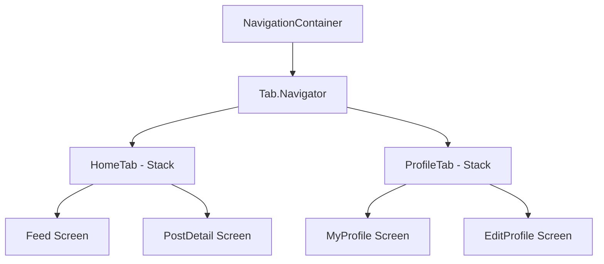
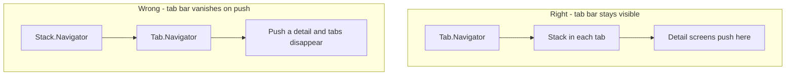
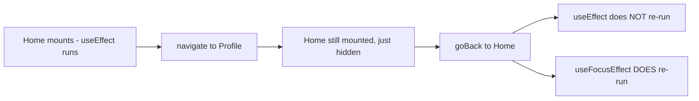
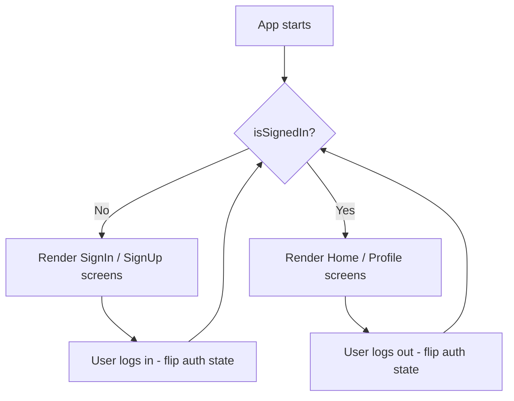
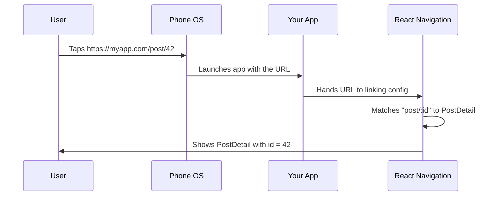
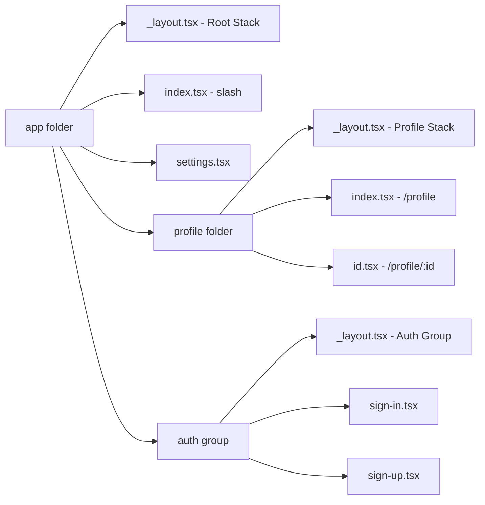
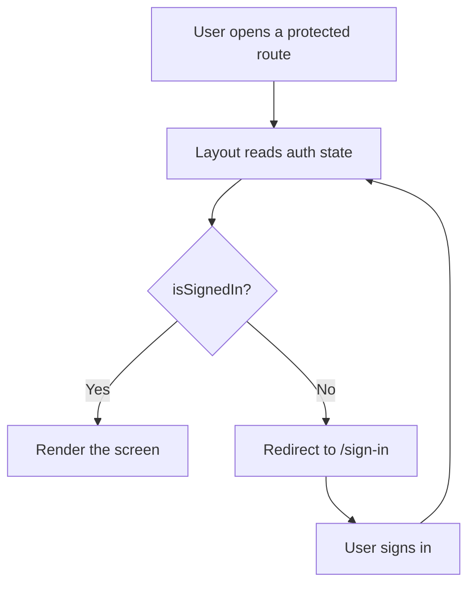
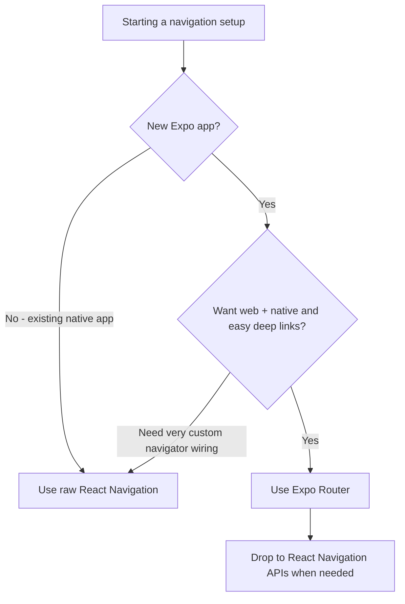

# Navigazione: Stack, Tab e Deep Link

> Come le schermate si collegano tra loro nel mobile — React Navigation v7, Expo Router e i pattern che sostituiscono il routing basato su URL.

---

## Table of Contents

1. [React Navigation v7](#1-react-navigation-v7)
2. [Concetti da padroneggiare](#2-concepts-to-master)
3. [Expo Router](#3-expo-router)

---

## 1. React Navigation v7

Sul web, la navigazione è semplice: il browser ha una barra degli URL, cambi l'URL e appare una nuova pagina. Su un telefono non c'è alcuna barra degli URL. Non c'è alcuno stack di cronologia del browser gestito automaticamente per te. Quando un utente tocca una riga in una lista e una schermata di dettaglio scorre dentro da destra, *è il tuo codice* a essere responsabile di quell'animazione, del gesto per tornare indietro, della memoria di dove l'utente è arrivato e di cosa succede quando preme il pulsante hardware "indietro" su Android.

React Navigation è la libreria che gestisce tutto questo. È lo standard della community dal 2017, e la versione 7 (rilasciata con React Navigation 7.x) ha introdotto la configurazione statica, un miglior supporto a TypeScript e un'integrazione più stretta con Expo. Se stai costruendo un'app React Native nel 2025+, è questo ciò che usi.

### Il modello mentale: una pila di carte

La parola "stack" (pila) è letterale. Immagina un mazzo di carte su un tavolo. Ogni volta che navighi verso una nuova schermata, posi una nuova carta *sopra* alla pila. La schermata che l'utente vede è sempre la carta in cima. Quando preme indietro (o fa swipe), rimuovi la carta in cima e quella sottostante viene di nuovo rivelata — esattamente dove l'utente l'aveva lasciata.

È la stessa struttura dati della cronologia del browser. La differenza sta in ciò che ci metti dentro:

| Concetto | Web (browser) | React Navigation (native) |
| --- | --- | --- |
| L'identificatore della "pagina" | Una stringa URL (`/profile/42`) | Un nome di schermata + un oggetto params (`"Profile", { id: 42 }`) |
| Chi gestisce la cronologia | Il browser, gratuitamente | La libreria, che configuri tu |
| Tornare indietro | Pulsante indietro del browser / `history.back()` | Gesto di swipe, freccia nell'header, pulsante hardware Android o `navigation.goBack()` |
| L'animazione | Cambio di pagina istantaneo | Una transizione nativa push/pop che ottieni gratuitamente |

> **Analogia:** un `Stack.Navigator` è come una pila di fogli su una scrivania. `navigate`/`push` lascia cadere un nuovo foglio in cima; `goBack`/`pop` solleva via il foglio in cima. L'utente legge sempre e solo il foglio in cima, ma l'intera pila è ancora lì sotto, e ricorda la sua posizione di scroll e l'input dei form.

### Installazione

```bash
# Core + native stack (the one you almost always want)
npx expo install @react-navigation/native @react-navigation/native-stack

# Required peer dependencies in Expo
npx expo install react-native-screens react-native-safe-area-context
```

Se ti servono anche le tab o un drawer:

```bash
npx expo install @react-navigation/bottom-tabs
npx expo install @react-navigation/drawer react-native-gesture-handler react-native-reanimated
npx expo install @react-navigation/material-top-tabs react-native-tab-view react-native-pager-view
```

> **Perché `npx expo install` e non `npm install`?** `expo install` sceglie la versione esatta della dipendenza che corrisponde al tuo Expo SDK. Le librerie di navigazione si appoggiano a moduli nativi (`react-native-screens`, `reanimated`) le cui versioni devono allinearsi con l'SDK, altrimenti l'app va in crash all'avvio. Un semplice `npm install` prende la versione più recente, che potrebbe essere incompatibile.

> **Perché `native-stack` invece di `stack`?** Il navigator `@react-navigation/native-stack` usa le primitive di navigazione native della piattaforma (`UINavigationController` su iOS, `Fragment` su Android). Questo ti dà transizioni push/pop a 60fps gratuitamente. Il più vecchio `@react-navigation/stack`, basato su JS, renderizza tutto in React — utile se hai bisogno di una personalizzazione spinta, ma più lento. Usa come default il native stack.

| Navigator | Renderizzato da | Velocità | Da usare quando |
| --- | --- | --- | --- |
| `native-stack` | Primitive native dell'OS | Più veloce (60fps gratis) | Quasi sempre — la scelta di default |
| `stack` (JS) | React + Reanimated | Più lento | Ti servono transizioni/gesti completamente personalizzati che quello nativo non può fare |
| `bottom-tabs` | Tab bar nativa | Veloce | Una barra persistente in basso (Home / Cerca / Profilo) |
| `drawer` | JS + gesture handler | Medio | Un menu laterale a scomparsa (menu hamburger) |
| `material-top-tabs` | Pager view | Veloce | Tab in alto scorribili con swipe (come Seguiti/Per te di Twitter) |

### Il tuo primo navigator

```tsx
import { NavigationContainer } from "@react-navigation/native";
import { createNativeStackNavigator } from "@react-navigation/native-stack";

// 1. Define param types for every screen
type RootStackParamList = {
  Home: undefined;
  Profile: { userId: string };
  Settings: undefined;
};

const Stack = createNativeStackNavigator<RootStackParamList>();

export default function App() {
  return (
    <NavigationContainer>
      <Stack.Navigator initialRouteName="Home">
        <Stack.Screen name="Home" component={HomeScreen} />
        <Stack.Screen name="Profile" component={ProfileScreen} />
        <Stack.Screen name="Settings" component={SettingsScreen} />
      </Stack.Navigator>
    </NavigationContainer>
  );
}
```

Il `NavigationContainer` è la radice — gestisce l'albero dello stato di navigazione. Ne renderizzi sempre e solo uno, in cima alla tua app. Ogni navigator (`Stack.Navigator`, `Tab.Navigator`, ecc.) vive al suo interno.

> **Pensa a `<Stack.Screen>` come a una *registrazione*, non a un render.** Elencare una schermata non la monta. Dice al navigator "questo nome è consentito, ed ecco il componente da montare *quando qualcuno ci naviga*." Solo la schermata attiva (e quelle visitate di recente) sono effettivamente montate. Ecco perché dichiarare 30 schermate ha un costo di avvio quasi nullo.

### Spostarsi tra le schermate

All'interno di qualsiasi componente schermata ottieni un oggetto `navigation` (tramite props o l'hook `useNavigation`). Questi sono i verbi che userai di continuo:

```tsx
import { useNavigation } from "@react-navigation/native";

function HomeScreen() {
  const navigation = useNavigation();

  return (
    <>
      {/* Go to Profile, passing data via params */}
      <Button title="Open profile" onPress={() => navigation.navigate("Profile", { userId: "42" })} />

      {/* Always push a NEW card, even if Profile is already showing */}
      <Button title="Push profile" onPress={() => navigation.push("Profile", { userId: "43" })} />

      {/* Remove the top card */}
      <Button title="Back" onPress={() => navigation.goBack()} />

      {/* Jump all the way back to the first screen in this stack */}
      <Button title="Home" onPress={() => navigation.popToTop()} />
    </>
  );
}
```

> **`navigate` vs `push` — un classico tranello.** `navigate("Profile")` è intelligente: se una schermata Profile è già nello stack, ci torna invece di impilarne un duplicato. `push("Profile")` aggiunge sempre una nuova copia in cima. Per un flusso "capitolo successivo" o "rispondi a una risposta" in cui lo stesso tipo di schermata si impila su sé stesso, vuoi `push`. Per la navigazione normale, preferisci `navigate`.

### Bottom Tabs

La maggior parte delle app combina una tab bar con degli stack all'interno di ciascuna tab. Ecco il pattern:

```tsx
import { createBottomTabNavigator } from "@react-navigation/bottom-tabs";
import { createNativeStackNavigator } from "@react-navigation/native-stack";

const Tab = createBottomTabNavigator();
const HomeStack = createNativeStackNavigator();
const ProfileStack = createNativeStackNavigator();

function HomeStackScreen() {
  return (
    <HomeStack.Navigator>
      <HomeStack.Screen name="Feed" component={FeedScreen} />
      <HomeStack.Screen name="PostDetail" component={PostDetailScreen} />
    </HomeStack.Navigator>
  );
}

function ProfileStackScreen() {
  return (
    <ProfileStack.Navigator>
      <ProfileStack.Screen name="MyProfile" component={MyProfileScreen} />
      <ProfileStack.Screen name="EditProfile" component={EditProfileScreen} />
    </ProfileStack.Navigator>
  );
}

export default function App() {
  return (
    <NavigationContainer>
      <Tab.Navigator>
        <Tab.Screen
          name="HomeTab"
          component={HomeStackScreen}
          options={{ headerShown: false }}
        />
        <Tab.Screen
          name="ProfileTab"
          component={ProfileStackScreen}
          options={{ headerShown: false }}
        />
      </Tab.Navigator>
    </NavigationContainer>
  );
}
```

> Imposta `headerShown: false` sulle schermate delle tab quando ogni tab contiene il proprio stack navigator — altrimenti ottieni un doppio header. Il tab navigator esterno vuole disegnare un header, e così fa anche lo stack interno, dandoti due barre del titolo impilate.



Questo diagramma è il modello mentale che ti serve: **NavigationContainer avvolge un Tab Navigator, e ogni tab avvolge uno Stack Navigator.** I navigator si annidano. Gli stack vanno dentro le tab. Le tab vanno dentro i drawer. I drawer vanno dentro il container. È questa composizione a dare alle app mobile la loro sensazione di navigazione a più livelli.

Ecco cosa ti garantisce concretamente l'annidamento: ogni tab mantiene la *propria cronologia indipendente*. Se da Feed scendi in un PostDetail nella tab Home, passi alla tab Profilo e poi torni indietro — la tab Home sta ancora mostrando PostDetail, esattamente dove l'avevi lasciata. Ogni tab è una pila di carte separata.

### Tranello comune: l'ordine di annidamento dei navigator

Un errore frequente è mettere le Tab dentro uno Stack. Tecnicamente funziona, ma significa che la tab bar scompare quando spingi una nuova schermata sullo stack. Di solito vuoi gli Stack *dentro* le Tab, così la tab bar resta visibile mentre gli utenti scendono nelle sotto-schermate. La regola: **il navigator la cui UI vuoi mantenere costantemente visibile dovrebbe essere quello esterno.**



> **Regola pratica di decisione:** chiediti "questo elemento di chrome dell'interfaccia dovrebbe restare sullo schermo mentre l'utente scende più in profondità?" Se sì (tab bar, maniglia del drawer), va *fuori*. Se dovrebbe scivolare via per dare alla schermata di dettaglio tutto il display (un articolo a schermo intero, un flusso di checkout), metti lo stack fuori e la UI persistente al suo interno.

---

## 2. Concetti da padroneggiare

### Route Params e navigazione tipizzata

Il passaggio di dati tra le schermate avviene tramite i route params, non tramite le props. Questo è il maggior cambio di mentalità rispetto al React web, dove potresti passare lo stato tramite context o tramite le query string dell'URL.

```tsx
// Navigating with params
navigation.navigate("Profile", { userId: "abc-123" });

// Reading params in the target screen
import { NativeStackScreenProps } from "@react-navigation/native-stack";

type Props = NativeStackScreenProps<RootStackParamList, "Profile">;

function ProfileScreen({ route }: Props) {
  const { userId } = route.params;
  // ...
}
```

Perché i params e non le props? Non sei mai tu a *renderizzare* `<ProfileScreen userId="..." />` — lo fa il navigator, da qualche parte nel profondo del suo albero, magari molto tempo dopo che hai chiamato `navigate`. I params sono il canale che la libreria ti dà per passare dei dati attraverso quel divario. Sul web lo codificheresti nell'URL (`/profile?userId=abc-123`); in RN, i params sono quel payload, ma possono essere qualsiasi oggetto serializzabile, non solo stringhe.

> **Mantieni i params piccoli — passa gli ID, non interi oggetti.** I params possono finire serializzati negli URL dei deep link e salvati nello stato. Passare un oggetto enorme (o peggio, una funzione o un'istanza di classe) gonfia lo stato di navigazione e rompe il deep linking. Pattern: passa `{ userId }`, poi recupera l'utente completo nella schermata di destinazione (spesso da una cache, così è istantaneo).

**Definisci sempre i tipi della tua param list.** Senza di essi, passerai i params sbagliati, scriverai male il nome di una schermata o dimenticherai un campo obbligatorio — e nulla ti avvertirà fino al runtime. Il tipo `RootStackParamList` mostrato in precedenza non è un costo aggiuntivo opzionale; è il modo in cui rendi sicura la navigazione.

```tsx
// Make useNavigation typed everywhere by declaring a global type once:
declare global {
  namespace ReactNavigation {
    interface RootParamList extends RootStackParamList {}
  }
}

// Now this is fully type-checked with no extra annotations:
const navigation = useNavigation();
navigation.navigate("Profile", { userId: "abc-123" }); // ✅ typed
navigation.navigate("Profile", { userld: "abc-123" }); // ❌ TS error: typo + wrong key
```

### useFocusEffect vs useEffect

Questo manda in confusione ogni sviluppatore React web. Sul web, navigare verso una nuova pagina smonta quella vecchia. In React Navigation, **le schermate restano montate quando navighi via da esse.** Quando vai da Home a Profile e poi torni a Home, il componente Home non è mai stato smontato — uno `useEffect` con dipendenze `[]` non verrà rieseguito.

Questa è una *funzionalità*: è il motivo per cui la schermata precedente ricorda la sua posizione di scroll e lo stato dei form. Ma significa che "esegui questo quando l'utente guarda questa schermata" non è più la stessa cosa di "esegui questo al montaggio".



```tsx
import { useFocusEffect } from "@react-navigation/native";
import { useCallback } from "react";

function HomeScreen() {
  useFocusEffect(
    useCallback(() => {
      // Runs every time this screen comes into focus
      fetchLatestData();

      return () => {
        // Cleanup when screen loses focus (user navigates away)
      };
    }, [])
  );
}
```

> **Avvolgi sempre la callback in `useCallback`.** `useFocusEffect` si ri-sottoscrive ogni volta che cambia l'identità della callback. Passa una funzione inline e verrà rieseguita a *ogni render*, causando spesso loop infiniti. Lo `useCallback` con un array di dipendenze stabile è obbligatorio, non stilistico.

| Hook | Si attiva quando | Da usare per |
| --- | --- | --- |
| `useEffect(fn, [])` | Una volta sola, al montaggio | Setup una tantum: subscription, analytics "schermata creata" |
| `useFocusEffect` | Ogni volta che la schermata ottiene il focus | Aggiornare i dati, avviare/fermare un timer o un video |
| `useIsFocused()` | Restituisce un booleano leggibile nel render | Mettere in pausa condizionalmente animazioni/render mentre è fuori schermo |

### Pattern del flusso di autenticazione

Il pattern standard per l'autenticazione in React Navigation è il **rendering condizionale del navigator** — scambi l'intero albero del navigator in base allo stato di autenticazione:

```tsx
function RootNavigator() {
  const { isSignedIn } = useAuth();

  return (
    <Stack.Navigator>
      {isSignedIn ? (
        <>
          <Stack.Screen name="Home" component={HomeScreen} />
          <Stack.Screen name="Profile" component={ProfileScreen} />
        </>
      ) : (
        <>
          <Stack.Screen name="SignIn" component={SignInScreen} />
          <Stack.Screen name="SignUp" component={SignUpScreen} />
        </>
      )}
    </Stack.Navigator>
  );
}
```

React Navigation rileva che la lista delle schermate è cambiata e riproduce automaticamente una transizione appropriata. Non provare a fare `navigate("Home")` dopo il login — limitati a cambiare lo stato di autenticazione e la libreria gestisce il resto. Questo è più pulito e impedisce all'utente di premere "indietro" per raggiungere la schermata di login dopo essersi autenticato.



> **Perché questo batte `navigate('Home')`.** Se navighi in modo imperativo dopo il login, la schermata SignIn resta nello stack precedente — premi "indietro" e ti ritrovi di nuovo al form di login, in modo confondente. Scambiando la *lista delle schermate*, le vecchie schermate smettono del tutto di esistere. Non c'è nulla a cui tornare "indietro". È lo stato a guidare la UI; non sei tu a guidare la navigazione a mano.

### Presentazione: Modal vs Card

Il native stack supporta due modalità di presentazione. Quella di default (`card`) è un push orizzontale su iOS, uno scorrimento dal basso verso l'alto su Android. Impostare `presentation: "modal"` ti dà uno scorrimento verticale verso l'alto con un aspetto stile carta su iOS (la schermata precedente si rimpicciolisce leggermente dietro di essa).

```tsx
<Stack.Screen
  name="CreatePost"
  component={CreatePostScreen}
  options={{ presentation: "modal" }}
/>
```

Usa i modal per flussi autoconclusivi: creare un nuovo elemento, selezionare una foto, confermare un'azione distruttiva. Usa la card per scendere più in profondità nei contenuti.

| Presentazione | Animazione | Modello mentale | Da usare per |
| --- | --- | --- | --- |
| `card` (default) | Scorre dentro dal lato | "Andare più a fondo" nei contenuti | Lista → dettaglio → sotto-dettaglio |
| `modal` | Scorre su dal basso | "Farsi da parte" per svolgere un compito | Comporre, creare, scegliere, confermare |
| `transparentModal` | Compare in dissolvenza sopra la schermata | Un overlay fluttuante | Dialog personalizzati, tooltip, sheet |
| `containedModal` / `fullScreenModal` | Varianti native del modal | Rifinire la sensazione nativa | Forzare lo stile modal su Android |

> **Euristica UX:** se l'utente *sta creando qualcosa o facendo una scelta* e potrebbe annullare, è un modal (ha un'affordance "Annulla"/"X" e scorre verso l'alto). Se *sta esplorando più a fondo nei contenuti esistenti*, è una card (ha una freccia "indietro" e scorre lateralmente). Rispettare questa convenzione fa sembrare nativa la tua app senza che l'utente ci debba pensare.

### Deep Linking

Il deep linking permette a URL esterni (come `myapp://profile/123` o `https://myapp.com/profile/123`) di aprire schermate specifiche nella tua app. La configurazione mappa i pattern di URL ai nomi delle schermate:

```tsx
const linking = {
  prefixes: ["myapp://", "https://myapp.com"],
  config: {
    screens: {
      HomeTab: {
        screens: {
          Feed: "feed",
          PostDetail: "post/:id",
        },
      },
      ProfileTab: {
        screens: {
          MyProfile: "profile",
        },
      },
    },
  },
};

<NavigationContainer linking={linking}>
  {/* ... */}
</NavigationContainer>
```

L'oggetto `config.screens` *rispecchia l'annidamento del tuo navigator*. Poiché `PostDetail` vive all'interno dello stack di `HomeTab`, la configurazione del link lo annida allo stesso modo. Quando l'OS consegna alla tua app l'URL `myapp://post/42`, React Navigation percorre questa mappa, seleziona la tab Home, fa il push di PostDetail e interpreta `42` come `route.params.id` — ricostruendo l'intero stack in modo che il pulsante "indietro" funzioni correttamente.



Esistono due varianti di deep link, e la differenza è importante:

| Tipo | Esempio | Funziona senza configurazione? | Note |
| --- | --- | --- | --- |
| Custom scheme | `myapp://post/42` | Sì (basta dichiarare lo schema) | Funziona solo se l'app è installata; URL brutti |
| Universal / App Links | `https://myapp.com/post/42` | No — servono file lato server | Veri URL https; ricade sul sito web se l'app non è installata |

> **Gli Universal Links (iOS) e gli App Links (Android)** richiedono una configurazione lato server (un file `apple-app-site-association` o `assetlinks.json`). La sola configurazione di React Navigation non è sufficiente — dice solo alla libreria come interpretare l'URL una volta che l'OS lo consegna alla tua app. Sono i file lato server a far sì che `https://myapp.com/post/42` apra la tua app invece del browser. Il file sull'host dimostra all'OS che possiedi il dominio, così gli è consentito instradare il link nella tua app.

### Personalizzazione dell'header e della tab bar

La personalizzazione degli header si fa tramite `options` (per singola schermata) o `screenOptions` (per l'intero navigator). `options` ha la precedenza su `screenOptions`, allo stesso modo in cui uno stile inline ha la precedenza su uno condiviso.

```tsx
<Stack.Navigator
  screenOptions={{
    headerStyle: { backgroundColor: "#0f3460" },
    headerTintColor: "#fff",
    headerTitleStyle: { fontWeight: "bold" },
  }}
>
  <Stack.Screen
    name="Home"
    component={HomeScreen}
    options={{
      headerRight: () => (
        <Pressable onPress={openSettings}>
          <Ionicons name="settings-outline" size={24} color="#fff" />
        </Pressable>
      ),
    }}
  />
</Stack.Navigator>
```

Spesso ti servono opzioni dell'header che dipendono dallo stato stesso della schermata (un pulsante "salva" disabilitato finché un form non è valido). Impostale in modo imperativo dall'interno della schermata:

```tsx
function EditProfileScreen({ navigation }: Props) {
  const [name, setName] = useState("");

  // Re-runs whenever `name` changes, updating the header button live
  useLayoutEffect(() => {
    navigation.setOptions({
      headerRight: () => (
        <Button title="Save" disabled={name.length === 0} onPress={save} />
      ),
    });
  }, [navigation, name]);
}
```

Per tab bar personalizzate, usa la prop `tabBar` sul Tab Navigator:

```tsx
<Tab.Navigator
  tabBar={(props) => <MyCustomTabBar {...props} />}
>
  {/* ... */}
</Tab.Navigator>
```

Questo ti dà il pieno controllo sulla UI della tab bar mentre React Navigation continua a gestire lo stato e il passaggio tra le schermate. L'oggetto `props` porta con sé tutto ciò che ti serve: la lista delle route, quale di esse è in focus (`props.state.index`) e un oggetto `navigation` per cambiare tab al tocco. Tu disegni i pixel; React Navigation mantiene lo stato.

> **Consiglio da esperti — rispetta la safe area.** Header e tab bar personalizzati possono renderizzarsi sotto il notch, la status bar o l'home indicator. Avvolgili con `useSafeAreaInsets()` da `react-native-safe-area-context` e aggiungi del padding pari a `insets.top` / `insets.bottom`, altrimenti il contenuto verrà tagliato su dispositivi con angoli arrotondati e notch. Gli header di default gestiscono questo per te; quelli personalizzati no.

---

## 3. Expo Router

Expo Router prende tutto ciò che fa React Navigation e lo avvolge in una convenzione di routing basata sul file system, ispirata a Next.js. Invece di definire i navigator nel codice, crei dei file in una directory `app/` e il router genera automaticamente l'albero di navigazione.

**Se stai avviando un nuovo progetto Expo, usa Expo Router.** È il default in `create-expo-app`, funziona con React Navigation sotto il cofano e ti dà deep linking, route tipizzate e supporto universale (web + native) pronti all'uso.

L'idea chiave: **la struttura delle tue cartelle *è* la tua configurazione di navigazione.** Mentre React Navigation ti costringe a scrivere a mano l'albero annidato di `<Stack.Screen>`, Expo Router lo deduce dai file sul disco. Se hai usato Next.js o Remix, questo ti sembrerà immediatamente familiare — è la stessa convenzione applicata alle app native.

| | React Navigation puro | Expo Router |
| --- | --- | --- |
| Definisci le route con | Scrivere `<Stack.Screen>` nel codice | Creare file in `app/` |
| Navighi con | Nomi di schermate + oggetti params | Stringhe URL (`/profile/42`) |
| Deep linking | Configurazione `linking` manuale | Automatico, dai percorsi dei file |
| Supporto web | Setup aggiuntivo | Integrato |
| Ideale per | Brownfield, pieno controllo manuale | Nuove app, web+native, meno boilerplate |

### Struttura dei file = struttura delle route

```
app/
  _layout.tsx          → Root layout (wraps everything)
  index.tsx            → "/" (Home screen)
  settings.tsx         → "/settings"
  profile/
    _layout.tsx        → Layout for profile section
    index.tsx          → "/profile"
    [id].tsx           → "/profile/123" (dynamic route)
  (auth)/
    _layout.tsx        → Auth group layout
    sign-in.tsx        → "/sign-in"
    sign-up.tsx        → "/sign-up"
```

Vale la pena memorizzare le regole di denominazione, perché il nome del file *è* l'API:

| Nome di file / cartella | Significato |
| --- | --- |
| `index.tsx` | La route per la cartella stessa (`/` o `/profile`) |
| `settings.tsx` | Una route con nome (`/settings`) |
| `[id].tsx` | Un segmento dinamico — corrisponde a qualsiasi valore, esposto come param |
| `[...rest].tsx` | Catch-all — fa corrispondere `/a/b/c` a un array |
| `_layout.tsx` | Il navigator/wrapper per tutto ciò che è in questa cartella |
| `(group)/` | Un gruppo — organizza i file senza aggiungerli all'URL |
| `+not-found.tsx` | La schermata 404 per le route non corrispondenti |



### Layout Route

Il file `_layout.tsx` in qualsiasi directory definisce il navigator per quel livello. È l'equivalente in Expo Router di uno `Stack.Navigator` o `Tab.Navigator` — ma invece di elencare le schermate come figli, dichiara semplicemente il navigator e il router riempie le schermate a partire dai file fratelli. Il layout radice tipicamente imposta la tua navigazione principale:

```tsx
// app/_layout.tsx
import { Stack } from "expo-router";

export default function RootLayout() {
  return (
    <Stack>
      <Stack.Screen name="index" options={{ title: "Home" }} />
      <Stack.Screen name="settings" options={{ title: "Settings" }} />
      <Stack.Screen name="profile" options={{ headerShown: false }} />
      <Stack.Screen name="(auth)" options={{ headerShown: false }} />
    </Stack>
  );
}
```

I layout persistono anche attraverso la navigazione, esattamente come un componente di layout in Next.js. Un `_layout.tsx` che renderizza un header, un context provider o una guardia di autenticazione avvolge *ogni* schermata della sua cartella e di quelle sottostanti — e non si ri-monta quando ti sposti tra quelle schermate. Questo è il posto naturale per le cose che dovrebbero sopravvivere alle singole schermate (un provider del carrello, una connessione websocket, un tema).

Per un layout basato su tab:

```tsx
// app/(tabs)/_layout.tsx
import { Tabs } from "expo-router";

export default function TabLayout() {
  return (
    <Tabs>
      <Tabs.Screen
        name="index"
        options={{ title: "Home", tabBarIcon: ({ color }) => (
          <Ionicons name="home" size={24} color={color} />
        )}}
      />
      <Tabs.Screen
        name="search"
        options={{ title: "Search", tabBarIcon: ({ color }) => (
          <Ionicons name="search" size={24} color={color} />
        )}}
      />
    </Tabs>
  );
}
```

### Route dinamiche

Le parentesi quadre nel nome del file creano segmenti dinamici — esattamente come in Next.js:

```tsx
// app/profile/[id].tsx
import { useLocalSearchParams } from "expo-router";

export default function ProfileScreen() {
  const { id } = useLocalSearchParams<{ id: string }>();

  return <Text>Profile for user {id}</Text>;
}
```

Navigare verso questa schermata:

```tsx
import { Link } from "expo-router";

// Declarative
<Link href="/profile/abc-123">View Profile</Link>

// Imperative
import { router } from "expo-router";
router.push("/profile/abc-123");
```

Nota la differenza rispetto a React Navigation: navighi con **stringhe URL**, non con nomi di schermate e oggetti params. Questa è l'intuizione chiave — Expo Router porta sul native il modello di navigazione basato su URL del web.

> **`useLocalSearchParams` vs `useGlobalSearchParams`.** `useLocalSearchParams` restituisce i params di *questa* schermata e ri-renderizza solo quando questa schermata è in focus — quasi sempre ciò che vuoi. `useGlobalSearchParams` legge i params della route attualmente attiva da qualsiasi punto e ri-renderizza a ogni cambio di navigazione, il che può causare re-render inaspettati. Usa `useLocalSearchParams` come default.

> **Passare dati extra insieme a un percorso.** Puoi allegare query params proprio come sul web: `router.push({ pathname: "/profile/[id]", params: { id: "42", from: "feed" } })`. Sia `id` che `from` arrivano in `useLocalSearchParams`. Mantienili piccoli e serializzabili — stessa regola dei params di React Navigation, dato che questi diventano letteralmente parte di un URL.

### Gruppi

I nomi di cartella tra parentesi come `(auth)` o `(tabs)` creano i **route group**. Influenzano l'organizzazione del layout ma non compaiono nell'URL. È così che dividi la tua app in sezioni logiche con navigator diversi senza inquinare la struttura dell'URL.

Per esempio, `app/(tabs)/index.tsx` è comunque solo `/`, non `/tabs` — la cartella `(tabs)` esiste solo per poter dare a quelle schermate un layout di tab-bar condiviso. I gruppi sono uno strumento puramente organizzativo *per te*; l'utente non li vede mai in un URL.

Il pattern di autenticazione in Expo Router usa gruppi e redirect condizionali:

```tsx
// app/(auth)/_layout.tsx
import { Redirect, Stack } from "expo-router";
import { useAuth } from "../hooks/useAuth";

export default function AuthLayout() {
  const { isSignedIn } = useAuth();

  if (isSignedIn) {
    return <Redirect href="/" />;
  }

  return <Stack />;
}
```



> **`<Redirect>` vs `router.replace()` imperativo.** Restituire `<Redirect href="/" />` da un layout è dichiarativo — il redirect fa parte del render, quindi non c'è alcun lampo della schermata sbagliata né alcuna race condition. Chiamare `router.replace()` dentro uno `useEffect` viene eseguito *dopo* che la schermata sbagliata è già stata disegnata. Per le guardie di autenticazione, preferisci il `<Redirect>` dichiarativo.

### Route tipizzate

Expo Router può generare automaticamente i tipi delle route. Abilitalo nella tua configurazione:

```json
// tsconfig.json (or app.json)
{
  "compilerOptions": {
    "strict": true
  }
}
```

Poi in `app.json`:

```json
{
  "expo": {
    "experiments": {
      "typedRoutes": true
    }
  }
}
```

Una volta abilitato, `router.push("/profle/123")` (nota il refuso) diventa un errore TypeScript. Questo intercetta i link di navigazione rotti al momento della build, invece che quando un utente tocca un pulsante e non succede nulla.

> **Come funziona:** Expo Router scansiona la tua cartella `app/` e genera un tipo che elenca ogni percorso valido (inclusi quelli dinamici come `/profile/[id]`). `Link href` e `router.push` sono tipizzati rispetto a quell'unione, così un percorso che non corrisponde a un file reale semplicemente non compila. È l'equivalente, basato sui file, del `RootStackParamList` che scriveresti a mano in React Navigation — solo che lo ottieni gratuitamente, e non può mai andare fuori sincrono con le tue schermate effettive.

### Quando usare Expo Router e quando React Navigation puro

Usa **Expo Router** quando: stai costruendo una nuova app Expo, vuoi il deep linking senza alcuna configurazione, ti piacciono le convenzioni di routing basate sui file, oppure stai puntando a web e native dalla stessa codebase.

Usa **React Navigation puro** quando: hai un'app brownfield (React Native aggiunto a un'app nativa esistente), ti servono pattern di navigazione che Expo Router non supporta ancora, oppure ti serve un controllo granulare sull'istanziazione dei navigator.



In pratica, la maggior parte dei nuovi progetti dovrebbe partire con Expo Router. È meno boilerplate, i deep link funzionano e basta, e puoi sempre scendere alle API di React Navigation quando serve, perché Expo Router *è* React Navigation sotto il cofano. Quest'ultimo punto è quello rassicurante: scegliere Expo Router non ti preclude nulla — `useNavigation`, `useFocusEffect` e tutto il resto continuano a funzionare, perché stai usando lo stesso motore con una porta d'ingresso più amichevole.

> **Errore comune con Expo Router:** dimenticarsi di aggiungere le schermate al `_layout.tsx`. Se crei `app/notifications.tsx` ma non lo elenchi nel `_layout.tsx` più vicino, la route potrebbe non funzionare come previsto. Ogni file di route ha bisogno di una voce corrispondente nel suo layout genitore — oppure usa il componente `<Stack>` senza figli espliciti per scoprirle automaticamente.

---