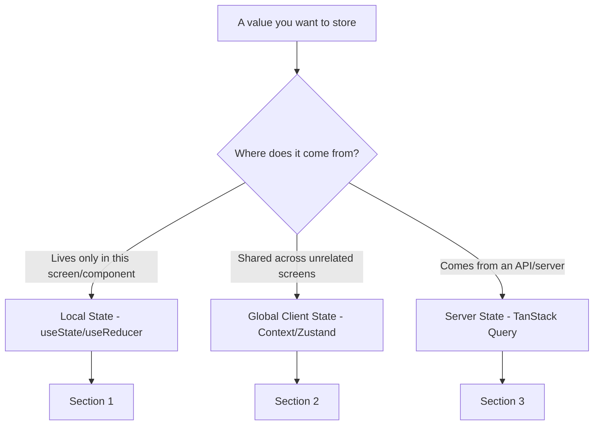
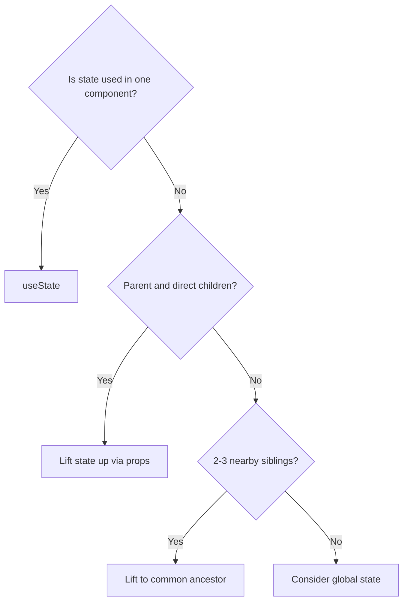
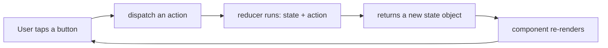
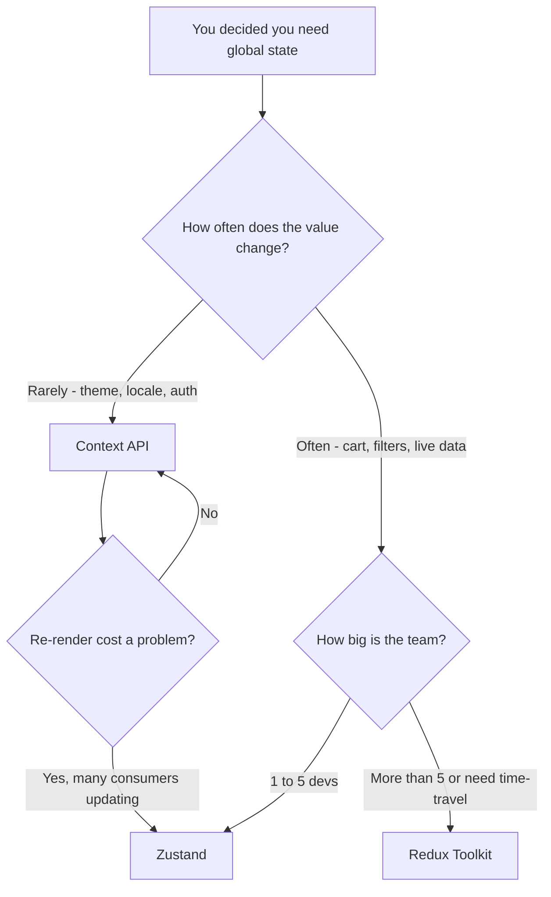
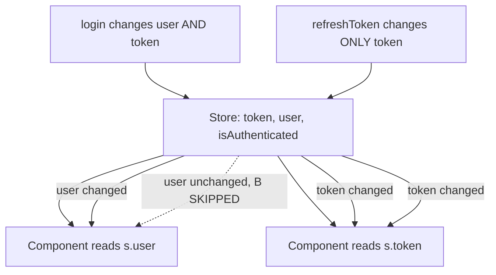
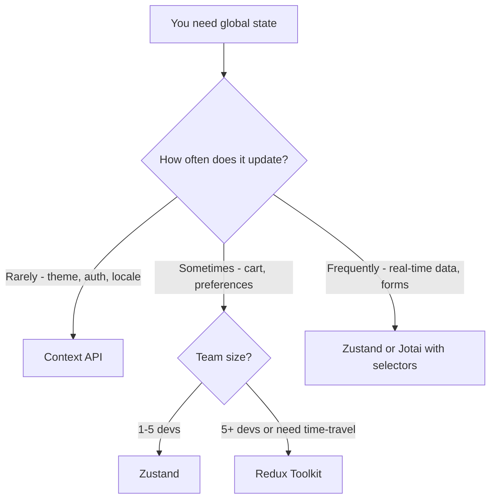
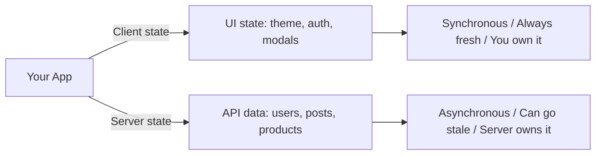
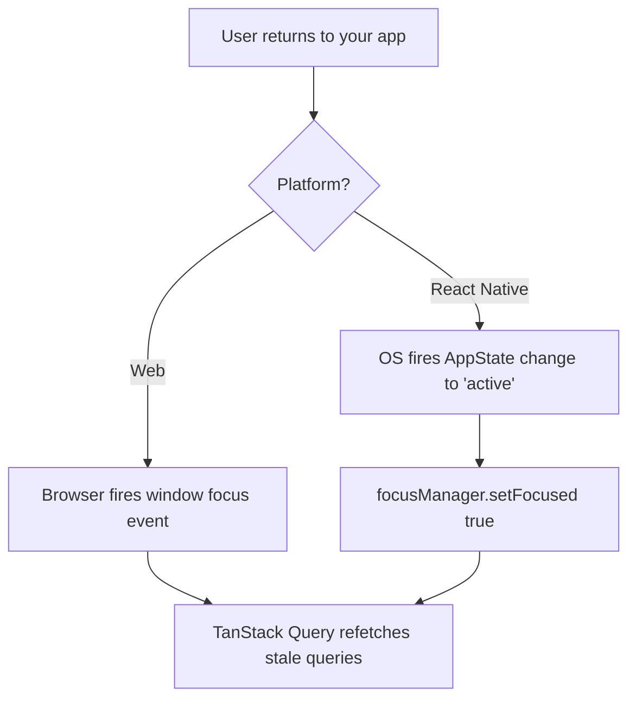
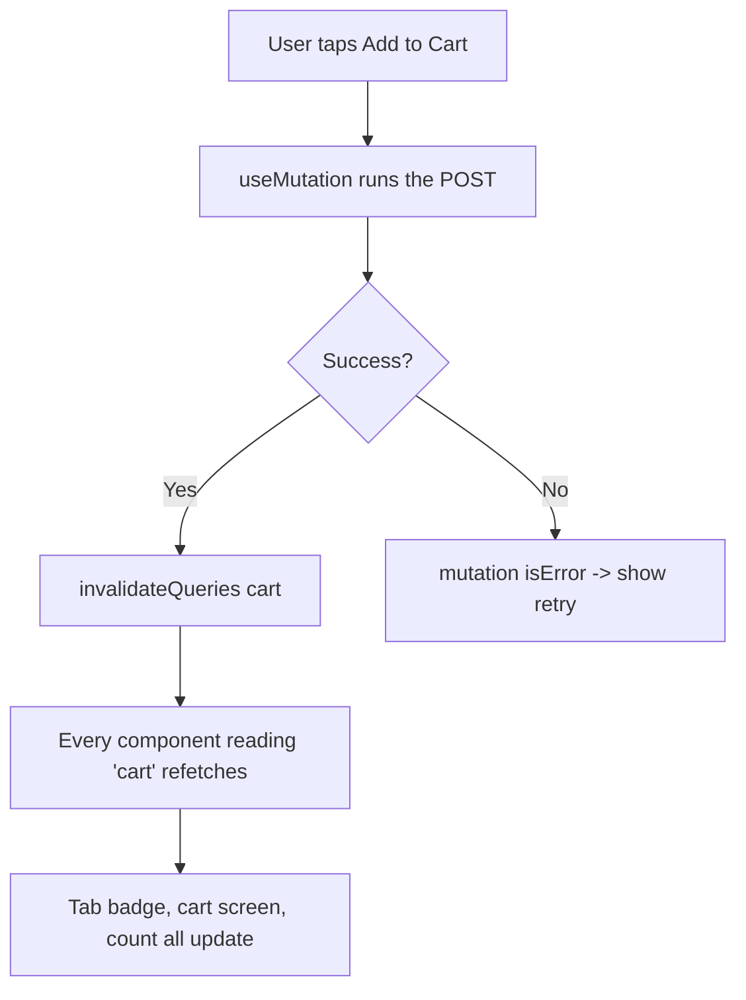
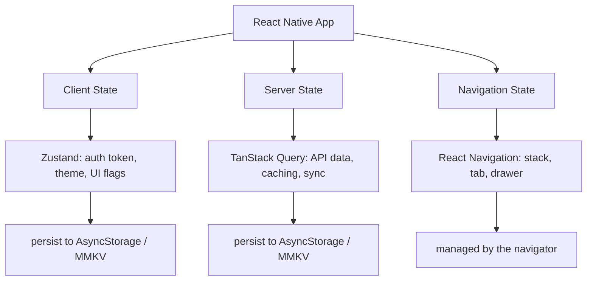

# Gestione dello stato: stesso React, piattaforma diversa

> Stato locale, stato globale e stato del server in React Native: cosa si trasferisce dal web e cosa cambia.

---

## Table of Contents

1. [Local State](#1-local-state)
2. [Global State](#2-global-state)
3. [Server State](#3-server-state)

---

## 1. Stato locale

### Tutto ciò che già conosci continua a funzionare

Ecco la frase più importante di questo capitolo: `useState` e `useReducer` funzionano in modo identico in React Native. Nessuna precisazione, nessun asterisco. Il modello a componenti è lo stesso, gli hooks sono gli stessi, le regole degli hooks sono le stesse. Se già gestisci bene lo stato locale sul web, lo gestirai bene anche su mobile.

Perché è vero? React Native e React-DOM condividono lo **stesso core di React** (il reconciler, il dispatcher degli hooks, l'albero fiber). Ciò che differisce è solo il *renderer*: lo strato che trasforma l'albero dei componenti in pixel reali. Sul web quel renderer parla con il DOM; su mobile parla con le view native iOS/Android. La gestione dello stato vive interamente nel core condiviso, quindi è completamente indipendente dal renderer. Pensalo come il motore di un'auto: `useState` è il motore, e il renderer è solo la differenza tra avere le ruote sull'asfalto o su una pista sterrata. Il motore non lo sa e non se ne preoccupa.

Il problema è che la maggior parte degli sviluppatori salta direttamente a uno store globale. Installano Zustand o Redux prima ancora di aver scritto una sola schermata. Su mobile questo fa più male che sul web, perché ogni re-render non necessario consuma batteria e fa perdere frame in un render loop a 60fps. Un'app web che fa re-render in modo sciatto sembra solo un po' lenta; un'app mobile che fa lo stesso scarica la batteria, scalda il dispositivo e mostra scatti visibili durante lo scroll e le animazioni.

> **Consiglio da esperto:** "60fps" significa che lo schermo viene ridisegnato 60 volte al secondo, all'incirca una volta ogni **16 millisecondi**. Se un re-render e il relativo lavoro di layout richiedono più di 16ms, il frame viene perso e l'utente vede uno scatto ("jank"). Mantenere lo stato locale e i re-render piccoli è il modo più economico per rimanere entro quel budget.

### I tre tipi di stato

Prima di scegliere uno strumento, dai un nome a ciò che stai conservando. Quasi ogni valore in un'app rientra in una di tre categorie, e ogni categoria ha una risposta corretta diversa. Il resto di questo capitolo è organizzato esattamente attorno a queste tre.



> **Errore comune:** trattare i dati del server (un elenco di prodotti recuperato da un'API) come se fossero stato client e infilarli in Zustand o Redux. Sembra che funzioni, ma ti sei appena impegnato a gestire manualmente caching, refetching e staleness. Lo risolviamo nella Sezione 3.

### La regola della colocation

Lo stato dovrebbe vivere il più vicino possibile a dove viene consumato. Non è un consiglio nuovo, ma in React Native è più importante perché:

1. Non c'è una barra degli URL su cui appoggiarsi per lo stato della rotta. Sul web, `?tab=reviews` nell'URL è un pezzo di stato gratuito, condivisibile e persistente. Mobile non ha una barra degli indirizzi, quindi quello stato deve vivere *da qualche parte* in React.
2. Gli stack di navigazione mantengono in memoria le schermate non montate. Quando metti la Schermata B sopra la Schermata A, la Schermata A **non** viene smontata: rimane montata sotto. Quindi il suo stato (e i suoi re-render) continuano a costarti.
3. I re-render che sono invisibili in un browser desktop causano jank visibile su un telefono, perché le CPU mobili sono più deboli e stai combattendo contro il budget di 16ms per frame.

La regola mentale: **inizia un valore come `useState` all'interno del componente che lo usa. Spostalo verso l'esterno (su a un genitore, poi a uno store globale) solo quando un secondo consumatore ne ha realmente bisogno.** La globalizzazione prematura è l'errore di gestione dello stato più comune nei codebase reali.



### useState in React Native

```tsx
import { useState } from 'react';
import { View, Text, Pressable, TextInput, StyleSheet } from 'react-native';

// Exactly what you would write on the web, with RN primitives
const Counter = () => {
  const [count, setCount] = useState(0);

  return (
    <View style={styles.container}>
      <Text style={styles.label}>Count: {count}</Text>
      {/* Use the updater form (c => c + 1) when the next value
          depends on the previous one — avoids stale-closure bugs */}
      <Pressable onPress={() => setCount(c => c + 1)} style={styles.button}>
        <Text>Increment</Text>
      </Pressable>
    </View>
  );
};

// Form state stays local until submission
const LoginForm = () => {
  const [email, setEmail] = useState('');
  const [password, setPassword] = useState('');

  const handleSubmit = () => {
    // Only touch global auth state after a successful login
    login({ email, password });
  };

  return (
    <View>
      <TextInput
        value={email}
        onChangeText={setEmail}
        placeholder="Email"
        keyboardType="email-address"   // shows the @-friendly keyboard
        autoCapitalize="none"          // emails are lowercase
      />
      <TextInput
        value={password}
        onChangeText={setPassword}
        placeholder="Password"
        secureTextEntry                // masks input (the RN equivalent of type="password")
      />
      <Pressable onPress={handleSubmit}>
        <Text>Log in</Text>
      </Pressable>
    </View>
  );
};
```

Nota la scelta deliberata qui sopra: `email` e `password` sono **locali**. Non c'è ragione per cui il resto dell'app debba sapere cosa qualcuno sta scrivendo a metà. Il valore esce dal componente — chiamando `login()` — solo una volta che l'invio è andato a buon fine. Questa disciplina del "tienilo locale fino all'ultimo momento possibile" è ciò che mantiene economici i re-render.

#### Web vs React Native: il gestore dell'input

| Concetto | Web (React DOM) | React Native |
| --- | --- | --- |
| Leggere il valore corrente | `value={text}` | `value={text}` (uguale) |
| Gestire un cambiamento | `onChange={e => setText(e.target.value)}` | `onChangeText={setText}` |
| Cosa riceve il gestore | un **evento** sintetico | la **stringa** direttamente |
| Mascheramento password | `type="password"` | `secureTextEntry` |
| Tastiera email | (nessuna — tastiera desktop) | `keyboardType="email-address"` |

> **Trabocchetto:** `onChangeText` in React Native ti dà la stringa direttamente, non un oggetto evento. Scrivi `onChangeText={setText}` invece di `onChange={e => setText(e.target.value)}`. Questa è una delle poche vittorie ergonomiche che mobile ha rispetto al web. *Esiste* una prop `onChange` su `TextInput`, ma ti consegna un oggetto evento nativo: quasi sempre vuoi `onChangeText`.

### useReducer per stato locale complesso

Quando un singolo componente possiede più valori correlati tra loro, `useReducer` mantiene gli aggiornamenti prevedibili. Questo si trasferisce uno a uno dal React per il web.

Quando dovresti ricorrere a `useReducer` invece di diverse chiamate `useState`? Usa questa regola pratica:

| Situazione | Preferisci |
| --- | --- |
| Uno o due valori indipendenti (`count`, `isOpen`) | `useState` |
| Diversi valori che cambiano *insieme* in modi definiti | `useReducer` |
| Lo stato successivo dipende da quello precedente con logica non banale | `useReducer` |
| Vuoi tutta la logica di aggiornamento in un'unica funzione pura e testabile | `useReducer` |

Il vantaggio di `useReducer` è che il *come* di ogni aggiornamento vive in un'unica funzione pura (il reducer), separata dal *cosa lo innesca* (le chiamate `dispatch` nel tuo JSX). Quella separazione è esattamente ciò che rende Redux familiare: `useReducer` è essenzialmente "Redux per un singolo componente".

```tsx
import { useReducer } from 'react';
import { View, Text, Pressable } from 'react-native';

type State = {
  quantity: number;
  size: 'S' | 'M' | 'L';
  addOns: string[];
};

// Every possible update is enumerated as a typed action — TypeScript
// will now flag any dispatch that doesn't match one of these shapes.
type Action =
  | { type: 'SET_QUANTITY'; payload: number }
  | { type: 'SET_SIZE'; payload: 'S' | 'M' | 'L' }
  | { type: 'TOGGLE_ADD_ON'; payload: string }
  | { type: 'RESET' };

const initialState: State = { quantity: 1, size: 'M', addOns: [] };

// A reducer is a PURE function: same (state, action) in -> same state out.
// No side effects, no fetching, no setState. This is why it's easy to test.
const reducer = (state: State, action: Action): State => {
  switch (action.type) {
    case 'SET_QUANTITY':
      return { ...state, quantity: Math.max(1, action.payload) }; // never below 1
    case 'SET_SIZE':
      return { ...state, size: action.payload };
    case 'TOGGLE_ADD_ON': {
      const has = state.addOns.includes(action.payload);
      return {
        ...state,
        addOns: has
          ? state.addOns.filter(a => a !== action.payload) // remove
          : [...state.addOns, action.payload],             // add
      };
    }
    case 'RESET':
      return initialState;
    default:
      return state;
  }
};

const ProductConfigurator = () => {
  const [state, dispatch] = useReducer(reducer, initialState);

  return (
    <View>
      <Text>Qty: {state.quantity} | Size: {state.size}</Text>
      <Pressable onPress={() => dispatch({ type: 'SET_QUANTITY', payload: state.quantity + 1 })}>
        <Text>+ Qty</Text>
      </Pressable>
      <Pressable onPress={() => dispatch({ type: 'RESET' })}>
        <Text>Reset</Text>
      </Pressable>
    </View>
  );
};
```

Ecco il flusso di dati che un reducer impone — un rigoroso ciclo a senso unico, che è ciò che lo rende prevedibile:



> **Trabocchetto (condiviso con il web, ma vale la pena ribadirlo):** non mutare mai `state` all'interno di un reducer. `state.addOns.push(x)` seguito da `return state` spesso *non* causerà un re-render, perché React confronta l'identità dell'oggetto e vede lo stesso riferimento. Restituisci sempre un **nuovo** oggetto/array (`{ ...state }`, `[...state.addOns]`). È anche per questo che ogni ramo qui sopra fa lo spread del vecchio stato.

### Composizione dei componenti prima dello stato globale

Prima di ricorrere a qualsiasi libreria, prova a comporre i componenti in modo che lo stato fluisca naturalmente. Sul web potresti tollerare un prop drilling leggero perché un re-render è economico. Su mobile dovresti essere più disciplinato — ma il primo strumento a cui ricorrere è comunque la *struttura*, non uno store.

```tsx
// ❌ BAD: Reaching for global state because two siblings need the same value
// (Don't install Zustand for this)

// ✅ GOOD: Lift to the parent, pass down
const ProductScreen = () => {
  const [selectedTab, setSelectedTab] = useState<'details' | 'reviews'>('details');

  return (
    <View>
      {/* Parent owns the state; children receive exactly what they need */}
      <TabBar selected={selectedTab} onSelect={setSelectedTab} />
      {selectedTab === 'details' ? <ProductDetails /> : <ReviewList />}
    </View>
  );
};
```

Due pattern ti permettono di evitare lo stato globale molto più a lungo di quanto ti aspetteresti:

- **Lifting state up:** sposta il valore all'antenato comune più vicino di tutto ciò che ne ha bisogno, poi passalo verso il basso come props. L'esempio qui sopra lo fa per `selectedTab`.
- **Composizione invece del drilling:** se ti ritrovi a passare una prop attraverso tre strati che non la usano, considera di passare invece il *componente renderizzato* come `children`, in modo che la prop viaggi solo dove viene effettivamente consumata.

> **Consiglio da esperto:** il prop drilling è un problema reale solo quando attraversa *molti* strati o *molti* rami non correlati. Passare una prop giù di uno o due livelli non è un code smell: è il modo normale, economico ed esplicito di condividere lo stato. Ricorri a uno store quando il drilling diventa davvero doloroso, non alla prima prop.

### Quando lo stato locale non basta

Sai di aver bisogno dello stato globale quando:

- Lo stesso valore viene consumato in schermate che non sono in una diretta relazione genitore-figlio (ad esempio, un token di auth usato da ogni chiamata API)
- Il valore deve sopravvivere ai reset dello stack di navigazione
- Più funzionalità non correlate devono reagire allo stesso cambiamento (ad esempio, un badge del carrello sulla tab bar che si aggiorna quando aggiungi un articolo tre schermate più in profondità)

Se non ti trovi in una di queste situazioni, rimani locale. Un buon controllo istintivo: *riesco a tracciare una linea retta di props da dove vive questo valore a dove viene usato, senza che sembri assurdo?* Se sì, rimani locale. Se la linea zigzaga attraverso l'intero albero, è ora di passare alla Sezione 2.

---

## 2. Stato globale

### Il panorama

Sul web hai il lusso di trattare lo stato globale come un problema risolto con molte risposte accettabili. In React Native i vincoli sono più stretti: la dimensione del bundle conta di più (specialmente su Android, dove gli utenti con dispositivi più economici e reti più lente sentono ogni kilobyte aggiuntivo all'installazione e all'avvio), il tempo di avvio è visibile all'utente, e l'architettura (il vecchio *bridge*, o il più recente *JSI*) fa sì che ogni re-render non necessario costi più di quanto costerebbe in un browser.

Una parola veloce sul *perché* i re-render sono più costosi qui. Sul web, il tuo JavaScript e il renderer (il DOM) vivono nello stesso posto. In React Native, il tuo JavaScript gira in un engine e le view native effettive vivono su un altro thread; la comunicazione tra loro ha un costo. Uno stato globale sciatto che fa re-render di decine di componenti a ogni battitura trasforma quel costo in jank visibile molto più velocemente di quanto farebbe in un browser.

Ecco un confronto con un punto di vista preciso delle librerie che oggi hanno davvero senso in React Native.

| Libreria | Ideale per | Dimensione approx. | Serve un Provider? | Persistenza | Quando usarla |
| --- | --- | --- | --- | --- | --- |
| **Context API** | Tema, auth, locale | 0 KB (integrata) | Sì | No (fai-da-te) | Valori a bassa frequenza letti da molti componenti |
| **Zustand** | La scelta predefinita per la maggior parte delle app | ~1 KB | No | Sì (middleware) | La tua prima scelta per qualsiasi stato globale reale |
| **Jotai** | Sottoscrizioni atomiche, a grana fine | ~3 KB | Opzionale | Sì (middleware) | Molti piccoli pezzi di stato indipendenti |
| **Redux Toolkit** | Team grandi, flusso di dati rigoroso, devtools | ~9 KB | Sì | Sì (redux-persist) | 5+ sviluppatori o se serve il debugging time-travel |
| **Legend State** | Reattivo + persistenza integrata | ~7 KB | No | Integrata | Vuoi auto-persistenza e nessun selettore |
| **Valtio** | Stato proxy in stile mutabile | ~3 KB | No | Sì (middleware) | Vieni da MobX/Vue, ti piace mutare direttamente |

> **Raccomandazione in una riga:** inizia con **Zustand**. Passa a **Redux Toolkit** solo se il tuo team è più grande di ~5 sviluppatori o se ti serve il debugging time-travel in produzione. Usa **Context** solo per valori davvero a bassa frequenza (tema, locale, identità di auth).

Ecco come scegliere, come flusso decisionale:



### Perché Zustand è la scelta predefinita

Zustand vince in React Native per ragioni pratiche:

1. **Nessun Provider.** Non avvolgi la tua app in `<ZustandProvider>`. Questo conta più di quanto sembri, perché le app RN annegano già nei provider: `NavigationContainer`, `SafeAreaProvider`, `GestureHandlerRootView`, `QueryClientProvider`, un theme provider… Zustand non aggiunge nulla a quella pila. Lo store è semplicemente un hook che importi ovunque ti serva.
2. **Sottoscrizioni basate su selettori.** I componenti fanno re-render solo quando la *specifica fetta* che selezionano cambia. Con `useAuthStore(s => s.user)`, quel componente ignora ogni cambiamento a `token`. Context non può farlo senza dividersi in molti context separati.
3. **~1 KB gzipped.** Su mobile, ogni kilobyte conta all'avvio e nella dimensione di installazione.
4. **Funziona al di fuori di React.** Puoi leggere e scrivere lo store da callback di navigazione, gestori di push-notification, gestori di deep-link o bridge di moduli nativi — posti dove non c'è un componente e quindi nessun hook. Questo è davvero difficile con Context.

Ecco il modello mentale di come un selettore risparmia i re-render:



### Configurazione di Zustand in React Native

```bash
npm install zustand
```

```tsx
// store/useAuthStore.ts
import { create } from 'zustand';
import { persist, createJSONStorage } from 'zustand/middleware';
import AsyncStorage from '@react-native-async-storage/async-storage';

type AuthState = {
  token: string | null;
  user: { id: string; name: string } | null;
  isAuthenticated: boolean;
  login: (token: string, user: { id: string; name: string }) => void;
  logout: () => void;
};

// `create` returns a hook. The `persist` middleware wraps the store so
// every change is mirrored to storage, and the store is rehydrated on launch.
export const useAuthStore = create<AuthState>()(
  persist(
    (set) => ({
      token: null,
      user: null,
      isAuthenticated: false,

      // Actions live INSIDE the store, alongside the data they change.
      login: (token, user) =>
        set({ token, user, isAuthenticated: true }),

      logout: () =>
        set({ token: null, user: null, isAuthenticated: false }),
    }),
    {
      name: 'auth-storage', // the key under which this is saved
      // This is the RN-specific part: use AsyncStorage, not localStorage
      storage: createJSONStorage(() => AsyncStorage),
    }
  )
);
```

> **Differenza chiave dal web:** Sul web, `zustand/persist` usa `localStorage` come impostazione predefinita. In React Native non c'è `localStorage` — semplicemente non esiste nel runtime JS. Devi fornire `AsyncStorage` (o **MMKV** per prestazioni molto migliori). Dimenticarlo è l'errore numero uno che gli sviluppatori commettono quando portano uno store Zustand dal web al mobile, e di solito si manifesta come un confuso crash "storage is not defined" all'avvio.

#### Una nota sui backend di storage

| Backend | Velocità | API | Quando usarlo |
| --- | --- | --- | --- |
| `AsyncStorage` | Asincrono, moderato | Basato su Promise | Il default; va bene per piccoli dati di auth/preferenze |
| `react-native-mmkv` | Sincrono, molto veloce | Sincrono | Scritture frequenti, dati più grandi, o se vuoi letture istantanee al cold-start |

```tsx
// screens/ProfileScreen.tsx
import { View, Text, Pressable } from 'react-native';
import { useAuthStore } from '../store/useAuthStore';

const ProfileScreen = () => {
  // Each selector subscribes to ONE slice.
  // This component only re-renders when `user` changes, not when `token` changes.
  const user = useAuthStore((s) => s.user);
  const logout = useAuthStore((s) => s.logout);

  if (!user) return null;

  return (
    <View>
      <Text>Welcome, {user.name}</Text>
      <Pressable onPress={logout}>
        <Text>Log out</Text>
      </Pressable>
    </View>
  );
};
```

> **Trabocchetto:** evita di selezionare l'*intero* store (`const state = useAuthStore()`), ed evita di restituire un nuovo oggetto/array da un selettore (`s => ({ a: s.a, b: s.b })`) senza un controllo di shallow-equality — entrambi fanno fare al componente un re-render a *ogni* cambiamento dello store, vanificando l'intero scopo di Zustand. Seleziona i primitivi uno alla volta, oppure usa `useShallow` per selettori multi-campo.

```tsx
// Using the store OUTSIDE React (e.g., in an axios interceptor or a
// push-notification handler) — there is no component here, so no hook.
import { useAuthStore } from '../store/useAuthStore';

// Read state imperatively, with no subscription:
const token = useAuthStore.getState().token;

// Subscribe to changes from a non-React context:
const unsubscribe = useAuthStore.subscribe(
  (state) => {
    if (!state.isAuthenticated) {
      // Kick the user to Login from outside the component tree
      navigationRef.navigate('Login');
    }
  }
);
```

Questa proprietà del "funziona al di fuori di React" è una cosa importante su mobile, dove molte cose importanti (deep link, tap sulle notifiche, eventi in background) accadono *al di fuori* di una schermata renderizzata.

### Context API: solo per valori a bassa frequenza

Context è integrato e costa zero byte. Usalo per valori che cambiano raramente e che vengono letti da molti componenti: tema, locale, feature flag, l'identità dell'utente connesso.

Per capirne il limite, devi capirne il meccanismo. Context **non ha selettori**. Quando il `value` che passi a un Provider cambia, **ogni** componente che chiama `useContext` per esso fa re-render — non c'è modo di sottoscrivere solo una fetta. Per un tema che cambia due volte al giorno va benissimo. Per un campo di ricerca che si aggiorna a ogni battitura è un disastro per le prestazioni.

```tsx
import { createContext, useContext, useState, ReactNode } from 'react';
import { useColorScheme } from 'react-native';

type Theme = 'light' | 'dark';

const ThemeContext = createContext<{
  theme: Theme;
  toggle: () => void;
} | null>(null);

export const ThemeProvider = ({ children }: { children: ReactNode }) => {
  // useColorScheme reads the OS-level light/dark setting — a nice RN built-in
  const systemScheme = useColorScheme() ?? 'light';
  const [theme, setTheme] = useState<Theme>(systemScheme);

  const toggle = () => setTheme((t) => (t === 'light' ? 'dark' : 'light'));

  return (
    <ThemeContext.Provider value={{ theme, toggle }}>
      {children}
    </ThemeContext.Provider>
  );
};

// A custom hook gives a clean API AND a runtime guard against
// using the context outside its provider.
export const useTheme = () => {
  const ctx = useContext(ThemeContext);
  if (!ctx) throw new Error('useTheme must be inside ThemeProvider');
  return ctx;
};
```

#### Context vs Zustand a colpo d'occhio

| | Context API | Zustand |
| --- | --- | --- |
| Provider necessario | Sì | No |
| Re-render selettivi | No (tutti i consumatori fanno re-render) | Sì (selettori) |
| Costo di bundle | 0 KB | ~1 KB |
| Utilizzabile fuori da React | Macchinoso | Sì, nativamente |
| Ideale per | Tema, locale, identità di auth | Carrello, preferenze, qualsiasi cosa cambi spesso |

> **Non** usare Context per stato che si aggiorna frequentemente (scrivere in un campo di ricerca, valori di animazione, posizioni di scroll). Ogni aggiornamento fa re-render di ogni consumatore. Sul web questo potrebbe essere tollerabile; su un telefono che gira a 60fps causerà frame persi. La soluzione è Zustand/Jotai (selettori) oppure — per un singolo valore veloce — mantenerlo in `useState` e portarlo verso l'alto solo quanto serve.

### Quando scegliere cosa



### Note rapide sulle altre

**Jotai** — Ottimo quando hai molti atomi di stato piccoli e indipendenti che diverse schermate consumano in combinazioni diverse. Il suo modello atomico fa sì che i componenti sottoscrivano esattamente gli atomi che leggono, quindi un cambiamento a un toggle non fa mai re-render di una schermata che legge un toggle diverso. Buono per app con schermate di filtri/impostazioni complesse dove esistono decine di interruttori indipendenti. Mentalmente, Jotai è "molti minuscoli `useState` che vivono al di fuori dell'albero dei componenti e possono essere condivisi".

**Redux Toolkit** — La scelta giusta quando il tuo team è grande, ti serve un flusso di dati unidirezionale rigoroso imposto dalla code review, o ti affidi a Redux DevTools e al debugging time-travel in produzione. Redux Toolkit (RTK) ha tagliato la maggior parte del boilerplate storico, ma un Provider, gli slice e la cerimonia action/reducer sono ancora lì. Il prezzo è reale ma si ripaga nei codebase grandi dove la *coerenza tra molti contributori* conta più del minimalismo.

**Legend State** — Vale la pena tenerlo d'occhio. Ha persistenza integrata e aggiornamenti reattivi a grana fine senza che tu scriva alcun selettore — traccia quali campi ogni componente legge effettivamente. Se odi scrivere selettori e vuoi la persistenza automatica su MMKV, questa è l'opzione più ergonomica della lista.

**Valtio** — Basato su proxy, quindi muti lo stato direttamente (`state.count++`) e le sottoscrizioni vengono tracciate automaticamente. Sembra naturale per gli sviluppatori che vengono da MobX o dalla reattività di Vue. Comunità più piccola nell'ambito RN rispetto a Zustand, quindi troverai meno esempi già pronti.

> **Consiglio da esperto:** non devi scegliere esattamente una libreria di stato globale e usarla per tutto. Una configurazione molto comune e sana è **Context per tema/locale + Zustand per la manciata di valori client che cambiano frequentemente + TanStack Query per tutto ciò che proviene dal server** (sezione successiva). Ogni strumento fa l'unico lavoro per cui è migliore.

---

## 3. Stato del server

### Lo stato del server non è stato client

Questo è il cambio di modello mentale che conta di più in tutto il capitolo. I dati provenienti dalla tua API sono fondamentalmente diversi dallo stato UI come "il modale è aperto" o "quale tab è selezionata". I dati del server sono:

- **Posseduti da remoto** — la tua app contiene una *copia in cache*, non la fonte della verità. Il valore reale vive su un server che non controlli.
- **Asincroni** — recuperarli richiede tempo e può fallire (timeout, 500, nessun segnale in una galleria).
- **Potenzialmente stale** — un altro utente o processo può modificarli nell'istante successivo al tuo fetch, quindi la tua copia è "probabilmente corretta, per ora".
- **Condivisi** — più schermate possono mostrare la stessa entità (lo stesso prodotto appare in un elenco, in una schermata di dettaglio e nel carrello).

Trattare i dati del server come normale stato client (memorizzandoli in Redux o Zustand) significa che *tu* sei ora personalmente responsabile di caching, invalidazione, deduplicazione, refetching in background, logica di retry, flag di loading/error e paginazione. Questi sono problemi davvero difficili — l'invalidazione in particolare — che librerie specializzate hanno già risolto e collaudato sul campo. Scriverli da solo è il modo in cui uno store Zustand "semplice" cresce fino a diventare un motore di caching da 600 righe con bug sottili.



> **Il test del tornasole:** chiediti "questo valore proviene da una chiamata `fetch`/API?" Se sì, è stato del server — usa una libreria per lo stato del server, non Zustand. Se è nato dentro l'app (un toggle, una tab selezionata, il token di auth *dopo* che lo hai memorizzato), è stato client.

### TanStack Query come standard

TanStack Query (precedentemente React Query) è la libreria dominante per lo stato del server sia sul web che in React Native. Ti offre un'API minuscola — principalmente `useQuery` (lettura) e `useMutation` (scrittura) — e in cambio gestisce caching, deduplicazione, refetching in background, retry e la contabilità di `isLoading`/`isError`/`data` che altrimenti scriveresti a mano.

Funziona **in modo identico** sul web e in React Native con una categoria di differenza: le cose che TanStack Query normalmente legge dal *browser* (l'evento di focus della finestra e lo stato online/offline) non esistono in React Native, quindi colleghi tu stesso gli equivalenti RN. Questa è l'intera storia specifica di RN, e la trattiamo qui sotto.

```bash
npm install @tanstack/react-query
```

#### Configurazione di base per React Native

```tsx
// App.tsx
import { QueryClient, QueryClientProvider } from '@tanstack/react-query';

// The QueryClient holds the cache. One instance for the whole app.
const queryClient = new QueryClient({
  defaultOptions: {
    queries: {
      staleTime: 1000 * 60 * 5, // data is considered "fresh" for 5 minutes
      retry: 2,                 // retry a failed request twice before erroring
      // Do NOT rely on refetchOnWindowFocus here — there is no window on RN.
      // We wire focus refetching to AppState manually below.
    },
  },
});

export default function App() {
  return (
    <QueryClientProvider client={queryClient}>
      <NavigationContainer>
        <RootNavigator />
      </NavigationContainer>
    </QueryClientProvider>
  );
}
```

> **Concetto — `staleTime` vs `gcTime`:** `staleTime` è per quanto tempo i dati vengono considerati attendibili come *fresh* (nessun refetch automatico). `gcTime` (tempo di garbage-collection, precedentemente `cacheTime`) è per quanto tempo una query *inutilizzata* viene mantenuta in memoria prima di essere scartata. Sul web, le schermate inutilizzate vengono smontate e le loro query diventano idonee per la GC. Su mobile, le schermate rimangono montate nello stack — quindi `gcTime` si comporta in modo un po' diverso (vedi trabocchetto #3 qui sotto).

#### L'hook di focus su AppState (specifico di RN)

Sul web, TanStack Query ascolta l'evento di focus della `window` del browser per rifare il fetch dei dati stale quando l'utente torna alla tab. React Native non ha né `window` né tab. L'equivalente mobile di "l'utente è tornato" è **l'app che ritorna dal background**, che rilevi con `AppState`.

```tsx
// hooks/useAppStateRefetch.ts
import { useEffect } from 'react';
import { AppState, AppStateStatus } from 'react-native';
import { focusManager } from '@tanstack/react-query';

export function useAppStateRefetch() {
  useEffect(() => {
    const subscription = AppState.addEventListener(
      'change',
      (status: AppStateStatus) => {
        // Tell TanStack Query whether the app is "focused".
        // 'active' = foreground; 'background'/'inactive' = not.
        focusManager.setFocused(status === 'active');
      }
    );

    return () => subscription.remove(); // always clean up the listener
  }, []);
}

// Use it once at the root of your app
// App.tsx
export default function App() {
  useAppStateRefetch();

  return (
    <QueryClientProvider client={queryClient}>
      {/* ... */}
    </QueryClientProvider>
  );
}
```

> **Questo è il singolo passaggio di configurazione specifico di RN più importante per TanStack Query.** Senza di esso, i dati stale non si aggiornano mai quando l'utente mette in background e poi riporta in primo piano la tua app — una cosa che gli utenti mobile fanno costantemente. Sul web questo è automatico; su mobile devi attivarlo esplicitamente.

Ecco la differenza in un diagramma:



#### Stato online (specifico di RN)

Allo stesso modo, sul web TanStack Query legge `navigator.onLine` per sapere se vale la pena fare il fetch. React Native non ha `navigator.onLine`, quindi colleghi **NetInfo**, la libreria standard di connettività di RN.

```bash
npm install @react-native-community/netinfo
```

```tsx
// hooks/useOnlineManager.ts
import { useEffect } from 'react';
import NetInfo from '@react-native-community/netinfo';
import { onlineManager } from '@tanstack/react-query';

export function useOnlineManager() {
  useEffect(() => {
    // Feed real device connectivity into TanStack Query's onlineManager.
    return NetInfo.addEventListener((state) => {
      onlineManager.setOnline(
        state.isConnected != null &&
        state.isConnected &&
        Boolean(state.isInternetReachable) // connected to wifi != actually online
      );
    });
  }, []);
}
```

> **Perché `isInternetReachable` conta:** su mobile, "connesso a una rete" e "ha internet funzionante" sono cose diverse. Un utente sul wifi di un hotel con captive portal, o in una galleria con un segnale fantasma, è `isConnected` ma non `isInternetReachable`. Controllare entrambi evita di lanciare richieste destinate ad andare in timeout.

#### Recuperare i dati

Le query in sé funzionano esattamente come sul web. Nessuna modifica RN necessaria.

```tsx
// hooks/useProducts.ts
import { useQuery } from '@tanstack/react-query';
import { api } from '../lib/api';

type Product = {
  id: string;
  name: string;
  price: number;
  imageUrl: string;
};

const fetchProducts = async (): Promise<Product[]> => {
  const response = await api.get('/products');
  return response.data;
};

export const useProducts = () => {
  return useQuery({
    // queryKey is the cache identity. Same key anywhere in the app = same
    // cached data, fetched once, shared everywhere.
    queryKey: ['products'],
    queryFn: fetchProducts,
  });
};
```

```tsx
// screens/ProductListScreen.tsx
import { FlatList, Text, View, ActivityIndicator, Pressable } from 'react-native';
import { useProducts } from '../hooks/useProducts';

const ProductListScreen = () => {
  // TanStack Query hands you the loading/error bookkeeping for free.
  const { data: products, isLoading, isError, error, refetch } = useProducts();

  if (isLoading) {
    return <ActivityIndicator size="large" />; // RN's built-in spinner
  }

  if (isError) {
    return (
      <View>
        <Text>Error: {error.message}</Text>
        <Pressable onPress={() => refetch()}>
          <Text>Retry</Text>
        </Pressable>
      </View>
    );
  }

  return (
    <FlatList
      data={products}
      keyExtractor={(item) => item.id}
      renderItem={({ item }) => (
        <View>
          <Text>{item.name}</Text>
          <Text>${item.price}</Text>
        </View>
      )}
      // Pull-to-refresh, wired straight to TanStack Query
      onRefresh={refetch}
      refreshing={isLoading}
    />
  );
};
```

> **Vittoria ergonomica di RN:** le prop integrate `onRefresh`/`refreshing` di `FlatList` ti danno un pull-to-refresh nativo con circa due righe, collegato direttamente a `refetch`. Sul web costruiresti a mano un gesto di pull-to-refresh; su mobile è un primitivo di prima classe.

#### Mutazioni

Le letture usano `useQuery`; le **scritture** (create/update/delete) usano `useMutation`. Il pattern chiave: dopo una scrittura andata a buon fine, *invalida* le query interessate in modo che qualsiasi schermata che mostra quei dati faccia automaticamente un refetch.

```tsx
import { useMutation, useQueryClient } from '@tanstack/react-query';

const useAddToCart = () => {
  const queryClient = useQueryClient();

  return useMutation({
    mutationFn: (productId: string) =>
      api.post('/cart/items', { productId, quantity: 1 }),

    onSuccess: () => {
      // Mark the cart query stale -> any screen reading ['cart'] refetches.
      // This is how the tab-bar cart badge updates from 3 screens deep.
      queryClient.invalidateQueries({ queryKey: ['cart'] });
    },
  });
};
```

Questo è il vantaggio di trattare i dati del server come stato del server: il badge del carrello nella tab bar, la schermata del carrello e il conteggio "articoli nel carrello" sulla pagina del prodotto leggono tutti `['cart']`, quindi invalidare quell'unica chiave aggiorna **tutti** — nessun cablaggio manuale, nessuno store Zustand del carrello da mantenere sincronizzato.



### Trabocchetti comuni in React Native

| # | Trabocchetto | Cosa fare |
| --- | --- | --- |
| 1 | `refetchOnWindowFocus` non fa nulla di default — non c'è `window`. | Collega `AppState` → `focusManager` (vedi `useAppStateRefetch`). |
| 2 | Nessun `navigator.onLine`. | Collega `NetInfo` → `onlineManager` (vedi `useOnlineManager`). |
| 3 | Le schermate in uno stack **non** vengono smontate. Se la Schermata A e la Schermata B usano entrambe `useQuery(['user', id])`, la query rimane attiva durante la navigazione. | Di solito è ciò che vuoi, ma significa che `gcTime` conta più che sul web — regolalo deliberatamente. |
| 4 | Lo scroll infinito ha bisogno dell'accoppiamento giusto. | `FlatList` + `useInfiniteQuery`; chiama `fetchNextPage()` da `onEndReached`. |
| 5 | Il pacchetto web dei devtools non si renderizza in RN. | Usa `react-native-react-query-devtools`, o il plugin Flipper. |
| 6 | L'OS può terminare un'app in background, perdendo la cache in memoria. | Persisti la cache delle query su AsyncStorage/MMKV in modo che gli utenti vedano i dati istantaneamente al cold start (sezione successiva). |

### Persistere la cache delle query

Per un'esperienza di cold-start veloce, persisti la cache di TanStack Query in modo che gli utenti vedano i dati *prima* ancora che la prima richiesta di rete sia completata. Questa è la differenza tra aprire un'app con uno spinner vuoto rispetto ad aprirla con il contenuto di ieri che si aggiorna silenziosamente in background — quest'ultimo è ciò che fa sembrare istantanee le app mobile ben costruite.

```bash
npm install @tanstack/react-query-persist-client @tanstack/query-async-storage-persister
npm install @react-native-async-storage/async-storage
```

```tsx
import AsyncStorage from '@react-native-async-storage/async-storage';
import { QueryClient } from '@tanstack/react-query';
import { PersistQueryClientProvider } from '@tanstack/react-query-persist-client';
import { createAsyncStoragePersister } from '@tanstack/query-async-storage-persister';

const queryClient = new QueryClient({
  defaultOptions: {
    queries: {
      // Keep cached data on disk for a day so cold starts are instant.
      gcTime: 1000 * 60 * 60 * 24, // 24 hours
    },
  },
});

const asyncStoragePersister = createAsyncStoragePersister({
  storage: AsyncStorage, // swap for an MMKV persister for faster reads
});

export default function App() {
  return (
    // Note: PersistQueryClientProvider replaces the plain QueryClientProvider.
    <PersistQueryClientProvider
      client={queryClient}
      persistOptions={{ persister: asyncStoragePersister }}
    >
      <NavigationContainer>
        <RootNavigator />
      </NavigationContainer>
    </PersistQueryClientProvider>
  );
}
```

> **Trabocchetto:** affinché la cache persista davvero, le tue query devono avere un `gcTime` abbastanza lungo da sopravvivere alla chiusura dell'app (le 24h qui sopra), e dovresti impostare un sensato `buster`/`maxAge` della cache in modo che un utente su una vecchia versione dell'app non rimanga bloccato con dati stale incompatibili dopo un aggiornamento.

### Mettere tutto insieme

L'architettura pulita per un'app React Native separa chiaramente i tre tipi di stato, e lascia che uno strumento dedicato gestisca ciascuno:



Non ti serve uno strumento per dominarli tutti — anzi, provarci è l'errore classico. Usa **`useState`/`useReducer`** per qualsiasi cosa appartenga a una singola schermata. Usa **Zustand (o Context)** per i 5–10 valori client davvero globali. Usa **TanStack Query** per tutto ciò che proviene da un server. Lascia che **React Navigation** gestisca lo stato di navigazione. Ogni strumento fa bene un solo lavoro, non si pestano i piedi a vicenda, e un nuovo arrivato che legge il tuo codice può capire a colpo d'occhio quale tipo di stato sta guardando — che è il vero obiettivo di una buona gestione dello stato.