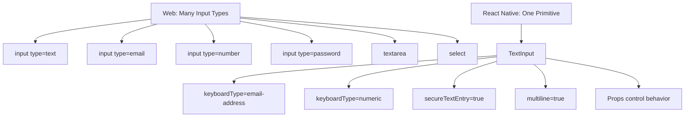
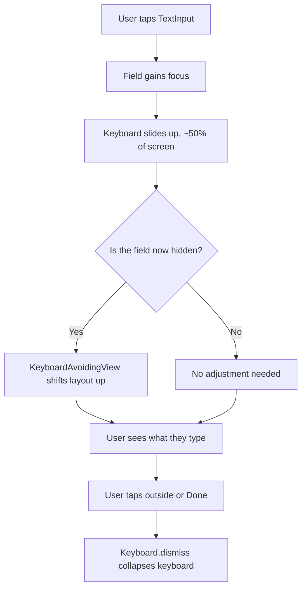
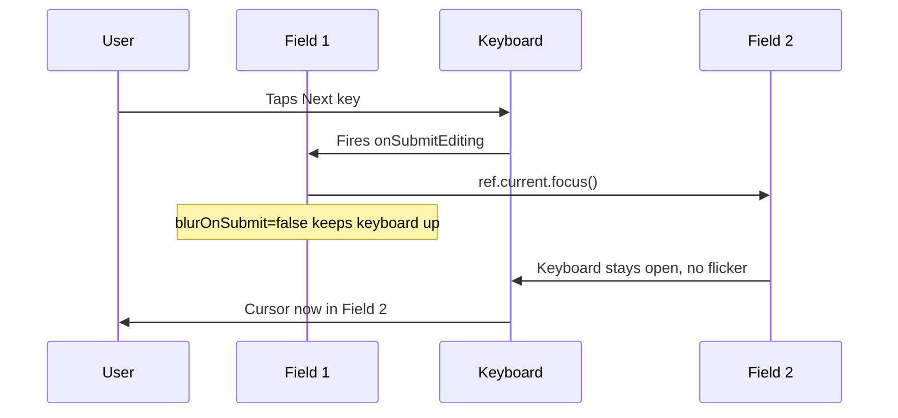
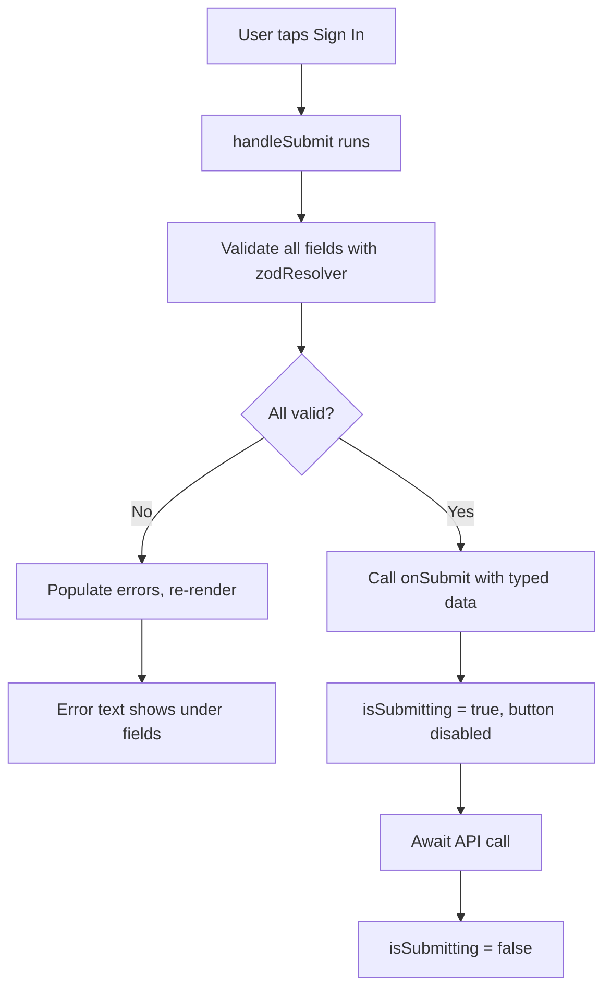
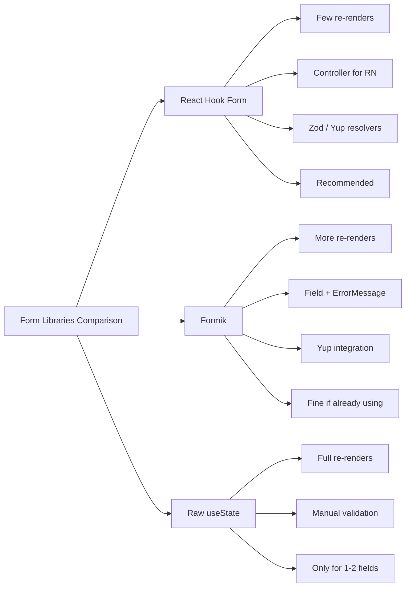
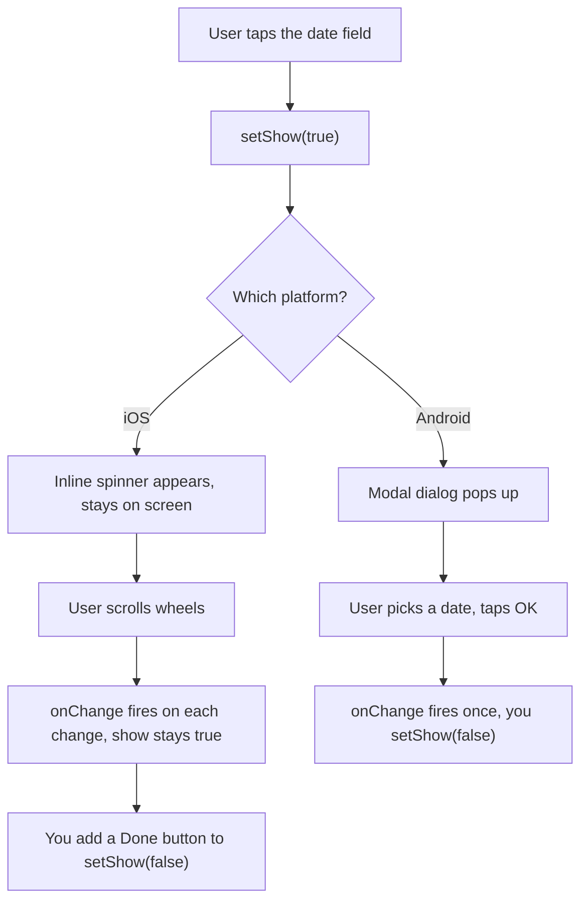
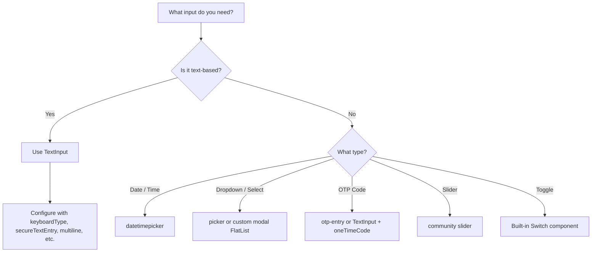
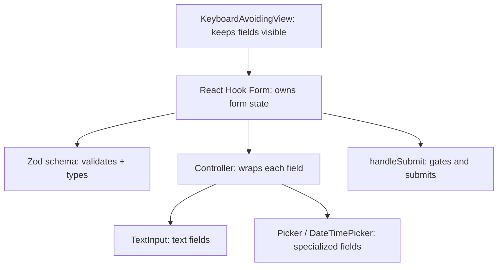

# Form e Input: TextInput e oltre

> Il singolo primitivo di input, la gestione della tastiera e la gestione dei form in un mondo mobile-first.

---

## Table of Contents

1. [Core Input Primitives](#1-core-input-primitives)
2. [Form Libraries](#2-form-libraries)
3. [Specialized Inputs](#3-specialized-inputs)

---

## 1. Primitivi di Input Fondamentali

### L'unico input per domarli tutti

Sul web hai un buffet di tipi di input: `<input type="text">`, `<input type="email">`, `<input type="number">`, `<input type="password">`, `<textarea>`, `<select>` e una dozzina di altri. Ognuno renderizza un widget nativo diverso e porta con sé il proprio comportamento di validazione.

React Native butta via tutto questo e ti offre esattamente un componente: `TextInput`.

Non è una limitazione — è il riflesso di come funzionano realmente le piattaforme mobile. Su iOS e Android esiste un solo widget per il campo di testo. Ne cambi il *comportamento* (quale tastiera appare, se il testo è oscurato, come si comporta l'auto-correzione) tramite le props, non sostituendo i componenti. Una volta interiorizzato questo, i form in React Native sembrano più semplici che sul web, non più difficili.

#### Perché un solo primitivo, davvero?

Pensa a `TextInput` come a un'unica macchina da scrivere fisica in cui sostituisci la *carta* e il *layout della tastiera* a seconda del lavoro, anziché comprare una macchina da scrivere nuova di zecca per ogni compito. La macchina sottostante — il cursore, il buffer di testo, le maniglie di selezione, il menu copia/incolla — è identica ovunque. Ciò che cambia è la configurazione.

Questo è importante perché sul web sia il browser *sia* il sistema operativo forniscono i propri widget nativi, e spesso non concordano. Un `<input type="date">` ha un aspetto completamente diverso in Chrome su Windows rispetto a Safari su iOS rispetto a Firefox su Android — non hai quasi alcun controllo. React Native aggira questo problema esponendo direttamente il campo di testo nativo grezzo e lasciando comporre a *te* il resto (date picker, dropdown) a partire da componenti espliciti che puoi vedere e stilizzare.



#### Il cheat sheet tipo web → prop RN

| Web | Equivalente React Native |
| --- | --- |
| `<input type="text">` | `<TextInput />` |
| `<input type="email">` | `<TextInput keyboardType="email-address" autoCapitalize="none" />` |
| `<input type="number">` | `<TextInput keyboardType="numeric" />` |
| `<input type="tel">` | `<TextInput keyboardType="phone-pad" />` |
| `<input type="password">` | `<TextInput secureTextEntry />` |
| `<input type="url">` | `<TextInput keyboardType="url" autoCapitalize="none" />` |
| `<textarea>` | `<TextInput multiline numberOfLines={4} />` |
| `<input type="date">` / `type="checkbox"` / `<select>` | Nessun componente core — usa un pacchetto della community (vedi Sezione 3) |

### Le props di TextInput che contano

Ecco un `TextInput` configurato per un campo email. Nota come le props sostituiscono ciò che il web fa con gli attributi `type`:

```tsx
import { TextInput, StyleSheet } from "react-native";
import { useState } from "react";

function EmailField() {
  const [email, setEmail] = useState("");

  return (
    <TextInput
      value={email}
      onChangeText={setEmail}
      placeholder="you@example.com"
      keyboardType="email-address"
      autoCapitalize="none"
      autoCorrect={false}
      autoComplete="email"
      returnKeyType="next"
      textContentType="emailAddress"
      style={styles.input}
    />
  );
}

const styles = StyleSheet.create({
  input: {
    borderWidth: 1,
    borderColor: "#ccc",
    borderRadius: 8,
    padding: 12,
    fontSize: 16,
  },
});
```

Analizziamo le props che userai costantemente:

- **`keyboardType`** — Controlla quale layout di tastiera appare. Le opzioni includono `"default"`, `"email-address"`, `"numeric"`, `"phone-pad"`, `"decimal-pad"`, `"number-pad"` e `"url"`. È l'equivalente più vicino ai tipi di input del web.
- **`returnKeyType`** — Cambia l'etichetta sul tasto invio della tastiera: `"done"`, `"next"`, `"search"`, `"go"`, `"send"`. Usa `"next"` quando hai un altro campo sotto, `"done"` per l'ultimo campo.
- **`autoCapitalize`** — Imposta `"none"` per email e username, `"sentences"` per testo normale, `"words"` per i nomi, `"characters"` per il maiuscolo totale.
- **`autoCorrect`** — Disattivalo per email, username, codici. Lascialo attivo per il testo libero.
- **`secureTextEntry`** — Oscura il testo per le password. Sostituisce `<input type="password">`.
- **`textContentType`** (iOS) / **`autoComplete`** (Android + iOS 12+) — Abilita l'autofill dal portachiavi del sistema operativo. Usa `"emailAddress"`, `"password"`, `"newPassword"`, `"oneTimeCode"`, ecc.

> **Consiglio da esperto:** `keyboardType="numeric"` fa *apparire* una tastiera numerica, ma **non** impedisce all'utente di incollare lettere o di digitarle usando una tastiera hardware. Non fidarti mai della tastiera come validazione — valida sempre il valore in sé (vedi Zod nella Sezione 2). La tastiera è un suggerimento di UX, non un vincolo.

#### La tabella di riferimento

| Prop | Cosa fa | Valori tipici | Quando usarla |
| --- | --- | --- | --- |
| `keyboardType` | Sceglie la tastiera a schermo | `email-address`, `numeric`, `phone-pad`, `url` | Abbinare la tastiera al dato |
| `returnKeyType` | Etichetta il tasto invio | `next`, `done`, `search`, `go`, `send` | Guidare l'utente all'azione successiva |
| `autoCapitalize` | Maiuscolo automatico | `none`, `sentences`, `words`, `characters` | Off per email/codici, on per la prosa |
| `autoCorrect` | Correzione ortografica/automatica | `true` / `false` | Off per email, username, password |
| `secureTextEntry` | Maschera i caratteri | `true` / `false` | Password, PIN |
| `multiline` | Consente a capo + Invio | `true` / `false` | Commenti, biografie, note |
| `maxLength` | Limite rigido di caratteri | numero | Limiti stile tweet, codici |
| `editable` | Consente/blocca la modifica | `true` / `false` | Campi di sola visualizzazione |

### onChangeText vs onChange

Questo coglie alla sprovvista chi proviene dal web. Sul web scrivi `onChange={(e) => setValue(e.target.value)}`. React Native ti dà due opzioni:

```tsx
// Preferito: onChangeText ti dà la stringa direttamente
<TextInput onChangeText={(text) => setName(text)} />

// Disponibile anche: onChange ti dà un evento nativo
<TextInput
  onChange={(e) => {
    const text = e.nativeEvent.text;
    setName(text);
  }}
/>
```

Usa `onChangeText` nel 99% dei casi. È più semplice ed è ciò che si aspettano le librerie per i form. L'unica volta in cui ti serve `onChange` è quando hai bisogno di metadati dall'evento nativo (la posizione del cursore, ad esempio).

#### Controllato vs non controllato — lo stesso modello mentale del web

Proprio come nel React web, un `TextInput` è **controllato** quando passi sia `value` sia `onChangeText`. Lo state è l'unica fonte di verità: l'input mostra soltanto ciò che lo state dice di mostrare.

```tsx
// Controllato — lo state di React guida l'input
const [name, setName] = useState("");
<TextInput value={name} onChangeText={setName} />

// Non controllato — il campo nativo conserva il proprio testo; lo leggi tramite una ref
<TextInput defaultValue="" ref={inputRef} />
```

> **Errore comune:** Passare `value` *senza* `onChangeText`. Il campo si congela — l'utente digita e non appare nulla, perché ogni battitura ri-renderizza tornando al `value` immutato. È esattamente la stessa trappola di un `<input>` controllato in sola lettura sul web. O aggiungi `onChangeText`, oppure usa `defaultValue` per un campo non controllato.

### Gestione della Tastiera

La tastiera su mobile non è un popup silenzioso — scorre verso l'alto e copre circa metà dello schermo. Se il tuo input è nella metà inferiore, l'utente non riesce a vedere ciò che sta digitando. Questa è la più grande fonte di frustrazione nei form mobile, e React Native ti offre gli strumenti per gestirla.

Sul web il browser scorre automaticamente in vista gli input con focus e la tastiera (se presente) è un problema del sistema operativo. Su mobile **non succede nulla automaticamente** — la tastiera scorre sopra il tuo layout ed è interamente compito tuo spostare il contenuto fuori dalla sua strada.



**KeyboardAvoidingView** avvolge il tuo form e regola il layout quando appare la tastiera:

```tsx
import {
  KeyboardAvoidingView,
  Platform,
  TouchableWithoutFeedback,
  Keyboard,
  ScrollView,
} from "react-native";

function LoginForm() {
  return (
    <KeyboardAvoidingView
      behavior={Platform.OS === "ios" ? "padding" : "height"}
      style={{ flex: 1 }}
    >
      <TouchableWithoutFeedback onPress={Keyboard.dismiss}>
        <ScrollView
          contentContainerStyle={{ flexGrow: 1, padding: 20 }}
          keyboardShouldPersistTaps="handled"
        >
          {/* Your form fields here */}
        </ScrollView>
      </TouchableWithoutFeedback>
    </KeyboardAvoidingView>
  );
}
```

> **Trabocchetto:** La prop `behavior` su `KeyboardAvoidingView` è diversa a seconda della piattaforma. Usa `"padding"` su iOS e `"height"` su Android. Sbagliare questo è la ragione numero uno per cui le persone pensano che KeyboardAvoidingView "non funzioni" e lo abbandonano. Funziona benissimo — ha solo bisogno del behavior corretto per ciascun sistema operativo.

Il wrapper `TouchableWithoutFeedback` con `Keyboard.dismiss` è il pattern "tocca fuori per chiudere la tastiera". Sul web, cliccare fuori da un input naturalmente toglie il focus. Su mobile, la tastiera resta aperta finché non la chiudi esplicitamente. Hai bisogno di questo wrapper.

La prop `keyboardShouldPersistTaps="handled"` su ScrollView è fondamentale: senza di essa, toccare un pulsante mentre la tastiera è aperta chiude la tastiera *invece di* premere il pulsante. I tuoi utenti toccheranno "Submit" e non succederà nulla — la tastiera si chiude e basta. Devono toccare di nuovo. Impostandola su `"handled"` i pulsanti possono ricevere i tap anche quando la tastiera è visibile.

#### I valori di `behavior`, decodificati

| `behavior` | Cosa fa | Migliore su |
| --- | --- | --- |
| `"padding"` | Aggiunge padding inferiore pari all'altezza della tastiera, spingendo il contenuto verso l'alto | iOS |
| `"height"` | Riduce l'altezza della view così il contenuto si riflette sopra la tastiera | Android |
| `"position"` | Fa scorrere l'intera view verso l'alto tramite il posizionamento assoluto (può risultare a scatti) | Raramente — casi legacy |
| `undefined` | Nessun adattamento | Quando lo gestisci manualmente |

> **Consiglio da esperto:** Per qualsiasi cosa che vada oltre un form semplice, considera il pacchetto della community `react-native-keyboard-controller`. Offre animazioni della tastiera più fluide e dal sapore più nativo e una `KeyboardAwareScrollView` che "funziona e basta" su tutte le piattaforme senza dover destreggiarti con il `behavior` per ogni sistema operativo. `KeyboardAvoidingView` è la base integrata; questo è l'upgrade quando non è abbastanza fluida.

### Mettere il Focus sul Campo Successivo

Sul web, premere Tab sposta automaticamente al campo successivo. Su mobile non esiste il tasto Tab. Lo colleghi tu stesso usando le ref e la callback `onSubmitEditing`:

```tsx
import { useRef } from "react";
import { TextInput } from "react-native";

function SignupForm() {
  const lastNameRef = useRef<TextInput>(null);
  const emailRef = useRef<TextInput>(null);

  return (
    <>
      <TextInput
        placeholder="First name"
        returnKeyType="next"
        onSubmitEditing={() => lastNameRef.current?.focus()}
        blurOnSubmit={false}
      />
      <TextInput
        ref={lastNameRef}
        placeholder="Last name"
        returnKeyType="next"
        onSubmitEditing={() => emailRef.current?.focus()}
        blurOnSubmit={false}
      />
      <TextInput
        ref={emailRef}
        placeholder="Email"
        returnKeyType="done"
        keyboardType="email-address"
      />
    </>
  );
}
```

Imposta `blurOnSubmit={false}` su tutti i campi tranne l'ultimo. Senza, premere "Next" sulla tastiera toglie il focus dal campo corrente prima di metterlo sul successivo, causando uno sgradevole sfarfallio della tastiera mentre si nasconde e riappare brevemente.

Ecco la catena di eventi quando l'utente tocca "Next" sulla tastiera:



> **Trabocchetto:** `ref.current?.focus()` funziona solo se la ref punta al `TextInput` *reale*. Se avvolgi il tuo input in un componente personalizzato, devi inoltrare la ref con `forwardRef`, altrimenti la chiamata `.focus()` non fa silenziosamente nulla. Questa è la ragione più comune per cui il "focus sul campo successivo" appare rotto.

---

## 2. Librerie per i Form

### Perché te ne serve una

Gestire un paio di input con `useState` va bene. Gestire un form con 8 campi, validazione, messaggi di errore, tracciamento dirty/touched e gestione dell'invio con lo state grezzo è un incubo — lo stesso incubo che conosci già dal React web. La buona notizia: funzionano le stesse librerie.

Per renderlo concreto, ecco tutto ciò che un form "vero" deve tracciare. Farlo a mano significa un `useState` (o un ramo di reducer) per *ogni* riga, moltiplicato per ogni campo:

| Aspetto | Cosa significa | Costo fatto a mano |
| --- | --- | --- |
| Valori | Testo corrente in ogni campo | Uno state per campo |
| Errori | Messaggi di validazione | Rieseguire la validazione a ogni cambiamento |
| Touched | L'utente ha visitato questo campo? | Tracciare focus/blur per campo |
| Dirty | Il valore è cambiato rispetto al default? | Confrontare con i valori iniziali |
| Submitting | L'invio asincrono è in corso? | Booleano di caricamento manuale + try/catch |
| Blocco dell'invio | Bloccare l'invio finché non è valido | Collegare la validità al pulsante |

Una libreria per i form fa collassare tutto questo in un unico hook. Questa è l'intera proposta.

### React Hook Form — Il Vincitore Indiscusso

React Hook Form funziona in React Native senza alcuna modifica alla sua API core. Sostituisci gli elementi HTML con i componenti RN e usi `Controller` invece di `register` (dato che `register` si basa sulle ref del DOM). Questa è l'unica differenza.

> **Perché `Controller`?** Sul web, `register` funziona collegando una ref direttamente a un `<input>` del DOM e leggendone il `.value` — senza bisogno di state React, ed è ciò che rende RHF così veloce. I componenti React Native non espongono un nodo DOM con una proprietà `.value`, quindi quel trucco non può funzionare. `Controller` colma il divario: trasforma il campo in un componente controllato, alimentando `value`/`onChange` nel tuo `TextInput` mentre RHF continua a gestire tutto il resto dietro le quinte.

```tsx
import { useForm, Controller } from "react-hook-form";
import {
  View,
  Text,
  TextInput,
  Pressable,
  StyleSheet,
} from "react-native";
import { z } from "zod";
import { zodResolver } from "@hookform/resolvers/zod";

const schema = z.object({
  email: z.string().email("Enter a valid email"),
  password: z.string().min(8, "At least 8 characters"),
});

type FormData = z.infer<typeof schema>;

function LoginForm() {
  const {
    control,
    handleSubmit,
    formState: { errors, isSubmitting },
  } = useForm<FormData>({
    resolver: zodResolver(schema),
    defaultValues: { email: "", password: "" },
  });

  const onSubmit = async (data: FormData) => {
    // Call your API
    console.log(data);
  };

  return (
    <View style={styles.container}>
      <Text style={styles.label}>Email</Text>
      <Controller
        control={control}
        name="email"
        render={({ field: { onChange, onBlur, value } }) => (
          <TextInput
            style={[styles.input, errors.email && styles.inputError]}
            value={value}
            onChangeText={onChange}
            onBlur={onBlur}
            placeholder="you@example.com"
            keyboardType="email-address"
            autoCapitalize="none"
            autoCorrect={false}
            returnKeyType="next"
          />
        )}
      />
      {errors.email && (
        <Text style={styles.error}>{errors.email.message}</Text>
      )}

      <Text style={styles.label}>Password</Text>
      <Controller
        control={control}
        name="password"
        render={({ field: { onChange, onBlur, value } }) => (
          <TextInput
            style={[styles.input, errors.password && styles.inputError]}
            value={value}
            onChangeText={onChange}
            onBlur={onBlur}
            placeholder="Min. 8 characters"
            secureTextEntry
            returnKeyType="done"
          />
        )}
      />
      {errors.password && (
        <Text style={styles.error}>{errors.password.message}</Text>
      )}

      <Pressable
        style={[styles.button, isSubmitting && styles.buttonDisabled]}
        onPress={handleSubmit(onSubmit)}
        disabled={isSubmitting}
      >
        <Text style={styles.buttonText}>
          {isSubmitting ? "Signing in..." : "Sign In"}
        </Text>
      </Pressable>
    </View>
  );
}

const styles = StyleSheet.create({
  container: { padding: 20 },
  label: { fontSize: 14, fontWeight: "600", marginBottom: 4, marginTop: 16 },
  input: {
    borderWidth: 1,
    borderColor: "#ccc",
    borderRadius: 8,
    padding: 12,
    fontSize: 16,
  },
  inputError: { borderColor: "#e53e3e" },
  error: { color: "#e53e3e", fontSize: 12, marginTop: 4 },
  button: {
    backgroundColor: "#3b82f6",
    padding: 16,
    borderRadius: 8,
    alignItems: "center",
    marginTop: 24,
  },
  buttonDisabled: { opacity: 0.6 },
  buttonText: { color: "#fff", fontSize: 16, fontWeight: "600" },
});
```

#### Come si svolge realmente un invio

`handleSubmit` è un cancello. Esegue prima la validazione e chiama il tuo `onSubmit` *solo* se ogni campo passa. Se qualcosa fallisce, popola `errors` e il tuo `onSubmit` non viene mai eseguito — così non devi mai controllare la validità a mano dentro l'handler di invio.



#### Un `ControlledInput` riutilizzabile per eliminare il boilerplate

Scrivere `<Controller>` attorno a ogni campo diventa prolisso. Nelle app reali lo estrai una volta sola:

```tsx
import { Controller, Control, FieldValues, Path } from "react-hook-form";
import { TextInput, Text, TextInputProps } from "react-native";

type Props<T extends FieldValues> = {
  control: Control<T>;
  name: Path<T>;
  error?: string;
} & TextInputProps;

function ControlledInput<T extends FieldValues>({
  control,
  name,
  error,
  ...inputProps
}: Props<T>) {
  return (
    <>
      <Controller
        control={control}
        name={name}
        render={({ field: { onChange, onBlur, value } }) => (
          <TextInput
            value={value}
            onChangeText={onChange}
            onBlur={onBlur}
            {...inputProps}
          />
        )}
      />
      {error ? <Text style={{ color: "#e53e3e" }}>{error}</Text> : null}
    </>
  );
}

// Usage shrinks to a single line per field:
// <ControlledInput control={control} name="email" error={errors.email?.message} />
```

### Zod per la Validazione

Nota lo schema Zod nell'esempio precedente. Zod è la libreria di validazione che consiglio perché fa due cose contemporaneamente: valida i dati *e* inferisce i tipi TypeScript dallo schema. Definisci la forma del tuo form una volta sola e ottieni gratis validazione a runtime più type safety a compile-time:

```tsx
const schema = z.object({
  email: z.string().email(),
  password: z.string().min(8),
  age: z.coerce.number().min(13).max(120),
});

// This type is derived automatically — no duplication
type FormData = z.infer<typeof schema>;
// { email: string; password: string; age: number }
```

L'intuizione chiave: un `TextInput` ti dà *sempre* una stringa. Un campo come "age" arriva come `"25"`, non `25`. `z.coerce.number()` lo converte per te durante la validazione, così il tuo `onSubmit` riceve un vero `number`. Ecco perché Zod si sposa così bene con RN — assorbe la realtà del "tutto è testo" di `TextInput`.

Il `zodResolver` da `@hookform/resolvers` fa da ponte tra Zod e React Hook Form. Installa entrambi:

```bash
npm install react-hook-form zod @hookform/resolvers
```

Alcuni pattern di validazione a cui ricorrerai costantemente:

```tsx
const schema = z.object({
  // Custom error messages live in the validator
  username: z.string().min(3, "Too short").max(20, "Too long"),
  // Cross-field validation: confirm-password must match
  password: z.string().min(8),
  confirm: z.string(),
}).refine((data) => data.password === data.confirm, {
  message: "Passwords don't match",
  path: ["confirm"], // attaches the error to the confirm field
});
```

> **Consiglio da esperto:** Imposta `useForm({ mode: "onBlur" })` così la validazione scatta quando un campo perde il focus, non a ogni battitura. Validare a ogni carattere è fastidioso — l'utente vede "email non valida" mentre è ancora a metà della digitazione. `"onBlur"` aspetta che vada avanti, il che risulta molto più educato.

### E Formik?

Formik è stato lo standard per anni e funziona ancora. Ma React Hook Form è più veloce (meno ri-render, dato che usa input non controllati sotto il cofano dove possibile), ha un bundle più piccolo e l'API `Controller` è più pulita del pattern `<Field>` + `<ErrorMessage>` di Formik. Se stai iniziando un nuovo progetto, usa React Hook Form. Se il tuo codebase esistente usa Formik, non c'è una ragione urgente per migrare — è più lento ma non rotto.



| Approccio | Ri-render | Validazione | Boilerplate | Quando usarlo |
| --- | --- | --- | --- | --- |
| **React Hook Form** | Minimi (isola i campi) | Resolver Zod / Yup | Basso | Default per qualsiasi form reale — parti da qui |
| **Formik** | Maggiori (ri-render a ogni battitura) | Yup | Medio | Già presente nel tuo codebase; nessun bisogno di migrare |
| **`useState` grezzo** | Ri-render completo del componente a ogni battitura | Controlli `if` manuali | Alto e cresce in fretta | Una singola casella di ricerca o 1–2 campi banali |

> **Errore comune:** Non costruire la tua gestione dello state dei form con `useReducer` e una manciata di chiamate `useState` solo per evitare una dipendenza. Le librerie per i form gestiscono il tracciamento dirty, lo state touched, la validazione asincrona, gli array di campi e una dozzina di casi limite di cui prima o poi avrai bisogno. La dipendenza ne vale la pena.

---

## 3. Input Specializzati

### Oltre TextInput

TextInput gestisce il testo. Ma i form mobile spesso hanno bisogno di date picker, dropdown, slider, codici OTP e numeri di telefono. Nessuno di questi esiste nel React Native core — ricorri ai pacchetti della community.

Perché non sono integrati? Il team core di React Native mantiene deliberatamente piccola la superficie. Un date picker, uno slider, un dropdown — questi avvolgono tutti widget *nativi* della piattaforma, e mantenerli attraverso il continuo turnover delle versioni di iOS e Android richiede molto lavoro. Così il team core delega questo ai pacchetti della community, la maggior parte dei quali risiede sotto l'org `@react-native-community` ed è di fatto semi-ufficiale. Ricorrere a un pacchetto qui è normale e previsto, non un espediente.

| Necessità | Pacchetto | Renderizza come |
| --- | --- | --- |
| Data / ora | `@react-native-community/datetimepicker` | Picker nativo iOS/Android |
| Dropdown / select | `@react-native-picker/picker` | Ruota (iOS) / dropdown (Android) |
| Codice OTP | `react-native-otp-entry` | Riga di caselle a singola cifra |
| Slider | `@react-native-community/slider` | Traccia slider nativa |
| Toggle | `Switch` (integrato nel core!) | Interruttore on/off nativo |
| Numero di telefono | `react-native-phone-number-input` | Campo + selettore del prefisso internazionale |

### Date e Time Picker

Il pacchetto di riferimento è `@react-native-community/datetimepicker`. Renderizza le finestre native di selezione data/ora di iOS e Android:

```bash
npm install @react-native-community/datetimepicker
```

```tsx
import { useState } from "react";
import { View, Text, Pressable, Platform } from "react-native";
import DateTimePicker, {
  DateTimePickerEvent,
} from "@react-native-community/datetimepicker";

function DateField() {
  const [date, setDate] = useState(new Date());
  const [show, setShow] = useState(false);

  const onChange = (event: DateTimePickerEvent, selectedDate?: Date) => {
    // On Android, the picker is a dialog — it closes automatically
    if (Platform.OS === "android") {
      setShow(false);
    }
    if (selectedDate) {
      setDate(selectedDate);
    }
  };

  return (
    <View>
      <Pressable onPress={() => setShow(true)}>
        <Text style={{ fontSize: 16, padding: 12, borderWidth: 1, borderColor: "#ccc", borderRadius: 8 }}>
          {date.toLocaleDateString()}
        </Text>
      </Pressable>

      {show && (
        <DateTimePicker
          value={date}
          mode="date"
          display={Platform.OS === "ios" ? "spinner" : "default"}
          onChange={onChange}
          maximumDate={new Date()}
        />
      )}
    </View>
  );
}
```

> **Differenza di piattaforma:** Su iOS, il picker è uno spinner inline che resta visibile. Su Android, è una finestra modale che scompare dopo la selezione. La tua logica di mostra/nascondi deve tenerne conto — su Android, imposta sempre `show` a `false` in `onChange`. Su iOS, potresti volere un pulsante "Done" per chiuderlo.

Questo comportamento dalla doppia personalità è la cosa più confusa in assoluto di questo pacchetto. Eccolo come flusso:



> **Trabocchetto:** Su Android, l'utente può toccare "Cancel". In quel caso `onChange` scatta comunque, ma `event.type === "dismissed"` e `selectedDate` è `undefined`. Proteggiti sempre con `if (selectedDate)` prima di salvare — altrimenti potresti sovrascrivere una data valida con il nulla.

### Picker / Dropdown di Selezione

L'elemento web `<select>` non ha equivalenti nel React Native core. Usa `@react-native-picker/picker`:

```bash
npm install @react-native-picker/picker
```

```tsx
import { Picker } from "@react-native-picker/picker";
import { useState } from "react";

function CountryPicker() {
  const [country, setCountry] = useState("us");

  return (
    <Picker
      selectedValue={country}
      onValueChange={(value) => setCountry(value)}
    >
      <Picker.Item label="United States" value="us" />
      <Picker.Item label="Canada" value="ca" />
      <Picker.Item label="United Kingdom" value="uk" />
      <Picker.Item label="France" value="fr" />
    </Picker>
  );
}
```

Su iOS questo renderizza una ruota girevole; su Android renderizza un menu a discesa. Se vuoi un aspetto coerente su tutte le piattaforme, molti team costruiscono invece un picker modale personalizzato con una FlatList. Ma per i form standard, il picker nativo va bene ed è accessibile out of the box.

| Approccio | Aspetto | Sforzo | Quando usarlo |
| --- | --- | --- | --- |
| `@react-native-picker/picker` | Ruota nativa (iOS) / dropdown (Android) | Basso | Form standard, l'accessibilità conta, va bene avere differenze di piattaforma |
| `Modal` + `FlatList` personalizzati | Identico su entrambe le piattaforme, completamente stilizzabile | Alto | UI coerente con il brand, liste lunghe, ricerca mentre digiti |
| Librerie "select" di terze parti | Variabile | Medio | Vuoi ricerca/selezione multipla senza costruirla |

> **Consiglio da esperto:** Nota che il `Picker` è *controllato* esattamente come un `TextInput` — `selectedValue` è il tuo "value" e `onValueChange` è il tuo "onChange". Lo stesso pattern del componente controllato dalla Sezione 1 si applica a quasi tutti gli input dell'ecosistema. Imparalo una volta, applicalo ovunque.

### Input per Codice OTP / di Verifica

Gli input OTP — quelle 4-6 caselle separate per i codici di verifica — sono sorprendentemente complicati da costruire da zero. Devi gestire il focus tra le caselle, gestire l'incolla dagli appunti e supportare l'autofill del sistema operativo per i codici SMS. Usa una libreria:

```bash
npm install react-native-otp-entry
```

```tsx
import { OtpInput } from "react-native-otp-entry";

function VerificationScreen() {
  const handleOtpFilled = (code: string) => {
    // Verify the code with your API
    console.log("OTP entered:", code);
  };

  return (
    <OtpInput
      numberOfDigits={6}
      onFilled={handleOtpFilled}
      autoFocus
      theme={{
        pinCodeContainerStyle: {
          borderWidth: 2,
          borderColor: "#ccc",
          borderRadius: 8,
          width: 48,
          height: 56,
        },
        focusedPinCodeContainerStyle: {
          borderColor: "#3b82f6",
        },
      }}
    />
  );
}
```

Perché è "sorprendentemente complicato" farlo a mano? Perché le sei caselle che *vedi* sono l'illusione di sei input, ma il comportamento che gli utenti si aspettano le abbraccia tutte contemporaneamente:

- Digitare una cifra deve far avanzare automaticamente il focus alla casella successiva.
- Premere backspace su una casella vuota deve saltare *indietro* e cancellare la precedente.
- Incollare "123456" deve distribuire una cifra per casella, non riversarlo tutto nella prima.
- iOS deve offrire il codice SMS dal banner di notifica (`oneTimeCode`).

Una libreria gestisce tutti e quattro. Ecco perché si guadagna il suo posto.

> **Suggerimento:** Imposta `textContentType="oneTimeCode"` su un normale TextInput se vuoi che iOS suggerisca il codice SMS dal banner di notifica senza usare una libreria OTP completa. Funziona abbastanza bene per i casi semplici.

### Input per Numero di Telefono

Gli input per i numeri di telefono hanno bisogno di selezione del prefisso internazionale, formattazione e validazione. Il pacchetto `react-native-phone-number-input` gestisce questo, ma puoi anche abbinare un normale TextInput a una libreria come `libphonenumber-js` per la validazione:

```tsx
import { TextInput } from "react-native";
import { parsePhoneNumberFromString } from "libphonenumber-js";

function PhoneField() {
  const [phone, setPhone] = useState("");
  const [error, setError] = useState("");

  const validate = (text: string) => {
    setPhone(text);
    const parsed = parsePhoneNumberFromString(text, "US");
    if (parsed && parsed.isValid()) {
      setError("");
    } else if (text.length > 5) {
      setError("Enter a valid phone number");
    }
  };

  return (
    <>
      <TextInput
        value={phone}
        onChangeText={validate}
        keyboardType="phone-pad"
        placeholder="(555) 123-4567"
        textContentType="telephoneNumber"
        autoComplete="tel"
      />
      {error ? <Text style={{ color: "red" }}>{error}</Text> : null}
    </>
  );
}
```

> **Consiglio da esperto:** Non validare mai i numeri di telefono con una regex scritta da te. I formati telefonici variano enormemente da paese a paese (lunghezza, raggruppamento, zeri iniziali, prefissi internazionali), e una regex fatta in casa *finirà* per rifiutare numeri validi. `libphonenumber-js` è la logica di parsing dei telefoni di Google, collaudata sul campo e portata in JavaScript — conosce le regole di ogni paese. Usala.

### Mettere Tutto Insieme

Ecco un modello mentale per scegliere l'approccio di input giusto:



La regola generale: parti da `TextInput` e dalle sue props. Ti sorprenderà quanto lontano ti porta. Ricorri ai pacchetti della community solo quando ti serve un modello di interazione genuinamente diverso — ruote per le date, liste dropdown, slider. E avvolgi sempre tutto in React Hook Form con la validazione Zod. Quello stack — TextInput + picker della community + React Hook Form + Zod — gestisce ogni form che costruirai in produzione.

#### Lo stack di produzione, in un'unica immagine



Ogni form che spedisci in produzione è una qualche disposizione di questi sei pezzi. Padroneggiali e non ci sarà form mobile che non potrai costruire.