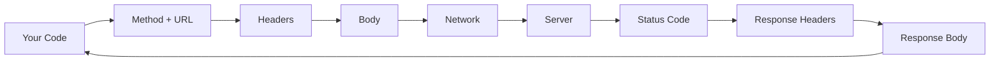
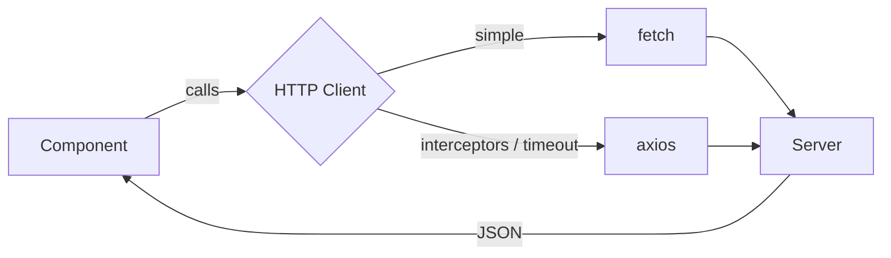
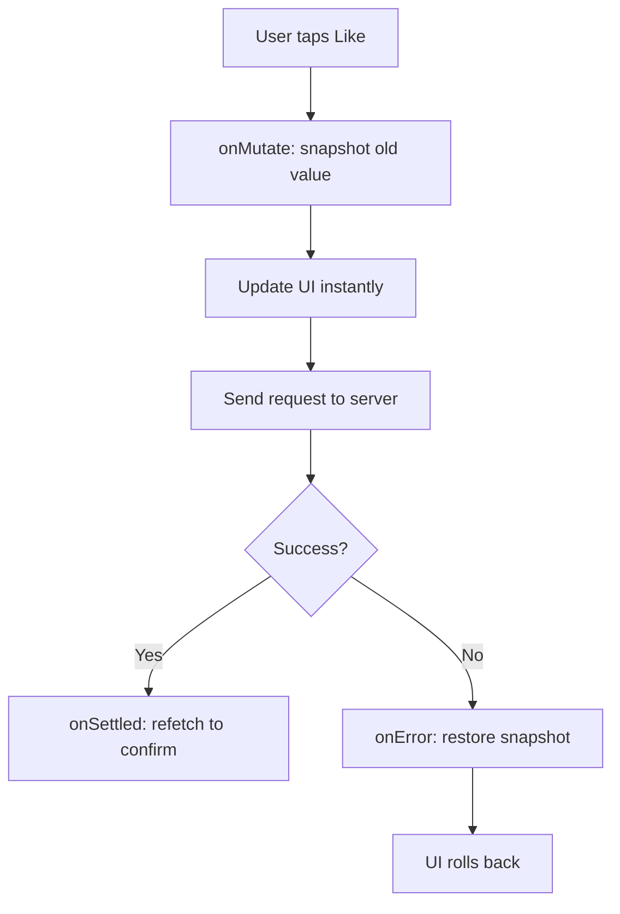
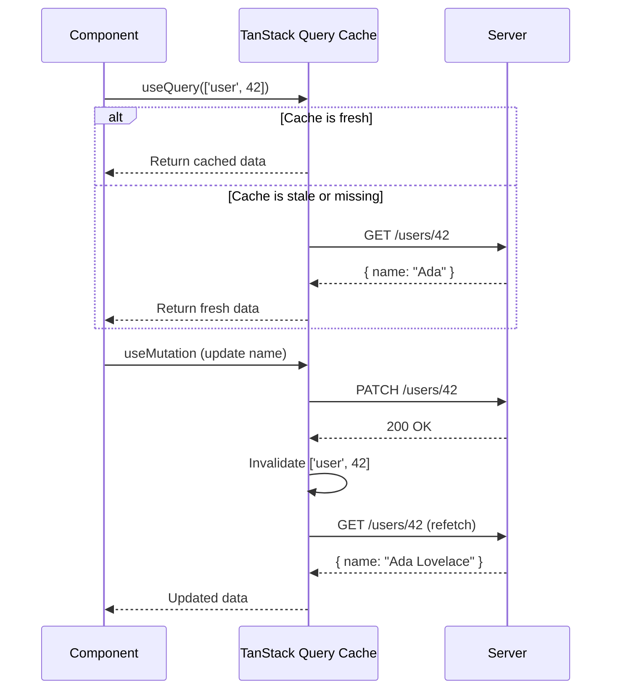
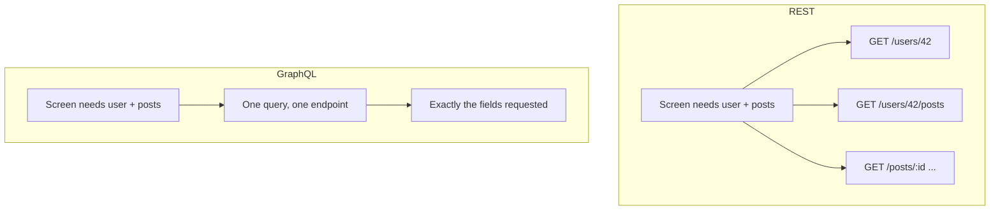
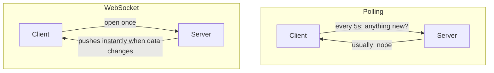
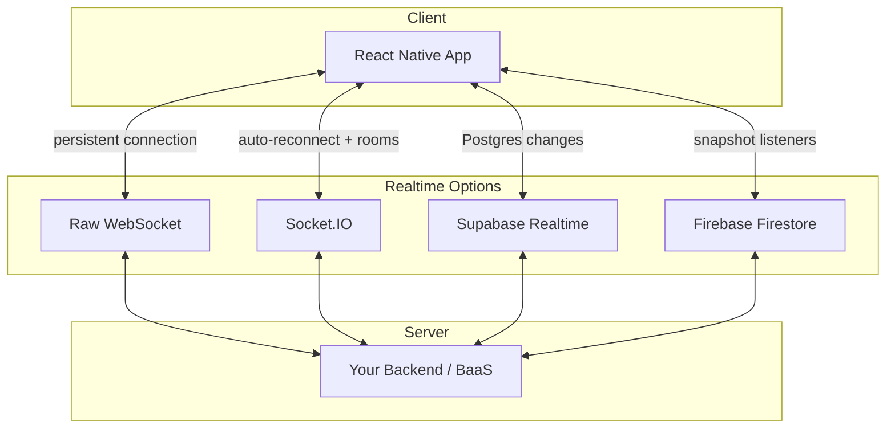
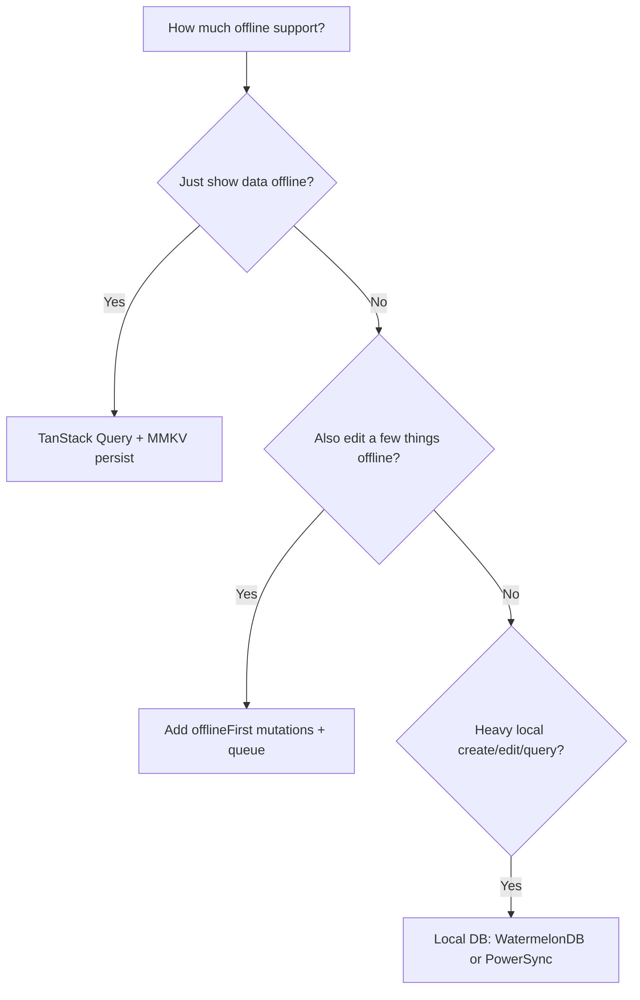
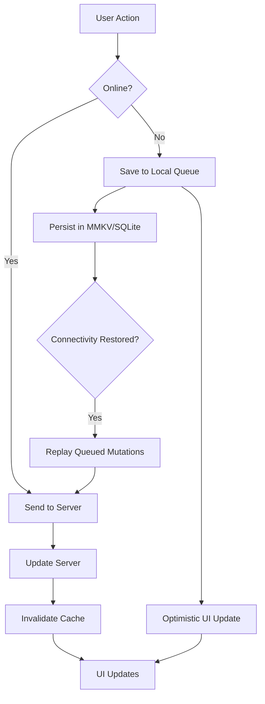

# Networking e Dati: Fetching, Caching e Funzionamento Offline

> Richieste HTTP, gestione dello stato del server, connessioni in tempo reale e pattern offline-first per il mobile.

---

## Table of Contents

1. [HTTP](#1-http)
2. [Server State with TanStack Query](#2-server-state-with-tanstack-query)
3. [GraphQL](#3-graphql)
4. [Realtime](#4-realtime)
5. [Offline-First Patterns](#5-offline-first-patterns)

---

## 1. HTTP

Sul web, ricorri a `fetch` o `axios` senza pensarci due volte. React Native include `fetch` integrato nel suo runtime JavaScript — nessun polyfill, nessun import, basta chiamarlo. Questa è al tempo stesso la buona notizia e la trappola. Il networking mobile è fondamentalmente diverso da quello del browser: le connessioni cadono negli ascensori, passano dal Wi-Fi alla rete cellulare a metà richiesta, e gli utenti si aspettano che la tua app gestisca tutto questo con eleganza.

### Perché il networking mobile è diverso

In una scheda del browser, la rete è per lo più stabile: l'utente è su Wi-Fi o su una connessione cablata, la scheda rimane aperta, e una richiesta fallita di solito significa che il server è giù. Su un telefono, la rete è un bersaglio in movimento. Immagina un pendolare che apre la tua app sul treno: LTE pieno sul binario, zona morta nel tunnel, 3G a singhiozzo quando il treno riemerge, poi un passaggio al Wi-Fi della stazione. La tua richiesta potrebbe *iniziare* su rete cellulare e *finire* su Wi-Fi — oppure non finire mai.

Ecco perché tre cose contano molto di più sul mobile che sul web:

- **Timeout** — una richiesta bloccata su una connessione instabile dovrebbe fallire rapidamente, non girare all'infinito e prosciugare la batteria.
- **Retry** — un fallimento transitorio (un pacchetto perso) è normale, non eccezionale. Riprovare una o due volte spesso "funziona e basta".
- **UI di errore** — ogni schermata che fa fetch ha bisogno di uno stato visibile di caricamento, errore e vuoto, perché tutti e tre *accadranno* nel mondo reale.

> **Pensala così:** una richiesta del browser è una telefonata su una linea fissa. Una richiesta mobile è una conversazione via walkie-talkie mentre cammini attraverso un edificio — devi prevedere disturbi e parole perse.

### L'anatomia di una richiesta HTTP

Qualunque client tu usi, ogni richiesta ha gli stessi componenti in gioco. Comprenderli rende il debugging molto più facile quando qualcosa restituisce i dati sbagliati.



- **Method** — `GET` (lettura), `POST` (creazione), `PATCH`/`PUT` (aggiornamento), `DELETE` (rimozione).
- **Headers** — metadati: `Content-Type`, `Authorization`, ecc.
- **Body** — il payload (di solito JSON) inviato con `POST`/`PATCH`.
- **Status code** — `2xx` successo, `3xx` redirect, `4xx` un tuo errore (richiesta errata, non autorizzato), `5xx` un errore del server.

### fetch: il default integrato

Il `fetch` di React Native segue la stessa specifica WHATWG che conosci dal browser. Funziona in modo identico per le chiamate GET/POST di base:

```tsx
const response = await fetch('https://api.example.com/users/42');
const user = await response.json();
```

Il problema — e questo manda in confusione quasi ogni principiante — è che `fetch` **non** va in reject sui codici di stato HTTP di errore. Un 404 o un 500 ti restituiscono una promise risolta. Devi controllare tu stesso `response.ok`:

```tsx
async function getUser(id: number) {
  const response = await fetch(`https://api.example.com/users/${id}`);
  if (!response.ok) {
    throw new Error(`HTTP ${response.status}: ${response.statusText}`);
  }
  return response.json();
}
```

> **Errore comune:** dare per scontato che un `try/catch` attorno a `fetch` intercetti un 500. Non lo fa. Il blocco `catch` scatta solo per fallimenti a *livello di rete* (nessuna connessione, fallimento DNS, timeout). Un HTTP 500 è un round-trip di rete *riuscito* che si è semplicemente portato dietro uno stato di errore — quindi devi ispezionare `response.ok` esplicitamente. Questo è il singolo bug di `fetch` più comune per i principianti.

Un `fetch` più completo, con un timeout (essenziale sul mobile) e un body tipizzato, ha questo aspetto:

```tsx
async function postJson<T>(url: string, body: unknown): Promise<T> {
  // AbortController lets us cancel a hung request after 10s
  const controller = new AbortController();
  const timeout = setTimeout(() => controller.abort(), 10_000);

  try {
    const res = await fetch(url, {
      method: 'POST',
      headers: { 'Content-Type': 'application/json' },
      body: JSON.stringify(body),
      signal: controller.signal, // wires the timeout to the request
    });
    if (!res.ok) throw new Error(`HTTP ${res.status}`);
    return (await res.json()) as T;
  } finally {
    clearTimeout(timeout); // always clean up the timer
  }
}
```

> **Trappola:** il `fetch` semplice **non ha alcun timeout integrato**. Senza un `AbortController`, una richiesta su una connessione morta può rimanere bloccata indefinitamente. Sul web potresti non accorgertene mai; sul mobile è uno spinner congelato e una batteria sprecata.

Per app semplici, `fetch` è tutto ciò di cui hai bisogno. Ma non appena vuoi interceptor sulle richieste, retry automatici o il tracciamento del progresso degli upload, comincerai a costruire il tuo wrapper. È in quel momento che dovresti invece ricorrere a una libreria.

### axios: quando fetch non basta

`axios` ti offre interceptor, trasformazioni JSON automatiche, cancellazione delle richieste e timeout configurabili pronti all'uso. La funzionalità chiave è l'**interceptor** — una funzione che gira su *ogni* richiesta o risposta, così puoi allegare un token di autenticazione o normalizzare gli errori in un unico punto invece di ripeterlo in ogni chiamata.

Configura una volta un'istanza condivisa con il tuo base URL e gli header di default, poi importala ovunque:

```tsx
// api/client.ts
import axios from 'axios';
import { getToken } from '../auth/storage';

const client = axios.create({
  baseURL: 'https://api.example.com',
  timeout: 10_000, // 10 seconds — generous for mobile
  headers: { 'Content-Type': 'application/json' },
});

// Attach auth token to every request
client.interceptors.request.use(async (config) => {
  const token = await getToken();
  if (token) {
    config.headers.Authorization = `Bearer ${token}`;
  }
  return config;
});

// Normalize error handling
client.interceptors.response.use(
  (response) => response,
  (error) => {
    if (error.response?.status === 401) {
      // Redirect to login or refresh token
    }
    return Promise.reject(error);
  },
);

export default client;
```

Due comodità di `axios` che fanno risparmiare boilerplate concreto rispetto a `fetch`:

```tsx
// 1. axios THROWS on 4xx/5xx automatically — no response.ok check needed
try {
  const { data } = await client.get('/users/42'); // data is already parsed JSON
} catch (err) {
  // fires for HTTP errors AND network errors
}

// 2. Response is already JSON — no `await res.json()` second step
```

> **Trappola:** non scrivere mai il base URL della tua API in modo hardcoded. Usa variabili d'ambiente (tramite `react-native-config` o il supporto `.env` di Expo) così da poter passare da staging a produzione senza ricompilare.

> **Consiglio da esperti:** gli interceptor sono il posto giusto per gestire il refresh del token. Quando torna un `401`, l'interceptor sulla risposta può recuperare in modo trasparente un nuovo token e riprovare la richiesta originale — il componente chiamante non saprà nemmeno che è successo.

### Quale dovresti scegliere?

| Necessità | `fetch` | `axios` |
|---|---|---|
| Dimensione del bundle | Zero (integrato) | ~13 KB |
| Errori su 4xx/5xx | No — controlla `response.ok` | Sì — lancia automaticamente |
| Parsing JSON automatico | No — `await res.json()` | Sì — `response.data` |
| Timeout | Manuale (`AbortController`) | Integrato (opzione `timeout`) |
| Interceptor | Costruisci il tuo wrapper | Di prima classe |
| Progresso degli upload | Non supportato | Supportato |
| **Quando usarlo** | Prototipi, 1–2 chiamate API | App reali, autenticazione, configurazione condivisa |

Usa `fetch` per i prototipi e per le app con una o due chiamate API. Usa `axios` non appena ti servono interceptor, gestione centralizzata degli errori o controllo del timeout. In ogni caso, né `fetch` né `axios` risolvono il vero problema: gestire lo **stato** dei dati del server nei tuoi componenti. È a questo che serve la prossima sezione.



---

## 2. Server State with TanStack Query

Ecco il problema che il `fetch` o `axios` grezzo non può risolvere: recuperi una lista di utenti, la mostri, navighi verso una schermata di dettaglio, torni indietro, e la lista viene rieseguita in fetch. O peggio, non viene rieseguita e mostra dati stantii. Finisci per scrivere a mano la logica di `isLoading`, `isError` e di caching in ogni componente. TanStack Query (precedentemente React Query) elimina tutto questo e aggiunge superpoteri specifici per il mobile.

### Lo stato del server non è lo stato del client

Il cambio di mentalità che fa scattare il clic con TanStack Query: **i dati del server non sono i tuoi dati — sono una copia in cache dei dati di qualcun altro.** Il nome dell'utente vive nel database su un server. La tua app conserva uno snapshot temporaneo che può diventare stantio nel momento stesso in cui un altro dispositivo lo modifica. Questo è fondamentalmente diverso da un toggle o da un campo di un form (stato del client), che appartengono soltanto alla tua app.

| | Stato del client | Stato del server |
|---|---|---|
| Posseduto da | La tua app | Un server remoto |
| Può diventare stantio | No | Sì — in qualsiasi momento |
| Strumenti | `useState`, Zustand, Redux | TanStack Query, Apollo |
| Domande chiave | Qual è il valore? | È fresco? Devo rifare il fetch? |

Cercare di gestire lo stato del server con `useState` + `useEffect` significa reinventare a mano caching, deduplicazione, retry e refetch-on-focus. TanStack Query è la libreria che ha già risolto tutto questo.

> **Analogia:** pensa a TanStack Query come a un frigorifero intelligente. Chiedi il latte (i dati) per nome (la query key). Se il frigorifero ha latte fresco, lo ottieni all'istante. Se è oltre la data di "scadenza" (`staleTime`), il frigorifero si rifornisce silenziosamente in background mentre ti consegna comunque ciò che ha. Se nessuno beve una confezione per un po', viene buttata via (`gcTime`).

### Setup

```bash
npx expo install @tanstack/react-query
```

Avvolgi la tua app in un `QueryClientProvider`:

```tsx
import { QueryClient, QueryClientProvider } from '@tanstack/react-query';

const queryClient = new QueryClient({
  defaultOptions: {
    queries: {
      staleTime: 1000 * 60 * 5, // 5 minutes before data is "stale"
      gcTime: 1000 * 60 * 30,   // garbage-collect unused cache after 30 min
      retry: 2,
    },
  },
});

export default function App() {
  return (
    <QueryClientProvider client={queryClient}>
      <RootNavigator />
    </QueryClientProvider>
  );
}
```

### La query key: il cuore della cache

Ogni query è identificata da una **query key** — un array serializzabile come `['user', 42]`. Questo è l'indirizzo nella cache. Due componenti che chiedono `['user', 42]` condividono automaticamente *una sola* richiesta e *un solo* risultato in cache (questo si chiama deduplicazione). Quando cambi un pezzo della key — `['user', 43]` — è un indirizzo diverso, una voce di cache diversa, un fetch diverso.

```tsx
// Same key anywhere in the app = same cache entry, one network request
useQuery({ queryKey: ['user', 42], queryFn: ... }); // ScreenA
useQuery({ queryKey: ['user', 42], queryFn: ... }); // ScreenB — no second fetch!

// Keys are hierarchical — invalidate broadly or narrowly
['todos']            // all todos
['todos', { done: true }] // a filtered subset
['todos', 42]        // a single todo
```

> **Consiglio da esperti:** inserisci nella key ogni valore da cui dipende la `queryFn`. Se il tuo fetch usa `userId` e `locale`, la key dovrebbe essere `['user', userId, locale]`. Dimenticane uno, e cambiando la lingua ti verranno mostrati dati stantii della lingua sbagliata.

### Query e Mutation

Una **query** recupera dati (una lettura). Una **mutation** li modifica (una scrittura). Questa suddivisione rispecchia l'HTTP: le query sono i tuoi `GET`, le mutation sono i tuoi `POST`/`PATCH`/`DELETE`.

```tsx
import { useQuery, useMutation, useQueryClient } from '@tanstack/react-query';
import client from '../api/client';

// Query: fetch a user
function useUser(id: number) {
  return useQuery({
    queryKey: ['user', id],
    queryFn: () => client.get(`/users/${id}`).then((r) => r.data),
  });
}

// Mutation: update a user
function useUpdateUser() {
  const queryClient = useQueryClient();
  return useMutation({
    mutationFn: (data: { id: number; name: string }) =>
      client.patch(`/users/${data.id}`, data),
    onSuccess: (_data, variables) => {
      // Invalidate so the query re-fetches
      queryClient.invalidateQueries({ queryKey: ['user', variables.id] });
    },
  });
}
```

Una query ti fornisce tutto ciò di cui un componente ha bisogno per renderizzare tutti e tre gli stati senza alcun `useState`:

```tsx
function UserScreen({ id }: { id: number }) {
  const { data, isLoading, isError, refetch } = useUser(id);

  if (isLoading) return <Spinner />;        // first load
  if (isError) return <RetryButton onPress={refetch} />; // failed
  return <Text>{data.name}</Text>;          // success
}
```

> **Rispetto al web:** in un'app web potresti cavartela rifacendo il fetch a ogni mount, perché la navigazione è comunque un remount completo. In React Native, le schermate restano montate nello stack di navigazione — quindi senza una cache avresti o un over-fetching o dati stantii. Il modello di staleness di TanStack Query è ciò che fa sembrare istantanea la navigazione nativa.

### Optimistic Update

Gli utenti sul mobile si aspettano un feedback istantaneo. Non aspettare il server — aggiorna immediatamente la UI ed esegui il rollback se la richiesta fallisce. Il pattern ha tre hook: fai lo snapshot del vecchio valore (`onMutate`), lo ripristini in caso di fallimento (`onError`) e ti risincronizzi con il server al termine (`onSettled`).

```tsx
useMutation({
  mutationFn: toggleLike,
  onMutate: async (postId) => {
    await queryClient.cancelQueries({ queryKey: ['post', postId] });
    const previous = queryClient.getQueryData(['post', postId]);
    queryClient.setQueryData(['post', postId], (old: Post) => ({
      ...old,
      liked: !old.liked,
    }));
    return { previous }; // hand the snapshot to onError
  },
  onError: (_err, postId, context) => {
    queryClient.setQueryData(['post', postId], context?.previous); // roll back
  },
  onSettled: (_data, _err, postId) => {
    queryClient.invalidateQueries({ queryKey: ['post', postId] }); // re-sync
  },
});
```



> **Perché questo conta sul mobile:** un pulsante "mi piace" che aspetta 400 ms per un round-trip sembra rotto. Gli optimistic update fanno sembrare il tap nativo e istantaneo — il lavoro di rete avviene invisibilmente in background.

### Infinite Query per le liste paginate

Feed, risultati di ricerca, cronologie di messaggi — le app mobile sono piene di liste paginate. Invece di caricare 10.000 righe in una volta (cosa che farebbe esplodere la memoria e le performance dello scroll), carichi una **pagina** alla volta e recuperi la pagina successiva mentre l'utente scorre. `useInfiniteQuery` gestisce la logica del cursore:

```tsx
function useFeed() {
  return useInfiniteQuery({
    queryKey: ['feed'],
    queryFn: ({ pageParam = 0 }) =>
      client.get(`/feed?cursor=${pageParam}`).then((r) => r.data),
    getNextPageParam: (lastPage) => lastPage.nextCursor ?? undefined,
    initialPageParam: 0,
  });
}
```

Abbinalo a una `FlatList` e a `onEndReached` per uno scrolling infinito senza interruzioni:

```tsx
function Feed() {
  const { data, fetchNextPage, hasNextPage, isFetchingNextPage } = useFeed();
  // flatten the array of pages into one list of items
  const items = data?.pages.flatMap((p) => p.items) ?? [];

  return (
    <FlatList
      data={items}
      keyExtractor={(item) => item.id}
      renderItem={({ item }) => <PostCard post={item} />}
      onEndReached={() => hasNextPage && fetchNextPage()} // load next page near the bottom
      onEndReachedThreshold={0.5} // trigger when 50% from the end
      ListFooterComponent={isFetchingNextPage ? <Spinner /> : null}
    />
  );
}
```

> **Trappola:** una query restituisce un solo oggetto; una infinite query restituisce `data.pages` — un *array di pagine*. Quasi sempre vuoi `data.pages.flatMap(...)` per alimentare una lista piatta in `FlatList`.

### Manopole di configurazione chiave

| Opzione | Cosa fa | Default consigliato |
|---|---|---|
| `staleTime` | Per quanto tempo i dati sono "freschi" (nessun refetch) | 5 min per la maggior parte delle app |
| `gcTime` | Per quanto tempo sopravvivono le voci di cache inutilizzate | 30 min |
| `refetchOnWindowFocus` | Rifà il fetch quando l'app torna in primo piano | `true` (usa `focusManager` di TanStack per RN) |
| `retry` | Riprova le richieste fallite | 2 per le query, 0 per le mutation |

> **`staleTime` vs `gcTime` — la coppia che confonde:** `staleTime` controlla la *freschezza* (quando rifare il fetch in background). `gcTime` controlla la *memoria* (quando eliminare una voce che nessun componente sta usando). Una query può essere stantia ma ancora in cache, oppure fresca ma garbage-collected dopo che hai lasciato la schermata. Rispondono a domande diverse: "devo rifare il fetch?" vs "posso dimenticare?".

> **Setup specifico per il mobile:** il `focusManager` e l'`onlineManager` di TanStack Query non rilevano automaticamente lo stato dell'app o i cambiamenti di rete in React Native. Sul web, il "focus della finestra" e `navigator.onLine` sono integrati nel browser — in RN non c'è alcuna window né `navigator.onLine`, quindi devi collegarli tu stesso a `AppState` e a `@react-native-community/netinfo`. La documentazione ufficiale fornisce lo snippet esatto — non saltare questo passaggio.



---

## 3. GraphQL

REST funziona per la maggior parte delle app. Ma se il tuo client mobile fa costantemente over-fetching o under-fetching — colpendo tre endpoint per assemblare una singola schermata — GraphQL comincia ad avere senso. Ti permette di chiedere esattamente la forma di dati di cui il tuo componente ha bisogno in un'unica richiesta.

### REST vs GraphQL: la differenza fondamentale

Con REST, è il *server* a decidere la forma di ogni risposta. Vuoi il nome di un utente, l'avatar e i suoi ultimi cinque post? Potrebbe essere `GET /users/42`, poi `GET /users/42/posts`, poi una richiesta per ogni post. Questo è **under-fetching** (troppi pochi campi per chiamata, quindi fai molte chiamate) e **over-fetching** (un endpoint restituisce 30 campi quando ne servivano 3). Su una connessione mobile lenta, ogni round-trip in più fa male.

Con GraphQL, è il *client* a descrivere l'esatto albero di dati che vuole, e il server restituisce precisamente quello — in una singola richiesta a un singolo endpoint.



| | REST | GraphQL |
|---|---|---|
| Endpoint | Molti (`/users`, `/posts`…) | Uno (`/graphql`) |
| Forma della risposta | Fissata dal server | Scelta dal client |
| Over/under-fetching | Comune | Evitato by design |
| Round-trip per schermata | Spesso diversi | Di solito uno |
| Costo di setup | Basso | Più alto (schema, codegen, client) |
| **Ideale per** | API CRUD semplici | Grafi di dati complessi e profondamente annidati |

### Apollo Client

Apollo è il client GraphQL più maturo nell'ecosistema React Native. Ha la sua cache, la sua gestione dello stato e le sue opinioni. Se punti tutto su GraphQL, Apollo è la scelta sicura.

```bash
npx expo install @apollo/client graphql
```

```tsx
import { ApolloClient, InMemoryCache, ApolloProvider } from '@apollo/client';

const apolloClient = new ApolloClient({
  uri: 'https://api.example.com/graphql',
  cache: new InMemoryCache(),
});

export default function App() {
  return (
    <ApolloProvider client={apolloClient}>
      <RootNavigator />
    </ApolloProvider>
  );
}
```

L'esecuzione delle query è locale al componente e dichiarativa:

```tsx
import { gql, useQuery } from '@apollo/client';

const GET_USER = gql`
  query GetUser($id: ID!) {
    user(id: $id) {
      name
      avatar
      posts {
        id
        title
      }
    }
  }
`;

function UserProfile({ userId }: { userId: string }) {
  const { data, loading, error } = useQuery(GET_USER, {
    variables: { id: userId },
  });

  if (loading) return <LoadingSkeleton />;
  if (error) return <ErrorScreen message={error.message} />;

  return <ProfileCard user={data.user} />;
}
```

Nota come la forma di `data` rispecchi esattamente la forma della tua query — se hai chiesto `name` e `posts.title`, è precisamente ciò che ti torna. Apollo inoltre normalizza i risultati nella sua cache per ID dell'oggetto, così modificare un utente in una schermata aggiorna automaticamente ogni altra schermata che mostra quell'utente.

> **Consiglio da esperti:** abbina GraphQL a **GraphQL Code Generator** per trasformare le tue query `.graphql` in React hook completamente tipizzati. Ottieni l'autocompletamento su `data.user.name` e un errore di compilazione nel momento in cui lo schema cambia — una rete di sicurezza enorme su un backend in movimento.

### urql: l'alternativa più leggera

Se Apollo ti sembra pesante, `urql` è un'opzione più leggera con un'architettura basata su plugin. Ha un eccellente supporto per React Native e un bundle più piccolo:

```bash
npx expo install urql graphql @urql/exchange-persisted-fetch
```

La superficie dell'API è intenzionalmente più ridotta. Hai `useQuery`, `useMutation`, `useSubscription` e gli **exchange** (middleware) per caching, autenticazione e persistenza. Pensa agli exchange come agli interceptor di axios: piccole funzioni componibili attraverso le quali passa ogni richiesta. Scegli `urql` se vuoi GraphQL senza il peso. Scegli Apollo se il tuo team lo usa già o se ti serve la sua normalizzazione avanzata della cache.

| | Apollo Client | urql |
|---|---|---|
| Dimensione del bundle | Più grande | Più piccola |
| Cache | Normalizzata di default | Document cache (normalizzata tramite add-on) |
| Configurazione | Più opinionata | Basata su plugin (exchange) |
| **Quando usarlo** | Caching complesso, team grandi | App snelle, esigenze più semplici |

### Subscription tramite WebSocket

Sia Apollo che urql supportano le subscription GraphQL per i dati in tempo reale. Mentre una query è un pull una tantum, una **subscription** è un tubo aperto — il server invia nuovi dati man mano che gli eventi accadono. Questo usa i WebSocket sotto il cofano (la stessa idea di connessione persistente trattata nella prossima sezione):

```tsx
import { gql, useSubscription } from '@apollo/client';

const ON_MESSAGE = gql`
  subscription OnMessage($channelId: ID!) {
    messageAdded(channelId: $channelId) {
      id
      text
      sender { name }
    }
  }
`;

function ChatMessages({ channelId }: { channelId: string }) {
  const { data } = useSubscription(ON_MESSAGE, {
    variables: { channelId },
  });
  // data.messageAdded updates every time the server pushes
}
```

> **Trappola:** GraphQL non è gratis. Aggiungi uno step di build per la generazione del codice, una libreria client più pesante, e il tuo backend deve supportarlo. Se la tua API è un CRUD semplice con una manciata di endpoint, REST + TanStack Query è più semplice e altrettanto performante. Usa GraphQL quando il grafo dei dati è davvero complesso.

---

## 4. Realtime

Le notifiche push dicono agli utenti che qualcosa è accaduto. Le connessioni in tempo reale permettono loro di **assistere** mentre accade. Messaggi di chat che appaiono all'istante, tabelloni dei punteggi in diretta, editing collaborativo — queste esigenze richiedono una connessione persistente tra client e server.

### Perché il polling non basta

Il tuo primo istinto potrebbe essere chiamare un endpoint ogni pochi secondi per controllare nuovi dati (il "polling"). Funziona, ma è dispendioso: la maggior parte delle richieste restituisce "niente di nuovo", e sul mobile questo significa batteria consumata, dati cellulari sprecati e un ritardo fino al tuo intervallo di polling. Una **connessione persistente** ribalta il modello — invece che il client chieda ripetutamente "c'è qualcosa di nuovo?", il server *invia* i dati nel momento in cui qualcosa cambia.



Un WebSocket nasce come una normale richiesta HTTP, poi "fa l'upgrade" in un canale bidirezionale a lunga durata che rimane aperto. Entrambe le parti possono inviare messaggi in qualsiasi momento, con un overhead per messaggio quasi nullo. È questo che fa sembrare la chat istantanea.

### API WebSocket grezza

React Native include l'API WebSocket, identica a quella del browser:

```tsx
useEffect(() => {
  const ws = new WebSocket('wss://api.example.com/ws');

  ws.onopen = () => ws.send(JSON.stringify({ type: 'subscribe', channel: 'scores' }));
  ws.onmessage = (event) => {
    const data = JSON.parse(event.data);
    setScores((prev) => [...prev, data]);
  };
  ws.onerror = (e) => console.error('WebSocket error:', e);
  ws.onclose = () => console.log('Connection closed');

  return () => ws.close(); // ALWAYS close on unmount to avoid leaks
}, []);
```

Questo funziona, ma sei tu il responsabile delle parti difficili di cui un'app reale ha bisogno:

- **Riconnessione** — quando il treno entra in un tunnel, il socket muore silenziosamente. Devi rilevare la chiusura e riconnetterti con backoff.
- **Heartbeat** — invia un ping periodico così che tu (e qualsiasi proxy intermedio) sappia che la connessione è ancora viva.
- **Serializzazione dei messaggi** — ogni messaggio è una stringa che fai `JSON.parse` a mano, senza alcuna type safety.

Per qualsiasi cosa che vada oltre una demo, usa una libreria di livello più alto che gestisca questi aspetti al posto tuo.

> **Trappola:** dimenticare `return () => ws.close()` nel tuo `useEffect` fa trapelare una connessione ogni volta che la schermata viene montata. Dopo qualche navigazione puoi ritrovarti con una pila di socket zombie che inviano tutti dati a componenti morti.

### Socket.IO

Socket.IO aggiunge riconnessione automatica, canali basati su stanze, acknowledgment e transport di fallback:

```bash
npm install socket.io-client
```

```tsx
import { io } from 'socket.io-client';

const socket = io('https://api.example.com', {
  transports: ['websocket'], // Skip HTTP polling on mobile
  auth: { token: userToken },
});

socket.on('new-message', (msg) => {
  queryClient.setQueryData(['messages', msg.channelId], (old: Message[]) => [
    ...old,
    msg,
  ]);
});
```

Nota come l'evento in tempo reale scriva direttamente nella cache di TanStack Query con `setQueryData` — questo è il pattern comune: lascia che le tue normali query renderizzino i dati e lascia che il socket *invii gli aggiornamenti in quella stessa cache* così che ogni schermata resti sincronizzata.

> **Suggerimento:** imposta sempre `transports: ['websocket']` sul mobile. Il fallback di default con HTTP long-polling spreca banda e batteria.

### Backend-as-a-Service: Supabase e Firebase

Se non vuoi gestire il tuo server WebSocket, i servizi gestiti si occupano dell'infrastruttura:

**Supabase Realtime** ascolta i cambiamenti di Postgres:

```tsx
import { supabase } from '../lib/supabase';

useEffect(() => {
  const channel = supabase
    .channel('public:messages')
    .on('postgres_changes', { event: 'INSERT', schema: 'public', table: 'messages' },
      (payload) => setMessages((prev) => [...prev, payload.new])
    )
    .subscribe();

  return () => { supabase.removeChannel(channel); };
}, []);
```

Gli snapshot di **Firebase Firestore** offrono una sincronizzazione in tempo reale con persistenza offline integrata:

```tsx
import firestore from '@react-native-firebase/firestore';

useEffect(() => {
  const unsubscribe = firestore()
    .collection('messages')
    .where('channelId', '==', channelId)
    .orderBy('createdAt', 'desc')
    .onSnapshot((snapshot) => {
      const msgs = snapshot.docs.map((doc) => ({ id: doc.id, ...doc.data() }));
      setMessages(msgs);
    });

  return unsubscribe;
}, [channelId]);
```



Usa questa tabella per scegliere:

| Opzione | Riconnessione / stanze | Gestisci tu il server? | Ideale per |
|---|---|---|---|
| Raw WebSocket | La costruisci tu | Sì | Controllo totale, apprendimento, ambito ridotto |
| Socket.IO | Integrata | Sì | Backend personalizzati con stanze + ack |
| Supabase Realtime | Gestita | No | App basate su Postgres |
| Firebase Firestore | Gestita | No | Sincronizzazione offline-first pronta all'uso |

Scegli i WebSocket grezzi solo se ti serve il controllo totale. Scegli Socket.IO per backend personalizzati con stanze e acknowledgment. Scegli Supabase o Firebase se vuoi un'infrastruttura gestita e il tuo modello di dati si adatta al loro paradigma.

---

## 5. Offline-First Patterns

Ecco dove il mobile diverge più nettamente dal web. Un'app web può mostrare un banner "sei offline" e considerarlo concluso. Un'app mobile che smette di funzionare in metropolitana o in una zona rurale è un'app disinstallata. Offline-first significa che la tua app funziona senza connessione e si sincronizza quando la connettività ritorna.

### La mentalità offline-first

Il cambiamento fondamentale: tratta il **dispositivo locale come la fonte di verità per la UI**, e la rete come un processo di sincronizzazione in background. L'utente tocca, lo store locale si aggiorna, la schermata si ri-renderizza — tutto senza toccare la rete. Inviare quei cambiamenti al server è una preoccupazione separata e asincrona che può avvenire ora, tra cinque secondi, o quando il treno esce dal tunnel.

Questo è l'opposto del modello ingenuo in cui ogni azione aspetta una risposta del server. Il vantaggio: la tua app sembra istantanea e non si "rompe" mai quando il segnale cade.

Ci sono tre livelli da curare, in ordine crescente di sforzo:

1. **Rileva la connettività** — sapere quando sei online o offline.
2. **Persisti le letture** — mostra dati in cache all'istante al cold launch.
3. **Metti in coda le scritture** — permetti agli utenti di fare modifiche offline e di rieseguirle più tardi.

### Rilevare la connettività

La libreria `@react-native-community/netinfo` ti dice lo stato della rete. (Sul web leggeresti `navigator.onLine`; questo non esiste in React Native, quindi questa libreria colma la lacuna e aggiunge molti più dettagli — Wi-Fi vs cellulare, intensità del segnale e altro ancora.)

```bash
npx expo install @react-native-community/netinfo
```

```tsx
import NetInfo from '@react-native-community/netinfo';

// One-time check
const state = await NetInfo.fetch();
console.log(state.isConnected); // true or false

// Subscribe to changes
const unsubscribe = NetInfo.addEventListener((state) => {
  console.log('Connected:', state.isConnected);
  console.log('Type:', state.type); // wifi, cellular, none
});
```

Collega questo all'`onlineManager` di TanStack Query così che le query si mettano automaticamente in pausa quando sei offline e riprendano quando la connettività ritorna:

```tsx
import NetInfo from '@react-native-community/netinfo';
import { onlineManager } from '@tanstack/react-query';

onlineManager.setEventListener((setOnline) =>
  NetInfo.addEventListener((state) => {
    setOnline(!!state.isConnected);
  }),
);
```

> **Trappola:** `isConnected` significa "collegato a una rete", non "internet funziona". Un Wi-Fi con captive portal (hotel, aeroporto) può riportare `isConnected: true` mentre ogni richiesta fallisce. Per avere certezza, controlla `state.isInternetReachable`, che sonda effettivamente la raggiungibilità.

### Persistere la cache delle query

TanStack Query mantiene la sua cache in memoria. Chiudi l'app e svanisce. Sul mobile, vuoi che la cache sopravviva ai riavvii così che gli utenti vedano i dati immediatamente al cold launch. Persisti la cache su MMKV (veloce, sincrono) o AsyncStorage (più lento, asincrono):

```bash
npx expo install @tanstack/react-query-persist-client react-native-mmkv
```

```tsx
import { MMKV } from 'react-native-mmkv';
import { createSyncStoragePersister } from '@tanstack/query-sync-storage-persister';
import { PersistQueryClientProvider } from '@tanstack/react-query-persist-client';

const storage = new MMKV();

const mmkvPersister = createSyncStoragePersister({
  storage: {
    getItem: (key) => storage.getString(key) ?? null,
    setItem: (key, value) => storage.set(key, value),
    removeItem: (key) => storage.delete(key),
  },
});

export default function App() {
  return (
    <PersistQueryClientProvider
      client={queryClient}
      persistOptions={{ persister: mmkvPersister, maxAge: 1000 * 60 * 60 * 24 }}
    >
      <RootNavigator />
    </PersistQueryClientProvider>
  );
}
```

Ora la tua app si apre all'istante con i dati in cache, anche in modalità aereo.

| Storage | Velocità | API | Ideale per |
|---|---|---|---|
| MMKV | Molto veloce | Sincrona | Cache delle query, impostazioni chiave-valore |
| AsyncStorage | Più lento | Asincrona (Promise) | Esigenze semplici, massima compatibilità |
| SQLite (Watermelon/PowerSync) | Veloce per le query | SQL | Grandi quantità di dati relazionali offline |

> **Consiglio da esperti:** imposta un `maxAge` ragionevole (qui, 24 ore). Non vuoi idratare una cache vecchia di una settimana al lancio e mostrare prezzi o messaggi terribilmente stantii prima che il refetch arrivi.

### Coda di mutation offline

Leggere dati in cache offline è facile. Scrivere è più difficile. Se un utente mette "mi piace" a un post mentre è offline, quella mutation deve mettersi in coda e rieseguirsi quando la connettività ritorna. TanStack Query supporta nativamente questo con `networkMode`:

```tsx
const queryClient = new QueryClient({
  defaultOptions: {
    mutations: {
      networkMode: 'offlineFirst', // Queue mutations when offline
    },
  },
});
```

Per un controllo totale, puoi costruire una coda di mutation personalizzata supportata da MMKV che persiste attraverso i riavvii dell'app:

```tsx
// Simplified pattern
function useOfflineMutation<T>(mutationFn: (data: T) => Promise<unknown>) {
  const netInfo = useNetInfo();

  return useMutation({
    mutationFn: async (data: T) => {
      if (!netInfo.isConnected) {
        // Persist to local queue
        addToQueue({ fn: mutationFn.name, data, timestamp: Date.now() });
        return; // Optimistically succeed
      }
      return mutationFn(data);
    },
  });
}
```

> **Trappola — risoluzione dei conflitti:** la parte difficile delle scritture offline non è la messa in coda, sono i *conflitti*. Se modifichi una nota offline e qualcun altro modifica la stessa nota sul server, quale versione vince? Le strategie comuni sono "last write wins" (semplice, può perdere dati) o merge a livello di campo (complessa). Decidi questo *prima* di andare in produzione, non dopo che un utente ha segnalato del lavoro perso.

### Vero Offline-First: database locali

Se la tua app deve funzionare estesamente offline — app per servizi sul campo, strumenti di note, editor collaborativi — fare caching delle risposte API non basta. Ti serve un database locale che si sincronizzi con il tuo server. La differenza: una cache di query memorizza le *risposte* che hai recuperato; un database locale ti permette di *creare, modificare, mettere in relazione e interrogare* record localmente, per poi riconciliarli con il server più tardi.

**WatermelonDB** è costruito per React Native. Usa un backend SQLite, il lazy loading e query osservabili che ri-renderizzano i componenti quando i dati cambiano:

```tsx
import { Database } from '@nozbe/watermelondb';
import SQLiteAdapter from '@nozbe/watermelondb/adapters/sqlite';

const adapter = new SQLiteAdapter({ schema, migrations });
const database = new Database({ adapter, modelClasses: [Post, Comment] });
```

**PowerSync** è un'opzione più recente che sincronizza un database SQLite locale con il tuo backend Postgres usando un protocollo di sincronizzazione. Gestisce la risoluzione dei conflitti e ti offre un'interfaccia SQL in locale:

```tsx
import { PowerSyncDatabase } from '@powersync/react-native';

const db = new PowerSyncDatabase({
  schema: AppSchema,
  database: { dbFilename: 'app.db' },
});

await db.connect(new SupabaseConnector());
```

> **Quando usare cosa:** la maggior parte delle app ha bisogno solo di TanStack Query + persistenza MMKV. Ricorri a WatermelonDB o PowerSync quando la tua app deve creare, modificare e interrogare dati complessi in locale mentre è offline per periodi prolungati. La complessità della sincronizzazione è reale — non adottarla prematuramente.

Usa questa guida decisionale per scegliere la tua strategia offline:



Ed ecco il ciclo di vita completo di un'azione in un'app offline-first:



La regola d'oro dell'offline-first: **aggiorna sempre la UI immediatamente.** Che i dati vadano al server ora o più tardi è un dettaglio implementativo che l'utente non dovrebbe mai notare.

---