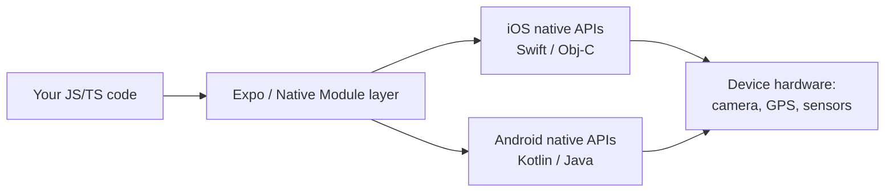
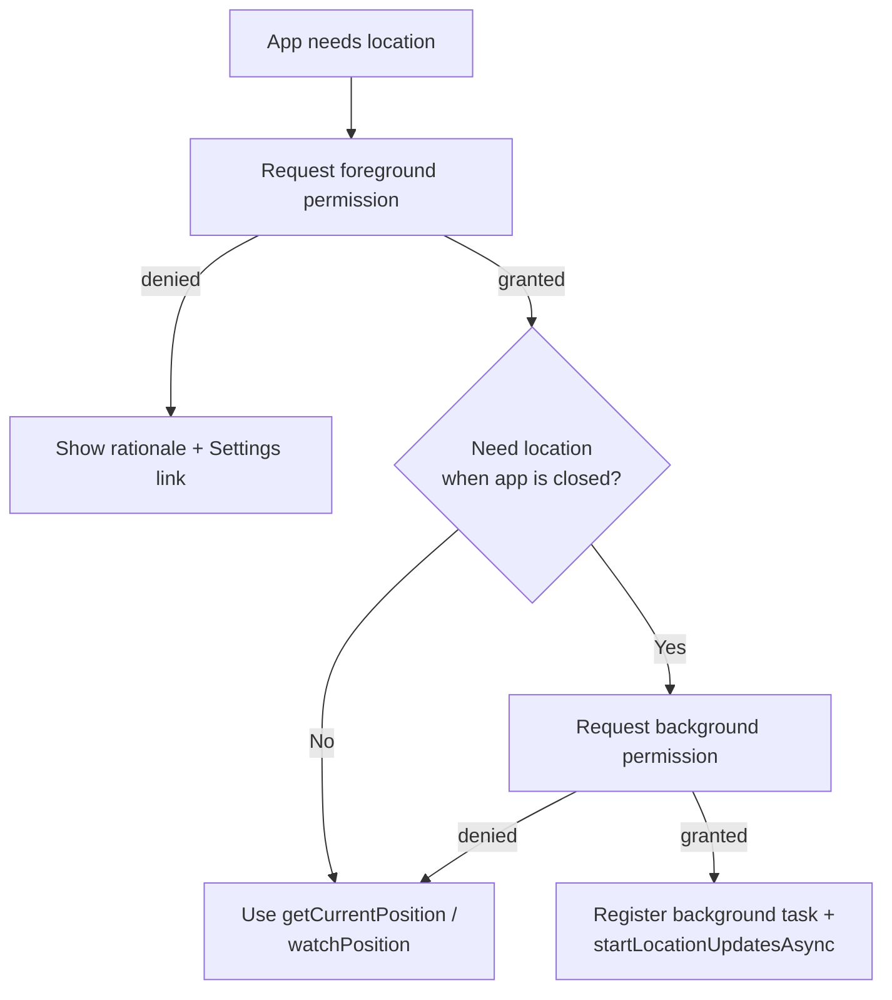
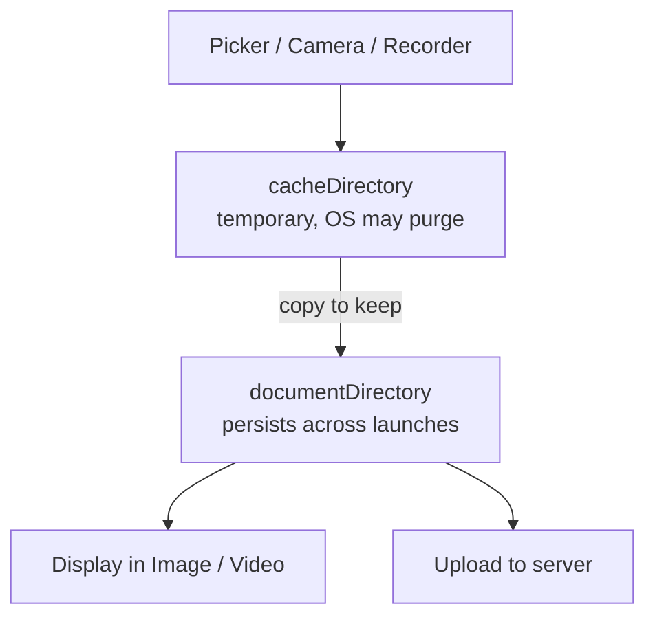
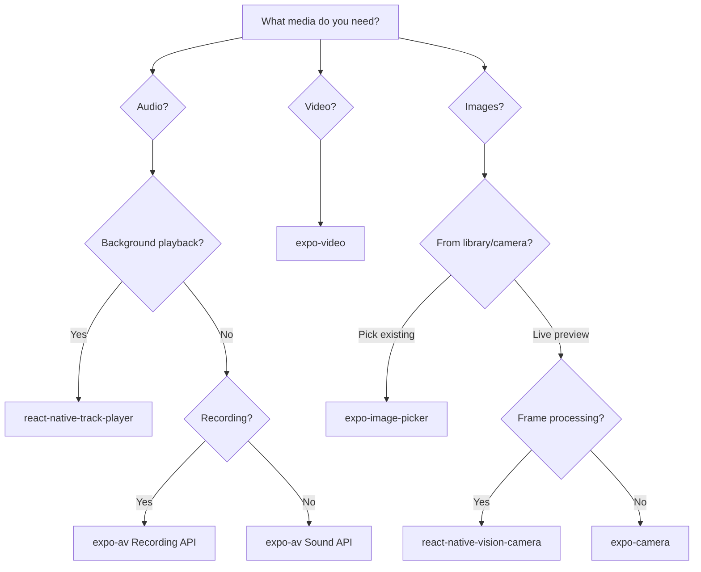
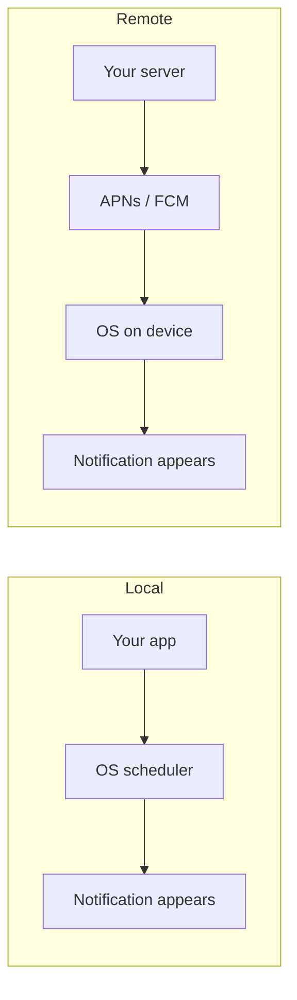
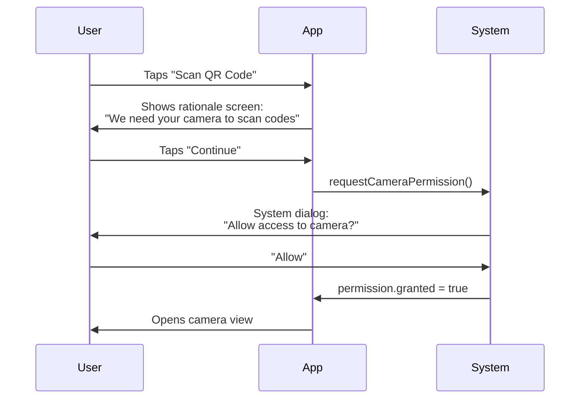
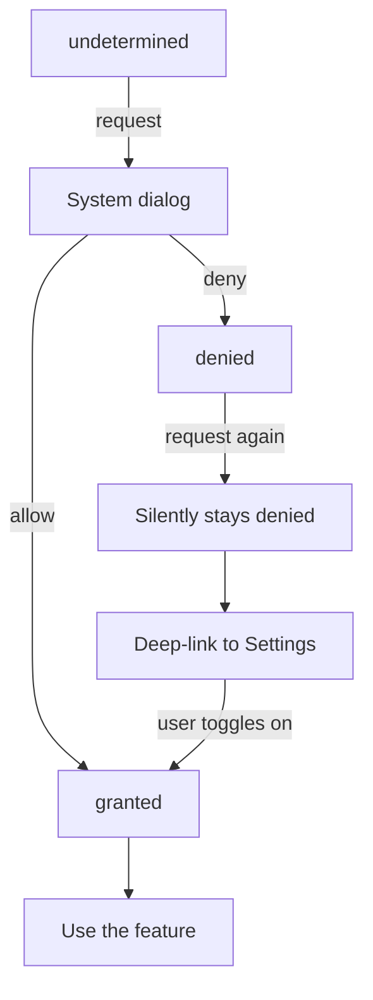

# API native del dispositivo: il salto dal web

> Camera, posizione, biometria, sensori e media — le capacità che rendono mobile le app mobile.

---

## Table of Contents
1. [Hardware and Sensors](#1-hardware-and-sensors)
2. [Media](#2-media)
3. [System APIs](#3-system-apis)
4. [Permissions Philosophy](#4-permissions-philosophy)

---

## 1. Hardware e sensori

Sul web, l'accesso all'hardware è un ripensamento. Potresti usare `navigator.geolocation` o lo sperimentale `DeviceMotionEvent`, ma combatti sempre contro API del browser confinate in una sandbox che sembrano aggiunte a forza — protette da HTTPS, limitate e supportate in modo incoerente nei vari browser. In React Native, l'hardware è *il punto centrale*. La tua app vive su un dispositivo pieno di sensori e gli utenti si aspettano che tu li usi.

### Perché l'accesso all'hardware nativo è diverso dal web?

Il cambio di mentalità è questo: sul web, il **browser** è un arbitro che si frappone tra il tuo codice e l'hardware. Espone una porzione minuscola, deliberatamente depotenziata, del dispositivo perché qualsiasi sito web casuale potrebbe essere ostile. Un'app nativa è diversa — l'utente *ha scelto* di installarla, l'OS sa esattamente di cosa si tratta (è firmata e confinata in una sandbox in base all'identità dell'app, non in base all'origine), e l'OS può quindi concedere capacità molto più potenti, protette da **richieste di permesso esplicite per ogni singola funzionalità** invece di un generico "questo sito vuole conoscere la tua posizione".

Quindi, invece di un singolo anemico namespace `navigator.*`, ottieni un intero ecosistema di moduli nativi. La maggior parte è esposta tramite i **pacchetti unificati di Expo** (`expo-camera`, `expo-location`, …), che incapsulano il disordinato codice Objective-C/Swift e Kotlin/Java specifico delle piattaforme dietro un'unica e pulita API JavaScript.



> **Modello mentale**: un modulo nativo è un traduttore. Tu parli JavaScript; la camera del dispositivo parla Swift o Kotlin. I pacchetti Expo sono traduttori pre-costruiti per l'hardware più comune, così raramente scrivi tu stesso codice nativo.

Passiamo in rassegna i principali.

### Camera

Per la maggior parte delle app, **expo-camera** ti offre un'anteprima live e la cattura base di foto/video con un setup minimo. Ma se stai costruendo qualcosa di livello produttivo — scansione di codici a barre, elaborazione dei frame, overlay di ML — affidati a **react-native-vision-camera**. È lo standard di riferimento.

```tsx
import { CameraView, useCameraPermissions } from 'expo-camera';
import { useState } from 'react';
import { Button, View, StyleSheet } from 'react-native';

export default function CameraScreen() {
  const [permission, requestPermission] = useCameraPermissions();
  const [facing, setFacing] = useState<'front' | 'back'>('back');

  if (!permission) return <View />; // permissions still loading

  if (!permission.granted) {
    return (
      <View style={styles.container}>
        <Button title="Grant Camera Access" onPress={requestPermission} />
      </View>
    );
  }

  return (
    <CameraView style={styles.camera} facing={facing}>
      <Button
        title="Flip"
        onPress={() => setFacing(f => (f === 'back' ? 'front' : 'back'))}
      />
    </CameraView>
  );
}

const styles = StyleSheet.create({
  container: { flex: 1, justifyContent: 'center' },
  camera: { flex: 1 },
});
```

Per catturare una foto vera e propria si usa una ref alla camera:

```tsx
import { CameraView } from 'expo-camera';
import { useRef } from 'react';

function Capture() {
  const cameraRef = useRef<CameraView>(null);

  const takePhoto = async () => {
    // Returns a local URI plus width/height and (optionally) base64
    const photo = await cameraRef.current?.takePictureAsync({ quality: 0.7 });
    console.log(photo?.uri); // file:///.../Camera/abc.jpg
  };

  return <CameraView ref={cameraRef} style={{ flex: 1 }} />;
}
```

**expo-camera vs react-native-vision-camera** — scegliere lo strumento giusto:

| Libreria | Punti di forza | Limitazioni | Quando usarla |
|---|---|---|---|
| **expo-camera** | Nessun setup nativo in Expo, foto/video semplici, scansione base di codici a barre | Nessun frame processor, meno controllo su formato/FPS | Foto profilo, acquisizione documenti, scansione occasionale |
| **react-native-vision-camera** | Frame processor (eseguono JS per ogni frame), overlay ML/QR/volti, controllo fine del formato | Setup più complesso, richiede una dev build (no Expo Go) | Scansione in tempo reale, AR, ML on-device, qualsiasi cosa critica per le performance |

> **Trabocchetto**: su Android, l'anteprima della camera può andare in crash se la monti prima che i permessi siano concessi. Proteggi sempre il `<CameraView>` dietro un controllo dei permessi.

> **Confronto con il web**: sul web useresti `navigator.mediaDevices.getUserMedia()` e indirizzeresti un `MediaStream` dentro un elemento `<video>`. In RN non c'è DOM — `<CameraView>` è una vista nativa, e catturi i frame tramite una ref, non un canvas.

### Posizione

**expo-location** gestisce sia il tracciamento in foreground che in background. Il foreground è semplice — richiedi il permesso, ottieni le coordinate. La posizione in background è dove diventa complicato: sia iOS che Android la limitano aggressivamente (per risparmiare batteria), e devi dichiarare un task in background registrato.

```tsx
import * as Location from 'expo-location';

// Foreground — simple one-shot
async function getPosition() {
  const { status } = await Location.requestForegroundPermissionsAsync();
  if (status !== 'granted') return null;

  return Location.getCurrentPositionAsync({
    accuracy: Location.Accuracy.High,
  });
}

// Foreground — continuous stream (like watchPosition on the web)
async function watch(onMove: (coords: Location.LocationObjectCoords) => void) {
  const sub = await Location.watchPositionAsync(
    { accuracy: Location.Accuracy.Balanced, distanceInterval: 10 },
    (loc) => onMove(loc.coords)
  );
  return sub; // call sub.remove() to stop
}

// Background — requires additional config in app.json
async function startBackgroundTracking() {
  const { status } = await Location.requestBackgroundPermissionsAsync();
  if (status !== 'granted') return;

  await Location.startLocationUpdatesAsync('BACKGROUND_LOCATION_TASK', {
    accuracy: Location.Accuracy.Balanced,
    distanceInterval: 50, // meters
    showsBackgroundLocationIndicator: true, // iOS blue bar
  });
}
```

Il permesso in foreground rispetto a quello in background è un flusso a **due fasi** sugli OS moderni — devi prima guadagnarti l'accesso in foreground, poi chiedere separatamente di essere promosso al background ("Consenti sempre"):



L'impostazione dell'accuratezza è un compromesso diretto tra **batteria e precisione** — un'accuratezza maggiore mantiene il chip GPS alimentato più a lungo:

| Livello di accuratezza | Circa | Costo in batteria | Uso tipico |
|---|---|---|---|
| `Lowest` / `Low` | ~1–3 km (cella/wifi) | Minimo | Meteo, rilevamento della regione |
| `Balanced` | ~100 m | Moderato | Luoghi vicini, geofencing |
| `High` | ~10 m | Alto | Mappe, indicazioni |
| `BestForNavigation` | Migliore possibile | Massimo | Navigazione passo-passo |

> **Confronto con il web**: `navigator.geolocation.watchPosition` ti fornisce aggiornamenti solo in foreground. Non esiste un equivalente web per la posizione in background — un sito web viene terminato nel momento in cui la sua scheda si chiude. Il tracciamento in background è puro territorio nativo, ed è esattamente il motivo per cui le app di ride-share e fitness devono essere native.

> **Consiglio da esperto**: la posizione in background è il permesso più scrutinato in assoluto nelle revisioni dell'App Store e del Play Store. Se la tua app chiede "Consenti sempre", devi mostrare una funzionalità concreta e continuativa (tracciamento live del tragitto, promemoria geolocalizzati). "Forse utile in seguito" viene rifiutato.

### Sensori di movimento

**expo-sensors** ti offre accelerometro, giroscopio, magnetometro, barometro e contapassi. Ciascuno segue lo stesso pattern di **iscrizione/disiscrizione** — aggiungi un listener che si attiva a intervalli, e *devi* rimuoverlo durante la pulizia, altrimenti continua a consumare la batteria in background.

Cosa misura effettivamente ciascun sensore:

| Sensore | Misura | Esempio d'uso |
|---|---|---|
| Accelerometro | Accelerazione lineare inclusa la gravità (x/y/z in g) | Scuoti-per-annullare, conteggio passi, inclinazione |
| Giroscopio | Velocità di rotazione attorno a ciascun asse | Visualizzatori di foto a 360°, giochi, stabilizzazione AR |
| Magnetometro | Campo magnetico → direzione della bussola | Bussola, orientamento mappa |
| Barometro | Pressione dell'aria → altitudine relativa | Piani saliti, dislivello in escursione |
| Contapassi | Conteggio passi calcolato dall'OS | Fitness tracker |

```tsx
import { Accelerometer } from 'expo-sensors';
import { useEffect, useState } from 'react';

export function useShakeDetection(threshold = 1.8) {
  const [shook, setShook] = useState(false);

  useEffect(() => {
    Accelerometer.setUpdateInterval(100); // ms between readings
    const sub = Accelerometer.addListener(({ x, y, z }) => {
      // Magnitude of the acceleration vector; ~1.0 at rest (gravity)
      const force = Math.sqrt(x * x + y * y + z * z);
      if (force > threshold) setShook(true);
    });
    return () => sub.remove(); // CRITICAL: stop the sensor on unmount
  }, [threshold]);

  return shook;
}
```

> **Trabocchetto**: dimenticare `sub.remove()` è il bug numero 1 dei sensori. Il listener sopravvive al componente, mantiene il sensore alimentato e consuma silenziosamente la batteria. Sul web l'analogia è dimenticare di fare `removeEventListener('devicemotion', …)` — stessa categoria di leak, conseguenze più gravi su un telefono.

> **Consiglio da esperto**: non impostare l'intervallo di aggiornamento più basso di quanto ti serve. `16ms` (~60fps) è ottimo per un gioco ma distrugge la batteria per un contapassi che ha bisogno solo di `1000ms`.

### Biometria

**expo-local-authentication** incapsula Face ID, Touch ID e Android BiometricPrompt dietro un'unica chiamata. Non memorizza segreti — conferma soltanto "questo è il proprietario del dispositivo". Per l'effettiva memorizzazione delle credenziali, abbinalo a **expo-secure-store** (che conserva i valori nel Keychain di iOS / Keystore di Android).

```tsx
import * as LocalAuthentication from 'expo-local-authentication';

async function authenticate() {
  // 1. Does the device even have biometric hardware?
  const hasHardware = await LocalAuthentication.hasHardwareAsync();
  if (!hasHardware) return false;

  // 2. Has the user enrolled a face/fingerprint?
  const isEnrolled = await LocalAuthentication.isEnrolledAsync();
  if (!isEnrolled) return false;

  // 3. Prompt
  const result = await LocalAuthentication.authenticateAsync({
    promptMessage: 'Confirm your identity',
    fallbackLabel: 'Use passcode', // shown if biometrics fail
  });

  return result.success;
}
```

Abbinare la biometria all'archiviazione sicura per proteggere un token salvato:

```tsx
import * as SecureStore from 'expo-secure-store';

// Save once, after login
await SecureStore.setItemAsync('authToken', token);

// Later: unlock with biometrics, THEN read the secret
async function getTokenIfVerified() {
  const ok = await authenticate();
  if (!ok) return null;
  return SecureStore.getItemAsync('authToken');
}
```

> **Trabocchetto**: la biometria dimostra la *presenza del proprietario del dispositivo*, non un'identità lato server. Non considerare mai un Face ID riuscito come "autenticato" di per sé — sblocca un token che hai già memorizzato; non autentica contro il tuo backend.

> **Confronto con il web**: l'analogo web più vicino è WebAuthn / passkey, potenti ma molto più complessi da configurare. In RN, la verifica biometrica è una singola chiamata `authenticateAsync()`.

### Haptics

Il feedback aptico è la differenza tra un'app che sembra nativa e una che sembra una web view. **expo-haptics** ti offre tre livelli di impatto: leggero, medio, pesante — più pattern di notifica (successo, avviso, errore).

```tsx
import * as Haptics from 'expo-haptics';

// On a successful action (a distinct "ta-da" pattern)
Haptics.notificationAsync(Haptics.NotificationFeedbackType.Success);

// On a button press (a single subtle tap)
Haptics.impactAsync(Haptics.ImpactFeedbackStyle.Light);

// On an error
Haptics.notificationAsync(Haptics.NotificationFeedbackType.Error);
```

| Chiamata | Sensazione | Da usare per |
|---|---|---|
| `impactAsync(Light)` | Tocco minimo | Interruttore toggle, selezione |
| `impactAsync(Medium/Heavy)` | Colpo più deciso | Pressione di un pulsante, aggancio di un drag |
| `notificationAsync(Success)` | Vibrazione positiva a due battiti | Pagamento completato, salvataggio riuscito |
| `notificationAsync(Warning/Error)` | Vibrazione di allerta secca | Azione fallita, input non valido |

> **Opinione**: aggiungi gli haptics a *ogni* conferma di azione distruttiva e a ogni interruttore toggle. È una sola riga di codice che migliora drasticamente la qualità percepita.

> **Trabocchetto**: gli haptics sono inattivi sulla maggior parte degli emulatori Android e sul Simulatore iOS — si attivano solo su hardware reale. Non dare per scontato che siano "rotti" perché non senti nulla nel simulatore.

---

## 2. Media

Gli sviluppatori web sono abituati a `<input type="file">` e al tag `<video>`. In React Native, i media sono più ricchi, più complessi e più capaci — e un tema ricorrente compare immediatamente: **i media vivono come file su disco, referenziati da una stringa `uri`**, non come elementi del DOM o `Blob` in memoria.

### Il modello mentale dell'URI

Quasi tutte le API media in RN ti restituiscono una stringa come `file:///var/mobile/.../IMG_0001.jpg`. Quell'URI è solo un puntatore a un file in una delle aree di archiviazione del dispositivo. Capire *quale* area conta, perché alcune sono temporanee e l'OS può eliminarle in qualsiasi momento:



> **Modello mentale**: sul web un file selezionato è un `File`/`Blob` che mantieni nella memoria JS. In RN è un *percorso a un file su disco*. Se ti serve dopo questa sessione, devi copiarlo tu stesso dalla cache temporanea a `documentDirectory`.

### Image Picker

**expo-image-picker** consente agli utenti di selezionare dalla loro libreria foto o di scattare una nuova foto. Restituisce un URI locale che puoi visualizzare o caricare.

```tsx
import * as ImagePicker from 'expo-image-picker';
import { Image, Button, View } from 'react-native';
import { useState } from 'react';

export function AvatarPicker() {
  const [uri, setUri] = useState<string | null>(null);

  const pick = async () => {
    const result = await ImagePicker.launchImageLibraryAsync({
      mediaTypes: ['images'],
      allowsEditing: true, // built-in crop UI
      aspect: [1, 1],      // square crop for an avatar
      quality: 0.8,        // 0–1 JPEG compression
    });

    if (!result.canceled) {
      setUri(result.assets[0].uri);
    }
  };

  return (
    <View>
      {uri && <Image source={{ uri }} style={{ width: 120, height: 120 }} />}
      <Button title="Choose Photo" onPress={pick} />
    </View>
  );
}
```

Per aprire la camera invece della libreria, sostituisci una sola chiamata:

```tsx
// Same shape of result, but launches the camera
const result = await ImagePicker.launchCameraAsync({ quality: 0.8 });
```

> **Trabocchetto**: l'URI restituito è temporaneo su iOS. Se devi renderlo persistente, copia il file nella document directory della tua app usando `expo-file-system` prima che l'OS lo recuperi.

> **Confronto con il web**: `launchImageLibraryAsync` è il cugino spirituale di `<input type="file" accept="image/*">`, ma ti offre anche un'interfaccia nativa di ritaglio/modifica e i dati EXIF gratuitamente — cose che sul web dovresti costruire a mano.

### Audio

Per la riproduzione semplice (effetti sonori, clip brevi), **expo-av** funziona bene. Per qualsiasi cosa somigli a un lettore musicale — riproduzione in background, controlli sulla schermata di blocco, gestione della coda — usa **react-native-track-player**. Non è una decisione difficile; `expo-av` non è mai stato progettato per l'audio in background.

```tsx
// Simple sound effect with expo-av
import { Audio } from 'expo-av';

async function playSound() {
  const { sound } = await Audio.Sound.createAsync(
    require('./assets/notification.mp3')
  );
  await sound.playAsync();
  // Don't forget cleanup — an unloaded sound leaks native memory
  sound.setOnPlaybackStatusUpdate((status) => {
    if (status.isLoaded && status.didJustFinish) {
      sound.unloadAsync();
    }
  });
}
```

> **Nota**: `expo-av` viene suddiviso in `expo-audio` e `expo-video` negli SDK più recenti. I concetti sono identici — un oggetto `Sound` che carichi, riproduci e devi scaricare — ma controlla la tua versione dell'SDK per l'import esatto.

| Libreria | Riproduzione in background | Controlli sulla schermata di blocco | Coda | Quando usarla |
|---|---|---|---|---|
| **expo-av / expo-audio** | No | No | No | Effetti sonori, clip brevi, feedback UI |
| **react-native-track-player** | Sì | Sì | Sì | Lettori di podcast/musica, audiolibri |

### Video

**expo-video** è il sostituto moderno del componente video in expo-av. Ti offre un lettore nativo con controlli, supporto per il picture-in-picture e capacità DRM.

```tsx
import { useVideoPlayer, VideoView } from 'expo-video';
import { StyleSheet } from 'react-native';

export function VideoScreen() {
  // The player is an imperative object you create once and reuse
  const player = useVideoPlayer(
    'https://example.com/video.mp4',
    (player) => {
      player.loop = true;
      player.play(); // autoplay
    }
  );

  return <VideoView style={styles.video} player={player} allowsPictureInPicture />;
}

const styles = StyleSheet.create({
  video: { width: '100%', aspectRatio: 16 / 9 },
});
```

> **Confronto con il web**: sul web `<video src="…" controls>` è completamente dichiarativo. In RN crei un **oggetto lettore** imperativo con `useVideoPlayer` e lo agganci a un `<VideoView>`. La separazione esiste perché un singolo lettore può pilotare contemporaneamente il picture-in-picture, i controlli sulla schermata di blocco e la vista sullo schermo.

### Registrazione audio

**expo-av** gestisce anche la registrazione. Il dettaglio chiave: devi configurare la modalità audio *prima* di iniziare a registrare, altrimenti iOS fallirà silenziosamente o produrrà un output distorto — iOS tratta "riproduzione" e "registrazione" come sessioni audio diverse e non lascerà entrare il microfono finché non lo chiedi.

```tsx
import { Audio } from 'expo-av';

async function startRecording() {
  await Audio.requestPermissionsAsync(); // microphone permission
  await Audio.setAudioModeAsync({
    allowsRecordingIOS: true,   // unlock the mic on iOS
    playsInSilentModeIOS: true, // record even if silent switch is on
  });

  const { recording } = await Audio.Recording.createAsync(
    Audio.RecordingOptionsPresets.HIGH_QUALITY
  );
  return recording;
}

async function stopRecording(recording: Audio.Recording) {
  await recording.stopAndUnloadAsync();
  const uri = recording.getURI(); // local file path (in cacheDirectory)
  return uri;
}
```

> **Trabocchetto**: la registrazione finisce nella directory cache temporanea. Secondo il modello mentale dell'URI visto sopra, copiala in `documentDirectory` (o caricala immediatamente) se ti serve in seguito.

Ecco una mappa decisionale per scegliere la libreria media giusta:



---

## 3. API di sistema

Qui è dove il mobile si discosta davvero dal web. Il browser ti offre cookie, localStorage e fetch. Un dispositivo mobile ti dà accesso all'intero sistema operativo — i contatti dell'utente, il suo calendario, gli appunti di sistema, il file system, il foglio di condivisione, la stampante. Ciascuno è un modulo nativo protetto dal proprio permesso.

### Contatti e calendario

**expo-contacts** e **expo-calendar** ti permettono di leggere e scrivere nella rubrica e nel calendario del dispositivo. Entrambi richiedono permessi espliciti, ed entrambi restituiscono dati strutturati e ricchi.

```tsx
import * as Contacts from 'expo-contacts';

async function getFirstContact() {
  const { status } = await Contacts.requestPermissionsAsync();
  if (status !== 'granted') return null;

  const { data } = await Contacts.getContactsAsync({
    // Only request the fields you need — fetching everything is slow
    fields: [Contacts.Fields.Emails, Contacts.Fields.PhoneNumbers],
    pageSize: 1,
  });

  return data[0];
}
```

Scrivere un evento nel calendario segue la stessa struttura "permesso-poi-agisci":

```tsx
import * as Calendar from 'expo-calendar';

async function addEvent(calendarId: string) {
  const { status } = await Calendar.requestCalendarPermissionsAsync();
  if (status !== 'granted') return;

  await Calendar.createEventAsync(calendarId, {
    title: 'Dentist',
    startDate: new Date('2026-07-01T09:00:00'),
    endDate: new Date('2026-07-01T09:30:00'),
    timeZone: 'Europe/Paris',
  });
}
```

> **Consiglio da esperto**: richiedi solo i `fields` dei contatti che usi effettivamente. Estrarre ogni campo per una rubrica di 5.000 contatti è notevolmente lento e segnala ai revisori attenti alla privacy che stai eccedendo.

### Notifiche

Le notifiche push sono la funzionalità decisiva del mobile. **expo-notifications** gestisce sia le notifiche **locali** (programmate dall'app, senza bisogno di server) sia quelle **remote** (inviate dal tuo server). Il setup è semplice per quelle locali, ma le notifiche remote richiedono la configurazione di FCM (Android) e APNs (iOS).

```tsx
import * as Notifications from 'expo-notifications';

// Schedule a local notification — fires entirely on-device
async function scheduleReminder() {
  await Notifications.requestPermissionsAsync();
  await Notifications.scheduleNotificationAsync({
    content: {
      title: 'Time to stretch',
      body: "You've been coding for 2 hours.",
    },
    trigger: {
      type: Notifications.SchedulableTriggerInputTypes.TIME_INTERVAL,
      seconds: 7200,
    },
  });
}
```

La differenza tra locale e remoto è *chi decide quando si attiva*:



| Tipo | Sorgente del trigger | Serve un server? | Serve il setup APNs/FCM? | Esempio |
|---|---|---|---|---|
| **Locale** | L'app, sul dispositivo | No | No | "Promemoria per lo stretching tra 2h" |
| **Remota (push)** | Il tuo backend | Sì | Sì | "Hai un nuovo messaggio" |

> **Confronto con il web**: la Web Push API esiste, ma l'adozione è discontinua e la UX è ostile (i browser scoraggiano attivamente le richieste di notifica, e Safari su iOS l'ha aggiunta solo di recente e con riluttanza). Sul mobile, le notifiche sono cittadine di prima classe e un canale primario di re-engagement.

### Appunti, file system e condivisione

Queste sono singole righe di codice, ma contano:

```tsx
// Clipboard
import * as Clipboard from 'expo-clipboard';
await Clipboard.setStringAsync('Copied text');
const text = await Clipboard.getStringAsync();

// File System
import * as FileSystem from 'expo-file-system';
const content = await FileSystem.readAsStringAsync(fileUri);
await FileSystem.writeAsStringAsync(
  FileSystem.documentDirectory + 'data.json',
  JSON.stringify(myData)
);
// Copy a temporary picked file somewhere permanent
await FileSystem.copyAsync({
  from: tempUri,
  to: FileSystem.documentDirectory + 'avatar.jpg',
});

// Sharing — opens the native share sheet
import * as Sharing from 'expo-sharing';
await Sharing.shareAsync(fileUri, {
  mimeType: 'application/pdf',
  dialogTitle: 'Share report',
});
```

> **Confronto con il web**: `expo-clipboard` rispecchia `navigator.clipboard`, e `Sharing.shareAsync` è il cugino nativo della Web Share API (`navigator.share`) — solo che sul mobile è universalmente supportato e mostra l'intero foglio di condivisione dell'OS (AirDrop, Messaggi, ogni app installata).

### Document Picker e stampa

**expo-document-picker** è l'equivalente mobile di `<input type="file">`, ed **expo-print** ti permette di generare PDF e inviarli a una stampante o salvarli come file.

```tsx
import * as DocumentPicker from 'expo-document-picker';
import * as Print from 'expo-print';

// Pick a document — copyToCacheDirectory makes the URI readable by your app
const result = await DocumentPicker.getDocumentAsync({
  type: 'application/pdf',
  copyToCacheDirectory: true,
});

// Generate and print a PDF from HTML
await Print.printAsync({
  html: '<h1>Invoice #1234</h1><p>Total: $99.00</p>',
});

// Or render the HTML to a PDF file you can share/upload
const { uri } = await Print.printToFileAsync({
  html: '<h1>Invoice #1234</h1><p>Total: $99.00</p>',
});
```

> **Errore comune**: dare per scontato che gli URI dei file siano stabili. Su entrambe le piattaforme, i file selezionati tramite document picker o image picker possono vivere in directory temporanee. Copiali sempre in `FileSystem.documentDirectory` se ti servono oltre la sessione corrente.

---

## 4. Filosofia dei permessi

Questa è la sezione che la maggior parte dei tutorial salta, ed è quella che fa rifiutare le app dall'App Store. I permessi non sono un ostacolo tecnico da superare — sono una **conversazione** con l'utente, e il modo in cui imposti quella conversazione determina se diranno di sì.

### Perché i permessi sono un problema di UX, non un problema di codice

Ecco il meccanismo che rende tutto questo così importante: **l'OS ti concede esattamente una sola buona occasione.** Quando chiami `requestPermission()`, il sistema mostra la sua finestra di dialogo — un testo che puoi a malapena personalizzare, due pulsanti. Se l'utente tocca "Nega", quella risposta è *persistente*. Su iOS, chiamare di nuovo la richiesta non fa nulla; la finestra non riappare mai più. Su Android, hai una seconda possibilità, poi "Non chiedere più" la blocca. Non esiste un "chiedimelo più tardi" che riproponga davvero la richiesta. Quindi ogni richiesta sprecata è un permesso che potresti aver perso per sempre — e il tuo unico percorso di recupero è implorare l'utente di scavare tra le Impostazioni.

Quell'asimmetria è il motivo per cui timing e formulazione dominano. Non stai scrivendo un controllo `if`; stai spendendo una risorsa irripetibile.

### La Regola d'Oro: just-in-time

Non richiedere mai i permessi all'avvio. Mai. Nemmeno se ne "hai bisogno". L'utente ha appena aperto la tua app per la prima volta — non ha alcun contesto per capire perché vuoi la sua camera, la sua posizione e i suoi contatti. Il tasso di rifiuto per le richieste di permesso anticipate supera il 50%.

Invece, richiedi i permessi nel *momento dell'intenzione*. L'utente tocca il pulsante della camera? Ora chiedi l'accesso alla camera. Apre la scheda della mappa? Ora chiedi la posizione. Il contesto rende la richiesta auto-esplicativa.



> **Confronto con il web**: i browser hanno imparato questa lezione nel modo più duro — i siti che richiedono notifiche/posizione al caricamento vengono bloccati automaticamente da Chrome e hanno abituato gli utenti a negare per riflesso. Gli store mobile applicano la stessa etichetta, solo che qui una richiesta mal fatta può far rifiutare la tua intera app.

### La schermata di motivazione

Sia iOS che Android ti concedono esattamente una sola occasione con la finestra di dialogo di sistema dei permessi (beh, Android ne concede due prima che scatti "Non chiedere più"). Ecco perché mostri prima una *schermata di motivazione* — un'interfaccia personalizzata **che controlli completamente** che spiega perché ti serve il permesso, con una chiara dichiarazione del beneficio, *prima* di far scattare l'irreversibile richiesta di sistema.

```tsx
import { Alert } from 'react-native';
import * as Location from 'expo-location';

async function requestLocationWithRationale() {
  const { status: existing } = await Location.getForegroundPermissionsAsync();

  if (existing === 'granted') return true;

  // Show YOUR rationale before the system's one-shot prompt
  const userAccepted = await new Promise<boolean>((resolve) => {
    Alert.alert(
      'Location Access',
      'We use your location to show nearby restaurants. Your location is never shared or stored on our servers.',
      [
        { text: 'Not Now', onPress: () => resolve(false) },
        { text: 'Enable', onPress: () => resolve(true) },
      ]
    );
  });

  if (!userAccepted) return false;

  const { status } = await Location.requestForegroundPermissionsAsync();
  return status === 'granted';
}
```

> **Consiglio da esperto**: la schermata di motivazione protegge anche la tua "unica occasione". Se l'utente tocca "Non ora" sulla *tua* schermata, non fai mai scattare la richiesta di sistema — così resta disponibile per dopo, quando sarà più motivato. Spendi la richiesta reale solo sugli utenti che hanno già detto "sì" alla richiesta soft.

### Gestire "Non chiedere più"

Una volta che un utente seleziona "Non chiedere più" (Android) o nega su iOS, chiamare `requestPermissionsAsync()` restituirà silenziosamente `denied` senza mostrare alcuna finestra di dialogo. La tua unica opzione è creare un deep link alla pagina delle impostazioni dell'app così che possa attivarlo manualmente.

```tsx
import { Linking, Platform } from 'react-native';
import { View, Text, Button, StyleSheet } from 'react-native';

function openAppSettings() {
  if (Platform.OS === 'ios') {
    Linking.openURL('app-settings:'); // jumps straight to your app's settings
  } else {
    Linking.openSettings();
  }
}

// Use it in your denied state
function PermissionDeniedBanner() {
  return (
    <View style={styles.banner}>
      <Text>Camera access was denied.</Text>
      <Button title="Open Settings" onPress={openAppSettings} />
    </View>
  );
}

const styles = StyleSheet.create({
  banner: { padding: 16 },
});
```

L'intero ciclo di vita di un permesso, incluso il vicolo cieco per cui devi progettare:



> **Trappola del rifiuto dell'App Store**: se richiedi un permesso che la tua app non usa visibilmente, Apple ti rifiuterà. Ogni chiave `NSUsageDescription` nel tuo `Info.plist` deve corrispondere a una funzionalità che il revisore può attivare durante la revisione. Questo significa che la tua stringa di permesso per la camera dovrebbe portare a una vera schermata della camera, non a un segnaposto "in arrivo".

### Stati dei permessi da gestire

Ogni richiesta di permesso può restituire uno di questi stati. Gestiscili tutti:

| Stato | Significato | La tua azione |
|---|---|---|
| `undetermined` | Mai chiesto | Mostra la motivazione, poi richiedi |
| `granted` | L'utente ha detto sì | Procedi con la funzionalità |
| `denied` | L'utente ha detto no | Mostra la spiegazione + link "Apri Impostazioni" |
| `limited` (iOS) | Accesso parziale (es. solo foto selezionate) | Lavora con ciò che hai |

> **Trabocchetto**: non dimenticare `limited`. Su iOS moderno, un utente può concedere l'accesso ad *alcune* foto invece che all'intera libreria. Il codice che controlla solo `granted` tratterà questo come un fallimento e si romperà per un utente perfettamente soddisfatto.

La disciplina qui è semplice: tratta i permessi come una funzionalità di UX, non come una casella tecnica da spuntare. Una richiesta di permesso ben temporizzata e ben spiegata converte all'85%+. Una pigra raffica anticipata di richieste al primo avvio converte sotto il 40% e abitua gli utenti a negare tutto per riflesso.

---