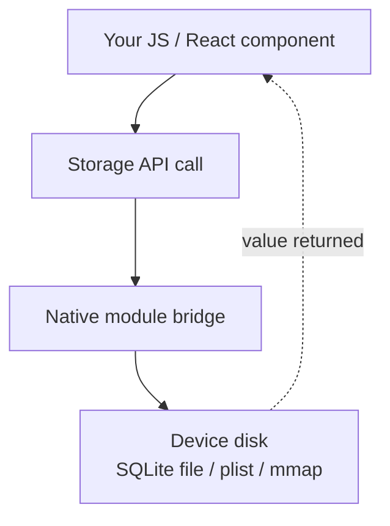
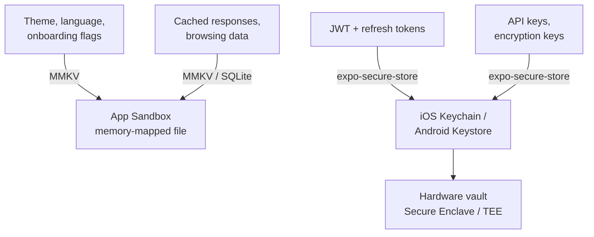
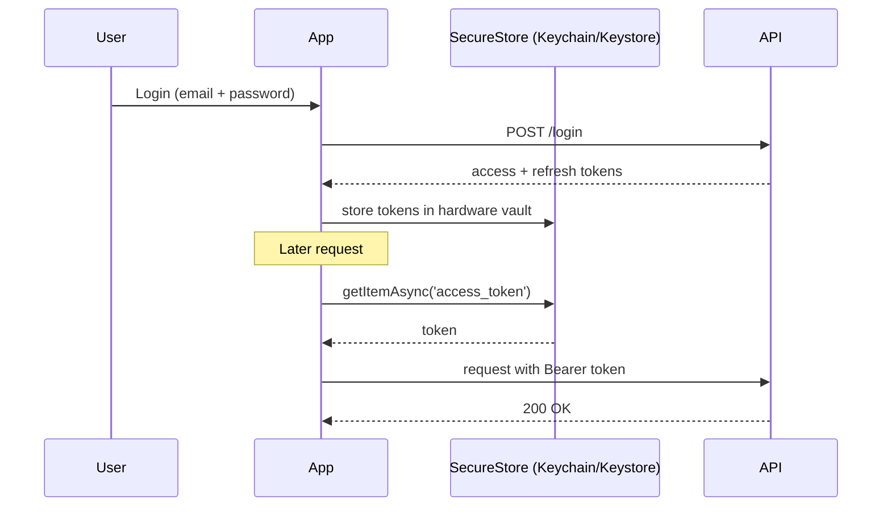
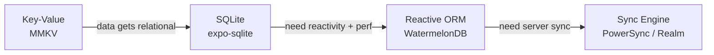
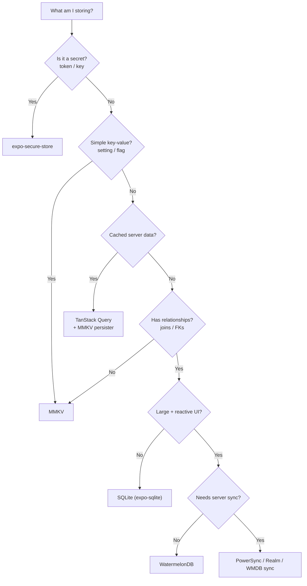

# Storage e Persistenza: Mantenere i Dati sul Dispositivo

> Store key-value, vault sicuri, database relazionali e quando usare ciascuno.

---

## Table of Contents
1. [Key-Value Storage](#1-key-value-storage)
2. [Secure Storage](#2-secure-storage)
3. [Relational and Document Storage](#3-relational-and-document-storage)
4. [When to Use What](#4-when-to-use-what)

---

## 1. Storage Key-Value

Sul web hai `localStorage` — sincrono, solo stringhe, all'incirca 5 MB e di una semplicità assoluta. Chiami `localStorage.getItem('key')` e il valore è *lì*, senza attese. React Native non ha `localStorage`. Non c'è alcun browser, nessun `window`, nessun DOM e quindi nessuna Web Storage API. Il tuo JavaScript viene eseguito all'interno di un'app nativa e l'unico modo per toccare il disco è attraverso un **native module** — un ponte verso il codice di piattaforma (Objective-C/Swift su iOS, Java/Kotlin su Android). Hai quindi bisogno di un sostituto nativo, e l'ecosistema ti offre due opzioni concrete: **AsyncStorage** e **MMKV**.

### Perché "key-value" prima di tutto?

Pensa allo storage key-value come a un unico dizionario a livello di intera app che sopravvive ai riavvii — una `Map<string, value>` scritta su disco. È la persistenza più semplice possibile: nessuno schema, nessuna tabella, nessuna query. Metti qualcosa sotto un nome e lo recuperi con quel nome. Questo è perfetto per dati piccoli e piatti: "qual è il tema dell'utente?", "ha completato l'onboarding?", "quante volte ha aperto l'app?". Nel momento in cui i tuoi dati sviluppano relazioni (task che appartengono a progetti che appartengono a utenti), lo storage key-value smette di andare bene — ma quello è il problema della sezione 3.



### AsyncStorage: Il Vecchio Default

`@react-native-async-storage/async-storage` è il successore spirituale del vecchio `AsyncStorage` core che veniva distribuito con React Native prima di essere estratto in un pacchetto della community. Funziona, è stabile ed è ovunque nei tutorial. Ma dovresti sapere a cosa stai andando incontro.

Serializza tutto in stringhe JSON e le scrive in una tabella SQLite su Android o in un file basato su plist su iOS. Ogni operazione è **asincrona**, il che significa che ogni lettura è una promise di cui devi fare `await`. Perché async? Perché la vecchia architettura di React Native comunicava con il codice nativo attraverso un "bridge" asincrono — JS e nativo giravano su thread separati e si scambiavano messaggi avanti e indietro, quindi nulla di nativo poteva essere letto istantaneamente. Per una preferenza di tema o un'impostazione della lingua, questa tassa asincrona crea un **flash dello stato di default** all'avvio dell'app: il tuo componente viene montato con il valore di default, *poi* il valore memorizzato arriva qualche millisecondo dopo e la UI scatta verso di esso. Passerai tempo reale a mascherare quello sfarfallio.

```tsx
import AsyncStorage from '@react-native-async-storage/async-storage';

// Write — returns a Promise, must await
await AsyncStorage.setItem('user_language', 'fr');

// Read — always a Promise, value is string | null
const lang = await AsyncStorage.getItem('user_language');

// Store objects — you serialize manually, there is no "setObject"
await AsyncStorage.setItem('preferences', JSON.stringify({ theme: 'dark', fontSize: 16 }));
const prefs = JSON.parse((await AsyncStorage.getItem('preferences')) ?? '{}');

// Batch operations (one round-trip instead of N)
await AsyncStorage.multiSet([
  ['onboarded', 'true'],
  ['last_sync', new Date().toISOString()],
]);

// Read many keys at once
const pairs = await AsyncStorage.multiGet(['onboarded', 'last_sync']);
// pairs = [['onboarded', 'true'], ['last_sync', '2026-06-19T...']]
```

Nota l'attrito: tutto è una stringa, quindi booleani e numeri devono essere convertiti in stringa (`'true'`, non `true`) e poi riconvertiti. Funziona. Ma è lento — i benchmark mostrano 5-10 ms per lettura sui dispositivi moderni — e il pattern async-ovunque trapela in ogni componente che vi legge, costringendoti a balletti di `useEffect` + `useState` solo per visualizzare un'impostazione salvata.

> **Confronto con il web**: `localStorage.getItem()` è sincrono e restituisce immediatamente. `AsyncStorage.getItem()` restituisce una Promise. Se porti mentalmente il codice web 1:1, ogni lettura di storage richiede improvvisamente un `await` — e qualsiasi percorso di codice che non era già async deve diventare async. Quell'effetto a catena sorprende i principianti.

### MMKV: Il Default del 2026

**react-native-mmkv** fa da wrapper alla libreria MMKV di Tencent — uno store key-value memory-mapped originariamente costruito per WeChat per gestire miliardi di letture. "Memory-mapped" (`mmap`) è il trucco: il sistema operativo mappa il file di storage direttamente nello spazio di indirizzamento della memoria dell'app, così leggere un valore equivale essenzialmente a leggere la RAM. Non c'è alcun round-trip async attraverso il bridge, nessuna tassa di parsing JSON per i primitivi — il valore è già in memoria. Le differenze sono significative:

| | AsyncStorage | MMKV |
|---|---|---|
| **Velocità** | ~5-10 ms/lettura | ~0.01 ms/lettura (memory-mapped) |
| **API** | Async (Promises) | **Sincrona** |
| **Tipi** | Solo stringhe (JSON.stringify) | String, number, boolean, Buffer |
| **Crittografia** | No | AES-128, AES-256 |
| **Limite di dimensione** | ~6 MB default Android | Limitato dal disco |
| **Multi-processo** | No | Sì (es. condivisione con un widget) |
| **Funziona in Expo Go** | Sì | No (richiede un dev build) |

L'API sincrona è la funzionalità decisiva. Nessun `await`, nessuno sfarfallio, nessuna ginnastica con `useEffect` al mount. Leggi un valore e ce l'hai, lì nel percorso di render — esattamente come `localStorage` sul web, ma più veloce.

```tsx
import { MMKV } from 'react-native-mmkv';

// Create a default instance (usually one shared module-level instance)
const storage = new MMKV();

// Write — synchronous, no await, typed
storage.set('user_language', 'fr');
storage.set('onboarded', true);     // real boolean, not 'true'
storage.set('launch_count', 42);    // real number

// Read — synchronous, typed getters (undefined if missing)
const lang: string | undefined = storage.getString('user_language');
const onboarded: boolean = storage.getBoolean('onboarded') ?? false;
const count: number = storage.getNumber('launch_count') ?? 0;

// Existence + cleanup
if (storage.contains('user_language')) {
  storage.delete('user_language');
}

// List all keys (handy for debugging / migrations)
const keys = storage.getAllKeys();

// Encrypted instance for semi-sensitive (but NOT secret) data
const encrypted = new MMKV({
  id: 'encrypted-storage',
  encryptionKey: 'my-encryption-key',
});
```

Puoi anche creare più istanze con nome per tenere separati i domini di dati — per esempio un'istanza per utente, oppure un'istanza di cache usa-e-getta che puoi azzerare con una sola chiamata:

```tsx
const userCache = new MMKV({ id: `user-${userId}-cache` });
userCache.clearAll(); // nuke everything in just this instance
```

Per integrare MMKV con lo state di React, usa gli hooks integrati `useMMKVString`, `useMMKVBoolean` e `useMMKVNumber`. Si sottoscrivono a una key e ri-renderizzano il componente ogni volta che quella key cambia — ovunque nell'app — offrendoti gratuitamente un piccolo store reattivo:

```tsx
import { useMMKVString } from 'react-native-mmkv';

function LanguagePicker() {
  // Behaves like useState, but the value is persisted and shared app-wide.
  const [language, setLanguage] = useMMKVString('user_language');

  return (
    <Picker
      selectedValue={language ?? 'en'}
      onValueChange={(val) => setLanguage(val)}
    >
      <Picker.Item label="English" value="en" />
      <Picker.Item label="French" value="fr" />
    </Picker>
  );
}
```

Puoi anche abbinare MMKV al middleware `persist` di Zustand per supportare un intero store globale con storage sincrono e persistente:

```tsx
import { create } from 'zustand';
import { persist, createJSONStorage } from 'zustand/middleware';
import { MMKV } from 'react-native-mmkv';

const storage = new MMKV();

export const useSettings = create(
  persist(
    (set) => ({ theme: 'light', setTheme: (t: string) => set({ theme: t }) }),
    {
      name: 'settings',
      storage: createJSONStorage(() => ({
        getItem: (k) => storage.getString(k) ?? null,
        setItem: (k, v) => storage.set(k, v),
        removeItem: (k) => storage.delete(k),
      })),
    },
  ),
);
```

> **Trappola**: MMKV richiede native modules — non funzionerà in **Expo Go** (l'app sandbox precompilata). Hai bisogno di un **development build** (`npx expo prebuild` e poi esecuzione, oppure usa EAS Build). Questo è un non-problema in produzione, ma manda in confusione i principianti che prototipano in Expo Go e incappano in un criptico errore "MMKV native module not found".

> **Trappola**: MMKV è sincrono, il che è meraviglioso — ma un valore scritto sotto una key con un *tipo* e riletto con un getter diverso restituisce `undefined`, non un errore lanciato. `storage.set('count', 42)` seguito da `storage.getString('count')` dà `undefined`. Scegli un tipo coerente per ogni key.

> **Opinione**: A meno che tu non stia mantenendo una codebase legacy già su AsyncStorage, parti con MMKV. La sola API sincrona giustifica il passaggio. AsyncStorage non è deprecato, ma è il `var` dello storage di React Native — funziona, ma nessuno lo sceglie per nuovi progetti.

---

## 2. Storage Sicuro

Ecco una regola che viene infranta di continuo: **non memorizzare mai token di autenticazione, API key o segreti in AsyncStorage o in MMKV non crittografato**. Perché conta così tanto? Perché lo storage key-value normale vive all'interno della sandbox della tua app come file ordinari. AsyncStorage su Android è un semplice database SQLite che chiunque abbia un telefono rooted (o un dispositivo rubato e sbloccato, o un campione di malware) può aprire e leggere in chiaro. MMKV con una `encryptionKey` è meglio, ma è comunque crittografia **a livello di app** — la chiave deve risiedere da qualche parte raggiungibile dal tuo JS, il che di solito significa incorporata nel tuo bundle. Chiunque possa leggere il tuo bundle può leggere la chiave, e chiunque abbia la chiave può decifrare i dati. È una serratura con la chiave attaccata alla porta con il nastro adesivo.

Lo storage davvero sicuro significa usare lo storage sicuro **hardware-backed** della piattaforma. Invece che la tua app detenga una chiave di crittografia, è il *sistema operativo* a custodirla all'interno di hardware di sicurezza dedicato che l'app — e perfino lo stesso OS — non può estrarre direttamente:

- **iOS**: **Keychain Services** — crittografato a livello di OS, protetto dal passcode del dispositivo e dalla **Secure Enclave**, un chip di sicurezza separato. Gli elementi possono essere configurati per richiedere Face ID / Touch ID o lo sblocco del dispositivo prima di essere rilasciati.
- **Android**: **Android Keystore** — le chiavi sono generate e usate all'interno del **TEE (Trusted Execution Environment)** o di un chip di sicurezza dedicato. Il materiale della chiave *non lascia mai* l'hardware sicuro; la tua app chiede all'hardware di crittografare/decrittografare per suo conto.

Il modello mentale: con MMKV detieni la cassaforte *e* la combinazione. Con lo storage sicuro, consegni i tuoi beni preziosi all'OS che li chiude in un caveau che non puoi scassinare — puoi solo chiedergli di aprire il caveau, e solo dopo che il dispositivo ha dimostrato che sei davvero tu.



### expo-secure-store

Il percorso più semplice verso lo storage sicuro di piattaforma nell'ecosistema Expo. Fa da wrapper al **Keychain** su iOS e a **EncryptedSharedPreferences** (supportato da Android Keystore) su Android, dietro un'unica minuscola API async. Non pensi a enclave o TEE — chiami semplicemente set/get/delete e l'OS fa la parte difficile.

```tsx
import * as SecureStore from 'expo-secure-store';

// Store tokens after login
async function saveTokens(access: string, refresh: string) {
  await SecureStore.setItemAsync('access_token', access);
  await SecureStore.setItemAsync('refresh_token', refresh);
}

// Retrieve on app launch
async function getAccessToken(): Promise<string | null> {
  return SecureStore.getItemAsync('access_token');
}

// Clear on logout
async function clearAuth() {
  await SecureStore.deleteItemAsync('access_token');
  await SecureStore.deleteItemAsync('refresh_token');
}
```

Puoi anche subordinare l'accesso alla biometria, così il token viene rilasciato solo dopo un controllo Face ID / impronta digitale — ideale per i flussi "sblocca per visualizzare":

```tsx
// Require biometric / passcode auth at read time
await SecureStore.setItemAsync('access_token', access, {
  requireAuthentication: true,            // prompt on read
  keychainAccessible: SecureStore.WHEN_UNLOCKED, // only available while device unlocked
});
```

Un pattern completo di gestione dei token di autenticazione combina lo storage sicuro con un interceptor di Axios, così ogni richiesta porta automaticamente il token e un `401` lo aggiorna automaticamente:

```tsx
import axios from 'axios';
import * as SecureStore from 'expo-secure-store';

const api = axios.create({ baseURL: 'https://api.example.com' });

// Attach token to every outgoing request
api.interceptors.request.use(async (config) => {
  const token = await SecureStore.getItemAsync('access_token');
  if (token) {
    config.headers.Authorization = `Bearer ${token}`;
  }
  return config;
});

// On 401, refresh once and replay the original request
api.interceptors.response.use(
  (response) => response,
  async (error) => {
    if (error.response?.status === 401) {
      const refresh = await SecureStore.getItemAsync('refresh_token');
      if (!refresh) throw error;

      const { data } = await axios.post('https://api.example.com/refresh', {
        refresh_token: refresh,
      });

      await SecureStore.setItemAsync('access_token', data.access_token);
      error.config.headers.Authorization = `Bearer ${data.access_token}`;
      return api.request(error.config); // retry with fresh token
    }
    throw error;
  },
);
```

Il ciclo di vita del token dal login alla richiesta ha questo aspetto:



> **Confronto con il web**: Il web non ha un vero equivalente. I browser usano i **cookie httpOnly** per lo storage dei token proprio perché JavaScript *non può* leggerli — il browser li allega automaticamente e un attacco XSS non può rubarli. In React Native non ci sono cookie né browser, quindi sei tu a possedere il ciclo di vita del token: memorizzarlo, allegarlo, aggiornarlo, cancellarlo. È più lavoro, ma anche più controllo.

> **Trappola**: `expo-secure-store` ha un **limite di valore di 2048 byte** su alcune versioni di Android. Un normale JWT ci sta facilmente, ma alcuni identity provider impacchettano i claim in modo aggressivo e lo superano. Testa con i tuoi token *reali*, non con una stringa giocattolo. Se lo superi, memorizza un riferimento e tieni il grosso altrove — oppure suddividi il valore.

> **Trappola**: Lo storage sicuro è **solo async** (non esiste una lettura sincrona — la chiamata all'hardware richiede tempo). Non puoi quindi sapere al primo frame dell'avvio se l'utente è loggato. Prevedi una breve schermata splash/loading "verifica autenticazione…" mentre fai `await getItemAsync`. Questo è normale e atteso nelle app di produzione, non un bug da aggirare in fase di progettazione.

> **Nota su bare RN**: Al di fuori di Expo, la libreria equivalente è **react-native-keychain**, che espone le stesse primitive di Keychain/Keystore con più manopole di controllo (access group, prompt biometrici, livelli di accessibilità).

---

## 3. Storage Relazionale e a Documenti

Gli store key-value sbattono contro un muro quando i tuoi dati hanno **relazioni**. Un'app di gestione task con progetti, task, subtask, tag e collaboratori non entra in `storage.set('tasks', JSON.stringify(tasks))`. Perché no? Perché nel momento in cui poni domande come "dammi tutti i task incompleti nel progetto X, ordinati per data di scadenza, con tag 'urgente'", un blob JSON piatto ti costringe a caricare *tutto* in memoria e a filtrarlo a mano a ogni query. Questo è lento, affamato di memoria e impossibile da fare in modo efficiente man mano che i dati crescono. Hai bisogno di un vero database — qualcosa che possa **indicizzare**, **interrogare** e **fare join** dei dati su disco senza caricarli tutti.



### SQLite: Le Fondamenta

SQLite è il database più diffuso al mondo — è dentro il tuo browser, il tuo telefono, la tua auto e probabilmente il tuo frigorifero. È **già su ogni dispositivo iOS e Android**. Non stai installando un server di database; stai semplicemente aprendo una connessione a un singolo file che *è* il database. Se conosci SQL dal mondo web/backend, sai già come usarlo.

**expo-sqlite** (Expo SDK 52+) fornisce una moderna API async con prepared statement e transazioni. Per bare RN, **op-sqlite** (o il più vecchio **react-native-quick-sqlite**) offre binding C++ sincroni tramite **JSI** (la moderna interfaccia JS-to-native che sostituisce il vecchio bridge async) per la massima performance.

```tsx
import * as SQLite from 'expo-sqlite';

// Open or create a database file in the app's sandbox
const db = await SQLite.openDatabaseAsync('myapp.db');

// Create tables — note the foreign key linking tasks -> projects
await db.execAsync(`
  PRAGMA foreign_keys = ON;

  CREATE TABLE IF NOT EXISTS projects (
    id TEXT PRIMARY KEY,
    name TEXT NOT NULL,
    created_at INTEGER DEFAULT (unixepoch())
  );

  CREATE TABLE IF NOT EXISTS tasks (
    id TEXT PRIMARY KEY,
    project_id TEXT REFERENCES projects(id),
    title TEXT NOT NULL,
    completed INTEGER DEFAULT 0,   -- SQLite has no boolean; 0/1
    position INTEGER DEFAULT 0
  );

  -- Index the column we filter/sort by, so queries stay fast
  CREATE INDEX IF NOT EXISTS idx_tasks_project ON tasks(project_id);
`);

// Insert with a parameterized query — the ? placeholders prevent SQL injection
await db.runAsync(
  'INSERT INTO tasks (id, project_id, title) VALUES (?, ?, ?)',
  [crypto.randomUUID(), projectId, 'Buy groceries']
);

// Query with a typed result — SQLite does the filtering/sorting on disk
const incompleteTasks = await db.getAllAsync<{
  id: string;
  title: string;
  completed: number;
}>(
  'SELECT * FROM tasks WHERE project_id = ? AND completed = 0 ORDER BY position',
  [projectId]
);

// A JOIN — the thing key-value storage simply can't do
const withProject = await db.getAllAsync(
  `SELECT t.title, p.name AS project
   FROM tasks t
   JOIN projects p ON p.id = t.project_id
   WHERE t.completed = 0`
);

// Transaction — all inserts succeed together or roll back together
await db.withTransactionAsync(async () => {
  for (const task of tasksToInsert) {
    await db.runAsync(
      'INSERT INTO tasks (id, project_id, title, position) VALUES (?, ?, ?, ?)',
      [task.id, task.projectId, task.title, task.position]
    );
  }
});
```

Una **transazione** è l'equivalente in ambito database di "tutto o niente": se l'inserimento del task #7 fallisce, anche i task #1–6 vengono annullati (rollback), così non finisci mai con dati scritti a metà. Le **query parametrizzate** (i placeholder `?`) non sono negoziabili — non costruire mai SQL tramite concatenazione di stringhe, altrimenti un titolo malevolo come `'); DROP TABLE tasks; --` potrebbe distruggere il tuo database.

SQLite è eccellente quando controlli lo schema, hai bisogno di query complesse (join, aggregazioni, ricerca full-text) e vuoi qualcosa di collaudato. Lo svantaggio: **non è reattivo**. Quando scrivi una riga, la tua UI non si aggiorna automaticamente — SQLite non ha idea che React esista. Devi rieseguire manualmente le query o costruire un livello di notifica per sapere quando i dati cambiano. È questo il vuoto che colma lo strumento successivo.

### WatermelonDB: ORM Reattivo per App Fortemente Offline

**WatermelonDB** risolve il problema della reattività. Costruito su SQLite sotto il cofano, aggiunge tre cose che contano per app grandi e ricche di dati:

- **Lazy loading**: Legge i record solo quando vengono effettivamente renderizzati. Una lista di 100.000 task non blocca la tua app, perché recupera solo la porzione visibile invece di caricare tutto in anticipo.
- **Query reattive**: Tu *osservi* una query e il tuo componente si ri-renderizza automaticamente ogni volta che i dati sottostanti cambiano — ovunque, a partire da qualsiasi scrittura. Pensalo come TanStack Query, ma puntato a un database locale invece che a un server.
- **Primitive di sync**: Un protocollo di sync pull/push integrato che puoi collegare a qualsiasi backend, con hooks per risolvere i conflitti.

È opinionated — definisci i model come classi, usi i decorator per i campi e interagisci attraverso un livello ORM anziché SQL grezzo:

```tsx
// model/Task.ts
import { Model } from '@nozbe/watermelondb';
import { field, text, relation } from '@nozbe/watermelondb/decorators';

export class Task extends Model {
  static table = 'tasks';

  @text('title') title!: string;
  @field('completed') completed!: boolean;
  @relation('projects', 'project_id') project!: any;
}

// In a component — re-renders automatically when matching rows change
import { withObservables } from '@nozbe/watermelondb/react';

const enhance = withObservables(['project'], ({ project }) => ({
  tasks: project.tasks.observe(), // observable query
}));
```

Quel compromesso — classi e decorator invece di SQL semplice — ti compra una produttività significativa nelle app data-heavy e offline-first.

### Altre Opzioni che Vale la Pena Conoscere

**RxDB** (Reactive Database) spinge oltre la filosofia "offline-first". È agnostico rispetto al database (può usare SQLite, IndexedDB o memoria come backend), include più plugin di sync (CouchDB, GraphQL, WebSocket) ed è completamente reattivo tramite gli observable di **RxJS**. Una buona scelta se sei già nell'ecosistema RxJS o hai bisogno di target di sync flessibili.

**Realm** (ora parte dell'ecosistema Atlas di MongoDB) fornisce un **object database** proprietario — lavori con oggetti vivi, non con righe e SQL — con una stretta integrazione con MongoDB Atlas Device Sync. Se il tuo backend è già MongoDB e vuoi una sync cloud chiavi in mano senza costruire da solo un protocollo di sync, Realm è interessante. Il compromesso: vendor lock-in e un formato dati non-SQLite che rende più difficile il debug ad hoc.

**PowerSync** si pone davanti a un backend Postgres (o MongoDB) esistente e fa lo streaming delle modifiche verso un database SQLite sul dispositivo, dandoti una sync offline-first senza riscrivere il tuo livello dati — continui a interrogare il semplice SQLite mentre PowerSync gestisce la replica e la risoluzione dei conflitti.

Ecco come si confrontano questi livelli:

| Libreria | Costruita su | Reattiva? | Sync integrata? | Ideale quando |
|---|---|---|---|---|
| **expo-sqlite** | SQLite | No (manuale) | No | Vuoi pieno controllo SQL, esigenze semplici |
| **WatermelonDB** | SQLite | Sì | Sì (backend fai-da-te) | Dataset grandi, UI reattiva, offline-first |
| **RxDB** | Pluggable | Sì (RxJS) | Sì (plugin) | Target di sync flessibili, ambiente RxJS |
| **Realm** | Proprietario | Sì | Sì (Atlas) | Backend MongoDB, sync cloud chiavi in mano |
| **PowerSync** | SQLite + Postgres | Tramite SQLite | Sì (gestita) | Postgres esistente, vuoi sync offline in fretta |

> **Trappola**: Tutte le librerie di database richiedono native modules. **Nessuna di esse funziona in Expo Go.** Prevedi development build fin dal primo giorno se la tua app necessita di un vero database — scoprirlo a metà del percorso è un pivot doloroso.

> **Trappola**: Gli store SQLite **non hanno un tipo nativo boolean o date**. I booleani sono interi `0`/`1` e le date sono di solito timestamp Unix o stringhe ISO. Decidi una convenzione presto e attieniti ad essa, oppure otterrai sottili bug del tipo `completed = true` (che non corrisponde mai a `1`).

> **Confronto con il web**: Il web ha **IndexedDB** (key-value, async, dall'API notoriamente dolorosa) e l'Origin Private File System sperimentale per eseguire SQLite tramite WASM. Nessuno dei due si avvicina alla maturità o alle performance di SQLite nativo su mobile. Questa è un'area in cui il mobile ha un vantaggio concreto rispetto al browser.

---

## 4. Quando Usare Cosa

Questa è la decisione che conta davvero. Scegliere il livello di storage sbagliato all'inizio significa una migrazione dolorosa in seguito — spostare migliaia di record da un blob JSON a uno schema relazionale dopo il lancio è esattamente il tipo di lavoro che vuoi evitare. Ecco la guida pragmatica:

| **Tipo di Dato** | **Scelta Migliore** | **Perché** |
|---|---|---|
| Impostazioni dell'app (tema, lingua, flag) | **MMKV** | Letture sincrone, nessuno sfarfallio della UI, veloce |
| Onboarding / feature flag | **MMKV** | Flag booleani, letti a ogni avvio |
| Token di autenticazione (JWT, refresh) | **expo-secure-store** | Crittografia hardware-backed, protezione a livello di OS |
| API key, chiavi di crittografia | **expo-secure-store** | Mai in storage in chiaro |
| Risposte API in cache | **TanStack Query + MMKV persister** | Invalidazione automatica della cache, stale-while-revalidate |
| Dati utente semplici (<50 record) | **MMKV** (serializzati in JSON) | L'overhead di SQLite non è giustificato |
| Modello dati primario (relazionale) | **SQLite** (expo-sqlite) | Join, indici, FTS, transazioni |
| Dataset grandi + UI reattiva | **WatermelonDB** | Lazy loading, query observable, 100k+ record |
| Offline-first con sync cloud | **PowerSync** o **WatermelonDB sync** | Risoluzione dei conflitti integrata |
| Backend MongoDB + sync | **Realm (Atlas Device Sync)** | Chiavi in mano se sei già nell'ecosistema MongoDB |

### Il Flowchart Decisionale

Poniti queste domande **in ordine** — fermati alla prima che si adatta:

1. **È un segreto?** (token, chiavi, credenziali) — Usa `expo-secure-store`. Punto e basta. Qui la sicurezza batte la comodità, sempre.
2. **È una semplice coppia key-value?** (impostazione, flag, contatore) — Usa MMKV.
3. **Sono dati server in cache?** — Usa TanStack Query con un persister MMKV (o AsyncStorage). Non mettere manualmente in cache le risposte API in SQLite; reinventeresti malamente l'invalidazione della cache.
4. **Ha relazioni?** (foreign key, join, many-to-many) — Usa SQLite.
5. **Il dataset è grande e la UI deve reagire ai cambiamenti?** — Usa WatermelonDB.
6. **Deve sincronizzarsi con un server?** — Valuta PowerSync, WatermelonDB sync o Realm Sync in base al tuo backend.



### Il Pattern TanStack Query + MMKV Persister

Questo merita una menzione speciale perché è l'esigenza di "storage" più comune nella pratica — e i principianti spesso ricorrono qui allo strumento sbagliato. L'esigenza è: **persistere la cache delle API attraverso i riavvii dell'app** così che l'utente veda i dati *istantaneamente* all'avvio invece di uno spinner di caricamento. L'istinto ingenuo è scrivere a mano le risposte API in SQLite e rileggerle al boot. Non farlo. TanStack Query gestisce già la cache, la freschezza e il refetching — devi solo *persistere* quella cache su disco e reidratarla all'avvio. Le letture sincrone di MMKV rendono la reidratazione istantanea.

```tsx
import { QueryClient } from '@tanstack/react-query';
import { createSyncStoragePersister } from '@tanstack/query-sync-storage-persister';
import { PersistQueryClientProvider } from '@tanstack/react-query-persist-client';
import { MMKV } from 'react-native-mmkv';

const queryClient = new QueryClient({
  defaultOptions: {
    queries: { gcTime: 1000 * 60 * 60 * 24 }, // keep cache for 24h
  },
});

const storage = new MMKV();

// MMKV implements exactly the synchronous get/set/remove interface TanStack expects
const persister = createSyncStoragePersister({
  storage: {
    getItem: (key) => storage.getString(key) ?? null,
    setItem: (key, value) => storage.set(key, value),
    removeItem: (key) => storage.delete(key),
  },
});

function App() {
  return (
    <PersistQueryClientProvider
      client={queryClient}
      persistOptions={{ persister }}
    >
      {/* Your app — queries rehydrate from MMKV on launch */}
    </PersistQueryClientProvider>
  );
}
```

Questo ti offre una cache persistente con **zero gestione manuale dello storage**. I dati sono consapevoli della staleness (TanStack fa il refetch in background mentre mostra i dati in cache) e sfrutta le letture sincrone di MMKV così che la cache persistita si carichi al primissimo frame — l'utente vede contenuti reali immediatamente, poi questi si aggiornano silenziosamente.

> **Suggerimento da esperto**: Questo pattern è il motivo per cui "persistere dati server" non significa quasi mai "metterli in SQLite". Riserva SQLite/WatermelonDB ai dati che la tua app *possiede e interroga localmente*, non per mettere in cache le risposte che hai recuperato da un'API. Cache → TanStack; modello dati locale → database.

> **Opinione finale**: La maggior parte delle app React Native ha bisogno esattamente di tre livelli di storage: **MMKV** per preferenze e flag, **expo-secure-store** per i token di autenticazione e **TanStack Query con un persister MMKV** per i dati server. Aggiungi SQLite o WatermelonDB solo quando hai un genuino modello dati locale — e te ne accorgerai quando sarà così, perché lo storage key-value comincerà a sembrare come stipare un foglio di calcolo dentro uno schedario.