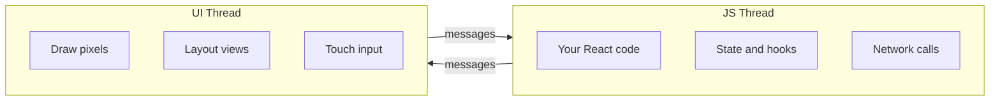
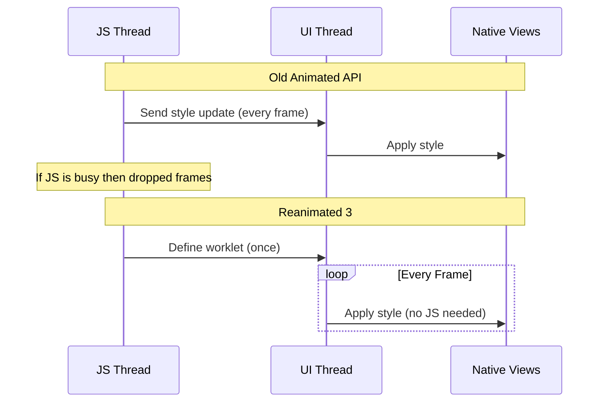
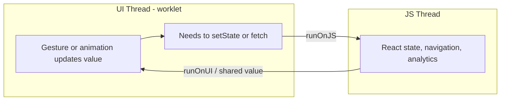
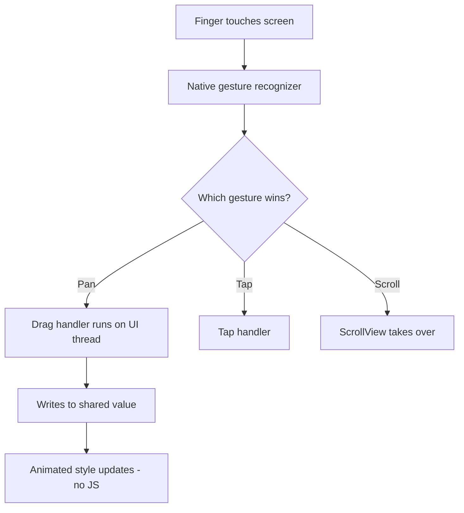
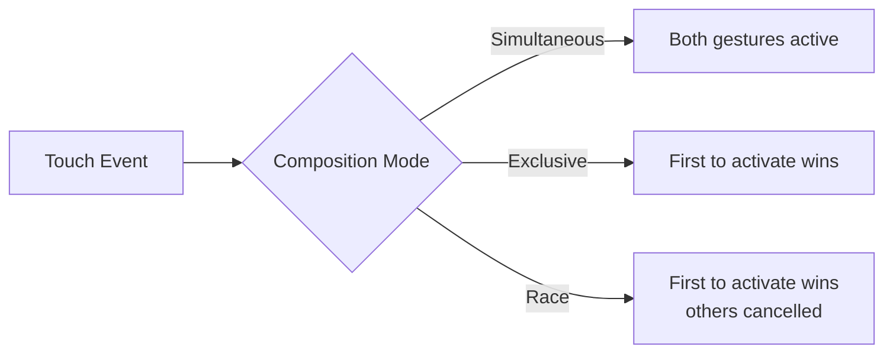
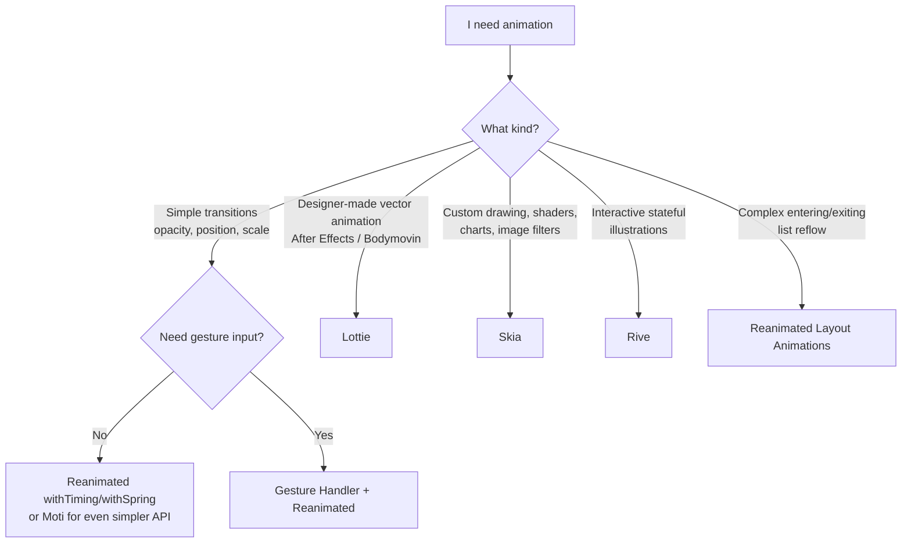

# Animazioni e Gesture: 60fps sul Thread UI

> Reanimated 3, Gesture Handler e gli strumenti che sostituiscono le transizioni CSS con prestazioni native.

---

## Table of Contents

1. [Reanimated 3](#1-reanimated-3)
2. [Gesture Handler](#2-gesture-handler)
3. [Other Animation Tools](#3-other-animation-tools)
4. [When to Reach for What](#4-when-to-reach-for-what)

---

## 1. Reanimated 3

### Due Thread, e Perché Dovrebbero Interessarti

Prima che tutto questo abbia senso, hai bisogno di un modello mentale di come un'app React Native funzioni realmente. A differenza di una pagina web, che vive in un'unica pipeline di rendering gestita per te dal browser, un'app React Native esegue il tuo codice su **due thread principali** che comunicano tra loro:

- **Il thread JS** — dove vengono eseguiti i tuoi componenti React, gli hooks, lo state, le chiamate `fetch` e tutta la logica di business. Questo è il "tuo" codice.
- **Il thread UI** (chiamato anche thread *main* o *native*) — dove il sistema operativo disegna effettivamente i pixel, dispone le view ed elabora l'input touch. Questo thread deve restare libero, perché se si blocca anche solo per un istante, lo schermo si congela letteralmente.

I due comunicano scambiandosi messaggi. Pensaci come a due persone in stanze separate che si passano bigliettini sotto una porta. Quella porta è il collo di bottiglia.



Perché tutto questo è importante per le animazioni? Perché un'animazione non è altro che un valore che cambia 60 volte al secondo. La domanda è: *quale thread sta facendo quel calcolo?* Se è il thread JS, ogni altra cosa che il thread JS fa entra in competizione con la tua animazione. Se è il thread UI, l'animazione è isolata dall'affaccendamento della tua app.

> **Modello mentale:** Il thread UI è il proiezionista che manda avanti la pellicola; il thread JS è lo sceneggiatore. Non vuoi che il proiezionista metta in pausa il film ogni volta che lo sceneggiatore vuole scribacchiare una nuova battuta.

### Il Problema con Animated di React Native

Sul web, applichi un `transition: transform 0.3s ease` a un div e hai finito. Il browser gestisce l'interpolazione sul thread del compositor, il tuo JavaScript non si sveglia mai e ottieni i 60fps gratis.

React Native include un'API `Animated` che *sembra* simile ma ha un difetto fatale: la maggior parte del lavoro viene eseguita sul thread JS. A ogni frame, il tuo bridge JavaScript invia un nuovo valore di stile al nativo. Un render pesante, una chiamata API lenta, una pausa per garbage collection — e la tua animazione scatta. Gli utenti se ne accorgono. Se ne accorgono sempre.

L'API `Animated` ha cercato di mitigare questo problema con un flag chiamato `useNativeDriver: true`, che sposta *alcune* animazioni sul lato nativo. Ma funziona solo per un ristretto insieme di proprietà (`opacity`, `transform`) e non può reagire alle gesture né eseguire logica condizionale a metà animazione. Nel momento in cui hai bisogno di qualcosa di dinamico, ricadi sul thread JS e lo scatto ritorna.

Reanimated 3 risolve questo problema eseguendo la logica di animazione direttamente sul **thread UI** tramite piccole funzioni chiamate **worklet**. Il tuo thread JS può congelarsi completamente e l'animazione continua a girare a 60fps.



### Cos'è Esattamente un Worklet?

Un **worklet** è una piccola funzione JavaScript che Reanimated copia per eseguirla sul thread UI anziché sul thread JS. Quando contrassegni una funzione come worklet (il plugin Babel di Reanimated lo fa automaticamente per `useAnimatedStyle`, le callback delle gesture, ecc.), riceve una speciale direttiva `'worklet';` e una copia serializzata delle variabili di cui ha bisogno.

Il punto è questo: poiché un worklet viene eseguito in un contesto JavaScript *separato* sul thread UI, **non** condivide memoria con il tuo normale codice JS. Non può vedere le normali variabili del tuo componente, i moduli importati o lo state — solo gli specifici "shared value" e le primitive serializzate che Reanimated gli passa.

```tsx
// This whole function body becomes a worklet — it runs on the UI thread.
const animatedStyle = useAnimatedStyle(() => {
  'worklet'; // usually auto-injected by the Babel plugin, shown here for clarity
  return { opacity: opacity.value };
});
```

> **Perché esiste questa separazione:** Il thread UI non può "infilarsi" nell'heap JS in modo sicuro mentre il thread JS potrebbe modificarlo. Per questo Reanimated esegue un secondo runtime JS isolato sul thread UI. Questo è il prezzo dell'indipendenza a 60fps — ed è il motivo per cui tornare al JS richiede l'helper esplicito `runOnJS` che incontrerai a breve.

### Shared Value: La Primitiva Fondamentale

Un `useSharedValue` è come `useRef` ma accessibile sia dal thread JS sia dal thread UI. Non innesca re-render. È il cuore pulsante di ogni animazione Reanimated.

L'intuizione chiave: uno shared value è un *singolo blocco di memoria* che entrambi i thread possono leggere e scrivere. Quando il thread UI aggiorna `opacity.value` 60 volte al secondo, il tuo componente React non esegue mai un re-render — perché leggi quel valore dentro un worklet, non nel JSX. Sul web, l'equivalente sarebbe modificare lo stile di un nodo DOM direttamente tramite un ref invece di passare per lo state di React; qui è il percorso predefinito e ottimizzato.

```tsx
import Animated, {
  useSharedValue,
  useAnimatedStyle,
  withTiming,
  withSpring,
} from 'react-native-reanimated';

function FadeInBox() {
  const opacity = useSharedValue(0);

  const animatedStyle = useAnimatedStyle(() => ({
    opacity: opacity.value,
  }));

  const show = () => {
    opacity.value = withTiming(1, { duration: 400 });
  };

  return (
    <Animated.View style={[styles.box, animatedStyle]}>
      <Button title="Show" onPress={show} />
    </Animated.View>
  );
}
```

Quando scrivi `opacity.value = withTiming(1)`, non stai impostando il valore a 1 immediatamente. Stai dicendo al thread UI: "interpola dal valore attuale a 1 nell'arco di 400ms usando una curva di easing." Il thread JS lancia il comando e se ne dimentica.

> **Trappola:** Devi sempre leggere e scrivere la proprietà `.value`, mai l'oggetto shared value stesso. `opacity = 1` non fa nulla di utile; `opacity.value = 1` è ciò che muove le cose. E leggere `opacity.value` *dentro il JSX* (fuori da un worklet) ti dà un'istantanea obsoleta che non si aggiornerà — ed è esattamente a questo che serve `useAnimatedStyle`.

### Pilotare gli Stili dai Valori: useAnimatedStyle e interpolate

`useAnimatedStyle` restituisce un oggetto stile che il thread UI ricalcola a ogni frame a partire dai tuoi shared value. Quasi mai animi `.value` direttamente fino al numero finale dello stile — invece mantieni un valore pilota "grezzo" e lo **interpoli** negli stili che vuoi effettivamente. Questo è il singolo pattern più riutilizzabile di Reanimated.

```tsx
import { interpolate, Extrapolation } from 'react-native-reanimated';

const progress = useSharedValue(0); // one driver, 0 -> 1

const cardStyle = useAnimatedStyle(() => ({
  // map progress 0..1 onto several visual properties at once
  opacity: interpolate(progress.value, [0, 1], [0, 1]),
  transform: [
    { translateY: interpolate(progress.value, [0, 1], [40, 0]) },
    { scale: interpolate(progress.value, [0, 1], [0.95, 1]) },
  ],
  // clamp so values never overshoot the ends of the range
  borderRadius: interpolate(
    progress.value,
    [0, 1],
    [24, 8],
    Extrapolation.CLAMP
  ),
}));

// later, one line animates the whole card in:
progress.value = withTiming(1, { duration: 300 });
```

`interpolate` è il cugino RN delle `@keyframes` CSS mescolate con una funzione di mappatura dei valori: gli fornisci un intervallo di input e un intervallo di output, e lui mappa linearmente tra i due. Pilota dieci proprietà di stile da un unico valore `progress` e le tue animazioni rimarranno perfettamente sincronizzate.

### Il Toolkit delle Animazioni

Reanimated ti offre modificatori di animazione componibili:

| Funzione | Cosa Fa | Equivalente Web |
|---|---|---|
| `withTiming` | Easing basato sulla durata | `transition: 0.3s ease` |
| `withSpring` | Molla basata sulla fisica | `spring()` in Framer Motion |
| `withDecay` | Inerzia con attrito | Nessun equivalente CSS diretto |
| `withRepeat` | Ripete in loop qualsiasi animazione | `animation-iteration-count` |
| `withSequence` | Concatena le animazioni in ordine | `@keyframes` con più stop |
| `withDelay` | Attendi, poi esegui un'animazione | `animation-delay` |

**Timing o spring — quale dà la sensazione giusta?** Usa `withTiming` quando vuoi una durata precisa e prevedibile (un tooltip che compare in dissolvenza in esattamente 200ms). Usa `withSpring` quando vuoi che qualcosa risulti *fisico* — pulsanti che rimbalzano indietro, card che scattano in posizione, qualsiasi cosa appena lasciata andare da un dito. Le molle non hanno una durata fissa; si assestano in base a parametri fisici:

| Parametro spring | Cosa controlla | Valore più alto significa |
|---|---|---|
| `damping` | Quanto rapidamente l'oscillazione si esaurisce | Meno rimbalzo, si assesta più in fretta |
| `stiffness` | Quanto è forte la trazione della molla | Più scattante, movimento più rapido |
| `mass` | Il "peso" dell'oggetto | Sensazione più lenta e pesante |

Componili liberamente:

```tsx
// Bounce in: scale up with spring, then pulse forever
scale.value = withSequence(
  withSpring(1, { damping: 4, stiffness: 200 }),
  withRepeat(
    withSequence(
      withTiming(1.05, { duration: 600 }),
      withTiming(1, { duration: 600 })
    ),
    -1, // -1 = infinite
    true // reverse each iteration
  )
);
```

> **Consiglio da esperto:** I modificatori di animazione accettano una *callback* che viene invocata quando terminano: `withTiming(1, { duration: 400 }, (finished) => { ... })`. La callback viene eseguita sul thread UI, quindi se devi svolgere del lavoro JS al termine di un'animazione (navigare, fare setState), incapsulalo: `withTiming(1, {}, () => runOnJS(onDone)())`.

### Attraversare il Confine tra Thread

I worklet vengono eseguiti sul thread UI. A volte hai bisogno di richiamare il JS — magari per aggiornare lo state o lanciare un evento di analytics. È a questo che serve `runOnJS`:

```tsx
import { runOnJS } from 'react-native-reanimated';

function SwipeCard() {
  const translateX = useSharedValue(0);

  const onSwipeComplete = (direction: string) => {
    // This runs on JS thread — safe to setState, fetch, etc.
    console.log(`Swiped ${direction}`);
  };

  const animatedStyle = useAnimatedStyle(() => {
    if (Math.abs(translateX.value) > 200) {
      runOnJS(onSwipeComplete)(
        translateX.value > 0 ? 'right' : 'left'
      );
    }
    return { transform: [{ translateX: translateX.value }] };
  });

  return <Animated.View style={animatedStyle} />;
}
```



> **Trappola:** Non chiamare mai una normale funzione JS direttamente dentro `useAnimatedStyle` o la callback di un gesture handler. Il worklet viene eseguito sul thread UI — non ha accesso a closure, state o moduli del thread JS. Incapsula sempre le chiamate lato JS con `runOnJS`. Dimenticarsene è il bug Reanimated più comune in assoluto, e spesso si manifesta come un errore criptico tipo *"Tried to synchronously call a non-worklet function on the UI thread."*

Esiste anche il contrario: `runOnUI` ti permette di innescare un worklet dal thread JS quando hai bisogno di avviare un'animazione imperativa da, per esempio, un handler di pressione di un pulsante che vive già nel JS.

> **Consiglio da esperto:** `runOnJS` ha un costo reale — fa il marshalling della chiamata attraverso il confine tra thread. Chiamarlo *a ogni frame* (ad es. dentro `onUpdate` per un trascinamento) ricrea esattamente lo scatto che Reanimated è stato costruito per evitare. Chiamalo solo per eventi *discreti*: gesture terminata, soglia superata, animazione completata.

### useAnimatedReaction: Osservare i Valori

A volte hai bisogno di side effect quando uno shared value cambia — come innescare un feedback aptico quando un trascinamento supera una soglia. `useAnimatedReaction` è il tuo strumento. Pensalo come a un `useEffect` che vive interamente sul thread UI: la prima funzione dice *cosa osservare*, la seconda dice *cosa fare quando cambia*, e ti fornisce sia il valore corrente sia quello precedente così puoi rilevare un attraversamento anziché solo uno stato.

```tsx
import { useAnimatedReaction } from 'react-native-reanimated';

useAnimatedReaction(
  () => translateY.value,           // what to watch
  (current, previous) => {          // what to do when it changes
    // fire only when we cross 100 going down — not every frame past 100
    if (previous && previous < 100 && current >= 100) {
      runOnJS(triggerHaptic)();
    }
  }
);
```

> **Errore comune:** Mettere il controllo della soglia come `current >= 100` *senza* confrontarlo con `previous`. Questo viene invocato a ogni singolo frame finché il valore resta sopra 100, scommerciando decine di feedback aptici. Confronta sempre con `previous` per rilevare il *fronte* (il momento dell'attraversamento), non lo *stato*.

### Layout Animation: Transizioni a Sforzo Zero

Reanimated include animazioni di entrata e uscita preconfezionate. Pensale come l'equivalente React Native di `<Transition>` di Vue o `AnimatePresence` di Framer Motion:

```tsx
import Animated, {
  FadeIn,
  FadeOut,
  SlideInRight,
  LinearTransition,
} from 'react-native-reanimated';

function TodoItem({ item }: { item: { text: string } }) {
  return (
    <Animated.View
      entering={SlideInRight.duration(300)}  // plays when mounted
      exiting={FadeOut.duration(200)}         // plays when removed
      layout={LinearTransition.springify()}   // plays when neighbors move
    >
      <Text>{item.text}</Text>
    </Animated.View>
  );
}
```

La prop `layout` è la vera gemma — quando gli elementi fratelli si ridispongono (per esempio quando un elemento viene eliminato da una lista), Reanimated anima automaticamente ogni elemento rimanente verso la sua nuova posizione. Sul web, questo richiede librerie come `auto-animate` o tecniche FLIP. Qui è una sola prop.

> **Trappola:** Affinché le animazioni di `exiting` vengano effettivamente riprodotte, l'elemento deve essere rimosso da un genitore che mantiene la `Animated.View` montata abbastanza a lungo da animarne l'uscita. All'interno di `FlatList`/`FlashList` la virtualizzazione può interrompere bruscamente le animazioni di uscita; per le liste animate spesso si animano gli elementi in una semplice lista mappata o si usano i pattern documentati dalla libreria. Inoltre: ogni figlio animato in una lista ha bisogno di una **`key` stabile**, altrimenti Reanimated non può distinguere quale elemento si è spostato da quale è stato sostituito.

---

## 2. Gesture Handler

### Perché Non Semplicemente onTouchStart?

Il sistema di touch integrato di React Native (`PanResponder`, `onTouchStart`) passa attraverso il bridge JS. Inoltre non ha alcun concetto di composizione delle gesture — cosa succede quando una scroll view contiene una card trascinabile che ha anche un handler di tap? Il sistema integrato crolla.

Per renderlo concreto: sul web, il browser ha un sistema sofisticato e vecchio di decenni per decidere se il trascinamento del tuo dito sia uno scroll, una selezione di testo o il tap su un link — e lo fa nativamente, al di fuori del tuo JS. Il responder touch di base di React Native non ti dà quasi nulla di tutto ciò. `react-native-gesture-handler` riporta in gioco quell'arbitraggio nativo delle gesture. Le gesture vengono riconosciute sul thread nativo (UI) e si compongono in modo dichiarativo.



> **Trappola di configurazione:** Gesture Handler richiede che la tua app sia avvolta in un `<GestureHandlerRootView style={{ flex: 1 }}>` proprio in cima all'albero dei componenti (Expo Router e le librerie di navigazione spesso lo fanno per te). Se le gesture non fanno silenziosamente nulla — specialmente su Android — un root view mancante è di solito il colpevole.

### Le Gesture Fondamentali

```tsx
import { Gesture, GestureDetector } from 'react-native-gesture-handler';
import Animated, {
  useSharedValue,
  useAnimatedStyle,
  withSpring,
} from 'react-native-reanimated';

function DraggableCard() {
  const translateX = useSharedValue(0);
  const translateY = useSharedValue(0);
  const savedX = useSharedValue(0);
  const savedY = useSharedValue(0);

  const pan = Gesture.Pan()
    .onStart(() => {
      // remember where the card was when the drag began
      savedX.value = translateX.value;
      savedY.value = translateY.value;
    })
    .onUpdate((event) => {
      // saved position + how far the finger has moved so far
      translateX.value = savedX.value + event.translationX;
      translateY.value = savedY.value + event.translationY;
    })
    .onEnd(() => {
      // let go: spring back to center
      translateX.value = withSpring(0);
      translateY.value = withSpring(0);
    });

  const animatedStyle = useAnimatedStyle(() => ({
    transform: [
      { translateX: translateX.value },
      { translateY: translateY.value },
    ],
  }));

  return (
    <GestureDetector gesture={pan}>
      <Animated.View style={[styles.card, animatedStyle]} />
    </GestureDetector>
  );
}
```

Nota una cosa importante: la callback `onUpdate` scrive direttamente sugli shared value. Nessun attraversamento del bridge, nessun coinvolgimento del thread JS. La gesture alimenta i dati di posizione all'animazione sul thread UI, a ogni frame.

Perché il pattern `savedX`/`savedY`? Perché `event.translationX` è misurato *dal punto in cui il dito ha toccato per la prima volta*, non dall'ultima posizione di riposo della card. Senza salvare la posizione iniziale, ogni nuovo trascinamento riporterebbe di scatto la card al punto in cui la traslazione era zero. Questo pattern "salva all'inizio, aggiungi la traslazione all'aggiornamento" è il modo canonico per rendere i trascinamenti riprendibili — memorizzalo.

I cinque principali riconoscitori di gesture:

| Gesture | Caso d'uso | Campi chiave dell'evento |
|---|---|---|
| `Gesture.Pan()` | Trascinamento, swipe, pull-to-refresh | `translationX/Y`, `velocityX/Y` |
| `Gesture.Pinch()` | Zoom avanti/indietro | `scale`, `focalX/Y` |
| `Gesture.Tap()` | Tap singolo, doppio o N-tap | `x`, `y`, `numberOfTaps` |
| `Gesture.LongPress()` | Menu a pressione prolungata | `duration` |
| `Gesture.Fling()` | Colpetto direzionale rapido | `direction` |

> **Consiglio da esperto:** `Gesture.Pan()` ti fornisce `velocityX`/`velocityY` in `onEnd`. Passa quella velocità a `withDecay({ velocity: event.velocityX })` e la card continua a scivolare dopo che il dito si solleva, decelerando con attrito — esattamente come si sente l'inerzia dello scroll nativo. È così che costruisci una card "fling per chiudere".

### Composizione delle Gesture

Le UI reali hanno bisogno di più gesture sullo stesso elemento. Gesture Handler ti offre tre modalità di composizione:

```tsx
// Both gestures run at the same time (e.g., pinch + pan for a photo viewer)
const composed = Gesture.Simultaneous(pinchGesture, panGesture);

// First gesture to activate wins, others are cancelled
const exclusive = Gesture.Exclusive(doubleTap, singleTap);

// First gesture to activate wins (same as Exclusive for most cases)
const race = Gesture.Race(swipeGesture, scrollGesture);
```



| Modalità | Comportamento | Quando usarla |
|---|---|---|
| `Simultaneous` | Tutte le gesture attive contemporaneamente | Pinch + pan + rotazione su una foto |
| `Exclusive` | Ordine di priorità; vince la gesture precedente | Il doppio tap ha priorità sul tap singolo |
| `Race` | Vince quella che si attiva per prima, le altre si annullano | Swipe-per-chiudere vs scroll |

> **Errore comune:** Avvolgere `Gesture.Exclusive(singleTap, doubleTap)` nell'ordine sbagliato. Il resolver esclusivo sceglie la *prima* gesture che soddisfa i suoi criteri di attivazione. Un tap singolo viene sempre invocato prima di un doppio tap. Devi mettere `doubleTap` per primo così ottiene la priorità:
>
> ```tsx
> // Correct: double tap checked first
> const gesture = Gesture.Exclusive(doubleTap, singleTap);
> ```

### Collegare le Gesture a Reanimated

La forza di questo ecosistema sta nel fatto che Gesture Handler e Reanimated condividono lo stesso runtime worklet del thread UI. La callback di una gesture può scrivere su uno shared value, e uno stile animato lo legge — tutto senza che il thread JS ne sappia mai nulla:

```tsx
const scale = useSharedValue(1);

const pinch = Gesture.Pinch()
  .onUpdate((event) => {
    scale.value = event.scale;  // UI thread, every frame
  })
  .onEnd(() => {
    scale.value = withSpring(1); // snap back
  });

const animatedStyle = useAnimatedStyle(() => ({
  transform: [{ scale: scale.value }],
}));
```

È così che app come Instagram, Telegram e Airbnb costruiscono le loro interfacce guidate dalle gesture. Il pattern è sempre lo stesso: **la gesture scrive su uno shared value, lo stile animato legge dallo shared value.** Fai tua questa singola frase e il 90% delle animazioni con gesture diventa una formula.

> **Trappola:** Le callback delle gesture (`.onUpdate`, `.onStart`, ecc.) sono worklet — stesse regole di `useAnimatedStyle`. Non puoi chiamare `setState` o una qualsiasi normale funzione JS al loro interno senza `runOnJS`. Se devi modificare uno state di React quando una gesture termina, è `runOnJS(setX)(value)` dentro `.onEnd`.

---

## 3. Other Animation Tools

Reanimated e Gesture Handler coprono l'80% delle esigenze di animazione. Il restante 20% è dove brillano gli strumenti specializzati. Ecco il panorama a colpo d'occhio prima di approfondire:

| Strumento | Ideale per | Interattivo? | Sorgente |
|---|---|---|---|
| Reanimated | Transizioni, movimento guidato dalle gesture | Sì | Codice |
| Lottie | Animazioni vettoriali create dai designer | Limitato (scrub tramite progress) | JSON di After Effects |
| Skia | Disegno personalizzato, shader, grafici | Sì | Codice |
| Moti | Semplici entrate/uscite dichiarative | No (incapsula Reanimated) | Codice |
| Rive | Illustrazioni interattive con stato | Sì (state machine) | Editor di Rive |

### Lottie: Animazioni Vettoriali da After Effects

Se il tuo designer ti consegna un file di After Effects e ti dice "fallo muovere", vuoi [Lottie](https://github.com/lottie-react-native/lottie-react-native). I designer esportano le animazioni come JSON (tramite il plugin Bodymovin/Lottie), e Lottie le renderizza nativamente a 60fps — senza che tu debba ricreare il movimento nel codice.

```bash
npx expo install lottie-react-native
```

```tsx
import LottieView from 'lottie-react-native';

function SuccessAnimation() {
  return (
    <LottieView
      source={require('./checkmark.json')}
      autoPlay
      loop={false}
      style={{ width: 150, height: 150 }}
    />
  );
}
```

Lottie è perfetto per: spinner di caricamento, stati di successo/errore, illustrazioni di onboarding, animazioni di icone. **Non** è adatto per: animazioni interattive che rispondono all'input dell'utente (usa Reanimated per quello) o animazioni pesanti a schermo intero (usa Skia o Rive).

> **Suggerimento:** Puoi controllare il progress di Lottie con uno shared value di Reanimated usando la prop `progress` con `Animated.createAnimatedComponent(LottieView)`. Questo ti permette di *scorrere* (scrub) attraverso un'animazione in base alla posizione di scroll o all'input di una gesture — per esempio, uno spinner di pull-to-refresh che si riempie man mano che l'utente tira verso il basso invece di limitarsi a ripetersi da solo.

### Skia: Un Motore di Rendering 2D

`@shopify/react-native-skia` ti offre un canvas accelerato dalla GPU con shader, blur, gradienti, disegno di path e filtri immagine — tutto a 60fps. Pensalo come un `<canvas>` sotto steroidi. (Skia è, di fatto, lo stesso motore di rendering che alimenta Google Chrome e Flutter — quindi è collaudato su scala massiccia.)

```tsx
import { Canvas, Circle, LinearGradient, vec } from '@shopify/react-native-skia';

function GradientOrb() {
  return (
    <Canvas style={{ width: 200, height: 200 }}>
      <Circle cx={100} cy={100} r={80}>
        <LinearGradient
          start={vec(0, 0)}
          end={vec(200, 200)}
          colors={['#6366f1', '#ec4899']}
        />
      </Circle>
    </Canvas>
  );
}
```

Il cambio di mentalità rispetto al normale RN qui è: invece di comporre `<View>` che il sistema operativo dispone, sei tu stesso a *disegnare primitive su un canvas* — cerchi, path, testo, immagini — esattamente come le API Canvas 2D/WebGL del web. Quella potenza è anche il suo costo: i figli di Skia non sono normali view, quindi flexbox e lo styling standard non si applicano all'interno di `<Canvas>`.

Usa Skia quando hai bisogno di: disegno personalizzato (grafici, diagrammi, firme), elaborazione di immagini (blur, matrice colore), effetti shader, o qualsiasi cosa che sul web sarebbe un `<canvas>`. Skia si integra con gli shared value di Reanimated, quindi puoi animare le uniform degli shader e le proprietà dei path sul thread UI.

> **Trappola:** Skia è una dipendenza più pesante e aggiunge peso al tuo bundle/binario. Non includerla solo per disegnare un rettangolo arrotondato — una `<View>` con uno stile lo fa gratis. Ricorri a Skia solo quando hai genuinamente bisogno di disegno a livello di pixel o di effetti che il sistema delle view non sa esprimere.

### Moti: Animazioni Dichiarative

[Moti](https://moti.fyi) avvolge Reanimated con un'API in stile Framer Motion. Meno controllo, meno boilerplate:

```tsx
import { MotiView } from 'moti';

function FadeInCard() {
  return (
    <MotiView
      from={{ opacity: 0, translateY: 20 }}      // initial state
      animate={{ opacity: 1, translateY: 0 }}     // target state
      transition={{ type: 'timing', duration: 350 }}
    />
  );
}
```

Se hai usato Framer Motion sul web, questo ti risulterà istantaneamente familiare — `from`/`animate`/`transition` corrispondono quasi uno a uno a `initial`/`animate`/`transition` di Framer. Moti è eccellente per semplici animazioni di entrata/uscita dove non hai bisogno di integrazione con le gesture o di controllo a grana fine. È uno strato di comodità costruito *sopra* Reanimated (non un concorrente) — se ne superi i limiti, puoi scendere direttamente a Reanimated all'interno della stessa app, senza alcuna migrazione richiesta.

| Scelta | Boilerplate | Controllo | Ricorri ad essa quando |
|---|---|---|---|
| Moti | Minimo | Inferiore | Semplici entrate-uscite in dissolvenza/scorrimento, prototipazione |
| Reanimated direttamente | Maggiore | Completo | Gesture, interpolazione, sequenze complesse |

### Rive: State Machine Interattive

[Rive](https://rive.app) è come Lottie ma con **state machine** integrate. Il tuo designer può definire stati (idle, hover, pressed, loading) nell'editor di Rive e collegare le transizioni tra di essi; tu poi inneschi quelle transizioni dal codice impostando degli "input". Mentre Lottie riproduce una timeline fissa dall'inizio alla fine, Rive risponde allo state della tua app e all'input dell'utente in tempo reale.

```tsx
import Rive, { useRive } from 'rive-react-native';

function LikeButton() {
  const [riveRef, setInput] = useRive();
  return (
    <Rive
      ref={riveRef}
      resourceName="like_button"
      stateMachineName="State Machine 1"
      // fire a trigger input defined in the Rive editor
      onPress={() => setInput?.('State Machine 1', 'pressed', true)}
    />
  );
}
```

Utile per illustrazioni interattive complesse ed elementi di UI in stile videogioco — pulsanti like animati, avatar di personaggi che reagiscono ai tap, mascotte di progresso — dove codificare a mano ogni transizione di stato in Reanimated sarebbe doloroso e il designer può invece farsi carico del movimento.

---

## 4. When to Reach for What

Ecco il framework decisionale. Non pensarci troppo — scegli lo strumento più semplice che risolve il tuo problema.



### La Decisione in Parole Semplici

**"Voglio che un pulsante compaia in dissolvenza."**
Usa `withTiming` di Reanimated, o una `MotiView` se vuoi meno codice. Non importare Lottie per questo.

**"Voglio una card che l'utente possa trascinare e lanciare."**
Gesture Handler `Gesture.Pan()` che scrive su shared value di Reanimated, con `withDecay` (alimentato da `event.velocityX`) al rilascio per l'inerzia. Questo è il pattern pane-e-burro.

**"Voglio un visualizzatore di foto con pinch-to-zoom."**
`Gesture.Simultaneous(pinch, pan)` con Reanimated. Memorizza scale e traslazione negli shared value.

**"Il mio designer mi ha dato un'animazione di After Effects."**
Lottie. Esportala come JSON, inseriscila. Se devi scorrerla con una gesture, collega la prop `progress` a uno shared value.

**"Mi serve un grafico personalizzato con path animati."**
Skia. Disegna i path, animali con shared value di Reanimated che pilotano le proprietà di Skia.

**"Mi servono illustrazioni animate che rispondono allo state dell'app."**
Rive. Definisci le state machine nell'editor, innescale da React tramite gli input.

### Regole Empiriche sulle Prestazioni

1. **Mantieni le animazioni sul thread UI.** Se vedi `useNativeDriver: false` in del codice vecchio, è un campanello d'allarme. Reanimated è UI-thread per impostazione predefinita.
2. **Evita `runOnJS` nei percorsi critici.** Attraversare il bridge una volta per ogni evento di gesture vanifica lo scopo. Richiama il JS solo per eventi discreti (swipe completato, soglia superata).
3. **Usa `cancelAnimation` per fare pulizia.** Se un componente viene smontato durante un'animazione, annullala. Reanimated ti avviserà se te ne dimentichi.
4. **Misura con il Perf Monitor.** Abilita l'overlay delle prestazioni di React Native (`Cmd+D` > "Show Perf Monitor") per verificare di raggiungere i 60fps. Osserva in particolare la riga FPS della **UI** — se scende sotto i 60 durante una gesture, il tuo worklet sta facendo troppo lavoro per frame.
5. **Profila su un vero dispositivo di fascia bassa, non sul simulatore.** Il Simulatore iOS gira sulla potente CPU del tuo Mac e nasconderà lo scatto. Un telefono Android di tre anni fa è quello che dice la verità.

> **La Regola d'Oro:** Se un'animazione è guidata dal touch dell'utente, *deve* essere eseguita sul thread UI. Non esiste alcuna quantità di ottimizzazione che renderà native le animazioni sul thread JS durante le gesture. Reanimated + Gesture Handler non è opzionale per le app di produzione — è il punto di partenza.