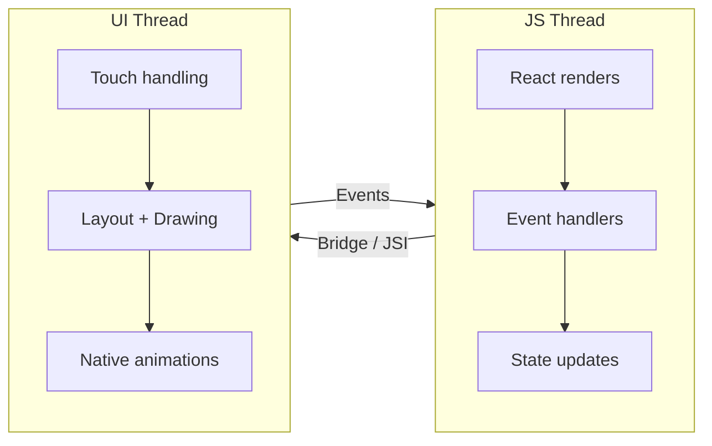
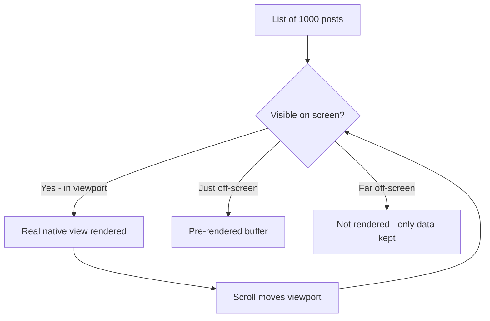
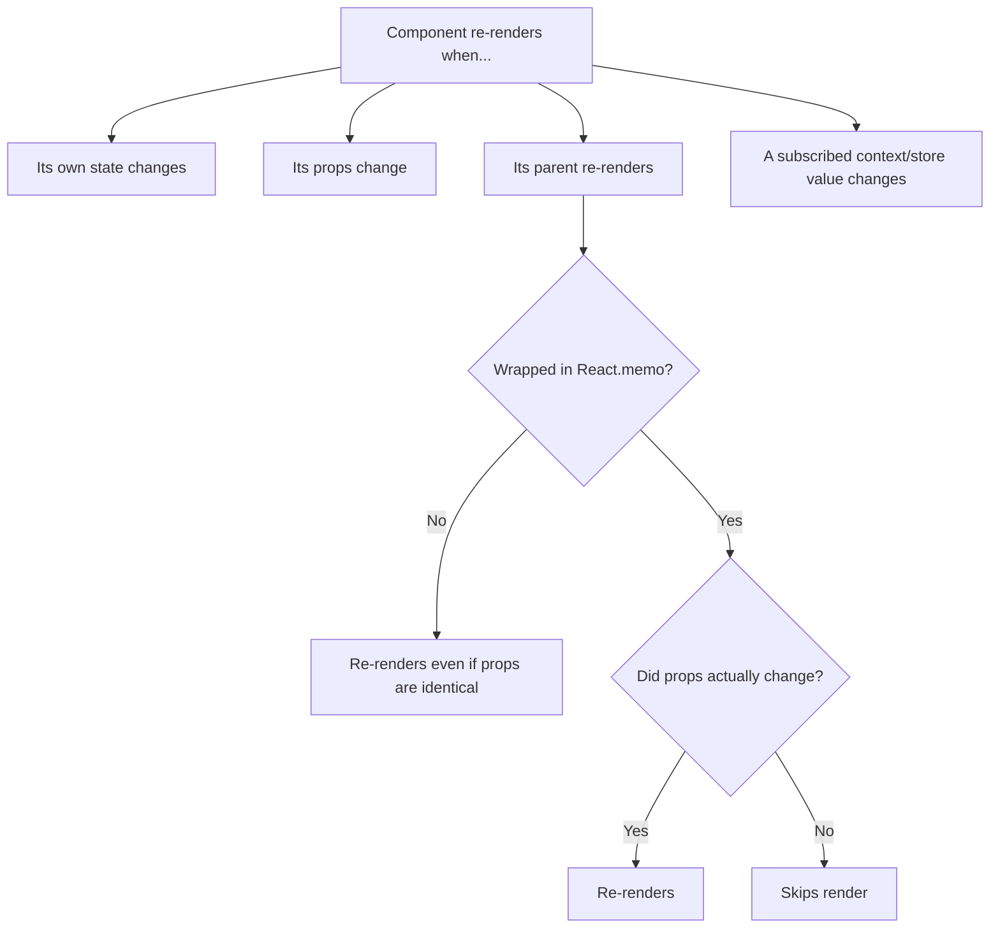
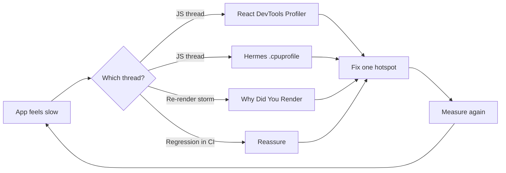
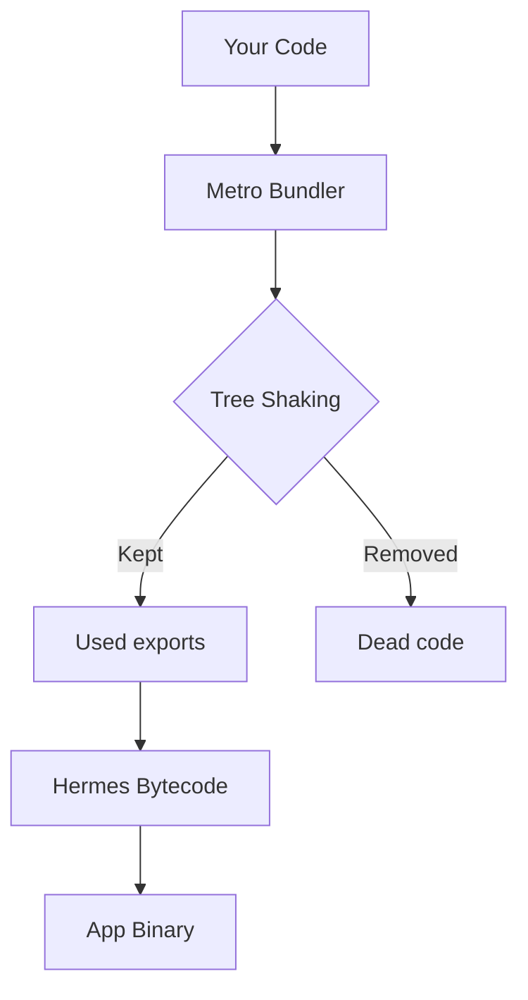

# Performance Engineering: tenere entrambi i thread contenti

> Il modello mentale dei due thread, l'ottimizzazione delle liste, la prevenzione dei re-render e gli strumenti di profiling.

---

## Table of Contents

1. [The Two-Thread Mental Model](#1-the-two-thread-mental-model)
2. [Lists](#2-lists)
3. [Re-Renders](#3-re-renders)
4. [Images](#4-images)
5. [JS Engine](#5-js-engine)
6. [Performance Tools](#6-performance-tools)
7. [Bundle Size](#7-bundle-size)

---

## 1. Il modello mentale dei due thread

Sul web hai un unico thread principale. Bloccalo e tutto si congela: animazioni, scrolling, input. React Native è diverso. La tua app gira su **due thread principali** e comprendere il confine tra di essi è il singolo concetto di performance più importante che imparerai.

Pensalo come a un ristorante. Il **thread JS** è lo chef che decide *cosa* cucinare (la tua logica, il tuo albero React, ciò che dovrebbe essere a schermo). Il **thread UI** è il cameriere che porta concretamente i piatti al tavolo e risponde al cliente (disegna i pixel, gestisce i tocchi). Se lo chef rimane bloccato a friggere un unico ordine gigante, il cameriere a volte può comunque continuare a sparecchiare i tavoli, ma non escono *nuovi* piatti. Se il cameriere inciampa, persino uno chef velocissimo non riesce a portare il cibo a nessuno. Entrambi possono bloccarsi, e si bloccano in modi diversi e riconoscibili.

> **Perché due thread, poi?** La gestione dei tocchi e dello scrolling deve risultare istantanea, sotto i ~16ms per frame per raggiungere i 60fps. JavaScript è single-threaded e imprevedibile (potresti eseguire un ordinamento, fare il parsing di un payload, far scattare degli effect). Mantenendo il lavoro nativo della UI sul proprio thread, il sistema operativo può mantenere scrolling e gesture fluidi anche mentre il tuo JS è momentaneamente occupato. Il web non ha una separazione equivalente, ed è per questo che un pesante ciclo `for` sul web congela *tutto*, scrolling incluso.

### Il thread JS

È qui che vive il tuo codice React. Render dei componenti, callback di `useEffect`, event handler, aggiornamenti di state: tutto JavaScript, tutto qui. Quando scrivi `onPress={() => doSomething()}`, quella funzione viene eseguita sul thread JS.

È **single-threaded**, esattamente come il thread principale del browser. C'è una sola coda e i task vengono eseguiti uno alla volta. Se un render impiega 300ms, niente altro sul thread JS — nessun altro event handler, nessun timer, nessuna risoluzione di promise — può girare durante quei 300ms.

### Il thread UI (Main Thread)

Questo è il lato nativo. Gestisce il disegno dei pixel, l'elaborazione delle gesture di tocco e l'esecuzione delle animazioni native. Su iOS è il main thread; su Android è il thread UI. Le scroll view native, i worklet di Reanimated e le animazioni con native driver girano tutti qui, indipendentemente da JavaScript.

L'intuizione cruciale: una `ScrollView` scorre *nativamente*. Quando trascini, la lista si muove sul thread UI senza chiedere il permesso al thread JS. È per questo che una lista può continuare a scorrere in modo fluido anche mentre il tuo thread JS è intasato, ma è anche il motivo per cui le nuove righe possono apparire *vuote*, perché il render del loro contenuto richiede il thread JS (occupato).

### Cosa succede quando uno si blocca



**Thread JS bloccato → i tocchi sembrano congelati.** L'utente preme un pulsante ma non succede nulla per 200ms perché il tuo thread JS è impegnato a calcolare qualcosa. Nel frattempo, un'animazione guidata da Reanimated può continuare a girare in modo fluido perché vive sul thread UI. Questa è l'esperienza disorientante in cui le animazioni appaiono perfette ma l'app sembra non rispondere.

**Thread UI bloccato → frame persi e jank.** Questo è più raro con il tipico codice React Native, ma accade quando spingi calcoli di layout costosi o chiamate sincrone a moduli nativi sul main thread. Vedrai scrolling a scatti e animazioni irregolari.

| Sintomo | Thread probabilmente bloccato | Causa tipica |
| --- | --- | --- |
| I tocchi non rispondono, ma le animazioni sono fluide | Thread JS | Render pesante, `JSON.parse`, grandi sort/filter |
| Lo scroll è a scatti, l'animazione irregolare | Thread UI | Chiamata nativa sincrona, layout costoso |
| La lista scorre ma le righe appaiono vuote e poi si riempiono | Thread JS (non riesce a stare al passo) | Righe non memoizzate, `renderItem` pesante |
| Tutto congelato allo stesso tempo | Entrambi (o un deadlock) | Chiamata sincrona al bridge dal JS durante un render pesante |

### Il vecchio bridge vs la New Architecture

Storicamente, JS e nativo comunicavano tramite un **bridge** asincrono che serializzava ogni messaggio in JSON — lento e un comune collo di bottiglia. La **New Architecture** (Fabric + JSI) consente a JavaScript di mantenere riferimenti diretti a oggetti nativi e di chiamarli in modo sincrono, rimuovendo gran parte di quel costo di serializzazione. Non devi ancora padroneggiare questo aspetto, ma conosci la tendenza: il confine tra i due thread sta diventando meno costoso da attraversare, non i thread stessi che si fondono.

### La regola pratica

Mantieni il thread JS libero per l'interazione. Sposta il lavoro pesante con:

- **`InteractionManager.runAfterInteractions()`** — rinvia il lavoro non urgente finché le animazioni non sono terminate.
- **Worklet di Reanimated** — eseguono la logica di animazione direttamente sul thread UI.
- **Thread in background** — usa librerie come `react-native-multithreading` o sposta il lavoro nei moduli nativi.

```tsx
import { InteractionManager } from "react-native";

function onScreenFocus() {
  // The screen-transition animation is playing. If we load heavy data NOW,
  // the JS thread jams and the push animation stutters. So we wait.
  InteractionManager.runAfterInteractions(() => {
    loadExpensiveData(); // runs once the transition animation finishes
  });
}
```

Un altro pattern quotidiano: spezzare il lavoro sincrono di grandi dimensioni in blocchi, così che il thread JS possa "respirare" tra di essi e continuare a rispondere ai tocchi.

```tsx
// Instead of processing 10,000 items in one blocking loop,
// yield to the event loop periodically so taps can be handled.
async function processInChunks<T>(items: T[], fn: (item: T) => void) {
  for (let i = 0; i < items.length; i++) {
    fn(items[i]);
    if (i % 100 === 0) {
      // Let the JS thread handle pending events (taps, gestures) before continuing
      await new Promise((resolve) => setTimeout(resolve, 0));
    }
  }
}
```

> **Trabocchetto:** `console.log` in produzione rallenta il thread JS più di quanto pensi. Ogni log serializza dati attraverso il bridge. Rimuovi i log nelle build di produzione o usa guard `__DEV__`.

> **Consiglio da esperti:** Quando qualcosa "sembra lento", la tua prima domanda dovrebbe sempre essere *quale thread?* La soluzione è completamente diversa. Jank del thread JS = memoizza / spezza in blocchi / sposta il lavoro fuori dal percorso di render. Jank del thread UI = smetti di fare lavoro nativo sincrono, usa il native animation driver.

---

## 2. Liste

Se la tua app mostra una lista di più di circa 20 elementi, il modo in cui esegui il render di quella lista farà la differenza nella performance percepita. Sul web, potresti ricorrere a `react-window` o `react-virtuoso`. In React Native, la `FlatList` integrata è stata lo standard per anni, ma ha limitazioni reali.

### Perché non renderizzare semplicemente tutto?

Sul web, un `div` è economico e il browser è altamente ottimizzato nel nascondere il contenuto fuori schermo. In React Native, **ogni riga è una vera view nativa** — una vera e propria `UIView` (iOS) o `View` (Android) allocata in memoria. Renderizza 1.000 righe e allochi 1.000 view native più tutti i loro figli. È così che esaurisci la memoria e mandi in crash un telefono Android economico.

La soluzione è la **virtualizzazione**: solo le righe attualmente sullo schermo (o vicine) esistono effettivamente come view native. Man mano che scorri, le righe che lasciano lo schermo vengono distrutte (FlatList) o *riciclate* (FlashList).



### FlatList vs FlashList

`FlatList` crea e distrugge view man mano che scorri. `FlashList` di Shopify le **ricicla**, riutilizzando le celle fuori schermo nel modo in cui `UICollectionView` e `RecyclerView` funzionano nativamente. Il risultato è una quantità drasticamente inferiore di celle vuote e uno scrolling più fluido.

Il riciclo è il modello mentale chiave: invece di buttare via una riga che è scorsa via dalla cima e costruirne una nuova di zecca in fondo, FlashList prende la *stessa* view nativa, vi inserisce nuovi dati e la riposiziona. Allocare view native è costoso; riutilizzarle è quasi gratuito.

| Componente | Strategia | Quando usarlo |
| --- | --- | --- |
| `ScrollView` | Renderizza TUTTI i figli in una volta, nessuna virtualizzazione | Insiemi piccoli e fissi (una schermata di impostazioni, < ~20 elementi semplici) |
| `FlatList` | Virtualizza — monta/smonta le view | Integrata, nessuna dipendenza; va bene per liste moderate |
| `FlashList` | Virtualizza **e ricicla** le view | Feed lunghi e scorrevoli; chat; tutto ciò in cui la performance di scroll conta |
| `SectionList` | Virtualizzata, con intestazioni di sezione | Dati raggruppati (contatti A-Z, sezioni di impostazioni) |

> **Trabocchetto:** Non inserire mai una `FlatList`/`FlashList` dentro una `ScrollView` con la stessa direzione di scroll. La `ScrollView` esterna costringe la lista interna a renderizzare *tutti* i suoi elementi (le dà altezza infinita), distruggendo completamente la virtualizzazione. Usa invece le prop `ListHeaderComponent` / `ListFooterComponent` della lista stessa anziché avvolgerla.

```bash
npx expo install @shopify/flash-list
```

```tsx
import { FlashList } from "@shopify/flash-list";

function Feed({ posts }: { posts: Post[] }) {
  return (
    <FlashList
      data={posts}
      estimatedItemSize={120}       // Required — measure a typical row height
      keyExtractor={(item) => item.id}
      renderItem={({ item }) => <PostCard post={item} />}
    />
  );
}
```

### Le regole per liste veloci

**1. Fornisci sempre `estimatedItemSize`.** FlashList lo usa per pre-allocare le celle riciclate. Misura una riga rappresentativa e fornisci l'altezza in pixel. Sbagliarlo di 2x è comunque meglio che non fornirlo affatto.

**2. Memoizza il tuo componente riga.** Se `renderItem` restituisce `<PostCard />`, assicurati che `PostCard` sia avvolto in `React.memo`. Senza questo, ogni evento di scroll fa il re-render di ogni riga visibile.

**3. Non usare mai funzioni arrow inline in `renderItem`.**

```tsx
// Bad — creates a new function reference every render
renderItem={({ item }) => <PostCard post={item} onPress={() => handlePress(item.id)} />}

// Good — stable references
const handlePress = useCallback((id: string) => {
  navigation.navigate("Detail", { id });
}, [navigation]);

const renderPost = useCallback(({ item }: { item: Post }) => (
  <PostCard post={item} onPress={handlePress} />
), [handlePress]);

// ...
<FlashList renderItem={renderPost} />
```

Perché conta così tanto? Una nuova funzione arrow è un *nuovo riferimento* a ogni render. Quel nuovo riferimento fluisce dentro `PostCard` come prop, il che vanifica `React.memo` (il confronto superficiale delle prop vede "funzione diversa") e fa il re-render di ogni riga visibile a ogni frame di scroll. I riferimenti stabili sono tutto il gioco.

**4. Usa `keyExtractor` con ID stabili e univoci.** Non usare mai l'indice dell'array come key per liste dinamiche. Quando gli elementi cambiano posizione, le key basate sull'indice fanno sì che la cella sbagliata venga riciclata con i dati sbagliati. È la stessa regola di `key` di React sul web, ma in RN il costo di sbagliarla è visibile: avatar e testo di una riga "sbavano" su un'altra durante gli scroll veloci.

**5. Appiattisci il layout delle righe.** Gerarchie di `View` profondamente annidate dentro ogni riga sono costose. Ogni view nativa è una vera view di piattaforma, a differenza del web dove i div sono economici. Mantieni i componenti riga superficiali.

**6. Reimposta lo state riciclato con gli hook giusti.** Poiché FlashList riutilizza una view, lo state locale dentro una riga può "trapelare" dall'elemento precedente. Se una riga mantiene state locale (ad es. un toggle espanso/compresso), associalo con una key all'id dell'elemento o usa `getItemType` di FlashList così che righe di forma diversa non si riciclino l'una nell'altra.

```tsx
<FlashList
  data={feed}
  estimatedItemSize={120}
  // Tell FlashList these rows are structurally different so it recycles
  // a "text" cell only into another "text" cell, not into an "ad" cell.
  getItemType={(item) => item.type} // "text" | "image" | "ad"
  renderItem={({ item }) => <FeedRow item={item} />}
/>
```

> **Trabocchetto:** FlashList ti avviserà in sviluppo se la tua area vuota (spazio vuoto visibile durante uno scroll veloce) supera una soglia. Presta attenzione a questi avvisi — sono diagnostiche di performance azionabili, che di solito indicano un `estimatedItemSize` sbagliato o una riga non memoizzata.

---

## 3. Re-Render

Il modello di reconciliation di React è lo stesso in React Native e sul web. La differenza è il costo: sul web, un re-render sprecato aggiorna un virtual DOM e magari tocca qualche nodo DOM economico. In React Native, un re-render sprecato può innescare ricalcoli di layout su vere view native e attraversare inutilmente il bridge da JS a nativo.

Un re-render in React significa: React riesegue la funzione del tuo componente per produrre un nuovo albero di elementi, poi lo confronta con quello vecchio. La riesecuzione stessa è lavoro del thread JS; eventuali cambiamenti risultanti diventano aggiornamenti di view native. La maggior parte dei problemi di performance qui non è *un* render costoso — sono *centinaia* di render economici che scattano quando non dovrebbero, ciascuno che intacca il tuo budget di frame.

### Perché i componenti fanno il re-render



Quello che i principianti mancano di più: **un parent che fa il re-render fa il re-render di tutti i suoi figli per impostazione predefinita**, anche dei figli le cui prop non sono cambiate. `React.memo` è il modo in cui escludi un figlio da tutto questo.

### React.memo per i componenti

Avvolgi qualsiasi componente che riceve prop più o meno stabili ed è renderizzato dentro una lista o un parent che si aggiorna di frequente:

```tsx
const PostCard = React.memo(function PostCard({ post, onPress }: Props) {
  return (
    <Pressable onPress={() => onPress(post.id)}>
      <Text>{post.title}</Text>
    </Pressable>
  );
});
```

`React.memo` esegue un confronto superficiale delle prop. Se `post` è un nuovo riferimento a un oggetto a ogni render (cosa comune quando si mappano dati API freschi), il memo è inutile. Sistema prima il livello dei dati. "Superficiale" significa che confronta ogni prop con `===` — stessa stringa, stesso numero, *stesso riferimento all'oggetto*. Due oggetti con contenuti identici ma riferimenti diversi sono "non uguali" per un confronto superficiale.

### useCallback e useMemo

```tsx
// Stable function reference — only recreated when deps change
const handleLike = useCallback((postId: string) => {
  dispatch(likePost(postId));
}, [dispatch]);

// Expensive derived data — only recomputed when posts change
const sortedPosts = useMemo(
  () => posts.slice().sort((a, b) => b.score - a.score),
  [posts]
);
```

I due hook risolvono lo stesso problema di fondo — la *stabilità dei riferimenti* — per due tipi di valori:

| Hook | Restituisce | Usalo quando |
| --- | --- | --- |
| `useCallback` | Un riferimento a una **funzione** stabile | La funzione viene passata come prop a un figlio memoizzato, o è una dipendenza di un altro hook |
| `useMemo` | Un **valore** stabile (oggetto/array/risultato calcolato) | Il valore è costoso da calcolare, OPPURE è un oggetto/array passato a un figlio memoizzato |
| `React.memo` | Un **componente** memoizzato | Un figlio fa il re-render troppo spesso perché il suo parent fa il re-render |

Non avvolgere ogni funzione in `useCallback`. Fallo solo quando la funzione viene passata come prop a un figlio memoizzato o usata come dipendenza in un altro hook. La memoizzazione non è gratuita — costa memoria e un confronto di dipendenze a ogni render. Memoizzare un componente foglia che renderizza una sola volta è puro overhead.

### Selector dello state management

Lo state globale è la più grande fonte di re-render non necessari. Se usi Zustand, usa i selector:

```tsx
// Bad — re-renders on ANY store change
const store = useStore();

// Good — re-renders only when `user.name` changes
const userName = useStore((s) => s.user.name);
```

Il meccanismo: un selector dice alla libreria dello store "mi interessa solo *questa* fetta". Il componente si ri-sottoscrive solo a quel valore, così un cambiamento in qualche parte non correlata dello store (diciamo un toggle del `theme`) non lo sveglierà. Sottoscriversi all'intero store è come sottoscriversi a ogni notifica del tuo telefono quando volevi solo i messaggi di una persona.

Con Jotai, il modello degli atom ti dà questa granularità per impostazione predefinita — ogni atom è la sua stessa sottoscrizione. È per questo che lo state basato sugli atom è naturalmente performante per React Native.

```tsx
// Zustand: select only what you read, and select primitives where possible
const name = useStore((s) => s.user.name);     // re-renders only on name change
const count = useStore((s) => s.cart.length);  // re-renders only on length change

// Selecting an object recomputes a new reference each call — pair with
// a shallow-equality comparator so it doesn't re-render every store update.
import { useShallow } from "zustand/react/shallow";
const { name, avatar } = useStore(useShallow((s) => ({ name: s.user.name, avatar: s.user.avatar })));
```

### React Compiler

Il React Compiler (precedentemente React Forget) auto-memoizza componenti e hook al momento della build. Quando si stabilizzerà, eliminerà la maggior parte dell'uso manuale di `useMemo`/`useCallback`. Fino ad allora, memoizza tu stesso i percorsi critici — liste, modali, tab — e non preoccuparti di memoizzare componenti foglia che renderizzano una sola volta.

Mentalmente: il compiler fa ciò che farebbe a mano uno sviluppatore disciplinato — avvolgere valori e componenti nella memoizzazione così che i riferimenti restino stabili — ma lo fa ovunque, automaticamente, senza che tu intasi il codice. **Non** cambia *quali* thread fanno il lavoro né corregge un livello dei dati malfatto; rimuove semplicemente la contabilità manuale di `useMemo`/`useCallback`.

> **Trabocchetto:** I literal di oggetti e array in JSX sono assassini dei re-render: `style={{ flex: 1 }}` crea un nuovo oggetto a ogni render. Sposta gli stili in `StyleSheet.create` fuori dal componente. Lo stesso vale per `data={[...]}` e `options={{ ... }}` passati a figli memoizzati — un literal fresco a ogni render vanifica silenziosamente il memo.

> **Consiglio da esperti:** Prima di ricorrere alla memoizzazione, chiediti *"questo componente sta davvero renderizzando più del necessario?"* Usa la funzione "Highlight updates" di React DevTools (vedi sezione 6) per confermare che ci sia un problema reale. Memoizzare cose che non fanno il re-render è sforzo sprecato e complessità aggiunta.

---

## 4. Immagini

Le immagini sono la causa più comune di problemi di memoria e lentezza percepita nelle app React Native. Sul web, i browser gestiscono caching, lazy loading e decodifica progressiva in modo trasparente. In React Native, sei responsabile di tutto questo.

Ecco il modello mentale che spiega il *perché*: un'immagine su disco o in rete è **compressa** (un JPEG da 200 KB). Per disegnarla, il dispositivo deve **decodificarla** in pixel grezzi in memoria. Quella forma decodificata è enorme e non compressa. Quindi il costo di un'immagine è composto da due problemi separati — costo di download/cache (rete + disco) e costo di decodifica (RAM + tempo del thread UI). Il browser del web gestisce entrambi al posto tuo. React Native no, per impostazione predefinita.

### Specifica sempre le dimensioni

A differenza di `` sul web, l'`<Image>` di React Native non conosce le dimensioni di un'immagine remota prima che venga caricata. Se non fornisci `width` e `height`, il motore di layout non può riservare lo spazio, e la tua UI salterà quando le immagini compaiono.

```tsx
// Bad — layout shift guaranteed
<Image source={{ uri: url }} style={{ flex: 1 }} />

// Good — space reserved before load
<Image source={{ uri: url }} style={{ width: 200, height: 200 }} />
```

Questo è l'equivalente RN del problema del Cumulative Layout Shift del web — riservare il box in anticipo evita che il contenuto salti man mano che le immagini arrivano.

### Usa expo-image

Il componente `Image` integrato non ha caching su disco per le immagini remote né supporto per i placeholder. Usa invece `expo-image`:

```bash
npx expo install expo-image
```

```tsx
import { Image } from "expo-image";

<Image
  source={url}
  style={{ width: 200, height: 200 }}
  placeholder={{ blurhash: "LKO2?U%2Tw=w]~RBVZRi};RPxuwH" }}
  contentFit="cover"
  transition={200}
/>
```

`expo-image` ti offre:

- **Caching su disco e in memoria** — le immagini si caricano istantaneamente alla rivisita.
- **Placeholder Blurhash / Thumbhash** — un'anteprima sfocata viene renderizzata istantaneamente mentre l'immagine completa scarica. Genera i blurhash lato server e inviali con la risposta della tua API.
- **Supporto per formati animati** — animazioni GIF, APNG, WebP senza librerie aggiuntive.
- **Animazioni di transizione** — una dissolvenza fluida quando l'immagine si carica.

Un **blurhash** è una piccola stringa (~20-30 caratteri) che codifica un'anteprima sfocata dell'immagine. Costa quasi nulla da inviare nel JSON della tua API e renderizza una sbavatura di colore istantanea e riconoscibile mentre l'immagine vera scarica — eliminando l'effetto "box grigio e poi comparsa". È il trucco che usano Instagram, Signal e Unsplash.

| Esigenza | `Image` integrato | `expo-image` |
| --- | --- | --- |
| Cache su disco per immagini remote | No | Sì |
| Placeholder (blurhash/thumbhash) | No | Sì |
| Transizione in dissolvenza | Manuale | Integrata (`transition`) |
| WebP / AVIF animati | Limitato | Sì |
| `contentFit` (equivalente di object-fit) | `resizeMode` | `contentFit` |

### Gestione della memoria

Le immagini grandi consumano memoria reale del dispositivo. Una foto 4000x3000 decodificata in memoria occupa circa 48 MB (4000 × 3000 × 4 byte per pixel). Ridimensiona le immagini lato server o usa le trasformazioni della CDN per servire le immagini alla dimensione di visualizzazione che ti serve davvero.

Quel calcolo vale la pena interiorizzarlo: il costo in memoria è `width × height × 4 bytes`, e dipende dalle **dimensioni in pixel dell'immagine, non dalla sua dimensione del file**. Un JPEG fortemente compresso da 200 KB che si dà il caso sia 4000×3000 esplode comunque a ~48 MB una volta decodificato. Dieci di essi a schermo = ~480 MB = un crash su un dispositivo di fascia bassa.

```tsx
// Request the size you'll actually display, via a CDN transform.
// Serving a 200x200 avatar means ~0.16 MB decoded instead of ~48 MB.
const avatarUrl = `https://cdn.example.com/u/${id}.jpg?w=200&h=200&fit=cover`;

<Image source={avatarUrl} style={{ width: 100, height: 100 }} />;
```

> **Trabocchetto:** Renderizzare 50 avatar utente a piena risoluzione in una lista di chat divorerà centinaia di megabyte di RAM e manderà in crash i dispositivi Android di fascia bassa. Servi le miniature.

> **Consiglio da esperti:** Le dimensioni di `style` controllano la dimensione di *visualizzazione*, non la dimensione di *decodifica*. Uno `style={{ width: 100 }}` su una sorgente da 4000px decodifica comunque i 4000px completi in memoria. Lo stile di visualizzazione NON ti fa risparmiare RAM — solo servire una sorgente più piccola (ridimensionamento via CDN/server) lo fa.

---

## 5. JS Engine

Le app React Native eseguono JavaScript attraverso un motore, e il motore che usi ha un impatto enorme sul tempo di avvio, sull'uso della memoria e sulla performance a runtime.

Un motore JavaScript è il programma che effettivamente *esegue* il tuo JS — lo stesso ruolo che V8 svolge in Chrome. In React Native, i due contendenti sono **Hermes** (creato da Meta specificamente per RN) e **JSC** (JavaScriptCore, il motore dentro Safari, usato storicamente da RN).

### Hermes è il default

Da React Native 0.70, Hermes è il motore JavaScript predefinito sia per iOS che per Android. È costruito appositamente per React Native con tre vantaggi chiave:

1. **Compilazione ahead-of-time** — Hermes compila il tuo JS in bytecode al momento della build, non a runtime. Questo riduce significativamente il tempo di avvio dell'app rispetto a JSC (JavaScriptCore).
2. **Minore impronta di memoria** — Hermes usa meno memoria, cosa che conta sui dispositivi Android economici.
3. **Garbage collection ottimizzata per il mobile** — meno pause lunghe durante la GC.

Il punto AOT merita un approfondimento. Un motore tipico riceve il tuo testo JS grezzo all'avvio, poi deve farne il parsing e compilarlo *sul dispositivo, a ogni lancio* — lento, specialmente su hardware economico. Hermes esegue quella compilazione **una volta sola, al momento della build**, spedendo bytecode pre-compilato nell'app. Il dispositivo deve solo caricarlo ed eseguirlo. È questo il grosso del guadagno sull'avvio.

| | Hermes | JSC (JavaScriptCore) |
| --- | --- | --- |
| Tempo di avvio | Più veloce (spedisce bytecode precompilato) | Più lento (parsing + compilazione del JS al lancio) |
| Uso della memoria | Minore | Maggiore |
| Throughput di picco su JS a lunga esecuzione | Buono | A volte maggiore (JIT) |
| Default da RN 0.70 | Sì | Legacy / opt-in |
| Migliore per | La maggior parte delle app, specialmente Android economici | Casi limite che necessitano di calcolo intensivo basato su JIT |

Non devi configurare nulla — i progetti Expo e bare React Native usano Hermes per impostazione predefinita. Verifica che sia attivo:

```tsx
const isHermes = () => !!(global as any).HermesInternal;
console.log("Hermes enabled:", isHermes());
```

### Evita lavoro pesante sul thread JS

Anche con Hermes, il thread JS è single-threaded. Operazioni che lo bloccano:

- **`JSON.parse` su payload grandi** — fare il parsing di una risposta JSON da 2 MB blocca il thread JS per centinaia di millisecondi. Pagina le risposte della tua API. Se devi gestire dati grandi, considera parser JSON in streaming o sposta il parsing in un modulo nativo.
- **Regex complesse su stringhe grandi** — compila le regex fuori dal render e testale su input limitati.
- **Letture sincrone dallo storage** — usa alternative asincrone come `expo-secure-store` invece di letture sincrone da MMKV nel percorso di render.

Ricorda la sezione 1: un motore più veloce non rende il thread meno single-threaded. Hermes esegue il tuo sort bloccante più velocemente, ma blocca comunque. La scelta del motore cambia il *fattore costante*; non cambia *quale thread* esegue il lavoro.

```tsx
// Bad — blocks JS thread during render
function UserList() {
  const data = JSON.parse(someMassiveString); // freezes UI
  return <FlashList data={data} />;
}

// Good — parse asynchronously, show loading state
function UserList() {
  const [data, setData] = useState<User[]>([]);

  useEffect(() => {
    async function load() {
      const raw = await fetchUsers();
      setData(raw); // already parsed by fetch
    }
    load();
  }, []);

  if (!data.length) return <ActivityIndicator />;
  return <FlashList data={data} estimatedItemSize={72} renderItem={renderUser} />;
}
```

> **Trabocchetto:** Il profiler di Hermes produce una traccia `.cpuprofile` compatibile con Chrome. Usala per trovare esattamente quale funzione sta monopolizzando il thread JS — è di gran lunga più utile che tirare a indovinare.

> **Consiglio da esperti:** Se la tua app sembra lenta *specificamente all'avvio* (cold start), sospetta tre cose: Hermes non abilitato, un enorme bundle JS da caricare (sezione 7), o lavoro sincrono pesante che gira a livello di modulo top-level / nel primo render del tuo root component. Sposta quel lavoro dietro `InteractionManager` o dentro un effect.

---

## 6. Strumenti di performance

Non puoi ottimizzare ciò che non puoi misurare. Ecco gli strumenti che contano davvero, in ordine di frequenza con cui li userai.

Un buon ciclo da interiorizzare: **misura → trova l'hotspot → correggi una cosa → misura di nuovo.** Tirare a indovinare è il singolo modo più comune in cui gli sviluppatori sprecano ore a ottimizzare codice che non è mai stato il collo di bottiglia. Ogni strumento qui sotto esiste per sostituire una supposizione con un fatto.



### React DevTools Profiler

Funziona in modo identico alla versione web. Connettiti tramite il pacchetto standalone `react-devtools`:

```bash
npx react-devtools
```

Abilita "Highlight updates when components render" per vedere visivamente quali componenti fanno il re-render a ogni interazione. Cerca i componenti che lampeggiano a ogni battuta di tasto o scroll — quelli sono i tuoi obiettivi di ottimizzazione. Questo è il tuo controllo iniziale più rapido per il problema della sezione 3: se l'intera schermata lampeggia quando digiti un solo carattere, hai una tempesta di re-render.

### React Native DevTools (0.76+)

A partire da React Native 0.76, i nuovi DevTools basati su Chrome sostituiscono la vecchia esperienza di debugging. Accedi a essi dal dev menu in-app o premendo `j` nel terminale di Metro. Questi ti danno:

- Console JavaScript
- Network inspector
- Albero dei componenti
- Performance timeline

Questo è il successore di Flipper, che ora è legacy. Se sei su 0.76 o successivo, non preoccuparti di configurare Flipper.

### Reassure — Test di regressione delle performance in CI

Reassure, di Callstack, misura i tempi di render nella tua suite di test e fa fallire la CI se la performance regredisce:

```bash
npm install --save-dev reassure
```

```tsx
import { measurePerformance } from "reassure";

test("FeedScreen renders efficiently", async () => {
  await measurePerformance(<FeedScreen posts={mockPosts} />, {
    runs: 20,
  });
});
```

Reassure genera un report di confronto in markdown che mostra i cambiamenti nel numero di render e nella durata tra il tuo branch di baseline e quello corrente. È la cosa più vicina a un Lighthouse CI del web che React Native abbia. Il valore sta nel *cogliere le regressioni automaticamente* — una volta che hai ottimizzato una schermata, Reassure fa fallire la PR se un cambiamento futuro reintroduce silenziosamente la lentezza.

### Why Did You Render

Questa libreria fa il patch di `React.createElement` per loggare i re-render non necessari con motivazioni dettagliate:

```bash
npm install @welldone-software/why-did-you-render --save-dev
```

Configurala nell'entry point della tua app (solo in dev) e ti dirà esattamente quale prop è cambiata e se il cambiamento era significativo. Inestimabile per dare la caccia ai bug di re-render da "nuovo riferimento a un oggetto" — stamperà letteralmente "props.style changed: {} !== {}" così puoi vedere un literal fresco che vanifica un memo.

```tsx
// index.js / App entry — DEV ONLY
if (__DEV__) {
  const whyDidYouRender = require("@welldone-software/why-did-you-render");
  whyDidYouRender(require("react"), { trackAllPureComponents: true });
}
```

| Strumento | Risponde alla domanda | Usalo durante |
| --- | --- | --- |
| React DevTools Profiler | "Quali componenti renderizzano, e quanto spesso?" | Debugging attivo |
| Why Did You Render | "*Perché* questo componente ha fatto il re-render?" | Caccia ai bug di re-render |
| Hermes `.cpuprofile` | "Quale funzione sta divorando il thread JS?" | Indagine su CPU/jank |
| Reassure | "Questa PR ha reso le cose più lente?" | CI / ogni PR |

> **Trabocchetto:** Non spedire mai Why Did You Render o strumenti di profiling verbosi in produzione. Proteggili dietro controlli `__DEV__`. Aggiungono di per sé un overhead significativo.

---

## 7. Bundle Size

Ogni kilobyte nel tuo bundle JavaScript è un kilobyte che deve essere parsato e compilato all'avvio. Su un dispositivo Android economico, un bundle da 3 MB può aggiungere un intero secondo al cold start. A differenza del web, non c'è caching CDN tra gli aggiornamenti dell'app — l'utente scarica l'intero bundle a ogni aggiornamento dell'app (o aggiornamento OTA).

C'è un secondo contrasto, specifico del web: sul web, il code-splitting ti consente di spedire un bundle iniziale minuscolo e di caricare le route in modo lazy su richiesta. Un'app mobile è un *singolo binario spedito* — storicamente l'intero bundle JS si carica al lancio. Quindi il codice inutilizzato non è solo un costo di download; è tempo di parse/compile a ogni cold start. Sfoltire il bundle ti compra direttamente un avvio più veloce.

### Misura prima

Usa il bundle visualizer di Metro per vedere esattamente cosa c'è nel tuo bundle:

```bash
# For Expo projects
npx expo export --platform ios --dump-sourcemap
npx react-native-bundle-visualizer
```

Questo genera una treemap che mostra ogni modulo e la sua dimensione. Sarai quasi sempre sorpreso da ciò che trovi — di solito una o due dipendenze fanno impallidire tutto il resto. Correggi quelle per prime; non ottimizzare a mano una utility da 4 KB mentre una libreria di date da 300 KB resta intoccata.

### Trasgressori comuni

**moment.js** — 300 KB+ con i locale. Sostituiscilo con `date-fns` (tree-shakeable, importa solo ciò che usi) o `dayjs` (2 KB).

**lodash** — L'import completo trascina dentro l'intera libreria. Usa import individuali:

```tsx
// Bad — imports all of lodash
import { debounce } from "lodash";

// Good — imports only debounce
import debounce from "lodash/debounce";

// Better — use the native equivalent when possible
// debounce is simple enough to write yourself
```

**Librerie di icone** — `@expo/vector-icons` include più set di icone. Importa solo il set che usi:

```tsx
// Bad — may bundle all icon sets depending on your setup
import { Ionicons, MaterialIcons, FontAwesome } from "@expo/vector-icons";

// Good — import only what you need
import Ionicons from "@expo/vector-icons/Ionicons";
```

| Trasgressore | Costo approssimativo | Sostituzione più leggera |
| --- | --- | --- |
| `moment` | 300 KB+ | `date-fns` (per funzione) o `dayjs` (~2 KB) |
| `lodash` (completo) | 70 KB+ | import profondi `lodash/<fn>`, o piccole utility scritte a mano |
| Più set di icone | decine di KB ciascuno | Importa un set in profondità (`@expo/vector-icons/Ionicons`) |
| Kit UI a libreria intera | varia | Importa i singoli componenti se supportato |

### Guard __DEV__

Il codice avvolto in controlli `__DEV__` viene rimosso interamente dai bundle di produzione da Metro:

```tsx
if (__DEV__) {
  // This entire block is removed in production
  const whyDidYouRender = require("@welldone-software/why-did-you-render");
  whyDidYouRender(React);
}
```

`__DEV__` è un booleano globale che Metro sostituisce con un literal `true`/`false` al momento della build. In produzione diventa `if (false) { ... }`, e il ramo morto viene eliminato del tutto — così le dipendenze solo per debug non raggiungono mai i tuoi utenti. Usa questo pattern per strumenti di debug, logging verboso e validazione solo in sviluppo.

### Tree Shaking

Il tree shaking di Metro sta migliorando ma non è maturo quanto webpack o Rollup sul web. Aiutalo con:

- Preferire librerie che esportano moduli ES.
- Evitare `require()` quando `import` funziona.
- Verificare se una libreria supporta `sideEffects: false` nel suo `package.json`.

Il tree shaking è l'"eliminazione del codice morto" del bundler: se importi solo `debounce`, un buon bundler scarta il resto della libreria. Funziona solo su `import`/`export` **statici** che può analizzare al momento della build — ed è esattamente per questo che un `require()` dinamico lo vanifica.



> **Trabocchetto:** Le chiamate `require()` con stringhe dinamiche (`require(someVariable)`) non possono essere tree-shaken né analizzate staticamente. Metro deve includere tutto ciò che potrebbe corrispondere. Evita del tutto i require dinamici.

> **Consiglio da esperti:** La dimensione del bundle e la performance di avvio sono strettamente legate (sezione 5). Dopo aver sfoltito una grande dipendenza, ri-misura il cold start, non solo i byte del bundle — è quella la metrica che i tuoi utenti percepiscono davvero.

---