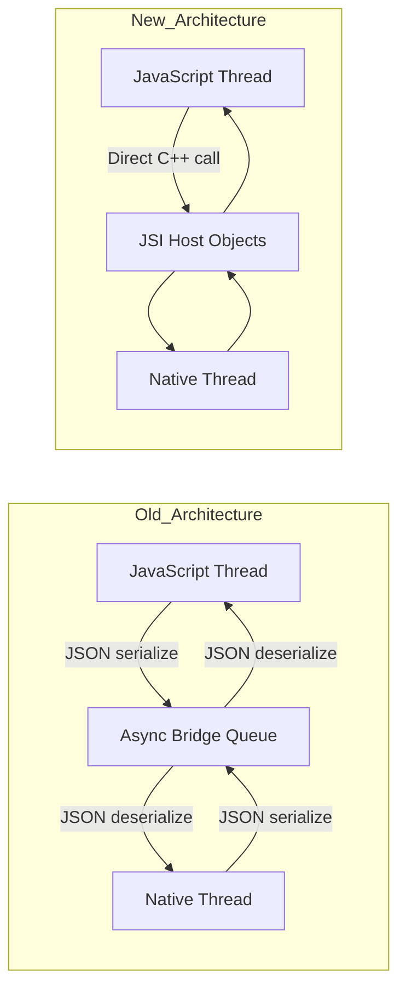
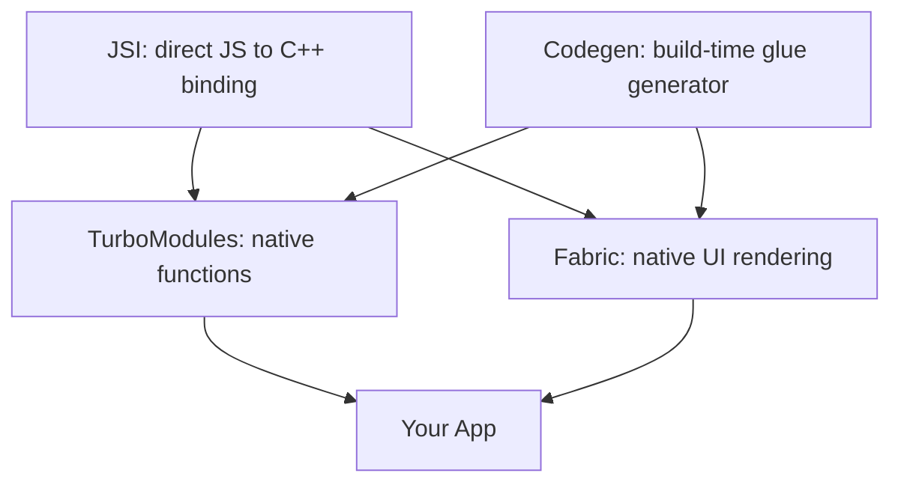
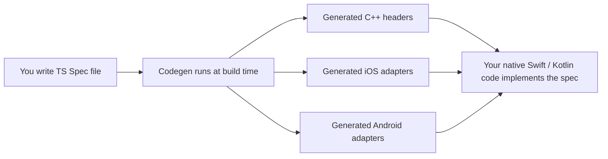
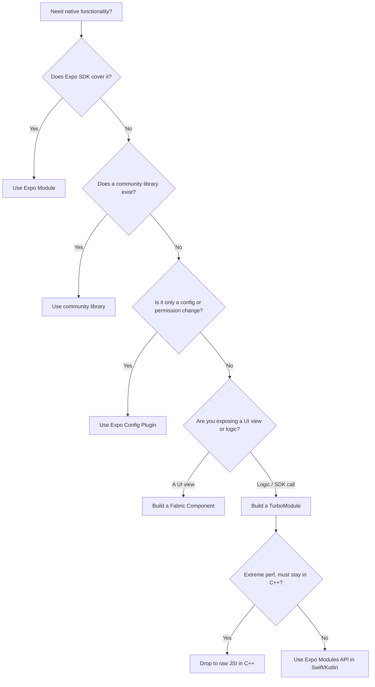
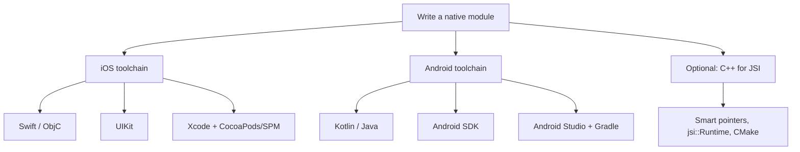
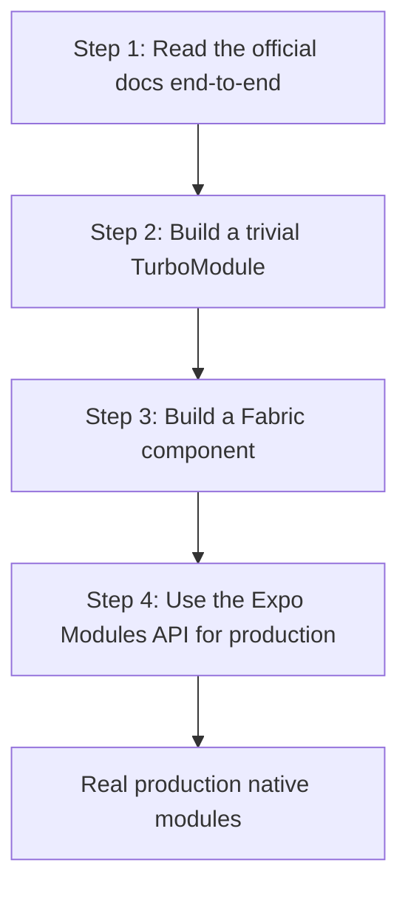

# Moduli Nativi e la Nuova Architettura

> JSI, Fabric, TurboModules e Codegen — cosa sono e quando è necessario scriverne uno proprio.

---

## Table of Contents

1. [The New Architecture](#1-the-new-architecture)
2. [When to Write a Native Module](#2-when-to-write-a-native-module)
3. [Skills Needed](#3-skills-needed)
4. [Recommended Path](#4-recommended-path)

---

## 1. La Nuova Architettura

### Il Problema del Vecchio Bridge

Per capire *perché* React Native ha ricostruito le proprie componenti interne, occorre capire cosa fosse lento.

Nella vecchia architettura, JavaScript e codice nativo vivevano in due mondi separati. Il tuo JavaScript gira in un engine JS (Hermes o JSC). La tua UI, la tua radio Bluetooth, la tua fotocamera — tutto questo vive nel mondo nativo (Swift/Objective-C su iOS, Kotlin/Java su Android). Questi due mondi non condividono la memoria e non parlano la stessa lingua. Così, ogni volta che JS voleva dire al nativo "esegui il render di questa view" o "chiama questa funzione Bluetooth", la richiesta veniva serializzata in una stringa JSON, depositata su una coda di messaggi asincrona (il famoso "bridge") e deserializzata dall'altra parte. La risposta tornava indietro nello stesso modo.

Immaginalo come due persone in stanze separate che comunicano facendo scorrere bigliettini scritti a mano sotto una porta. Funziona, ma è lento, è asincrono per impostazione predefinita (fai scorrere un biglietto e aspetti — non puoi ottenere una risposta istantanea) e non puoi avere una conversazione in tempo reale.

Tre proprietà di quel bridge causavano problemi reali e visibili:

- **Tutto era async.** Anche una domanda con una risposta istantanea ("quanto è larga questa view?") imponeva un round trip. Non potevi bloccarti e ottenere il valore *subito*.
- **Tutto veniva serializzato.** Passare un'immagine da 5 MB significava convertire 5 MB in stringa JSON e ri-parsarla — puro overhead.
- **Era una singola coda condivisa.** Un traffico intenso (scroll veloce, molti tocchi) congestionava il bridge e i frame venivano persi.

> **Analogia che resta impressa:** il vecchio bridge è come chiamare una REST API per *ogni* chiamata di funzione tra i tuoi stessi moduli — JSON in ingresso, JSON in uscita, su una rete che non puoi evitare. La Nuova Architettura è come sostituire quelle chiamate HTTP con una normale chiamata di funzione in-process.

Sul web non hai mai avuto questo problema: il tuo JS *è* lo stesso processo del DOM. Chiamare `element.offsetWidth` è istantaneo e sincrono. La Nuova Architettura di React Native è, in gran parte, uno sforzo per rendere altrettanto immediato anche il nativo.



La Nuova Architettura si regge su quattro pilastri. Ecco la mappa prima di esaminarli uno a uno:



| Pilastro | Cosa sostituisce | Compito in una riga |
| --- | --- | --- |
| **JSI** | Il bridge JSON in sé | Permette a JS di tenere e chiamare oggetti C++ direttamente, in modo sincrono |
| **TurboModules** | `NativeModules` | *Funzioni/logica* nativa esposte a JS (lazy + tipizzate) |
| **Fabric** | Il renderer "Paper" | *View di UI* native esposte a React |
| **Codegen** | Glue del bridge scritto a mano | Genera lo scaffolding C++/nativo dai tuoi spec TS |

### JSI: JavaScript Interface

JSI è il fondamento di tutto ciò che è nuovo. È un sottile strato C++ che permette a JavaScript di tenere riferimenti diretti a oggetti C++ — e di chiamarne i metodi in modo sincrono. Nessuna serializzazione. Nessun bridge. Nessuna coda.

Il meccanismo: JSI espone il concetto di **Host Object** — un oggetto C++ che JavaScript tratta come un normale oggetto JS. Quando il tuo JS legge una property o chiama un metodo su di esso, quell'accesso viene instradato direttamente nel codice C++ all'interno dello stesso processo. Non viene mai creata alcuna stringa JSON.

Sul web, questo è simile al modo in cui il tuo codice JS può chiamare `document.createElement()` e ottenere indietro un riferimento a un nodo DOM reale e vivo, non una sua copia serializzata. Tieni l'oggetto reale e lo manipoli direttamente. JSI offre a React Native lo stesso tipo di binding diretto agli oggetti nativi.

```tsx
// Conceptual: what JSI enables under the hood.
// JS can now hold a direct reference to a native (C++-backed) object.
const nativeModule = global.__turboModuleProxy('MyModule');

// This call goes directly to C++ -> Swift/Kotlin, no bridge, no JSON.
// It can return synchronously because there is no async queue in between.
const result = nativeModule.computeExpensiveThing(data);
```

Dal "binding diretto al C++" derivano due conseguenze:

- **Le chiamate sincrone diventano possibili.** Un metodo può restituire un valore immediatamente, come una normale funzione. (Il vecchio bridge fisicamente non poteva farlo.)
- **L'engine JS diventa intercambiabile.** Poiché JSI è un'astrazione su "un qualche runtime JS", React Native può girare su Hermes, JSC o persino V8 senza modificare il resto del sistema.

> **Pro tip:** Non scriverai quasi mai JSI/C++ grezzo di tua mano. Pensa a JSI come all'*impianto idraulico*. TurboModules, Fabric e Codegen sono gli *elettrodomestici* costruiti sopra di esso con cui interagisci realmente. Se il README di una libreria si vanta di essere "JSI-based", di solito significa semplicemente "veloce, sincrono, senza overhead del bridge".

### TurboModules: i Moduli Nativi, Ricostruiti

I TurboModules sostituiscono il vecchio sistema `NativeModules`. Un TurboModule è il modo in cui la Nuova Architettura espone **logica nativa** (una funzione, una chiamata a un SDK, la lettura di un sensore) a JavaScript. Due miglioramenti chiave rispetto al vecchio sistema:

**1. Lazy loading.** I vecchi moduli nativi venivano *tutti* inizializzati all'avvio dell'app, che li usassi o meno — ognuno pagava un costo di inizializzazione prima ancora che apparisse la tua prima schermata. I TurboModules si caricano al primo accesso. Se la tua app registra 40 moduli nativi ma la schermata corrente ne usa solo 3, paghi solo per quei 3. Questo migliora direttamente i tempi di avvio, il che conta molto sui dispositivi Android di fascia bassa.

**2. Type safety tramite Codegen.** Ogni TurboModule è descritto da un file di spec in TypeScript. Codegen legge questo spec e ne genera interfacce C++/native tipizzate. Se il tuo JS chiama un metodo con i tipi di argomento sbagliati, ottieni un errore in *build-time* anziché un misterioso crash a runtime nel profondo del codice nativo.

```tsx
// src/NativeMyModule.ts — a TurboModule spec file.
// By convention the filename starts with "Native" so Codegen finds it.
import type { TurboModule } from 'react-native';
import { TurboModuleRegistry } from 'react-native';

// The Spec interface is the contract between JS and native.
// Codegen turns each method below into a typed native signature.
export interface Spec extends TurboModule {
  multiply(a: number, b: number): number;        // synchronous, returns a number
  getDeviceName(): Promise<string>;              // async, returns a Promise
}

// getEnforcing throws a clear error if the native module isn't linked,
// instead of silently giving you `undefined` at the first call site.
export default TurboModuleRegistry.getEnforcing<Spec>('MyModule');
```

| Aspetto | Vecchi `NativeModules` | Nuovi TurboModules |
| --- | --- | --- |
| Caricamento | Tutti eagerly all'avvio | Lazy al primo accesso |
| Controllo dei tipi | Nessuno (crash a runtime) | A compile-time tramite Codegen |
| Chiamate | Sempre async (bridge) | Sync *e* async supportate |
| Trasferimento dati | Serializzato in JSON | Diretto via JSI |

> **Gotcha:** Un metodo TurboModule sincrono gira *sul JS thread*. Se fai qualcosa di genuinamente lento (un parsing di file da 200 ms) in modo sincrono, blocchi il JS thread e congeli la tua UI. Usa i metodi sincroni per lookup veloci; usa metodi che restituiscono `Promise` (`AsyncFunction`) per qualsiasi cosa pesante.

### Fabric: il Nuovo Renderer

Fabric sostituisce il vecchio sistema di rendering (chiamato "Paper" a posteriori). Là dove i TurboModules espongono *logica* nativa, Fabric espone *view di UI* native a React ed è responsabile di trasformare il tuo albero di `<View>`/`<Text>` in veri widget nativi. I vantaggi più grandi:

- **Layout e misurazione sincroni.** Nella vecchia architettura, misurare una view richiedeva un round trip asincrono. Fabric può misurare in modo sincrono, il che elimina lo sfarfallio del layout che a volte vedevi al primissimo render (dove il contenuto appariva brevemente nel posto sbagliato, per poi scattare in posizione).
- **Supporto a React concorrente.** Fabric è progettato per funzionare con le funzionalità di React 18 come `useTransition`, `useDeferredValue` e `Suspense`. Il vecchio renderer non poteva supportarle perché era fondamentalmente asincrono e non poteva interrompere o ri-prioritizzare il lavoro.
- **Rendering multi-thread.** Fabric può creare e aggiornare il suo **shadow tree** (la copia leggera in C++ della gerarchia delle view usata per calcolare il layout) su qualsiasi thread, non solo su un "shadow thread" dedicato.

Fabric esegue il render in tre fasi. Comprendere questo ciclo di vita ti aiuta a ragionare su quando props e layout finiscono effettivamente sullo schermo:


- **Render** — React esegue i tuoi componenti e produce un albero di elementi (puro JS).
- **Commit** — Fabric costruisce/diffa lo shadow tree ed esegue il layout (Yoga, in C++) per assegnare a ogni nodo una posizione e una dimensione.
- **Mount** — il risultato calcolato viene applicato alle view native effettive sul UI thread.

Sul web, questo è analogo al modo in cui il renderer concorrente di React 18 ha sostituito il vecchio `ReactDOM.render` sincrono. L'engine sottostante doveva cambiare prima che le nuove funzionalità potessero esistere. Nel browser, il tuo target di "mount" è il DOM; in Fabric, sono oggetti nativi `UIView`/`android.view.View`.

### Codegen: il Generatore di Glue

Codegen è lo strumento di build-time che legge i tuoi file di spec TypeScript e genera lo scaffolding C++ che connette JS al codice nativo. Tu scrivi uno spec `.ts` e Codegen produce:

- File header C++ con le firme dei metodi corrette
- Codice adapter specifico per piattaforma per iOS (Objective-C++) e Android (JNI/C++)
- Validazione dei tipi che intercetta le incongruenze tra il tuo contratto JS e l'implementazione nativa a compile-time

Ecco dove si colloca Codegen nella build:



Perché conta: lo spec TypeScript diventa l'**unica fonte di verità**. I tipi che dichiari in JS e i tipi che il codice nativo deve implementare sono garantiti coerenti, perché entrambi i lati sono generati dallo stesso file. Cambia lo spec, ricompila, e qualsiasi codice nativo che non corrisponde più non compila.

Questo è il pezzo che rende pratica la Nuova Architettura. Senza di esso, dovresti scrivere a mano il codice bridge C++ per ogni modulo — che è esattamente ciò che i primi adottanti dovevano fare, ed era penoso e soggetto a errori.

> **Quando gira Codegen?** Gira automaticamente durante la build nativa (`pod install` su iOS, la build Gradle su Android, o `expo prebuild`). Normalmente non lo invochi mai a mano — ma quando una build nativa fallisce lamentando un header generato mancante, una cache di Codegen obsoleta è un sospettato primario. Una rebuild pulita di solito risolve.

> **Fatto chiave:** La Nuova Architettura è quella predefinita a partire da Expo SDK 52 e React Native 0.76+. Se inizi un nuovo progetto oggi, ci sei già sopra — bridgeless mode, Fabric e TurboModules sono attivi out of the box. Non devi attivarli esplicitamente.

---

## 2. Quando Scrivere un Modulo Nativo

### La Regola del 95%

Ecco la verità onesta: **la maggior parte degli sviluppatori React Native non ha mai bisogno di scrivere un modulo nativo.** L'ecosistema copre già la stragrande maggioranza dei casi d'uso:

- **Gli Expo Modules** gestiscono fotocamera, file system, notifiche, haptics, sensori, archiviazione sicura, posizione e decine di altri.
- **Le librerie della community** come `react-native-reanimated`, `react-native-mmkv`, `react-native-ble-plx` e `react-native-vision-camera` coprono domini performance-critical che sarebbero penosi da costruire da soli.
- **Gli Expo Config Plugins** ti permettono di modificare la configurazione del progetto nativo (permessi, entitlement, impostazioni di build) *senza scrivere alcun codice nativo*.

Prima di scrivere una singola riga di Swift o Kotlin, cerca nella documentazione dell'Expo SDK e nella React Native Directory (reactnative.directory). Davvero. Il costo di *mantenere* il proprio modulo nativo attraverso le versioni dei sistemi operativi iOS e Android, gli upgrade di React Native e i salti di versione dell'Expo SDK è molto più alto di quanto la gente si aspetti — ogni release annuale di una piattaforma è una potenziale rottura di cui ora sei responsabile.

> **Riformula la decisione:** scrivere il modulo è la parte economica. *Possederlo* per tre anni attraverso sei release di OS e quattro upgrade di RN è la parte costosa. Considera sempre nel prezzo la manutenzione, non solo la costruzione iniziale.

### Il 5% in cui Devi Andare Nativo

Ci sono casi legittimi in cui hai genuinamente bisogno di scriverne uno tuo:

**1. SDK proprietari.** La tua azienda ha una libreria C++ interna per il rilevamento delle frodi, oppure un fornitore ti consegna un `.xcframework` (iOS) e un `.aar` (Android) closed-source. Non esiste alcun wrapper della community e devi esporlo a JS. Questo è il motivo legittimo più comune.

**2. Codice nativo nell'hot path.** Stai costruendo DSP audio in tempo reale, una pipeline di image-processing personalizzata, o comunicazione BLE con uno specifico protocollo binario ad alta frequenza. JavaScript, anche con Hermes, non riesce a soddisfare i requisiti di latenza o throughput, e il lavoro deve restare nel nativo (spesso C++).

**3. UI nativa personalizzata.** Devi avvolgere un componente di UI specifico della piattaforma — una mappa nativa con overlay personalizzati, un player video accelerato via hardware, o un widget OEM che non ha equivalente in React Native. Questo è un **componente Fabric** anziché un TurboModule, perché stai esponendo una *view*, non una *funzione*.

Usa questo albero decisionale prima di impegnarti:



| Il tuo bisogno | Strumento giusto | Perché |
| --- | --- | --- |
| Fotocamera, notifiche, storage, sensori | Expo Module | Già costruito, mantenuto per te |
| Animazioni ad alte prestazioni, key-value store veloce | Libreria della community | Collaudata, JSI-based |
| Aggiungere un permesso / entitlement / build flag | Config Plugin | Nessun codice nativo da mantenere |
| Esporre a JS una funzione di un SDK di un fornitore | TurboModule (Expo Modules API) | Tipizzato, lazy, gestibile |
| Avvolgere un widget di UI nativo | Componente Fabric | Si integra con il renderer |
| Hot path C++ in tempo reale | JSI grezzo | Massimo throughput, nessun overhead |

### Un Esempio Reale: Quando Superi la Soglia

Supponi di star integrando un SDK proprietario di audio-processing che il tuo team hardware ha costruito in C++. Nessun wrapper pubblico esisterà mai per esso. Ecco come appare l'integrazione ad alto livello.

```tsx
// Step 1: Define the TypeScript spec — the contract.
// src/NativeAudioProcessor.ts
import type { TurboModule } from 'react-native';
import { TurboModuleRegistry } from 'react-native';

export interface Spec extends TurboModule {
  initialize(sampleRate: number, bufferSize: number): boolean; // sync setup
  processBuffer(inputBuffer: number[]): number[];              // hot path
  setParameter(name: string, value: number): void;            // fire-and-forget
  dispose(): void;                                            // cleanup
}

export default TurboModuleRegistry.getEnforcing<Spec>(
  'AudioProcessor'
);
```

```tsx
// Step 2: Use it in your component — it looks like any TS module.
import { useEffect } from 'react';
import AudioProcessor from './NativeAudioProcessor';

function AudioScreen() {
  useEffect(() => {
    // Synchronous call returning a boolean — only possible on the New Arch.
    const ok = AudioProcessor.initialize(44100, 512);
    if (!ok) console.error('Failed to initialize audio processor');

    // Always release native resources on unmount, or you leak them.
    return () => AudioProcessor.dispose();
  }, []);

  // ...render UI that calls AudioProcessor.processBuffer / setParameter
}
```

Le implementazioni native (Swift per iOS, Kotlin per Android) si collegano poi alla tua libreria C++ e implementano i metodi dello spec. Codegen gestisce il glue tra lo spec e il tuo codice nativo, così il contratto JS qui sopra e il codice nativo hanno la garanzia di corrispondere nei tipi.

> **Errore comune:** Ricorrere a un modulo nativo quando una soluzione JavaScript funziona benissimo. `react-native-reanimated` esegue animazioni sul UI thread *senza che tu scriva alcun codice nativo*. `expo-camera` avvolge l'intera API della fotocamera. Verifica cosa esiste prima di impegnarti nel peso manutentivo del nativo — il miglior modulo nativo è quello che non hai dovuto scrivere.

> **Sull'equivalente web:** È come decidere se scrivere un'estensione del browser / native messaging host personalizzata invece di usare una libreria JS esistente. Costruisci la pesante cosa nativa solo quando nessuna libreria può raggiungere la capacità di cui hai bisogno.

---

## 3. Competenze Necessarie

### La Verità Scomoda

Scrivere moduli nativi significa scrivere codice nativo. Non c'è modo di aggirarlo. Devi essere competente nei linguaggi delle piattaforme, nei sistemi di build e negli IDE — e, fatto cruciale, ti servono *entrambe* le piattaforme, perché un modulo che funziona solo su iOS è mezzo modulo. Ecco cosa significa davvero, per piattaforma.



### iOS

- **Swift** (oppure Objective-C per codebase più datate). Ti servono i value type vs reference type, gli optional, le closure e il modello di concorrenza (`async/await`, actor). L'Expo Modules API è Swift-first, quindi Swift è la scelta pratica.
- **UIKit** per avvolgere view native esistenti. La conoscenza di SwiftUI aiuta per i componenti più recenti, ma la maggior parte dei wrapper di view di React Native poggia ancora su UIKit sotto il cofano.
- **Xcode.** Qui debuggerai i crash nativi, leggerai gli stack trace nativi e ti scontrerai con code signing, entitlement e capability. Non ci sono scorciatoie che evitino l'IDE.
- **CocoaPods e/o SPM.** React Native usa CocoaPods per le dipendenze iOS. Devi capire `Podfile`, `podspec` e come funziona il linking.

```bash
# Typical iOS native module workflow
cd ios
pod install                 # links native deps AND runs Codegen
open MyApp.xcworkspace      # open the WORKSPACE, not the .xcodeproj!

# Common gotcha: after editing the Podfile or adding a native dep, run:
cd ios && pod install && cd ..
# Use pod install (respects your lockfile), NOT pod update
# (which silently upgrades EVERY dependency and can break your build).
```

> **L'errore da principiante più comune in assoluto su iOS:** aprire `MyApp.xcodeproj` invece di `MyApp.xcworkspace`. Il `.xcworkspace` è quello che conosce i tuoi CocoaPods. Apri quello sbagliato e nulla si collega.

### Android

- **Kotlin** (oppure Java per il codice legacy). Kotlin è il default per il nuovo lavoro Android ed è ciò che usa l'Expo Modules API. Ti servono le coroutine, le extension function, la null safety e una comprensione del ciclo di vita di Android.
- **Android SDK.** Activity, Fragment, View, il sistema `Context`, il modello dei permessi a runtime, gli intent. Anche avvolgere un SDK semplice ti trascina in questi temi.
- **Gradle.** Il sistema di build di Android. Modificherai file `build.gradle`, gestirai dipendenze e decifrerai messaggi di errore da 200 righe. La maggior parte degli sviluppatori web trova questa la parte singola più dolorosa del lavoro nativo.
- **Android Studio.** L'equivalente Android di Xcode: debug dei crash nativi, ispezione della gerarchia delle view, profiling delle prestazioni.

```bash
# Typical Android native module workflow:
# In Android Studio: File -> Open -> select the android/ directory

# Common gotcha: Gradle caches very aggressively. When a build breaks
# for no obvious reason, clean first before debugging deeper:
cd android && ./gradlew clean && cd ..

# Nuclear option when Gradle is truly stuck (wipes caches + build output):
cd android
./gradlew clean
rm -rf .gradle
rm -rf app/build
cd ..
```

| | iOS | Android |
| --- | --- | --- |
| Linguaggio | Swift / Objective-C | Kotlin / Java |
| Framework UI | UIKit (un po' di SwiftUI) | Sistema View di Android |
| IDE | Xcode | Android Studio |
| Build / dipendenze | CocoaPods, SPM | Gradle |
| Più doloroso per gli sviluppatori web | Signing & provisioning | Messaggi di errore di Gradle |

### Basi di C++ per JSI

Se stai scrivendo un *modulo JSI grezzo* (un binding C++ diretto per le massime prestazioni), ti serve in aggiunta:

- Sintassi C++ di base (header, file sorgente, namespace)
- Smart pointer (`std::shared_ptr`, `std::unique_ptr`) e un'idea della gestione manuale della ownership della memoria
- Comprensione dell'API `jsi::Runtime` (come leggi/scrivi valori JS dal C++)
- CMake per build native cross-platform

La maggior parte degli sviluppatori non ha bisogno di nulla di tutto questo. I TurboModules con Swift/Kotlin sono sufficienti per circa il 99% del lavoro sui moduli nativi. Il C++ a livello JSI serve per quando stai costruendo qualcosa come un motore di storage (`react-native-mmkv`) o un runtime di animazioni (`react-native-reanimated`) — un core condiviso che deve girare in modo identico e veloce su entrambe le piattaforme.

> **Valutazione onesta:** Se non hai mai aperto Xcode o Android Studio, metti in conto 2–4 settimane di apprendimento prima di tentare il tuo primo modulo nativo. La parte React Native è quella facile. Il tooling specifico della piattaforma, il debugging e i sistemi di build sono dove vive la vera complessità — e dove perderai più tempo.

### Il Vantaggio dell'Expo Modules API

L'Expo Modules API abbassa significativamente la barriera. Invece di implementare interfacce TurboModule grezze in Objective-C++ e Java/JNI, scrivi Swift e Kotlin idiomatici contro un'API pulita e dichiarativa. Sotto il cofano usa comunque TurboModules e Fabric (e JSI) — semplicemente nasconde il boilerplate.

```tsx
// ios/MyModule.swift — using the Expo Modules API
import ExpoModulesCore

public class MyModule: Module {
  // A declarative "definition" describes what you expose to JS.
  public func definition() -> ModuleDefinition {
    Name("MyModule")                                   // JS-visible name

    Function("multiply") { (a: Double, b: Double) -> Double in
      return a * b                                     // runs synchronously
    }

    AsyncFunction("getDeviceName") { () -> String in
      return UIDevice.current.name                     // returns a Promise to JS
    }
  }
}
```

```tsx
// android/src/main/java/MyModule.kt — using the Expo Modules API
package com.myapp.mymodule

import expo.modules.kotlin.modules.Module
import expo.modules.kotlin.modules.ModuleDefinition

class MyModule : Module() {
  // Same declarative shape as iOS — the API is intentionally symmetric.
  override fun definition() = ModuleDefinition {
    Name("MyModule")

    Function("multiply") { a: Double, b: Double ->
      a * b
    }

    AsyncFunction("getDeviceName") {
      android.os.Build.MODEL
    }
  }
}
```

Nota come le definizioni iOS e Android si rispecchino a vicenda — stessi nomi di metodo, stesse forme. Quella simmetria è tutto il punto: ragioni su un solo modello mentale e lo applichi due volte. Questo è drasticamente più semplice dell'approccio TurboModule grezzo, ed è ciò che usare per il lavoro di produzione, a meno che tu non abbia una ragione specifica per scendere a un livello più basso.

| Approccio | Cosa scrivi | Boilerplate | Quando usarlo |
| --- | --- | --- | --- |
| JSI grezzo (C++) | C++ contro `jsi::Runtime` | Massimo | Solo per core condiviso performance-critical |
| TurboModule grezzo | Obj-C++ + Java/JNI | Alto | Raramente — per imparare, o casi speciali |
| Expo Modules API | Swift + Kotlin | Basso | **Default per la produzione** |

> **Pro tip:** Anche se in un esercizio di apprendimento rilasci TurboModule grezzi, migra i moduli reali di produzione all'Expo Modules API. La quantità di codice glue che elimina è la differenza tra un modulo che una sola persona può mantenere e uno che richiede uno specialista del nativo.

---

## 4. Percorso Consigliato

### Una Sequenza di Apprendimento Concreta

Non cercare di imparare tutto in una volta. La Nuova Architettura è un argomento profondo, e cercare di assorbire JSI, Fabric, TurboModules e Codegen contemporaneamente porta alla confusione. Imparala nell'ordine qui sotto — ogni passo costruisce il modello mentale di cui il successivo ha bisogno.



### Passo 1: Leggi la Documentazione Ufficiale dall'Inizio alla Fine

Il team di React Native ha riscritto la documentazione sull'architettura nel 2024. Leggi queste pagine, nell'ordine:

1. **Architecture Overview** — comprendi i quattro pilastri (JSI, Fabric, TurboModules, Codegen)
2. **Rendering Pipeline** — come Fabric esegue il render: le fasi Render → Commit → Mount
3. **Threading Model** — quale lavoro avviene su quale thread (JS thread, UI thread, background)

Non leggere in modo superficiale. Leggi ogni pagina. La documentazione ora è scritta davvero bene e spiega il *perché* dietro ogni decisione di design, non solo la superficie dell'API. Leggerla prima ti risparmierà giorni di confusione in seguito.

### Passo 2: Costruisci un TurboModule Banale

Inizia con qualcosa di imbarazzantemente semplice. Un modulo che prende due numeri e ne restituisce la somma. L'obiettivo non è costruire qualcosa di utile — è sperimentare l'*intera pipeline* dall'inizio alla fine almeno una volta:

1. Scrivi lo spec TypeScript
2. Esegui Codegen e guarda davvero cosa produce
3. Implementa il lato nativo su iOS (Swift)
4. Implementa il lato nativo su Android (Kotlin)
5. Chiamalo da un componente React
6. Verifica che funzioni su entrambe le piattaforme

```bash
# If using Expo, scaffold a local module (lives inside your app):
npx create-expo-module@latest --local my-turbo-module

# This generates the full structure for you:
# modules/my-turbo-module/
#   src/            <- TypeScript spec and JS interface
#   ios/            <- Swift implementation
#   android/        <- Kotlin implementation
#   expo-module.config.json
```

> **Errore comune:** Cercare di integrare un SDK complesso di un fornitore come *primo* modulo nativo. Se il tuo primo modulo è anche la tua prima volta con Xcode, non sarai in grado di capire se un bug è nel codice del tuo modulo, nella tua configurazione di build, nel tuo linking, o semplicemente nella tua incomprensione della piattaforma. Inizia banale. Conferma che la pipeline funziona. Poi aggiungi complessità un livello alla volta.

### Passo 3: Costruisci un Componente Fabric

Un componente Fabric è una view di UI nativa esposta a React. Questo è più difficile di un TurboModule perché ora hai a che fare con la pipeline di rendering, le props delle view e la gestione degli eventi — non solo chiamate di funzione.

Inizia con una view nativa semplice — magari un riquadro colorato che accetta una prop `color` e scatena un evento `onPress`. Anche qui, l'obiettivo è comprendere il macchinario, non costruire qualcosa di rilasciabile:

1. Definisci lo spec del componente con Codegen
2. Implementa la view nativa su iOS
3. Implementa la view nativa su Android
4. Usalo come componente React con props ed eventi tipizzati

Questo passo ti insegna come funziona lo shadow tree di Fabric, come le props fluiscono da JS giù nelle view native, e come gli eventi risalgono fino a JS. Sono esattamente le parti mobili che debuggerai nel lavoro reale sui componenti.

> **Perché prima TurboModule, poi Fabric?** Un TurboModule è "chiama una funzione nativa e ottieni indietro un valore" — un singolo concetto. Un componente Fabric ci aggiunge sopra props, layout, ciclo di vita ed eventi. Imparare prima quello più semplice significa che ogni nuova idea poggia su basi solide.

### Passo 4: Usa l'Expo Modules API per la Produzione

Una volta compresi i concetti sottostanti dei Passi 2 e 3, passa all'Expo Modules API per il lavoro reale. Astrae il boilerplate continuando comunque a usare TurboModules e Fabric (e JSI) sotto il cofano — così il modello mentale che hai costruito si applica ancora; scrivi semplicemente molto meno glue.

L'Expo Modules API ti offre:

- Una singola API Swift/Kotlin invece di Objective-C++ e JNI
- Supporto integrato per view, eventi, oggetti condivisi e hook del ciclo di vita
- Integrazione con EAS Build e il sistema di config plugin di Expo
- Integrazione automatica di Codegen (non lo esegui a mano)

```bash
# The production workflow:

# 1. Create the module (standalone, publishable package)
npx create-expo-module@latest my-real-module

# 2. Write your Swift and Kotlin implementations
# 3. Add native SDK dependencies in the .podspec (iOS) / build.gradle (Android)

# 4. Regenerate native projects, then build & run on each platform
npx expo prebuild --clean   # regenerates ios/ and android/ from config
npx expo run:ios
npx expo run:android
```

### Cosa Saltare (Per Ora)

- **I binding JSI grezzi.** A meno che tu non stia costruendo un core C++ condiviso performance-critical, l'Expo Modules API o un TurboModule standard sono sufficienti — e di gran lunga più facili da mantenere.
- **Scrivere il proprio renderer Fabric.** Questo è territorio di internals profondi. Usa le API di wrapper dei componenti; non reimplementare il renderer.
- **Gli internals del bridgeless mode.** Ora è il default. Ne benefici automaticamente. Non hai bisogno di comprenderne l'implementazione per rilasciare app costruite sopra di esso.

| Argomento | Imparare ora? | Motivo |
| --- | --- | --- |
| TurboModule tramite Expo Modules API | Sì | Il tuo strumento quotidiano |
| Basi dei componenti Fabric | Sì | Necessario per UI nativa personalizzata |
| Comportamento di Codegen (cosa emette) | Superficialmente | Aiuta a debuggare i fallimenti di build |
| JSI grezzo / C++ | Più avanti / forse mai | Solo per core di prestazioni condivisi |
| Renderer Fabric personalizzato | No | Pura internals |

La Nuova Architettura è potente, ma ricorda cos'è: **infrastruttura**. Il tuo obiettivo come sviluppatore di app è comprenderla abbastanza bene da prendere decisioni informate — e da scrivere un modulo nativo quando (e *solo* quando) l'ecosistema genuinamente non copre le tue esigenze.

---