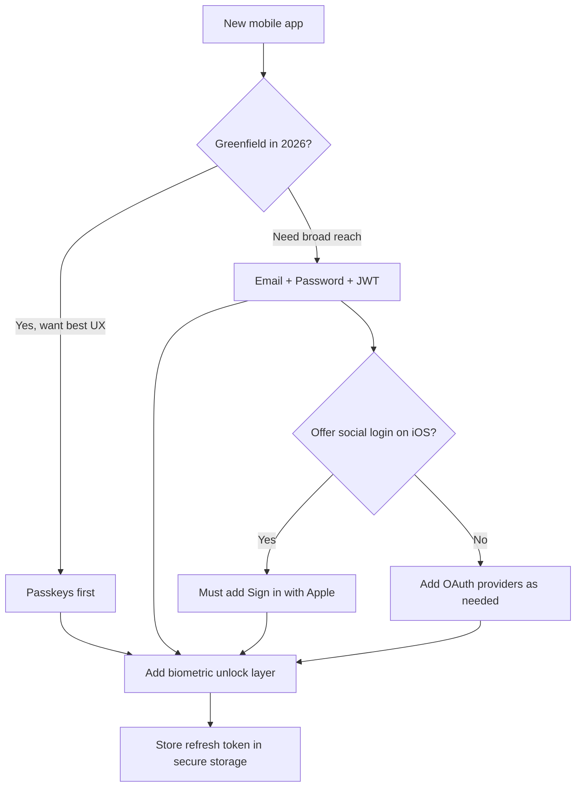
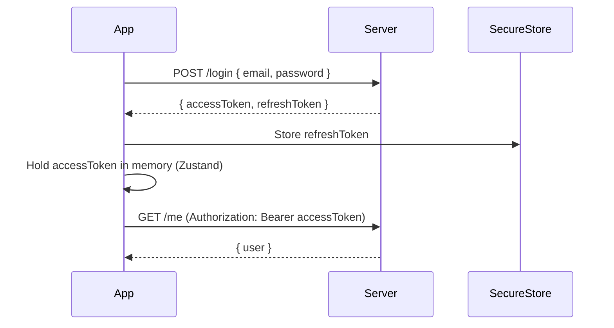
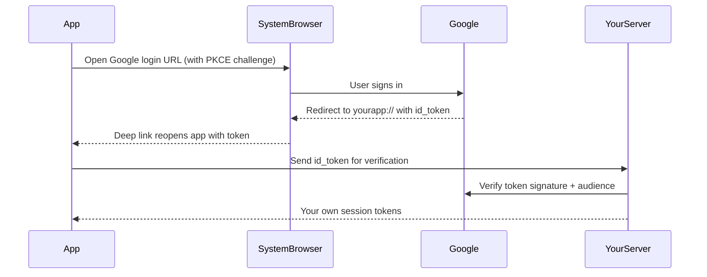
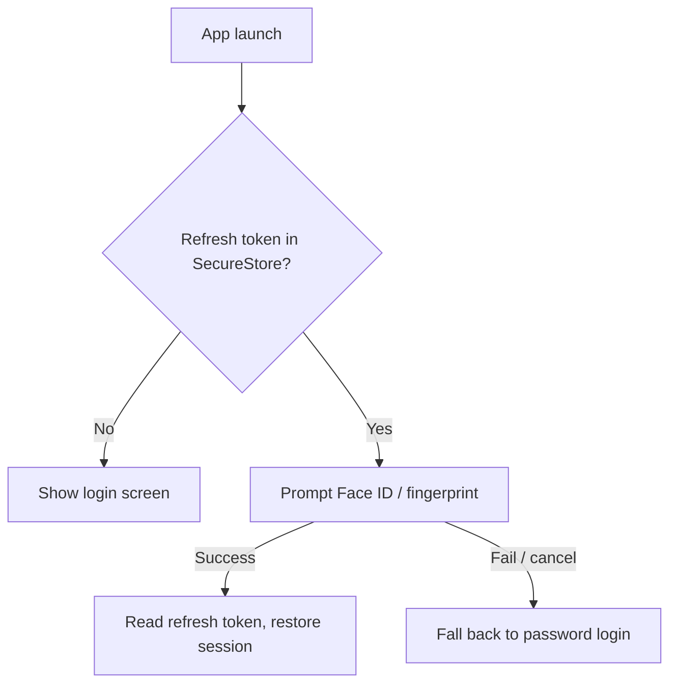
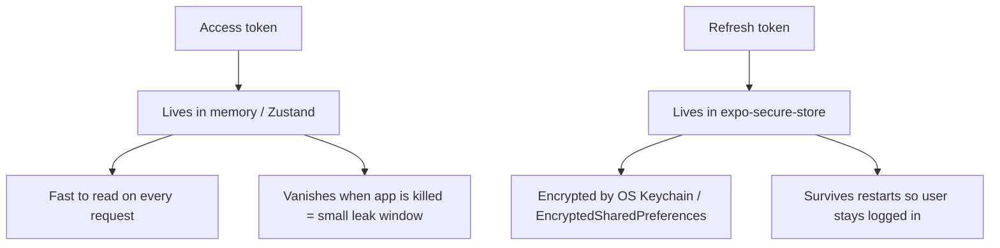
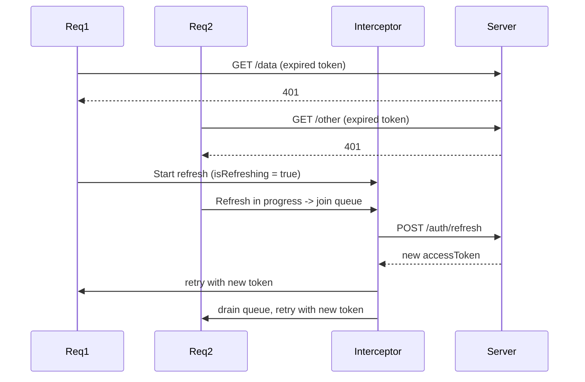
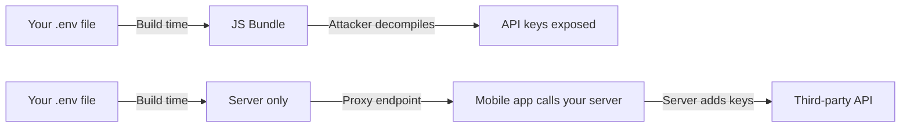
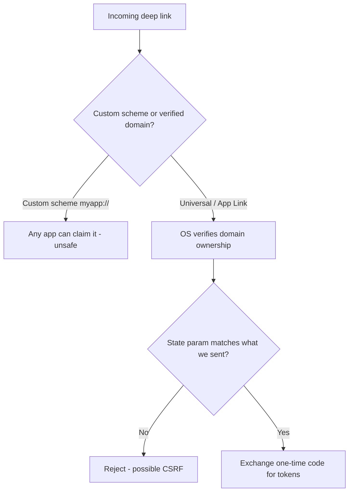

# Autenticazione e sicurezza: proteggere la tua app mobile

> Pattern di autenticazione, archiviazione dei token, sblocco biometrico e l'hardening di sicurezza che separa le app giocattolo da quelle in produzione.

---

## Table of Contents

1. [Auth Patterns](#1-auth-patterns)
2. [Auth Providers](#2-auth-providers)
3. [Token Handling](#3-token-handling)
4. [Security Hardening](#4-security-hardening)

---

## 1. Pattern di autenticazione

Sul web, l'autenticazione è relativamente semplice: imposti un cookie HttpOnly oppure conservi un JWT in memoria, e il browser gestisce il resto. Il mobile è tutta un'altra storia. Non c'è alcun sandbox del browser, nessun cookie jar gestito da un runtime affidabile. La tua app è un binario che risiede su un dispositivo che non controlli, in esecuzione su un OS che potrebbe essere rootato, patchato o tre versioni indietro. I pattern di autenticazione che scegli devono tenere conto di tutto questo.

### Perché l'autenticazione su mobile è fondamentalmente diversa

Pensa al web browser come a un appartamento in affitto con un padrone di casa severo. Il padrone di casa (il browser) impone regole che non puoi aggirare: i cookie contrassegnati come `HttpOnly` sono invisibili a JavaScript, i cookie `Secure` viaggiano solo su HTTPS, e la same-origin policy isola gli altri siti. Erediti gratuitamente un'enorme quantità di sicurezza solo per il fatto di vivere lì.

Un'app mobile è una casa che possiedi interamente su un terreno che non controlli. Non c'è alcun padrone di casa a imporre regole. Non ci sono cookie nel senso del browser: il tuo client HTTP (fetch/axios) non allega automaticamente le credenziali, non le persiste e non le fa scadere. **Ora il browser sei tu.** Ogni garanzia che il web ti dava gratuitamente devi ricostruirla a mano: dove risiede il token, quando scade, come si rinnova e chi può leggerlo dal disco.

> **Modello mentale:** sul web, il runtime è la tua guardia del corpo. Su mobile, la guardia del corpo SEI TU, e il dispositivo dell'utente potrebbe lavorare contro di te (rootato, jailbroken, infestato da malware o ispezionato con un debugger). Presupponi che il dispositivo sia ostile e progetta di conseguenza.

Ecco il flusso decisionale ad alto livello che la maggior parte dei team segue quando sceglie un pattern di autenticazione:



Esaminiamo i pattern che contano, dal più comune a quello emergente.

### Email + Password con JWT

Il classico. L'utente invia le credenziali, il tuo server le convalida e restituisce un access token (a vita breve) più un refresh token (a vita lunga). Questa è la base che dovresti comprendere anche se non la implementi mai da zero.

Perché due token invece di uno? È un compromesso deliberato tra sicurezza e comodità:

- L'**access token** ha vita breve (minuti). Viene inviato a ogni richiesta API. Poiché scade in fretta, un access token trafugato è utile solo per una finestra di tempo minima.
- Il **refresh token** ha vita lunga (giorni/settimane). Viene usato *solo* per coniare nuovi access token, e risiede dietro il tuo storage più robusto. Viene trasmesso raramente, quindi raramente trapela.

È la stessa logica di un hotel: la tessera della tua camera (access token) scade al checkout e apre una sola porta, mentre il tuo passaporto alla reception (refresh token) è ciò che dimostra chi sei quando hai bisogno di una nuova tessera.



```tsx
// Simplified login flow
import * as SecureStore from "expo-secure-store";
import { useAuthStore } from "@/stores/auth";

async function login(email: string, password: string) {
  const res = await fetch(`${API_URL}/auth/login`, {
    method: "POST",
    headers: { "Content-Type": "application/json" },
    body: JSON.stringify({ email, password }),
  });

  if (!res.ok) {
    // Surface a generic error — never leak "wrong password" vs "no such user",
    // that tells an attacker which emails are registered.
    throw new Error("Invalid credentials");
  }

  const { accessToken, refreshToken } = await res.json();

  // Refresh token goes to encrypted storage — never plain AsyncStorage
  await SecureStore.setItemAsync("refreshToken", refreshToken);

  // Access token stays in memory — fast, and dies with the process
  useAuthStore.getState().setAccessToken(accessToken);
}
```

> **Trappola:** non conservare mai l'access token in AsyncStorage o MMKV in chiaro. Su un dispositivo Android rootato, quelli sono file di testo in chiaro che risiedono in `/data/data/your.app/`. Usa `expo-secure-store` per qualsiasi cosa sensibile: usa il Keychain su iOS e EncryptedSharedPreferences su Android, entrambi supportati da cifratura a livello hardware.

> **Suggerimento da esperti:** restituisci sempre lo stesso errore generico per "utente non trovato" e "password errata". Messaggi diversi permettono a un aggressore di enumerare quali email hanno un account, un regalo gratuito di ricognizione prima di un attacco di credential stuffing.

### OAuth (Google, Apple, Facebook, GitHub)

OAuth su mobile non è la stessa cosa di OAuth sul web. Sul web reindirizzi l'intera pagina a Google, e Google reindirizza a un URL da cui leggi i parametri di query. Un'app mobile non ha alcuna "pagina" da reindirizzare né un URL di callback del server che l'OS ti restituirà automaticamente. Invece, usi `expo-auth-session`, che apre il login nel **browser di sistema** (non una falsa webview in-app: Google le blocca) e cattura il **ritorno via deep link** all'interno della tua app.

Ecco cosa succede davvero sotto il cofano:



```tsx
import * as AuthSession from "expo-auth-session";
import * as Google from "expo-auth-session/providers/google";

export function useGoogleAuth() {
  const [request, response, promptAsync] = Google.useAuthRequest({
    iosClientId: process.env.EXPO_PUBLIC_GOOGLE_IOS_CLIENT_ID,
    androidClientId: process.env.EXPO_PUBLIC_GOOGLE_ANDROID_CLIENT_ID,
  });

  useEffect(() => {
    if (response?.type === "success") {
      const { id_token } = response.params;
      // Send id_token to YOUR server — never trust it client-side alone.
      // The server verifies the signature, issuer, audience, and expiry
      // before it trusts the identity claim.
      authenticateWithServer(id_token);
    }
  }, [response]);

  return { promptAsync, isReady: !!request };
}
```

> **Perché inviarlo al tuo server?** L'`id_token` è una rivendicazione firmata da Google che dice "questo è l'utente X". Chiunque può costruire un JSON *falso* che afferma la stessa cosa. Solo il tuo server, verificando crittograficamente la firma di Google, può sapere che è autentico. Fidarsi di un `id_token` solo lato client è come accettare un passaporto fotocopiato: verificalo alla fonte.

### Sign in with Apple

Se la tua app offre un qualsiasi social login di terze parti su iOS, Apple richiede di offrire anche Sign in with Apple. Questo non è opzionale: la tua app verrà rifiutata in revisione senza di esso (App Store Review Guideline 4.8). La buona notizia: `expo-apple-authentication` lo rende indolore.

```tsx
import * as AppleAuthentication from "expo-apple-authentication";

async function signInWithApple() {
  const credential = await AppleAuthentication.signInAsync({
    requestedScopes: [
      AppleAuthentication.AppleAuthenticationScope.FULL_NAME,
      AppleAuthentication.AppleAuthenticationScope.EMAIL,
    ],
  });
  // credential.identityToken -> send to your server to verify
  return credential.identityToken;
}
```

> **Trappola:** Apple invia il nome e l'email dell'utente **una sola volta**, alla primissima autorizzazione. Se non li persisti in quel momento, sono persi per sempre (gli accessi successivi restituiscono `null` per quei campi). Salvali lato server al primo login.

### Sblocco biometrico

Questo è il concetto più frainteso in assoluto nell'autenticazione mobile, quindi leggilo due volte: **la biometria non è un metodo di autenticazione, è un cancello di comodità locale.**

Face ID non ti fa accedere al tuo server. Il tuo server non ha mai visto il volto dell'utente. Ciò che accade davvero è: l'utente si autentica *una volta* con credenziali reali, tu conservi il refresh token nello storage sicuro, e ai lanci successivi richiedi una scansione Face ID / impronta digitale prima di essere disposto a *rileggere quel token*. Il controllo biometrico è un lucchetto sul cassetto dove tieni la chiave, non la chiave stessa.



```tsx
import * as LocalAuthentication from "expo-local-authentication";
import * as SecureStore from "expo-secure-store";

async function biometricUnlock(): Promise<string | null> {
  const hasHardware = await LocalAuthentication.hasHardwareAsync();
  const isEnrolled = await LocalAuthentication.isEnrolledAsync();

  // Always check BOTH: the device may have a sensor but no enrolled face/finger
  if (!hasHardware || !isEnrolled) return null;

  const result = await LocalAuthentication.authenticateAsync({
    promptMessage: "Unlock to continue",
    fallbackLabel: "Use password", // shown after a failed scan
  });

  if (result.success) {
    return SecureStore.getItemAsync("refreshToken");
  }

  return null;
}
```

> **Suggerimento da esperti:** `expo-secure-store` può vincolare un valore archiviato direttamente all'autenticazione biometrica tramite `requireAuthentication: true`. In questo modo è l'OS stesso a rifiutarsi di rilasciare il valore senza una scansione riuscita, più robusto che controllare `authenticateAsync()` da soli e poi leggere una voce non protetta, perché non c'è alcun varco attraverso cui un aggressore possa intrufolarsi.

### Magic link e passkey

I magic link funzionano allo stesso modo del web: invia un'email, l'utente la clicca, il deep link apre l'app. Assicurati solo di convalidare il dominio del deep link con gli Universal Links (iOS) e gli App Links (Android), altrimenti qualsiasi app potrebbe registrare il tuo schema personalizzato e intercettare quel link (trattato nella Sezione 4).

Le passkey (WebAuthn) sono lo standard emergente. Al posto di una password, il dispositivo genera una coppia di chiavi pubblica/privata; la chiave privata non lascia mai l'hardware sicuro, e il login è una sfida crittografica sbloccata da Face ID o impronta digitale. Non c'è alcun segreto condiviso da phishare, far trapelare o riutilizzare. Sia iOS che Android ora le supportano nativamente, e librerie come `react-native-passkey` stanno maturando. Eliminano del tutto le password. Se stai avviando una nuova app nel 2026, le passkey meritano seria considerazione.

| Pattern | Attrito UX | Resistente al phishing | Quando usarlo |
|---|---|---|---|
| Email + Password | Medio | No | Base; ampia portata; controlli tutto |
| OAuth (Google/ecc.) | Basso | Parziale | Onboarding rapido, nessuna password da gestire |
| Sign in with Apple | Basso | Parziale | Obbligatorio su iOS se offri un qualsiasi social login |
| Magic link | Basso | Parziale | Senza password e senza nuova infrastruttura; utenti email-centrici |
| Passkey | Molto basso | Sì | Nuove app che vogliono il meglio in sicurezza + UX |
| Sblocco biometrico | Molto basso | N/A (cancello locale) | Da sovrapporre A QUALSIASI dei precedenti per il rientro |

---

## 2. Provider di autenticazione

Potresti costruire l'autenticazione da solo. Non dovresti. La superficie d'attacco — hashing delle password, rotazione dei token, rate limiting, verifica dell'email, recupero dell'account, gestione dello state OAuth, MFA — è enorme, e un solo errore crea una vera vulnerabilità. Questa è la situazione canonica del "non fare la crittografia in casa": le modalità di guasto sono silenziose (la tua app funziona benissimo fino al momento in cui vieni violato) e le conseguenze sono catastrofiche. Usa un provider.

Pensa a un provider di autenticazione come a un'azienda di casseforti blindate. *Potresti* saldare la tua cassaforte, ma una sola cerniera debole trascurata vanifica l'intera cosa, e non scoprirai il difetto finché qualcuno non lo sfrutta. Gli specialisti che non fanno altro che costruire casseforti faranno le cerniere a regola d'arte.

Ecco una classifica con un'opinione precisa per i progetti React Native.

### Clerk — la scelta migliore per la maggior parte delle app RN

Clerk è progettato appositamente per i framework frontend moderni e ha un SDK Expo di prim'ordine. Ottieni componenti UI predefiniti, gestione delle sessioni, autenticazione multifattore e supporto per le organizzazioni out of the box. La DX è eccezionale: per molte app puoi essere completamente autenticato in meno di un'ora.

```tsx
// app/_layout.tsx with Clerk
import { ClerkProvider, ClerkLoaded } from "@clerk/clerk-expo";
import { tokenCache } from "@/lib/token-cache";

export default function RootLayout() {
  return (
    <ClerkProvider
      publishableKey={process.env.EXPO_PUBLIC_CLERK_PUBLISHABLE_KEY!}
      tokenCache={tokenCache}
    >
      <ClerkLoaded>
        <Slot />
      </ClerkLoaded>
    </ClerkProvider>
  );
}
```

```tsx
// lib/token-cache.ts — Clerk needs you to provide secure storage
import * as SecureStore from "expo-secure-store";
import { TokenCache } from "@clerk/clerk-expo";

export const tokenCache: TokenCache = {
  async getToken(key: string) {
    return SecureStore.getItemAsync(key);
  },
  async saveToken(key: string, value: string) {
    await SecureStore.setItemAsync(key, value);
  },
};
```

> **Nota il pattern:** anche con un provider gestito, *tu* sei comunque il proprietario del luogo in cui il token risiede fisicamente. Clerk gestisce il protocollo; tu gli fornisci un adattatore di storage sicuro. Questo è il tema ricorrente dell'autenticazione mobile: il provider non può mai dare per scontato il tuo storage al posto tuo.

**Compromesso:** Clerk è un servizio ospitato con un piano gratuito fino a 10.000 MAU. Oltre quella soglia, paghi. Se il vendor lock-in ti preoccupa, guarda altrove.

### Supabase Auth — la migliore opzione open source

Supabase ti offre un database Postgres, realtime, storage e autenticazione in un unico pacchetto. Il modulo di autenticazione supporta email/password, OAuth, OTP via telefono e magic link, e si collega direttamente alla Row Level Security di Postgres in modo che il tuo database imponga "gli utenti possono leggere solo le proprie righe". È open source e self-hostable. Il piano gratuito è generoso (50.000 MAU).

```tsx
import { createClient } from "@supabase/supabase-js";
import AsyncStorage from "@react-native-async-storage/async-storage";

// Supabase wants a storage adapter; for the session it persists, use a
// secure-store-backed adapter rather than plain AsyncStorage in production.
export const supabase = createClient(URL, ANON_KEY, {
  auth: { storage: AsyncStorage, autoRefreshToken: true, persistSession: true },
});

const { data, error } = await supabase.auth.signInWithPassword({
  email,
  password,
});
```

### Firebase Auth — collaudato su larga scala

Firebase Auth esiste da anni e gestisce miliardi di autenticazioni. L'integrazione React Native tramite `@react-native-firebase/auth` è solida. Lo svantaggio: Firebase trascina con sé dipendenze native che rendono le build EAS più pesanti e richiedono un dev client personalizzato (non funziona in Expo Go), e resti vincolato all'ecosistema Google Cloud.

### Auth0 — la mossa enterprise

Auth0 (ora parte di Okta) è ciò a cui ricorri quando i requisiti includono SAML, LDAP o SSO enterprise. È eccessivo per la maggior parte delle app indie ma indispensabile se i tuoi utenti sono aziende i cui reparti IT esigono "il login con il nostro identity provider aziendale".

### Better Auth — il nuovo arrivato

Better Auth è una libreria di autenticazione più recente, TypeScript-first e self-hostable. È framework-agnostic e ha un ecosistema di plugin in crescita. Se vuoi il pieno controllo sul tuo server di autenticazione senza costruirlo da zero, vale la pena valutarla: ottieni la struttura di una libreria senza cedere i tuoi dati a un servizio ospitato.

| Provider | Hosting | Piano gratuito | Quando è la scelta migliore |
|---|---|---|---|
| Clerk | Ospitato | 10k MAU | Vuoi spedire il più velocemente possibile con una DX eccellente |
| Supabase | Ospitato o self-host | 50k MAU | Ti serve anche un database + storage in un unico stack |
| Firebase | Ospitato | Generoso | Sei già su Google Cloud / ti serve scala enorme |
| Auth0 | Ospitato | Piccolo | Requisiti di SSO enterprise, SAML, LDAP |
| Better Auth | Self-host | N/A (la tua infrastruttura) | Piena sovranità sui dati, controllo TypeScript |

> **Raccomandazione:** inizia con Clerk se vuoi spedire in fretta. Passa a Supabase se ti serve un backend integrato. Usa Better Auth o Supabase self-hosted se ti serve la piena sovranità sui dati. Qualunque cosa tu scelga, non lasciare che il "lo costruisco da solo" si reinsinui: il tempo che risparmi viene ripagato con gli interessi la prima volta che un audit di sicurezza o una violazione ti costringe a una riscrittura.

---

## 3. Gestione dei token

Ottenere i token è la parte facile. Gestirli correttamente lungo tutto il ciclo di vita dell'app — background, foreground, scaduti, revocati, molte richieste che partono insieme — è dove vive la maggior parte dei bug di autenticazione. Questa sezione è il punto in cui le app "funziona sulla mia macchina" si sgretolano silenziosamente in produzione.

### La regola d'oro

**Access token in memoria. Refresh token nello storage sicuro. Nulla di sensibile in AsyncStorage, MMKV o nel bundle JS.**

Sul web potresti conservare i token in un cookie HttpOnly e lasciare che il browser gestisca il refresh. In React Native non c'è alcun browser. Il browser sei tu. Gestisci ogni aspetto del ciclo di vita del token.

Perché queste case specifiche per ciascun token?



L'access token viene letto a *ogni singola richiesta*, quindi deve essere veloce: la memoria è istantanea. È anche il token più frequentemente esposto (viaggia costantemente sulla rete), quindi mantenerlo effimero limita il raggio d'azione se trapela. Il refresh token viene letto raramente ma deve sopravvivere ai riavvii dell'app, quindi si guadagna il suo posto in uno storage cifrato e supportato dall'OS.

### Store Zustand per lo state di autenticazione

```tsx
// stores/auth.ts
import { create } from "zustand";

interface AuthState {
  accessToken: string | null;
  user: User | null;
  setAccessToken: (token: string | null) => void;
  setUser: (user: User | null) => void;
  logout: () => void;
}

export const useAuthStore = create<AuthState>((set) => ({
  accessToken: null,
  user: null,
  setAccessToken: (token) => set({ accessToken: token }),
  setUser: (user) => set({ user }),
  logout: () => set({ accessToken: null, user: null }),
}));
```

> **Perché Zustand e non React Context per l'access token?** L'interceptor qui sotto deve leggere il token *fuori* dall'albero di render di React (`useAuthStore.getState()`), in una semplice funzione async. Context può essere letto solo all'interno di componenti/hooks. Uno store che puoi leggere in modo imperativo è esattamente ciò di cui un livello HTTP ha bisogno.

### Interceptor di auto-refresh

Il tuo access token scadrà. Quando lo fa, devi rinnovarlo silenziosamente usando il refresh token, ritentare la richiesta fallita e mettere in coda le altre richieste partite mentre il refresh era in corso. Questa è la parte più insidiosa dell'autenticazione lato client, e l'accodamento è la parte che la maggior parte dei tutorial sbaglia.

Il bug classico: dieci richieste partono insieme, ricevono tutte un `401`, e tutte e dieci tentano indipendentemente il refresh. Ora hai dieci chiamate di refresh concorrenti — e se il tuo server ruota i refresh token (dovrebbe), nove di esse falliscono perché la prima ha già invalidato il token. La correzione è un singolo flag `isRefreshing` più una coda: il primo `401` esegue il refresh, tutti gli altri aspettano in fila e vengono ritentati con il nuovo token.



```tsx
// lib/api.ts — Axios interceptor with refresh queue
import axios from "axios";
import * as SecureStore from "expo-secure-store";
import { useAuthStore } from "@/stores/auth";

const api = axios.create({ baseURL: API_URL });

let isRefreshing = false;
let failedQueue: Array<{
  resolve: (token: string) => void;
  reject: (err: unknown) => void;
}> = [];

// Drain everyone who was waiting: either hand them the fresh token, or
// reject them all if the refresh itself failed.
function processQueue(error: unknown, token: string | null) {
  failedQueue.forEach(({ resolve, reject }) => {
    error ? reject(error) : resolve(token!);
  });
  failedQueue = [];
}

api.interceptors.request.use((config) => {
  const token = useAuthStore.getState().accessToken;
  if (token) {
    config.headers.Authorization = `Bearer ${token}`;
  }
  return config;
});

api.interceptors.response.use(
  (response) => response,
  async (error) => {
    const originalRequest = error.config;

    // Only handle auth failures, and never retry the same request twice
    if (error.response?.status !== 401 || originalRequest._retry) {
      return Promise.reject(error);
    }

    if (isRefreshing) {
      // A refresh is already happening — queue this request to retry after
      return new Promise((resolve, reject) => {
        failedQueue.push({
          resolve: (token) => {
            originalRequest.headers.Authorization = `Bearer ${token}`;
            resolve(api(originalRequest));
          },
          reject,
        });
      });
    }

    originalRequest._retry = true;
    isRefreshing = true;

    try {
      const refreshToken = await SecureStore.getItemAsync("refreshToken");
      const { data } = await axios.post(`${API_URL}/auth/refresh`, {
        refreshToken,
      });

      useAuthStore.getState().setAccessToken(data.accessToken);
      // Rotate: store the NEW refresh token the server just issued
      await SecureStore.setItemAsync("refreshToken", data.refreshToken);

      processQueue(null, data.accessToken); // wake up the queued requests

      originalRequest.headers.Authorization = `Bearer ${data.accessToken}`;
      return api(originalRequest);
    } catch (refreshError) {
      processQueue(refreshError, null);
      // Refresh failed — the session is dead. Force logout.
      await SecureStore.deleteItemAsync("refreshToken");
      useAuthStore.getState().logout();
      return Promise.reject(refreshError);
    } finally {
      isRefreshing = false; // always release the lock
    }
  }
);

export default api;
```

> **Errore comune:** usare `axios` (l'istanza `api` configurata) per chiamare `/auth/refresh`. Anche quella richiesta ha l'interceptor collegato: se l'endpoint di refresh restituisce un `401`, scateni un loop di refresh infinito. Chiama il refresh con un `axios.post` *nudo*, come mostrato, in modo che aggiri l'interceptor.

> **Trappola background/foreground:** un token può scadere mentre la tua app è sospesa in background. Quando l'utente torna, la prima richiesta potrebbe dare `401`. L'interceptor qui sopra gestisce la cosa in modo trasparente, ma vale anche la pena rinnovare proattivamente al cambio di `AppState` da `background` ad `active`, così l'utente non vede mai un lampo di dati obsoleti.

### Il logout fatto bene

Il logout non è solo azzerare lo state. Un logout incompiuto che lascia un refresh token valido sul disco o vivo sul server è una vera vulnerabilità. È una checklist:

```tsx
async function logout() {
  // 1. Revoke the refresh token server-side so it can never mint tokens again
  try {
    const refreshToken = await SecureStore.getItemAsync("refreshToken");
    await api.post("/auth/logout", { refreshToken });
  } catch {
    // Best-effort — proceed even if the server call fails (e.g. offline)
  }

  // 2. Clear secure storage
  await SecureStore.deleteItemAsync("refreshToken");

  // 3. Reset in-memory state
  useAuthStore.getState().logout();

  // 4. Reset navigation to login screen (replace, so back can't return)
  router.replace("/login");
}
```

> **Errore comune:** dimenticare di revocare il refresh token lato server. Se il token trapela, un aggressore può coniare nuovi access token a tempo indeterminato: la cancellazione locale non fa nulla a una copia che ha già esfiltrato. Revoca sempre al logout *e* al cambio di password, e valuta di revocare tutte le sessioni al cambio di password, così un token rubato muore ovunque in una sola volta.

---

## 4. Hardening della sicurezza

L'autenticazione ti dice chi è l'utente. L'hardening della sicurezza protegge l'intera app — il livello di rete, il binario, il runtime. Sono le misure che separano un side project da qualcosa a cui affideresti dati reali degli utenti. Il principio guida è la **difesa in profondità**: nessun singolo livello è ritenuto perfetto, quindi ne impili diversi affinché un singolo guasto non diventi una violazione.

### Non spedire mai chiavi API nel bundle JS

Questo è l'errore di sicurezza mobile più comune in assoluto. Tutto ciò che è nel tuo bundle JavaScript viene spedito *sul dispositivo, nelle mani dell'utente*. A differenza di un web server, dove il tuo codice segreto resta sul server, l'intero bundle di un'app mobile viene scaricato su ogni dispositivo che la installa, e chiunque può smontare l'`.ipa`/`.apk`. Persino il bytecode Hermes può essere decompilato. Le variabili d'ambiente cotte nel bundle tramite `EXPO_PUBLIC_*` non sono segreti: per progettazione sono **configurazione pubblica**, incorporata in bella vista.

La correzione è il pattern **backend-for-frontend / proxy**: il segreto risiede solo sul tuo server, e l'app chiama il tuo server, che allega il segreto prima di parlare con la terza parte.



**Regola:** se la perdita di una chiave ti costasse denaro o comprometterebbe i dati degli utenti, quella chiave appartiene al tuo server. L'app mobile parla con il tuo server, e il tuo server parla con l'API di terze parti. Le chiavi publishable/anon progettate per essere pubbliche (chiave publishable di Stripe, chiave publishable di Clerk, chiave anon di Supabase) sono le uniche "chiavi" che appartengono al bundle, e sono sicure proprio perché da sole non concedono alcun accesso privilegiato.

> **Test rapido:** chiediti "se twittassi questa chiave, qual è la cosa peggiore che potrebbe succedere?" Se la risposta è "nulla, è fatta per essere pubblica", può essere spedita. Se la risposta è "qualcuno mi prosciuga l'account", va lato server.

### Certificate pinning

Per impostazione predefinita, la tua app si fida di qualsiasi certificato firmato da una Certificate Authority (CA) affidabile. Questo significa che un aggressore man-in-the-middle con un certificato CA fasullo (comune sulle reti aziendali, sul WiFi scolastico o su un dispositivo compromesso con una CA installata dall'utente) può inserirsi tra la tua app e il tuo server, decifrare tutto il traffico e leggere i token in transito. Il certificate pinning blocca la tua app sul certificato specifico o sulla chiave pubblica del tuo server, in modo che qualsiasi altra cosa — anche un certificato "valido" di una CA affidabile — venga rifiutata.

Pensalo così: invece di fidarti di "chiunque indossi una divisa da poliziotto", ti fidi specificamente dell'"agente con il distintivo n. 4471". Una divisa contraffatta non funziona più.

```tsx
// Using react-native-ssl-pinning
import { fetch as pinnedFetch } from "react-native-ssl-pinning";

const response = await pinnedFetch(`${API_URL}/me`, {
  method: "GET",
  headers: {
    Authorization: `Bearer ${accessToken}`,
  },
  sslPinning: {
    certs: ["my-server-cert"], // .cer file bundled in your app
  },
});
```

> **Trappola:** il certificate pinning si rompe quando il tuo certificato ruota — e i certificati ruotano ogni 90 giorni con Let's Encrypt. Se fai il pinning del certificato e dimentichi di spedire un aggiornamento prima del rinnovo, *tutti gli utenti vengono bloccati fuori simultaneamente*. Fai invece il pinning della **chiave pubblica** anziché del certificato; le chiavi sopravvivono ai rinnovi dei certificati. E includi sempre un **pin di backup** per la tua prossima chiave, così puoi ruotare senza un rilascio d'emergenza dell'app.

### Rilevamento di jailbreak e root

Un dispositivo iOS jailbroken o un dispositivo Android rootato ha aggirato la sicurezza a livello di OS. Le garanzie di cifratura di `expo-secure-store` poggiano sull'integrità dell'OS: su un dispositivo rootato, quelle garanzie si indeboliscono. Non puoi impedire agli utenti di fare jailbreak, ma puoi rilevarlo e reagire: mostrare un avviso, disabilitare funzionalità sensibili (pagamenti, archiviazione di segreti) o rifiutarti di funzionare.

```tsx
import JailMonkey from "jail-monkey";

function SecurityGate({ children }: { children: React.ReactNode }) {
  if (JailMonkey.isJailBroken()) {
    return (
      <View style={styles.warning}>
        <Text>
          This device appears to be jailbroken. For your security, some features
          are disabled.
        </Text>
      </View>
    );
  }

  return <>{children}</>;
}
```

> **Attenzione:** il rilevamento del jailbreak è un gioco del gatto col topo. Gli utenti sofisticati usano strumenti (ad es. Shadow, Liberty Lite) appositamente per sconfiggere questi controlli. Trattalo come un dosso rallentatore, non come un muro. Non affidarti mai esclusivamente ai controlli lato client per nulla di critico: il server deve autorizzare in modo indipendente ogni azione sensibile, perché un aggressore determinato controlla l'intero client.

### Offuscamento del codice

Su Android, abilita ProGuard/R8 nelle tue build di release: minifica e offusca il codice nativo, rinominando classi e metodi affinché un binario decompilato sia molto più difficile da leggere. Il bytecode Hermes fornisce una certa oscurità per il tuo JavaScript, ma è **offuscamento, non cifratura**: rallenta un aggressore, non lo ferma. Per le app che gestiscono logica genuinamente sensibile (pagamenti, DRM, controlli di licenza), sposta il codice critico in un modulo nativo, dove è molto più difficile da ispezionare rispetto al JS.

```groovy
// android/app/build.gradle
android {
    buildTypes {
        release {
            minifyEnabled true
            shrinkResources true
            proguardFiles getDefaultProguardFile('proguard-android-optimize.txt'), 'proguard-rules.pro'
        }
    }
}
```

> **Verifica della realtà:** l'offuscamento compra tempo, non sicurezza. Presupponi che qualsiasi logica spedita sul dispositivo *verrà* prima o poi compresa da qualcuno di determinato. L'unica logica davvero segreta è quella che gira sul tuo server.

### Convalida dei deep link

Se la tua app gestisce deep link (e dovrebbe, per i magic link e i callback OAuth), convalidali. Il pericolo: con uno schema personalizzato come `myapp://`, *qualsiasi* app sul dispositivo può registrare lo stesso schema. Un'app malevola potrebbe intercettare il link — e qualsiasi token al suo interno — destinato a te.



- Usa gli Universal Links (iOS) e gli App Links (Android) con domini verificati, non gli schemi personalizzati. L'OS controlla un file che ospiti sul tuo dominio, quindi nessun'altra app può dirottare i tuoi link.
- Convalida sempre il parametro `state` nei flussi OAuth: lega il callback alla richiesta che *tu* hai avviato, fermando il CSRF.
- Non passare mai i token direttamente negli URL dei deep link; usa invece codici di autorizzazione monouso, scambiati lato server per ottenere i token veri.

### La checklist di sicurezza

Prima di spedire in produzione, verifica ciascuno di questi punti. Trattalo come difesa in profondità: ogni riga è un livello, e li vuoi tutti, perché ciascuno presuppone che quello sopra possa fallire:

| Controllo | Perché |
|---|---|
| Refresh token in `expo-secure-store` | Cifrati a riposo dall'OS |
| Access token solo in memoria | Spariscono quando il processo muore |
| Nessun segreto nel bundle JS | Decompilabile in pochi minuti |
| Pinning del certificato (chiave pubblica) abilitato | Ferma il MITM su reti compromesse |
| Rilevamento jailbreak attivo | Avvisa/limita su dispositivi non sicuri |
| ProGuard / R8 sulla release Android | Offusca il codice nativo |
| I deep link usano Universal/App Links | Previene l'intercettazione dei link |
| Parametro state OAuth convalidato | Ferma il CSRF nei flussi di autenticazione |
| Refresh token revocato al logout | Previene il riuso del token dopo il logout |
| Rate limiting sugli endpoint di autenticazione | Ferma gli attacchi brute-force |
| Messaggi di errore di autenticazione generici | Previene l'enumerazione degli account |
| Il server riautorizza ogni azione sensibile | Del client non ci si può mai fidare |

> **Pensiero finale:** la sicurezza non è una funzionalità che aggiungi alla fine. È una proprietà di ogni decisione che prendi — da dove conservi un token a quale dipendenza installi. Imposta bene le fondamenta dal primo giorno, e l'hardening diventa incrementale invece di una riscrittura. E ricorda l'unica regola che sopravvive a tutte le altre: il client è territorio ostile — la fiducia è qualcosa che solo il tuo server può concedere.