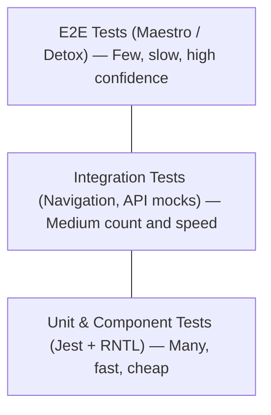
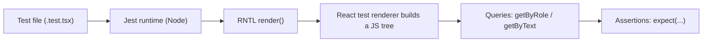
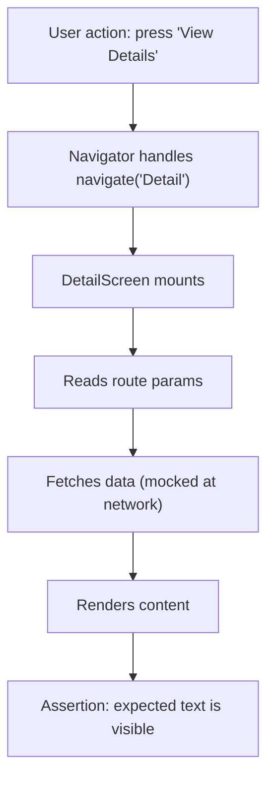
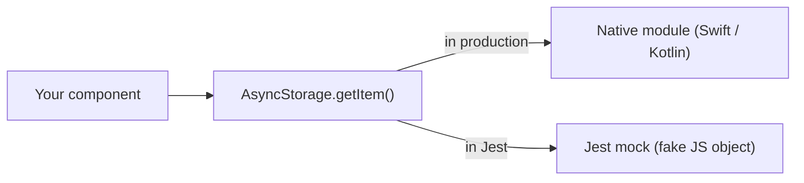
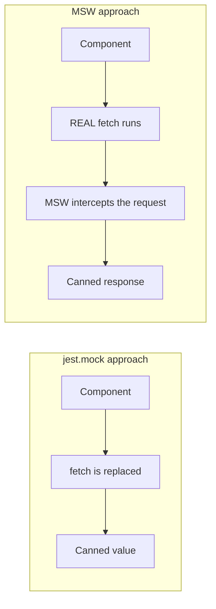
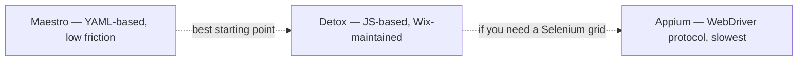
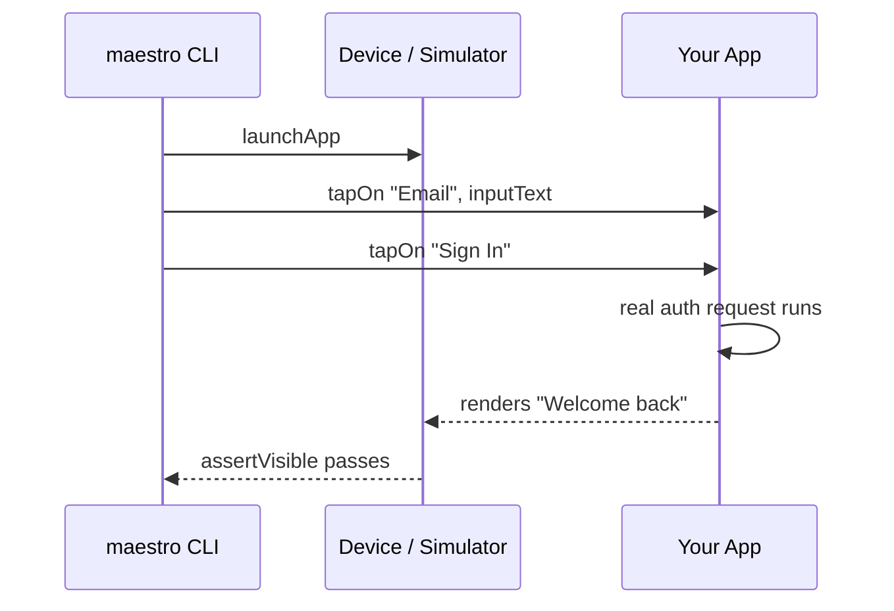
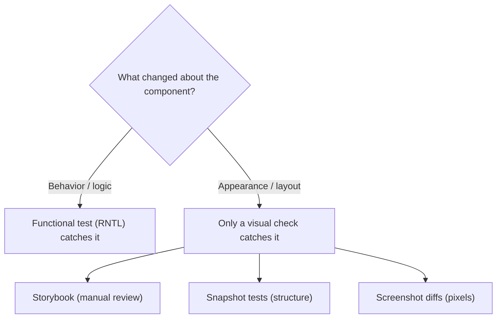
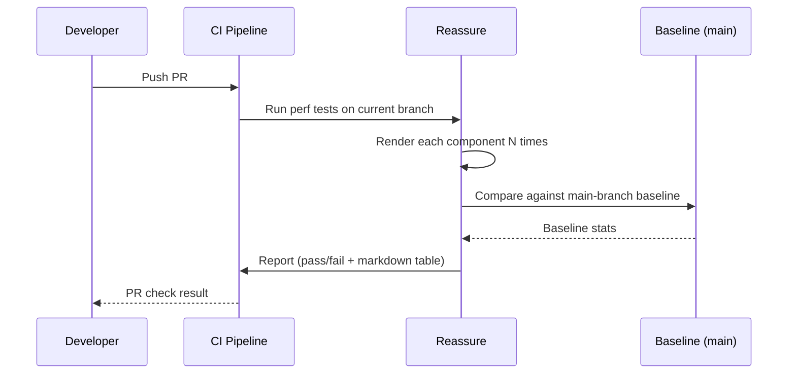

# Testing: Dai Test Unitari all'Automazione su Dispositivo

> Jest, React Native Testing Library, Maestro e la piramide dei test per le app mobile.

---

## Table of Contents
1. [Unit and Component Testing](#1-unit-and-component-testing)
2. [Integration Testing](#2-integration-testing)
3. [End-to-End Testing](#3-end-to-end-testing)
4. [Visual Regression](#4-visual-regression)
5. [Performance Regression](#5-performance-regression)

---

## 1. Test Unitari e di Componente

Sul web, probabilmente hai già scritto test con Jest e React Testing Library. Buone notizie: il testing in React Native è quasi identico. Il modello mentale è lo stesso: si fa il render di un componente, si interroga l'albero, si fanno asserzioni su ciò che l'utente vedrebbe. Le differenze stanno nel renderer e nelle query a cui ricorri.

### Perché Testare? (L'Argomento dai Primi Principi)

Un test è un piccolo programma che esegue il tuo codice reale e protesta se l'output è sbagliato. Tutto qui. Il valore non sta nel fatto che il test passi oggi, ma nel fatto che il test *fallisca domani* quando un collega (o il te del futuro) cambia qualcosa e rompe un comportamento di cui non sospettava l'esistenza. Pensa ai test come a dei **fili tesi**: li disponi una volta attorno ai comportamenti che ti interessano, e scattano automaticamente ogni volta che qualcuno ci passa accanto.

Il motivo per cui il testing conta *di più* su mobile rispetto al web è il ciclo di feedback. Sul web, salvi un file e vedi il risultato in una scheda del browser in 200ms. Su mobile, verificare a mano una modifica significa ricompilare l'app, attendere il bundler, reinstallarla su un simulatore e navigare tra le schermate toccando lo schermo: a volte un giro di 2-3 minuti per ogni controllo. Un test unitario esegue la stessa logica in **millisecondi, in Node, senza alcun dispositivo**. Questa differenza di velocità è il motivo per cui una solida suite di test è uno degli investimenti a maggior leva che un team mobile possa fare.

### La Piramide dei Test per il Mobile

Prima di scrivere anche un solo test, capisci dove i tuoi sforzi rendono. La "piramide dei test" è una regola pratica sulla *proporzione*: molti test economici in basso, pochi test costosi in alto.



Ogni livello scambia **velocità** con **realismo**. Perché non scrivere semplicemente solo test E2E, dato che sono i più realistici? Perché sono lenti, instabili, e quando uno fallisce spesso non ti dice *dove* sia il bug, ma solo che *qualcosa* si è rotto da qualche parte in un flusso lungo. Un test unitario che fallisce punta a una singola funzione. La maggior parte dei tuoi test dovrebbe vivere in basso; sali la piramide solo quando i livelli inferiori non possono davvero coprire uno scenario, come testare che un vero gesto di swipe navighi tra le schermate.

| Livello | Cosa dimostra | Velocità | Il fallimento punta a | Quando ricorrervi |
|-------|----------------|-------|-------------------|-----------------------|
| Unitario / Componente | Un singolo pezzo funziona isolato | Millisecondi | Una singola funzione/componente | Sempre — la tua scelta predefinita |
| Integrazione | I pezzi funzionano insieme | Decine di ms | Un collegamento/contratto tra le parti | Navigazione, form, flussi API |
| E2E | L'app reale funziona su un dispositivo | Secondi–minuti | "Qualcosa in questo flusso" | Solo i percorsi critici (login, checkout) |

> **Consiglio da esperti:** la piramide è una guida, non una legge. Una verifica utile: se un test è lento *e* instabile *e* difficile da debuggare, spingi quella copertura un livello più in basso. Se un comportamento può esistere solo su un dispositivo reale (gesti, push notification, deep link), è esattamente quello il caso in cui salire è giustificato.

### Setup

React Native viene fornito con Jest pre-configurato. Devi solo aggiungere la testing library:

```bash
npm install --save-dev @testing-library/react-native
```

Tutto qui. Niente browser, niente jsdom. React Native Testing Library (RNTL) fa il render dei tuoi componenti usando il test renderer di React e ti offre query che rispecchiano ciò che farebbe un utente reale: trovare elementi in base al loro ruolo, etichetta o testo visibile.

Ecco il modello mentale di cosa accade quando un test viene eseguito — nota che **nessun dispositivo o simulatore è coinvolto**:



Rispetto al web: sul web, React Testing Library fa il render in **jsdom**, un finto DOM composto da nodi `<div>` e `<button>`. In React Native non c'è alcun DOM: RNTL fa il render in un albero di descrittori di componenti nativi (`View`, `Text`, `Pressable`). Le query sono identiche nella sensazione, ma l'albero sottostante è quello di React Native, non quello dell'HTML.

### Scrivere il Tuo Primo Test di Componente

Supponiamo di avere un semplice componente `Counter`:

```tsx
// Counter.tsx
import { View, Text, Pressable } from "react-native";
import { useState } from "react";

export function Counter() {
  const [count, setCount] = useState(0);

  return (
    <View>
      <Text accessibilityRole="text">Count: {count}</Text>
      <Pressable
        accessibilityRole="button"
        accessibilityLabel="Increment"
        onPress={() => setCount((c) => c + 1)}
      >
        <Text>+1</Text>
      </Pressable>
    </View>
  );
}
```

```tsx
// Counter.test.tsx
import { render, screen, fireEvent } from "@testing-library/react-native";
import { Counter } from "./Counter";

test("increments the count on press", () => {
  render(<Counter />);

  // Arrange è fatto da render(); ora si fa l'Assert dello stato iniziale
  expect(screen.getByText("Count: 0")).toBeTruthy();

  // Act: simula l'utente che preme il pulsante
  fireEvent.press(screen.getByRole("button", { name: "Increment" }));

  // Assert: la schermata ora riflette il nuovo stato
  expect(screen.getByText("Count: 1")).toBeTruthy();
});
```

Ogni test segue lo stesso ritmo **Arrange → Act → Assert**: prepara il mondo, fai l'azione, controlla il risultato. Una volta che riconosci questa forma, ogni test di questo capitolo si legge allo stesso modo.

Nota: stai interrogando per `role` e `name`, non per test ID. Questo è intenzionale. Se interroghi per `testID`, i tuoi test passano anche quando l'albero di accessibilità è rotto. Interroga per ruolo ed etichetta, e ottieni copertura di accessibilità **gratis**: un utente con screen reader trova il pulsante nello stesso modo in cui lo fa il tuo test. C'è un ordine di priorità che vale la pena memorizzare per scegliere quale query usare:

| Query | Trova gli elementi per | Usala per | Priorità |
|-------|-------------------|------------|----------|
| `getByRole` | Ruolo di accessibilità + nome | Pulsanti, intestazioni, elementi interattivi | Massima — la più simile all'utente |
| `getByText` | Contenuto di testo visibile | Etichette, messaggi, qualsiasi testo renderizzato | Alta |
| `getByLabelText` | `accessibilityLabel` | Input e icone senza testo visibile | Alta |
| `getByPlaceholderText` | Placeholder del TextInput | Campi del form vuoti | Media |
| `getByTestId` | Prop `testID` | Ultima risorsa quando nient'altro funziona | Minima — invisibile agli utenti |

> **Attenzione:** i ruoli di accessibilità di React Native non sono gli stessi dei ruoli ARIA del web. `<Pressable>` non ha automaticamente `role="button"`: devi impostare `accessibilityRole="button"` esplicitamente. Dimenticalo e le tue query `getByRole` falliranno silenziosamente. (Sul web, `<button>` è un pulsante gratuitamente; in RN, sei *tu* a dichiarare il ruolo.)

C'è anche una differenza chiave tra i prefissi delle query che mette in difficoltà i principianti:

| Prefisso | Se non trovato | Se trovato | Attende l'async? |
|--------|--------------|----------|------------------|
| `getBy...` | Lancia immediatamente | Restituisce l'elemento | No |
| `queryBy...` | Restituisce `null` | Restituisce l'elemento | No |
| `findBy...` | Lancia dopo il timeout | Restituisce una Promise | **Sì** |

Usa `queryBy` quando vuoi asserire che qualcosa è **assente** (`expect(screen.queryByText("Error")).toBeNull()`), e `findBy` quando l'elemento appare **dopo** un aggiornamento asincrono (una fetch, una navigazione, un timer).

### Testare gli Hook Personalizzati

Per gli hook che non fanno il render di UI, usa `renderHook` da RNTL:

```tsx
import { renderHook, act } from "@testing-library/react-native";
import { useCounter } from "./useCounter";

test("useCounter increments", () => {
  const { result } = renderHook(() => useCounter(0));

  // result.current punta sempre all'ultimo valore di ritorno dell'hook
  act(() => {
    result.current.increment();
  });

  expect(result.current.count).toBe(1);
});
```

Un hook non può essere chiamato al di fuori di un componente: React lancerebbe un errore. `renderHook` risolve questo problema montando un piccolo componente host invisibile che chiama il tuo hook ed espone il suo valore di ritorno su `result.current`. Il wrapper `act()` dice a React "sto per innescare un aggiornamento di stato; esegui tutti i re-render risultanti prima che io faccia le asserzioni". Salta `act()` attorno a un cambiamento di stato e React avverte che un aggiornamento è avvenuto al di fuori di `act`, il che significa che la tua asserzione potrebbe essere eseguita contro un valore obsoleto.

Sul web installeresti `@testing-library/react-hooks` come pacchetto separato. In React Native, `renderHook` è incluso direttamente in `@testing-library/react-native` dalla v12. Una dipendenza in meno da gestire.

### Errori Comuni

- **Avvolgere tutto in query `testID`.** Questo fa passare i test anche quando il componente è visivamente rotto. Preferisci `getByRole`, `getByText`, `getByLabelText`.
- **Non avvolgere gli aggiornamenti di stato in `act()`.** Se il tuo test avverte di aggiornamenti di stato non avvolti, hai un aggiornamento asincrono che richiede `waitFor` o `findBy*`.
- **Testare i dettagli implementativi.** Non fare asserzioni sullo stato interno. Fai asserzioni su ciò che appare a schermo. Il test dovrebbe sopravvivere a un refactor che mantiene il comportamento identico: se rinominare una variabile di stato rompe il tuo test, il test stava osservando la cosa sbagliata.
- **Eccesso di mock.** Se fai così tanti mock che il test esercita solo dei mock, non dimostra nulla. Fai il mock dei *confini* (rete, moduli nativi), esegui il codice *reale* del componente.

---

## 2. Test di Integrazione

I test unitari dimostrano che i singoli componenti funzionano. I test di integrazione dimostrano che funzionano *insieme*: che premere un pulsante porti alla schermata giusta, che l'invio di un form mandi la richiesta API corretta e mostri la risposta.

Il cambio di prospettiva è questo: un test unitario mette un solo componente su un palco da solo. Un test di integrazione assembla diversi pezzi reali — un navigator, alcune schermate, un livello dati — e verifica che i **contratti tra di essi** reggano. I bug amano nascondersi in quelle giunture: un nome di schermata scritto male in una chiamata `navigate()`, un parametro di route che la schermata di destinazione si aspetta ma non riceve mai, una forma di risposta che la UI non gestisce. Nessuno di questi emerge quando ogni pezzo viene testato da solo.



### Testare i Flussi di Navigazione

React Navigation fornisce un'utility di testing che ti consente di fare il render di un navigator completo in un test. Non hai bisogno di un simulatore:

```tsx
import { render, screen, fireEvent } from "@testing-library/react-native";
import { NavigationContainer } from "@react-navigation/native";
import { createNativeStackNavigator } from "@react-navigation/native-stack";
import { HomeScreen } from "./HomeScreen";
import { DetailScreen } from "./DetailScreen";

const Stack = createNativeStackNavigator();

// Un navigator reale e completamente cablato — lo stesso che userebbe la tua app
function TestApp() {
  return (
    <NavigationContainer>
      <Stack.Navigator>
        <Stack.Screen name="Home" component={HomeScreen} />
        <Stack.Screen name="Detail" component={DetailScreen} />
      </Stack.Navigator>
    </NavigationContainer>
  );
}

test("navigates from Home to Detail on item press", async () => {
  render(<TestApp />);

  fireEvent.press(screen.getByText("View Details"));

  // findBy* ATTENDE — la transizione è asincrona, quindi getBy* lancerebbe troppo presto
  expect(await screen.findByText("Detail Screen")).toBeTruthy();
});
```

L'intuizione chiave: fai il render dell'intero stack del navigator, non di una sola schermata. Questo intercetta i bug in cui i parametri di navigazione sono sbagliati o il nome della schermata è scritto male — cose che un test unitario su una singola schermata non coglierebbe. Poiché le animazioni di navigazione e il mount delle schermate avvengono in modo asincrono, **devi** usare `findByText` (che fa polling finché l'elemento non appare o va in timeout) invece di `getByText` (che controlla una sola volta e lancia istantaneamente).

### Fare il Mock dei Moduli Nativi

Il codice React Native dipende spesso da moduli nativi — la fotocamera, lo storage, la biometria. Questi sono scritti in Swift/Kotlin e compilati nel binario dell'app; semplicemente **non esistono** nell'ambiente Jest puramente JavaScript. Quando il tuo codice chiama `AsyncStorage.getItem()`, non c'è alcun lato nativo a rispondere, quindi la chiamata lancerebbe un errore. Un *mock* è un sostituto: un finto oggetto JS che soddisfa la stessa forma esposta dal modulo reale, restituendo valori predefiniti.

```tsx
// jest.setup.js
// Silenzia il driver di animazione nativo che Jest non può caricare
jest.mock("react-native/Libraries/Animated/NativeAnimatedHelper");

// La maggior parte delle buone librerie fornisce un mock ufficiale — usalo
jest.mock("@react-native-async-storage/async-storage", () =>
  require("@react-native-async-storage/async-storage/jest/async-storage-mock")
);

// Mock fatto a mano: fallo solo quando la libreria non ne ha uno ufficiale
jest.mock("react-native-camera", () => ({
  RNCamera: {
    Constants: { Type: { back: "back", front: "front" } },
  },
}));
```



> **Suggerimento:** la maggior parte delle librerie native ben mantenute fornisce il proprio mock Jest. Controlla la documentazione della libreria prima di scriverne uno tuo. Un mock manuale che si discosta dall'API reale è peggio di nessun mock: può far *sembrare* verde un'integrazione rotta.

### Fare il Mock delle Richieste di Rete con MSW

Sul web, Mock Service Worker (msw) è diventato lo standard per fare il mock delle chiamate API. Funziona anche in React Native, con un passaggio di setup in più:

```bash
npm install --save-dev msw
```

```tsx
// mocks/handlers.ts
import { http, HttpResponse } from "msw";

// Descrive cosa restituisce il finto server per ogni endpoint
export const handlers = [
  http.get("https://api.example.com/user", () => {
    return HttpResponse.json({ id: 1, name: "Ada Lovelace" });
  }),
];
```

```tsx
// mocks/server.ts
import { setupServer } from "msw/node";
import { handlers } from "./handlers";

export const server = setupServer(...handlers);
```

```tsx
// jest.setup.js
import { server } from "./mocks/server";

beforeAll(() => server.listen());      // start intercepting
afterEach(() => server.resetHandlers()); // undo per-test overrides
afterAll(() => server.close());         // stop intercepting
```

Perché MSW invece di `jest.mock("fetch")`? Per via di **dove** avviene l'intercettazione. `jest.mock` sostituisce una funzione nel tuo codice, quindi il tuo test è accoppiato al *modo* in cui fai la fetch. MSW intercetta un livello più in basso, alla richiesta di rete stessa. Il tuo componente esegue la sua vera chiamata `fetch` (o `axios`), e MSW cattura la richiesta in uscita e vi risponde.



Il vantaggio: se in seguito fai un refactor da `fetch` a `axios`, i test MSW **passano comunque** perché fanno il mock del *confine* (la richiesta HTTP), non dell'*implementazione* (quale funzione hai chiamato). Fai il mock di ciò che non cambierà.

> **Consiglio da esperti:** sovrascrivi un handler all'interno di un singolo test con `server.use(...)` per simulare una risposta di errore (ad esempio un 500 o un timeout di rete). Poiché `afterEach` reimposta gli handler, quella sovrascrittura riguarda solo quel test — perfetto per verificare i tuoi stati di errore e di caricamento.

### Errori Comuni

- **Fare il mock di `navigation.navigate` invece di fare il render del navigator reale.** Perdi la copertura sull'effettivo cablaggio della navigazione. Fai il mock della navigazione solo quando testi un componente profondamente annidato dove fare il render dell'intero stack è impraticabile.
- **Dimenticare di fare `await findBy*` dopo la navigazione.** Le transizioni di schermata sono asincrone. Usa `findByText` (che attende) invece di `getByText` (che lancia immediatamente).
- **Lasciar trapelare lo stato tra i test.** Dimenticare `afterEach(() => server.resetHandlers())` (o non azzerare uno store mockato) permette al setup di un test di contaminare il successivo, producendo fallimenti che spariscono quando esegui il test da solo.

---

## 3. Test End-to-End

I test unitari e di integrazione vengono eseguiti in Node. Non possono testare i gesti reali, le animazioni reali, il comportamento reale dei moduli nativi su un dispositivo. È a questo che servono i test E2E.

Un test E2E è la cosa più vicina a un essere umano tester QA che un robot possa raggiungere. Avvia l'**app effettivamente compilata** su un dispositivo o simulatore reale, poi tocca, digita e fa swipe attraverso la UI esattamente come farebbe una persona — e asserisce che le cose giuste appaiano. Niente viene mockato; la navigazione reale, la rete reale (o un vero backend di staging), i veri moduli nativi vengono tutti eseguiti. Quel realismo è l'intero scopo — e anche il motivo per cui i test E2E sono lenti e occasionalmente instabili.

### Il Panorama E2E nel 2026



**Maestro** è lo strumento che consiglierei alla maggior parte dei team nel 2026. Usa YAML per descrivere i flussi, richiede quasi zero setup, e gira sia su iOS che su Android con lo stesso file di test. Non devi aggiungere test ID ovunque: Maestro può trovare gli elementi tramite il testo visibile. Ha anche una tolleranza incorporata all'instabilità: ritenta automaticamente e attende gli elementi, il che elimina la singola maggiore fonte di sofferenza nei test E2E.

**Detox** è più potente. È basato su JavaScript, *si sincronizza con lo stato di inattività dell'app* (quindi meno attese instabili), e ti dà un controllo granulare. Il compromesso: un setup decisamente più impegnativo, specialmente in CI. Scegli Detox se hai bisogno di logica di asserzione complessa o di integrarti profondamente con la tua infrastruttura di test JS.

**Appium** usa il protocollo WebDriver. È il più flessibile (funziona con app native, app ibride, persino Flutter), ma è anche il più lento e fragile. A meno che tu non sia in un'organizzazione che ha già un'infrastruttura Appium, evitalo.

| Strumento | Linguaggio | Sforzo di setup | Velocità | Gestione dell'instabilità | Quando usarlo |
|------|----------|--------------|-------|--------------------|-------------|
| Maestro | YAML | Minimo | Veloce | Retry/attese integrate | Predefinito per la maggior parte dei team; parti da qui |
| Detox | JavaScript | Alto | Veloce | Sincronizzazione con app inattiva | Logica complessa, integrazione profonda con i test JS |
| Appium | Molti (WebDriver) | Molto alto | Lento | Attese manuali | Solo se esegui già Appium/Selenium |

### Maestro in Pratica

Installa Maestro:

```bash
# macOS / Linux
curl -Ls "https://get.maestro.mobile.dev" | bash
```

Scrivi un flusso in YAML:

```yaml
# flows/login.yaml
appId: com.myapp
---
- launchApp
- tapOn: "Email"
- inputText: "user@example.com"
- tapOn: "Password"
- inputText: "s3cure-pass!"
- tapOn: "Sign In"
- assertVisible: "Welcome back"
```

Eseguilo:

```bash
maestro test flows/login.yaml
```

Questo è l'intero setup. Nessun test ID richiesto. Nessuna configurazione di build. Maestro trova il campo "Email" tramite il suo testo visibile o l'etichetta di accessibilità, ci digita dentro e asserisce il risultato. Leggi lo YAML dall'alto verso il basso e si legge come uno script di test manuale che consegneresti a un tester umano — quella leggibilità è il superpotere di Maestro. In CI, Maestro Cloud esegue i tuoi flussi su dispositivi reali e ti fornisce registrazioni video dei fallimenti, il che trasforma "è fallito in CI ma funziona sulla mia macchina" in un replay osservabile.



### Detox: Quando Hai Bisogno di Più Controllo

```tsx
// e2e/login.test.ts
describe("Login flow", () => {
  beforeAll(async () => {
    await device.launchApp();
  });

  it("should log in successfully", async () => {
    await element(by.text("Email")).tap();
    await element(by.text("Email")).typeText("user@example.com");
    await element(by.text("Password")).tap();
    await element(by.text("Password")).typeText("s3cure-pass!");
    await element(by.text("Sign In")).tap();
    await expect(element(by.text("Welcome back"))).toBeVisible();
  });
});
```

Nota che in quel test non ci sono quasi attese esplicite. Questo è il cuore di Detox: la **sincronizzazione gray-box**. Detox può vedere all'interno dell'app e sa quando animazioni, timer e richieste di rete si sono assestati, quindi attende automaticamente che l'app sia *inattiva* prima di eseguire il passaggio successivo. Confronta con Appium, che è *black-box*: può solo stuzzicare la UI dall'esterno e indovinare quando procedere, ed è per questo che i test Appium sono disseminati di chiamate `sleep()` manuali e sono comunque instabili.

Quella stessa sincronizzazione è anche il tallone d'Achille di Detox: un'app che *non è mai* inattiva — un'animazione in loop, un timer di polling infinito, un websocket che non si chiude mai — fa attendere Detox all'infinito. Quando un test Detox si blocca, la causa è quasi sempre "qualcosa nell'app non ha mai detto a Detox di aver finito".

> **Attenzione:** i test E2E sono costosi. Una suite Detox completa in CI può richiedere 20-40 minuti. Mantieni la tua suite E2E piccola — copri i percorsi critici (login, acquisto, onboarding) e lascia il resto ai livelli inferiori della piramide. Una buona regola: se un bug in questo flusso facesse squillare il telefono di qualcuno alle 3 di notte, allora merita un test E2E. Altrimenti, spingilo verso il basso.

---

## 4. Visual Regression

I test funzionali ti dicono che il componente *funziona*. I test di regressione visiva ti dicono che ha ancora un *bell'aspetto*. Un pulsante può superare ogni test funzionale pur essendo invisibile perché qualcuno ha impostato la sua opacità a 0, gli ha dato testo bianco su sfondo bianco, o lo ha spinto fuori schermo con un margine vagante. Le asserzioni funzionali controllano il *comportamento*; i controlli visivi proteggono l'*aspetto* — e in un'app mobile curata, l'aspetto è il prodotto.



### Storybook per React Native

Storybook funziona in React Native, ed è il tuo miglior strumento per il testing visivo. L'idea centrale: una **story** è un componente congelato in uno specifico stato (un pulsante primario, un pulsante disabilitato, un pulsante a metà caricamento). Invece di cliccare attraverso la tua app reale per raggiungere quello stato, ci salti direttamente in una galleria isolata. Scrivi le story una volta, poi le visualizzi su dispositivo o in una UI basata su web:

```bash
npx storybook@latest init --type react_native
```

```tsx
// Button.stories.tsx
import type { Meta, StoryObj } from "@storybook/react";
import { Button } from "./Button";

const meta: Meta<typeof Button> = {
  title: "Button",
  component: Button,
};
export default meta;

type Story = StoryObj<typeof Button>;

// Ogni export è uno stato del componente, pronto da osservare
export const Primary: Story = {
  args: {
    label: "Submit",
    variant: "primary",
  },
};

export const Disabled: Story = {
  args: {
    label: "Submit",
    variant: "primary",
    disabled: true,
  },
};
```

Questo isolamento accelera anche lo *sviluppo*: costruire uno stato di caricamento è molto più rapido quando puoi farne il render direttamente, rispetto a quando devi innescare una lenta chiamata di rete nell'app reale per vederlo.

### Snapshot Testing

Gli snapshot test di Jest catturano l'output renderizzato di un componente e segnalano quando cambia:

```tsx
import { render } from "@testing-library/react-native";
import { Button } from "./Button";

test("Button matches snapshot", () => {
  const tree = render(<Button label="Submit" variant="primary" />);
  // Prima esecuzione: scrive un file .snap. Esecuzioni successive: confronta con esso.
  expect(tree.toJSON()).toMatchSnapshot();
});
```

Come funziona: la prima volta che il test viene eseguito, Jest serializza l'albero renderizzato in un file `__snapshots__/*.snap` e lo committa. A ogni esecuzione successiva, Jest ri-renderizza e fa il diff rispetto a quel file salvato — qualsiasi differenza fa fallire il test. Per accettare una modifica intenzionale, esegui `jest -u` per aggiornare lo snapshot.

Il pericolo è che gli snapshot catturano *ogni* modifica, incluse quelle intenzionali, il che addestra gli sviluppatori a eseguire d'istinto `jest -u` senza leggere il diff — a quel punto lo snapshot non protegge nulla. E, cosa cruciale, uno snapshot strutturale **non** dimostra che il componente abbia un *bell'aspetto*: registra che esiste una `View` con certe prop, non che i pixel siano corretti. Usali con parsimonia: vanno meglio per componenti piccoli e stabili come icone o badge, non per intere schermate.

| Approccio | Cosa confronta davvero | Cattura un bug di colore/opacità? | Costo di manutenzione |
|----------|---------------------------|------------------------------|------------------|
| Storybook (manuale) | Gli occhi di un umano | Sì (se qualcuno guarda) | Basso, ma non automatizzato |
| Snapshot test | Albero del componente serializzato (struttura) | No — solo modifiche strutturali | Basso, ma rumoroso |
| Screenshot diff | Pixel effettivamente renderizzati | Sì, automaticamente | Più alto (baseline, pixel instabili) |

> **Sul web** useresti Chromatic o Percy per i diff visivi a livello di pixel. Per React Native, l'ecosistema è meno maturo. Chromatic supporta Storybook per RN in una modalità di rendering web, ma non può catturare il rendering specifico del nativo (ombre, font di piattaforma). Per una vera regressione visiva nativa, i team tipicamente fanno screenshot in CI con Detox o Maestro e fanno il diff delle immagini con strumenti come `pixelmatch` o `reg-suit`.

### Un Approccio Pratico

Non cercare di ottenere una copertura visiva perfetta al pixel fin dal primo giorno. Parti da qui:

1. **Storybook** per lo sviluppo dei componenti e la revisione visiva manuale.
2. **Snapshot test** per le primitive piccole e stabili.
3. **Screenshot di Maestro** in CI per le schermate critiche — cattura uno screenshot alla fine di un flusso E2E e confrontalo con una baseline.

Questo ti dà tre livelli di sicurezza visiva senza richiedere una piattaforma di regressione visiva matura (e costosa). Aggiungi il diff dei pixel solo quando i livelli più economici smettono di catturare i bug che raggiungono davvero gli utenti — pagare il costo di manutenzione delle baseline a pixel instabili prima di averne bisogno è una classica ottimizzazione prematura.

---

## 5. Performance Regression

La tua app funziona. Ha un bell'aspetto. Ma *resta veloce*? Una modifica apparentemente innocente — avvolgere un componente in una `View` aggiuntiva, aggiungere un context provider, eliminare un `useMemo` — può raddoppiare il tempo di render. Non te ne accorgerai in sviluppo sul tuo telefono di punta, ma i tuoi utenti se ne accorgeranno su un Android di fascia media vecchio di tre anni. Una **regressione delle prestazioni** è esattamente questo: codice ancora corretto e ancora gradevole, ma misurabilmente più lento di prima.

Il motivo per cui questo richiede automazione è che le prestazioni si erodono *in modo invisibile e graduale*. Nessuna singola PR rende l'app "lenta da usare"; cento PR che aggiungono ciascuna 3ms sì. Un revisore umano non può individuare a occhio una regressione del render del 6% in un diff. Una macchina, misurando ogni PR rispetto a una baseline, può.

### Reassure: Performance Testing in CI

Reassure, sviluppato da Callstack, misura quanto tempo impiegano i tuoi componenti a fare il render e fa fallire la tua pipeline CI se una modifica causa una regressione:

```bash
npm install --save-dev reassure
```

Scrivi un test di performance — sembra quasi un normale test:

```tsx
// FeedList.perf-test.tsx
import { measurePerformance } from "reassure";
import { FeedList } from "./FeedList";

// Un volume di dati realistico conta — 5 elementi non riveleranno una regressione della lista
const mockItems = Array.from({ length: 200 }, (_, i) => ({
  id: String(i),
  title: `Post ${i}`,
  body: "Lorem ipsum dolor sit amet.",
}));

test("FeedList renders 200 items", async () => {
  await measurePerformance(<FeedList items={mockItems} />);
});
```

Reassure esegue il render più volte, raccoglie statistiche e confronta rispetto a una baseline. Il motivo per cui esegue il render *molte* volte invece di una sola è il **rumore statistico**: ogni singolo tempo di render è instabile (lo scheduler del sistema operativo, il garbage collection, il throttling della CPU interferiscono tutti). Campionando ripetutamente e confrontando le distribuzioni, Reassure può distinguere una vera regressione dalla varianza casuale. In CI, genera un report in markdown:

```
| Component         | Baseline (ms) | Current (ms) | Change |
|-------------------|---------------|--------------|--------|
| FeedList (200)    | 45.2          | 48.1         | +6.4%  |
| UserCard          | 2.1           | 2.0          | -4.8%  |
```

Configuri una soglia — diciamo, fai fallire la PR se un qualsiasi componente regredisce di più del 20%. Questo cattura i problemi di prestazioni prima che vadano in produzione.

### Come Funziona

Il meccanismo cruciale è la **baseline**: Reassure misura prima il branch `main` e salva quei numeri, poi misura il tuo branch della PR e li confronta. È una foto del prima-e-dopo, non un limite di velocità assoluto — ed è ciò che lo rende trasferibile tra macchine CI di velocità diverse.



### Cosa Misurare

Non misurare tutto — una suite dispersiva che impiega 20 minuti viene ignorata, e un test ignorato non cattura nulla. Concentrati su dove il costo del render si concentra davvero:

- **Liste con molti elementi.** Una `FlatList` che renderizza 100+ elementi è dove le regressioni fanno più male.
- **Schermate che si ri-renderizzano spesso.** Schermate di chat, dashboard in tempo reale, qualsiasi cosa con dati in tempo reale.
- **Componenti costosi.** Grafici, mappe, lettori multimediali.

Una piccola suite mirata di 10-15 test di performance cattura più regressioni di una suite dispersiva che impiega 20 minuti per essere eseguita e viene ignorata.

> **Attenzione:** Reassure misura il *tempo di render nel thread JS*, non le prestazioni lato nativo. Non catturerà una regressione causata da una pesante animazione nativa o da un collo di bottiglia del bridge. Per il profiling lato nativo, hai ancora bisogno di React Native DevTools, Flipper o Xcode Instruments — ma quelli sono strumenti manuali, non adatti alla CI. In breve: un Reassure verde significa "il tuo JS non è diventato più lento", non "la tua app è veloce".

### Combinare i Livelli

Ecco una strategia di testing che funziona per la maggior parte dei team React Native. Nota come rispecchia la piramide della Sezione 1 — economica e abbondante in basso, costosa e rada in alto:

| Livello | Strumento | Quantità | Eseguito In |
|-------|------|-------|---------|
| Unitario / Componente | Jest + RNTL | 100+ | CI (secondi) |
| Integrazione | Jest + RNTL + MSW | 20-50 | CI (secondi) |
| E2E | Maestro | 5-15 | CI (minuti) |
| Visivo | Storybook + snapshot | Per componente | CI + manuale |
| Performance | Reassure | 10-15 | CI (secondi) |

I livelli inferiori vengono eseguiti rapidamente, catturano la maggior parte dei bug e ti danno la fiducia per andare in produzione. I livelli superiori vengono eseguiti più lentamente ma catturano i problemi del mondo reale che nessun test unitario può cogliere. Insieme, formano una rete di sicurezza che ti permette di muoverti rapidamente senza rovinare l'esperienza dei tuoi utenti — l'intero scopo del testing non è dimostrare che l'app funzioni *oggi*, ma renderla *sicura da modificare domani*.