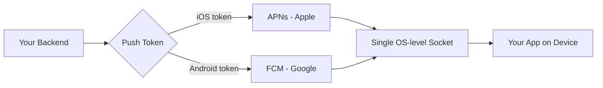
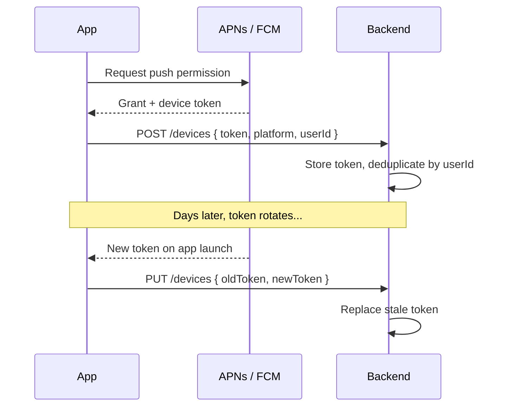
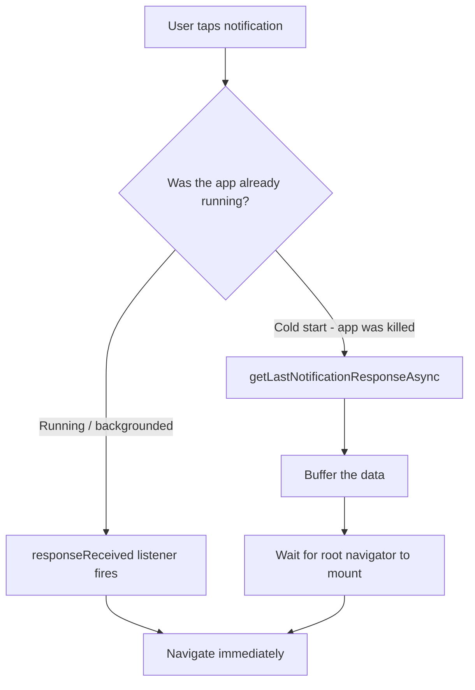
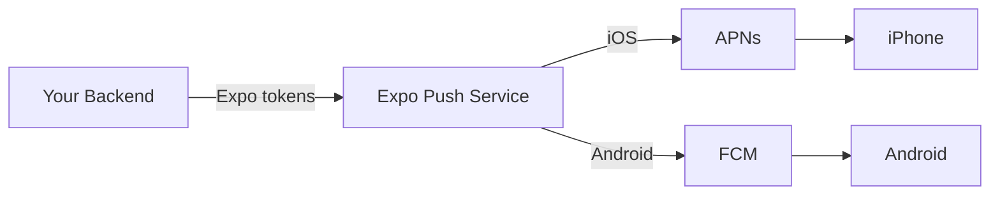
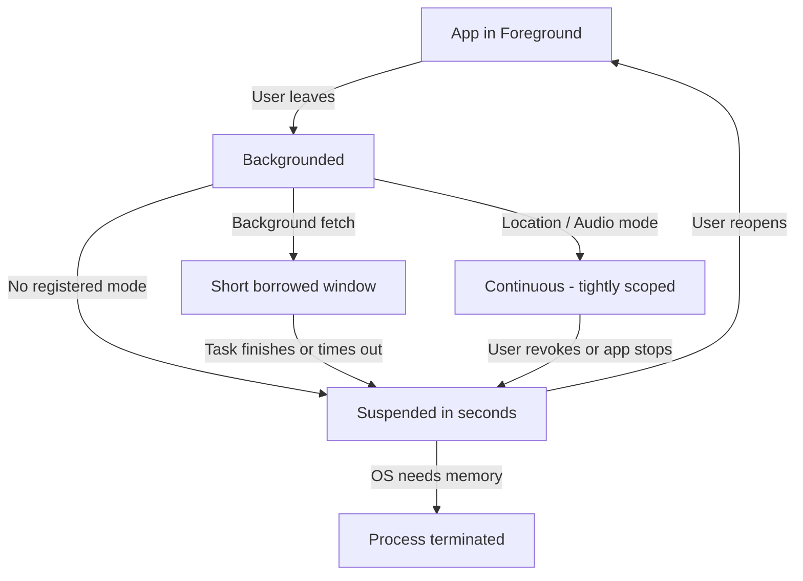
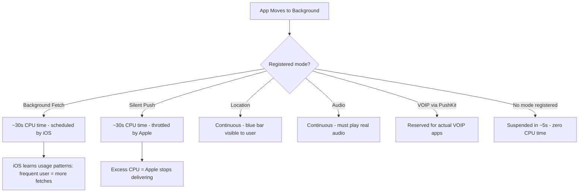
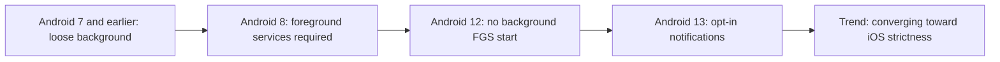

# Notifiche Push e Task in Background

> APNs, FCM, background fetch e i vincoli di piattaforma che determinano come le app mobile si "risvegliano".

---

## Table of Contents

1. [Push Notifications](#1-push-notifications)
2. [Backend Services](#2-backend-services)
3. [Background Work](#3-background-work)
4. [Background Limits](#4-background-limits)

---

## 1. Notifiche Push

Sul web hai a disposizione la Push API e i service worker. Registri un service worker, ti sottoscrivi agli eventi di push e il browser si occupa della consegna. Funziona ragionevolmente bene. Ora dimentica tutto questo.

Su mobile, ogni singola notifica push su iOS passa attraverso Apple Push Notification service (APNs). Ogni notifica su Android passa attraverso Firebase Cloud Messaging (FCM). Non esiste alternativa. Non puoi aprire un WebSocket persistente dal background e consegnare i tuoi avvisi. Il sistema operativo possiede la pipeline delle notifiche e decide quando la tua app si risveglia.

Questo design esiste per una ragione: la durata della batteria. Se ogni app mantenesse la propria connessione persistente, il telefono si scaricherebbe entro l'ora di pranzo. APNs e FCM mantengono un'unica connessione a livello di sistema e multiplexano su di essa tutte le notifiche delle app.

### Il Modello Mentale: Chi Consegna Davvero la Notifica?

Il cambiamento più grande rispetto al web è che **il tuo server non parla mai direttamente con il dispositivo dell'utente**. Pensa ad APNs e FCM come agli unici due uffici postali del paese. Tu (il tuo backend) non puoi guidare un furgone fino a casa di qualcuno e lasciare una lettera. Consegni la lettera all'ufficio postale, con l'indirizzo della cassetta del destinatario (il *push token*), e l'ufficio postale decide quando e se verrà consegnata.

Quell'unica connessione a livello di sistema è l'intuizione chiave. Il tuo telefono mantiene esattamente un socket sempre attivo verso i server di Apple e uno verso quelli di Google. Quando arriva una notifica per *qualsiasi* app, scende lungo quel canale condiviso e il sistema operativo la smista all'app giusta. Ecco perché non puoi "semplicemente tenere aperto un WebSocket": mille app che tengono ciascuna un socket aperto scaricherebbero la batteria in poche ore.



> **Web vs RN:** Sul web, il browser è il guardiano e il push generalmente "funziona e basta" una volta che l'utente si è sottoscritto. Su mobile, il *sistema operativo* è il guardiano, ed è molto più severo: può limitare, ritardare o scartare silenziosamente le tue notifiche in base allo stato della batteria, alle abitudini dell'utente e a quanto la tua app si sia comportata bene.

### Il Percorso più Semplice: expo-notifications

Se utilizzi Expo (e per la maggior parte dei progetti React Native dovresti farlo), `expo-notifications` astrae APNs e FCM dietro un'unica API. Richiedi il permesso, ottieni un push token e ascolti le notifiche in arrivo senza scrivere una riga di codice nativo.

```bash
npx expo install expo-notifications expo-device expo-constants
```

```tsx
import * as Notifications from "expo-notifications";
import * as Device from "expo-device";
import { Platform } from "react-native";

// Configure foreground notification behavior
Notifications.setNotificationHandler({
  handleNotification: async () => ({
    shouldShowAlert: true,
    shouldPlaySound: true,
    shouldSetBadge: true,
  }),
});

async function registerForPushNotifications(): Promise<string | null> {
  // Push only works on physical devices
  if (!Device.isDevice) {
    console.warn("Push notifications require a physical device");
    return null;
  }

  const { status: existing } = await Notifications.getPermissionsAsync();
  let finalStatus = existing;

  if (existing !== "granted") {
    const { status } = await Notifications.requestPermissionsAsync();
    finalStatus = status;
  }

  if (finalStatus !== "granted") return null;

  // Android requires an explicit notification channel
  if (Platform.OS === "android") {
    await Notifications.setNotificationChannelAsync("default", {
      name: "Default",
      importance: Notifications.AndroidImportance.MAX,
      vibrationPattern: [0, 250, 250, 250],
    });
  }

  const token = (
    await Notifications.getExpoPushTokenAsync({
      projectId: "your-expo-project-id",
    })
  ).data;

  return token;
}
```

#### Perché ogni passaggio esiste

I principianti spesso copiano questa funzione senza capire *perché* è strutturata in questo modo. Ogni riga si difende da un fallimento reale:

- **Controllo `Device.isDevice`** — I push token non possono essere emessi su un simulatore/emulatore (non esiste una vera registrazione APNs/FCM). Se lo dimentichi, il tuo codice solleva un errore confuso sul Simulatore iOS.
- **Verifica il permesso esistente prima di chiedere** — Su iOS, puoi *richiedere* all'utente solo una volta. Se risponde di no, chiamare di nuovo `requestPermissionsAsync` non fa nulla: il prompt non riapparirà mai. Quindi verifichi prima lo stato attuale e richiedi il permesso solo quando davvero non l'hai ancora chiesto.
- **Notification channel di Android** — A partire da Android 8 (Oreo), ogni notifica deve appartenere a un *channel*. Un channel raggruppa le impostazioni di suono, vibrazione e importanza che l'**utente** può sovrascrivere nelle impostazioni di sistema. Nessun channel significa che la tua notifica non viene visualizzata silenziosamente sulle versioni moderne di Android.
- **`getExpoPushTokenAsync`** — Questo restituisce un push token *Expo* (`ExponentPushToken[...]`), non un token APNs/FCM grezzo. Il backend di Expo lo traduce in seguito. Se vai con React Native puro, otterresti invece direttamente il device token nativo.

> **Errore comune:** Richiedere il permesso per le notifiche al primissimo avvio dell'app, prima che l'utente capisca il perché. I tassi di conversione sono molto più alti se mostri prima una schermata *pre-permesso* esplicativa ("Ricevi una notifica quando qualcuno risponde") e solo allora attivi il vero prompt del sistema operativo. Hai esattamente un'unica occasione per il prompt iOS: non sprecarla con un avvio a freddo.

### Gestione dei Token

La maggior parte dei tutorial sorvola su questa parte, ed è qui che vivono i bug veri. Un push token non è permanente. Ruota quando l'utente reinstalla, ripristina da un backup, oppure quando il sistema operativo lo aggiorna silenziosamente. La tua architettura deve trattare il token come effimero.

Pensa al token come a un numero di telefono che può cambiare senza preavviso. Se spedisci lettere a un vecchio numero, tornano indietro, e se continui a spedire a numeri morti, l'ufficio postale (APNs/FCM) inizia a trattare *te* come uno spammer e limita l'intero account.



Le regole non negoziabili:

- **Registra a ogni avvio.** Non mettere in cache il token lato client dando per scontato che sia ancora valido. Chiama `getExpoPushTokenAsync` a ogni avvio a freddo e invialo al tuo backend.
- **Deduplica lato server.** Associa i token agli ID degli utenti. Un utente può avere più dispositivi. Un dispositivo può cambiare token.
- **Elimina i token morti.** Quando APNs restituisce un 410 (Gone) o FCM restituisce "NotRegistered", elimina quel token immediatamente. Invii ripetuti a token morti faranno limitare il tuo servizio.

Ecco una chiamata di registrazione minimale lato client da eseguire a ogni avvio a freddo:

```tsx
async function syncPushToken(userId: string) {
  const token = await registerForPushNotifications();
  if (!token) return; // permission denied or simulator

  // Idempotent: the backend upserts by (userId, token).
  // Sending the same token twice is harmless and expected.
  await fetch("https://api.example.com/devices", {
    method: "POST",
    headers: { "Content-Type": "application/json" },
    body: JSON.stringify({
      token,
      platform: Platform.OS, // "ios" | "android"
      userId,
    }),
  });
}
```

Una semplice struttura di tabella backend che soddisfa tutte e tre le regole:

| Colonna | Perché esiste |
| --- | --- |
| `token` (unique) | L'indirizzo della cassetta postale; l'unicità ti consente di fare upsert in sicurezza |
| `user_id` | Un utente, molti dispositivi: raggruppa su questo per fare il fan-out |
| `platform` | Smista `ios` vs `android` e scegli la forma di payload corretta |
| `last_seen_at` | Elimina i token non aggiornati da N giorni come probabilmente morti |
| `failed_count` | Incrementa su 410/NotRegistered; elimina oltre una soglia |

> **Consiglio da esperto:** Rendi la chiamata di registrazione *idempotente*. Il client invierà lo stesso token nella maggior parte degli avvii: questo dovrebbe essere un no-op, non una riga duplicata. Fai upsert sul token, mai un insert alla cieca.

### Categorie, Azioni e Notifiche Ricche

Le notifiche possono trasportare pulsanti di azione, risposte testuali inline e immagini. Definisci le categorie all'avvio dell'app e le referenzi dai payload del tuo backend.

Una *categoria* è un template riutilizzabile di pulsanti. Registri "come appare una notifica di messaggio" una volta sul dispositivo, le dai un identificatore, e poi il tuo server si limita a referenziare quell'identificatore: non deve mai ridescrivere i pulsanti ogni volta.

```tsx
// Define once at app startup
Notifications.setNotificationCategoryAsync("message", [
  {
    identifier: "reply",
    buttonTitle: "Reply",
    textInput: { submitButtonTitle: "Send", placeholder: "Type a reply..." },
  },
  {
    identifier: "mark-read",
    buttonTitle: "Mark as Read",
    options: { isDestructive: false },
  },
]);
```

Il tuo backend include quindi `categoryId: "message"` nel payload del push. Il sistema operativo disegna i pulsanti di azione senza che la tua app debba essere aperta.

La magia qui è che **il sistema operativo disegna e gestisce quei pulsanti**: il tuo JavaScript non è in esecuzione quando l'utente tiene premuta la notifica e tocca "Reply". Il testo che digita viene consegnato alla tua app la volta successiva che si risveglia, tramite il response listener. Ecco perché puoi rispondere a un messaggio dalla schermata di blocco di un'app che è stata forzatamente chiusa.

### Push Silenziosi per l'Invalidazione della Cache

Non tutti i push devono mostrare un banner. I push silenziosi (solo dati) risvegliano brevemente la tua app affinché possa scaricare dati freschi. È così che le app di chat pre-caricano le conversazioni prima che l'utente apra l'app.

La distinzione riguarda *chi lo vede*:

| Tipo di push | Mostra un banner? | Risveglia il tuo codice? | Uso tipico |
| --- | --- | --- | --- |
| **Alert push** | Sì | Solo al tocco | "Hai un nuovo messaggio" |
| **Silent (data-only) push** | No | Sì, brevemente in background | Pre-sincronizza i dati prima che l'utente apra l'app |
| **Alert + data** | Sì | Al tocco (e a volte in background) | Banner *e* pre-caricamento della schermata pertinente |

```tsx
// Backend sends: { to: token, data: { type: "sync", resource: "messages" }, priority: "high" }

Notifications.addNotificationReceivedListener((notification) => {
  const data = notification.request.content.data;
  if (data.type === "sync") {
    syncResource(data.resource);
  }
});
```

> **Trabocchetto:** iOS limita i push silenziosi in modo aggressivo. Apple decide quando arrivano, e se la tua app usa troppa CPU durante l'esecuzione in background, la consegna si interrompe del tutto. Non fare mai affidamento sui push silenziosi per sincronizzazioni time-critical. Su iOS il flag del push silenzioso è `content-available: 1`, e il sistema può raggrupparli o ritardarli di ore quando il dispositivo è in modalità Risparmio Energetico.

### Deep Linking dai Tocchi sulle Notifiche

Quando l'utente tocca una notifica, vuoi portarlo sulla schermata giusta, non sulla home page.

Ci sono due casi distinti, e mettono in difficoltà quasi tutti:



```tsx
// Handle taps when the app is already running
Notifications.addNotificationResponseReceivedListener((response) => {
  const data = response.notification.request.content.data;
  if (data.screen === "chat" && data.threadId) {
    navigationRef.navigate("ChatThread", { id: data.threadId });
  }
});

// Handle taps from a cold start (app was killed)
const initialResponse = await Notifications.getLastNotificationResponseAsync();
if (initialResponse) {
  const data = initialResponse.notification.request.content.data;
  // Navigate after your root navigator mounts
}
```

Il caso dell'avvio a freddo è quello che coglie le persone di sorpresa. Il tuo albero di navigazione non esiste ancora quando il sistema operativo ti consegna la notifica iniziale. Devi mettere in buffer i dati del deep link e processarli dopo che il root navigator si è montato.

> **Errore comune:** Chiamare `navigate()` direttamente all'interno del ramo dell'avvio a freddo. In quel momento il tuo navigator potrebbe non essere montato, quindi la chiamata diventa silenziosamente un no-op e l'utente atterra sulla schermata home, facendo sembrare che il deep linking fallisca "a caso". Memorizza la route in sospeso in una variabile o nello state, poi naviga dall'interno di una callback `onReady` una volta che il navigator esiste.

---

## 2. Servizi Backend

Hai bisogno di qualcosa tra il tuo server e APNs/FCM. Potresti parlare direttamente con entrambe le API, ma passerai settimane a lottare con i formati dei token, la rotazione dei certificati per APNs, la logica di retry e le ricevute di consegna. Usa un servizio.

Per renderlo concreto, ecco a cosa ti stai *effettivamente* iscrivendo se parli direttamente con Apple e Google:

- **APNs** parla HTTP/2 con un JWT (o un certificato) che devi firmare e ruotare, si aspetta un payload semi-binario con header specifici (`apns-priority`, `apns-push-type`) e restituisce codici di stato laconici che devi mappare ad azioni.
- **FCM** è una REST API separata con la propria autenticazione (una chiave di service-account), la propria forma di payload e il proprio vocabolario di errori (`NotRegistered`, `MismatchSenderId`).
- Devi implementare **batching, retry con backoff e polling delle ricevute** da solo.

Un *servizio* di push collassa entrambi in un'unica API e un'unica forma di payload. Questo è il valore.

### Expo Push Service

Gratuito, integrato nell'ecosistema Expo e la scelta ovvia se stai già utilizzando `expo-notifications`. Fai POST di un payload JSON all'API di Expo, che lo instrada ad APNs o FCM in base al formato del token.

```tsx
// Server-side (Node.js)
const { Expo } = require("expo-server-sdk");
const expo = new Expo();

const messages = [
  {
    to: "ExponentPushToken[xxxxxxxxxxxx]",
    title: "New message",
    body: "Hey, are you coming tonight?",
    data: { screen: "chat", threadId: "abc123" },
    sound: "default",
    categoryId: "message",
  },
];

const chunks = expo.chunkPushNotifications(messages);
for (const chunk of chunks) {
  const tickets = await expo.sendPushNotificationsAsync(chunk);
  // Save ticket IDs, check receipts later for delivery status
}
```

L'Expo Push Service è un proxy leggero. Non memorizza token, non segmenta gli utenti e non esegue analytics. Il tuo backend possiede tutta quella logica. Per molti team, questa semplicità è una feature, non una limitazione.

#### Ticket vs ricevute — la parte che le persone saltano

La consegna di Expo è *a due fasi*, e comprendere questo è il modo in cui scopri che una notifica è effettivamente fallita:

1. **Ticket** — restituito immediatamente quando invii. Conferma solo che Expo ha *accettato* la richiesta. Un ticket può dire `ok` e la notifica può comunque fallire più tardi.
2. **Ricevuta** — recuperata in seguito (dopo circa 15+ minuti) usando l'ID del ticket. È qui che apprendi il vero esito, incluso `DeviceNotRegistered`, che è il tuo segnale per eliminare il token.

```tsx
// Later: poll receipts to find dead tokens
const receiptIds = tickets.filter((t) => t.id).map((t) => t.id);
const chunks = expo.chunkPushNotificationReceiptIds(receiptIds);

for (const chunk of chunks) {
  const receipts = await expo.getPushNotificationReceiptsAsync(chunk);
  for (const [id, receipt] of Object.entries(receipts)) {
    if (receipt.status === "error") {
      if (receipt.details?.error === "DeviceNotRegistered") {
        await deleteTokenByReceiptId(id); // prune the dead token
      }
    }
  }
}
```



> **Consiglio da esperto:** `chunkPushNotifications` esiste perché Expo limita quanti messaggi puoi inviare per richiesta. Invia sempre attraverso il chunker invece di fare POST di un array gigantesco: divide il batch per te e ti mantiene sotto il limite.

### Confronto

| Servizio | Ideale per | Costo | Punto di forza chiave |
| ------- | -------- | ---- | ------------ |
| **Expo Push Service** | App Expo, consegna semplice | Gratis | Zero configurazione, funziona e basta |
| **Firebase Cloud Messaging** | App incentrate su Android, stack Firebase esistente | Gratis | Accesso diretto a FCM, Topics API |
| **OneSignal** | Team che necessitano di segmentazione, A/B testing | Tier gratuito, a pagamento su larga scala | Dashboard di analytics, journey |
| **Knock / Courier** | Multi-canale (push + email + SMS + in-app) | A consumo | Orchestrazione unificata delle notifiche |

**La mia raccomandazione:** Inizia con l'Expo Push Service. Non costa nulla e gestisce lo smistamento per te. Passa a OneSignal quando hai bisogno di segmentazione degli utenti o analytics di consegna, oppure a Knock quando il push è solo uno dei canali in un sistema di notifiche più ampio. Non iniziare con l'opzione complessa "nel caso servisse".

Ecco come ragionare su *quando* salire la scala:

| Stai provando questo dolore... | ...passa a |
| --- | --- |
| "Devo solo consegnare push alla mia app Expo" | Expo Push Service |
| "Sono Android-first e uso già Firebase per tutto il resto" | FCM direttamente |
| "Il marketing vuole inviare agli 'utenti in Francia che hanno aperto l'app questa settimana'" | OneSignal |
| "Il push è uno di cinque canali e il prodotto vuole un unico livello di orchestrazione" | Knock / Courier |

> **Trabocchetto:** Anche se usi FCM per consegnare i push iOS (FCM può fare da proxy verso APNs), devi comunque caricare la tua chiave di autenticazione APNs su Firebase. Non esiste un percorso che eviti l'infrastruttura di Apple su iOS. Ogni strada verso un iPhone termina ai server di Apple.

---

## 3. Lavoro in Background

Sul web hai i service worker. Possono essere eseguiti in background, gestire eventi di push, mettere in cache asset e sincronizzare dati. Il browser concede loro una finestra di esecuzione generosa.

Il mobile è un mondo diverso. Sia iOS sia Android terminano i processi in background in modo aggressivo per proteggere la durata della batteria. La tua app non "gira in background" in alcun senso significativo. Ottiene finestre di esecuzione brevi e strettamente controllate che il sistema operativo può revocare in qualsiasi momento.

### Il Modello Mentale: Tempo in Prestito, non Tempo di Proprietà

Sul web, una tab continua a girare finché non la chiudi. Su mobile, nel momento in cui la tua app lascia il foreground, il sistema operativo avvia un conto alla rovescia per *sospenderla*: congelarla sul posto, usando zero CPU. Qualsiasi esecuzione in background ottieni è **tempo che il sistema operativo ti presta**, secondo i suoi tempi, e può smettere di prestartelo in qualsiasi momento.



La conseguenza pratica: **il foreground è l'unica finestra di esecuzione che controlli completamente.** Tutto il resto è best-effort. Progetta di conseguenza.

### expo-task-manager + expo-background-fetch

Questo è l'approccio gestito. Definisci un task con un nome, lo registri per l'esecuzione periodica in background e il sistema operativo lo invoca quando lo ritiene opportuno.

```bash
npx expo install expo-task-manager expo-background-fetch
```

```tsx
import * as BackgroundFetch from "expo-background-fetch";
import * as TaskManager from "expo-task-manager";

const BACKGROUND_SYNC_TASK = "background-sync";

// Define the task OUTSIDE any component — this runs headlessly
TaskManager.defineTask(BACKGROUND_SYNC_TASK, async () => {
  try {
    const newData = await fetchLatestFromAPI();
    if (newData.length > 0) {
      await persistToLocalStorage(newData);
      return BackgroundFetch.BackgroundFetchResult.NewData;
    }
    return BackgroundFetch.BackgroundFetchResult.NoData;
  } catch {
    return BackgroundFetch.BackgroundFetchResult.Failed;
  }
});

// Register once (e.g., in your root layout)
async function registerBackgroundSync() {
  const status = await BackgroundFetch.getStatusAsync();
  if (status === BackgroundFetch.BackgroundFetchStatus.Available) {
    await BackgroundFetch.registerTaskAsync(BACKGROUND_SYNC_TASK, {
      minimumInterval: 15 * 60, // 15 minutes (a hint, not a guarantee)
      stopOnTerminate: false,    // Android: keep running after app is swiped
      startOnBoot: true,         // Android: restart after reboot
    });
  }
}
```

#### Perché il task deve vivere fuori dai tuoi componenti

Nota che `defineTask` viene chiamato al livello superiore di un modulo, non all'interno di un componente React. Questo è essenziale. Quando il sistema operativo risveglia la tua app in background, avvia il motore JavaScript **senza renderizzare alcuna UI**: non c'è alcun albero di componenti, nessun `App` montato, nessuna navigazione. Il sistema operativo cerca il tuo task tramite il suo nome stringa e lo esegue in modo headless. Se avessi definito il task all'interno di un componente, quel codice non sarebbe mai stato eseguito, quindi il sistema operativo non troverebbe nulla da eseguire.

Questo è quanto di più simile a un service worker web il mobile riesca a offrire: una funzione con un nome, senza UI, che il sistema può invocare secondo i propri tempi.

Anche il valore di ritorno conta. iOS lo usa per valutare il comportamento della tua app:

| Valore di ritorno | Significato | Effetto nel tempo |
| --- | --- | --- |
| `NewData` | Hai recuperato qualcosa di utile | iOS ti pianifica più spesso |
| `NoData` | Niente è cambiato | Neutro |
| `Failed` | Il tuo task è andato in errore | iOS potrebbe ridurre la pianificazione |

> **Critico:** Quel `minimumInterval` è un suggerimento, non un contratto. iOS invocherà il tuo task quando lo deciderà, in base ai pattern di utilizzo dell'utente. Se l'utente apre la tua app ogni mattina alle 8, iOS lo impara e pianifica i fetch prima delle 8. Se l'utente non apre mai la tua app, iOS smette del tutto di pianificare.

> **Errore comune:** Fare lavoro pesante nel task dando per scontato che finirà. Hai nell'ordine di 30 secondi. Mantieni i task in background piccoli e riprendibili: scarica un po', persisti, ritorna. Il lavoro a lunga durata dovrebbe essere rimandato alla successiva sessione in foreground.

### Localizzazione in Background

Il tracciamento della posizione è l'unica modalità di background che entrambe le piattaforme trattano come di prima classe, perché le app di navigazione vi dipendono.

```tsx
import * as Location from "expo-location";
import * as TaskManager from "expo-task-manager";

const LOCATION_TASK = "background-location";

TaskManager.defineTask(LOCATION_TASK, ({ data, error }) => {
  if (error) return;
  const { locations } = data as { locations: Location.LocationObject[] };
  uploadLocations(locations);
});

async function startTracking() {
  const { status: fg } = await Location.requestForegroundPermissionsAsync();
  const { status: bg } = await Location.requestBackgroundPermissionsAsync();

  if (fg === "granted" && bg === "granted") {
    await Location.startLocationUpdatesAsync(LOCATION_TASK, {
      accuracy: Location.Accuracy.Balanced,
      distanceInterval: 100,
      showsBackgroundLocationIndicator: true, // iOS blue status bar
    });
  }
}
```

Nota il **balletto del permesso in due passaggi**: devi ottenere il permesso di localizzazione in *foreground* prima ancora di poter richiedere la localizzazione in *background*. Il sistema operativo impone questo ordine: non puoi saltare direttamente all'accesso "always". Questo rispecchia un principio mobile più ampio: più invasiva è la capacità, più graduale e visibile deve essere il consenso.

Le impostazioni `accuracy` e `distanceInterval` non sono solo manopole di regolazione: sono un budget di batteria. Una maggiore accuratezza significa risvegli del GPS più frequenti, il che significa un telefono più caldo e una peggiore valutazione della batteria in Impostazioni:

| Accuratezza | Costo in batteria | Buono per |
| --- | --- | --- |
| `Lowest` / cambiamenti significativi | Minimo | Geofencing "città cambiata", meteo |
| `Balanced` | Moderato | Tracciamento corsa/giro, granularità di ~100m |
| `BestForNavigation` | Pesante | Solo navigazione turn-by-turn |

> **Attenzione:** Entrambi gli app store esaminano con attenzione la localizzazione in background. Apple rifiuterà la tua app se richiedi il permesso di localizzazione `Always` senza una ragione chiara e visibile. "Potrebbe servirci più tardi" non passa la review. Richiedi il permesso solo per il foreground finché non hai una feature concreta e rivolta all'utente che necessiti genuinamente del tracciamento in background.

### Foreground Service di Android

Android consente un autentico lavoro in background di lunga durata, ma solo se mostri una notifica persistente (un foreground service). È così che i lettori musicali, i tracker di allenamento e i caricatori di file rimangono attivi. Hai bisogno di una libreria come `react-native-background-actions`, dato che Expo non la espone direttamente.

La notifica persistente è il *patto*: Android dice, "Ti lascerò continuare a girare a tempo indeterminato, ma l'utente deve sempre poter vedere che sei in esecuzione e fermarti." La notifica visibile è il prezzo del privilegio. Si tratta di un compromesso deliberato: trasparenza in cambio di esecuzione continua.

```tsx
import BackgroundService from "react-native-background-actions";

const syncTask = async (taskData: { interval: number }) => {
  while (BackgroundService.isRunning()) {
    await performSync();
    await sleep(taskData.interval);
  }
};

await BackgroundService.start(syncTask, {
  taskName: "DataSync",
  taskTitle: "Syncing your data",
  taskDesc: "Uploading offline changes...",
  taskIcon: { name: "ic_launcher", type: "mipmap" },
  parameters: { interval: 30_000 },
});
```

Questo è **solo per Android**. iOS non ha un equivalente. Non consente processi arbitrari in background di lunga durata, punto. L'analogo iOS più vicino è una modalità di background strettamente delimitata (audio, location, VOIP) che deve riflettere un'attività reale e osservabile: riprodurre audio reale, tracciare una posizione reale. Non esiste alcuna scappatoia del tipo "tieni semplicemente in esecuzione il mio codice".

### Headless JS (Solo Android)

Sotto il cofano, React Native su Android supporta `AppRegistry.registerHeadlessTask`, che consente a JavaScript di eseguire senza alcuna UI in risposta a eventi di sistema. Questa è la primitiva su cui `react-native-background-actions` si basa. Raramente la chiami direttamente, ma sapere che esiste aiuta a fare il debug dei problemi di esecuzione in background.

"Headless" significa semplicemente *eseguire JavaScript senza alcun thread UI collegato*: la tua logica di business viene eseguita, ma nulla viene renderizzato. È la stessa idea dietro i task di background fetch: una funzione con un nome che il sistema operativo può invocare quando la tua app non è sullo schermo. Android espone apertamente questa primitiva; iOS tiene l'equivalente bloccato dietro una manciata di modalità di background sottoposte ad audit, che è il tema ricorrente di tutto questo capitolo.

---

## 4. Limiti del Background

Questa sezione esiste per evitarti di fare promesse che la tua app non può mantenere. Se il tuo product manager chiede una "sincronizzazione in background in tempo reale", mostragli questo.

### iOS: Il Giardino Recintato

iOS è implacabilmente aggressivo riguardo all'esecuzione in background. Ecco la realtà:



Fatti non negoziabili:

- **Il background fetch concede all'incirca 30 secondi di tempo CPU**, attivato a intervalli che iOS sceglie. Su un'installazione appena fatta, potrebbe non attivarsi per ore.
- **Non puoi mantenere vivo un WebSocket.** iOS sospende il tuo processo e chiude la connessione. Usa le notifiche push per segnalare nuovi dati.
- **I Background Modes di Xcode (audio, location, VOIP, Bluetooth, fetch) sono sottoposti ad audit.** Se il team di review di Apple stabilisce che hai abilitato una modalità che in realtà non usi, rifiuterà la tua app.
- **L'uso della batteria è visibile all'utente.** Se la tua app è in cima alla lista del consumo di batteria in Impostazioni, gli utenti la disinstalleranno.

Il modello mentale per iOS è un **giardino recintato con poche porte sorvegliate**. Ogni modalità di background è una porta che Apple apre solo per uno scopo specifico e osservabile. Non esiste una porta generica per "girare in background", e cercare di simularne una (ad esempio riproducendo audio silenzioso solo per restare vivi) è un modo ben noto per far rifiutare o rimuovere la tua app.

### Android: Più Permissivo, ma in Via di Inasprimento

Android ti concede più corda, ma la sta ritirando a ogni release:

- **Android 8+ (Oreo):** I servizi in background vengono terminati dopo qualche minuto a meno che non vengano promossi a foreground service.
- **Android 12+:** Non puoi avviare un foreground service dal background senza un'interazione dell'utente o un trigger da notifica push.
- **Android 13+:** Il permesso per le notifiche è opt-in. L'utente deve concederlo esplicitamente.
- **Modalità Doze:** Quando il dispositivo è fermo e scollegato, Android raggruppa tutto il lavoro in background in finestre di manutenzione poco frequenti. I tuoi timer non si attiveranno quando te lo aspetti.

La linea di tendenza è inequivocabile: **Android sta convergendo verso iOS.** Ogni release inasprisce ciò che il codice in background può fare. Se stai scrivendo codice oggi, presupponi il futuro più severo: progetta come se Android fosse restrittivo quanto iOS, e non sarai colto alla sprovvista dal prossimo aggiornamento del sistema operativo.



### Progettare Attorno ai Vincoli

Non combattere il sistema operativo. Costruisci la tua architettura affinché funzioni con un accesso al background intermittente e imprevedibile.

| Invece di... | Fai questo |
| --- | --- |
| Polling con un timer | Notifiche push per segnalare nuovi dati |
| WebSocket persistente in background | Riconnetti al foreground, push per il background |
| Sincronizzare ogni 5 minuti | Background fetch con tempistiche flessibili |
| Localizzazione continua in background | Cambiamenti di posizione significativi (meno batteria) |
| Promettere una sincronizzazione offline istantanea | Sincronizza al foreground, push come suggerimento, accetta il ritardo |

Il pattern unificante in quella tabella: **le notifiche push sono il modo in cui il server dice "qualcosa è cambiato", e il foreground è quando il client si mette effettivamente in pari.** Smetti di provare a *prelevare* dati secondo una pianificazione (cosa che il sistema operativo bloccherà) e lasci invece che il server ti *segnali*, poi fai il vero lavoro quando l'utente porta l'app in primo piano.

```tsx
// WRONG: setInterval does not work in the background
setInterval(() => {
  fetch("/api/updates");
}, 60_000);

// RIGHT: Sync when the user returns, push to signal urgency
import { AppState } from "react-native";

AppState.addEventListener("change", (state) => {
  if (state === "active") {
    syncLatestData(); // foreground is your reliable sync window
  }
});
```

Perché la versione con `setInterval` fallisce? Nel momento in cui la tua app va in background, l'event loop di JavaScript viene *congelato*: il tuo timer non si attiva perché il motore che lo esegue è sospeso. Quando l'utente torna, il timer potrebbe attivarsi una volta in un'unica raffica, ma non si è mai eseguito secondo la pianificazione mentre l'app era assente. `AppState` è l'hook corretto perché il sistema operativo ti dice esplicitamente l'istante in cui ti è consentito eseguire di nuovo.

> **La regola d'oro:** Il sistema operativo comanda, non la tua app. Progetta per un'esecuzione intermittente. Le notifiche push sono il tuo meccanismo di segnalazione, l'attività in foreground è la tua finestra di sincronizzazione primaria, e il background fetch è un bonus best-effort. Se una feature richiede che l'app sia "sempre in esecuzione", la feature va riprogettata.

---