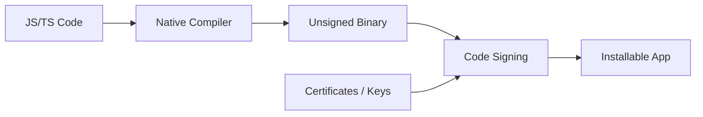
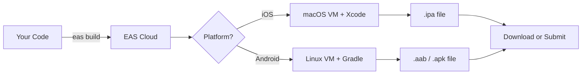
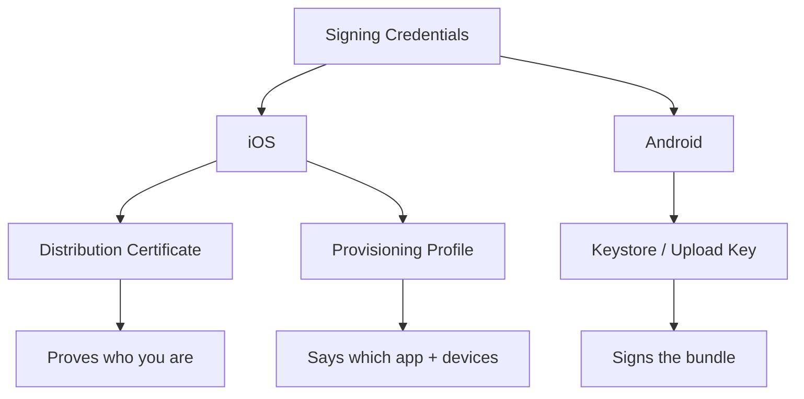
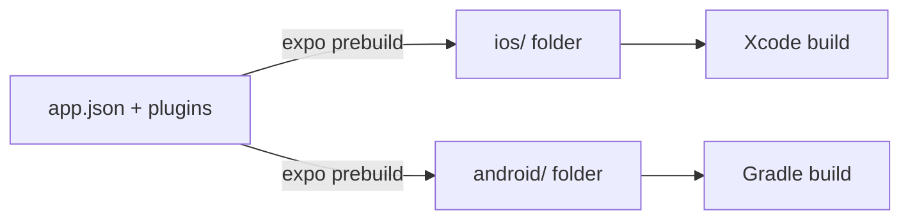
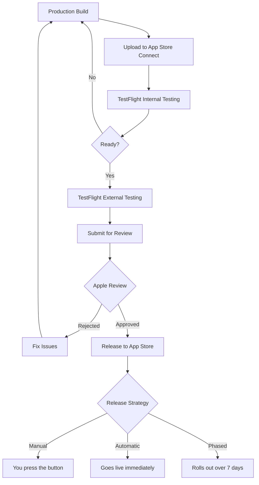
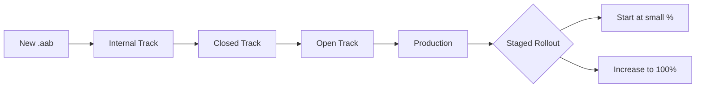
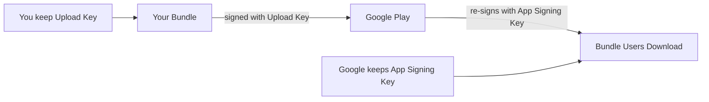
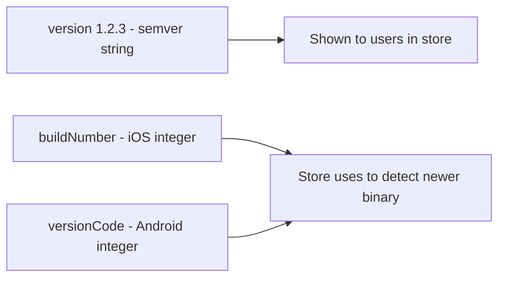
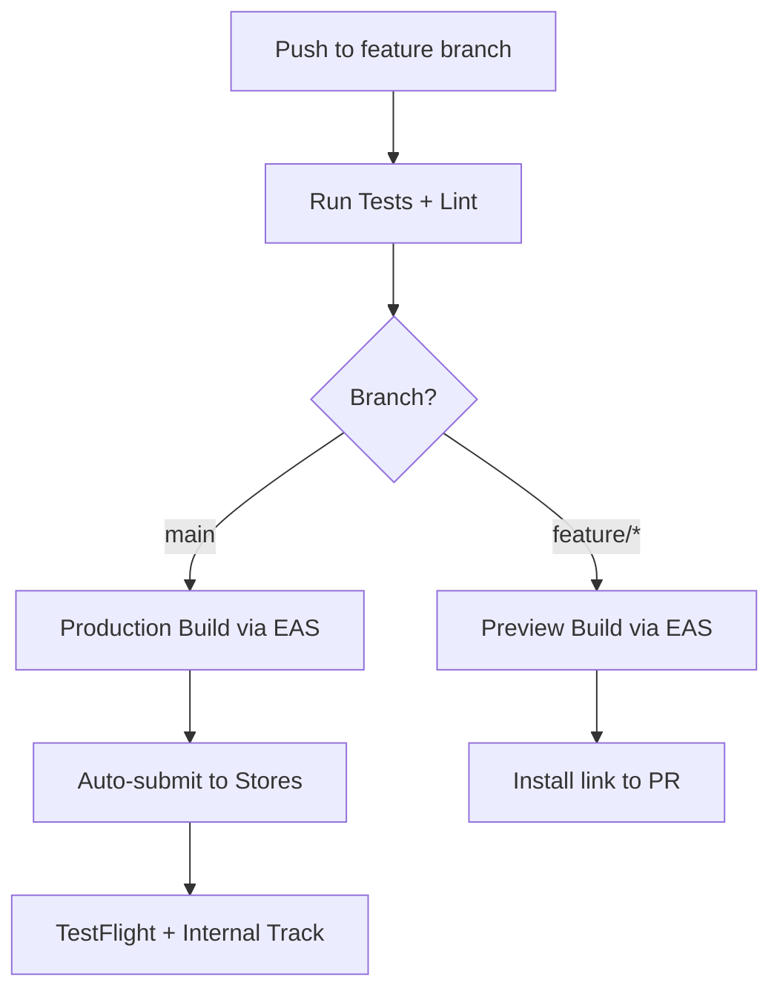
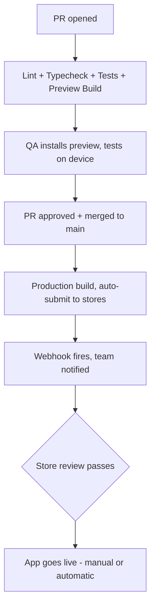

# Build e Deploy: Dal Codice agli App Store

> EAS Build, invio agli app store, versioning e pipeline CI/CD per pubblicare app mobile.

---

## Table of Contents

1. [EAS Build](#1-eas-build)
2. [Local Builds](#2-local-builds)
3. [iOS Submission](#3-ios-submission)
4. [Android Submission](#4-android-submission)
5. [Versioning](#5-versioning)
6. [CI/CD](#6-cicd)

---

## 1. EAS Build

Sul web, il deploy è quasi banalmente semplice: si esegue un comando di build, si caricano file statici su una CDN, fatto. Il mobile è un universo diverso. Hai bisogno di Xcode (solo su macOS) per iOS, di Android Studio e Gradle per Android, di certificati di firma, provisioning profile, keystore... è un percorso a ostacoli. EAS Build esiste per far sparire quel percorso a ostacoli.

### Perché le Build Mobile Sono Difficili in Partenza

Arrivando dal web, questo è il cambio di mentalità che spiazza tutti. Quando esegui il deploy di un sito web, l'"artefatto" sono semplicemente file — HTML, JS, CSS — che qualsiasi browser può eseguire. Il browser è il runtime, ed è già installato su ogni dispositivo. Non compili mai nulla per una macchina specifica.

Il mobile è l'opposto. L'artefatto è un **binario nativo** — vero e proprio codice specifico per la macchina, che il sistema operativo esegue direttamente, senza un browser in mezzo. E il sistema operativo non eseguirà un binario qualunque. Pretende una prova, crittograficamente, che il binario provenga da uno sviluppatore registrato e non sia stato manomesso. Quella prova è ciò che si intende con "firma" (signing), ed è la singola fonte di dolore più grande per chi inizia.



> **Analogia**: Un deploy web è come inviare un documento via email — chiunque può aprirlo. Una build mobile è come coniare un passaporto. Funziona solo se reca i timbri ufficiali giusti (i certificati), e solo il titolare (lo sviluppatore registrato) può emetterne di validi. EAS Build è l'ufficio passaporti che si occupa delle pratiche burocratiche per te.

### Cosa Fa Davvero EAS Build

EAS (Expo Application Services) Build è un servizio di build basato sul cloud. Tu invii il tuo codice, i server di Expo compilano i tuoi binari nativi e tu scarichi il risultato. Niente Xcode locale. Nessun demone Gradle che divora 8 GB di RAM. Nessun incubo del tipo "funziona sulla mia macchina".

L'intuizione chiave: i binari iOS possono essere costruiti **solo** su macOS (un requisito legale di Apple). Quindi, anche se sei su Windows o Linux, EAS avvia una vera macchina virtuale macOS nel cloud, ci esegue Xcode e ti restituisce il file `.ipa`. Questa è la cosa che rende Expo così potente per gli sviluppatori senza Mac — puoi pubblicare sull'App Store senza possedere alcun Mac.



Ecco cosa significa ciascun formato di output, dato che gli acronimi non sono ovvi:

| File | Piattaforma | Cos'è | Usato per |
|---|---|---|---|
| `.ipa` | iOS | iOS App archive | Invio all'App Store / TestFlight |
| `.aab` | Android | Android App Bundle | Invio a Google Play (preferito) |
| `.apk` | Android | Android Package | Installazione diretta su un dispositivo / sideloading / QA |

### Per Iniziare

Installa la EAS CLI e configura il tuo progetto:

```bash
npm install -g eas-cli   # the command-line tool that talks to EAS
eas login                # authenticate with your Expo account
eas build:configure      # scaffold an eas.json for this project
```

Quest'ultimo comando genera un file `eas.json`. È qui che risiedono i profili di build:

```json
{
  "cli": {
    "version": ">= 5.0.0"
  },
  "build": {
    "development": {
      "developmentClient": true,
      "distribution": "internal",
      "ios": {
        "simulator": true
      }
    },
    "preview": {
      "distribution": "internal",
      "ios": {
        "simulator": false
      }
    },
    "production": {
      "autoIncrement": true
    }
  },
  "submit": {
    "production": {
      "ios": {
        "ascAppId": "your-app-store-connect-id"
      }
    }
  }
}
```

Tre profili sono il punto di equilibrio ideale. Pensali come gli ambienti `dev` / `staging` / `prod` che già usi sul web:

- **development** — include il dev client, gira sui simulatori, iterazione veloce. Questa build può connettersi al tuo bundler Metro e fare hot-reload, come eseguire `npm run dev` in locale.
- **preview** — una vera build che puoi installare su dispositivi fisici per il QA. Pensala come un ambiente di staging. Esegue il JS bundlato, senza server Metro, ma non è ottimizzata per lo store.
- **production** — il binario pronto per lo store, ottimizzato, minificato, firmato con le credenziali di produzione. Questo è quello che va in produzione.

| Profilo | Gira su | Si connette a Metro? | Firmato con | Analogia web |
|---|---|---|---|---|
| development | Simulatore + dev device | Sì (hot reload) | Credenziali di dev | `npm run dev` |
| preview | Dispositivi fisici (QA) | No (JS bundlato) | Internal/ad-hoc | Deploy di staging |
| production | App store | No (ottimizzato) | Credenziali di produzione | Deploy di prod |

### Eseguire una Build

```bash
# Development build for iOS simulator
eas build --platform ios --profile development

# Production build for both platforms at once
eas build --platform all --profile production
```

Dopo aver eseguito questo comando, la build viene messa in coda nel cloud. La CLI ti fornisce un URL dove puoi osservare i log in tempo reale — gli stessi log che vedresti in una dashboard CI sul web. Quando termina, ottieni un link di download (oppure va dritta allo store se hai usato `--auto-submit`, trattato più avanti).

### Gestione delle Credenziali

Questa è la funzionalità decisiva. Sul web non ci sono certificati di firma — fai push su Vercel e hai finito. Nel mobile, iOS richiede provisioning profile e certificati di distribuzione; Android richiede un keystore. EAS gestisce tutto questo per te. Alla tua prima build, ti chiederà se vuoi che EAS gestisca le credenziali automaticamente. Rispondi di sì. Le genera e le conserva in modo sicuro. Non tocchi mai un file `.p12` o un `keystore.jks` a meno che tu non voglia.

Ecco il modello mentale per i due ecosistemi, perché differiscono in un modo importante:



> **Trabocchetto**: Se hai già credenziali esistenti (magari da un progetto pre-Expo), puoi importarle con `eas credentials`. Non lasciare che EAS ne generi di nuove se hai già un'app esistente sullo store — non riuscirai più ad aggiornarla. Su Android in particolare, un'app firmata con una *nuova* chiave viene trattata come un'app *diversa* dal Play Store, e gli utenti non possono aggiornarci sopra.

### La Realtà dei Prezzi

EAS Build ha un piano gratuito: un numero limitato di build al mese su una coda condivisa (le build possono aspettare 20-40 minuti in fila). Per un progetto personale, è più che sufficiente. Per un team che pubblica ogni giorno, i piani a pagamento offrono code prioritarie e macchine più veloci. Rispetto a mantenere i propri runner CI su macOS (cosa che la licenza di Apple richiede per le build iOS — non puoi letteralmente costruire legalmente app iOS su Linux a noleggio), è un affare.

> **Consiglio da esperto**: Consuma i tuoi minuti di build gratuiti sulle build `production` e usa le **build locali su simulatore** o **Expo Go / dev client** per lo sviluppo quotidiano. Non ti serve una build nel cloud ogni volta che cambi il colore di un pulsante — solo quando hai bisogno di un vero binario installabile.

---

## 2. Local Builds

A volte servono build locali. Magari stai facendo il debug del crash di un modulo nativo. Magari la policy della tua azienda vieta di inviare codice a server di terze parti. Magari vuoi semplicemente un'iterazione più veloce sulle modifiche native.

### Lo Step `prebuild`: Da Dove Arriva il Progetto Nativo

Ecco un concetto unico di Expo che confonde i principianti. In un progetto Expo managed, **non esiste alcuna cartella `ios/` o `android/`** — la tua app è configurata interamente tramite `app.json`. Per costruire in locale, devi prima *generare* quelle cartelle native. È ciò che fa `prebuild`: legge il tuo `app.json`, applica tutti i tuoi config plugin e materializza un vero progetto Xcode e un vero progetto Gradle.



> **Trabocchetto**: Una volta che esegui `prebuild` e inizi a modificare a mano le cartelle `ios/` o `android/`, hai abbandonato il workflow "managed" e sei entrato nel workflow "bare". Rieseguire `prebuild` può sovrascrivere le tue modifiche native manuali. Consideralo come una porta a senso unico, a meno che tu non committi quelle cartelle su git e le gestisca deliberatamente.

### iOS: Xcode + Fastlane

Ti serve un Mac. Non c'è modo di aggirarlo — Apple richiede Xcode, e Xcode gira solo su macOS.

```bash
# Generate the native iOS project from app.json
npx expo prebuild --platform ios

# Open the workspace in Xcode (note: .xcworkspace, not .xcodeproj)
open ios/*.xcworkspace
```

Da Xcode puoi costruire ed eseguire su un simulatore o su un dispositivo fisico. Ma per le build automatizzate, Fastlane è lo strumento standard. Fastlane è un toolkit di automazione basato su Ruby — pensalo come gli "npm scripts" del mondo mobile nativo, che racchiude le penose righe di comando di Xcode e Gradle in "lane" denominate:

```bash
# Install Fastlane (Homebrew is the common route on macOS)
brew install fastlane

# Inside the ios/ directory, scaffold a Fastfile
cd ios
fastlane init
```

Un tipico `Fastfile` per costruire e caricare su TestFlight:

```ruby
# ios/fastlane/Fastfile
default_platform(:ios)

platform :ios do
  desc "Build and upload to TestFlight"
  lane :beta do
    increment_build_number          # bump the integer build number
    build_app(
      workspace: "YourApp.xcworkspace",
      scheme: "YourApp",
      export_method: "app-store"    # signs for distribution, not dev
    )
    upload_to_testflight            # pushes the .ipa to TestFlight
  end
end
```

### Android: Gradle + Fastlane

Android è più tollerante — Gradle gira su qualsiasi OS (Windows, Mac, Linux), perché il tooling Android non è legalmente vincolato a una sola piattaforma come lo è quello di Apple.

```bash
# Generate the native Android project
npx expo prebuild --platform android

# Build an APK for testing (sideload-friendly)
cd android
./gradlew assembleRelease

# Or build an AAB for the Play Store
./gradlew bundleRelease
```

L'APK di release finisce in `android/app/build/outputs/apk/release/`. L'AAB in `android/app/build/outputs/bundle/release/`.

> **Perché AAB invece di APK?** Un `.apk` contiene codice e asset per *ogni* dispositivo (tutte le densità dello schermo, tutte le architetture di CPU), quindi è gonfiato. Un `.aab` permette a Google Play di generare un APK alleggerito su misura per il dispositivo esatto di ogni utente. Download più piccolo, stessa app. Ecco perché Google richiede l'AAB per i caricamenti sullo store, ma l'APK è ancora comodo per installazioni manuali rapide.

Fastlane funziona anche per Android:

```ruby
# android/fastlane/Fastfile
default_platform(:android)

platform :android do
  desc "Build and upload to Play Store internal track"
  lane :internal do
    gradle(task: "bundleRelease")
    upload_to_play_store(
      track: "internal",
      aab: "app/build/outputs/bundle/release/app-release.aab"
    )
  end
end
```

### Quando Usare Local vs EAS

| Scenario | Usa | Perché |
|---|---|---|
| Build standard dell'app | EAS Build | Nessun setup della macchina, firma gestita |
| Debug di crash nativi | Local (Xcode/Android Studio) | Passo a passo nel codice nativo, breakpoint nativi |
| L'azienda limita le build nel cloud | Local + Fastlane | Il codice non lascia mai la tua infrastruttura |
| Sviluppo di moduli nativi custom | Local durante lo sviluppo, EAS per la release | Inner loop veloce in locale, release pulita nel cloud |
| Progetto open source | EAS (il piano gratuito è generoso) | I contributor non hanno bisogno di un Mac |
| Nessun Mac disponibile | EAS | Le build iOS richiedono macOS — EAS ne noleggia uno |

> **Opinione**: Usa EAS Build come opzione predefinita. Scendi alle build locali solo quando hai un motivo specifico. Il tempo che risparmi solo evitando il debug dei problemi di firma di Xcode lo giustifica. Gli errori di firma in Xcode sono notoriamente criptici ("No profiles for 'com.you.app' were found") e possono divorare un intero pomeriggio.

---

## 3. iOS Submission

Pubblicare sull'App Store è un processo. Non difficile, ma un processo con passaggi e requisiti specifici che, se ne salti uno, faranno rimbalzare indietro il tuo invio.

### Prerequisiti

- **Apple Developer Program**: 99 $/anno. Non negoziabile. Non puoi inviare senza. (A differenza della quota una tantum di Google, questa si rinnova annualmente — lasciala scadere e le tue app vengono rimosse dallo store.)
- **App Store Connect**: il portale web di Apple per gestire app, build TestFlight, metadati e invii. È la dashboard in cui vivrai.
- Un `.ipa` di produzione costruito con un certificato di distribuzione (EAS o Xcode lo produce).

### Il Flusso di Invio

Il percorso dal binario al "live sullo store" ha più checkpoint di un deploy web. Quello cruciale è la **Apple Review** — un essere umano (più controlli automatici) ispeziona davvero la tua app prima che possa andare in produzione. Non esiste un equivalente sul web.



### Usare EAS Submit

Il percorso più semplice:

```bash
# Build and submit in one step (chains build -> upload)
eas build --platform ios --profile production --auto-submit

# Or submit a previously completed build
eas submit --platform ios
```

EAS Submit si occupa di caricare il binario e di compilare la maggior parte dei metadati tecnici. Ma devi comunque configurare tutto in App Store Connect: screenshot (nelle dimensioni di dispositivo richieste), descrizione, parole chiave, URL di supporto, URL dell'informativa sulla privacy e le etichette nutrizionali sulla privacy. Niente di tutto questo può essere saltato — Apple blocca l'invio finché la scheda non è completa.

### TestFlight

TestFlight è il servizio di beta testing di Apple — il modo per far arrivare una vera build sul telefono di un vero tester *prima* che sia pubblica. Due modalità:

| Modalità | Tester max | Serve review? | Ideale per |
|---|---|---|---|
| **Internal** | Fino a 100 membri del team | Nessuna — istantaneo | QA quotidiano, il tuo team |
| **External** | Fino a 10.000 | Beta review leggera (ore) | Programmi beta pubblici |

> **Consiglio da esperto**: I tester interni devono essere aggiunti come utenti nel tuo team di App Store Connect, ma le build li raggiungono in pochi minuti con zero review. Questo è il modo più veloce per portare una build firmata in produzione su un dispositivo per un controllo di sanità prima di inviarla alla review vera e propria.

### Il Privacy Manifest

Dalla primavera 2024, Apple richiede un file `PrivacyInfo.xcprivacy` nel bundle della tua app. Esso dichiara quali "required reason API" la tua app usa — cose come `UserDefaults`, le API sullo spazio su disco e il tempo di avvio del sistema. Apple vuole che tu giustifichi *perché* tocchi queste API, per impedire alle app di usarle per fare silenziosamente il fingerprinting degli utenti. Se usi una qualsiasi di queste API (e quasi sicuramente lo fai — React Native stesso ne usa alcune sotto il cofano), devi dichiararne il motivo.

```bash
# If using Expo, add the privacy manifest via a config plugin
npx expo install expo-privacy-manifest-polyfill-plugin
```

Nel tuo `app.json`:

```json
{
  "expo": {
    "plugins": [
      "expo-privacy-manifest-polyfill-plugin"
    ]
  }
}
```

> **Trabocchetto**: Apple rifiuterà silenziosamente la tua build se il privacy manifest è mancante o incompleto. Riceverai una email generica su "missing API declarations" senza alcuna specifica su quale API. Controlla la documentazione di Expo per le ultime dichiarazioni richieste — la lista cresce nel tempo man mano che Apple inasprisce le regole.

### Tempistiche della App Review

Aspettati all'incirca 24 ore per un'app lineare. App complesse o invii alla prima esperienza possono richiedere fino a 7 giorni. Motivi comuni di rifiuto, e come evitarli:

| Motivo del rifiuto | Soluzione |
|---|---|
| Crash all'avvio | Testa la build di *produzione* su un dispositivo reale, non solo la dev build |
| Contenuti placeholder / demo | Pubblica contenuti reali; niente "Lorem ipsum" o dati di test |
| Link all'informativa sulla privacy non funzionante | Verifica che l'URL si carichi su mobile prima di inviare |
| Permesso senza spiegazione | Aggiungi una stringa `NS...UsageDescription` chiara per ogni permesso |
| Login richiesto senza account di test | Fornisci credenziali demo nelle note per la review |

---

## 4. Android Submission

Il processo di Google è meno opaco di quello di Apple, ma ha il proprio insieme di requisiti che mettono in difficoltà le persone.

### Prerequisiti

- **Google Play Console**: quota una tantum di 25 $. Paghi una volta, pubblichi per sempre. (In contrasto con i 99 $/anno di Apple — Google è più economico nel tempo.)
- Un file `.aab` (Android App Bundle) firmato. Google preferisce nettamente l'AAB rispetto all'APK per gli invii allo store.

### I Track del Play Store

Google usa un sistema di track per i rollout graduali. Invece di un unico grande pulsante "vai in produzione", promuovi una build attraverso pubblici progressivamente più ampi — come fare feature-flagging di una release web all'1%, poi al 10%, poi a tutti.

| Track | Scopo | Tester | Review |
|---|---|---|---|
| Internal | Test del team, disponibilità istantanea | Fino a 100 | Minima |
| Closed | Beta con link di invito | Illimitati (tramite liste email) | Leggera |
| Open | Beta pubblica, chiunque può unirsi | Illimitati | Standard |
| Production | Release completa | Tutti | Completa |

Il percorso intelligente: prima il track Internal per lo smoke test, poi il track closed per una beta più ampia, poi production. Puoi saltare dritto a production, ma non dovresti — un bug che arriva a tutti gli utenti è molto più difficile da recuperare di uno individuato sul track internal.



### EAS Submit per Android

```bash
# Submit to Google Play
eas submit --platform android

# Or auto-submit right after the build finishes
eas build --platform android --profile production --auto-submit
```

Per il **primo** invio, devi creare l'app nella Google Play Console manualmente e caricare la prima build tramite l'interfaccia web. Questo è un requisito di Google — il primissimo bundle deve passare dalla dashboard. Dopodiché, EAS Submit può gestire automaticamente ogni caricamento successivo.

### Play App Signing

Il Play App Signing di Google è ora richiesto per le nuove app. Sono coinvolte due chiavi, e capire questa suddivisione elimina molta ansia:

- **App signing key** — la chiave *reale* che firma ciò che gli utenti scaricano. **La detiene Google.**
- **Upload key** — la chiave che *tu* usi per firmare il bundle che invii a Google. Google la verifica, rimuove la tua firma e firma di nuovo con la app signing key.



L'enorme vantaggio: se **perdi la tua upload key**, Google può resettarla per te. Confrontalo con iOS, dove una cattiva gestione del tuo certificato di distribuzione è una vera catastrofe senza un reset facile.

```bash
# EAS handles Play App Signing automatically.
# If you ever need to inspect or export the upload keystore:
eas credentials --platform android
```

### Il Modulo Data Safety

Google richiede un modulo Data Safety che dichiari quali dati raccoglie la tua app, se vengono condivisi con terze parti e come sono protetti. Questo è l'equivalente Android delle etichette nutrizionali sulla privacy di Apple.

Lo compili nella Google Play Console. Tipi di dati comuni da dichiarare per una tipica app React Native:

- **Identificatori del dispositivo** (se usi analytics come Firebase o Amplitude)
- **Log dei crash** (se usi Sentry, Crashlytics, ecc.)
- **Interazioni con l'app** (se tracci visualizzazioni di schermate o tap sui pulsanti)

> **Trabocchetto**: Google non rifiuta le build per un modulo Data Safety errato — ma segnalerà la tua app in seguito durante le review delle policy, e l'applicazione delle regole può significare la rimozione dell'app con poco preavviso. Compilalo onestamente la prima volta; è molto più economico di un ricorso.

### Requisiti del Target API Level

Google alza ogni anno il **target SDK level** minimo per spingere le app verso versioni di Android più recenti e sicure. Il target SDK è essenzialmente "a quale versione del comportamento di Android la tua app aderisce". A partire dal 2025, le nuove app e gli aggiornamenti devono avere come target l'API level 34 (Android 14) o superiore. Se il tuo `targetSdkVersion` è più basso, Google rifiuterà del tutto il tuo invio.

Nel tuo `app.json` (workflow Expo managed):

```json
{
  "expo": {
    "android": {
      "targetSdkVersion": 35
    }
  }
}
```

> **Suggerimento**: Punta sempre a un livello sopra il minimo attuale. Quando l'anno prossimo Google alzerà il requisito, sei già conforme e non ti fai cogliere a metà release con una build rifiutata.

---

## 5. Versioning

Sul web, il versioning è per lo più cosmetico — gli utenti ottengono sempre l'ultimo deploy alla successiva ricarica. Nel mobile, il versioning è imposto dagli store e determina se un utente può addirittura ricevere un aggiornamento.

### Due Numeri, Due Scopi

Questa è la parte che tutti sbagliano all'inizio. Ogni app mobile porta con sé **due** identificatori di versione separati, e svolgono compiti completamente diversi:



- **`version`** (es. `1.2.3`): Ciò che gli utenti vedono nella scheda dello store. Segue le convenzioni semver. Lo incrementi quando pubblichi un aggiornamento significativo. Questo numero è per gli *esseri umani*.
- **`buildNumber`** (iOS) / **`versionCode`** (Android): Un intero che cresce in modo monotono. Lo store lo usa internamente per decidere se un binario è "più recente" dell'ultimo. Lo incrementi a **ogni singola build che carichi**, anche se la `version` rivolta agli utenti non è cambiata. Questo numero è per lo *store*.

In `app.json`:

```json
{
  "expo": {
    "version": "1.2.3",
    "ios": {
      "buildNumber": "42"
    },
    "android": {
      "versionCode": 42
    }
  }
}
```

> **Analogia**: `version` è il titolo sulla copertina di un libro ("2ª Edizione") — è marketing. `buildNumber` è il numero della tiratura di stampa all'interno — noioso, interno, ma deve sempre crescere così che il magazzino sappia qual è la scorta più recente.

### La Regola d'Oro

Il `buildNumber` / `versionCode` deve **sempre crescere**. Se invii la build 42, l'invio successivo deve essere 43 o superiore. Inviare la 41 verrà rifiutato istantaneamente dallo store prima ancora che inizi qualsiasi review. La stringa `version` può tecnicamente rimanere la stessa attraverso più build (utile quando reinvii una build rifiutata con una correzione e non vuoi cambiare ciò che gli utenti vedono), ma il build number deve sempre salire.

### Auto-Increment con EAS

Tracciare manualmente i build number è soggetto a errori — dimentica una volta e il tuo caricamento rimbalza. Lascia che sia EAS a occuparsene:

```json
{
  "build": {
    "production": {
      "autoIncrement": true
    }
  }
}
```

Con `autoIncrement: true`, EAS interroga gli app store per l'ultimo build number a ogni build e incrementa a partire da quello. Non ci pensi mai più.

> **Trabocchetto**: Se mescoli build locali e build EAS, l'auto-increment può confondersi — EAS non conosce le build che hai inviato manualmente da Xcode o Gradle, quindi potrebbe tentare di riutilizzare un numero già preso. Scegli un solo sistema (EAS) e rimani fedele a quello, oppure incapperai in errori "this build number already exists".

### Una Strategia di Versioning Pratica

```bash
# Major: breaking changes, big redesigns
1.0.0 -> 2.0.0

# Minor: new features, backward compatible
1.0.0 -> 1.1.0

# Patch: bug fixes only
1.0.0 -> 1.0.1

# Build number: every submission, automated, always up
buildNumber: 1, 2, 3, 4, 5...
```

A differenza del web — dove puoi fare l'hotfix di un deploy in pochi minuti e ogni utente lo ha istantaneamente — un aggiornamento mobile passa attraverso la review dello store e poi deve essere *scaricato* da ogni utente. Versiona con criterio: qualcuno sulla versione 1.0.0 potrebbe rimanerci per giorni finché non si decide ad aggiornare. (Questo è anche il motivo per cui gli aggiornamenti over-the-air tramite `eas update`, trattati nella sezione CI/CD, sono così preziosi per le correzioni solo-JS — saltano completamente lo store.)

---

## 6. CI/CD

Sul web, la CI/CD per i deploy è matura e senza sforzo — fai push su main e Vercel o Netlify fanno il deploy automaticamente in pochi secondi. Nel mobile, puoi ottenere la stessa sensazione di push-to-deploy, ma richiede un setup deliberato a causa della compilazione nativa e della review dello store.

### L'Obiettivo

La pipeline da sogno: uno sviluppatore fa push del codice e il tipo giusto di build avviene automaticamente in base a *dove* ha fatto push. I feature branch ottengono una build di preview usa e getta per il QA; `main` ottiene una vera build di produzione che si invia da sola agli store.



### GitHub Actions + EAS

Ecco un workflow pronto per la produzione. Un workflow di GitHub Actions è semplicemente un file YAML che descrive i passi da eseguire sui server di Expo/GitHub ogni volta che si verifica un evento (come un push). Crea `.github/workflows/build.yml`:

```yaml
name: Mobile Build & Deploy

on:
  push:
    branches: [main]          # production path
  pull_request:
    branches: [main]          # preview path

jobs:
  build:
    runs-on: ubuntu-latest    # Linux runner; iOS still builds on EAS's macOS
    steps:
      - name: Checkout
        uses: actions/checkout@v4

      - name: Setup Node
        uses: actions/setup-node@v4
        with:
          node-version: 20
          cache: npm

      - name: Install dependencies
        run: npm ci            # clean, reproducible install for CI

      - name: Run tests
        run: npm test          # gate the build on a green test suite

      - name: Setup EAS
        uses: expo/expo-github-action@v8
        with:
          eas-version: latest
          token: ${{ secrets.EXPO_TOKEN }}   # auth without interactive login

      - name: Build Preview (PR)
        if: github.event_name == 'pull_request'
        run: eas build --platform all --profile preview --non-interactive

      - name: Build Production (main)
        if: github.ref == 'refs/heads/main'
        run: eas build --platform all --profile production --auto-submit --non-interactive
```

Nota il flag `--non-interactive`: dice a EAS di non fermarsi mai per fare una domanda (come "generare le credenziali?"), perché in CI non c'è nessun essere umano alla tastiera. Se EAS avesse bisogno di un input che non gli viene fornito, fallisce subito invece di rimanere bloccato.

### Configurare il EXPO_TOKEN

Le esecuzioni CI non hanno alcun utente loggato, quindi ti autentichi con un **token** invece di `eas login`. Un token è una lunga stringa segreta che prova che "questo job automatizzato è autorizzato ad agire come il mio account Expo".

```bash
# 1. Generate a personal access token at expo.dev (Account > Access Tokens)
# 2. Add it to your GitHub repo secrets:
#    Settings > Secrets and variables > Actions > New repository secret
#    Name:  EXPO_TOKEN
#    Value: your-token-here
```

> **Trabocchetto**: Non committare mai un token nel tuo repo né incollarlo direttamente nello YAML. Riferiscilo sempre come `${{ secrets.EXPO_TOKEN }}`. Un token Expo trapelato permette a chiunque di pubblicare build a tuo nome.

### Build di Preview Basate sul Branch

Per le pull request, le build di preview permettono al QA di testare le modifiche prima che arrivino su main. EAS supporta gli **update channel** che mappano sui branch — un channel è uno "stream" denominato di aggiornamenti JS che una determinata build ascolta:

```json
{
  "build": {
    "preview": {
      "distribution": "internal",
      "channel": "preview"
    },
    "production": {
      "channel": "production"
    }
  }
}
```

Abbinalo a `eas update` per gli aggiornamenti OTA (over-the-air) alle build di preview. Questa è l'arma segreta: un revisore installa la build di preview **una volta** e i push successivi al branch della PR aggiornano il JavaScript all'interno dell'app già installata — nessuna lenta ricompilazione nativa, nessuna reinstallazione.

```bash
# In your PR workflow — push new JS to a branch-specific channel
eas update --branch preview-pr-${{ github.event.pull_request.number }} --message "PR #${{ github.event.pull_request.number }}"
```

> **Perché l'OTA funziona**: Un'app React Native è uno shell nativo + un bundle JavaScript. Se hai modificato solo il JS (la maggior parte del lavoro sulle feature), puoi sostituire il bundle senza ricostruire lo shell. Solo le modifiche al codice *nativo* o le nuove dipendenze native richiedono una ricompilazione completa. Questo è grosso modo come sostituire l'HTML/JS di una pagina web senza reinstallare il browser.

### Auto-Submit al Merge su Main

Il flag `--auto-submit` su `eas build` invia automaticamente il binario finito all'App Store e a Google Play dopo una build riuscita. Combinato con il workflow di GitHub Actions visto sopra, fare il merge di una PR su main innesca l'intera catena: build su entrambe le piattaforme → invio a entrambi gli store → arrivo su TestFlight e sul track Internal. Nessun intervento umano dal commit fino a "in attesa di review".

### Webhook EAS per le Notifiche

EAS può scatenare webhook quando le build si completano o falliscono. Un webhook è semplicemente una richiesta HTTP che EAS invia a un URL che controlli tu ogni volta che si verifica un evento — perfetto per convogliare lo stato nella chat del team:

```bash
# Register a webhook for build events
eas webhook:create --event BUILD --url https://your-server.com/eas-webhook --secret your-webhook-secret
```

Instrada questi verso Slack, Discord o il canale di notifiche del tuo team. Vuoi sapere immediatamente quando una build di produzione fallisce, non scoprirlo la mattina dopo quando qualcuno chiede dove sia finita la release.

> **Errore Comune**: Non fissare la versione della tua EAS CLI in CI. Gli aggiornamenti della EAS CLI possono introdurre breaking change, e `eas-version: latest` significa che una release dal lato di Expo può rompere la tua pipeline da un giorno all'altro senza alcuna modifica del codice da parte tua. Un approccio più sicuro è specificare una versione esatta come `eas-version: 12.x.x` e aggiornarla deliberatamente quando l'hai testata.

### La Pipeline Completa

Mettendo tutto insieme, una pipeline CI/CD React Native matura ha questo aspetto:



1. **PR aperta** — lint, typecheck, unit test, build di preview.
2. **PR approvata** — il QA installa la build di preview, testa su un dispositivo reale.
3. **Merge su main** — build di produzione, auto-submit agli store.
4. **Build completata** — il webhook si attiva, il team viene notificato.
5. **Review dello store superata** — l'app va in produzione (automaticamente o manualmente, a tua scelta).

Questa è la stessa filosofia di push-to-deploy che conosci dal web, adattata alle realtà della review degli app store e della compilazione di binari nativi. Richiede un pomeriggio di sabato per essere configurata. Fa risparmiare centinaia di ore nell'arco di vita di un progetto.

---