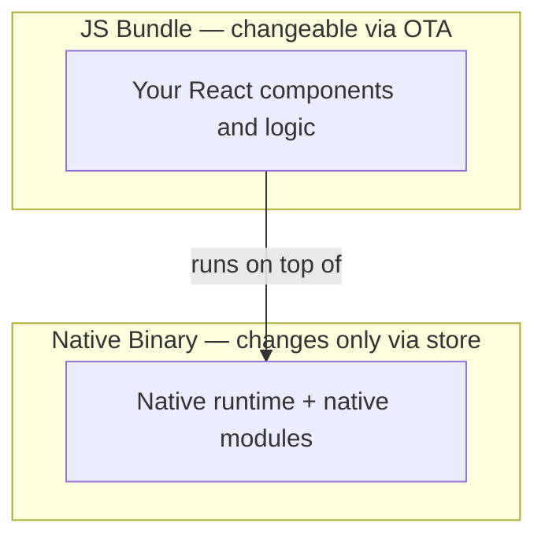
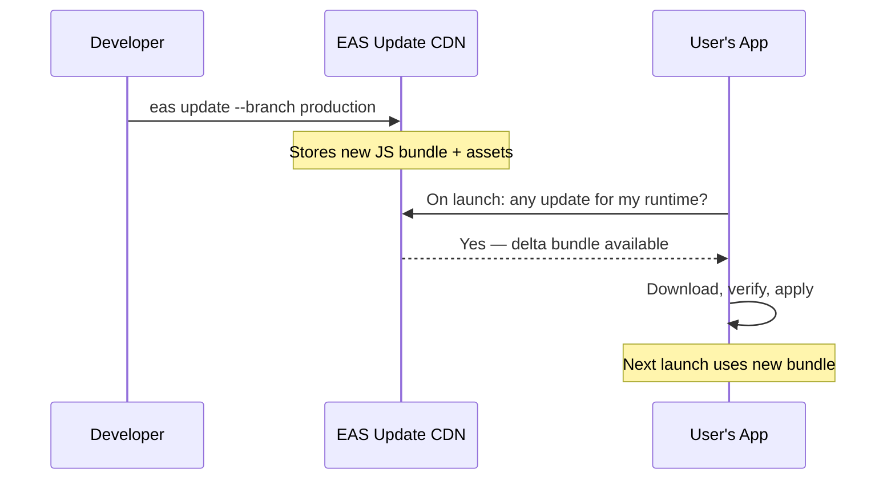
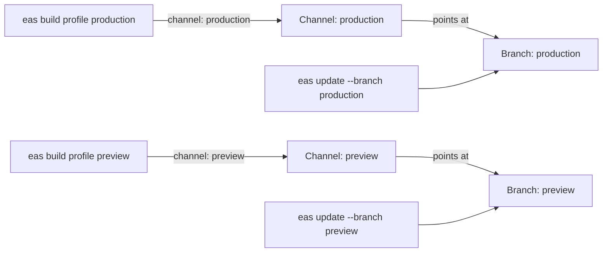
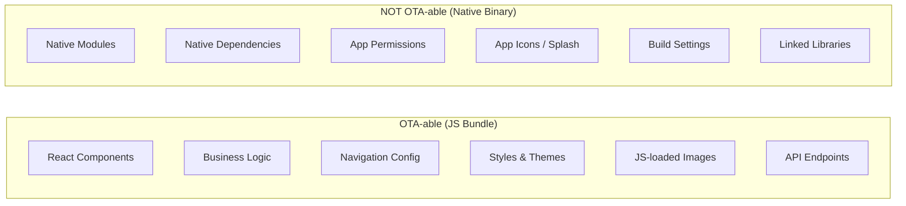
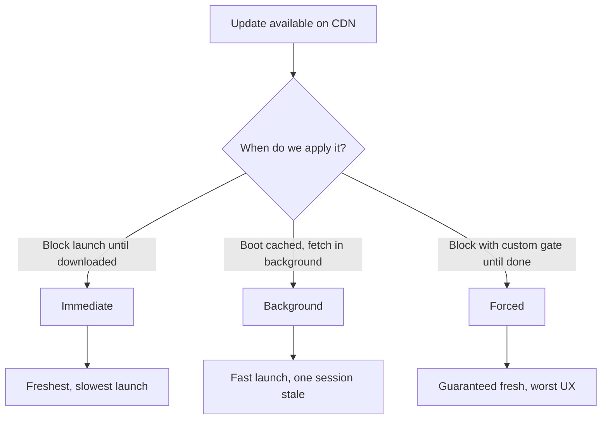
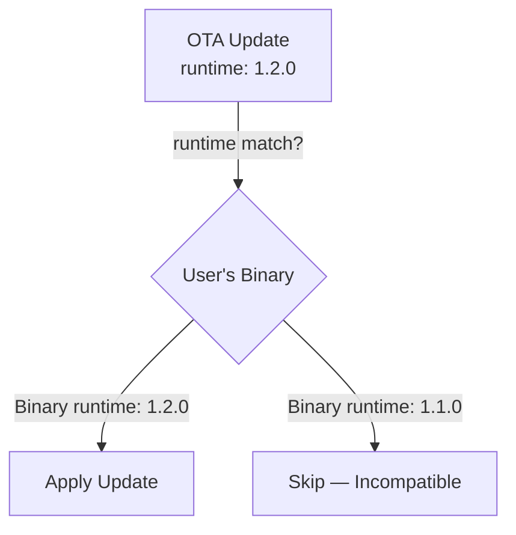
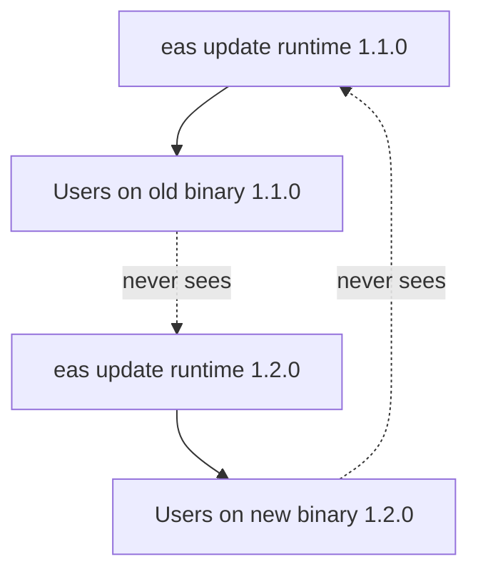
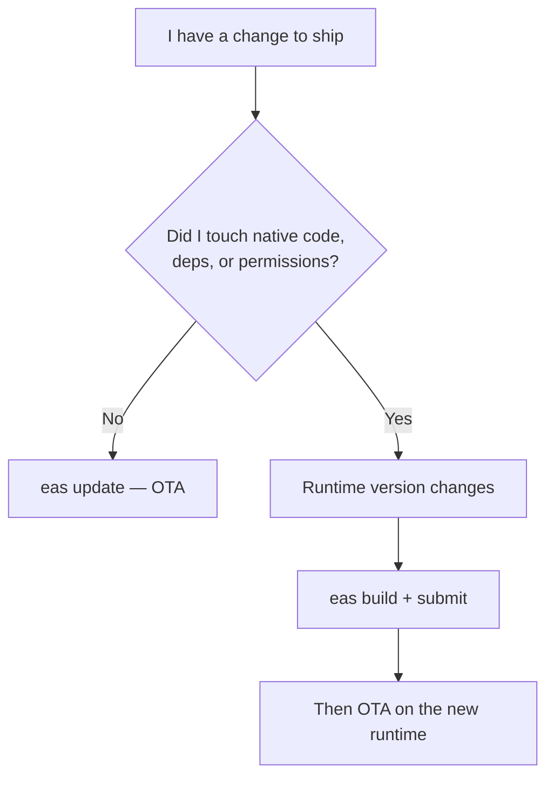
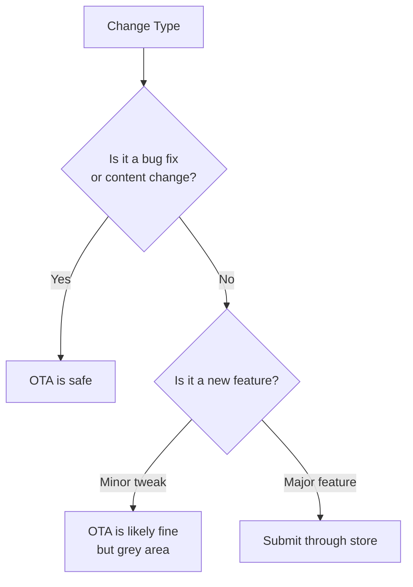

# OTA Updates: Distribuire senza l'App Store

> EAS Update, download delta, versionamento del runtime e le regole di compliance che devi rispettare.

---

## Table of Contents

1. [EAS Update](#1-eas-update)
2. [What Can Be OTA'd](#2-what-can-be-otad)
3. [Update Strategy](#3-update-strategy)
4. [Versioning OTA with Native](#4-versioning-ota-with-native)
5. [Compliance](#5-compliance)

---

## 1. EAS Update

Sul web, distribuire una correzione è banale. Pubblichi un nuovo bundle sulla tua CDN, il successivo caricamento della pagina lo recupera e i tuoi utenti non notano alcuna differenza. Non c'è alcun guardiano tra te e i tuoi utenti: il browser scarica HTML, CSS e JavaScript freschi ogni volta, quindi "deploy" e "live" significano la stessa cosa. Nel mobile, il percorso predefinito è brutale: build, invio, attesa della revisione, attesa che gli utenti aggiornino. La correzione di un refuso può impiegare giorni per raggiungere il tuo pubblico.

Perché il mobile è così diverso? Perché un'app nativa è un **binario compilato** installato sul dispositivo, non un documento recuperato da un server. Per modificare qualsiasi cosa in quel binario, il sistema operativo richiede un nuovo pacchetto firmato, e sia Apple che Google inseriscono una fase di revisione prima che quel pacchetto raggiunga gli utenti. Gli aggiornamenti OTA ("over-the-air") esistono per recuperare parte dell'agilità del web trattando la porzione JavaScript della tua app come un bundle web che può essere sostituito indipendentemente dal binario.

### Il Modello Mentale

Pensa a un'app React Native come a due livelli impilati uno sopra l'altro:



Il **binario nativo** è il motore: il runtime di React Native, il motore JavaScript (Hermes) e qualsiasi modulo nativo (fotocamera, mappe, pagamenti). Cambia solo attraverso l'App Store / Play Store. Il **JS bundle** è lo script che il motore esegue: i tuoi componenti, la logica di business e gli stili. EAS Update ti permette di sostituire quello script senza toccare il motore.

> **Analogia**: Il binario nativo è una console per videogiochi. Il JS bundle sono i dati della cartuccia del gioco. Gli aggiornamenti OTA ti permettono di applicare patch alla logica del gioco senza spedire agli utenti una nuova console — ma non puoi mai aggiungere una nuova porta per il controller (capacità nativa) via etere.

EAS Update ti offre il ciclo di deployment in stile web per la parte JavaScript della tua app React Native. Pubblichi un aggiornamento dal tuo terminale e, la prossima volta che un utente apre la tua app, riceve il nuovo bundle — nessuna revisione dello store, nessun incremento di versione, nessuna attesa.

### Come Funziona

Sotto il cofano, EAS Update carica il tuo JS bundle e i suoi asset sulla CDN di Expo. Quando la tua app si avvia, la libreria `expo-updates` controlla sul server se esiste un bundle più recente che corrisponde alla runtime version corrente. Se ne esiste uno, lo scarica (usando la compressione delta quando possibile) e lo applica secondo la strategia che hai scelto.

I **download delta** sono un importante trucco di efficienza: anziché riscaricare l'intero bundle di diversi megabyte, il client comunica al server quali asset possiede già, e il server invia solo le parti modificate. La correzione di una sola riga di testo potrebbe essere di pochi kilobyte sulla rete invece dell'intera app. Questo è concettualmente simile a come un `git pull` recupera solo i nuovi commit anziché riclonare l'intero repo.



### Configurarlo

Per prima cosa, installa la libreria updates e configura il tuo progetto:

```bash
npx expo install expo-updates
eas update:configure
```

Questo aggiunge la configurazione necessaria al tuo `app.json` (un blocco `updates` più un project ID che lega la tua app ai server di Expo). Ora puoi pubblicare gli aggiornamenti:

```bash
# Push to a specific branch
eas update --branch production --message "Fix checkout crash"

# Push to a channel (maps branches to builds)
eas update --channel production --message "Fix checkout crash"
```

Ogni `eas update` produce un aggiornamento immutabile e indirizzato per contenuto, con un proprio ID. Non sovrascrivi mai un aggiornamento precedente: ne pubblichi uno nuovo e fai puntare il branch ad esso. È questo che rende istantaneo il rollback: il vecchio aggiornamento esiste ancora sulla CDN, intatto.

### Channel e Branch

Questa è la parte che i principianti trovano più confusa, quindi siamo precisi. Ci sono due concetti correlati:

- Un **branch** è una linea mobile di aggiornamenti (molto simile a un branch Git). Pubblichi gli aggiornamenti su un branch, e l'ultimo è quello che i client ricevono.
- Un **channel** è un'etichetta incorporata in una build che decide *a quale branch quella build resta in ascolto*. I channel sono il collante tra le tue build e i tuoi aggiornamenti.

Pensa ai channel come a target di deployment:

- **production** — collegato alle tue build dell'App Store / Play Store
- **preview** — collegato alle build per il testing interno
- **staging** — collegato alle build di QA

Una build viene compilata con uno specifico channel incorporato. Quando quella build controlla gli aggiornamenti, vede solo gli aggiornamenti pubblicati sul branch del suo channel. Questo significa che puoi pubblicare una correzione rischiosa su `staging`, verificarla, e poi pubblicare lo stesso bundle su `production`.



```bash
# Build with a channel
eas build --profile production  # channel: production
eas build --profile preview     # channel: preview

# Push update to staging first
eas update --channel staging --message "Test new cart logic"

# After QA passes, push to production
eas update --channel production --message "Fix cart total rounding"
```

> **Consiglio da esperti**: Poiché un channel è disaccoppiato da un branch, puoi ri-puntare un channel a un branch diverso dalla dashboard di Expo senza ricostruire. Questo è il meccanismo alla base dei workflow di promozione: il QA approva il branch e tu fai puntare il channel di `production` ad esso.

### Rollback

Hai pubblicato un aggiornamento difettoso? Esegui il rollback istantaneamente:

```bash
# Roll back to the previous update on a branch
eas update:rollback --branch production
```

Nessuna revisione dello store. Nessuna attesa. I tuoi utenti ricevono il bundle valido precedente al loro prossimo avvio. Questo da solo giustifica l'uso degli aggiornamenti OTA: la rete di sicurezza del rollback istantaneo vale il costo di configurazione. Sul web, la tua strategia di rollback è "ridistribuisci la build precedente"; con EAS Update ottieni la stessa velocità sul nativo.

> **Trabocchetto**: Il rollback ripristina il JS bundle precedente, non il bundle incorporato distribuito con il binario. Se hai bisogno di tornare completamente all'originale, dovrai ripubblicare il bundle originale come nuovo aggiornamento.

> **Consiglio da esperti**: Un "rollback" è esso stesso solo un altro evento di pubblicazione sotto il cofano: dice ai client di tornare indietro. Gli utenti lo vedono solo al loro *prossimo* controllo degli aggiornamenti, quindi il rollback è veloce ma non istantaneo per un utente nel mezzo di una sessione. Combinalo con la tua update strategy (sezione successiva) per capire esattamente quando gli utenti recupereranno.

---

## 2. Cosa Può Essere Distribuito via OTA

Questo è il concetto singolo più importante da interiorizzare. Sbaglialo e la tua app andrà in crash per ogni utente che non ha aggiornato attraverso lo store.

### La Regola

Gli aggiornamenti OTA sostituiscono il tuo **JS bundle e gli asset caricabili**. Non possono toccare nulla di compilato nel binario nativo.

La ragione risale direttamente al modello a due livelli della Sezione 1. Il JS bundle è *dati* che il motore nativo legge a runtime, quindi può essere sostituito liberamente. Il codice nativo sono *istruzioni macchina* incorporate nel binario firmato; il sistema operativo non ti permetterà di alterarle senza un pacchetto fresco e ri-firmato che passi attraverso la revisione.



### Cosa PUOI Distribuire via OTA

- **Componenti React** — nuove schermate, modifiche al layout, ritocchi alla UI
- **Logica di business** — correzioni di calcoli, regole di validazione, gestione dello state
- **Struttura di navigazione** — riordino dei tab, aggiunta di schermate (se il navigator è solo JS)
- **Stili e temi** — colori, spaziatura, font (se caricati via JS)
- **Bundle di asset** — immagini importate tramite `require()` o dati JSON inclusi nel bundle
- **Modifiche agli endpoint API** — cambio di URL, aggiunta di header, modifica della logica delle richieste

### Cosa NON PUOI Distribuire via OTA

- **Nuovi moduli nativi** — installare `react-native-vision-camera` richiede una build dello store
- **Aggiornamenti di dipendenze native** — incrementare la versione di un SDK nativo richiede la ricompilazione
- **Modifiche ai permessi** — aggiungere i permessi di geolocalizzazione o di notifiche push risiede nella configurazione nativa
- **Icone dell'app e splash screen** — compilate nel binario al momento della build
- **Aggiornamenti dell'Expo SDK** — questi spesso cambiano il codice nativo sotto il cofano

### Una Tabella di Riferimento Rapido

| Modifica | Distribuibile via OTA? | Perché |
|---|---|---|
| Correggere un bug in un componente `.tsx` | Sì | JS puro, risiede nel bundle |
| Cambiare un valore di colore o spaziatura | Sì | Stile valutato in JS |
| Sostituire un URL base API | Sì | Solo una stringa in JS |
| Aggiungere un'immagine tramite `require()` | Sì | Asset caricabile, distribuito con il bundle |
| `npx expo install react-native-maps` | No | Aggiunge codice nativo al binario |
| Aggiungere il permesso fotocamera | No | Dichiarato nel `Info.plist` / manifest nativo |
| Cambiare l'icona dell'app | No | Compilata nel binario |
| Aggiornare Expo SDK 50 → 51 | No | Cambia il runtime nativo |

### Il Test Pratico

Prima di pubblicare un aggiornamento OTA, chiediti: "Ho eseguito `npx expo install` o modificato qualcosa in `ios/` o `android/`?" Se sì, hai bisogno di una build dello store. Se hai toccato solo file `.ts`, `.tsx` o `.js` e i loro asset importati, l'OTA è sicuro.

Un'abitudine utile: esegui `npx expo-doctor` o ispeziona il tuo `git diff` prima di pubblicare. Se il diff tocca le dipendenze in `package.json`, la configurazione nativa di `app.json`, o qualsiasi cosa sotto `ios/`/`android/`, trattalo come una modifica al binario ed esegui una build, non un OTA.

> **Errore comune**: Installare un pacchetto con `npm install` che include codice nativo, e poi pubblicare un aggiornamento OTA. Il JS bundle fa riferimento a un modulo nativo che non esiste nel binario dell'utente. Risultato: crash istantaneo all'avvio per ogni utente. Verifica sempre se una nuova dipendenza contiene codice nativo prima di decidere tra OTA e aggiornamento dello store.

> **Consiglio da esperti**: Preferisci `npx expo install` a `npm install` per i pacchetti nativi. La CLI di Expo sa quali pacchetti contengono codice nativo e ti avviserà, e sceglie versioni compatibili con il tuo Expo SDK — una piccola abitudine che previene il crash di cui sopra.

---

## 3. Update Strategy

Come e quando la tua app applica un aggiornamento conta più di quanto potresti pensare. Una strategia scadente significa utenti che fissano spinner di caricamento o che restano senza correzioni critiche per giorni. La tensione di fondo è sempre la stessa: **freschezza** (eseguire il codice più recente) contro **velocità di avvio** (non bloccare l'utente mentre scarichi). Ogni strategia qui sotto è semplicemente un punto diverso su questo compromesso.



### Confronto delle Strategie

| Strategia | Costo di avvio | L'utente vede il nuovo codice | Ideale per |
|---|---|---|---|
| Immediate | Alto (attende il download) | Questo avvio | Bug critico che affligge i flussi principali |
| Background | Nessuno | Avvio successivo | Default — quasi tutto |
| Forced | Alto + UI bloccante | Questo avvio, garantito | Modifica API breaking, fix di sicurezza |

### Le Tre Strategie

#### Immediate: Recupera e Applica all'Avvio

L'app controlla gli aggiornamenti all'avvio, scarica il nuovo bundle e si riavvia per applicarlo — il tutto prima che l'utente veda la schermata principale.

```tsx
// app.json
{
  "expo": {
    "updates": {
      "checkAutomatically": "ON_LAUNCH",
      "fallbackToCacheTimeout": 3000
    }
  }
}
```

**Pro**: Gli utenti eseguono sempre il codice più recente. Le correzioni critiche arrivano istantaneamente.

**Contro**: Aggiunge latenza all'avvio. Se il download è lento, gli utenti attendono. Il `fallbackToCacheTimeout` imposta un limite massimo — dopo 3 secondi, l'app carica il bundle in cache a prescindere. Pensalo come una scadenza: "attendi fino a 3 secondi per un bundle fresco, poi rinuncia e avvia ciò che abbiamo".

**Usa quando**: Hai un bug critico che affligge le funzionalità principali e hai bisogno che ogni utente passi alla correzione immediatamente.

#### Background: Scarica Silenziosamente, Applica al Prossimo Avvio

L'app si avvia con qualsiasi bundle abbia, poi controlla gli aggiornamenti in background. Se è disponibile un nuovo bundle, lo scarica silenziosamente. L'aggiornamento si applica la volta successiva che l'utente apre l'app.

```tsx
// app.json
{
  "expo": {
    "updates": {
      "checkAutomatically": "ON_LAUNCH",
      "fallbackToCacheTimeout": 0
    }
  }
}
```

Impostare `fallbackToCacheTimeout` a `0` significa che l'app non attende mai — avvia sempre immediatamente il bundle in cache, poi recupera in background.

**Pro**: Zero penalità all'avvio. Invisibile agli utenti. La migliore esperienza complessiva.

**Contro**: Gli utenti eseguono codice obsoleto per una sessione dopo che pubblichi un aggiornamento. In pratica, la seconda volta che aprono l'app sono aggiornati.

**Questa è la strategia che dovresti usare per default.** La stragrande maggioranza degli aggiornamenti non è così urgente da giustificare il rallentamento di ogni avvio dell'app.

Puoi anche sollecitare gli utenti che sono ancora sul vecchio bundle ascoltando l'evento di download in background e offrendo un gentile invito al reload:

```tsx
import * as Updates from 'expo-updates';
import { useEffect } from 'react';
import { Alert } from 'react-native';

// expo-updates emits events as background downloads progress
function useReloadPrompt() {
  useEffect(() => {
    const sub = Updates.addUpdatesStateChangeListener((event) => {
      if (event.context.isUpdatePending) {
        // A new bundle finished downloading in the background
        Alert.alert('Update ready', 'Restart to get the latest version?', [
          { text: 'Later' },
          { text: 'Restart', onPress: () => Updates.reloadAsync() },
        ]);
      }
    });
    return () => sub.remove();
  }, []);
}
```

#### Forced: Blocca Fino all'Aggiornamento

L'app mostra una schermata bloccante e si rifiuta di procedere finché l'aggiornamento non è scaricato e applicato. Questo richiede codice personalizzato:

```tsx
import * as Updates from 'expo-updates';
import { View, Text, ActivityIndicator } from 'react-native';
import { useEffect, useState } from 'react';

function ForceUpdateGate({ children }: { children: React.ReactNode }) {
  const [isUpdating, setIsUpdating] = useState(true);

  useEffect(() => {
    async function checkForUpdate() {
      try {
        const update = await Updates.checkForUpdateAsync();
        if (update.isAvailable) {
          await Updates.fetchUpdateAsync();
          await Updates.reloadAsync(); // Restarts the app
        }
      } catch (e) {
        // Update check failed — let the user through
        console.warn('Update check failed:', e);
      } finally {
        setIsUpdating(false);
      }
    }

    if (!__DEV__) {
      checkForUpdate();
    } else {
      setIsUpdating(false);
    }
  }, []);

  if (isUpdating) {
    return (
      <View style={{ flex: 1, justifyContent: 'center', alignItems: 'center' }}>
        <ActivityIndicator size="large" />
        <Text style={{ marginTop: 16 }}>Updating app…</Text>
      </View>
    );
  }

  return <>{children}</>;
}
```

Nota la guardia `if (!__DEV__)`: i controlli degli aggiornamenti sono disabilitati in fase di sviluppo perché non c'è alcun aggiornamento pubblicato da recuperare e non vuoi bloccare il tuo ciclo di sviluppo. Questo è l'equivalente React Native del gating dell'analytics o dell'error reporting dietro `process.env.NODE_ENV === 'production'` sul web.

**Usa con parsimonia.** Questo è appropriato quando un contratto API è cambiato lato server e i vecchi client si romperanno, o quando una vulnerabilità di sicurezza rende pericoloso eseguire vecchio codice. Non usarlo mai per aggiornamenti estetici.

> **Trabocchetto**: Avvolgi sempre i controlli degli aggiornamenti in un try/catch. Se l'utente non ha rete e il tuo forced update gate non ha un fallback, viene completamente bloccato fuori dalla tua app. Fornisci sempre un timeout o una via di fuga del tipo "continua comunque".

> **Consiglio da esperti**: Per modifiche veramente breaking, abbina l'OTA a un controllo della "minimum supported version" guidato dal server. Il server restituisce un flag, e il client o blocca duramente con una schermata "aggiorna dallo store" (per rotture a livello nativo) o attiva un OTA forzato (per rotture a livello JS). L'OTA da solo non può risolvere un problema che risiede nel binario nativo.

---

## 4. Versionamento OTA con il Nativo

È qui che la maggior parte dei team inciampa. Pubblichi un aggiornamento JS che fa riferimento a un modulo nativo aggiunto in una build recente, ma metà dei tuoi utenti è ancora sul vecchio binario. La loro app va in crash. Vai nel panico. Esegui il rollback. Metti in dubbio le tue scelte di carriera.

Il versionamento del runtime previene tutto questo. L'idea di fondo: un aggiornamento dovrebbe arrivare solo su un binario che sia *in grado di eseguirlo*. La runtime version è il contratto di compatibilità che lo impone.

### Come Funzionano le Runtime Version

Ogni build nativa è marchiata con una **runtime version**. Anche ogni aggiornamento OTA è marchiato con una runtime version. La libreria `expo-updates` applicherà un aggiornamento solo se le runtime version corrispondono. Se non corrispondono, l'aggiornamento è semplicemente invisibile a quel binario — il client si comporta come se non esistesse alcun aggiornamento, che è esattamente il comportamento sicuro che desideri.

> **Analogia**: Una runtime version è come la versione del formato dei file di salvataggio in un videogioco. Un salvataggio (l'aggiornamento OTA) creato per il formato `1.2.0` può essere caricato solo da un motore di gioco (il binario) che comprende il formato `1.2.0`. Consegnalo a un motore più vecchio e si rifiuterà, anziché andare in crash a metà del caricamento.



È per questo che puoi avere in sicurezza *più* versioni del binario in circolazione contemporaneamente. Gli utenti sul vecchio binario `1.1.0` continuano a ricevere gli aggiornamenti `1.1.0`; gli utenti che hanno aggiornato al binario `1.2.0` ricevono gli aggiornamenti `1.2.0`. Ogni popolazione riceve JS compatibile.



### Configurare la Runtime Version

Nel tuo `app.json`, imposta la runtime version esplicitamente:

```tsx
{
  "expo": {
    "runtimeVersion": "1.2.0"
  }
}
```

Oppure usa la policy automatica che la deriva dalle tue dipendenze native:

```tsx
{
  "expo": {
    "runtimeVersion": {
      "policy": "fingerprint"
    }
  }
}
```

La policy `fingerprint` calcola un hash delle tue dipendenze native, dei file di progetto nativi e della configurazione di Expo per generare una runtime version deterministica. Se una qualsiasi dipendenza nativa cambia, il fingerprint cambia, e i vecchi binari non recupereranno il nuovo aggiornamento. Questa è l'opzione più sicura — rimuove l'errore umano dall'equazione, perché la decisione di compatibilità è calcolata da ciò che è effettivamente presente nel tuo livello nativo anziché da un numero che un umano si è ricordato di incrementare.

### Confronto delle Policy di Runtime Version

| Policy | Come viene derivata la versione | Quando usarla |
|---|---|---|
| Stringa esplicita (`"1.2.0"`) | La imposti manualmente | Piccoli team che si ricordano in modo affidabile di incrementarla in caso di modifiche native |
| `appVersion` | Segue il campo `version` della tua app | App semplici in cui ogni rilascio incrementa la versione |
| `fingerprint` | Hash delle dipendenze native + configurazione + directory native | **Default consigliato** — automatico e a prova di crash |

### Quando Incrementare la Runtime Version

Se gestisci le runtime version manualmente, segui questa regola:

| Modifica | Incrementare la Runtime? |
|---|---|
| Correggere un refuso in un componente | No |
| Cambiare la logica di business in JS | No |
| Aggiungere una nuova libreria solo JS | No |
| Installare una libreria con codice nativo | **Sì** |
| Aggiornare l'Expo SDK | **Sì** |
| Modificare direttamente `ios/` o `android/` | **Sì** |
| Cambiare i permessi dell'app | **Sì** |

### Il Workflow

Ecco il flusso completo per un team che distribuisce sia build dello store che aggiornamenti OTA:

```bash
# 1. Normal JS-only fix — OTA is fine
git commit -m "fix: correct tax calculation"
eas update --channel production --message "Fix tax calc"

# 2. Adding a native dependency — need a store build
npx expo install react-native-maps
# Runtime version changes automatically with fingerprint policy
eas build --profile production
# Submit new binary to stores
eas submit --platform all
# Now OTA updates target the new runtime version
eas update --channel production --message "Add store locator map"
```

La decisione tra "OTA o build?" si riduce a una singola domanda, visualizzata qui sotto:



> **Errore comune**: Usare una runtime version statica come `"1.0.0"` e non incrementarla mai. Installi una libreria nativa, pubblichi un aggiornamento OTA, e ogni utente sul vecchio binario va in crash. Usa la policy `fingerprint` a meno che tu non abbia una ragione specifica per non farlo — gestisce questo automaticamente.

---

## 5. Compliance

Puoi costruire la pipeline OTA più elegante del mondo, e Apple può comunque rifiutare la tua app o rimuoverla dallo store se violi le sue linee guida. Questa sezione non è una lettura facoltativa. La posta in gioco è più alta di una build rifiutata: un abuso ripetuto o deliberato può portare alla chiusura del tuo account sviluppatore, che fa cadere *tutte* le tue app.

### Perché Esistono le Regole

L'App Review è la promessa di Apple agli utenti che ciò che installano è stato verificato. Gli aggiornamenti OTA ti permettono di modificare l'app *dopo* la revisione, quindi le regole di Apple esistono per garantire che tu non possa usare l'OTA per introdurre di nascosto qualcosa che avrebbero rifiutato. Il modello mentale che ti mantiene al sicuro: **l'OTA è la tua corsia per gli hotfix, lo store è il tuo processo di rilascio.** Finché le tue modifiche via etere restano nello spirito di "correzioni e miglioramenti a un'app già revisionata", sei a posto.

### Le Regole di Apple

Le App Store Review Guidelines di Apple (in particolare la sezione 3.3.2) consentono di scaricare codice eseguibile in un'app **solo** se il codice:

- Non cambia lo scopo primario dell'app
- Non crea uno store o una vetrina all'interno dell'app
- È usato per **correzioni di bug e miglioramenti** — non per aggirare l'App Review aggiungendo funzionalità

L'interpretazione pratica: puoi pubblicare correzioni di bug, miglioramenti delle prestazioni, modifiche ai testi e piccoli ritocchi alla UI via OTA. Non dovresti usare l'OTA per distribuire funzionalità completamente nuove che cambierebbero l'esperienza che Apple ha revisionato.

### Le Regole di Google

Google Play è più indulgente. La loro policy consente di scaricare codice eseguibile finché è conforme alle Developer Program Policies. In pratica, Google raramente applica restrizioni sugli aggiornamenti del JS bundle. Ma "raramente applica" non è "non applica mai" — resta nello spirito delle regole. Progettare il tuo processo attorno alle regole più rigide di Apple significa che sei automaticamente conforme a quelle di Google, quindi usa Apple come tuo riferimento di base.

### Cosa Significa nella Pratica



**Sicuro per l'OTA:**
- Correggere un crash o un bug
- Aggiornare testi, traduzioni, copy
- Cambiare colori, spaziatura, ritocchi al layout
- Modificare la logica di business (calcoli delle imposte, regole di validazione)
- Sostituire endpoint API
- Variazioni di A/B test (se la funzionalità era già stata revisionata)

**Zona grigia:**
- Aggiungere una nuova schermata a un flusso esistente
- Cambiare la struttura di navigazione
- Abilitare un feature flag per qualcosa non ancora revisionato

**Richiede l'invio allo store:**
- Aggiungere una funzionalità completamente nuova (ad esempio, un sistema di chat, un flusso di pagamento)
- Cambiare lo scopo o la funzionalità di base dell'app
- Aggiungere nuovi requisiti di permessi (anche se il lato nativo li ha già dichiarati)

### Raccomandazioni

1. **Usa l'OTA per le correzioni, lo store per le funzionalità.** Questa non è solo una regola di compliance — è una buona pratica. Le nuove funzionalità meritano il ciclo di QA che una build completa fornisce.

2. **Mantieni un changelog.** Se Apple dovesse mai mettere in dubbio il tuo uso dell'OTA, vuoi poter dimostrare che i tuoi aggiornamenti sono correzioni di bug e miglioramenti, non contrabbando di funzionalità. Il tuo `--message` su ogni `eas update` funge anche da questa traccia di audit.

3. **Non usare l'OTA per aggirare la revisione intenzionalmente.** Alcuni team distribuiscono un'app scheletro, la fanno approvare, e poi vi sovrappongono via OTA la vera app. Apple si è accorta di questo. Se ti scoprono, rischi la chiusura dell'account — non solo la rimozione dell'app.

4. **I feature flag vanno bene** — purché le funzionalità dietro di essi siano state inviate per la revisione a un certo punto. Attivare una funzionalità revisionata via OTA è una pratica standard. Distribuire codice non revisionabile dietro un flag non lo è.

> **In sintesi**: Gli aggiornamenti OTA sono un meccanismo di deployment, non un modo per evitare l'App Review. Tratta gli invii allo store come il tuo processo di rilascio per le nuove funzionalità, e l'OTA come la tua corsia per gli hotfix. Se segui quel modello mentale, non avrai mai un problema di compliance.