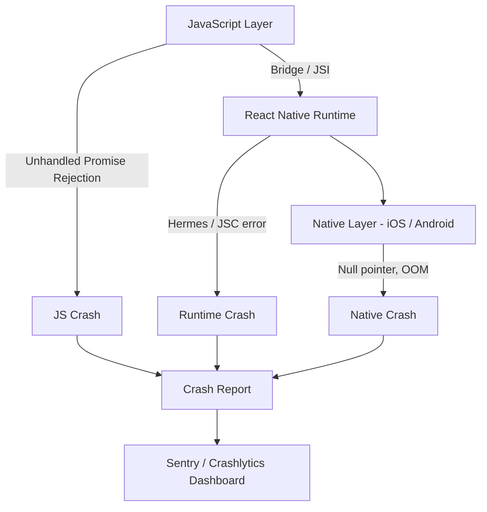
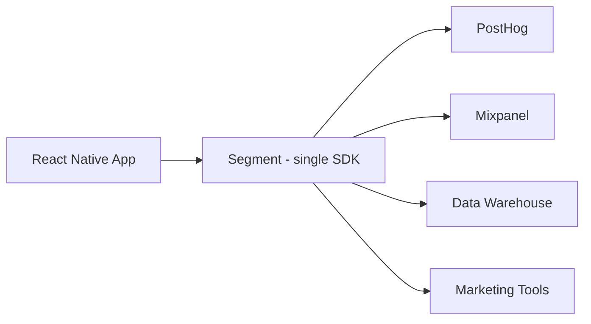
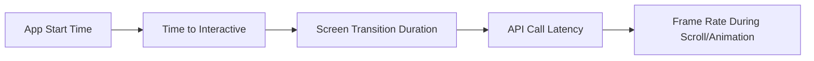
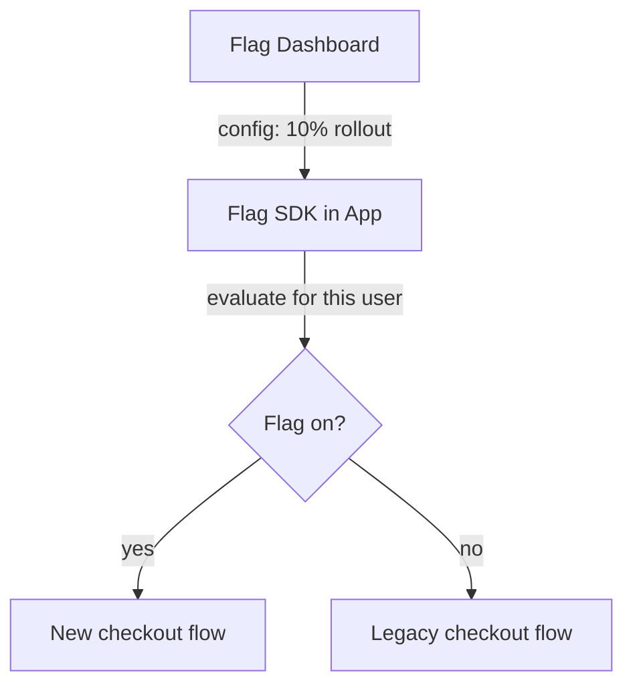
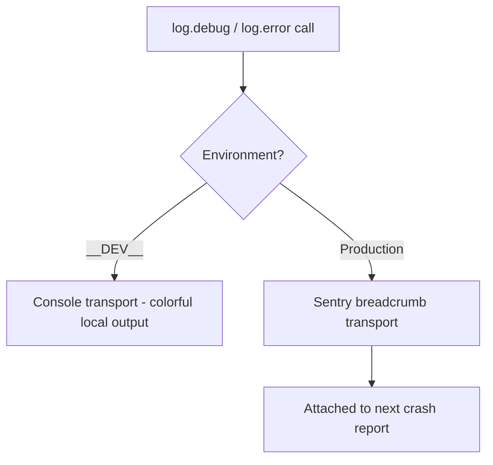
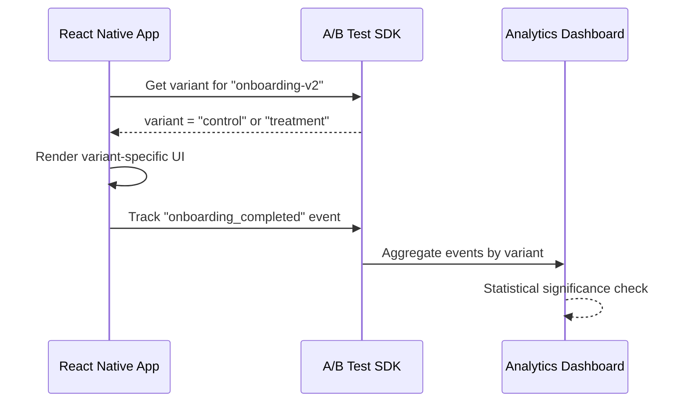

# Monitoraggio e Produzione: Mantenere la tua App in Salute

> Crash reporting, analytics, feature flags e lo stack di osservabilità per le app mobile in produzione.

---

## Table of Contents

1. [Crash Reporting](#1-crash-reporting)
2. [Analytics](#2-analytics)
3. [Performance Monitoring](#3-performance-monitoring)
4. [Feature Flags and Remote Config](#4-feature-flags-and-remote-config)
5. [Logging](#5-logging)
6. [A/B Testing](#6-ab-testing)

---

## 1. Crash Reporting

Sul web, un'eccezione non gestita mostra una schermata bianca e magari attiva il tuo error boundary. L'utente ricarica la pagina e la vita continua. Su mobile, un'eccezione non gestita termina l'app. L'utente si ritrova davanti alla schermata home del sistema operativo. Nessuno stack trace, nessuna scheda di rete, nessun passaggio per riprodurre il problema. Se non disponi del crash reporting, stai navigando alla cieca.

Pensa al crash reporting come alla scatola nera di un aereo. Non puoi stare dietro a ogni utente a osservare il suo schermo, quindi installi un registratore che cattura gli ultimi istanti prima di un crash — l'errore, il dispositivo, la versione del sistema operativo, le azioni recenti dell'utente — e ti rispedisce quel report. Senza di esso, il tuo unico canale di feedback è una recensione da una stella che dice "continua a crashare" senza alcun dettaglio su cui poter agire.

### Perché Non Basta un Try/Catch

Sul web puoi avvolgere il codice rischioso in un `try/catch` e recuperare. Questo funziona ancora in React Native per gli errori JS sincroni — ma la maggior parte dei crash in produzione *non* avviene nel codice che hai avvolto. Provengono da un render che genera un errore, da un timer in background, da un native module o dal sistema operativo che termina la tua app perché usa troppa memoria. Non puoi avvolgere quei casi. Ti serve uno strumento che si agganci ai global error handler di tutti e tre i layer sottostanti.

### Perché i Crash Sono Più Difficili su Mobile

Un'app React Native ha tre layer in cui le cose possono andare storte:



Un errore JavaScript, un null pointer nativo, un crash del motore Hermes — ciascuno produce un tipo diverso di stack trace, e ciascuno richiede strumenti diversi per la simbolicazione. "Simbolicare" significa trasformare gli indirizzi criptici e i nomi minificati di un crash dump grezzo nei veri nomi di file, nomi di funzione e numeri di riga che hai scritto. Un crash nativo grezzo appare come `0x00012f4a`; simbolicato, si legge `PaymentScreen.tsx:42`. L'intero gioco del crash reporting consiste nel passare dal primo al secondo.

| Layer | Esempio di crash | Cosa ti serve per leggerlo |
|-------|---------------|--------------------------|
| JavaScript | `undefined is not a function`, unhandled promise rejection | **Source maps** (mappano il JS minificato al tuo sorgente) |
| RN Runtime | Errore del motore Hermes, chiamata JSI errata | Source maps + simboli RN |
| Native (iOS/Android) | Null pointer, terminazione per out-of-memory (OOM) | File **dSYM** (iOS) / **ProGuard mapping** (Android) |

> Il motivo più comune in assoluto per cui un crash report è inutile: la build caricata non aveva source maps o file di simboli, quindi ogni riga si legge `<anonymous>:1:148293`. Configura l'upload dei simboli fin dal primo giorno, prima di rilasciare.

### Sentry: lo Standard di Riferimento

Sentry è la migliore opzione per il crash reporting in React Native. Cattura le eccezioni JS, i crash nativi su entrambe le piattaforme e ti fornisce stack trace con source map se carichi le tue maps.

```bash
npx expo install @sentry/react-native
```

```tsx
// App.tsx
import * as Sentry from "@sentry/react-native";

Sentry.init({
  dsn: "https://your-dsn@sentry.io/project-id",
  tracesSampleRate: 0.2,              // 20% of transactions for performance
  enableAutoSessionTracking: true,    // tracks "crash-free session" rate
  attachStacktrace: true,             // include a stack trace on captureMessage too
  environment: __DEV__ ? "development" : "production", // separate dev noise from real crashes
});

export default Sentry.wrap(function App() {
  return <RootNavigator />;
});
```

La chiamata `Sentry.wrap()` fa il grosso del lavoro: installa un global error handler così che qualsiasi errore non catturato in qualunque punto del tuo component tree venga segnalato automaticamente — non devi catturare nulla manualmente. Il `dsn` (Data Source Name) è semplicemente l'indirizzo che indica all'SDK a quale progetto Sentry inviare i report; è sicuro distribuirlo nella tua app.

Puoi anche segnalare esplicitamente gli errori gestiti, il che è ottimo per le situazioni del tipo "questo non dovrebbe accadere ma non ha causato un crash":

```tsx
try {
  await syncOfflineQueue();
} catch (err) {
  // The app keeps working, but you still want to know this failed
  Sentry.captureException(err, {
    tags: { feature: "offline-sync" },
    extra: { queueLength: queue.length },
  });
}

// Attach context so reports are debuggable. Never include passwords/tokens here.
Sentry.setUser({ id: user.id }); // id only — not email/name if avoidable
```

Il passaggio cruciale che la maggior parte delle persone salta: **caricare le source maps**. Senza di esse, i tuoi stack trace JS sono spazzatura minificata.

```bash
# For Expo EAS builds — add the Sentry plugin in app.json
{
  "expo": {
    "plugins": [
      ["@sentry/react-native/expo", {
        "organization": "your-org",
        "project": "your-project"
      }]
    ]
  }
}
```

Per bare React Native, aggiungi gli script di build per la build phase di Sentry in Gradle e Xcode. La documentazione di `@sentry/react-native` ti guida nel processo, ma il succo è: il processo di build carica automaticamente le maps quando crei una release.

### Alternative

**Firebase Crashlytics** è gratuito ed eccellente per i crash nativi. Si integra strettamente con l'ecosistema Firebase. Lo svantaggio: il suo supporto ai crash JavaScript è più debole di quello di Sentry. Molti team li usano entrambi — Crashlytics per la visibilità sul layer nativo e Sentry per il JS.

**Bugsnag** è solido ma meno diffuso nella community RN. Meno tutorial, meno integrazioni della community.

| Strumento | Qualità crash JS | Qualità crash nativi | Prezzo | Quando usarlo |
|------|------------------|----------------------|-------|-------------|
| **Sentry** | Eccellente | Eccellente | Tier gratuito, poi a consumo | Scelta predefinita; il migliore end-to-end per JS + nativo + performance |
| **Firebase Crashlytics** | Più debole | Eccellente | Gratuito | Già sullo stack Firebase/Google, o budget limitato |
| **Bugsnag** | Buono | Buono | A pagamento | Standard aziendale esistente; altrimenti meno supporto dalla community RN |

> Suggerimento da esperti: non eseguire due crash reporter completi per sbaglio. Due SDK che installano entrambi global error handler possono produrre report doppi o contendersi l'handler. Se usi Crashlytics per il nativo e Sentry per il JS, delimita ciascuno deliberatamente invece di lasciare che entrambi catturino tutto.

### Insidie Comuni

- **Dimenticare di testare le release build in locale.** Le debug build si comportano diversamente — mantengono il dev menu, i log completi e il codice non minificato. I crash che si verificano solo in modalità release ti coglieranno di sorpresa se non esegui mai `npx expo run:ios --configuration Release`.
- **Non configurare un error boundary.** I crash reporter catturano l'eccezione, ma la tua app muore comunque. Avvolgi il tuo root component in un error boundary che mostri una schermata "qualcosa è andato storto" e un pulsante di riavvio. È lo stesso pattern dell'error boundary di React che useresti sul web — solo che qui fa la differenza tra una schermata di recupero elegante e l'utente scaraventato sulla schermata home.
- **Promise rejection.** Le unhandled promise rejection non sempre causano il crash dell'app, ma dovrebbero. Abilita l'opzione `enablePromiseRejectionTracking` in Sentry affinché compaiano nella tua dashboard.

```tsx
// A minimal root error boundary that reports to Sentry, then offers a way out
import * as Sentry from "@sentry/react-native";

class RootErrorBoundary extends React.Component<{ children: React.ReactNode }, { hasError: boolean }> {
  state = { hasError: false };

  static getDerivedStateFromError() {
    return { hasError: true };
  }

  componentDidCatch(error: Error, info: React.ErrorInfo) {
    Sentry.captureException(error, { extra: { componentStack: info.componentStack } });
  }

  render() {
    if (this.state.hasError) {
      return <FallbackScreen onRestart={() => this.setState({ hasError: false })} />;
    }
    return this.props.children;
  }
}
```

---

## 2. Analytics

Hai rilasciato l'app. Le persone la stanno scaricando. Ma la stanno usando? Le analytics rispondono alle domande a cui i crash report non possono rispondere: quali funzionalità vengono usate, dove gli utenti abbandonano e quali flussi sono interrotti senza tecnicamente causare un crash.

Il modello mentale: il crash reporting ti dice cosa si è *rotto*; le analytics ti dicono cosa è *successo*. Un checkout che silenziosamente non converte non è un crash — nulla ha generato un errore — ma è altrettanto fatale per il tuo business. Le analytics sono il modo in cui vedi i fallimenti invisibili: la schermata che nessuno apre, il pulsante che nessuno tocca, il form che tutti abbandonano al terzo passaggio.

### Event, Property e Identity — il Vocabolario di Base

Quasi ogni strumento di analytics condivide tre concetti:

- **Event** — una cosa con un nome che è accaduta: `"purchase_completed"`, `"screen_viewed"`. Questo è il verbo.
- **Property** — dettagli chiave/valore associati a un event: `{ price: 9.99, currency: "USD" }`. Questi sono gli aggettivi che ti permettono di analizzare i dati più tardi ("ricavi solo dagli utenti EUR").
- **Identity** — collegare gli event a un utente tramite `identify(userId)` così da poter seguire il percorso di una persona attraverso sessioni e dispositivi.

Se interiorizzi solo questi tre concetti, puoi imparare a usare qualsiasi SDK di analytics in un pomeriggio.

### Scegliere uno Strumento

| Strumento | Punto di forza | Prezzo | Ideale per |
|------|----------|-------|----------|
| **PostHog** | Product analytics + feature flags + session replay | Tier gratuito, poi a consumo | Startup che vogliono una soluzione all-in-one |
| **Mixpanel** | Event + funnel + retention | Tier gratuito fino a 20M di event | Team focalizzati sui funnel di conversione |
| **Amplitude** | Analisi delle coorti + segmentazione comportamentale | Tier gratuito | Team di prodotto orientati ai dati |
| **Firebase Analytics** | Gratuito, integra FCM e Crashlytics | Gratuito | Team attenti al budget o sullo stack Google |
| **Segment** | Non è uno strumento di analytics — è un condotto | A consumo | Team che inviano dati a 5+ destinazioni |

Il mio consiglio: inizia con **PostHog** se vuoi product analytics, feature flags e session replay da un unico SDK. Usa **Segment** se sai già che avrai bisogno di far fluire i dati verso più destinazioni (il tuo data warehouse, strumenti di marketing, strumenti di supporto).

La distinzione di Segment confonde le persone, quindi ecco il quadro. Segment non *analizza* nulla — è impiantistica. Invii ogni event una sola volta a Segment, e questo distribuisce quell'event a tutte le tue destinazioni. L'alternativa è installare cinque SDK e chiamare `capture()` cinque volte per ogni event.



### Setup di Base con PostHog

```bash
npx expo install posthog-react-native
```

```tsx
// App.tsx
import { PostHogProvider } from "posthog-react-native";

export default function App() {
  return (
    <PostHogProvider
      apiKey="phc_your_key"
      options={{
        host: "https://us.i.posthog.com", // or eu.i.posthog.com for EU data residency
      }}
    >
      <RootNavigator />
    </PostHogProvider>
  );
}
```

```tsx
// Inside any component
import { usePostHog } from "posthog-react-native";

function CheckoutScreen() {
  const posthog = usePostHog();

  const handlePurchase = (item: CartItem) => {
    // Event name = the verb. Properties = the details you'll slice by later.
    posthog.capture("purchase_completed", {
      item_id: item.id,
      price: item.price,
      currency: "USD",
    });
  };

  return <Button onPress={() => handlePurchase(item)} title="Buy" />;
}
```

```tsx
// After login, tie all future events to this user
posthog.identify(user.id, {
  plan: user.plan,        // person properties — used for cohorts and flag targeting
  signup_date: user.createdAt,
});

// On logout, reset so the next user's events aren't merged with this one
posthog.reset();
```

Sul web, potresti usare `window.analytics` o un tag `<script>`. In React Native, installi un SDK e avvolgi la tua app in un provider — lo stesso pattern di qualsiasi context React. Una differenza specifica del mobile: non c'è una barra degli URL, quindi le "page view" diventano **screen view**, che colleghi alla tua libreria di navigazione invece di ottenerle gratis dal browser.

### Cosa Tracciare

Non tracciare tutto. Traccia le decisioni:

- **Screen view** — quali schermate visitano effettivamente gli utenti?
- **Completamento delle azioni principali** — registrazione, acquisto, condivisione, salvataggio.
- **Abbandoni del funnel** — checkout iniziato ma non concluso, onboarding aperto ma saltato.
- **Stati di errore** — fallimenti delle API che l'utente ha vissuto (non solo i crash).

Una buona convenzione di denominazione ti risparmia mesi di sofferenza. Scegli `object_action` in `snake_case` (`cart_viewed`, `checkout_started`, `payment_failed`) e attieniti a quella ovunque. Convenzioni miste come `ViewedCart`, `cart-view` e `cartViewed` frammenteranno i tuoi funnel rendendoli inutilizzabili, perché la dashboard li tratta come tre event diversi.

> Resisti alla tentazione di tracciare ogni tocco di un pulsante. Annegherai nei dati senza trovare nulla. Inizia con 10-15 event che mappano i flussi chiave del tuo prodotto, poi espandi.

> Suggerimento da esperti: concorda la tassonomia degli event in un documento condiviso *prima* di scrivere la prima chiamata `capture()`. Rinominare un event in seguito non corregge retroattivamente i milioni di vecchi event già registrati sotto il vecchio nome.

---

## 3. Performance Monitoring

La tua app non crasha, ma sembra lenta. Le schermate impiegano 2 secondi a renderizzarsi. Le animazioni scattano. L'utente non apre una segnalazione di bug — semplicemente lascia una recensione da 2 stelle.

Il performance monitoring risponde a: quanto è veloce la mia app per gli utenti reali su dispositivi reali? Il "reale" conta. La tua macchina di sviluppo è un telefono di punta su Wi-Fi aziendale. Il tuo utente mediano è su un Android di tre anni fa con dati mobili instabili. RUM — **Real User Monitoring** — è il termine per misurare ciò che gli utenti effettivi sperimentano nel mondo reale, in contrapposizione ai benchmark sintetici sul tuo dispositivo.

### Perché "Fluido" Significa 60fps — e Perché il JS Thread Conta

Gli schermi mobile si ridisegnano 60 volte al secondo (sui dispositivi più recenti, 120). Questo dà a ogni frame circa **16 millisecondi** per essere pronto. Se il tuo JavaScript è occupato a calcolare qualcosa per 50ms, diversi frame vengono saltati — l'utente vede uno scatto, chiamato "jank". In React Native, il layout, le gesture e la logica dei tuoi componenti condividono tutti un unico JS thread, quindi un singolo render costoso può bloccare l'intera UI. Ecco perché "cosa è lento" su mobile di solito significa "cosa sta bloccando il JS thread", un concetto che non ha un equivalente web esatto perché i browser scaricano più lavoro su thread separati.

### Cosa Misurare



**Tempo di avvio dell'app** — cold start (l'app non era in memoria) vs. warm start (l'app era in background). Su Android in particolare, il cold start può essere dolorosamente lento se il tuo bundle JS è grande.

**Render lenti** — re-render di React che bloccano il JS thread. Sentry Performance può rilevarli automaticamente.

**Latenza delle API come la sperimenta l'utente** — non quello che dicono i log del tuo server, ma quanto a lungo ha atteso l'utente. Il tuo server potrebbe segnalare una risposta da 40ms, ma l'utente in metropolitana con una sola tacca ha aspettato 4 secondi. Solo la misurazione lato client cattura questo.

| Metrica | Cosa ti dice | Obiettivo ideale (indicativo) |
|--------|-------------------|---------------------|
| Tempo di cold start | Quanto passa dal tocco dell'icona all'usabilità | < 2s |
| Time to interactive | Quando l'utente può effettivamente toccare le cose | < 1s dopo la prima schermata |
| Transizione di schermata | La navigazione sembra istantanea o lenta | < 300ms |
| Frame rate (scroll/animazione) | Fluidità visiva ("jank") | 60fps (nessun frame perso) |
| Latenza API (P95) | Tempo di attesa reale per la coda lenta | < 1s |

### Sentry Performance

Se usi già Sentry per il crash reporting, abilitare il performance monitoring è una singola modifica di configurazione:

```tsx
Sentry.init({
  dsn: "your-dsn",
  tracesSampleRate: 0.2,
  enableAutoPerformanceTracing: true, // auto-instruments navigation
});
```

Questo ti fornisce trace automatici per le transizioni di schermata (se usi React Navigation), span delle richieste HTTP e rilevamento dei frame JS lenti. Un "trace" è una registrazione cronometrata di un'operazione; gli "span" sono i sotto-passaggi al suo interno. Pensa a un trace come a un cronometro per "carica il feed" e a ogni span come al tempo sul giro per "recupera i dati", "analizza il JSON", "renderizza la lista".

Per misurazioni personalizzate:

```tsx
const transaction = Sentry.startTransaction({ name: "load-feed" });
const span = transaction.startChild({ op: "api.fetch", description: "GET /feed" });

const data = await fetchFeed();

span.finish();        // stop the lap timer for the fetch
transaction.finish(); // stop the overall stopwatch — Sentry now has the breakdown
```

### Alternative

**Firebase Performance Monitoring** — gratuito, ti fornisce i trace delle richieste di rete e il tempo di rendering delle schermate. Meno granulare di Sentry per l'analisi del JS thread, ma il prezzo è giusto.

**Datadog RUM** — l'opzione enterprise. Se il tuo backend usa già Datadog, aggiungere il RUM mobile ti dà trace end-to-end dal tocco del pulsante alla query del database. Costoso, ma la vista unificata è potente.

| Strumento | Granularità | Prezzo | Quando usarlo |
|------|-------------|-------|-------------|
| **Sentry Performance** | Alta (JS thread + span) | Tier gratuito, poi a consumo | Già in uso Sentry; vuoi dettaglio a livello JS |
| **Firebase Perf** | Media (rete + render) | Gratuito | Attento al budget, già su Firebase |
| **Datadog RUM** | Molto alta (end-to-end) | Costoso | Backend già su Datadog; vuoi un'unica vista d'insieme |

### Insidie Comuni

- **Sampling rate troppo alto.** Impostare `tracesSampleRate: 1.0` in produzione ti costerà denaro e rallenterà la tua app — ogni transazione tracciata sono dati inviati sulla rete. Inizia da 0.1–0.2 e aumenta per i flussi specifici che vuoi investigare.
- **Ignorare i dispositivi Android di fascia bassa.** Il tuo iPhone 15 Pro fa girare tutto velocemente. Testa su un telefono Android di 3 anni fa con 3GB di RAM. Quello è il tuo utente reale.
- **Non misurare ciò che conta.** Il "tempo medio di caricamento delle schermate" è una metrica di vanità. Misura il **P95** (95° percentile) — qual è l'esperienza per il 5% di utenti più lenti? Una media di 400ms può nascondere un P95 di 6 secondi, ed è quella coda lenta a scrivere le recensioni rabbiose.

> Suggerimento da esperti: le medie mentono perché poche sessioni molto veloci compensano poche sessioni molto lente. I percentili no. P95 e P99 sono dove vive davvero il dolore — ottimizza per la coda, non per la media.

---

## 4. Feature Flags and Remote Config

Vuoi distribuire un nuovo flusso di checkout, ma prima solo al 10% degli utenti. Oppure vuoi disabilitare istantaneamente una funzionalità quando qualcosa si rompe, senza dover pubblicare un aggiornamento dell'app e attendere 24 ore per la review dell'App Store.

I feature flags ti permettono di cambiare il comportamento senza fare il deploy del codice. Il remote config ti permette di cambiare valori (testi, soglie, URL) senza fare il deploy del codice. Si sovrappongono in modo significativo.

L'idea di base: separare il **deploy del codice** dal **rilascio di una funzionalità**. Il nuovo codice arriva a tutti dentro il bundle dell'app, ma rimane spento dietro un controllo `if (flag)` finché non attivi il flag da una dashboard. Immagina un interruttore dimmer sul muro: il cablaggio (il tuo codice) è già nell'edificio, e controlli quanta luce raggiunge ogni stanza senza rifare il cablaggio.



### Perché Questo Conta Molto di Più su Mobile

Sul web, una correzione è a un deploy di distanza — minuti. Su mobile, una correzione del codice nativo deve superare la review dell'App Store / Play Store (da ore a giorni), e anche dopo gli utenti devono *scaricare* l'aggiornamento. Un flag si attiva per tutti la volta successiva in cui la loro app recupera la configurazione, senza review e senza download. Quel divario è esattamente il motivo per cui i team mobile si appoggiano ai flag molto più dei team web.

### Le Opzioni

**PostHog** — se lo usi già per le analytics, i feature flags sono inclusi. Le valutazioni avvengono lato server o tramite l'SDK. La stretta integrazione con le loro analytics significa che puoi vedere come le varianti del flag influenzano le metriche.

**LaunchDarkly** — la piattaforma di feature flag più matura. Regole di targeting ricche, audit log, governance enterprise. Costosa, ma collaudata su larga scala.

**Statsig** — forte focus sulla sperimentazione. I feature flags sono un mezzo per eseguire A/B test. Buon tier gratuito.

**Firebase Remote Config** — gratuito, semplice remote config chiave-valore. Non sono veri feature flags (nessun rollout percentuale di default), ma sufficiente per semplici toggle e valori di configurazione.

| Strumento | Rollout percentuali | Regole di targeting | Esperimenti integrati | Prezzo | Quando usarlo |
|------|--------------------|-----------------|----------------------|-------|-------------|
| **PostHog** | Sì | Buone | Sì | Tier gratuito | Già in uso PostHog analytics |
| **LaunchDarkly** | Sì | Eccellenti | Add-on | Costoso | Enterprise, esigenze di audit/governance |
| **Statsig** | Sì | Buone | Sì (focus principale) | Generoso gratuito | Cultura di prodotto orientata agli esperimenti |
| **Firebase Remote Config** | Limitati | Di base | No | Gratuito | Semplici toggle, valori di configurazione, su Firebase |

### Feature Flags di PostHog in Pratica

```tsx
import { useFeatureFlag } from "posthog-react-native";

function CheckoutScreen() {
  const showNewCheckout = useFeatureFlag("new-checkout-flow");

  if (showNewCheckout) {
    return <NewCheckoutFlow />;
  }

  return <LegacyCheckoutFlow />;
}
```

Tutto qui. Il flag viene valutato rispetto alle property dell'utente corrente (dispositivo, paese, coorte, qualunque cosa configuri nella dashboard di PostHog). Cambia la percentuale di rollout dal 10% al 100% nella dashboard, senza alcun deploy necessario.

Il remote config (un *valore*, non un booleano) funziona allo stesso modo — comodo per cose come un endpoint API controllato dal server o una soglia regolabile:

```tsx
// A multivariate flag can return a payload, not just true/false
const payload = posthog.getFeatureFlagPayload("checkout-config");
const maxRetries = (payload as { maxRetries?: number })?.maxRetries ?? 3; // default!
```

### Kill Switch

Ogni app in produzione dovrebbe avere almeno un kill switch: un feature flag che disabilita istantaneamente una funzionalità non funzionante.

```tsx
function PaymentScreen() {
  const paymentsEnabled = useFeatureFlag("payments-enabled");

  if (!paymentsEnabled) {
    return (
      <View style={styles.center}>
        <Text>Payments are temporarily unavailable. Please try again later.</Text>
      </View>
    );
  }

  return <PaymentForm />;
}
```

Quando il tuo provider di pagamenti ha un'interruzione alle 2 di notte, attivi il flag in una dashboard invece di spingere una hotfix attraverso la review dell'app.

> Sul web, puoi fare il deploy di una correzione in pochi minuti. Su mobile, anche con gli aggiornamenti OTA, la propagazione richiede tempo. I feature flags sono la tua via di fuga istantanea.

### Insidie Comuni

- **Flag obsoleti al cold start.** La maggior parte degli SDK memorizza in cache i valori dei flag localmente e recupera valori aggiornati dalla rete un istante dopo l'avvio. Al primissimo avvio — o offline — l'SDK potrebbe non avere ancora alcun valore. Definisci sempre un default sensato così che la tua UI non lampeggi o si rompa mentre i flag caricano.
- **Proliferazione dei flag.** I team creano flag e non li puliscono mai. Dopo che una funzionalità è stata distribuita al 100% per due settimane, rimuovi il flag dal tuo codice e archivialo nella dashboard. Ogni flag morto è un ramo `if` dimenticato che prima o poi qualcuno romperà.

> Suggerimento da esperti: tratta il valore *default* di un flag come lo stato sicuro. Per un kill switch, il default sicuro è di solito "funzionalità attiva" così che un fallimento nel recupero del flag non disabiliti accidentalmente una funzionalità funzionante per tutti — ma per codice nuovo e rischioso, imposta il default su "off". Decidi deliberatamente in quale direzione dovrebbe puntare il "fallimento".

---

## 5. Logging

`console.log` è il tuo migliore amico in sviluppo e il tuo peggior nemico in produzione. Fa trapelare informazioni, intasa i log del dispositivo e in alcuni casi può effettivamente rallentare la tua app.

### Il Problema

Sul web, `console.log` va ai DevTools del browser. Solo gli sviluppatori lo vedono. Su mobile, `console.log` scrive nel log di sistema — che altre app e crash reporter possono potenzialmente leggere. Ancora più importante, un logging eccessivo sul JS thread blocca il rendering. Ricorda il budget di 16ms-per-frame della sezione sulle performance: ogni `console.log` serializza i suoi argomenti e passa al nativo, e farlo centinaia di volte durante uno scroll è sufficiente per perdere frame.

Quindi il logging su mobile ha due obiettivi distinti che tirano in direzioni opposte: in **sviluppo** vuoi log rumorosi, colorati e dettagliati; in **produzione** li vuoi silenziosi per l'utente ma comunque *recuperabili da te* quando qualcosa va storto. Il resto di questa sezione costruisce esattamente questa configurazione.



### Rimuovere i Log in Produzione

L'approccio più semplice: usa Babel per rimuoverli. Babel è il compilatore che già trasforma il tuo JSX e il JS moderno; un plugin può eliminare le chiamate `console.*` in fase di build così che non esistano mai nel bundle rilasciato.

```bash
npm install --save-dev babel-plugin-transform-remove-console
```

```js
// babel.config.js
module.exports = function (api) {
  api.cache(true);
  const plugins = [];

  if (process.env.NODE_ENV === "production") {
    plugins.push("transform-remove-console"); // physically removes console.* from the bundle
  }

  return {
    presets: ["babel-preset-expo"],
    plugins,
  };
};
```

Ora ogni `console.log`, `console.warn` e `console.error` viene rimosso dal tuo bundle di produzione. Costo zero, zero trafilamento. Poiché le chiamate sono *sparite* (non solo silenziate), non c'è alcun overhead a runtime.

> Insidia: la rimozione avviene in fase di build sulla base di `NODE_ENV`. Se per sbaglio costruisci la produzione con `NODE_ENV` non impostato, i log sopravvivono. Verifica cercando nel tuo release bundle una stringa di log nota.

### Logging Strutturato con react-native-logs

Per qualsiasi cosa oltre a `console.log`, usa una vera libreria di logging. "Strutturato" significa che ogni log ha un **livello di severità** (debug/info/warn/error) e dati associati, così da poter filtrare per importanza invece di scrutinare un muro di testo:

```bash
npm install react-native-logs
```

```tsx
import { logger, consoleTransport } from "react-native-logs";

const log = logger.createLogger({
  severity: __DEV__ ? "debug" : "warn", // dev: show everything; prod: only warn+ matters
  transport: consoleTransport,
  transportOptions: {
    colors: {
      debug: "white",
      info: "blueBright",
      warn: "yellowBright",
      error: "redBright",
    },
  },
});

// Usage — the second argument is structured context, not string concatenation
log.debug("Fetching user profile", { userId: 42 });
log.warn("API responded slowly", { latency: 3200 });
log.error("Payment failed", { code: "CARD_DECLINED" });
```

Un "transport" è semplicemente *dove va il log*. Il console transport stampa nel tuo terminale; puoi sostituirlo con un transport diverso per inviare i log altrove — che è esattamente ciò che facciamo dopo.

### Convogliare i Log nei Breadcrumb di Sentry

Il vero potere: collega il tuo logger a Sentry così che, quando si verifica un crash, ottieni le ultime N voci di log come breadcrumb. Un **breadcrumb** è un piccolo evento registrato che porta a un crash — come una scia di briciole di pane che mostra il percorso seguito dall'utente. Quando apri il crash in Sentry, vedi "navigato verso Checkout → toccato Paga → API risponde lentamente → *crash*", che spesso è sufficiente per diagnosticare il bug senza un solo passaggio di riproduzione.

```tsx
import * as Sentry from "@sentry/react-native";
import { logger } from "react-native-logs";

const sentryTransport = (props: { msg: string; rawMsg: unknown[]; level: { text: string } }) => {
  Sentry.addBreadcrumb({
    message: props.msg,
    level: props.level.text as Sentry.SeverityLevel,
    category: "app.log",
  });
};

const log = logger.createLogger({
  severity: __DEV__ ? "debug" : "info",
  transport: __DEV__ ? consoleTransport : sentryTransport, // swap transport by environment
});
```

Ora in sviluppo vedi l'output colorato della console. In produzione, i log diventano breadcrumb di Sentry — invisibili all'utente, ma visibili a te quando indaghi su un crash. Nota che i breadcrumb vengono *caricati* solo se un crash si verifica effettivamente, quindi sono economici: nessun dato lascia il dispositivo durante una normale sessione senza crash.

### Insidie Comuni

- **Loggare dati sensibili.** Non loggare mai token di autenticazione, password o PII (informazioni di identificazione personale — email, indirizzi, dettagli di pagamento). Nei breadcrumb di produzione, questi dati finiscono sui server di Sentry, il che può a sua volta diventare un problema di conformità ai sensi del GDPR/CCPA.
- **Loggare dentro hot loop.** Un `console.log` dentro una funzione di render di `FlatList` si attiverà centinaia di volte e bloccherà il JS thread — l'esatto killer del frame budget della sezione sulle performance.
- **Non loggare abbastanza.** L'errore opposto. Quando si verifica un crash e hai zero breadcrumb, vorrai aver loggato transizioni di stato chiave come login, navigazione e fallimenti di rete.

> Suggerimento da esperti: logga *transizioni e decisioni* ("entrato nel checkout", "ritento il pagamento, tentativo 2", "ripiego sui dati in cache"), non riversamenti di dati grezzi. Quei cambiamenti di stato su una riga sono ciò che rende leggibile una scia di crash; un oggetto da 500 campi riversato no.

---

## 6. A/B Testing

I feature flags ti dicono "è abilitato?" L'A/B testing ti dice "è migliore?" Le meccaniche si sovrappongono — entrambi mostrano esperienze diverse a utenti diversi — ma l'obiettivo è diverso: misurazione invece di controllo.

Ecco l'analogia quotidiana: un ristorante stampa due versioni di un menù, ne dà una a metà dei tavoli a caso e conta quale versione vende più dessert. Quella suddivisione casuale è l'intera base scientifica di un A/B test. L'assegnazione casuale è ciò che ti permette di affermare che è stato il *menù* a causare la differenza, non il meteo o il giorno della settimana — perché entrambi i gruppi hanno sperimentato tutto il resto allo stesso modo.

### Il Vocabolario che ti Serve

- **Control** — l'esperienza esistente (versione "A").
- **Treatment / variant** — la nuova esperienza che stai testando (versione "B").
- **Metrica primaria** — l'unico risultato che stai cercando di muovere (ad es. "onboarding completato").
- **Significatività statistica** — la matematica che dice "questa differenza è reale, non rumore casuale". Gli strumenti la calcolano per te; il tuo compito è aspettare finché non lo dicono prima di dichiarare un vincitore.

### Come Funziona su Mobile



L'app chiede all'SDK in quale variante si trova l'utente. L'app renderizza di conseguenza. L'app traccia gli event di esito. La dashboard elabora i numeri e ti dice quale variante ha vinto. Nota che si tratta della stessa macchina di valutazione dei flag della sezione 4 — un A/B test è essenzialmente un feature flag più una misurazione disciplinata di un esito.

> Dettaglio cruciale: l'assegnazione della variante deve essere **persistente** (sticky). Una volta che un utente finisce in "treatment", deve rimanere in "treatment" a ogni avvio — altrimenti la sua esperienza lampeggia tra le versioni e i suoi dati sono privi di significato. I buoni SDK lo garantiscono facendo l'hash dello user id stabile, così che lo stesso utente venga sempre mappato sullo stesso bucket.

### Strumenti

**PostHog Experiments** — costruito sui loro feature flags e analytics. Definisci un esperimento, imposta la metrica che vuoi migliorare, e PostHog gestisce l'assegnazione delle varianti e l'analisi statistica.

**Statsig** — progettato appositamente per la sperimentazione. Il loro tier gratuito è generoso e il loro motore statistico è rigoroso. Se l'A/B testing è una parte centrale della cultura del tuo prodotto, vale la pena valutare Statsig.

**LaunchDarkly Experimentation** — aggiunge il tracciamento degli esperimenti sopra alla loro infrastruttura di feature flag. Buono se paghi già per LaunchDarkly.

| Strumento | Rigore statistico | Sforzo di setup | Prezzo | Quando usarlo |
|------|-------------|--------------|-------|-------------|
| **PostHog Experiments** | Buono | Basso (se già su PostHog) | Tier gratuito | All-in-one analytics + flags + esperimenti |
| **Statsig** | Eccellente | Medio | Generoso gratuito | La sperimentazione è centrale nella tua cultura |
| **LaunchDarkly** | Buono (add-on) | Basso (se già su LD) | Costoso | Paghi già per i flag di LaunchDarkly |

### Combinare gli A/B Test con EAS Update

Ecco un pattern potente unico di React Native con Expo: usa i feature flags per controllare i percorsi del codice, poi usa EAS Update per spingere bundle JS diversi su update channel diversi. EAS Update è il sistema di aggiornamento over-the-air (OTA) di Expo — invia un nuovo bundle JS direttamente agli utenti senza un rilascio sull'app store, nello stesso modo in cui il web invia un nuovo deploy.

```tsx
// This component renders based on a feature flag
function OnboardingFlow() {
  const variant = useFeatureFlag("onboarding-experiment");

  if (variant === "streamlined") {
    return <StreamlinedOnboarding />;
  }

  return <OriginalOnboarding />;
}
```

Il flag controlla quale percorso viene eseguito. Ma entrambi i percorsi del codice arrivano nello stesso bundle. Per esperimenti più grandi in cui vuoi codice interamente diverso, puoi pubblicare bundle EAS Update diversi su channel diversi — anche se la ramificazione basata su flag all'interno di un singolo bundle è più semplice e preferita nella maggior parte dei casi.

| Approccio | Entrambe le varianti in un bundle? | Ideale per |
|----------|------------------------------|----------|
| **Ramificazione basata su flag** | Sì | La maggior parte degli esperimenti; modifiche UI da piccole a medie |
| **Channel EAS Update separati** | No (bundle diversi) | Percorsi di codice ampiamente divergenti; riduzione della dimensione del bundle |

### Consigli Pratici

- **Scegli una metrica primaria per esperimento.** "Il nuovo onboarding aumenta la retention a 7 giorni?" Non "migliora la retention E l'engagement E i ricavi?" Puoi tracciare metriche secondarie, ma il rigore statistico richiede una singola primaria. Testare molte metriche contemporaneamente gonfia la probabilità che una sembri una "vincitrice" puramente per caso.
- **Esegui gli esperimenti abbastanza a lungo.** Gli utenti mobile si comportano in modo diverso nei giorni feriali rispetto ai weekend. Esegui per almeno due settimane complete così che ogni giorno della settimana appaia almeno due volte.
- **Tieni conto del ritardo negli aggiornamenti dell'app.** A differenza del web, non tutti gli utenti sono sulla stessa versione. Filtra i risultati del tuo esperimento per versione dell'app per evitare di mischiare segnali da build vecchie e nuove.

> L'errore più grande che i team commettono con l'A/B testing: spedire per mesi il codice della variante perdente perché nessuno l'ha ripulito. Tratta il codice di un esperimento come un branch — fai il merge del vincitore, elimina il perdente.

> Suggerimento da esperti: resisti alla tentazione di "sbirciare" i risultati e fermarti nel momento in cui il test sembra significativo. All'inizio di un esperimento i numeri oscillano violentemente; chiuderlo al secondo giorno è il modo in cui spedisci un "vincitore" che era in realtà solo rumore. Scegli la durata in anticipo e aspetta fino alla fine.

---