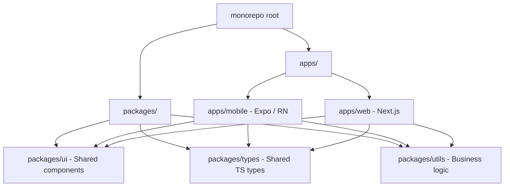
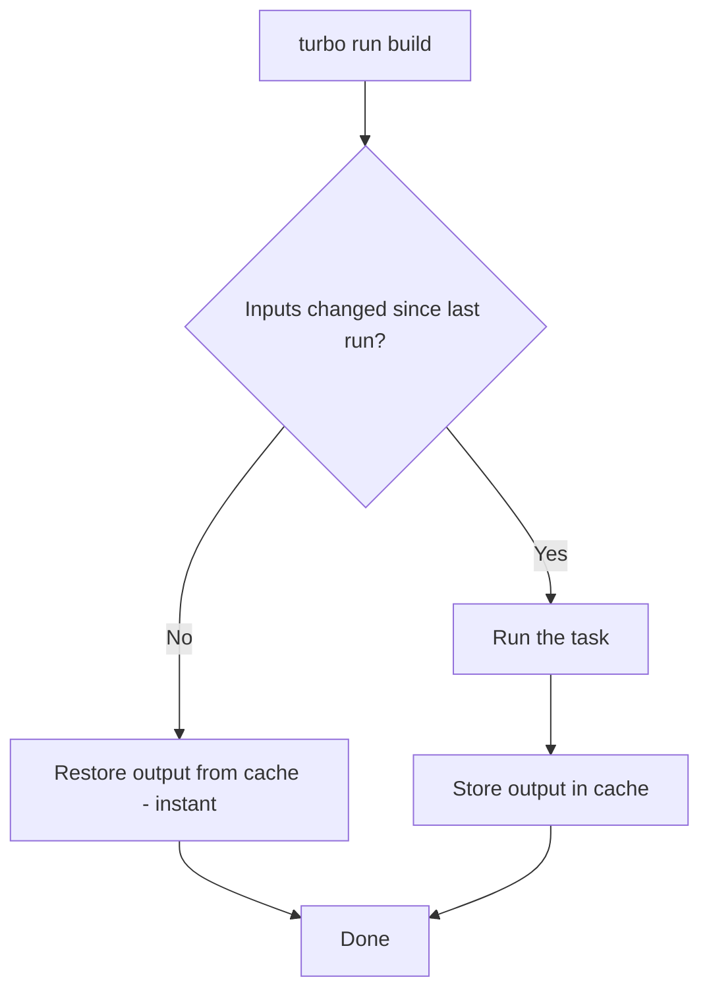
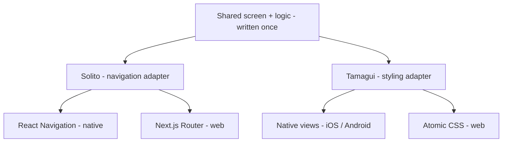
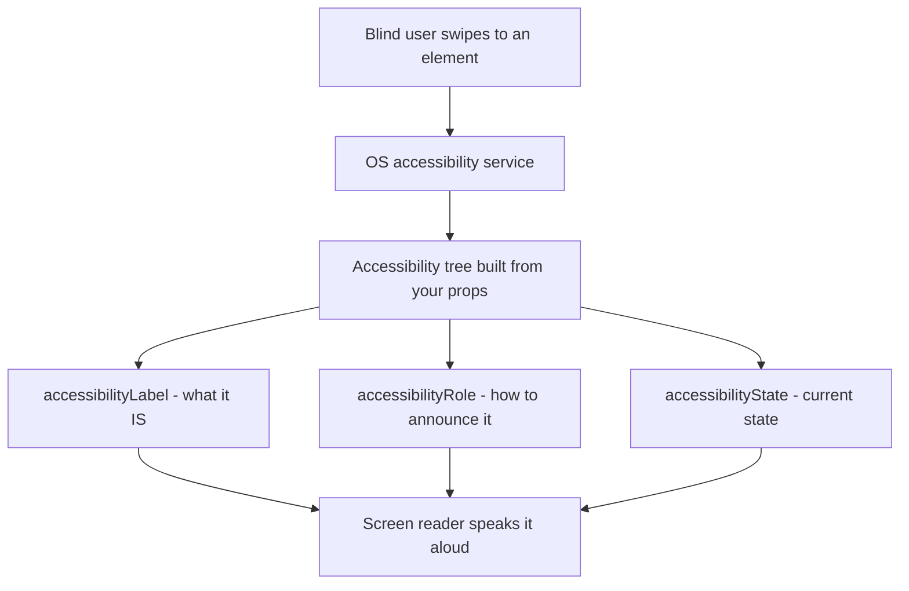
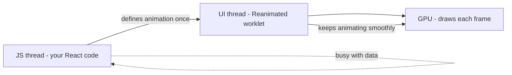
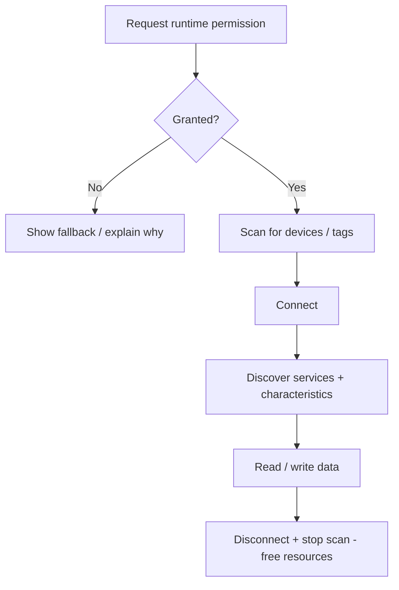
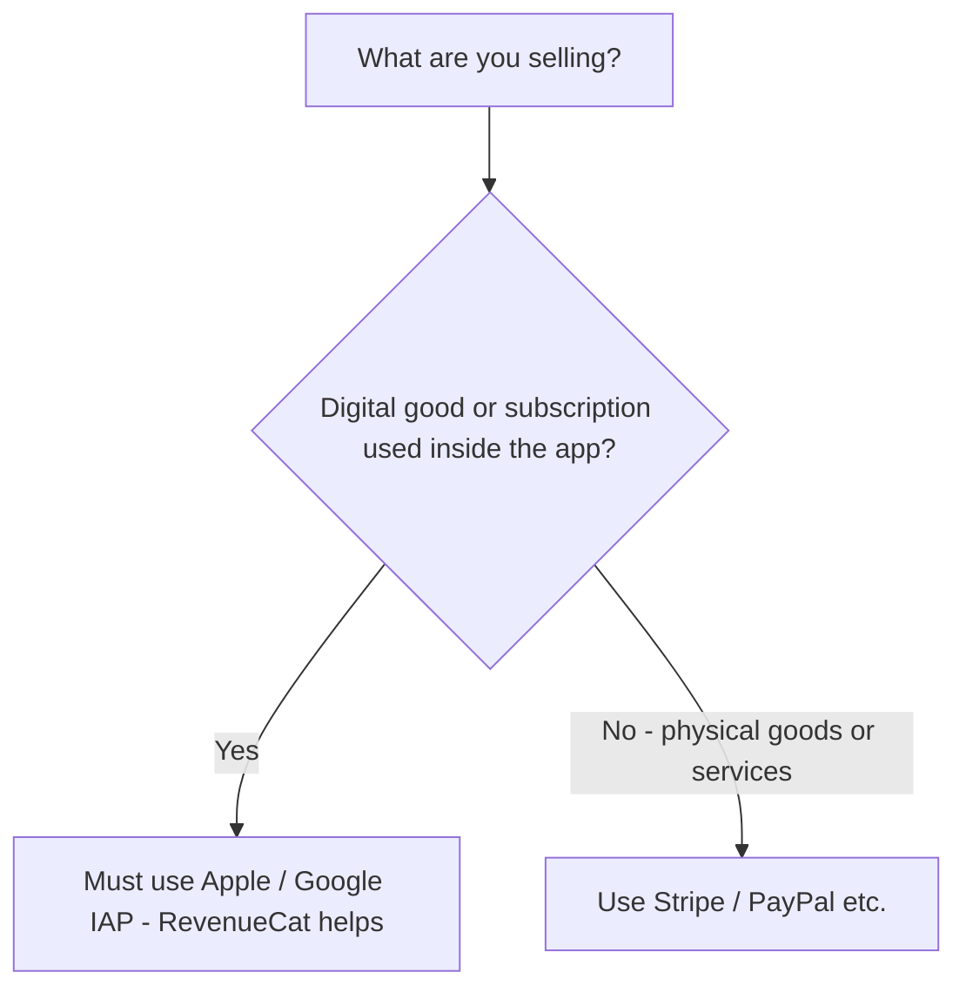
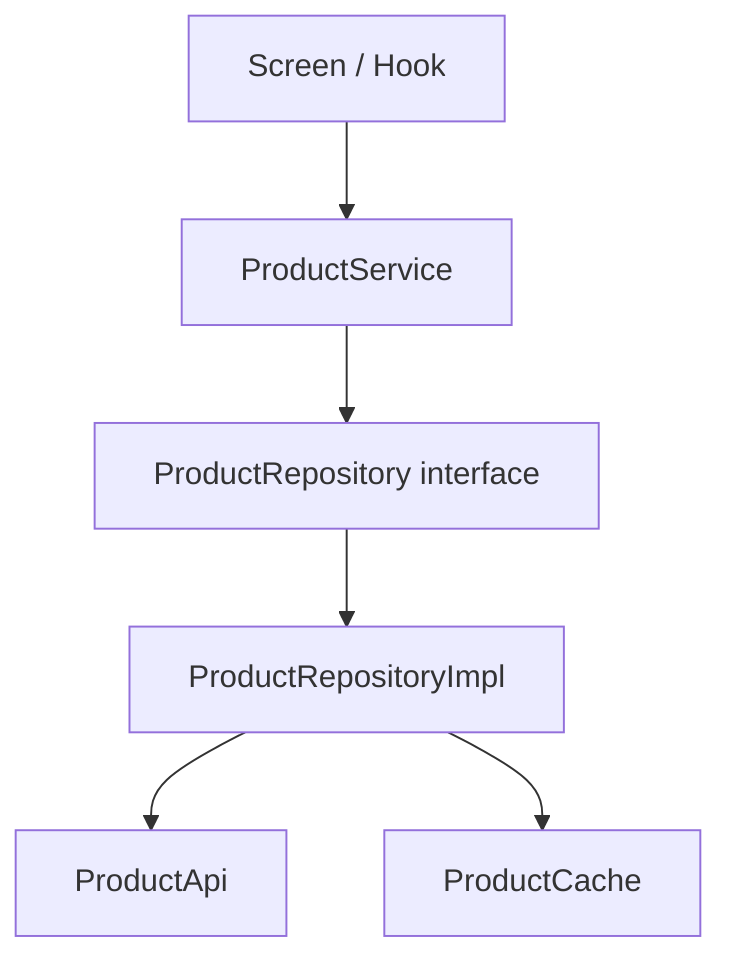
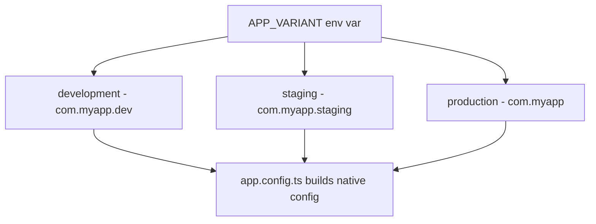
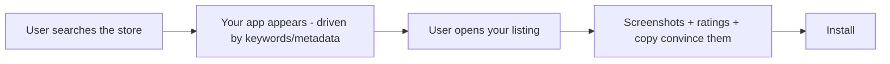

# Argomenti Avanzati per App Complesse

> Configurazione monorepo, condivisione cross-platform, i18n, accessibilità, mappe, pagamenti e architettura su larga scala.

---

## Table of Contents

1. [Monorepo](#1-monorepo)
2. [Cross-Platform Code Sharing](#2-cross-platform-code-sharing)
3. [Internationalization](#3-internationalization)
4. [Accessibility](#4-accessibility)
5. [Animations at Scale](#5-animations-at-scale)
6. [Audio / Video at Scale](#6-audio--video-at-scale)
7. [Maps](#7-maps)
8. [Bluetooth / NFC / Hardware](#8-bluetooth--nfc--hardware)
9. [Payments](#9-payments)
10. [Architecture Patterns](#10-architecture-patterns)
11. [Multi-Environment](#11-multi-environment)
12. [App Size Optimization](#12-app-size-optimization)
13. [App Store Optimization](#13-app-store-optimization)

---

## 1. Monorepo

### Perché un Monorepo?

Una volta che il tuo prodotto ha un'app mobile, un'app web, un design system condiviso e tipi TypeScript condivisi, gestire quattro repository separati diventa un incubo di coordinamento. Le pull request che toccano il componente button condiviso richiedono merge sincronizzati tra i repository. Le versioni divergono. Gli sviluppatori perdono ore.

Un monorepo risolve questo problema mettendo tutto in un unico repository pur mantenendo confini logici tramite i **workspace**.

Pensalo come una casa. I repository separati sono quattro case in quattro vie diverse: ogni volta che modifichi l'impianto idraulico condiviso devi guidare fino a ogni casa e ripararlo separatamente, sperando di averlo fatto allo stesso modo ovunque. Un monorepo è una sola casa con diverse stanze: l'impianto idraulico condiviso passa attraverso i muri e ogni stanza riceve la modifica nel momento in cui la fai.

### Cos'è un "workspace"?

Un **workspace** è semplicemente una cartella all'interno del repository che ha il proprio `package.json` ed è registrata presso il tuo package manager come pacchetto di prima classe. Una volta registrato, `apps/mobile` può scrivere `import { Button } from "@myapp/ui"` esattamente come se `@myapp/ui` fosse pubblicato su npm — ma si risolve nella cartella locale `packages/ui` sul disco. Nessuna pubblicazione, nessun aggiornamento di versione, modifiche istantanee.

> Sul web potresti aver usato un singolo repository con un unico `package.json`. Un monorepo è la stessa idea scalata: **molti** file `package.json`, un lockfile, un albero `node_modules` condiviso alla radice.



### Strumenti: Turborepo + pnpm Workspaces

Due compiti diversi, due strumenti diversi:

- **pnpm workspaces** rispondono alla domanda *"dove si trova questo import?"* — installano le dipendenze e collegano insieme i pacchetti locali.
- **Turborepo** risponde alla domanda *"cosa devo ricostruire?"* — orchestra i task (build, lint, test) e mette in cache i risultati, così i pacchetti invariati non vengono mai ricostruiti.

Turborepo è la combinazione che consiglio rispetto a Nx per i progetti React Native perché non ti intralcia — non impone sistemi di plugin o code generator.

| Strumento | Ruolo | Quando usarlo |
|------|------|----------------------|
| **pnpm workspaces** | Linking + installazione delle dipendenze | Sempre — è la fondazione |
| **Turborepo** | Esecuzione dei task + caching | Quando build/lint/test diventano lenti o ripetitivi |
| **Nx** | Esecuzione dei task + generators + plugin | Team grandi che vogliono uno scaffolding opinionato e un ecosistema di plugin |
| **Yarn / npm workspaces** | Linking delle dipendenze | Se non puoi adottare pnpm; più lento, `node_modules` più grande |

```bash
# Scaffold
pnpm dlx create-turbo@latest my-app --package-manager pnpm

# Resulting structure
my-app/
  apps/
    mobile/       # Expo app
    web/          # Next.js app
  packages/
    ui/           # Shared React components
    types/        # Shared TypeScript interfaces
    tsconfig/     # Shared tsconfig bases
  turbo.json
  pnpm-workspace.yaml
```

Il tuo `pnpm-workspace.yaml` indica a pnpm quali cartelle sono workspace:

```yaml
packages:
  - "apps/*"
  - "packages/*"
```

E `turbo.json` descrive il grafo dei task. La sintassi `^build` significa "costruisci prima le mie dipendenze" — così `packages/ui` viene sempre costruito prima dell'`apps/mobile` che ne dipende:

```json
{
  "tasks": {
    "build": {
      "dependsOn": ["^build"],
      "outputs": ["dist/**", ".expo/**"]
    },
    "dev": {
      "persistent": true,
      "cache": false
    },
    "lint": {},
    "typecheck": {}
  }
}
```

Come il caching ti fa risparmiare tempo:



> **Suggerimento da esperto**: Turborepo calcola l'hash degli input di ogni task (file sorgente, dipendenze, variabili d'ambiente). Se nulla è cambiato, riproduce l'output precedente in millisecondi invece di ricostruire. Aggiungi `--remote-only` con una cache remota e la tua CI e i tuoi colleghi condivideranno la stessa cache — la build di un collega diventa il tuo download istantaneo.

### Condividere Codice Tra packages/ui ed Entrambe le App

La sfida principale: React Native non comprende `import from '../../../packages/ui'` di default. Al bundler Metro di Expo bisogna indicare dove trovare i pacchetti del workspace. Metro presume di default che tutto si trovi sotto un'unica cartella dell'app; in un monorepo il tuo codice si trova due livelli più in alto e le tue dipendenze potrebbero essere hoisted alla radice del repository.

In `apps/mobile/metro.config.js`:

```tsx
const { getDefaultConfig } = require("expo/metro-config");
const path = require("path");

const projectRoot = __dirname;
const monorepoRoot = path.resolve(projectRoot, "../..");

const config = getDefaultConfig(projectRoot);

// 1. Watch all files in the monorepo so edits in packages/ trigger reloads
config.watchFolders = [monorepoRoot];

// 2. Look for node_modules both locally and at the repo root (pnpm hoists here)
config.resolver.nodeModulesPaths = [
  path.resolve(projectRoot, "node_modules"),
  path.resolve(monorepoRoot, "node_modules"),
];

module.exports = config;
```

> **Trabocchetto**: Ogni pacchetto in `packages/` deve avere un `package.json` valido con un campo `main` o `exports` che punti al suo file di ingresso. Se Metro non riesce a risolvere un pacchetto del workspace (`Unable to resolve module @myapp/ui`), questa è quasi sempre la ragione. Verifica due volte che il nome del pacchetto nel suo `package.json` corrisponda al nome che importi.

> **Errore comune**: Dimenticare di aggiungere il pacchetto del workspace come dipendenza dell'app. Anche i pacchetti locali devono essere elencati in `apps/mobile/package.json` come `"@myapp/ui": "workspace:*"` affinché pnpm crei il symlink.

---

## 2. Cross-Platform Code Sharing

### Il Problema

Vuoi un'unica codebase per iOS, Android e il web. Sul web useresti `react-router-dom` e `<div>`. In RN usi `react-navigation` e `<View>`. Queste sono astrazioni fondamentalmente diverse — navigazione diversa, elementi primitivi diversi, motori di styling diversi. Come condividi l'80% della logica senza mantenere tre app separate?

Il trucco è tracciare una linea. Tutto ciò che sta *sopra* la linea (logica di business, data fetching, composizione delle schermate) può essere condiviso. Tutto ciò che sta *sotto* la linea (l'effettivo `<div>` contro `<View>`, il router) riceve un sottile adattatore specifico per piattaforma. Le librerie cross-platform forniscono quegli adattatori, così scrivi la parte superiore una sola volta.



### Solito: Navigazione Universale

Solito ti offre un'unica API di navigazione che funziona sia con Next.js che con React Navigation. Scrivi `useRouter()` una sola volta, e questa dispaccia all'implementazione nativa corretta — come un adattatore di corrente universale che si adatta a qualunque presa usi il paese.

```tsx
// packages/app/features/home/screen.tsx
import { useRouter } from "solito/router";
import { View, Text, Pressable } from "react-native";

export function HomeScreen() {
  const router = useRouter();

  return (
    <View style={{ flex: 1, justifyContent: "center", alignItems: "center" }}>
      <Text>Home Screen</Text>
      {/* On web this becomes a client-side route push; on native a stack.push */}
      <Pressable onPress={() => router.push("/user/123")}>
        <Text>Go to user</Text>
      </Pressable>
    </View>
  );
}
```

Questo stesso componente viene renderizzato in Next.js come una pagina e in Expo come una schermata di React Navigation. Definisci la route una sola volta; il routing basato su file di ciascuna piattaforma punta a essa.

### Tamagui: Styling Universale

Tamagui ti offre un'API simile a styled-components che compila in codice nativo ottimizzato su mobile e in CSS atomico sul web. Elimina la necessità di mantenere approcci StyleSheet e CSS separati. I token `$4` sono valori del design system (spaziatura, colore) definiti una sola volta e risolti per piattaforma.

```tsx
import { Button, YStack, H1 } from "tamagui";

export function LandingSection() {
  return (
    // YStack = vertical flex container; "$4" reads from your theme tokens
    <YStack padding="$4" gap="$3" alignItems="center">
      <H1>Welcome</H1>
      <Button size="$5" theme="active" onPress={() => {}}>
        Get Started
      </Button>
    </YStack>
  );
}
```

### Scegliere un approccio

| Approccio | Condivide | Ideale per | Costo |
|----------|--------|----------|------|
| **Solito + Tamagui** | Navigazione + styling + logica | Vero iOS + Android + Web da un'unica codebase | Setup più impegnativo, stack opinionato |
| **Expo + react-native-web** | Componenti + logica (il routing lo colleghi tu) | App principalmente mobile che necessitano anche di una vista web di base | Più branching manuale per piattaforma |
| **App native e web separate, `packages/` condivisi** | Solo logica, tipi, API | UX web e mobile molto diverse | Due layer UI da mantenere |

> **La mia raccomandazione**: Inizia con Solito + Tamagui se hai bisogno di vero cross-platform fin dal primo giorno. Se ti servono solo iOS + Android, salta del tutto il layer web — aggiunge complessità che non userai. Puoi sempre condividere pacchetti di sola logica in seguito senza impegnarti a usare una libreria UI universale.

> **Trabocchetto**: `react-native-web` mappa `<View>` su `<div>` e `<Text>` su `<span>`, ma le API solo native (aptica, BLE, fotocamera) non hanno equivalente web. Proteggile con `Platform.OS === "web"` o con le estensioni di file `.native.tsx` / `.web.tsx` così che Metro e il bundler web scelgano ciascuno il file giusto.

---

## 3. Internationalization

### i18next + react-i18next

Sul web probabilmente hai usato `react-intl` o `i18next`. In React Native la stessa libreria `i18next` funziona, abbinata a `expo-localization` per rilevare il locale del dispositivo. L'**internazionalizzazione (i18n)** è il lavoro ingegneristico che rende l'app *capace* di mostrare qualsiasi lingua; la **localizzazione (l10n)** è l'atto di fornire effettivamente ciascuna traduzione.

```bash
npx expo install expo-localization i18next react-i18next
```

```tsx
// i18n/index.ts
import i18n from "i18next";
import { initReactI18next } from "react-i18next";
import { getLocales } from "expo-localization";

import en from "./locales/en.json";
import fr from "./locales/fr.json";
import ar from "./locales/ar.json";

// Read the phone's language setting, e.g. "fr" — fall back to English
const deviceLocale = getLocales()[0]?.languageCode ?? "en";

i18n.use(initReactI18next).init({
  resources: { en: { translation: en }, fr: { translation: fr }, ar: { translation: ar } },
  lng: deviceLocale,
  fallbackLng: "en", // if a key is missing in fr, show the English text
  interpolation: { escapeValue: false }, // RN has no XSS risk, so skip escaping
});

export default i18n;
```

Usarlo in un componente è esattamente come sul web:

```tsx
import { useTranslation } from "react-i18next";

function Greeting() {
  const { t, i18n } = useTranslation();
  return (
    <>
      <Text>{t("greeting", { name: "Amina", count: 3 })}</Text>
      {/* Switch language at runtime — most strings update live */}
      <Button title="Français" onPress={() => i18n.changeLanguage("fr")} />
    </>
  );
}
```

### ICU Message Format

L'approccio ingenuo — `"You have " + count + " messages"` — si rompe nella maggior parte delle lingue perché le regole dei plurali differiscono (l'arabo ha sei forme plurali, non due). **ICU MessageFormat** sposta quelle regole all'interno della stringa di traduzione stessa, così che siano i traduttori a controllare la grammatica. Abilitalo tramite `i18next-icu`:

```json
{
  "items_count": "{count, plural, =0 {No items} one {# item} other {# items}}",
  "greeting": "Hello {name}, you have {count, plural, one {# message} other {# messages}}"
}
```

Il `#` viene sostituito con il numero, e il ramo giusto (`one`, `other`, `=0`) viene scelto automaticamente dalle regole dei plurali del locale.

### Formattare numeri, date e valuta

Non formattarli mai a mano. `12,000.50` diventa `12.000,50` in tedesco e `12 000,50` in francese. Usa l'API `Intl` integrata:

```tsx
new Intl.NumberFormat("de-DE", { style: "currency", currency: "EUR" }).format(1234.5);
// "1.234,50 €"
new Intl.DateTimeFormat("ar-EG").format(new Date()); // Arabic calendar digits
```

> **Trabocchetto**: Le versioni più vecchie di React Native (precedenti a Hermes-Intl) avevano un `Intl` incompleto. Su Expo moderno, Hermes include il supporto completo a `Intl` — ma se il tuo target sono dispositivi molto vecchi, aggiungi i polyfill `@formatjs/intl-*`.

### Gestione RTL

L'arabo, l'ebraico e altre lingue RTL necessitano dell'intero layout *speculare* — il testo si allinea a destra, la freccia indietro punta a destra, le righe si invertono. React Native supporta nativamente questo, ma devi attivarlo esplicitamente:

```tsx
import { I18nManager } from "react-native";

// Call this when the user switches to an RTL language, then restart
I18nManager.forceRTL(true);
// On Expo, use expo-updates to reload:
// Updates.reloadAsync();
```

Per rimanere a prova di mirroring, usa le proprietà di stile **logiche** invece di quelle fisiche, così che si invertano automaticamente:

```tsx
// ❌ Hardcodes left — stays on the left even in Arabic
<View style={{ marginLeft: 16, alignItems: "flex-start" }} />

// ✅ Flips automatically with the writing direction
<View style={{ marginStart: 16 }} /> // start = left in LTR, right in RTL
```

> **Trabocchetto**: `I18nManager.forceRTL` non ha effetto finché l'app non viene riavviata. Non puoi attivare/disattivare l'RTL al volo. Pianifica la tua UX intorno a un prompt di riavvio ("Riavvia per applicare l'arabo").

---

## 4. Accessibility

### Perché Questo Non È Negoziabile

L'accessibilità non è un optional. Circa il 15% della popolazione mondiale ha qualche forma di disabilità. In molte giurisdizioni, le app non accessibili creano responsabilità legali. E dal punto di vista del prodotto, le app accessibili sono semplicemente app meglio progettate — le stesse etichette che aiutano uno screen reader alimentano anche il controllo vocale e i test UI automatizzati.

Uno screen reader (VoiceOver su iOS, TalkBack su Android) percorre la schermata elemento per elemento e legge ciascuno ad alta voce. Può leggere solo ciò che gli dici: un bottone con solo un'icona dice "button" senza ulteriori dettagli, a meno che tu non fornisca un'etichetta. Il tuo compito è dare a ogni elemento interattivo un nome, un ruolo e uno stato chiari.



### Prop Fondamentali

React Native fornisce prop di accessibilità che si mappano direttamente su VoiceOver di iOS e TalkBack di Android:

```tsx
<Pressable
  accessibilityLabel="Add item to cart"
  accessibilityHint="Double-tap to add this product to your shopping cart"
  accessibilityRole="button"
  accessibilityState={{ disabled: false }}
  onPress={handleAddToCart}
>
  <PlusIcon />
</Pressable>
```

| Prop | Scopo |
|------|---------|
| `accessibilityLabel` | Cosa È l'elemento (letto ad alta voce dagli screen reader) |
| `accessibilityHint` | Cosa SUCCEDERÀ quando interagisci |
| `accessibilityRole` | Ruolo semantico: `button`, `link`, `header`, `image`, `search` |
| `accessibilityState` | Stato dinamico: `{ disabled, selected, checked, busy, expanded }` |

> Rispetto al web: `accessibilityLabel` è l'`aria-label` di RN, `accessibilityRole` è `role`, e `accessibilityState` è la famiglia di `aria-checked` / `aria-disabled` / `aria-expanded`. Stessi concetti, nomi in versione RN.

> **Suggerimento da esperto**: Raggruppa elementi correlati con `accessible={true}` su una `View` genitore. Una card con un titolo, un prezzo e un'immagine dovrebbe essere annunciata come un'unica unità ("Scarpe da corsa, 99$, immagine") invece che con tre swipe separati.

### Dimensionamento Dinamico dei Font

Rispetta l'impostazione della dimensione del font di sistema dell'utente. Molti utenti aumentano la dimensione del font per la leggibilità; se blocchi i valori in pixel, la tua app li ignora.

```tsx
// ❌ BAD: Fixed font size that ignores user settings — but acceptable as a base
<Text style={{ fontSize: 16 }}>Hello</Text>

// ✅ GOOD: Let the system scale, but cap how far so layouts don't explode
// React Native scales text by default -- do NOT set
// allowFontScaling={false} unless you have a very good reason.
<Text allowFontScaling={true} maxFontSizeMultiplier={1.5}>
  Hello
</Text>
```

### Contrasto dei Colori e Riduzione del Movimento

Punta a WCAG AA: rapporto di contrasto 4.5:1 per il testo normale, 3:1 per il testo grande. Usa strumenti come l'Accessibility Inspector su macOS per verificare. Un testo grigio chiaro su bianco può sembrare elegante nel tuo strumento di design ed essere illeggibile alla luce del sole o per utenti ipovedenti.

Per le animazioni, rispetta la preferenza di sistema "riduci movimento" — grandi effetti di parallasse e rotazione possono provocare nausea o vertigini in alcuni utenti:

```tsx
import { useReducedMotion, useAnimatedStyle, withSpring } from "react-native-reanimated";

function AnimatedCard() {
  const reducedMotion = useReducedMotion();

  const animatedStyle = useAnimatedStyle(() => ({
    // Skip the springy scale when the user asked for less motion
    transform: [{ scale: reducedMotion ? 1 : withSpring(scale.value) }],
  }));

  return <Animated.View style={animatedStyle} />;
}
```

> **Test**: Esegui VoiceOver sull'iOS Simulator (Cmd + F5) e TalkBack sull'Android Emulator (Impostazioni > Accessibilità). Fallo prima di ogni release. Gli audit di accessibilità automatizzati mancano metà dei problemi del mondo reale — un'etichetta può essere tecnicamente presente ma dire "icon-32" invece di "Aggiungi al carrello".

---

## 5. Animations at Scale

Prima di ricorrere a strumenti pesanti, ricorda il principio fondamentale: le animazioni devono girare sul **thread UI**, non sul thread JS. Se un'animazione dipende dall'esecuzione di JavaScript a ogni frame, un thread JS occupato (parsing di dati, re-render) la fa scattare. Reanimated e Skia spingono entrambi il lavoro sul thread UI/GPU, così le animazioni rimangono fluide a 60fps anche mentre il JS è occupato.



### Transizioni con Shared Element

L'animazione "hero" in cui una miniatura di una lista cresce fino a diventare un'immagine di dettaglio. Sul web useresti la View Transitions API. In React Native, `react-native-shared-element` o le transizioni shared element integrate di `react-navigation` gestiscono questo — misurano l'elemento nella schermata A, misurano il suo gemello nella schermata B, e interpolano tra le due posizioni durante la navigazione.

Con React Navigation 7+:

```tsx
// In your stack navigator
<Stack.Screen
  name="Detail"
  component={DetailScreen}
  options={{
    animation: "fade",
  }}
/>

// Same id on both screens links the source and destination element
<SharedElement id={`item.${item.id}.photo`}>
  <Image source={{ uri: item.photo }} style={styles.thumbnail} />
</SharedElement>
```

### Skia + Reanimated

Per animazioni complesse a livello di canvas (grafici, effetti particellari, disegno personalizzato), combina `@shopify/react-native-skia` con Reanimated. Skia gira su un thread separato e ti offre un canvas 2D accelerato dalla GPU — lo stesso motore di rendering che Chrome e Flutter usano sotto il cofano.

```tsx
import { Canvas, Circle } from "@shopify/react-native-skia";
import { useSharedValue, withRepeat, withTiming } from "react-native-reanimated";

function PulsingDot() {
  const radius = useSharedValue(20);

  // Animate on the UI thread -- no bridge crossing, no JS-thread dependency
  useEffect(() => {
    radius.value = withRepeat(withTiming(40, { duration: 1000 }), -1, true);
  }, []);

  return (
    <Canvas style={{ width: 100, height: 100 }}>
      <Circle cx={50} cy={50} r={radius} color="dodgerblue" />
    </Canvas>
  );
}
```

### Scegliere il tuo strumento di animazione

| Strumento | Ideale per | Da evitare quando |
|------|----------|-----------|
| `Animated` (core) | Semplici fade/slide occasionali | Hai bisogno di lavoro guidato dai gesti o critico per i 60fps |
| **Reanimated** | Opacità, translate, scale, gesti | Hai bisogno di forme/gradienti personalizzati |
| **Skia** | Disegno personalizzato, blur, path, grafici | Basterebbe un semplice `Animated.View` |
| **Lottie** | Animazioni vettoriali create da designer (JSON) | L'animazione è data-driven/interattiva |

> **Regola pratica**: Usa Reanimated da solo per le animazioni a livello di UI (opacità, translate, scale). Aggiungi Skia quando hai bisogno di disegno personalizzato, gradienti, effetti blur, o animazioni di path che `Animated.View` non può esprimere. Ricorrere a Skia per far dissolvere un bottone è over-engineering.

---

## 6. Audio / Video at Scale

### Audio: react-native-track-player

Per app di musica/podcast che necessitano di riproduzione in background, controlli da schermata di blocco e gestione della coda, `react-native-track-player` è l'unica opzione seria. Il motivo per cui non puoi semplicemente usare una semplice API audio: l'audio in background richiede che l'OS mantenga vivo il tuo processo e colleghi i widget della schermata di blocco / del Control Center, il che necessita di un servizio nativo di riproduzione dedicato.

```tsx
import TrackPlayer, { useProgress } from "react-native-track-player";

await TrackPlayer.setupPlayer();
await TrackPlayer.add({
  id: "episode-1",
  url: "https://example.com/episode1.mp3",
  title: "Episode 1",   // shows on the lock screen
  artist: "My Podcast", // shows on the lock screen
});
await TrackPlayer.play();

// In a component — useProgress polls position on the UI side
function ProgressBar() {
  const { position, duration } = useProgress();
  return <Slider value={position} maximumValue={duration} />;
}
```

> **Trabocchetto**: L'audio in background necessita di una capability dichiarata nella configurazione nativa — `UIBackgroundModes: ["audio"]` su iOS e un foreground service su Android. Dimenticalo e la riproduzione muore nel momento in cui lo schermo si blocca.

### Video: expo-video con PiP

`expo-video` (Expo SDK 51+) sostituisce il più vecchio `expo-av` per il video. Supporta Picture-in-Picture, DRM e streaming HLS di default. **HLS** (l'URL `.m3u8`) è streaming adattivo: il server offre diversi livelli di qualità e il player passa da uno all'altro in base alla larghezza di banda, così che il video non si blocchi su una connessione debole.

```tsx
import { VideoView, useVideoPlayer } from "expo-video";

function VideoScreen() {
  const player = useVideoPlayer(
    "https://example.com/stream.m3u8", // HLS stream (adaptive bitrate)
    (player) => {
      player.loop = false;
      player.allowsExternalPlayback = true; // AirPlay to a TV
    }
  );

  return <VideoView player={player} style={{ width: "100%", aspectRatio: 16 / 9 }} />;
}
```

| Libreria | Usala per |
|---------|-----------|
| `expo-video` | La maggior parte delle app — riproduzione, HLS, PiP, AirPlay |
| `react-native-track-player` | Audio in background, podcast, code musicali |
| `react-native-video` | Bare workflow, controllo nativo granulare, casi limite ads/DRM |

### Fotocamera: VisionCamera + Frame Processor

`react-native-vision-camera` ti dà accesso diretto ai frame della fotocamera per l'elaborazione ML in tempo reale (scansione di codici a barre, rilevamento del volto, OCR). Un **frame processor** è una funzione che gira su ogni frame della fotocamera su un thread separato — la direttiva `"worklet"` indica a Reanimated di eseguirla fuori dal thread JS, e `runOnJS` torna al JS solo quando hai un risultato, così che l'anteprima della fotocamera non scatti mai.

```tsx
import { Camera, useCameraDevice, useFrameProcessor } from "react-native-vision-camera";
import { useBarcodeScanner } from "vision-camera-code-scanner";

function Scanner() {
  const device = useCameraDevice("back");
  const frameProcessor = useFrameProcessor((frame) => {
    "worklet"; // runs on the frame-processing thread, not JS
    const barcodes = scanBarcodes(frame);
    if (barcodes.length > 0) {
      runOnJS(onBarcodeDetected)(barcodes[0].value); // hop back to JS with the result
    }
  }, []);

  return <Camera device={device} isActive frameProcessor={frameProcessor} />;
}
```

> **Trabocchetto**: La fotocamera e il microfono necessitano di stringhe di autorizzazione nella configurazione nativa (`NSCameraUsageDescription` su iOS) più una richiesta di autorizzazione a runtime, altrimenti l'app va in crash al primo utilizzo senza alcun messaggio utile.

---

## 7. Maps

### react-native-maps

L'opzione più matura. Usa Apple Maps su iOS e Google Maps su Android di default. La mappa viene renderizzata come una vera **vista nativa** incorporata nel tuo albero React — ecco perché scorre e zooma a 60fps; non è un iframe HTML.

```tsx
import MapView, { Marker, Callout } from "react-native-maps";

function StoreLocator({ stores }) {
  return (
    <MapView
      style={{ flex: 1 }}
      // region = center + how much area to show. Smaller delta = more zoomed in
      initialRegion={{
        latitude: 48.8566,
        longitude: 2.3522,
        latitudeDelta: 0.05,
        longitudeDelta: 0.05,
      }}
    >
      {stores.map((store) => (
        <Marker key={store.id} coordinate={store.location}>
          <Callout>
            <Text>{store.name}</Text>
          </Callout>
        </Marker>
      ))}
    </MapView>
  );
}
```

> **Suggerimento da esperto**: Renderizzare centinaia di `<Marker>` distrugge le prestazioni. Usa il **clustering** dei marker (`react-native-map-clustering`) così che i pin vicini collassino in un'unica bolla numerata finché non zoomi.

### MapLibre / Mapbox

Se hai bisogno di stili di mappa personalizzati, terreno 3D o mappe offline, usa `@maplibre/maplibre-react-native` (gratuito, open-source) o `@rnmapbox/maps` (Mapbox, richiede una API key e ha fasce di prezzo). MapLibre è il fork da usare se vuoi evitare i costi di licenza di Mapbox.

| Libreria | Costo | Stili personalizzati | Offline | Ideale per |
|---------|------|---------------|---------|----------|
| **react-native-maps** | Gratuito (quota Google per alcune funzionalità) | Limitato | No | App standard "pin su una mappa" |
| **MapLibre RN** | Gratuito / open-source | Styling vettoriale completo | Sì | Mappe con branding personalizzato o offline, nessun vendor lock-in |
| **Mapbox RN** | Fasce a pagamento | Completo + terreno 3D | Sì | UX di mappa premium, navigazione, disposto a pagare |

> **Trabocchetto con react-native-maps**: Su Android, Google Maps richiede una API key valida in `AndroidManifest.xml`. Senza, ottieni una schermata grigia vuota senza alcun messaggio di errore. Questo inciampo capita a ogni team almeno una volta — se la tua mappa è grigia, controlla prima la API key.

---

## 8. Bluetooth / NFC / Hardware

Le API hardware condividono una forma comune: **richiedi l'autorizzazione → scansiona/individua → connetti → leggi/scrivi → ripulisci**. Saltare qualsiasi passaggio (specialmente autorizzazioni e pulizia) è la causa abituale dei bug "funziona sul mio telefono ma non sul loro".



### BLE: react-native-ble-plx

Per dispositivi Bluetooth Low Energy (fitness tracker, sensori IoT, dispositivi medici). Il BLE organizza i dati come **servizi** (un servizio di frequenza cardiaca) che contengono ciascuno **caratteristiche** (il valore effettivo della frequenza cardiaca), indirizzate da lunghi UUID definiti dallo standard Bluetooth.

```tsx
import { BleManager } from "react-native-ble-plx";

const manager = new BleManager();

function scanForDevices() {
  manager.startDeviceScan(null, null, (error, device) => {
    if (device?.name?.includes("HeartRate")) {
      manager.stopDeviceScan(); // stop scanning to save battery once found
      connectToDevice(device);
    }
  });
}

async function connectToDevice(device) {
  const connected = await device.connect();
  const discovered = await connected.discoverAllServicesAndCharacteristics();
  // Read heart rate characteristic
  const characteristic = await discovered.readCharacteristicForService(
    "0000180d-0000-1000-8000-00805f9b34fb", // Heart Rate Service UUID
    "00002a37-0000-1000-8000-00805f9b34fb"  // Heart Rate Measurement UUID
  );
}
```

### NFC: react-native-nfc-manager

Per tap-to-pay, scansione di badge e lettura di tag:

```tsx
import NfcManager, { NfcTech } from "react-native-nfc-manager";

async function readNfcTag() {
  await NfcManager.start();
  await NfcManager.requestTechnology(NfcTech.Ndef); // ask the OS for an NFC session
  const tag = await NfcManager.getTag();
  console.log("Tag UID:", tag?.id);
  NfcManager.cancelTechnologyRequest(); // always release the session
}
```

> **Trabocchetti hardware**: Il BLE richiede autorizzazioni a runtime su entrambe le piattaforme. Su iOS, devi aggiungere `NSBluetoothAlwaysUsageDescription` a `Info.plist`. Su Android 12+, hai bisogno delle autorizzazioni `BLUETOOTH_SCAN` e `BLUETOOTH_CONNECT` (e dell'autorizzazione alla posizione sulle versioni Android più vecchie, perché la scansione BLE può inferire la posizione). L'NFC non è disponibile su tutti i dispositivi Android e richiede controlli sulla presenza di `NfcAdapter` prima di offrire la funzionalità.

> **Errore comune**: Testare l'hardware su un simulatore. BLE, NFC e la fotocamera **non** funzionano sull'iOS Simulator o sull'Android Emulator — devi usare un dispositivo reale.

---

## 9. Payments

La singola regola più importante viene per prima: **ciò che vendi decide quale strumento di pagamento ti è permesso usare.** Apple e Google prendono una percentuale dai beni *digitali* e ti costringono a passare attraverso la loro fatturazione; i beni *fisici* e i servizi del mondo reale possono usare qualsiasi processore.



### Stripe React Native

Per pagamenti con carta, Apple Pay e Google Pay, `@stripe/stripe-react-native` è lo standard. Fornisce componenti UI conformi a PCI così che tu non gestisca mai i numeri di carta grezzi — i dettagli della carta vanno direttamente dal componente di Stripe ai server di Stripe, e il tuo codice vede solo un token. È questo che ti tiene fuori dall'ambito della conformità PCI.

```tsx
import { StripeProvider, CardField, useStripe } from "@stripe/stripe-react-native";

function CheckoutScreen() {
  const { confirmPayment } = useStripe();

  const handlePay = async () => {
    // Your backend creates a PaymentIntent and returns the clientSecret.
    // The amount lives on the server so the client can't tamper with the price.
    const { clientSecret } = await api.createPaymentIntent({ amount: 2999 });

    const { error, paymentIntent } = await confirmPayment(clientSecret, {
      paymentMethodType: "Card",
    });

    if (error) Alert.alert("Payment failed", error.message);
    else if (paymentIntent) Alert.alert("Success", "Payment confirmed!");
  };

  return (
    <StripeProvider publishableKey="pk_test_...">
      <CardField style={{ height: 50, marginVertical: 20 }} />
      <Button title="Pay $29.99" onPress={handlePay} />
    </StripeProvider>
  );
}
```

### RevenueCat per gli Abbonamenti

Se la tua app vende abbonamenti, RevenueCat astrae le differenze tra la fatturazione dell'App Store e di Google Play. Le API IAP native sono notoriamente capricciose (validazione delle ricevute, ripristino degli acquisti, periodi di grazia, condivisione in famiglia); RevenueCat avvolge tutto questo e ti dà un unico concetto — un **entitlement** — che significa "questo utente ha attualmente premium".

```tsx
import Purchases from "react-native-purchases";

// Initialize once at app start
Purchases.configure({ apiKey: "your_revenuecat_api_key" });

// Fetch available packages (configured in the RevenueCat dashboard)
const offerings = await Purchases.getOfferings();
const monthly = offerings.current?.monthly;

// Purchase — RevenueCat triggers the native Apple/Google payment sheet
const { customerInfo } = await Purchases.purchasePackage(monthly);
const isPremium = customerInfo.entitlements.active["premium"] !== undefined;
```

| Strumento | Vende | Gestisce |
|------|-------|---------|
| **Stripe RN** | Beni fisici, servizi del mondo reale | Carte, Apple/Google Pay, conformità PCI |
| **RevenueCat** | Abbonamenti digitali, contenuti in-app | Validazione delle ricevute, entitlement, ripristino cross-platform |
| **expo-in-app-purchases grezzo / IAP nativo** | Digitale, se non vuoi terze parti | Tutto da solo (raramente ne vale la pena) |

> **Regola IAP critica**: Apple e Google ti obbligano a usare i loro sistemi di acquisto in-app per i **beni digitali e gli abbonamenti**. Non puoi usare Stripe per i contenuti digitali venduti all'interno dell'app. I beni e i servizi fisici (corse in Uber, consegna di cibo) possono usare Stripe. Violare questo fa rifiutare la tua app — ed è uno dei motivi di rifiuto più comuni per chi pubblica per la prima volta.

---

## 10. Architecture Patterns

Man mano che un'app cresce oltre una manciata di schermate, *come* organizzi il codice conta più di qualsiasi singola scelta di libreria. L'obiettivo di ogni pattern qui sotto è lo stesso: mantenere le modifiche **locali** — quando modifichi il flusso di checkout, non dovresti dover toccare quindici file non correlati.

### Struttura delle Cartelle Feature-First

Smetti di organizzare per tipo di file (`/components`, `/screens`, `/hooks`). Questo sparpaglia una singola feature attraverso l'intero albero, così che una modifica al "checkout" ti costringe a saltare tra quattro cartelle di primo livello. Organizza per feature, così che tutto ciò che riguarda il "checkout" stia insieme:

```
src/
  features/
    auth/
      screens/LoginScreen.tsx
      hooks/useAuth.ts
      api/authApi.ts
      components/AuthForm.tsx
      types.ts
    checkout/
      screens/CheckoutScreen.tsx
      hooks/useCart.ts
      api/paymentApi.ts
      components/CartItem.tsx
      types.ts
  shared/
    components/Button.tsx
    hooks/useDebounce.ts
    utils/format.ts
```

> **Suggerimento da esperto**: Un buon test della struttura — eliminare una feature dovrebbe essere semplice come eliminare la sua cartella. Se rimuovere `checkout/` lascia import penzolanti sparsi ovunque, i tuoi confini stanno trapelando.

### Repository Pattern

Disaccoppia il tuo data layer dalla tua UI. Le tue schermate non dovrebbero mai sapere se i dati provengono da una API, da un database locale o dalla cache — chiedono a un repository un `getAll()` e il repository decide da dove provengono effettivamente i dati. Sostituisci l'API con GraphQL in seguito e la UI non cambia mai.

```tsx
// domain/repositories/ProductRepository.ts — the contract (what the UI sees)
interface ProductRepository {
  getAll(): Promise<Product[]>;
  getById(id: string): Promise<Product>;
}

// data/repositories/ProductRepositoryImpl.ts — the implementation (hidden detail)
class ProductRepositoryImpl implements ProductRepository {
  constructor(private api: ProductApi, private cache: ProductCache) {}

  async getAll(): Promise<Product[]> {
    const cached = await this.cache.getAll();
    if (cached) return cached;                 // serve from cache when possible
    const products = await this.api.fetchAll(); // otherwise hit the network
    await this.cache.setAll(products);          // and refresh the cache
    return products;
  }
}
```

### Dependency Injection con tsyringe

La "dependency injection" suona elegante ma significa una cosa sola: una classe non crea i propri collaboratori, li *riceve*. Questo rende banale sostituire una API reale con una finta nei test. Usa `tsyringe` per collegare le dipendenze senza passarle manualmente attraverso ogni costruttore:

```tsx
import { injectable, inject, container } from "tsyringe";

@injectable()
class ProductService {
  constructor(
    @inject("ProductRepository") private repo: ProductRepository
  ) {}
}

// Register once at app startup — "when someone asks for ProductRepository, give them this"
container.register("ProductRepository", { useClass: ProductRepositoryImpl });

// Resolve anywhere — the container builds the whole dependency chain for you
const service = container.resolve(ProductService);
```



> Sul web potresti fare affidamento sul context di React per la DI. In React Native, dove spesso hai bisogno di servizi al di fuori dell'albero dei componenti (task in background, gestori di notifiche push, processori di deep-link che girano prima che qualsiasi componente venga montato), un vero container di DI si ripaga rapidamente.

> **Errore comune**: Ricorrere a questo macchinario in un'app piccola. I repository e i container di DI guadagnano il loro posto su larga scala; per un'app di cinque schermate sono cerimoniale. Adottali quando senti il dolore, non preventivamente.

---

## 11. Multi-Environment

### Il Problema

Hai bisogno di ambienti `dev`, `staging` e `production` con URL API, bundle identifier e icone dell'app diversi. Sul web usi i file `.env` e hai finito. In React Native, è più complicato perché il bundle identifier (`com.myapp`) è incorporato nella build **nativa** — e due app con lo stesso bundle ID non possono coesistere su un solo dispositivo. Per eseguire dev e production fianco a fianco, ogni variante necessita del *proprio* bundle ID, nome e icona.



### Flavor di Configurazione Expo

Usa `app.config.ts` (config dinamica) con variabili d'ambiente da EAS. Poiché è un vero file TypeScript, puoi ramificare in base a una variabile d'ambiente per produrre una configurazione nativa diversa per variante:

```tsx
// app.config.ts
const IS_DEV = process.env.APP_VARIANT === "development";
const IS_STAGING = process.env.APP_VARIANT === "staging";

export default {
  name: IS_DEV ? "MyApp (Dev)" : IS_STAGING ? "MyApp (Staging)" : "MyApp",
  slug: "my-app",
  ios: {
    // Unique bundle ID per variant so all three can install side by side
    bundleIdentifier: IS_DEV
      ? "com.myapp.dev"
      : IS_STAGING
        ? "com.myapp.staging"
        : "com.myapp",
  },
  android: {
    package: IS_DEV
      ? "com.myapp.dev"
      : IS_STAGING
        ? "com.myapp.staging"
        : "com.myapp",
  },
  extra: {
    // Non-secret runtime values travel here
    apiUrl: IS_DEV
      ? "https://api-dev.myapp.com"
      : IS_STAGING
        ? "https://api-staging.myapp.com"
        : "https://api.myapp.com",
  },
};
```

Accedi ai valori a runtime tramite `expo-constants`:

```tsx
import Constants from "expo-constants";
const API_URL = Constants.expoConfig?.extra?.apiUrl;
```

Conserva i **segreti** in EAS, mai in `app.config.ts` (che viene incluso nel bundle ed è leggibile da chiunque decomprima la tua app):

```bash
eas secret:create --name API_SECRET --value "sk_live_..." --scope project
```

| Dove va | Usare per | Visibile nell'app distribuita? |
|---------------|---------|-------------------------|
| `extra` in app.config | URL base delle API, feature flag | Sì — considerali pubblici |
| Segreti / env EAS | Chiavi di firma, segreti server usati al momento della build | No |
| Il tuo backend | Qualsiasi cosa veramente sensibile a runtime | No — non incorporarla mai nel client |

> **Icone dell'app per ambiente**: Usa percorsi `icon` diversi nella tua config per variante. In questo modo i tuoi tester vedono istantaneamente quale build stanno eseguendo — un piccolo dettaglio che previene dolorosi incidenti del tipo "stavo testando contro la produzione".

---

## 12. App Size Optimization

### Perché la Dimensione Conta

Ogni aumento di 6 MB nella dimensione dell'app riduce la conversione di installazione di circa l'1%. Nei mercati emergenti con connessioni lente o piani dati limitati, un'app da 100 MB semplicemente non verrà installata. La dimensione dell'app influisce anche sull'adozione degli aggiornamenti — aggiornamenti più piccoli si scaricano più velocemente e più utenti rimangono aggiornati.

### Bytecode Hermes

Di default, un'app RN distribuisce il tuo JavaScript come testo che il dispositivo deve parsare all'avvio. **Hermes** pre-compila quel JavaScript in bytecode *al momento della build*, così che il dispositivo salti il passaggio di parsing — questo significa un bundle più piccolo e un avvio a freddo più veloce. Con Expo SDK 49+, Hermes è abilitato di default. Verifica che sia attivo:

```tsx
const isHermes = () => !!global.HermesInternal;
console.log("Hermes enabled:", isHermes());
```

### Android: App Bundle (.aab)

Distribuisci sempre un `.aab` (Android App Bundle) invece di un `.apk` universale. Un `.apk` universale contiene codice e risorse per *ogni* dispositivo (tutte le architetture CPU, tutte le densità di schermo); l'utente scarica tutto e ne usa una frazione. Con un `.aab`, Google Play genera al volo un APK specifico per il dispositivo, eliminando architetture e risorse inutilizzate. Questo da solo può ridurre la dimensione del download del 30-50%.

```bash
# EAS Build produces .aab by default for production
eas build --platform android --profile production
```

### iOS: App Thinning

L'App Thinning di iOS (slicing, risorse on-demand) è l'equivalente Apple — l'App Store consegna a ogni dispositivo solo la slice di cui ha bisogno. È automatico quando si distribuisce tramite l'App Store. Ma puoi aiutare eliminando le architetture inutilizzate dai framework di terze parti:

```bash
# In your Podfile's post_install hook
post_install do |installer|
  installer.pods_project.targets.each do |target|
    target.build_configurations.each do |config|
      config.build_settings['EXCLUDED_ARCHS[sdk=iphonesimulator*]'] = 'arm64'
    end
  end
end
```

### Strategie Generali

- **Verifica le dipendenze** con `npx react-native-bundle-visualizer` per vedere quali pacchetti consumano più spazio — le correzioni sono più efficaci quando prendi di mira per primi i maggiori responsabili.
- **Sostituisci le librerie pesanti**: scambia moment.js con date-fns o dayjs (risparmia ~200 KB), e preferisci piccole utility focalizzate all'intero bundle di `lodash`.
- **Usa `expo-image`** invece del componente `Image` core — gestisce meglio caching, memoria e formati moderni (WebP/AVIF).
- **Carica in modo lazy le schermate pesanti** con `React.lazy` nel tuo stack di navigazione, così che le schermate visitate raramente non facciano parte del parsing iniziale.
- **Comprimi gli asset**: distribuisci immagini WebP e rimuovi font e set di icone inutilizzati.

| Strategia | Risparmio tipico | Sforzo |
|----------|----------------|--------|
| Distribuire `.aab` (Android) | 30–50% del download | Gratuito — default in EAS |
| Bytecode Hermes | Bundle più piccolo + avvio più veloce | Gratuito — default |
| Sostituire moment.js | ~200 KB | Basso |
| Verificare + eliminare dipendenze inutilizzate | Varia, spesso grande | Medio |
| Immagini WebP/AVIF | Spesso 25–50% del peso delle immagini | Basso |

---

## 13. App Store Optimization

L'ASO è l'equivalente mobile della SEO: è l'insieme di leve che decidono se la tua app *appare* e se le persone *toccano installa* una volta che appare. Contano due elementi — la **scopribilità** (parole chiave e metadati che ti fanno emergere nelle ricerche) e la **conversione** (screenshot, valutazioni e testi che trasformano la visualizzazione di una scheda in un'installazione).



### Parole Chiave e Metadati

Il titolo e il sottotitolo della tua app (iOS) o la descrizione breve (Android) sono i campi keyword più ponderati.

- **Titolo**: Includi la tua parola chiave primaria. "Meditate - Sleep & Calm" supera nelle classifiche "MeditApp" ogni volta, perché contiene le parole che le persone effettivamente cercano.
- **Sottotitolo (iOS)** / **Descrizione Breve (Android)**: Parole chiave secondarie qui. Non ripetere il titolo — le parole duplicate sono spazio sprecato.
- **Campo keyword (solo iOS)**: 100 caratteri. Usa virgole, niente spazi, nessun duplicato dal titolo (Apple indicizza già il titolo, quindi ripetere spreca il budget).

### Screenshot e Video di Anteprima

I tuoi primi due screenshot determinano se gli utenti scorrono oltre. Apri con la tua funzionalità più forte, non con una splash screen — un logo su uno schermo vuoto non dice nulla all'utente. Usa device frame, didascalie brevi ("Track every workout") e branding coerente. I video di anteprima (fino a 30 secondi su iOS) si riproducono automaticamente nei risultati di ricerca e migliorano notevolmente la conversione.

> **Suggerimento da esperto**: Tratta il tuo primo screenshot come il titolo di un annuncio. La maggior parte degli utenti decide dalla pagina dei risultati di ricerca prima ancora di aprire la tua scheda — quella miniatura sta facendo più lavoro di qualsiasi funzionalità tu distribuisca.

### Schede Localizzate

Traduci la scheda del tuo store in ogni lingua in cui hai utenti. Puoi localizzare i metadati separatamente dalla UI della tua app — una scheda store francese può guidare le installazioni anche se l'app stessa inizialmente è solo in inglese. Ogni set di parole chiave localizzato espande inoltre le ricerche per cui ti posizioni.

### Prompt di Valutazione

Usa `expo-store-review` per richiedere valutazioni al momento giusto — dopo un'esperienza positiva, mai durante l'onboarding o dopo un errore. Il tempismo è tutto: un prompt dopo un momento frustrante raccoglie recensioni da una stella.

```tsx
import * as StoreReview from "expo-store-review";

async function maybeRequestReview() {
  const isAvailable = await StoreReview.isAvailableAsync();
  if (isAvailable) {
    // iOS rate-limits this to 3 times per 365 days per device
    await StoreReview.requestReview();
  }
}

// Call after a successful action — a genuinely happy moment
async function onOrderDelivered() {
  await saveDeliveryConfirmation();
  await maybeRequestReview(); // Happy moment = good time to ask
}
```

> **Trabocchetto**: Su iOS, lo `SKStoreReviewController` di Apple non fa nulla in silenzio se è già stato mostrato troppo di recente. Non puoi forzare il prompt. Non costruire UI che dice "Valutaci ora!" e poi chiama questa API — la finestra di dialogo potrebbe semplicemente non apparire, confondendo i tuoi utenti. Attivala silenziosamente dopo un successo e lascia che sia l'OS a decidere se mostrarla.