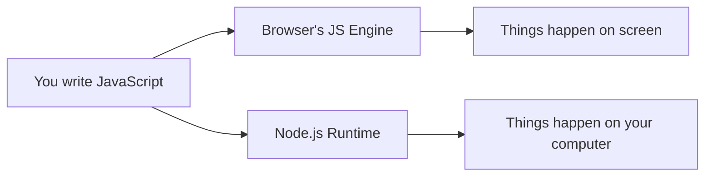
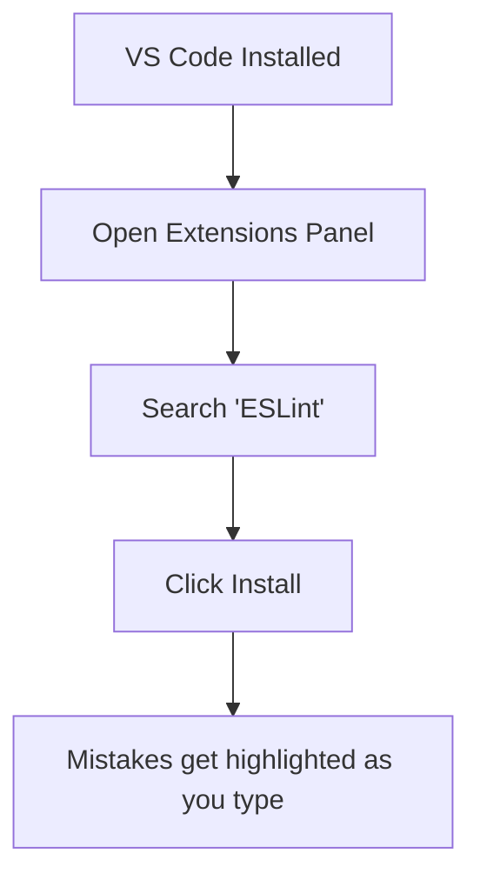
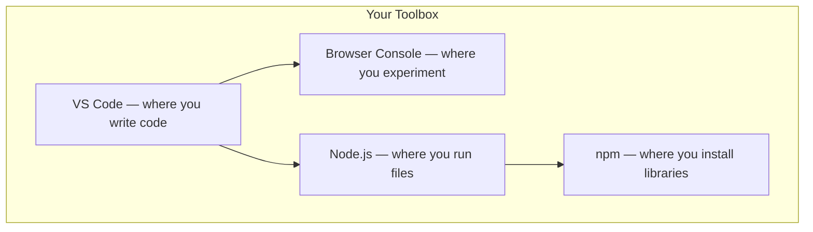

# Prerequisites: Before You Open a JS File

> The baseline knowledge and tools you need before writing your first line of JavaScript.

---

## Table of Contents

- [1. Before You Start](#1-before-you-start)

---

## 1. Before You Start

JavaScript is one of the most accessible programming languages on the planet. You already have everything you need to run it — a web browser. But before we write a single line of code, let's make sure you have the right foundation and the right tools. Skipping this section is like trying to cook without knowing where the kitchen is.

### What Is a Programming Language, Really?

A programming language is a way to give instructions to a computer. That's it. Nothing more mystical than that.

Think of it like writing a recipe. You describe steps in a specific order, using specific words the kitchen (the computer) understands. If you say "chop the onions," the kitchen knows what to do. If you say "wiggle the onions spiritually," it doesn't.

JavaScript is the recipe language that every web browser on Earth already understands. Chrome, Firefox, Safari, Edge — they all have a built-in JavaScript engine ready to execute your instructions the moment you type them.



That diagram shows the two places JavaScript runs: **in the browser** (where it was born) and **on your computer via Node.js** (where it grew up). We'll use both throughout this course.

### Basic Computer Literacy You Actually Need

You don't need a computer science degree. But you do need to be comfortable with a few things that trip up absolute beginners more often than any programming concept ever will:

**File systems.** You need to know that files live inside folders. You need to know where your Downloads folder is. You need to be able to create a folder called `my-project` and put a file called `index.js` inside it. If someone says "navigate to `C:\Users\you\Desktop\my-project`" or `~/Desktop/my-project`, you should have a rough idea what that means.

**File extensions matter.** A file named `script.js` is a JavaScript file. A file named `script.txt` is not. Your operating system might hide extensions by default — turn that off right now. On Windows, open File Explorer, click View, and check "File name extensions." On macOS, open Finder preferences and check "Show all filename extensions." This will save you hours of confusion.

**The command line.** You'll need to open a terminal (Command Prompt or PowerShell on Windows, Terminal on macOS/Linux) and type commands. Not for everything — but for installing tools and running scripts. If you've never used a terminal, here's the survival kit:

```bash
# Where am I right now?
pwd

# List what's in this folder
ls

# Move into a folder
cd my-project

# Go back up one level
cd ..

# Create a new folder
mkdir my-project

# Clear the screen when it gets messy
clear
```

> **Note:** On Windows, `ls` works in PowerShell but not in the classic Command Prompt. Use PowerShell. Better yet, use the terminal built into VS Code, which we're about to install.

That's it. You don't need to be a terminal wizard. You need `cd`, `ls`, and the courage to type things into a black rectangle.

### Setting Up VS Code

VS Code (Visual Studio Code) is a free code editor made by Microsoft, and it has become the default choice for JavaScript developers. Not because it's the only option — but because it's genuinely good and the ecosystem around it is massive.

Here's what to do:

1. Go to [code.visualstudio.com](https://code.visualstudio.com) and download it for your operating system
2. Install it with the default settings
3. Open it

That's the setup. Now install one extension that will make your life noticeably better from day one:

- **ESLint** — it underlines mistakes in your code before you even run it, like a spell checker for JavaScript

To install it, click the Extensions icon in the left sidebar (it looks like four squares), search for "ESLint," and click Install.



> **Opinionated take:** Resist the urge to install 30 extensions on day one. Every extension you add is a potential source of confusion. Start with ESLint alone. You'll know when you need more — and by then you'll know what to search for.

One more thing: open the integrated terminal in VS Code with `` Ctrl+` `` (backtick, the key above Tab). This is where you'll run your JavaScript files. Having your editor and terminal in the same window is a small thing that makes a big difference.

### The Browser Console: Your First JavaScript Playground

Here's something magical. Open your browser right now (Chrome is recommended for this course), and press `F12` or `Ctrl+Shift+J` (macOS: `Cmd+Option+J`). A panel appears. Click the **Console** tab.

Now type this and press Enter:

```js
alert("Hello, world!");
```

A popup just appeared. You wrote JavaScript. It ran. In a browser you already had open.

The console is where you'll experiment, test ideas, and debug problems throughout your entire JavaScript career. It's not just a beginner tool — senior developers use it daily. Get comfortable here.

Try a few more things:

```js
// Basic math
2 + 2;
// => 4

// A string (text)
"hello".toUpperCase();
// => "HELLO"

// Store something
let myName = "Alex";
console.log("Hi, " + myName);
// => Hi, Alex
```

Every line you type in the console runs immediately. There's no compile step, no build process, no waiting. This instant feedback loop is one of the reasons JavaScript is such a good first language.

> **Gotcha:** The console is temporary. Refresh the page and everything you typed is gone. It's a scratchpad, not a save file. For anything you want to keep, you'll write it in a `.js` file using VS Code.

### Installing Node.js

JavaScript was born in the browser, but in 2009 a tool called **Node.js** set it free. Node.js lets you run JavaScript directly on your computer, outside of any browser. This is how you'll run script files, install packages, and eventually build servers.

Install it:

1. Go to [nodejs.org](https://nodejs.org)
2. Download the **LTS** (Long Term Support) version — not the "Current" version
3. Run the installer with default settings

> **Why LTS?** The "Current" version has the newest features but might have bugs. LTS is stable and boring — exactly what you want when you're learning. Debugging your own code is hard enough without debugging your tools.

Now verify it worked. Open your terminal (or the VS Code integrated terminal) and type:

```bash
node --version
# Should print something like: v22.x.x

npm --version
# Should print something like: 10.x.x
```

If both commands print version numbers, you're good. `node` is the JavaScript runtime. `npm` is the package manager that comes bundled with it (think of it as an app store for JavaScript libraries).

Now try running JavaScript from a file. Create a file called `hello.js` with this content:

```js
console.log("Hello from Node.js!");
console.log("2 + 2 =", 2 + 2);
```

Then in your terminal:

```bash
node hello.js
# => Hello from Node.js!
# => 2 + 2 = 4
```

You just ran JavaScript outside a browser. The same language, two different environments. This duality is what makes JavaScript uniquely powerful — and uniquely worth learning as a first language.



### Why JavaScript Is Uniquely Beginner-Friendly

Most programming languages require you to install a compiler, configure an environment, understand a build system, and sacrifice a weekend before you can print "hello." JavaScript asks you to open a browser tab.

That's not a small thing. The distance between "I want to try programming" and "I just made something happen" is shorter in JavaScript than in almost any other mainstream language. And once you're past the basics, the same language lets you build websites, servers, mobile apps, desktop apps, browser extensions, and command-line tools. You're not learning a toy — you're learning one of the most versatile tools in modern software development.

> **The honest caveat:** JavaScript has warts. It has weird quirks that will confuse you (we'll cover them). Its ecosystem moves fast and can feel overwhelming. But every language has trade-offs, and JavaScript's trade-off — quirky but universally accessible — is a good one for someone just starting out.

You now have four things installed or available:

1. **VS Code** — your editor
2. **The browser console** — your sandbox
3. **Node.js** — your runtime
4. **npm** — your package manager

That's the entire toolkit. No more setup. No more prerequisites. Starting with the next chapter, we write real JavaScript.

---