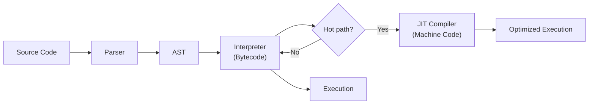
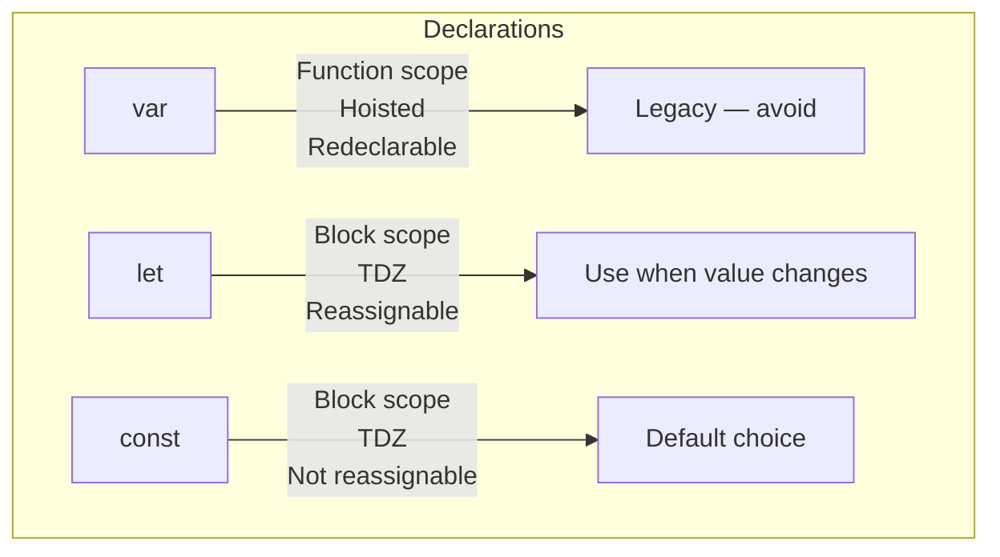
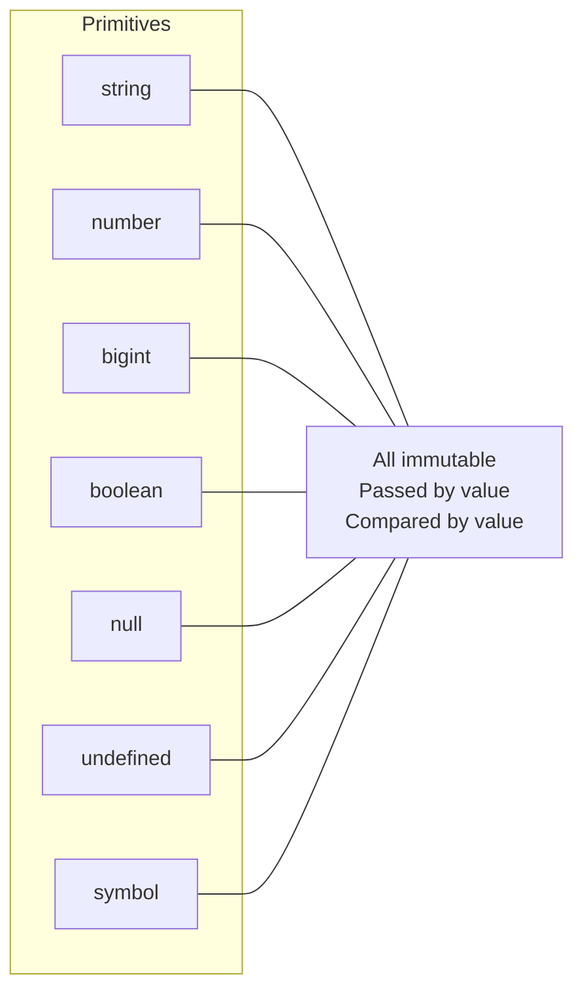
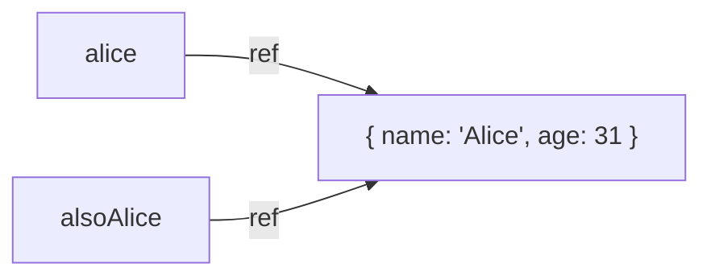
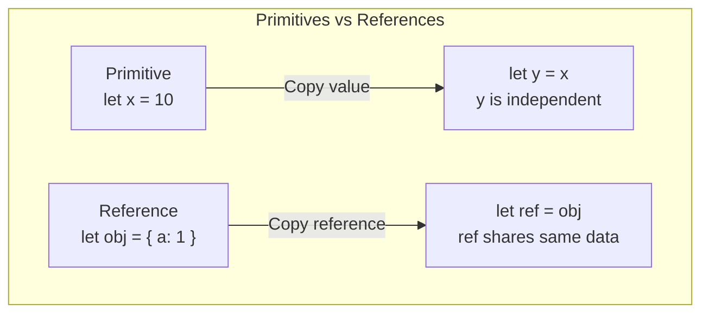
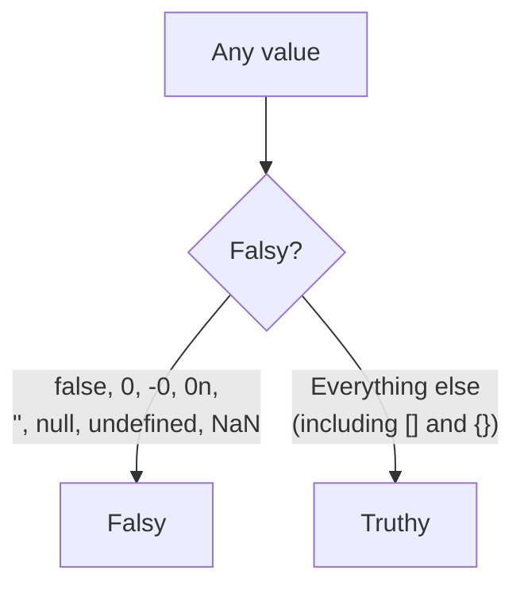
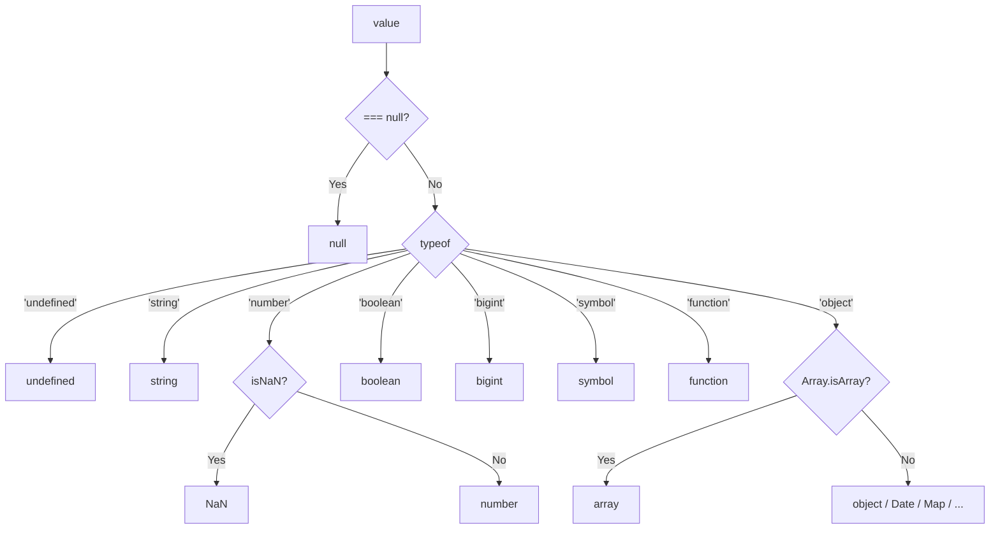

# Language Basics: Types, Variables, and the Rules of JavaScript

> What JavaScript is, how it thinks about types, and the variable declarations that shape your code.

---

## Table of Contents

- [1. What JavaScript Is](#1-what-javascript-is)
- [2. Variables and Declarations](#2-variables-and-declarations)
- [3. Primitive Types](#3-primitive-types)
- [4. Reference Types](#4-reference-types)
- [5. Type Coercion](#5-type-coercion)
- [6. typeof and Type Checking](#6-typeof-and-type-checking)

---

## 1. What JavaScript Is

Before you write a single line of code, you need a mental model of the language you are working with. JavaScript is not just "the language that runs in browsers." It is a dynamically typed, single-threaded, JIT-compiled language with first-class functions. Every one of those words matters, so let us take them apart.

**Dynamically typed** means you never declare what kind of value a variable holds. A variable that holds a number right now can hold a string a moment later. The engine figures out types at runtime, not at compile time. This gives you flexibility but also means an entire category of bugs --- passing the wrong type to a function --- will only surface when the code actually runs.

**Single-threaded** means JavaScript executes one instruction at a time on one thread. There is no parallel execution of your code. If you have heard of `async/await` or callbacks, those do not break this rule --- they schedule work to happen later, but the execution itself is always serial. Think of a restaurant with one chef: the chef can start boiling water, move to chopping vegetables while the water heats, and come back to the pot, but only one task gets the chef's hands at any given moment.

**JIT-compiled** (Just-In-Time) means JavaScript is not purely interpreted line by line, nor is it compiled ahead of time like C. Modern engines like V8 (Chrome, Node.js) and SpiderMonkey (Firefox) read your code, initially interpret it, then compile "hot" functions --- the ones called often --- into optimized machine code while the program is running.



This is why JavaScript can be surprisingly fast for a dynamic language. The engine is constantly profiling and recompiling behind the scenes.

**First-class functions** means functions are values. You can assign them to variables, pass them as arguments, return them from other functions. This single property is what makes patterns like callbacks, closures, and higher-order functions possible, and it is one of the most important things to internalize about JavaScript.

> **Why this matters:** Understanding that JavaScript is dynamic and single-threaded shapes every decision you will make. You cannot rely on the compiler to catch type errors. You cannot run CPU-heavy work without blocking the thread. These are not limitations to fight --- they are the terrain you build on.

One more thing: JavaScript the language is formally called **ECMAScript**. The specification is maintained by TC39, and new features go through a proposal process from Stage 0 (idea) to Stage 4 (part of the standard). When you hear "ES6" or "ES2015," that refers to the sixth edition of the specification, which introduced `let`, `const`, arrow functions, and classes. Subsequent yearly releases (ES2016, ES2017, and so on) add features incrementally.

You do not need to memorize edition numbers. But knowing that the language evolves through a formal proposal process helps you understand why some features feel bolted on: they literally were added years after the original design.

---

## 2. Variables and Declarations

A variable is a named reference to a value. In JavaScript, you create variables with three keywords: `var`, `let`, and `const`. The short version: **use `const` by default, `let` when you need to reassign, and never use `var` in new code.**

Here is why.

### `var` --- the original, the problematic

```js
var name = "Alice";
var name = "Bob"; // No error. Redeclaration is allowed.

function example() {
  console.log(x); // undefined (not an error!)
  var x = 10;
  console.log(x); // 10
}
```

`var` is **function-scoped**, not block-scoped. It does not care about `if` blocks or `for` loops --- only function boundaries. And it is **hoisted**: the declaration (but not the assignment) is moved to the top of its scope. That is why `console.log(x)` above prints `undefined` instead of throwing an error. The engine sees it as:

```js
function example() {
  var x;           // hoisted declaration
  console.log(x); // undefined
  x = 10;
  console.log(x); // 10
}
```

This leads to subtle bugs, especially in loops:

```js
for (var i = 0; i < 3; i++) {
  setTimeout(() => console.log(i), 100);
}
// Prints: 3, 3, 3 (not 0, 1, 2)
```

Because `var i` is scoped to the surrounding function, there is only one `i`, and by the time the timeouts fire, the loop has finished and `i` is 3.

### `let` --- block-scoped, reassignable

```js
let count = 0;
count = 1; // Fine, reassignment is allowed.

let count = 2; // SyntaxError! No redeclaration.

if (true) {
  let inner = "scoped";
}
console.log(inner); // ReferenceError: inner is not defined
```

`let` respects block scope --- curly braces create a boundary. It is also hoisted, but into a **Temporal Dead Zone (TDZ)**: you cannot access it before the declaration line.

```js
console.log(y); // ReferenceError (TDZ)
let y = 5;
```

This is a good thing. It catches mistakes that `var` silently hides.

### `const` --- block-scoped, not reassignable

```js
const API_URL = "https://api.example.com";
API_URL = "https://other.com"; // TypeError: Assignment to constant variable.
```

`const` means the **binding** is constant --- you cannot point the variable at a different value. But if the value itself is an object or array, its contents can still change:

```js
const user = { name: "Alice" };
user.name = "Bob"; // Perfectly fine.
user = {};          // TypeError.
```

This trips people up. `const` does not mean "immutable value." It means "immutable binding."



> **Rule of thumb:** Start with `const`. If you find yourself needing to reassign, switch to `let`. If you are reading legacy code and see `var`, understand it, but do not introduce new ones.

---

## 3. Primitive Types

JavaScript has **seven primitive types**. A primitive is a value that is not an object and has no methods of its own (though JavaScript auto-boxes them so you can call methods like `"hello".toUpperCase()`).

### String

```js
const single = 'hello';
const double = "hello";
const template = `hello, ${single}`; // Template literal
```

All three produce strings. Template literals (backticks) allow embedded expressions and multiline strings. Use them whenever you need interpolation.

Strings are **immutable**. Every operation that appears to modify a string actually creates a new one:

```js
let greeting = "hello";
greeting[0] = "H"; // Silently fails (or throws in strict mode)
console.log(greeting); // "hello"
```

### Number

```js
const integer = 42;
const float = 3.14;
const negative = -7;
const scientific = 2.998e8;
```

JavaScript has **one number type** for both integers and floats: 64-bit IEEE 754 double-precision floating point. This means:

```js
0.1 + 0.2 === 0.3; // false
0.1 + 0.2;          // 0.30000000000000004
```

This is not a JavaScript bug. It is how binary floating-point arithmetic works in every language that uses IEEE 754. For financial calculations, work in cents (integers) or use a decimal library.

Special number values: `Infinity`, `-Infinity`, and `NaN` (Not a Number). `NaN` is famously not equal to itself:

```js
NaN === NaN; // false
Number.isNaN(NaN); // true — use this instead
```

### BigInt

```js
const huge = 9007199254740993n; // Note the 'n' suffix
const also = BigInt("9007199254740993");
```

`BigInt` handles integers of arbitrary precision. You cannot mix `BigInt` and `Number` in arithmetic without explicit conversion:

```js
10n + 5; // TypeError: Cannot mix BigInt and other types
10n + BigInt(5); // 15n
```

### Boolean

```js
const isActive = true;
const isDeleted = false;
```

Only two values. But JavaScript will coerce almost anything into a boolean context (more on this in the coercion section).

### null and undefined

These are distinct types, each with exactly one value:

```js
let a;             // undefined — declared but no value assigned
let b = null;      // null — explicitly "no value"
```

Think of `undefined` as "the engine is telling you nothing is here" and `null` as "the developer is telling you nothing is here." Use `null` when you intentionally want to signal the absence of a value. Let `undefined` be the engine's job.

> **Gotcha:** `typeof null` returns `"object"`. This is a well-known bug from the very first implementation of JavaScript in 1995. It has never been fixed because too much existing code depends on it.

### Symbol

```js
const id = Symbol("description");
const anotherId = Symbol("description");
id === anotherId; // false — every Symbol is unique
```

Symbols create unique, non-string property keys. They are used internally by the language (`Symbol.iterator`, `Symbol.toPrimitive`) and are useful when you need a property key guaranteed not to collide with anything else. You will not use them daily, but you will encounter them in libraries and when customizing object behavior.



The key property of all primitives: they are **passed by value and compared by value**. When you assign a primitive to another variable, you copy the value, not a reference to it:

```js
let x = 10;
let y = x;
y = 20;
console.log(x); // 10 — unchanged
```

---

## 4. Reference Types

Everything that is not a primitive is an **object**, and objects are reference types. This includes plain objects, arrays, functions, dates, regular expressions, maps, sets, and any instance you create with `new`.

### The reference model

When you create an object, JavaScript allocates it in memory (the heap) and gives you a **reference** --- essentially an address --- to that memory. Variables do not hold the object itself; they hold the reference.

```js
const alice = { name: "Alice", age: 30 };
const alsoAlice = alice;

alsoAlice.age = 31;
console.log(alice.age); // 31 — same object!
```

Both `alice` and `alsoAlice` point to the same object in memory. Modifying the object through one reference is visible through the other.



This is the single most important difference between primitives and objects. It is the source of a huge number of bugs in JavaScript programs, especially when passing objects to functions:

```js
function celebrate(user) {
  user.age += 1; // Mutates the original!
}

const bob = { name: "Bob", age: 25 };
celebrate(bob);
console.log(bob.age); // 26
```

The function received a **copy of the reference**, not a copy of the object. So the mutation reaches the original.

### Common reference types

```js
// Plain objects
const config = { debug: true, verbose: false };

// Arrays (ordered, indexed collections)
const numbers = [1, 2, 3, 4, 5];

// Functions (yes, functions are objects)
const greet = function(name) {
  return `Hello, ${name}`;
};

// Dates
const now = new Date();

// Regular Expressions
const pattern = /^hello/i;

// Maps and Sets (ES6+)
const cache = new Map();
cache.set("key", "value");

const unique = new Set([1, 2, 2, 3]);
// Set { 1, 2, 3 }
```

### Equality with objects

Because objects are compared by reference, two objects with identical contents are not equal:

```js
const a = { x: 1 };
const b = { x: 1 };

a === b; // false — different references
a === a; // true  — same reference
```

If you need to compare the contents of two objects, you must do it yourself --- property by property --- or use a utility like `JSON.stringify()` for simple cases (with caveats around key order and special values) or a deep-equal function from a library.

### Shallow vs. deep copying

Since assignment copies the reference, you need explicit strategies to copy the actual data:

```js
// Shallow copy — only the top level is copied
const original = { a: 1, nested: { b: 2 } };
const shallow = { ...original };

shallow.a = 99;
console.log(original.a); // 1 — separate copy

shallow.nested.b = 99;
console.log(original.nested.b); // 99 — still shared!

// Deep copy (modern browsers and Node 17+)
const deep = structuredClone(original);
deep.nested.b = 42;
console.log(original.nested.b); // 99 — truly independent
```

> **Rule of thumb:** Default to `structuredClone()` when you need a full copy. Use the spread operator (`...`) or `Object.assign()` only when you know the object is flat (one level deep). Never rely on `JSON.parse(JSON.stringify(obj))` for deep cloning in production --- it silently drops functions, `undefined`, `Symbol` keys, and `Date` objects.



---

## 5. Type Coercion

Type coercion is JavaScript's automatic conversion of values from one type to another. It is the source of almost every "JavaScript is weird" meme, and it is also one of the most practical things to understand deeply.

### The two forms of equality

JavaScript has two equality operators:

- `==` (loose equality) --- compares values **after** coercion
- `===` (strict equality) --- compares values **without** coercion

```js
0 == "";        // true  — both coerced to 0
0 === "";       // false — different types, no comparison
1 == true;      // true  — true coerced to 1
1 === true;     // false — number vs. boolean
null == undefined; // true  — special rule in the spec
null === undefined; // false — different types
```

**Always use `===`.** There is no situation in day-to-day code where `==` is the right choice. The one edge case people cite --- `value == null` catching both `null` and `undefined` --- is better expressed explicitly:

```js
// Instead of: if (value == null)
if (value === null || value === undefined) {
  // clear intent
}
```

### Implicit coercion in practice

Coercion does not only happen with `==`. It lurks in arithmetic, string concatenation, and boolean contexts:

```js
// String concatenation wins when + meets a string
"5" + 3;      // "53" (number coerced to string)
"5" - 3;      // 2   (string coerced to number — minus has no string meaning)

// Unary plus converts to number
+"42";         // 42
+"";           // 0
+"hello";      // NaN

// Boolean context (if statements, &&, ||, ternary)
if ("hello") { /* runs — non-empty string is truthy */ }
if (0)       { /* skipped — 0 is falsy */ }
```

The `+` operator is the most dangerous. It has dual behavior: if **either** operand is a string, it concatenates. Otherwise, it adds. This single rule causes countless bugs when values arrive from form inputs (always strings) or API responses.

### The falsy values

There are exactly **eight** falsy values in JavaScript. Everything else is truthy:

```js
false       // boolean false
0           // zero
-0          // negative zero
0n          // BigInt zero
""          // empty string
null        // no value
undefined   // no value
NaN         // not a number
```

> **Gotcha:** Empty arrays `[]` and empty objects `{}` are **truthy**. This surprises people coming from other languages. `[] == false` is `true` (because of coercion), but `[]` in a boolean context is truthy. Do not try to reason about `==` with complex types --- just use `===` and check `.length` explicitly.



### Explicit conversion

When you need to convert types, do it explicitly. Do not rely on implicit coercion:

```js
// To string
String(42);        // "42"
String(null);      // "null"
String(undefined); // "undefined"

// To number
Number("42");      // 42
Number("");        // 0 (watch out!)
Number("hello");   // NaN
Number(true);      // 1
Number(null);      // 0 (watch out!)
Number(undefined); // NaN

// To boolean
Boolean(0);        // false
Boolean("");       // false
Boolean("0");      // true (non-empty string!)
Boolean([]);       // true (object!)
```

Notice the traps: `Number("")` is `0`, not `NaN`. `Boolean("0")` is `true` because it is a non-empty string, even though `Number("0")` is `0` which is falsy. These inconsistencies are why explicit, predictable code beats clever one-liners.

---

## 6. typeof and Type Checking

The `typeof` operator is your first tool for checking what kind of value you are dealing with. It returns a string indicating the type.

```js
typeof "hello"     // "string"
typeof 42          // "number"
typeof 42n         // "bigint"
typeof true        // "boolean"
typeof undefined   // "undefined"
typeof Symbol()    // "symbol"
typeof {}          // "object"
typeof []          // "object"   — arrays are objects
typeof null        // "object"   — the famous bug
typeof function(){} // "function" — technically an object, but typeof special-cases it
```

### The quirks you must memorize

**`typeof null === "object"`** --- This is a bug from 1995 that can never be fixed. In the first JavaScript engine, values were tagged with a type code, and the type code for `null` (0x00) happened to be the same as the type code for objects. To check for `null`, compare directly:

```js
if (value === null) {
  // value is null
}
```

**`typeof []` returns `"object"`** --- Arrays are objects in JavaScript. To check if something is an array:

```js
Array.isArray([1, 2, 3]); // true
Array.isArray("string");   // false
Array.isArray({ length: 3 }); // false
```

**`typeof` for undeclared variables does not throw** --- This is actually useful:

```js
// In a browser, checking for a global that may not exist
if (typeof SomeLibrary !== "undefined") {
  // safe to use SomeLibrary
}
```

Using `SomeLibrary === undefined` directly would throw a `ReferenceError` if `SomeLibrary` was never declared. The `typeof` check is the one place where this operator genuinely earns its keep.

### Better type-checking patterns

For anything beyond basic primitives, `typeof` is not enough. Here is a practical decision tree:

```js
// Checking primitives
typeof value === "string"
typeof value === "number" && !Number.isNaN(value)
typeof value === "boolean"
typeof value === "bigint"
typeof value === "symbol"

// Checking null and undefined
value === null
value === undefined
value == null  // catches both (the one defensible use of ==)

// Checking arrays
Array.isArray(value)

// Checking plain objects (not arrays, not null)
typeof value === "object" && value !== null && !Array.isArray(value)

// Checking instances
value instanceof Date
value instanceof RegExp
value instanceof Map
value instanceof Set
```



> **Gotcha:** `instanceof` breaks across realms (iframes, different Node.js vm contexts) because each realm has its own set of constructors. `Array.isArray()` works across realms; `[] instanceof Array` does not if the array came from a different frame. This is why `Array.isArray` exists as a static method.

### A practical helper

For production code, you will often want a utility that handles the common cases:

```js
function typeOf(value) {
  if (value === null) return "null";
  if (Array.isArray(value)) return "array";
  return typeof value;
}

typeOf(null);      // "null"
typeOf([1, 2]);    // "array"
typeOf({});        // "object"
typeOf("hello");   // "string"
typeOf(undefined); // "undefined"
```

This small function fixes the two biggest `typeof` pain points and gives you a reliable string tag for dispatching on type. Expand it as your needs grow, but keep it simple --- the goal is to make your type checks readable, not to build a type system on top of JavaScript.

The language gives you dynamic typing as a feature. The discipline of always checking types at boundaries --- function inputs, API responses, user input --- is what turns that flexibility from a footgun into a superpower.