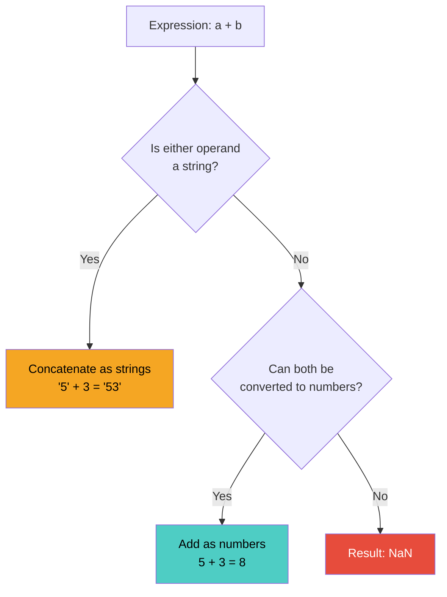
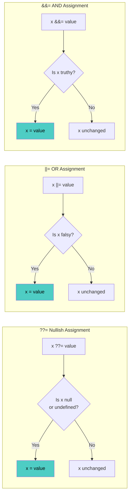
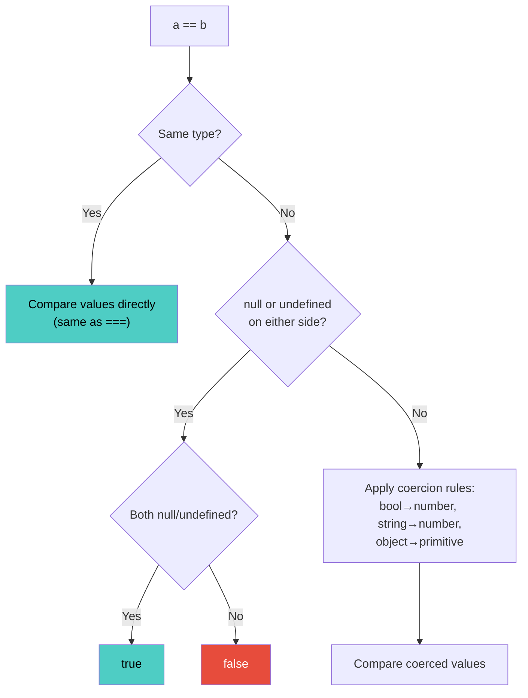
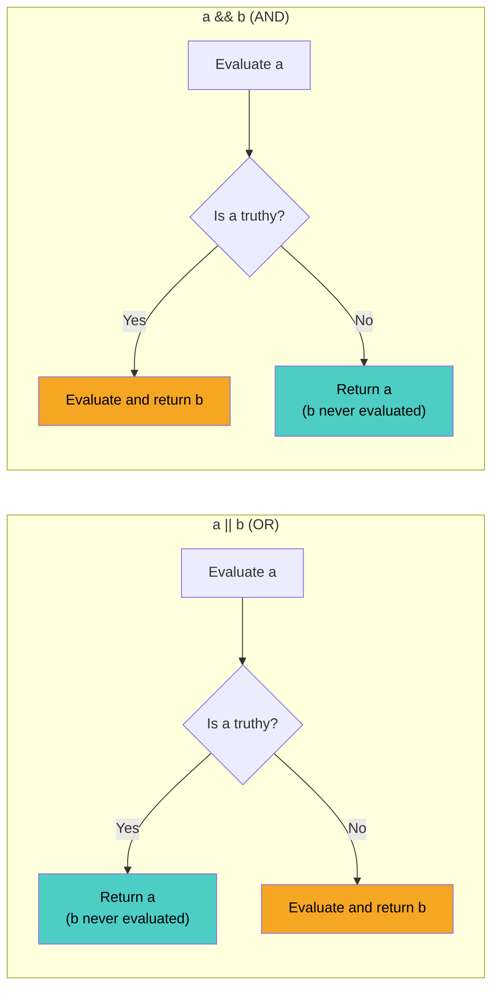
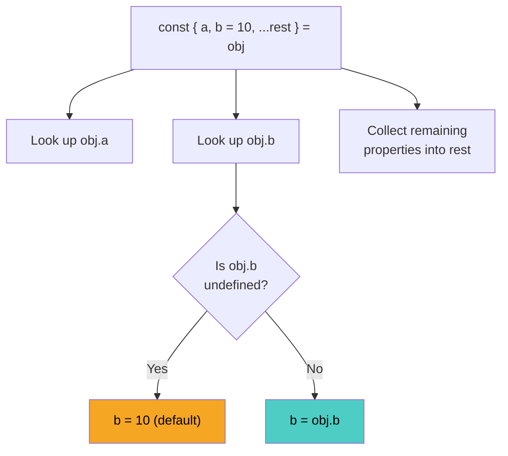
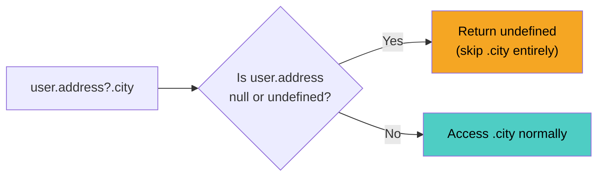

# Operators and Expressions: The Building Blocks of Logic

> Arithmetic, comparison, logical operators, destructuring, optional chaining, and the expressions that compose them.

---

## Table of Contents

- [1. Arithmetic](#1-arithmetic)
- [2. Assignment](#2-assignment)
- [3. Comparison](#3-comparison)
- [4. Logical Operators](#4-logical-operators)
- [5. Spread, Rest, Destructuring](#5-spread-rest-destructuring)
- [6. Optional Chaining and Nullish Access](#6-optional-chaining-and-nullish-access)

---

## 1. Arithmetic

Every programming language gives you math. JavaScript gives you math *and* surprises.

The basic arithmetic operators do what you expect: `+`, `-`, `*`, `/`, `%` (remainder), and `**` (exponentiation). They work on numbers the way your calculator does. But the moment you introduce other types, JavaScript starts making decisions for you -- and those decisions are not always intuitive.

```js
// The basics -- no surprises here
10 + 3    // 13
10 - 3    // 7
10 * 3    // 30
10 / 3    // 3.3333...
10 % 3    // 1  (remainder, not modulo -- matters for negatives)
2 ** 10   // 1024
```

### The `+` Operator Is Overloaded

Here is where things get interesting. The `+` operator does double duty: it adds numbers *and* concatenates strings. When JavaScript sees `+` with mixed types, it has to pick one behavior. The rule is simple but the consequences are far-reaching: **if either operand is a string, `+` concatenates.**

```js
"5" + 3      // "53"  -- string wins, number becomes string
5 + "3"      // "53"  -- same thing
5 + 3        // 8     -- both numbers, so addition
"5" + 3 + 2  // "532" -- left to right: "5"+3="53", "53"+2="532"
5 + 3 + "2"  // "82"  -- left to right: 5+3=8, 8+"2"="82"
```

> **Gotcha:** Evaluation is left-to-right. The order of operands changes the result entirely. `"5" + 3 + 2` gives `"532"`, but `5 + 3 + "2"` gives `"82"`. Same values, different arrangement, different result.

The other arithmetic operators (`-`, `*`, `/`, `%`, `**`) do *not* concatenate. They always try to convert operands to numbers:

```js
"10" - 3   // 7   -- string coerced to number
"10" * 3   // 30
"abc" - 1  // NaN -- "abc" can't become a number
```



### Remainder vs. Modulo

JavaScript's `%` is a *remainder* operator, not a true modulo. The difference shows up with negative numbers:

```js
 7 % 3    //  1
-7 % 3    // -1  (remainder keeps the sign of the dividend)
```

In true modulo arithmetic, `-7 mod 3` would be `2`. If you need true modulo behavior (common in circular array indexing or wrapping), use this pattern:

```js
function mod(n, m) {
  return ((n % m) + m) % m;
}

mod(-7, 3)  // 2 -- true modulo
```

### Numeric Precision

JavaScript uses 64-bit floating point (IEEE 754) for all numbers. This means:

```js
0.1 + 0.2           // 0.30000000000000004
0.1 + 0.2 === 0.3   // false
```

This is not a JavaScript bug. It is a fundamental limitation of binary floating-point representation. When precision matters (currency, measurements), multiply to integers first, do your math, then divide back:

```js
// Bad: floating point drift
0.1 + 0.2  // 0.30000000000000004

// Better: integer arithmetic
(0.1 * 100 + 0.2 * 100) / 100  // 0.3
```

For serious financial calculations, use a dedicated library or `BigInt` for integers. Do not trust floating-point arithmetic with money.

---

## 2. Assignment

Assignment in JavaScript starts simple and gets surprisingly expressive. The basic `=` operator binds a value to a name. But modern JavaScript gives you compound assignment operators that combine an operation with assignment in a single step -- and the newest ones are genuinely useful.

### Basic and Compound Assignment

```js
let x = 10;     // basic assignment

x += 5;   // x = x + 5   → 15
x -= 3;   // x = x - 3   → 12
x *= 2;   // x = x * 2   → 24
x /= 4;   // x = x / 4   → 6
x %= 4;   // x = x % 4   → 2
x **= 3;  // x = x ** 3  → 8
```

These are straightforward shorthand. `x += 5` is identical to `x = x + 5`. Nothing tricky here -- they exist purely for convenience and readability.

### Logical Assignment Operators (ES2021)

This is where assignment gets genuinely powerful. JavaScript introduced three logical assignment operators that combine short-circuit logic with assignment. They look like minor syntax sugar, but they solve real problems elegantly.

```js
// ??= (Nullish coalescing assignment)
// Assigns only if the variable is null or undefined
let username = null;
username ??= "Anonymous";  // "Anonymous"
username ??= "Override";   // still "Anonymous" -- it's no longer nullish

// ||= (Logical OR assignment)
// Assigns only if the variable is falsy (0, "", null, undefined, false, NaN)
let title = "";
title ||= "Untitled";  // "Untitled" -- empty string is falsy
let count = 0;
count ||= 10;           // 10 -- zero is falsy (probably not what you wanted!)

// &&= (Logical AND assignment)
// Assigns only if the variable is truthy
let config = { debug: true };
config.debug &&= false;  // false -- was truthy, so assignment happens
config.name &&= "app";   // undefined -- config.name is undefined (falsy), no assignment
```



> **Opinion:** Use `??=` by default when setting fallback values. It only triggers on `null`/`undefined`, which is almost always what you actually mean. `||=` is a trap for values like `0`, `""`, and `false` that are perfectly valid but happen to be falsy.

### The Critical Difference: `??=` vs `||=`

This distinction causes real bugs in production code:

```js
// User settings from an API -- count could legitimately be 0
let settings = { volume: 0, theme: "" };

// ||= treats 0 and "" as "missing" -- WRONG
settings.volume ||= 50;   // 50 -- overwrote a valid setting!
settings.theme  ||= "dark"; // "dark" -- overwrote a valid choice!

// ??= only triggers on null/undefined -- CORRECT
settings.volume ??= 50;   // 0 -- preserved the user's choice
settings.theme  ??= "dark"; // "" -- preserved the user's choice
```

### Assignment Returns a Value

One subtle point: assignment expressions *return* the assigned value. This is why you can chain assignments (though you rarely should):

```js
let a, b, c;
a = b = c = 5;  // all three are now 5, evaluated right-to-left
```

This also means assignment can appear inside conditions, which is almost always a bug:

```js
// Bug: assigns 5 to x, condition is always truthy
if (x = 5) { /* always runs */ }

// What you meant:
if (x === 5) { /* runs only when x is 5 */ }
```

Most linters will flag this. Let them.

---

## 3. Comparison

Comparison operators return `true` or `false`. Simple enough. But JavaScript has two flavors of equality, and choosing the wrong one is one of the most common sources of bugs in the language.

### Strict Equality: `===` and `!==`

**Always use `===` and `!==`.** This is not a suggestion. It is a rule.

Strict equality checks both *value* and *type*. No conversions, no surprises:

```js
5 === 5       // true
5 === "5"     // false -- different types
0 === false   // false -- different types
null === undefined  // false -- different types
```

### Loose Equality: `==` and `!=` (Avoid)

Loose equality performs *type coercion* before comparing. The rules for this coercion are specified in the ECMAScript standard and they are, frankly, bizarre:

```js
5 == "5"          // true  -- string coerced to number
0 == false        // true  -- boolean coerced to number
"" == false       // true  -- both coerced to 0
null == undefined // true  -- special case in the spec
" \t\n" == 0      // true  -- whitespace string coerced to 0
```

The coercion rules are not something you can reliably keep in your head. Even experienced developers get tripped up. Here is the full picture of loose equality -- it is a minefield:



> **Gotcha:** The *only* useful behavior of `==` is `null == undefined` being `true`. If you need to check for both null and undefined, you can write `value == null`. But even this is clearer as `value === null || value === undefined`, or better yet, `value ?? fallback`.

### Relational Operators

The relational operators (`<`, `>`, `<=`, `>=`) compare values with type coercion. When both operands are strings, they compare lexicographically (character by character using Unicode code points):

```js
10 > 5       // true
"banana" > "apple"  // true -- lexicographic, 'b' > 'a'
"10" > "9"   // false -- string comparison: "1" < "9"
"10" > 9     // true  -- string coerced to number
```

> **Gotcha:** `"10" > "9"` is `false` because string comparison looks at the first character: `"1"` comes before `"9"`. If you are comparing numeric strings, convert them to numbers first.

### `Object.is()` -- The Truly Strict Comparison

Even `===` has two quirks:

```js
NaN === NaN   // false -- by IEEE 754 spec, NaN is not equal to itself
-0 === +0     // true  -- negative and positive zero are "equal"
```

`Object.is()` fixes both:

```js
Object.is(NaN, NaN)   // true  -- NaN IS NaN
Object.is(-0, +0)     // false -- they are different values
Object.is(5, 5)       // true  -- works normally otherwise
```

When do you actually need this? Rarely. But when you do -- like building a memoization cache or a reactivity system (React uses `Object.is` internally for state comparison) -- it matters.

### Reference vs. Value Comparison

A critical concept: `===` compares *by reference* for objects, arrays, and functions. Two objects with identical content are not equal:

```js
[1, 2, 3] === [1, 2, 3]          // false -- different array objects
{ name: "Ada" } === { name: "Ada" }  // false -- different object references

const arr = [1, 2, 3];
const ref = arr;
arr === ref  // true -- same reference
```

There is no built-in deep equality in JavaScript. If you need to compare object contents, you either write a recursive comparison function, use `JSON.stringify()` (fragile -- key order matters, no support for undefined, functions, or circular references), or reach for a library like Lodash's `_.isEqual`.

---

## 4. Logical Operators

Logical operators in JavaScript do not work the way most beginners expect. They do not return `true` or `false`. They return *one of their operands*. This is both more powerful and more confusing than simple boolean logic.

### Short-Circuit Evaluation

The key insight: `&&` and `||` *stop evaluating as soon as the result is determined* and return the value that decided the outcome.

```js
// || returns the FIRST truthy value (or the last value if all falsy)
"hello" || "world"    // "hello" -- first is truthy, stop
"" || "fallback"      // "fallback" -- first is falsy, check second
0 || "" || null || 42 // 42 -- keeps going until it finds truthy
0 || "" || null       // null -- all falsy, returns the last one

// && returns the FIRST falsy value (or the last value if all truthy)
"hello" && "world"    // "world" -- first is truthy, must check second
"" && "anything"      // "" -- first is falsy, stop immediately
1 && 2 && 3           // 3 -- all truthy, returns the last one
1 && 0 && 3           // 0 -- found falsy, stop
```



This "return the deciding value" behavior is why you see patterns like:

```js
// Default values (old pattern, before ??)
const name = userInput || "Anonymous";

// Conditional execution (short-circuit as control flow)
isLoggedIn && showDashboard();

// Guard clauses
user && user.profile && user.profile.name;  // before optional chaining existed
```

### The Nullish Coalescing Operator: `??`

`||` has a problem: it treats `0`, `""`, and `false` as "missing" values. The nullish coalescing operator `??` was introduced specifically to fix this. It only triggers on `null` and `undefined`:

```js
// || treats all falsy values as "missing"
0 || 42          // 42 -- 0 is falsy
"" || "default"  // "default" -- "" is falsy
false || true    // true -- false is falsy

// ?? only treats null/undefined as "missing"
0 ?? 42          // 0 -- not nullish, preserved!
"" ?? "default"  // "" -- not nullish, preserved!
false ?? true    // false -- not nullish, preserved!
null ?? 42       // 42 -- null IS nullish
undefined ?? 42  // 42 -- undefined IS nullish
```

> **Rule of thumb:** Use `??` when you want a fallback for missing values. Use `||` when you genuinely want to replace *any* falsy value. In practice, `??` is correct about 90% of the time.

### Logical NOT: `!`

The `!` operator is simpler -- it always returns a boolean:

```js
!true      // false
!0         // true
!"hello"   // false
!null      // true
```

The double-NOT `!!` is a common idiom to coerce any value to its boolean equivalent:

```js
!!"hello"  // true
!!0        // false
!!null     // false
!![]       // true -- empty arrays are truthy (gotcha!)
!!{}       // true -- empty objects are truthy
```

> **Gotcha:** `!![]` is `true`. An empty array is a truthy value in JavaScript because it is an object reference. If you want to check if an array has elements, check `.length`.

### Operator Precedence Trap

`??` cannot be mixed freely with `&&` or `||` without parentheses. JavaScript throws a syntax error:

```js
// SyntaxError: cannot mix ?? with && or ||
// value && other ?? fallback

// You must use explicit parentheses
(value && other) ?? fallback   // OK
value && (other ?? fallback)   // OK -- different meaning!
```

This is actually a good design decision. The precedence between these operators is ambiguous enough that the language forces you to be explicit.

---

## 5. Spread, Rest, Destructuring

These three features -- spread, rest, and destructuring -- are syntactic tools that fundamentally changed how JavaScript developers write code. They all use the same `...` syntax (spread and rest) or pattern-matching syntax (destructuring), but they serve different purposes. Understanding when you are "spreading" versus "resting" versus "destructuring" is the key.

### Spread: Expanding Iterables

The spread operator `...` takes something iterable (array, string, object) and expands it into individual elements:

```js
// Copying arrays (shallow)
const original = [1, 2, 3];
const copy = [...original];       // [1, 2, 3] -- new array

// Merging arrays
const a = [1, 2];
const b = [3, 4];
const merged = [...a, ...b];      // [1, 2, 3, 4]

// Copying objects (shallow)
const user = { name: "Ada", age: 36 };
const clone = { ...user };         // { name: "Ada", age: 36 }

// Merging objects (last one wins for duplicate keys)
const defaults = { theme: "dark", lang: "en" };
const prefs    = { lang: "fr", fontSize: 14 };
const config   = { ...defaults, ...prefs };
// { theme: "dark", lang: "fr", fontSize: 14 }
```

> **Critical:** Spread creates *shallow* copies. Nested objects are still references to the originals. If you mutate a nested property on the copy, the original changes too.

```js
const original = { name: "Ada", scores: [95, 87] };
const copy = { ...original };
copy.scores.push(100);
console.log(original.scores);  // [95, 87, 100] -- mutated!
```

### Rest: Collecting the Remainder

Rest syntax looks identical to spread (`...`) but does the opposite -- it collects multiple elements into a single array or object. It always appears on the *receiving* side of an assignment or in function parameters:

```js
// In function parameters -- collect all arguments
function sum(...numbers) {
  return numbers.reduce((a, b) => a + b, 0);
}
sum(1, 2, 3, 4);  // 10 -- numbers is [1, 2, 3, 4]

// In array destructuring -- collect remaining elements
const [first, second, ...rest] = [10, 20, 30, 40, 50];
// first: 10, second: 20, rest: [30, 40, 50]

// In object destructuring -- collect remaining properties
const { name, ...details } = { name: "Ada", age: 36, role: "dev" };
// name: "Ada", details: { age: 36, role: "dev" }
```

> **Rule:** Rest elements must always be last. `const [...rest, last] = arr` is a SyntaxError.

### Destructuring: Pattern Matching for Data

Destructuring lets you extract values from arrays and objects using a pattern that mirrors the data structure:

```js
// Array destructuring -- by position
const [x, y, z] = [10, 20, 30];

// Object destructuring -- by key name
const { name, age } = { name: "Ada", age: 36, role: "dev" };

// Renaming during destructuring
const { name: userName, age: userAge } = { name: "Ada", age: 36 };
// userName: "Ada", userAge: 36

// Default values -- applied when the value is undefined
const { theme = "dark", lang = "en" } = { lang: "fr" };
// theme: "dark" (default), lang: "fr" (from object)

// Nested destructuring
const { address: { city, zip } } = {
  address: { city: "London", zip: "SW1A" }
};
// city: "London", zip: "SW1A"
```



### Destructuring in Function Parameters

One of the most powerful applications -- destructuring directly in function signatures:

```js
// Without destructuring
function createUser(options) {
  const name = options.name;
  const role = options.role || "viewer";
  const active = options.active !== undefined ? options.active : true;
}

// With destructuring + defaults
function createUser({ name, role = "viewer", active = true } = {}) {
  // name, role, active are all available directly
}

createUser({ name: "Ada" });
// name: "Ada", role: "viewer", active: true
```

The `= {}` at the end is a crucial detail -- it provides a default empty object so the function can be called with no arguments at all without throwing a TypeError.

> **Gotcha:** Default values in destructuring only apply when the value is `undefined`, not `null`. This is different from `??` which handles both. `const { x = 5 } = { x: null }` gives `x` the value `null`, not `5`.

---

## 6. Optional Chaining and Nullish Access

Before optional chaining, accessing deeply nested properties in JavaScript was an exercise in defensive programming. You had to check every level of the chain or risk a `TypeError: Cannot read property of undefined`. Optional chaining (`?.`) and its companion, the nullish coalescing operator (`??`), solve this problem elegantly.

### The Problem

```js
// A user object from an API -- shape is not guaranteed
const user = {
  name: "Ada",
  address: null  // user hasn't set an address yet
};

// This throws: TypeError: Cannot read properties of null
// const city = user.address.city;

// The old defensive approach -- verbose and fragile
const city = user && user.address && user.address.city;
```

### Optional Chaining: `?.`

The `?.` operator short-circuits the entire chain and returns `undefined` if the left side is `null` or `undefined`. It does not throw. It does not coerce. It just stops.

```js
const user = { name: "Ada", address: null };

user.address?.city          // undefined (not a TypeError)
user.profile?.avatar?.url   // undefined (profile doesn't exist)
user.name?.toUpperCase()    // "ADA" (name exists, method called)
```



### Three Forms of Optional Chaining

Optional chaining is not limited to property access. It works in three contexts:

```js
const obj = { greet: null, items: null };

// 1. Property access
obj.greet?.name          // undefined

// 2. Method calls -- won't call if the method doesn't exist
obj.greet?.()            // undefined (doesn't throw)
obj.toString?.()         // "[object Object]" (method exists)

// 3. Bracket notation
const key = "name";
obj.greet?.[key]         // undefined
obj.items?.[0]           // undefined
```

> **Gotcha:** `obj.method?.()` checks if `method` exists and is not null/undefined, but it does *not* check if it is a function. If `obj.method` is the number `5`, this will throw `TypeError: obj.method is not a function`. Optional chaining protects against *missing* properties, not *wrong types*.

### Combining `?.` with `??` -- The Power Pair

Optional chaining returns `undefined` when it short-circuits. Pair it with `??` to provide meaningful defaults:

```js
const user = {
  settings: {
    notifications: { email: false }  // deliberately set to false
  }
};

// Get the setting, fall back to true if the path doesn't exist
const emailNotifs = user.settings?.notifications?.email ?? true;
// false -- the value exists and is false, ?? preserves it

// Without the setting at all
const smsNotifs = user.settings?.notifications?.sms ?? true;
// true -- sms is undefined, ?? provides the default

// Compare with || which would get this WRONG
const emailNotifs2 = user.settings?.notifications?.email || true;
// true -- WRONG! || treated false as falsy and replaced it
```

This pattern -- `?.` to safely traverse, `??` to provide a default -- is the modern standard for accessing configuration, API responses, and any data with an uncertain shape.

### When NOT to Use Optional Chaining

Optional chaining is not a universal safety net. Do not sprinkle `?.` everywhere:

```js
// BAD: If user must exist here, ?. hides bugs
function sendEmail(user) {
  // If user is null, you have a bug upstream
  // ?. silences the symptom instead of fixing the cause
  const email = user?.profile?.email;
  if (!email) return;  // fails silently -- is that what you want?
}

// BETTER: Fail loud when assumptions are violated
function sendEmail(user) {
  if (!user) throw new Error("sendEmail requires a user");
  const email = user.profile.email;  // let it throw if profile is missing
}
```

> **Opinion:** Use `?.` at *boundaries* -- where data enters your system from APIs, user input, or third-party libraries. Inside your own functions, where you control the data, prefer letting errors throw so you catch bugs early. Silent `undefined` propagation is a debugging nightmare.

### The `delete` and `in` Operators with Optional Chaining

Optional chaining does not work with every operator. You cannot use it on the left side of an assignment:

```js
user?.name = "new name";   // SyntaxError
delete user?.name;          // This DOES work -- deletes if user exists
```

### Real-World Pattern: Safe API Response Parsing

```js
async function getUserCity(userId) {
  const response = await fetch(`/api/users/${userId}`);
  const data = await response.json();

  // Safe traversal + default -- one clean line
  return data?.user?.address?.city ?? "Unknown";
}
```

This single line replaces what used to be five or six lines of null checks. That is the real power of optional chaining combined with nullish coalescing -- not just safety, but *clarity*.