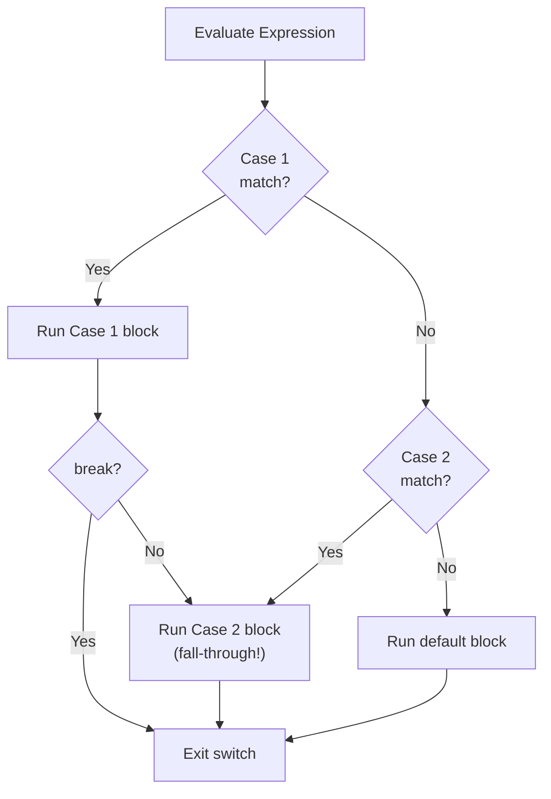
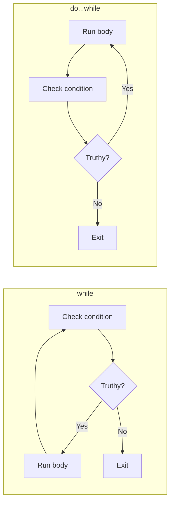
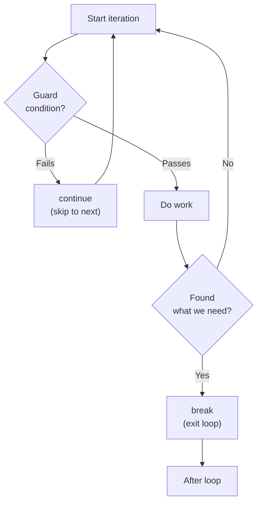
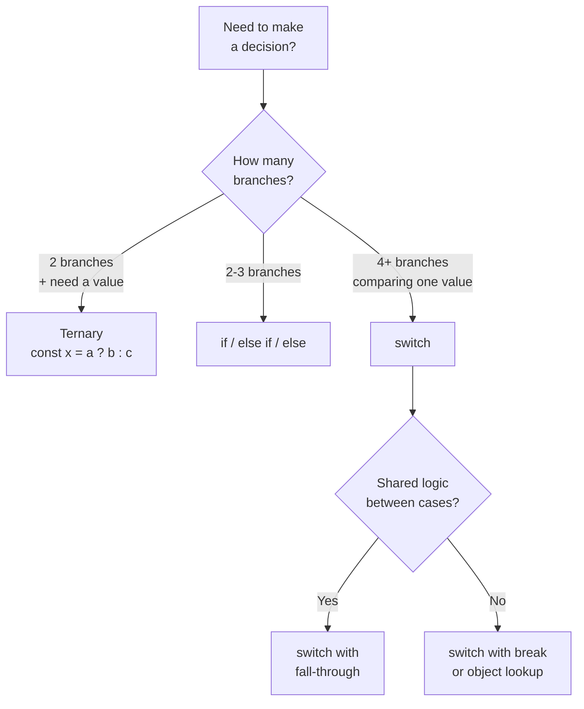
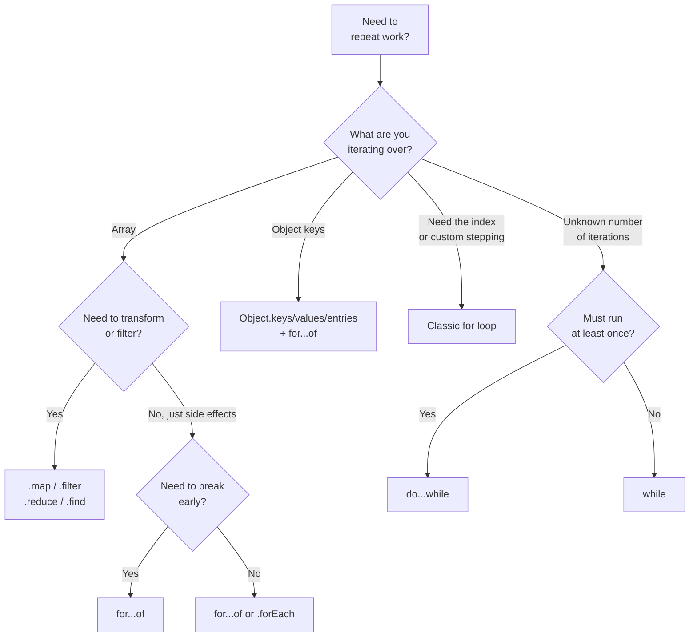

# Control Flow: Making Decisions and Repeating Work

> Conditionals, loops, iteration patterns, and when to reach for each one.

---

## Table of Contents

- [1. Conditionals](#1-conditionals)
- [2. Loops](#2-loops)
- [3. Loop Control](#3-loop-control)
- [4. When to Use Which](#4-when-to-use-which)

---

## 1. Conditionals

Every program eventually needs to make a decision. "Is the user logged in?" "Is the cart empty?" "Did the payment go through?" Conditionals are how your code answers yes-or-no questions and picks a path forward.

### if / else if / else

This is your bread and butter. One condition, one block of code that runs if the condition is truthy.

```js
const temperature = 35;

if (temperature > 30) {
  console.log("It's hot outside");
} else if (temperature > 20) {
  console.log("Nice weather");
} else if (temperature > 10) {
  console.log("Bring a jacket");
} else {
  console.log("Stay home");
}
```

A few things to burn into memory:

- JavaScript uses **truthy/falsy** evaluation, not strict `true`/`false`. The number `0`, empty string `""`, `null`, `undefined`, `NaN`, and `false` are all falsy. Everything else is truthy -- including empty arrays `[]` and empty objects `{}`.
- The `else if` and `else` blocks are optional. You can have a naked `if` on its own.
- Curly braces are technically optional for single statements, but **always use them**. Skipping braces is the #1 source of bugs when someone later adds a second line and assumes it is inside the block.

```js
// Dangerous -- looks right, breaks silently
if (loggedIn)
  showDashboard();
  loadUserData(); // This ALWAYS runs, regardless of loggedIn!

// Safe -- always use braces
if (loggedIn) {
  showDashboard();
  loadUserData();
}
```

### The Ternary Operator

A ternary is an `if/else` compressed into a single expression. The key word there is *expression* -- it produces a value, which means you can use it on the right side of an assignment.

```js
const status = age >= 18 ? "adult" : "minor";
```

Read it as: "Is age >= 18? Then `"adult"`, otherwise `"minor"`."

Ternaries are perfect for simple, two-branch assignments. They become unreadable the moment you nest them.

```js
// Don't do this to your teammates
const label = score > 90 ? "A" : score > 80 ? "B" : score > 70 ? "C" : "F";

// Do this instead
let label;
if (score > 90) {
  label = "A";
} else if (score > 80) {
  label = "B";
} else if (score > 70) {
  label = "C";
} else {
  label = "F";
}
```

> **Rule of thumb:** if your ternary does not fit comfortably on one line with no nesting, use `if/else`.

### switch

A `switch` is best when you are comparing **one value** against **many possible matches**.

```js
const role = "admin";

switch (role) {
  case "admin":
    console.log("Full access");
    break;
  case "editor":
    console.log("Can edit content");
    break;
  case "viewer":
    console.log("Read only");
    break;
  default:
    console.log("Unknown role");
}
```

Here is the critical gotcha: **`switch` uses fall-through by default.** If you forget `break`, execution keeps going into the next case.

```js
const fruit = "apple";

switch (fruit) {
  case "apple":
    console.log("It's an apple");
  // No break! Falls through to the next case
  case "banana":
    console.log("It's a banana");
  case "cherry":
    console.log("It's a cherry");
    break;
  default:
    console.log("Unknown fruit");
}

// Output:
// "It's an apple"
// "It's a banana"
// "It's a cherry"
```

This is not a bug in the language -- fall-through is intentional and occasionally useful when multiple cases share the same logic:

```js
switch (day) {
  case "Saturday":
  case "Sunday":
    console.log("Weekend!");
    break;
  default:
    console.log("Weekday");
}
```

But unintentional fall-through causes subtle bugs. If you are using a linter (and you should be), enable the `no-fallthrough` rule.

> **`switch` compares with `===` (strict equality).** The value `"1"` will not match the case `1`. This trips people up when the value comes from user input, which is always a string.



---

## 2. Loops

Conditionals let you choose a path. Loops let you walk a path repeatedly. JavaScript gives you a surprising number of ways to repeat work, each suited to a different situation.

### The Classic for Loop

The `for` loop gives you complete control: an initializer, a condition, and an update expression.

```js
for (let i = 0; i < 5; i++) {
  console.log(i); // 0, 1, 2, 3, 4
}
```

The three parts separated by semicolons are:

1. **Initialization** (`let i = 0`) -- runs once before the loop starts.
2. **Condition** (`i < 5`) -- checked before every iteration. If falsy, the loop stops.
3. **Update** (`i++`) -- runs after every iteration.

Classic `for` loops are ideal when you need the index, when you are iterating in reverse, or when you need to skip elements by manipulating the counter.

```js
// Counting backwards
for (let i = 10; i >= 0; i--) {
  console.log(i);
}

// Stepping by 2
for (let i = 0; i < 20; i += 2) {
  console.log(i); // 0, 2, 4, 6, ...
}
```

### for...of (Iterating Over Values)

When you just want the values from an iterable (arrays, strings, Maps, Sets), `for...of` is your best friend.

```js
const colors = ["red", "green", "blue"];

for (const color of colors) {
  console.log(color); // "red", "green", "blue"
}

// Works with strings too -- iterates over characters
for (const char of "hello") {
  console.log(char); // "h", "e", "l", "l", "o"
}
```

Need the index as well? Pair it with `entries()`:

```js
for (const [index, color] of colors.entries()) {
  console.log(`${index}: ${color}`);
}
```

### for...in (Iterating Over Object Keys)

`for...in` walks the **enumerable property names** of an object.

```js
const user = { name: "Alice", age: 30, role: "admin" };

for (const key in user) {
  console.log(`${key}: ${user[key]}`);
}
// "name: Alice"
// "age: 30"
// "role: admin"
```

> **Warning:** `for...in` also iterates over inherited properties from the prototype chain. If someone has modified `Object.prototype` (bad practice, but it happens in older codebases), you will see unexpected keys. Guard against this with `hasOwnProperty`:

```js
for (const key in user) {
  if (user.hasOwnProperty(key)) {
    console.log(key);
  }
}
```

**Never use `for...in` on arrays.** It iterates over property names (which are strings, not numbers), includes inherited properties, and does not guarantee order in older engines. Use `for...of` or array methods instead.

```js
const arr = [10, 20, 30];

// Bad -- key is "0", "1", "2" (strings!), may include prototype junk
for (const key in arr) {
  console.log(typeof key); // "string"
}

// Good
for (const value of arr) {
  console.log(value); // 10, 20, 30
}
```

### while and do...while

A `while` loop keeps going as long as the condition stays truthy. Use it when you do not know ahead of time how many iterations you need.

```js
let attempts = 0;

while (attempts < 3) {
  console.log(`Attempt ${attempts + 1}`);
  attempts++;
}
```

A `do...while` is identical except it checks the condition **after** the first iteration, guaranteeing the body runs at least once.

```js
let input;
do {
  input = getInput(); // runs at least once even if the input is valid
} while (!isValid(input));
```

The `do...while` is rare in modern JavaScript, but it is the right tool whenever "try once, then check" is the natural flow -- prompting for user input, polling an API until you get a result, or retrying an operation.



### Array Iteration Methods

Modern JavaScript leans heavily on array methods instead of manual loops. These are not just syntactic sugar -- they make your intent explicit.

```js
const numbers = [1, 2, 3, 4, 5];

// forEach -- do something for each element, returns nothing
numbers.forEach((n) => console.log(n));

// map -- transform each element, returns a new array
const doubled = numbers.map((n) => n * 2); // [2, 4, 6, 8, 10]

// filter -- keep elements that pass a test
const evens = numbers.filter((n) => n % 2 === 0); // [2, 4]

// find -- return the first element that passes the test
const firstBig = numbers.find((n) => n > 3); // 4

// some -- does at least one element pass?
const hasNegative = numbers.some((n) => n < 0); // false

// every -- do ALL elements pass?
const allPositive = numbers.every((n) => n > 0); // true

// reduce -- accumulate a single value from the array
const sum = numbers.reduce((total, n) => total + n, 0); // 15
```

The key advantages: they are **declarative** (you say *what* you want, not *how* to get it), they do not mutate the original array, and they chain beautifully:

```js
const result = users
  .filter((u) => u.active)
  .map((u) => u.name)
  .sort();
```

> **`forEach` vs `for...of`:** You cannot `break` or `return` out of a `forEach`. If you need to exit early, use `for...of`. If you just need to do something with every element and do not care about the return value, either works -- but `for...of` is more flexible.

---

## 3. Loop Control

Sometimes you need to interfere with the natural flow of a loop -- skip an iteration, bail out entirely, or control nested loops from the outside.

### break

`break` immediately terminates the innermost loop.

```js
const numbers = [1, 2, 3, 4, 5, 6, 7, 8, 9, 10];

for (const num of numbers) {
  if (num === 5) {
    break; // Stop the loop entirely
  }
  console.log(num); // 1, 2, 3, 4
}
```

Use `break` when you are searching for something and have found it, or when a condition makes further iteration pointless. It is the reason `for...of` is often preferred over `forEach` -- you simply cannot `break` out of a `forEach`.

### continue

`continue` skips the rest of the current iteration and jumps to the next one.

```js
for (let i = 0; i < 10; i++) {
  if (i % 2 !== 0) {
    continue; // Skip odd numbers
  }
  console.log(i); // 0, 2, 4, 6, 8
}
```

A common pattern is using `continue` as an early guard at the top of a loop body to avoid deep nesting:

```js
for (const user of users) {
  if (!user.active) continue;
  if (!user.verified) continue;

  // Only reached for active, verified users
  sendNewsletter(user);
}

// Much cleaner than:
for (const user of users) {
  if (user.active) {
    if (user.verified) {
      sendNewsletter(user);
    }
  }
}
```

### Labels (The Secret Weapon You Will Rarely Use)

Labels let you target a specific loop when using `break` or `continue` in nested loops. Without a label, `break` only stops the innermost loop.

```js
const matrix = [
  [1, 2, 3],
  [4, 5, 6],
  [7, 8, 9],
];

// Without labels -- break only exits the inner loop
for (const row of matrix) {
  for (const cell of row) {
    if (cell === 5) {
      break; // Only breaks the inner loop; outer loop continues
    }
    console.log(cell);
  }
}
// Logs: 1, 2, 3, 4, 7, 8, 9  (skips 5 and 6, but rows 1 and 3 still run)

// With labels -- break exits the outer loop
outerLoop: for (const row of matrix) {
  for (const cell of row) {
    if (cell === 5) {
      break outerLoop; // Exits BOTH loops
    }
    console.log(cell);
  }
}
// Logs: 1, 2, 3, 4
```

Labels are powerful but rare in practice. If you find yourself reaching for them often, it usually means you should refactor the nested loops into a function and use `return` instead.

```js
// Often cleaner than labels
function findInMatrix(matrix, target) {
  for (const row of matrix) {
    for (const cell of row) {
      if (cell === target) {
        return cell; // Exits the entire function
      }
    }
  }
  return null;
}
```



> **Gotcha with `continue` in `while` loops:** In a `for` loop, `continue` triggers the update expression (`i++`). In a `while` loop, the update is inside the body. If your `continue` jumps over the update, you get an infinite loop.

```js
// INFINITE LOOP -- continue skips the i++ line
let i = 0;
while (i < 10) {
  if (i === 5) {
    continue; // i is never incremented past 5!
  }
  console.log(i);
  i++;
}

// Fix: increment before the continue
let i = 0;
while (i < 10) {
  if (i === 5) {
    i++;
    continue;
  }
  console.log(i);
  i++;
}
```

---

## 4. When to Use Which

With this many options, choosing the right tool can feel overwhelming. Here is a decision framework.

### Conditionals Decision Guide



**The object lookup trick:** when your `switch` is just mapping values to values, a plain object is often cleaner:

```js
// Instead of a 10-case switch statement...
const statusMessages = {
  200: "OK",
  201: "Created",
  400: "Bad Request",
  401: "Unauthorized",
  403: "Forbidden",
  404: "Not Found",
  500: "Internal Server Error",
};

const message = statusMessages[code] ?? "Unknown status";
```

This pattern replaces a dozen lines of switch/case with two lines. It is also easier to extend -- you just add a property. Use it any time you are mapping input to output without side effects.

### Loops Decision Guide



Here are the practical rules I follow:

**Reach for array methods first.** If you are working with an array and need to transform it (`map`), filter it (`filter`), search it (`find`, `some`, `every`), or reduce it to a single value (`reduce`), use the dedicated method. They make your intent immediately clear to the next person reading the code.

**Use `for...of` as your general-purpose loop.** It works with arrays, strings, Maps, Sets, and anything iterable. Unlike `forEach`, you can `break` and `continue`. Unlike the classic `for` loop, there is no off-by-one risk.

**Use the classic `for` loop when you need the index for more than reading.** Reverse iteration, custom stepping, or accessing adjacent elements (`arr[i - 1]`, `arr[i + 1]`) are all valid reasons.

**Use `while` for "keep going until something changes."** Polling, retries, consuming a queue -- any scenario where the iteration count is unpredictable.

**Avoid `for...in` for arrays.** It iterates over string keys, includes prototype properties, and does not guarantee order. For objects, prefer `Object.keys()`, `Object.values()`, or `Object.entries()` paired with `for...of` -- they return arrays, which means you get predictable iteration and access to all array methods.

```js
const config = { theme: "dark", lang: "en", debug: false };

// Preferred: explicit, predictable, chainable
for (const [key, value] of Object.entries(config)) {
  console.log(`${key}: ${value}`);
}

// Also useful: just the values
const allValues = Object.values(config);

// Or just the keys
const allKeys = Object.keys(config);
```

> **Performance note:** for most applications, the performance difference between loop types is negligible. Readability and correctness matter more. Only optimize your loops when a profiler tells you they are the bottleneck -- and even then, the first thing to check is whether you are doing unnecessary work inside the loop, not which loop keyword you used.

### Quick Reference Table

| Scenario | Best Tool |
|---|---|
| Transform every element | `.map()` |
| Keep some elements | `.filter()` |
| Find one element | `.find()` or `.findIndex()` |
| Check a condition across elements | `.some()` / `.every()` |
| Accumulate a single result | `.reduce()` |
| Iterate with early exit | `for...of` + `break` |
| Need the index | `for` or `for...of` + `.entries()` |
| Iterate object properties | `Object.entries()` + `for...of` |
| Unknown iteration count | `while` |
| Must run at least once | `do...while` |
| Simple two-way value assignment | Ternary |
| Multiple known value matches | `switch` or object lookup |