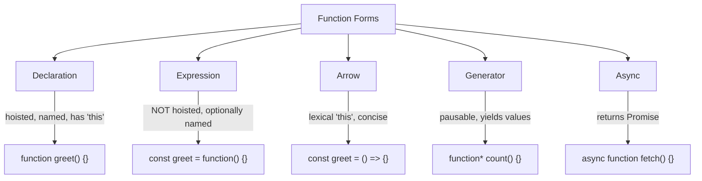
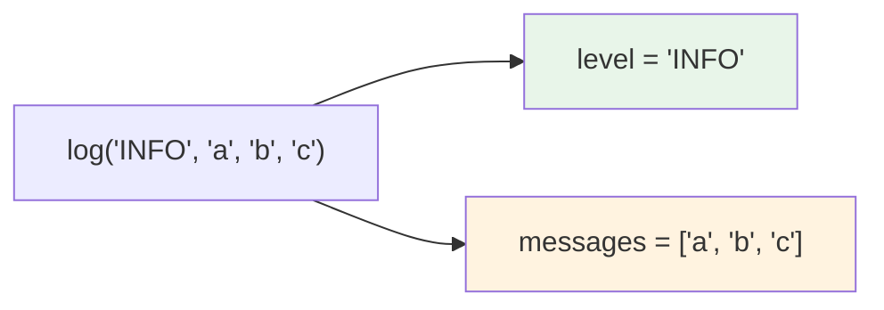
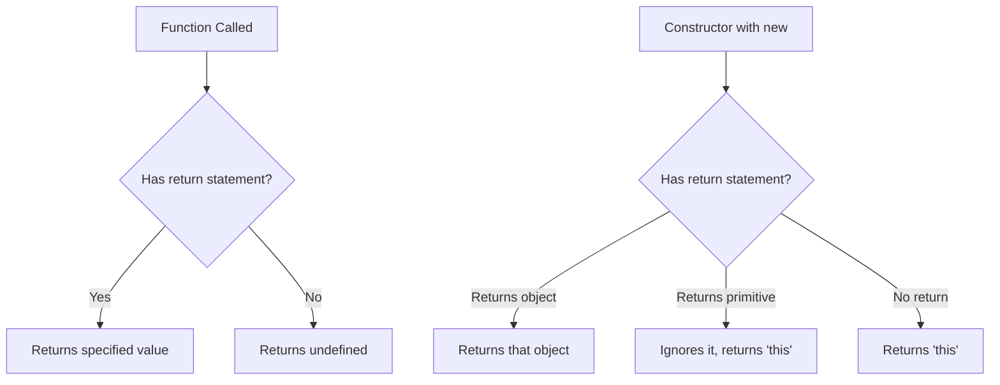
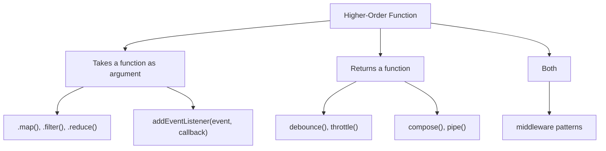
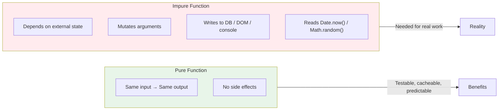
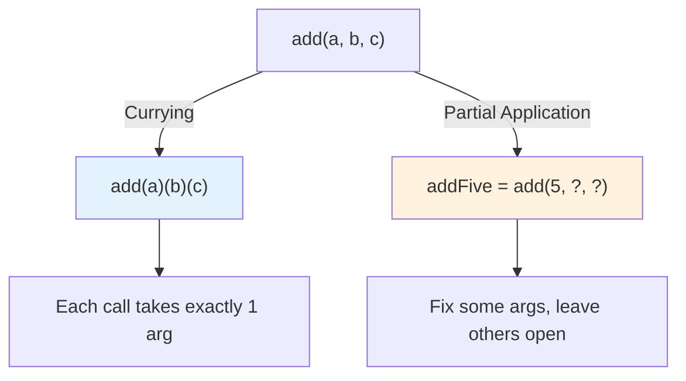

# Functions Deep Dive: Every Form, Every Pattern

> Declarations, expressions, arrows, higher-order functions, pure functions, and currying.

---

## Table of Contents

- [1. Function Forms](#1-function-forms)
- [2. Parameters](#2-parameters)
- [3. Returns](#3-returns)
- [4. Higher-Order Functions](#4-higher-order-functions)
- [5. Pure Functions](#5-pure-functions)
- [6. Currying and Partial Application](#6-currying-and-partial-application)

---

## 1. Function Forms

JavaScript gives you five distinct ways to write a function. This is not accidental generosity — each form exists because it behaves differently in meaningful ways. Picking the right form is a design decision, not a style preference.

Let's map the landscape first.



**Function Declarations** are the oldest and most forgiving form. They are hoisted — the engine moves them to the top of their scope before any code runs. You can call a declared function before the line where you wrote it.

```js
// This works. Declaration is hoisted.
sayHello("Ada");

function sayHello(name) {
  console.log(`Hello, ${name}!`);
}
```

This is genuinely useful when you want to organize a file with the high-level logic at the top and helper functions below. Declarations also get a proper `.name` property, which makes stack traces easier to read.

**Function Expressions** assign a function to a variable. They are *not* hoisted — the variable declaration is hoisted, but it stays `undefined` until the assignment line runs.

```js
// TypeError: greet is not a function
greet("Ada");

const greet = function(name) {
  console.log(`Hello, ${name}!`);
};
```

You can give a function expression an explicit name, and you should when the function is non-trivial. The name shows up in debuggers and error stacks:

```js
const factorial = function factorial(n) {
  if (n <= 1) return 1;
  return n * factorial(n - 1); // can reference itself by name
};
```

**Arrow Functions** were introduced in ES6, and they changed how most JavaScript is written. They have two critical differences from the forms above: they do not get their own `this`, and they do not get an `arguments` object.

```js
const double = (x) => x * 2;

const multiply = (a, b) => {
  const result = a * b;
  return result;
};

// Single param? Parens optional. (But keep them for consistency.)
const square = x => x * x;
```

> **Gotcha**: Arrow functions inherit `this` from the surrounding scope (lexical `this`). This is exactly what you want in callbacks, and exactly what will break you if you use an arrow as an object method.

```js
const timer = {
  seconds: 0,
  // BUG: 'this' is NOT timer — it's the outer scope
  start: () => {
    setInterval(() => {
      this.seconds++; // 'this' is Window or undefined
    }, 1000);
  },
};

const timerFixed = {
  seconds: 0,
  // CORRECT: regular method gets 'this' bound to timer
  start() {
    setInterval(() => {
      this.seconds++; // 'this' is timerFixed
    }, 1000);
  },
};
```

**Generator Functions** can pause themselves with `yield` and be resumed from the outside. They return an iterator.

```js
function* idGenerator() {
  let id = 0;
  while (true) {
    yield id++;
  }
}

const gen = idGenerator();
console.log(gen.next().value); // 0
console.log(gen.next().value); // 1
console.log(gen.next().value); // 2
```

Generators are niche, but they underpin tools like Redux-Saga, and they are the mechanism behind `for...of` with custom iterables.

**Async Functions** always return a Promise. Inside them, `await` pauses execution until the awaited Promise settles. Think of `async/await` as syntax sugar over `.then()` chains — it flattens the callback nesting.

```js
async function fetchUser(id) {
  const response = await fetch(`/api/users/${id}`);
  const user = await response.json();
  return user;
}

// Equivalent without async/await:
function fetchUserPromise(id) {
  return fetch(`/api/users/${id}`)
    .then(response => response.json());
}
```

**My rule of thumb**: use declarations for top-level named functions, arrows for callbacks and inline transforms, `async` whenever you touch a Promise, and generators only when you genuinely need lazy sequences. Never use an arrow as an object method.

---

## 2. Parameters

Parameters are the contract between a function and the code that calls it. JavaScript's parameter system is flexible to the point of being dangerous — you can pass too many arguments, too few, or the wrong shape entirely, and the language will not complain. Understanding defaults, rest parameters, and destructuring turns that chaos into an expressive, self-documenting API.

**Default Parameters** let you declare fallback values right in the signature. Before ES6, you had to write `name = name || "stranger"` inside the function body, which broke on falsy-but-valid values like `0`, `""`, or `false`.

```js
// Old way — broken for falsy values
function greet(name) {
  name = name || "stranger"; // "" becomes "stranger". Oops.
  return `Hello, ${name}!`;
}

// Modern way — only triggers on undefined
function greet(name = "stranger") {
  return `Hello, ${name}!`;
}

greet();         // "Hello, stranger!"
greet("Ada");    // "Hello, Ada!"
greet("");       // "Hello, !"  ← empty string is NOT undefined
greet(undefined);// "Hello, stranger!"
greet(null);     // "Hello, null!"  ← null is NOT undefined either
```

> **Key insight**: Defaults trigger on `undefined`, not on `null`. Passing `null` explicitly means "I intend this to be empty." Passing nothing (or `undefined`) means "use whatever default you have."

Defaults can reference earlier parameters in the same signature. They evaluate left to right:

```js
function createRange(start, end, step = (end - start) > 0 ? 1 : -1) {
  // step defaults intelligently based on direction
  const result = [];
  if (step > 0) {
    for (let i = start; i < end; i += step) result.push(i);
  } else {
    for (let i = start; i > end; i += step) result.push(i);
  }
  return result;
}

createRange(0, 5);    // [0, 1, 2, 3, 4]
createRange(5, 0);    // [5, 4, 3, 2, 1]
```

**Rest Parameters** collect "everything else" into a real array. This replaces the old `arguments` object, which was array-like but not actually an array — it lacked `.map()`, `.filter()`, and friends.

```js
function sum(...numbers) {
  return numbers.reduce((total, n) => total + n, 0);
}

sum(1, 2, 3);       // 6
sum(10, 20, 30, 40); // 100
```

Rest must be the last parameter. You can combine it with regular params:

```js
function log(level, ...messages) {
  const timestamp = new Date().toISOString();
  console.log(`[${timestamp}] [${level}]`, ...messages);
}

log("INFO", "Server started", "on port 3000");
// [2026-05-29T...] [INFO] Server started on port 3000
```



**Destructured Parameters** let you pull values out of an object or array right in the signature. This is indispensable for functions that accept configuration objects:

```js
// Without destructuring — what are these booleans?
createUser("Ada", true, false, 30);

// With destructuring — self-documenting
function createUser({ name, isAdmin = false, isActive = true, age }) {
  return { name, isAdmin, isActive, age, createdAt: Date.now() };
}

createUser({ name: "Ada", age: 30 });
// { name: "Ada", isAdmin: false, isActive: true, age: 30, createdAt: ... }
```

You can combine destructuring with defaults for the entire parameter to make the argument itself optional:

```js
function connect({ host = "localhost", port = 5432, ssl = false } = {}) {
  console.log(`Connecting to ${host}:${port} (SSL: ${ssl})`);
}

connect();                    // Connecting to localhost:5432 (SSL: false)
connect({ port: 3306 });     // Connecting to localhost:3306 (SSL: false)
```

> **Gotcha**: Without the `= {}` at the end, calling `connect()` with no arguments would throw, because you'd be trying to destructure `undefined`.

Array destructuring in parameters is less common but useful for things like coordinate pairs:

```js
function distance([x1, y1], [x2, y2]) {
  return Math.sqrt((x2 - x1) ** 2 + (y2 - y1) ** 2);
}

distance([0, 0], [3, 4]); // 5
```

---

## 3. Returns

Every function in JavaScript returns a value. If you do not write a `return` statement, the function returns `undefined`. This is not an error — it is the language's default behavior, and it catches people constantly.

```js
function addToCart(item) {
  cart.push(item);
  // No return statement. Returns undefined.
}

const result = addToCart("socks");
console.log(result); // undefined
```

This matters most when you chain operations or use a function's result in a condition:

```js
// BUG: Array.sort() returns the array, but Array.push() returns the new length
const sorted = [3, 1, 2].sort();  // [1, 2, 3] ← the array
const length = [1, 2].push(3);     // 3 ← the new length, NOT the array
```



**Early Returns** are a pattern for avoiding deeply nested conditionals. Instead of wrapping everything in `if/else`, handle the edge cases first and return:

```js
// Deeply nested — hard to follow
function processOrder(order) {
  if (order) {
    if (order.items.length > 0) {
      if (order.payment) {
        // actual logic buried three levels deep
        return submitOrder(order);
      } else {
        return { error: "No payment method" };
      }
    } else {
      return { error: "Cart is empty" };
    }
  } else {
    return { error: "No order provided" };
  }
}

// Early returns — flat and readable
function processOrder(order) {
  if (!order) return { error: "No order provided" };
  if (order.items.length === 0) return { error: "Cart is empty" };
  if (!order.payment) return { error: "No payment method" };

  return submitOrder(order);
}
```

This is not just style preference — fewer nesting levels means less cognitive load. Adopt it.

**Returning Objects from Arrows** is a common gotcha. Because curly braces start a block in JavaScript, you need to wrap object literals in parentheses:

```js
// BUG: the braces are parsed as a function body, not an object
const makeUser = (name) => { name: name };
// Returns undefined — 'name: name' is a labeled statement, not an object

// FIX: wrap in parentheses
const makeUser = (name) => ({ name: name });
// Returns { name: "Ada" }

// Even cleaner with shorthand properties
const makeUser = (name) => ({ name });
```

> **Gotcha**: This is one of the most common bugs in React code, where arrow functions frequently return JSX or config objects. If your arrow function "returns nothing," check for missing parentheses.

**Returning Multiple Values** — JavaScript functions can only return one value. But you can return an array or object and destructure at the call site:

```js
// Return an array (positional)
function divmod(a, b) {
  return [Math.floor(a / b), a % b];
}
const [quotient, remainder] = divmod(17, 5); // 3, 2

// Return an object (named — more readable for many values)
function parseUrl(url) {
  const parsed = new URL(url);
  return {
    protocol: parsed.protocol,
    host: parsed.host,
    path: parsed.pathname,
    params: Object.fromEntries(parsed.searchParams),
  };
}

const { host, path, params } = parseUrl("https://example.com/api?page=2");
```

Objects are preferable when you return more than two or three values — positional destructuring breaks the moment someone adds a field in the middle.

**Constructors and return** behave oddly. If a function called with `new` returns a primitive, the return value is ignored and `this` is returned instead. If it returns an object, that object replaces `this`. This is obscure but it explains why constructor patterns work:

```js
function Person(name) {
  this.name = name;
  return 42; // ignored — new Person() returns 'this'
}

function Weird(name) {
  this.name = name;
  return { name: "overridden" }; // returned instead of 'this'
}

new Person("Ada").name;  // "Ada"
new Weird("Ada").name;   // "overridden"
```

---

## 4. Higher-Order Functions

A higher-order function (HOF) is a function that takes a function as an argument, returns a function, or both. This is not an advanced concept — if you have ever written `[1,2,3].map(x => x * 2)`, you have used a higher-order function. `map` takes your arrow function as an argument and calls it for each element.

Higher-order functions are the backbone of functional programming in JavaScript. They let you abstract *behavior*, not just *values*.



**The Array Trio: map, filter, reduce** — These three HOFs replace most `for` loops and express intent more clearly.

```js
const products = [
  { name: "Laptop", price: 999, inStock: true },
  { name: "Mouse", price: 25, inStock: true },
  { name: "Monitor", price: 450, inStock: false },
  { name: "Keyboard", price: 75, inStock: true },
];

// filter: keep items matching a condition
const available = products.filter(p => p.inStock);

// map: transform each item
const names = available.map(p => p.name);
// ["Laptop", "Mouse", "Keyboard"]

// reduce: collapse into a single value
const totalValue = available.reduce((sum, p) => sum + p.price, 0);
// 1099

// Chain them for complex pipelines
const expensiveAvailable = products
  .filter(p => p.inStock)
  .filter(p => p.price > 50)
  .map(p => `${p.name}: $${p.price}`)
  .join(", ");
// "Laptop: $999, Keyboard: $75"
```

> **Note**: `.reduce()` is powerful but overused. If you find your reduce callback spanning more than three lines, a `for...of` loop is probably clearer. Use reduce for actual accumulations — sums, groupings, flat maps.

**Building Your Own HOFs** — The real power is writing functions that return functions. Here is `debounce`, which delays execution until the user stops triggering an event:

```js
function debounce(fn, delay) {
  let timeoutId;
  return function (...args) {
    clearTimeout(timeoutId);
    timeoutId = setTimeout(() => fn.apply(this, args), delay);
  };
}

// Usage: only fires 300ms after the user stops typing
const searchInput = document.querySelector("#search");
searchInput.addEventListener(
  "input",
  debounce((e) => {
    fetchResults(e.target.value);
  }, 300)
);
```

Notice: `debounce` does not execute `fn`. It returns a *new* function that wraps `fn` with timing logic. The returned function closes over `timeoutId`, creating private state that persists across calls.

**Function Composition** lets you build complex transformations from simple pieces. The idea: if `f` transforms A to B, and `g` transforms B to C, then `compose(g, f)` transforms A to C.

```js
const compose = (...fns) =>
  (value) => fns.reduceRight((acc, fn) => fn(acc), value);

const pipe = (...fns) =>
  (value) => fns.reduce((acc, fn) => fn(acc), value);

// Small, testable, reusable pieces
const trim = (s) => s.trim();
const toLowerCase = (s) => s.toLowerCase();
const replaceSpaces = (s) => s.replace(/\s+/g, "-");

// compose reads right to left: replaceSpaces(toLowerCase(trim(input)))
const slugify = compose(replaceSpaces, toLowerCase, trim);

// pipe reads left to right: trim → toLowerCase → replaceSpaces
const slugify2 = pipe(trim, toLowerCase, replaceSpaces);

slugify("  Hello World  "); // "hello-world"
```

> **Opinion**: I prefer `pipe` over `compose`. Humans read left to right, and pipe follows data flow in the natural reading direction. Use `compose` only when you are working with a library that expects it (like some Redux middleware).

**Real-world HOF patterns** include middleware (Express), event handlers, retry logic, and memoization:

```js
function memoize(fn) {
  const cache = new Map();
  return function (...args) {
    const key = JSON.stringify(args);
    if (cache.has(key)) return cache.get(key);
    const result = fn.apply(this, args);
    cache.set(key, result);
    return result;
  };
}

const expensiveFib = (n) => (n <= 1 ? n : expensiveFib(n - 1) + expensiveFib(n - 2));
const fastFib = memoize(expensiveFib);

fastFib(40); // instant after first call
```

---

## 5. Pure Functions

A pure function follows two rules: given the same inputs, it always returns the same output, and it produces no side effects. That is it. No hidden state, no mutations, no network calls, no console logs, no modifying anything outside its own scope.



Think of a pure function like a math formula. `f(x) = x * 2` does not care about the time of day, what happened before, or whether the database is up. It takes a number, returns a number. Always.

```js
// PURE — same input, same output, no side effects
function add(a, b) {
  return a + b;
}

function formatCurrency(cents) {
  return `$${(cents / 100).toFixed(2)}`;
}

function sortNames(names) {
  return [...names].sort(); // spread creates a copy — original untouched
}
```

```js
// IMPURE — depends on external state or causes side effects
let taxRate = 0.08;
function calculateTax(price) {
  return price * taxRate; // reads external variable — output changes if taxRate changes
}

function addItem(cart, item) {
  cart.push(item); // mutates the input array — side effect
  return cart;
}

function logAndReturn(value) {
  console.log(value); // side effect — writes to console
  return value;
}

function generateId() {
  return Math.random().toString(36).slice(2); // different output every call
}
```

**Why purity matters** comes down to three concrete benefits:

1. **Testable**: No mocks needed. Pass input, assert output. Done.
2. **Cacheable**: Since the output depends only on the input, you can memoize pure functions safely. Impure functions cannot be memoized — their output depends on hidden context.
3. **Predictable**: In a debugging session, a pure function is the one you skip. If the input is right, the output is right. Bugs live in the impure parts.

```js
// Pure functions are trivial to test
function discount(price, percent) {
  return price - price * (percent / 100);
}

// Test:
console.assert(discount(100, 20) === 80);
console.assert(discount(50, 10) === 45);
// No setup. No teardown. No mocking a database.
```

**The impure reality** — You cannot build an application from pure functions alone. At some point you must read from a database, render to the DOM, make HTTP requests, and write logs. The goal is not purity everywhere — it is purity *where possible*, with impurity pushed to the edges of your program.

```js
// Pure core: all business logic, no I/O
function calculateOrderTotal(items, taxRate, discountCode) {
  const subtotal = items.reduce((sum, i) => sum + i.price * i.qty, 0);
  const discountAmount = discountCode === "SAVE10" ? subtotal * 0.1 : 0;
  const tax = (subtotal - discountAmount) * taxRate;
  return {
    subtotal,
    discount: discountAmount,
    tax: Math.round(tax * 100) / 100,
    total: Math.round((subtotal - discountAmount + tax) * 100) / 100,
  };
}

// Impure shell: handles I/O, calls the pure core
async function processCheckout(userId, discountCode) {
  const items = await fetchCartItems(userId);       // impure: network
  const taxRate = await getTaxRate(userId);          // impure: network
  const order = calculateOrderTotal(items, taxRate, discountCode); // PURE
  await saveOrder(userId, order);                    // impure: database
  await sendConfirmation(userId, order);             // impure: email
  return order;
}
```

> **The functional architecture pattern**: Pure core, impure shell. Your business logic (pricing, validation, transformation) stays pure and testable. Your I/O (fetch, save, send) wraps around the outside. When a bug appears, you know it is in the shell.

**Avoiding sneaky impurity** — watch for mutation. The most common purity violation is modifying an argument:

```js
// IMPURE — mutates the input
function addDefaults(config) {
  config.timeout = config.timeout || 3000; // mutates the object passed in
  config.retries = config.retries || 3;
  return config;
}

// PURE — returns a new object
function addDefaults(config) {
  return {
    timeout: 3000,
    retries: 3,
    ...config, // caller's values override defaults
  };
}
```

The spread operator is your friend. Use it to clone arrays and objects instead of mutating them.

---

## 6. Currying and Partial Application

Currying transforms a function that takes multiple arguments into a sequence of functions that each take one argument. Partial application fixes some of a function's arguments and returns a new function that waits for the rest. They are related but different — currying is a specific form of partial application.



**Why would you do this?** Because it lets you build specialized functions from general ones, without repeating arguments.

```js
// Without currying — repetitive
const apiUrl = "https://api.example.com";

fetch(`${apiUrl}/users`);
fetch(`${apiUrl}/products`);
fetch(`${apiUrl}/orders`);

// With currying — create a specialized fetcher
function fetchFrom(baseUrl) {
  return function (endpoint) {
    return fetch(`${baseUrl}${endpoint}`);
  };
}

const api = fetchFrom("https://api.example.com");
api("/users");
api("/products");
api("/orders");
```

That is the whole idea. You took a function that needed two pieces of information (base URL and endpoint), locked in the first piece, and got back a function that only needs the second.

**Manual currying** is straightforward — you write functions that return functions:

```js
// Curried multiply
const multiply = (a) => (b) => a * b;

const double = multiply(2);
const triple = multiply(3);

double(5);  // 10
triple(5);  // 15

// Curried string formatter
const format = (prefix) => (suffix) => (value) =>
  `${prefix}${value}${suffix}`;

const parenthesize = format("(")(")");
const quote = format('"')('"');
const tag = format("<")(">");

parenthesize("hello"); // "(hello)"
quote("hello");        // '"hello"'
tag("div");            // "<div>"
```

**A general curry utility** converts any multi-argument function into its curried form:

```js
function curry(fn) {
  return function curried(...args) {
    if (args.length >= fn.length) {
      return fn.apply(this, args);
    }
    return function (...moreArgs) {
      return curried.apply(this, [...args, ...moreArgs]);
    };
  };
}

const curriedAdd = curry((a, b, c) => a + b + c);

curriedAdd(1)(2)(3);     // 6
curriedAdd(1, 2)(3);     // 6 — can pass multiple args at once
curriedAdd(1)(2, 3);     // 6
curriedAdd(1, 2, 3);     // 6 — still works normally
```

> **Note**: `fn.length` is the number of parameters the function declares. Rest parameters and defaults do not count, so `curry` works best with functions that have a fixed, explicit parameter list.

**Partial Application** is the more pragmatic cousin. Instead of currying every function, you fix specific arguments:

```js
function partial(fn, ...presetArgs) {
  return function (...laterArgs) {
    return fn(...presetArgs, ...laterArgs);
  };
}

function log(level, category, message) {
  console.log(`[${level}] [${category}] ${message}`);
}

const warn = partial(log, "WARN");
const warnAuth = partial(log, "WARN", "AUTH");

warn("DB", "Connection lost");    // [WARN] [DB] Connection lost
warnAuth("Token expired");        // [WARN] [AUTH] Token expired
```

JavaScript has a built-in partial application mechanism: `Function.prototype.bind`. It fixes `this` and any leading arguments:

```js
function greet(greeting, name) {
  return `${greeting}, ${name}!`;
}

const sayHello = greet.bind(null, "Hello");
sayHello("Ada");   // "Hello, Ada!"
sayHello("Grace"); // "Hello, Grace!"
```

**Currying with map/filter/reduce** is where the pattern shines brightest. It creates reusable predicates and transforms:

```js
const prop = curry((key, obj) => obj[key]);
const gt = curry((threshold, value) => value > threshold);
const includes = curry((item, arr) => arr.includes(item));

const users = [
  { name: "Ada", age: 36, roles: ["admin", "user"] },
  { name: "Grace", age: 85, roles: ["user"] },
  { name: "Alan", age: 41, roles: ["admin", "user"] },
];

// Composable, readable pipelines
const names = users.map(prop("name"));
// ["Ada", "Grace", "Alan"]

const seniors = users.filter(u => gt(60, prop("age")(u)));
// [{ name: "Grace", ... }]

const admins = users.filter(u => includes("admin")(prop("roles")(u)));
// [{ name: "Ada", ... }, { name: "Alan", ... }]

// Even cleaner with pipe
const isAdmin = pipe(prop("roles"), includes("admin"));
const adminNames = users.filter(isAdmin).map(prop("name"));
// ["Ada", "Alan"]
```

> **Gotcha**: Currying and partial application add a layer of indirection. If your team does not use functional patterns regularly, a curried pipeline can be harder to read than a straightforward function with all arguments spelled out. Use these patterns when they genuinely reduce repetition and improve composability — not to prove you know them.

**When to reach for currying**: configuration (lock in environment-specific values), event handlers (lock in the event type), data pipelines (compose small transforms), and any time you find yourself writing `(x) => someFunction(constantValue, x)` — that is partial application begging to be explicit.