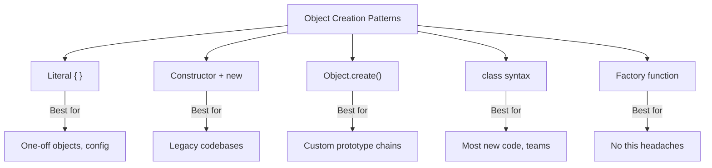
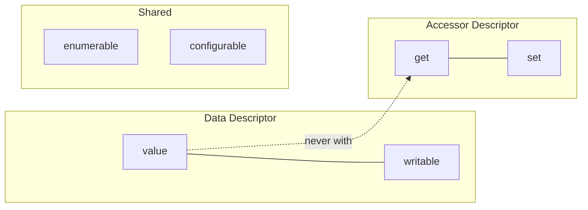
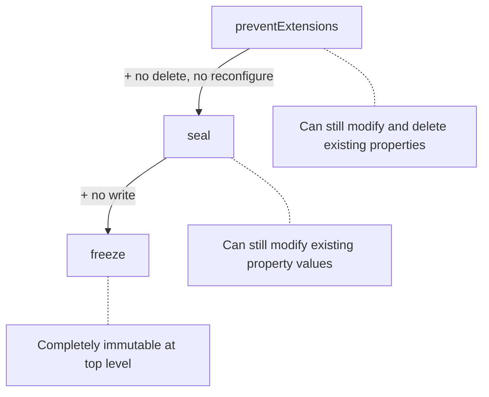
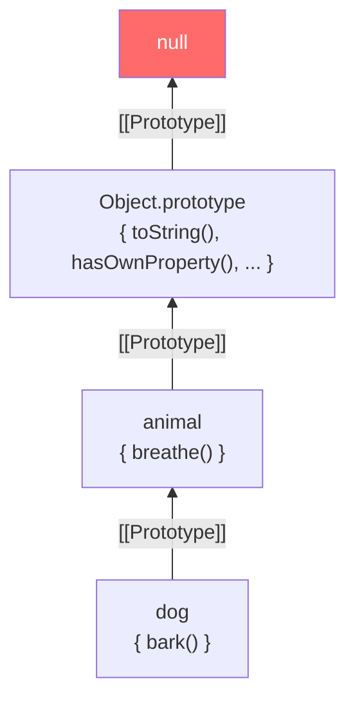
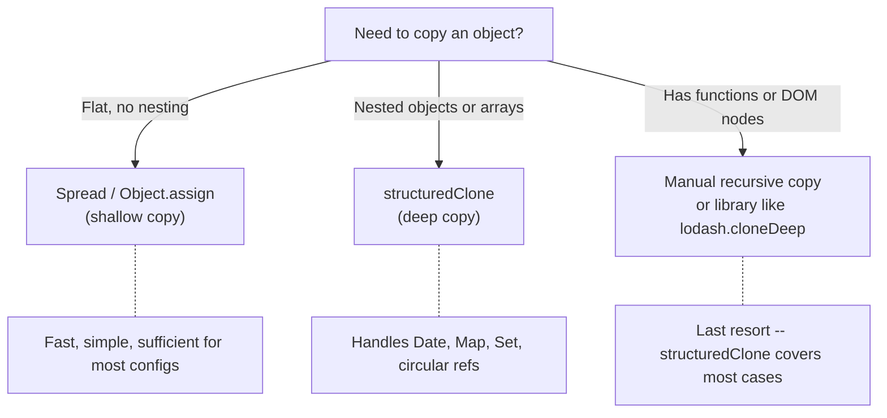
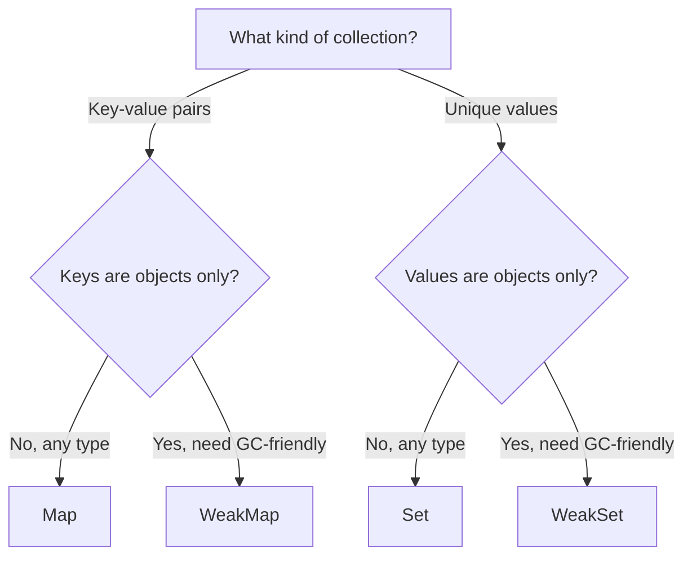

# Objects and Prototypes: The Real OOP of JavaScript

> Object creation, property descriptors, the prototype chain, Maps, Sets, and why JS OOP is not what you think.

---

## Table of Contents

- [1. Object Creation](#1-object-creation)
- [2. Property Access and Descriptors](#2-property-access-and-descriptors)
- [3. Object Methods](#3-object-methods)
- [4. Prototypes](#4-prototypes)
- [5. Cloning](#5-cloning)
- [6. Maps and Sets](#6-maps-and-sets)

---

## 1. Object Creation

Most tutorials start with "JavaScript has classes just like Java." That is a lie. JavaScript has *objects*. Classes came later as syntax sugar. Understanding the five ways to create objects will save you from a world of confusion.

### Object Literal

The bread and butter. You will use this 90% of the time.

```js
const dog = {
  name: "Rex",
  age: 4,
  bark() {
    return `${this.name} says woof!`;
  }
};
```

This is not "just a hash map." It is a full object with a prototype (we will get there). The shorthand method syntax `bark()` is preferred over `bark: function()` -- it is cleaner and behaves identically.

### Constructor Function (The Old Way)

Before ES6, this was how you built "classes."

```js
function Dog(name, age) {
  this.name = name;
  this.age = age;
}

Dog.prototype.bark = function () {
  return `${this.name} says woof!`;
};

const rex = new Dog("Rex", 4);
```

The `new` keyword does four things: creates a blank object, sets its prototype to `Dog.prototype`, runs the function with `this` pointing to the new object, and returns it. Forget `new` and `this` becomes `undefined` in strict mode (or worse, `window` in sloppy mode).

### Object.create

This one lets you set the prototype *directly*. No constructor, no `new`.

```js
const dogProto = {
  bark() {
    return `${this.name} says woof!`;
  }
};

const rex = Object.create(dogProto);
rex.name = "Rex";
rex.age = 4;
```

`Object.create(null)` is a special trick -- it creates an object with *no prototype at all*. No `toString`, no `hasOwnProperty`, nothing. Useful for pure dictionaries where you do not want inherited keys leaking in.

### Class Syntax (ES6+)

Syntactic sugar over constructor functions. Looks familiar to Java/C# developers, but do not be fooled -- the underlying mechanism is still prototypes.

```js
class Dog {
  constructor(name, age) {
    this.name = name;
    this.age = age;
  }

  bark() {
    return `${this.name} says woof!`;
  }
}

const rex = new Dog("Rex", 4);
```

> Classes are not hoisted the way function declarations are. Using a class before its declaration throws a `ReferenceError`. This catches people off guard because constructor functions *are* hoisted.

### Factory Function

No `new`, no `this`, no prototype weirdness. Just a function that returns an object.

```js
function createDog(name, age) {
  return {
    name,
    age,
    bark() {
      return `${name} says woof!`; // closure, not this
    }
  };
}

const rex = createDog("Rex", 4);
```

Factory functions use closures instead of `this`. That means `bark` will always work regardless of how you call it -- no binding issues. The tradeoff: every instance gets its own copy of every method, so you use more memory than the prototype approach.



**My recommendation:** use `class` for shared-prototype instances, factory functions when you want simplicity, and object literals for everything else. Avoid bare constructor functions in new code -- classes do the same thing more clearly.

---

## 2. Property Access and Descriptors

Objects look simple on the surface. You set a key, you read a key. But underneath, every single property carries hidden metadata that controls whether it can be changed, enumerated, or deleted. Understanding this layer is the difference between writing code that works and writing code that *holds up*.

### Dot vs Bracket Notation

```js
const user = { name: "Alice", age: 30 };

// Dot notation -- clean, the default choice
user.name; // "Alice"

// Bracket notation -- dynamic, accepts any expression
user["name"]; // "Alice"

const key = "age";
user[key]; // 30
```

The rule is simple: use dot notation unless you *cannot*. You need brackets when:

- The key is stored in a variable
- The key contains special characters (`user["first-name"]`)
- The key is computed at runtime

### Computed Property Keys

ES6 lets you compute keys inside object literals:

```js
const field = "email";

const user = {
  name: "Alice",
  [field]: "alice@example.com",           // "email" key
  [`${field}Verified`]: true              // "emailVerified" key
};
```

This is extremely useful for building objects dynamically -- form handlers, reducers, API response mappers.

### Property Descriptors

Here is what most developers never learn. Every property has a *descriptor* -- a hidden object controlling its behavior.

```js
const user = { name: "Alice" };

console.log(Object.getOwnPropertyDescriptor(user, "name"));
// {
//   value: "Alice",
//   writable: true,      -- can the value change?
//   enumerable: true,     -- does it show up in for...in / Object.keys?
//   configurable: true    -- can the descriptor itself be changed? can the property be deleted?
// }
```

You can define properties with custom descriptors:

```js
const user = {};

Object.defineProperty(user, "id", {
  value: 42,
  writable: false,      // read-only
  enumerable: false,    // hidden from Object.keys, for...in, JSON.stringify
  configurable: false   // cannot be redefined or deleted -- this is permanent
});

user.id = 99;           // silently fails (or throws in strict mode)
delete user.id;         // silently fails
Object.keys(user);      // [] -- id is invisible
```

> Once `configurable` is set to `false`, you cannot change it back. The only thing you can still do is change `writable` from `true` to `false` (but not the reverse). This is a one-way door.

### Getters and Setters

Properties that look like data but execute code when accessed or assigned:

```js
const user = {
  firstName: "Alice",
  lastName: "Smith",

  get fullName() {
    return `${this.firstName} ${this.lastName}`;
  },

  set fullName(value) {
    const [first, last] = value.split(" ");
    this.firstName = first;
    this.lastName = last;
  }
};

user.fullName;              // "Alice Smith" -- calls the getter
user.fullName = "Bob Jones"; // calls the setter
user.firstName;              // "Bob"
```

Getters and setters have *accessor descriptors* instead of data descriptors -- they have `get`/`set` instead of `value`/`writable`. You cannot mix the two: a property is either a data property or an accessor property, never both.



**Gotcha:** if you define a getter without a setter and try to assign to that property, the assignment silently fails in sloppy mode and throws in strict mode. Always define both if you intend the property to be read-write.

---

## 3. Object Methods

JavaScript gives you a rich set of static methods on `Object` for inspecting, iterating, and locking down objects. These are your daily tools -- know them cold.

### Iterating: keys, values, entries

```js
const user = { name: "Alice", age: 30, role: "admin" };

Object.keys(user);    // ["name", "age", "role"]
Object.values(user);  // ["Alice", 30, "admin"]
Object.entries(user);  // [["name", "Alice"], ["age", 30], ["role", "admin"]]
```

All three return only *own, enumerable* properties. They skip inherited properties and non-enumerable ones. The order follows insertion order for string keys (with numeric-like keys sorted first -- yes, really).

`Object.entries` is particularly powerful because it pairs perfectly with `for...of` and destructuring:

```js
for (const [key, value] of Object.entries(user)) {
  console.log(`${key}: ${value}`);
}
```

And you can go the other way with `Object.fromEntries`:

```js
const pairs = [["name", "Alice"], ["age", 30]];
const obj = Object.fromEntries(pairs); // { name: "Alice", age: 30 }
```

This makes `entries` -> transform -> `fromEntries` a beautiful pipeline for object manipulation.

### Merging: Object.assign and Spread

```js
const defaults = { theme: "dark", lang: "en", debug: false };
const userPrefs = { theme: "light", debug: true };

// Object.assign mutates the first argument
const config = Object.assign({}, defaults, userPrefs);
// { theme: "light", lang: "en", debug: true }

// Spread syntax -- same result, more readable
const config2 = { ...defaults, ...userPrefs };
```

Both perform *shallow* copies. Nested objects are shared by reference, not cloned. This is the single most common source of mutation bugs in real codebases.

```js
const original = { settings: { volume: 80 } };
const copy = { ...original };

copy.settings.volume = 0;
original.settings.volume; // 0 -- oops, same reference
```

### Locking Objects: freeze, seal, preventExtensions

Three levels of immutability, from strictest to loosest:

```js
const obj = { a: 1, b: 2 };

// Level 1: Cannot add new properties
Object.preventExtensions(obj);

// Level 2: Cannot add or delete properties, cannot reconfigure
Object.seal(obj);

// Level 3: Cannot add, delete, or modify any property
Object.freeze(obj);
```



> `Object.freeze` is *shallow*. Nested objects inside a frozen object are still mutable. If you need deep freezing, you must recurse manually or use a library. This trips people up constantly.

### Ownership: hasOwn

The classic `obj.hasOwnProperty(key)` has a flaw: if someone creates an object with `Object.create(null)`, there is no `hasOwnProperty` method to call. The modern replacement:

```js
const obj = Object.create(null);
obj.name = "Alice";

// obj.hasOwnProperty("name"); // TypeError: not a function
Object.hasOwn(obj, "name");    // true -- always works
```

Use `Object.hasOwn` over `hasOwnProperty` in all new code. It was added in ES2022 specifically to fix this issue.

### Quick Reference

| Method | Returns | Includes inherited? | Includes non-enumerable? |
|---|---|---|---|
| `Object.keys()` | string[] | No | No |
| `Object.values()` | any[] | No | No |
| `Object.entries()` | [string, any][] | No | No |
| `Object.getOwnPropertyNames()` | string[] | No | **Yes** |
| `for...in` | iterates keys | **Yes** | No |

**Opinion:** avoid `for...in` for objects. Use `Object.keys` or `Object.entries` with `for...of`. `for...in` walks the prototype chain, which is almost never what you want, and the linting errors it produces are a sign you should switch.

---

## 4. Prototypes

Here is the secret that makes JavaScript fundamentally different from Java, C#, or Python: there are no classes. There are only objects linked to other objects. Everything you have seen with `class` and `constructor` is a polite facade over this one mechanism: the **prototype chain**.

### What Is a Prototype?

Every object in JavaScript has a hidden internal slot called `[[Prototype]]` (exposed as `__proto__` or via `Object.getPrototypeOf`). When you access a property on an object and the object does not have it, JavaScript walks up the prototype chain looking for it.

```js
const animal = {
  breathe() {
    return "inhale... exhale...";
  }
};

const dog = Object.create(animal);
dog.bark = function () {
  return "woof!";
};

dog.bark();    // "woof!" -- found on dog itself
dog.breathe(); // "inhale... exhale..." -- not on dog, found on animal
```



The chain always terminates at `null`. If a property is not found anywhere in the chain, you get `undefined`. No error, just silent absence.

### How `class` and `new` Map to Prototypes

When you write a class, JavaScript sets up the prototype chain for you:

```js
class Animal {
  breathe() {
    return "inhale... exhale...";
  }
}

class Dog extends Animal {
  bark() {
    return "woof!";
  }
}

const rex = new Dog();
```

Behind the scenes:

```js
// rex --[[Prototype]]--> Dog.prototype --[[Prototype]]--> Animal.prototype --[[Prototype]]--> Object.prototype --> null

Object.getPrototypeOf(rex) === Dog.prototype;          // true
Object.getPrototypeOf(Dog.prototype) === Animal.prototype; // true
```

Methods defined in a class body go on the class's `.prototype` object. Instance data (set in the constructor) goes on the instance itself. This is why methods are shared across all instances (memory efficient) while data is per-instance (unique to each).

### instanceof

`instanceof` walks the prototype chain checking if a constructor's `.prototype` exists anywhere in the chain:

```js
rex instanceof Dog;    // true
rex instanceof Animal; // true
rex instanceof Object; // true
```

> `instanceof` checks the *prototype chain at the time of the check*, not at the time of creation. If you reassign `Dog.prototype` after creating `rex`, `rex instanceof Dog` becomes `false`. This is bizarre and almost never what anyone wants, but it is how the language works.

### Property Shadowing

When you set a property on an object that exists higher in the prototype chain, you *shadow* it -- you do not modify the prototype:

```js
const proto = { greeting: "hello" };
const obj = Object.create(proto);

obj.greeting;        // "hello" (from proto)
obj.greeting = "hi"; // creates OWN property on obj
obj.greeting;        // "hi" (own property shadows proto)
proto.greeting;      // "hello" (unchanged)
```

This is prototypal inheritance in action: reads walk up the chain, but writes always happen on the object itself.

### Do Not Modify Built-in Prototypes

You *can* add methods to `Array.prototype` or `Object.prototype`. You *should not*. It pollutes every instance of that type across your entire runtime, breaks `for...in` loops, and clashes with future language additions. Libraries like MooTools did this years ago and caused real browser compatibility disasters.

```js
// DO NOT DO THIS
Array.prototype.last = function () {
  return this[this.length - 1];
};

// Instead, use a utility function
function last(arr) {
  return arr[arr.length - 1];
}
```

**The mental model:** think of prototypes as a delegation chain. When an object cannot handle a request, it *delegates* to its prototype. This is not inheritance in the classical sense -- it is one object saying "I do not know, ask my parent."

---

## 5. Cloning

Copying objects in JavaScript is one of those things that looks trivial and is secretly full of traps. The language gives you several options, and they each fail in different ways. Understanding when to use which saves debugging time.

### Shallow Copy

Spread and `Object.assign` produce shallow copies -- top-level properties are duplicated, but nested objects remain shared references.

```js
const original = {
  name: "Alice",
  scores: [95, 87, 92],
  address: { city: "Paris" }
};

const shallow = { ...original };

shallow.name = "Bob";             // independent -- string is primitive
shallow.scores.push(100);         // mutates BOTH -- same array reference
shallow.address.city = "London";  // mutates BOTH -- same object reference

original.scores; // [95, 87, 92, 100] -- oops
original.address.city; // "London" -- oops
```

### The JSON Trick (and Why It Is Bad)

The old-school "deep clone":

```js
const deep = JSON.parse(JSON.stringify(original));
```

This works for plain data, but it silently destroys:

- `Date` objects (become strings)
- `undefined` values (disappear)
- Functions (disappear)
- `Map`, `Set`, `RegExp` (become `{}`)
- Circular references (throws an error)
- `Infinity` and `NaN` (become `null`)

Never use this in production code. It exists in tutorials as a historical artifact.

### structuredClone (The Right Way)

Since 2022, the language has a proper deep clone function:

```js
const original = {
  name: "Alice",
  scores: [95, 87, 92],
  joined: new Date("2023-01-15"),
  tags: new Set(["admin", "editor"]),
  nested: { deep: { value: 42 } }
};

const clone = structuredClone(original);

clone.scores.push(100);
clone.nested.deep.value = 0;

original.scores;            // [95, 87, 92] -- safe
original.nested.deep.value; // 42 -- safe
clone.joined instanceof Date; // true -- preserved!
clone.tags instanceof Set;    // true -- preserved!
```

`structuredClone` handles `Date`, `Map`, `Set`, `ArrayBuffer`, `RegExp`, circular references, and deeply nested structures. It does *not* handle functions, DOM nodes, or symbols as keys.



> **Gotcha with `structuredClone` and classes:** it does not preserve the prototype chain. If you clone a class instance, you get a plain object with the same data but none of the methods from the class prototype. If you need to clone class instances, implement a `clone()` method on your class that creates a new instance via the constructor.

```js
class User {
  constructor(name) {
    this.name = name;
  }
  greet() {
    return `Hi, I'm ${this.name}`;
  }
  clone() {
    return new User(this.name);
  }
}

const alice = new User("Alice");
const copy = structuredClone(alice);
copy.greet(); // TypeError: copy.greet is not a function

const safeCopy = alice.clone();
safeCopy.greet(); // "Hi, I'm Alice"
```

**My rule:** reach for `structuredClone` first. Only use spread for intentionally shallow copies (like merging config defaults). Forget the JSON trick exists.

---

## 6. Maps and Sets

Plain objects have been used as key-value stores since JavaScript was born. But they were never *designed* for it. They inherit prototype properties, only allow string or symbol keys, and have no built-in size tracking. `Map` and `Set` were added in ES6 to fix all of this.

### Map

A `Map` is a proper key-value collection where keys can be *any type* -- objects, functions, numbers, even `NaN`.

```js
const cache = new Map();

cache.set("name", "Alice");
cache.set(42, "the answer");
cache.set(true, "yes");

const objKey = { id: 1 };
cache.set(objKey, "user data");

cache.get("name");    // "Alice"
cache.get(42);        // "the answer"
cache.get(objKey);    // "user data"
cache.size;           // 4
cache.has(true);      // true
cache.delete(42);
```

Key differences from plain objects:

| Feature | Object | Map |
|---|---|---|
| Key types | String/Symbol only | Any value |
| Size | Manual (`Object.keys(o).length`) | `map.size` |
| Iteration order | Mostly insertion order* | Guaranteed insertion order |
| Prototype pollution | Yes (inherited keys) | No |
| Performance | Optimized for fixed shapes | Optimized for frequent add/delete |
| JSON serialization | Native | Must convert first |

Maps iterate cleanly:

```js
for (const [key, value] of cache) {
  console.log(key, value);
}

// Or use destructured forEach
cache.forEach((value, key) => {
  console.log(key, value);
});
```

> **When to use Map over Object:** when keys are dynamic or not strings, when you add and remove keys frequently, when you need guaranteed iteration order, or when you need to know the size without counting. Use objects for fixed-shape records (like a user with `name`, `age`, `role`).

### Set

A `Set` is a collection of *unique values*. Adding a duplicate is silently ignored.

```js
const tags = new Set(["javascript", "react", "javascript"]);
tags.size; // 2 -- duplicate removed

tags.add("node");
tags.has("react");    // true
tags.delete("react");

// Classic use: deduplicate an array
const numbers = [1, 2, 2, 3, 3, 3];
const unique = [...new Set(numbers)]; // [1, 2, 3]
```

Sets use the *SameValueZero* algorithm for equality, which means `NaN === NaN` (unlike normal JS equality) and objects are compared by reference.

```js
const set = new Set();
set.add(NaN);
set.add(NaN);
set.size; // 1 -- NaN is deduplicated

set.add({ id: 1 });
set.add({ id: 1 });
set.size; // 3 -- two different object references
```

### WeakMap and WeakSet

These are the specialized versions for when you need garbage-collection-friendly storage. The "weak" means the collection does not prevent its keys (WeakMap) or values (WeakSet) from being garbage collected.

```js
const metadata = new WeakMap();

let element = document.querySelector("#app");
metadata.set(element, { clicks: 0, lastVisit: new Date() });

// If element is removed from the DOM and all other references are gone,
// the WeakMap entry is automatically garbage collected.
element = null; // the metadata entry can now be cleaned up by GC
```



**WeakMap constraints:** keys must be objects (not primitives), it is not iterable (no `forEach`, no `size`, no `keys()`). You cannot list its contents. This is by design -- since entries can disappear at any time due to garbage collection, iteration would be non-deterministic.

**Real-world WeakMap uses:**
- Storing private data associated with DOM elements without memory leaks
- Caching computed results tied to object lifetimes
- Implementing truly private class fields (before the `#private` syntax existed)

```js
// Private data pattern with WeakMap
const _private = new WeakMap();

class User {
  constructor(name, password) {
    this.name = name;
    _private.set(this, { password }); // hidden from the outside
  }

  checkPassword(attempt) {
    return _private.get(this).password === attempt;
  }
}

const user = new User("Alice", "secret123");
user.name;                    // "Alice" -- public
user.password;                // undefined -- not on the instance
user.checkPassword("secret123"); // true
```

**My take:** use `Map` and `Set` liberally. They are not exotic data structures reserved for special cases -- they are *better* than objects and arrays for their respective use cases. If you are building a lookup table, reach for `Map`. If you need uniqueness, reach for `Set`. Reserve plain objects for structured records with known shapes.