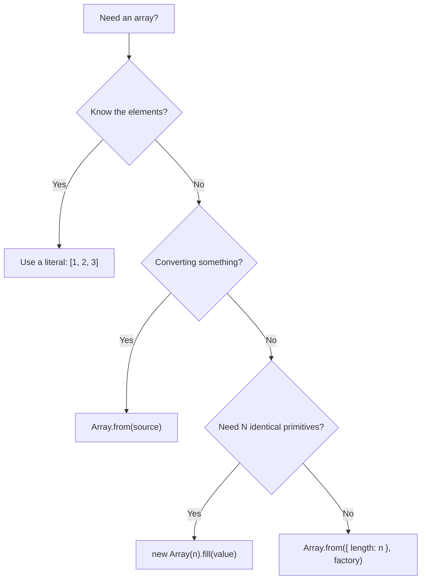
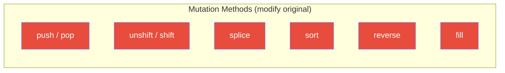
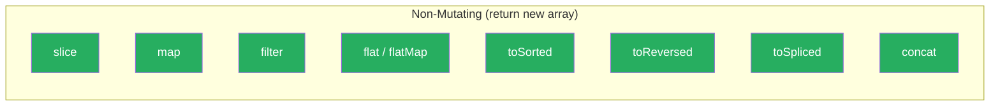
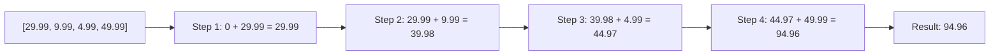
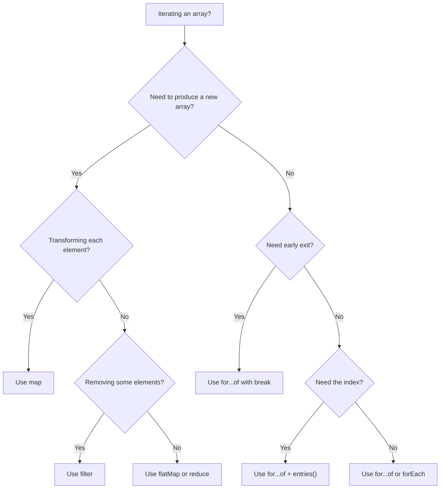

# Arrays and Iteration: The Most-Used Data Structure

> Creation, mutation, transformation, search, and iteration patterns.

---

## Table of Contents

- [1. Creation](#1-creation)
- [2. Mutation Methods](#2-mutation-methods)
- [3. Non-Mutating Methods](#3-non-mutating-methods)
- [4. Reduction and Search](#4-reduction-and-search)
- [5. Iteration Patterns](#5-iteration-patterns)

---

## 1. Creation

Arrays are everywhere. If objects are the nouns of JavaScript, arrays are the lists — shopping lists, guest lists, to-do lists. Almost every meaningful program involves collecting things into an ordered sequence and then doing something with each item.

Let us start with the many ways to bring an array into existence.

### The Literal Way (Use This 95% of the Time)

```js
const fruits = ["apple", "banana", "cherry"];
const empty = [];
const mixed = [1, "two", true, null, { name: "three" }];
```

Square brackets. Simple. This is what you will write in almost every real codebase. JavaScript arrays can hold any type, and they do not care if you mix them. That freedom is powerful, but treat it with respect — an array of mixed types is usually a sign that something went wrong in your design.

### Array.of — When the Constructor Betrays You

The `Array` constructor has a notorious quirk:

```js
const weird = new Array(3);
console.log(weird);        // [ <3 empty items> ]
console.log(weird.length); // 3 — but no actual values!

const expected = Array.of(3);
console.log(expected);     // [3] — an array containing the number 3
```

`new Array(3)` does not create `[3]`. It creates an array with three empty slots. `Array.of` was invented to fix this confusion — it always treats its arguments as elements, never as a length.

> **Gotcha:** Those "empty slots" from `new Array(3)` are not `undefined`. They are holes. Methods like `map` skip holes entirely, which leads to silent bugs. Avoid sparse arrays.

### Array.from — Converting Anything Iterable

`Array.from` is the Swiss Army knife. It converts anything array-like (NodeLists, strings, Sets, generator results) into a real array, and it accepts an optional mapping function as its second argument:

```js
// String to character array
const chars = Array.from("hello");
// ["h", "e", "l", "l", "o"]

// Generate a sequence
const numbers = Array.from({ length: 5 }, (_, i) => i + 1);
// [1, 2, 3, 4, 5]

// Convert a Set (removes duplicates from the source)
const unique = Array.from(new Set([1, 2, 2, 3, 3, 3]));
// [1, 2, 3]

// DOM NodeList to array
const divs = Array.from(document.querySelectorAll("div"));
```

That second argument — the mapper — saves you from chaining `.from().map()`. It runs during creation, so you only traverse the source once.

### fill — Initializing with a Value

```js
const zeros = new Array(5).fill(0);
// [0, 0, 0, 0, 0]

const grid = new Array(3).fill(null);
// [null, null, null]
```

`fill` is useful for pre-populating arrays. But beware the reference trap:

```js
// DANGER: every element points to the SAME array
const rows = new Array(3).fill([]);
rows[0].push("oops");
console.log(rows); // [["oops"], ["oops"], ["oops"]]

// SAFE: Array.from creates a new array for each element
const safeRows = Array.from({ length: 3 }, () => []);
safeRows[0].push("good");
console.log(safeRows); // [["good"], [], []]
```

> **Rule of thumb:** Use `fill` for primitives (numbers, strings, booleans). Use `Array.from` with a factory function for objects and arrays.



---

## 2. Mutation Methods

Here is the single most important concept in this chapter: **some array methods change the original array, and some do not.** Confusing the two is the source of an enormous number of bugs, especially in frameworks like React where mutating state directly breaks rendering.

Think of mutation methods as editing a document in place. The original is gone. Non-mutating methods are like making a photocopy first — the original stays untouched.

### push and pop — The Stack

```js
const stack = ["a", "b"];

stack.push("c");       // returns 3 (new length)
console.log(stack);    // ["a", "b", "c"] — mutated!

const last = stack.pop(); // returns "c"
console.log(stack);       // ["a", "b"] — mutated again!
```

`push` adds to the end, `pop` removes from the end. Together they form a stack (last-in, first-out). Both mutate the original array.

### unshift and shift — The Queue (But Slow)

```js
const queue = [1, 2, 3];

queue.unshift(0);      // returns 4 (new length)
console.log(queue);    // [0, 1, 2, 3]

const first = queue.shift(); // returns 0
console.log(queue);          // [1, 2, 3]
```

> **Performance warning:** `unshift` and `shift` are O(n) operations. Every element after the insertion/removal point has to be re-indexed. On small arrays, nobody notices. On arrays with tens of thousands of elements, prefer a different data structure or work from the end.

### splice — The Surgeon's Knife

`splice` can insert, remove, and replace elements at any position. It is the most powerful mutating method, and the most dangerous:

```js
const colors = ["red", "green", "blue", "yellow"];

// Remove 1 element at index 1
const removed = colors.splice(1, 1);
console.log(removed); // ["green"]
console.log(colors);  // ["red", "blue", "yellow"]

// Insert at index 1, remove 0 elements
colors.splice(1, 0, "orange", "purple");
console.log(colors);  // ["red", "orange", "purple", "blue", "yellow"]

// Replace: remove 2 at index 1, insert 1
colors.splice(1, 2, "white");
console.log(colors);  // ["red", "white", "blue", "yellow"]
```

The signature is `splice(start, deleteCount, ...itemsToInsert)`. It returns an array of the removed elements.

### sort — The Silent Mutator

This one catches everyone off guard:

```js
const scores = [100, 30, 7, 200, 45];

scores.sort();
console.log(scores); // [100, 200, 30, 45, 7] — WHAT?
```

Two surprises here. First, `sort` mutates the original array. Second, without a comparator, it converts elements to strings and sorts lexicographically. The string `"100"` comes before `"200"` which comes before `"30"`. This is almost never what you want for numbers.

```js
// Correct numeric sort — always provide a comparator
const numbers = [100, 30, 7, 200, 45];
numbers.sort((a, b) => a - b);
console.log(numbers); // [7, 30, 45, 100, 200]
```

> **The rule:** Never call `sort()` without a comparator function unless you are sorting strings alphabetically and you are certain the array contains only strings.

### reverse — Also Mutates

```js
const letters = ["a", "b", "c"];
letters.reverse();
console.log(letters); // ["c", "b", "a"] — original is gone
```



> **Opinion:** In modern JavaScript, prefer the non-mutating alternatives whenever possible. Immutability makes your code easier to reason about, easier to debug, and safer in concurrent or reactive systems. We will see those alternatives next.

---

## 3. Non-Mutating Methods

These methods return a new array and leave the original untouched. They are the workhorses of modern JavaScript — the methods you will reach for most often in day-to-day code.

### slice — The Copier

`slice` extracts a portion of an array without changing it. Think of it as a photocopier with a page range:

```js
const animals = ["ant", "bear", "cat", "dog", "eagle"];

const middle = animals.slice(1, 4);
console.log(middle);  // ["bear", "cat", "dog"]
console.log(animals); // unchanged — still all 5

// Clone an entire array
const copy = animals.slice();

// Negative indices count from the end
const lastTwo = animals.slice(-2);
console.log(lastTwo); // ["dog", "eagle"]
```

The signature is `slice(start, end)` where `end` is exclusive. No arguments means "copy everything." This is one of the most common patterns for cloning an array (though the spread operator `[...arr]` is now more idiomatic).

### map — Transform Every Element

`map` creates a new array by running a function on every element. It is the single most important array method in modern JavaScript:

```js
const prices = [10, 20, 35, 50];

const withTax = prices.map(price => price * 1.2);
console.log(withTax); // [12, 24, 42, 60]
console.log(prices);  // [10, 20, 35, 50] — untouched

const users = [
  { name: "Alice", age: 30 },
  { name: "Bob", age: 25 },
];
const names = users.map(user => user.name);
// ["Alice", "Bob"]
```

> **Gotcha:** `map` always returns an array of the same length. If you want to both transform and filter, do not use `map` with conditions that return `undefined` — chain `filter` first, then `map`.

### filter — Keep What Matches

`filter` creates a new array containing only elements that pass a test:

```js
const numbers = [1, 2, 3, 4, 5, 6, 7, 8, 9, 10];

const evens = numbers.filter(n => n % 2 === 0);
console.log(evens); // [2, 4, 6, 8, 10]

const adults = users.filter(user => user.age >= 18);
```

The callback must return a truthy or falsy value. Every element where the callback returns truthy ends up in the new array.

### flat and flatMap — Flattening Nested Arrays

```js
const nested = [[1, 2], [3, 4], [5]];
const flat = nested.flat();
console.log(flat); // [1, 2, 3, 4, 5]

// Deep nesting — pass a depth
const deep = [1, [2, [3, [4]]]];
console.log(deep.flat(2));       // [1, 2, 3, [4]]
console.log(deep.flat(Infinity)); // [1, 2, 3, 4]
```

`flatMap` combines `map` and `flat(1)` into a single step, which is both more readable and more performant:

```js
const sentences = ["hello world", "foo bar"];

// map then flat
const words1 = sentences.map(s => s.split(" ")).flat();

// flatMap — same result, one pass
const words2 = sentences.flatMap(s => s.split(" "));
// ["hello", "world", "foo", "bar"]
```

A particularly useful pattern: `flatMap` can act as a combined filter-and-map by returning an empty array to "remove" elements:

```js
const data = [1, -2, 3, -4, 5];

const doubled_positives = data.flatMap(n =>
  n > 0 ? [n * 2] : []
);
// [2, 6, 10] — filtered and transformed in one pass
```

### toSorted, toReversed, toSpliced — The ES2023 Immutable Trio

ES2023 finally gave us non-mutating versions of the three most annoying mutators:

```js
const original = [3, 1, 4, 1, 5];

// toSorted — returns a new sorted array
const sorted = original.toSorted((a, b) => a - b);
console.log(sorted);   // [1, 1, 3, 4, 5]
console.log(original); // [3, 1, 4, 1, 5] — safe!

// toReversed — returns a new reversed array
const reversed = original.toReversed();
console.log(reversed); // [5, 1, 4, 1, 3]
console.log(original); // still [3, 1, 4, 1, 5]

// toSpliced — returns a new array with splice applied
const spliced = original.toSpliced(1, 2, 99);
console.log(spliced);  // [3, 99, 1, 5]
console.log(original); // still [3, 1, 4, 1, 5]
```

> **Opinion:** Use `toSorted`, `toReversed`, and `toSpliced` by default. Fall back to their mutating counterparts only when you intentionally need in-place modification for performance reasons. Your future self — and your teammates — will thank you.



---

## 4. Reduction and Search

Transformation methods shape data. Reduction and search methods answer questions about it: "What is the total?" "Is this item present?" "Which element matches my criteria?" These methods collapse or interrogate an array instead of producing a new one.

### reduce — The Universal Accumulator

`reduce` walks through every element, carrying an accumulator value forward. It can implement virtually any array operation — sums, groupings, frequency counts, flattening — which is both its power and its danger.

```js
const prices = [29.99, 9.99, 4.99, 49.99];

const total = prices.reduce((sum, price) => sum + price, 0);
console.log(total); // 94.96
```

The anatomy: `reduce(callback, initialValue)`. The callback receives `(accumulator, currentElement, index, array)`. The initial value is the starting point of the accumulator — **always provide it**.

```js
// Counting occurrences
const letters = ["a", "b", "a", "c", "b", "a"];

const freq = letters.reduce((counts, letter) => {
  counts[letter] = (counts[letter] || 0) + 1;
  return counts;
}, {});
// { a: 3, b: 2, c: 1 }

// Grouping objects by a property
const people = [
  { name: "Alice", dept: "eng" },
  { name: "Bob", dept: "sales" },
  { name: "Carol", dept: "eng" },
];

const byDept = people.reduce((groups, person) => {
  const key = person.dept;
  groups[key] = groups[key] || [];
  groups[key].push(person);
  return groups;
}, {});
// { eng: [Alice, Carol], sales: [Bob] }
```

> **Gotcha:** Omitting the initial value makes `reduce` use the first element as the accumulator and start iteration from the second element. On an empty array with no initial value, it throws a `TypeError`. Always pass the second argument.

> **Opinion:** `reduce` is over-used. If your reduce callback is longer than three lines, consider whether `map` + `filter`, a `for...of` loop, or `Object.groupBy` (ES2024) would be clearer. Clever reduce chains impress nobody during code review.



### find and findIndex — Get the First Match

```js
const users = [
  { id: 1, name: "Alice" },
  { id: 2, name: "Bob" },
  { id: 3, name: "Carol" },
];

const bob = users.find(u => u.name === "Bob");
console.log(bob); // { id: 2, name: "Bob" }

const bobIndex = users.findIndex(u => u.name === "Bob");
console.log(bobIndex); // 1

const missing = users.find(u => u.name === "Zara");
console.log(missing); // undefined
```

`find` returns the first element that satisfies the test, or `undefined`. `findIndex` returns the index, or `-1`. Both stop as soon as they find a match — they do not scan the entire array, which makes them efficient for early-exit searches.

ES2023 added `findLast` and `findLastIndex`, which search from the end:

```js
const nums = [1, 3, 5, 2, 4, 6];

const lastEven = nums.findLast(n => n % 2 === 0);
console.log(lastEven); // 6

const lastEvenIdx = nums.findLastIndex(n => n % 2 === 0);
console.log(lastEvenIdx); // 5
```

### includes — Simple Existence Check

```js
const tags = ["javascript", "react", "node"];

console.log(tags.includes("react"));  // true
console.log(tags.includes("python")); // false
```

`includes` uses strict equality (`===`) under the hood, with one important exception: it correctly detects `NaN`, unlike `indexOf`:

```js
const values = [1, NaN, 3];

console.log(values.indexOf(NaN));  // -1 (broken!)
console.log(values.includes(NaN)); // true (correct)
```

> **Rule:** Use `includes` for existence checks. Use `indexOf` only when you need the position and are not dealing with `NaN`.

### some and every — Boolean Questions About Collections

```js
const ages = [16, 21, 14, 32, 18];

const anyAdult = ages.some(age => age >= 18);
console.log(anyAdult); // true — at least one passes

const allAdult = ages.every(age => age >= 18);
console.log(allAdult); // false — not all pass
```

`some` returns `true` if at least one element passes the test (short-circuits on first match). `every` returns `true` only if all elements pass (short-circuits on first failure). Both return `true` for empty arrays in their vacuous case — `every` on an empty array is `true` (vacuous truth), and `some` on an empty array is `false`.

```js
// Practical: form validation
const fields = [
  { name: "email", valid: true },
  { name: "password", valid: false },
  { name: "username", valid: true },
];

const canSubmit = fields.every(f => f.valid);
// false — password is invalid

const hasErrors = fields.some(f => !f.valid);
// true
```

---

## 5. Iteration Patterns

You have the data. You have the methods. Now, how do you actually walk through an array? JavaScript gives you several patterns, and each has a right time and place.

### forEach — Fire and Forget

```js
const fruits = ["apple", "banana", "cherry"];

fruits.forEach((fruit, index) => {
  console.log(`${index}: ${fruit}`);
});
// 0: apple
// 1: banana
// 2: cherry
```

`forEach` calls a function for every element. It always returns `undefined` — you cannot chain after it, and you cannot break out of it early. It exists for side effects: logging, updating DOM elements, pushing to an external array.

> **Gotcha:** You cannot use `break` or `continue` inside `forEach`. If you need early termination, use `for...of` or `some`/`every` (which short-circuit). Returning from a `forEach` callback only skips that single iteration, it does not exit the loop.

```js
// This does NOT stop the loop:
fruits.forEach(fruit => {
  if (fruit === "banana") return; // only skips "banana"
  console.log(fruit); // "apple", "cherry"
});
```

### for...of — The Modern Loop

`for...of` is the cleanest general-purpose loop. It works with any iterable (arrays, strings, Maps, Sets, generators) and supports `break`, `continue`, and `return`:

```js
const scores = [85, 92, 78, 95, 61];

for (const score of scores) {
  if (score < 70) {
    console.log(`Found a failing score: ${score}`);
    break; // actually stops the loop
  }
}
```

Need the index? Use `entries()`:

```js
for (const [index, score] of scores.entries()) {
  console.log(`Student ${index + 1}: ${score}`);
}
```

### entries, keys, and values — Iterator Methods

Arrays have three iterator methods that return specialized iterators:

```js
const colors = ["red", "green", "blue"];

// entries() — [index, value] pairs
for (const [i, color] of colors.entries()) {
  console.log(i, color); // 0 "red", 1 "green", 2 "blue"
}

// keys() — indices only
for (const i of colors.keys()) {
  console.log(i); // 0, 1, 2
}

// values() — values only (same as for...of on the array)
for (const color of colors.values()) {
  console.log(color); // "red", "green", "blue"
}
```

### The Classic for Loop — Still Has Its Place

```js
// When you need to iterate in reverse
for (let i = scores.length - 1; i >= 0; i--) {
  console.log(scores[i]);
}

// When you need to skip elements
for (let i = 0; i < scores.length; i += 2) {
  console.log(scores[i]); // every other element
}
```

The classic `for` loop gives you total control over the index, direction, and step. It is verbose, but sometimes that verbosity is exactly what the situation demands.

> **Do not** use `for...in` for arrays. It iterates over property keys (as strings), includes inherited properties, and does not guarantee order. It is designed for objects.

```js
// NEVER do this with arrays
const arr = [10, 20, 30];
arr.customProp = "oops";

for (const key in arr) {
  console.log(key); // "0", "1", "2", "customProp" — surprise!
}
```

### Choosing the Right Pattern



> **Opinion:** Default to `for...of`. Use `map`/`filter`/`flatMap` when building new arrays. Use `forEach` only for simple side effects where you are certain you never need to break. Reserve the classic `for` loop for the rare cases where you need non-standard iteration (reverse, skip, multiple arrays in lockstep). And never, ever use `for...in` on an array.