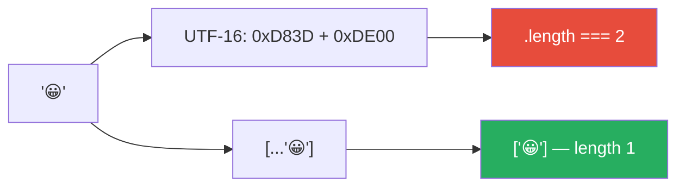
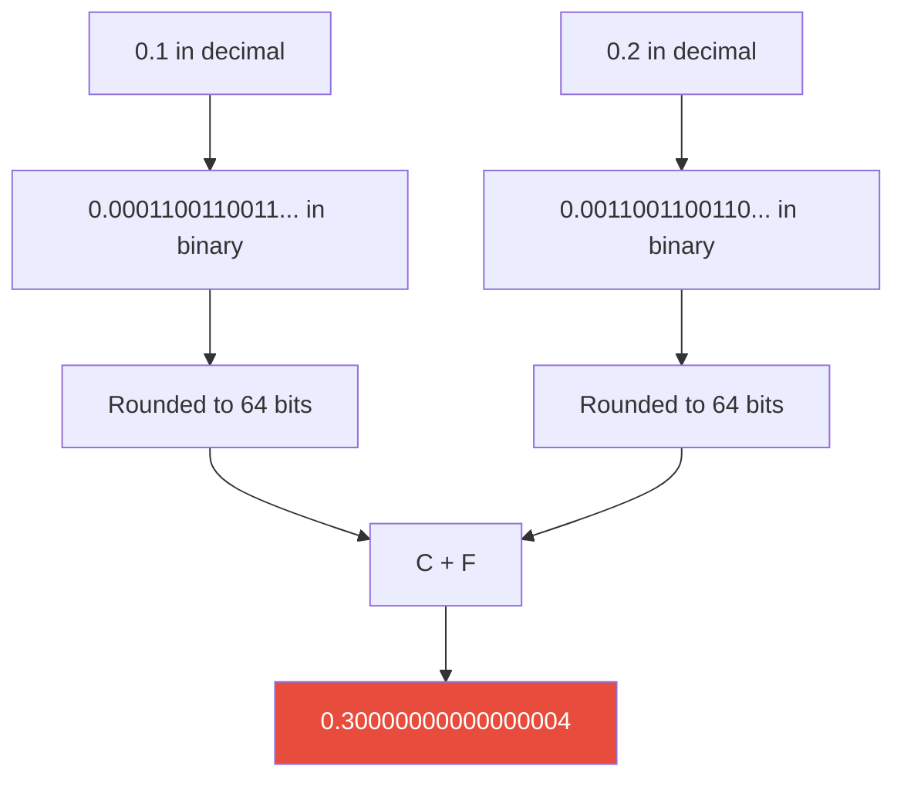
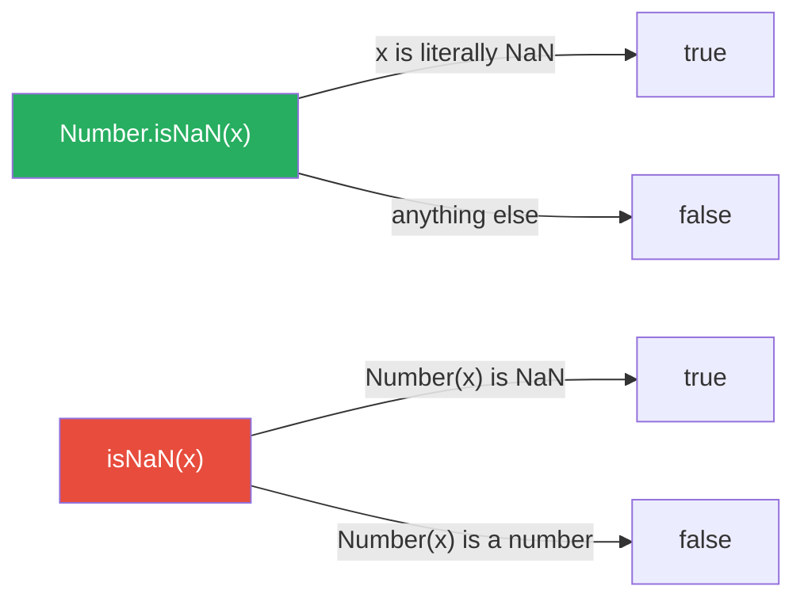
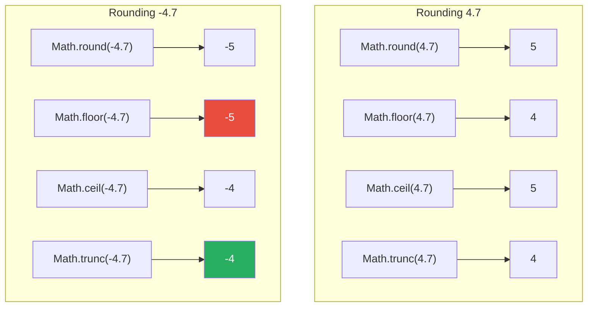
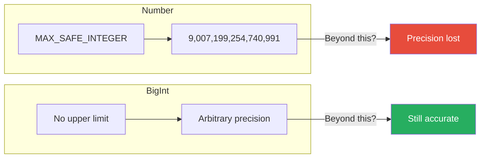
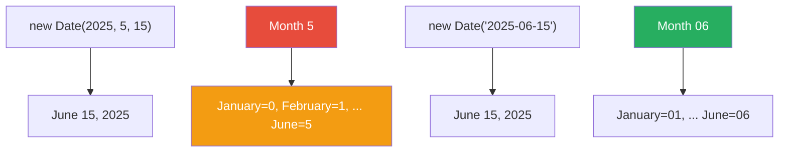
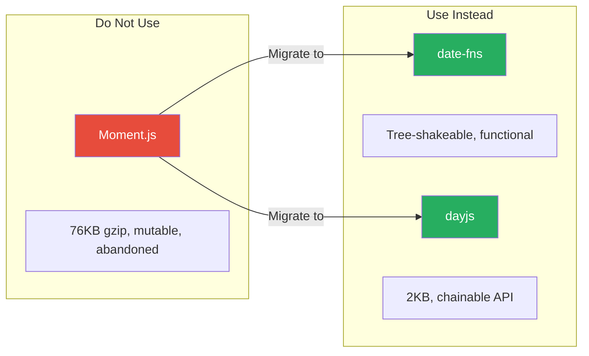

# Strings, Numbers, and Dates: The Primitives That Bite

> Template literals, floating-point traps, Unicode surprises, and why the Date API needs replacing.

---

## Table of Contents

- [1. Strings](#1-strings)
- [2. Numbers](#2-numbers)
- [3. Math and BigInt](#3-math-and-bigint)
- [4. Dates](#4-dates)

---

## 1. Strings

A string in JavaScript is a sequence of UTF-16 code units. That sentence sounds boring until you realize it explains why `"😀".length === 2` and why your form validation just rejected someone's name.

### Strings Are Immutable

This is the single most important thing to understand. When you "change" a string, you are creating a brand new string. The original is untouched.

```js
let greeting = "hello";
greeting.toUpperCase();  // returns "HELLO"
console.log(greeting);   // still "hello" — the original never changed

greeting = greeting.toUpperCase(); // NOW greeting is "HELLO"
```

Think of strings like printed pages. You cannot erase ink from a page — you can only print a new page with different words. Every string method (`slice`, `replace`, `trim`, `toUpperCase`) returns a **new** string.

This matters for performance when you are building a string inside a loop. Concatenating with `+=` in a tight loop creates a new string on every iteration. For thousands of iterations, use an array and `.join()` at the end:

```js
// Slow for large N — each += allocates a new string
let result = "";
for (let i = 0; i < 10000; i++) {
  result += `item ${i}, `;
}

// Faster — one allocation at the end
const parts = [];
for (let i = 0; i < 10000; i++) {
  parts.push(`item ${i}`);
}
const result2 = parts.join(", ");
```

### Template Literals

Backtick strings (`` ` ``) are the modern way to build strings. They solve three problems at once: interpolation, multiline text, and tagged templates.

```js
const name = "Ada";
const age = 36;

// Interpolation — expressions inside ${}
const bio = `${name} is ${age} years old.`;

// Multiline — whitespace is preserved exactly
const html = `
  <div class="card">
    <h2>${name}</h2>
    <p>Age: ${age}</p>
  </div>
`;

// Any expression works inside ${}
const message = `Next year: ${age + 1}. Upper: ${name.toUpperCase()}.`;
```

> **Gotcha:** The whitespace inside a template literal is literal. If you indent your template inside a function, those spaces become part of the string. Libraries like `dedent` exist specifically for this problem.

### Tagged Templates

A tagged template is a function that receives the string pieces and interpolated values separately. This is how libraries build safe SQL queries and styled components:

```js
function highlight(strings, ...values) {
  // strings: ["Hello ", ", you are ", " years old."]
  // values:  ["Ada", 36]
  return strings.reduce((result, str, i) => {
    return result + str + (values[i] !== undefined ? `<b>${values[i]}</b>` : "");
  }, "");
}

const output = highlight`Hello ${name}, you are ${age} years old.`;
// "Hello <b>Ada</b>, you are <b>36</b> years old."
```

This pattern is powerful because the tag function can sanitize, escape, or transform every interpolated value before it enters the string. That is why SQL template tag libraries prevent injection — the values never touch the raw query string.

### The Unicode Trap

JavaScript strings are UTF-16. Most characters fit in one 16-bit code unit, but many — including every emoji — require **two** code units (a "surrogate pair"). The `.length` property counts code units, not characters:

```js
"hello".length;   // 5 — as expected
"😀".length;      // 2 — NOT 1
"👨‍👩‍👧‍👦".length;  // 11 — a family emoji is multiple code points joined by ZWJ
```



To count actual characters (grapheme clusters), spread the string into an array or use `Intl.Segmenter`:

```js
// Spread: handles surrogate pairs but NOT ZWJ sequences
[..."😀"].length;         // 1 — correct for simple emoji
[..."👨‍👩‍👧‍👦"].length;   // 7 — wrong, counts each person + ZWJ

// Intl.Segmenter: the correct solution
const segmenter = new Intl.Segmenter("en", { granularity: "grapheme" });
[...segmenter.segment("👨‍👩‍👧‍👦")].length;  // 1 — correct
```

> **Rule of thumb:** If your code uses `.length` on user-provided strings for validation (max character limits, truncation), you will eventually break on emoji. Use `Intl.Segmenter` for anything user-facing.

### Essential String Methods

```js
const str = "  Hello, World!  ";

str.trim();                  // "Hello, World!"
str.trimStart();             // "Hello, World!  "
str.includes("World");       // true
str.startsWith("  Hello");   // true
str.indexOf("World");        // 9
str.slice(8, 13);            // "orld!"
str.replace("World", "JS");  // "  Hello, JS!  "
str.replaceAll(" ", "-");    // "--Hello,-World!--"
str.split(", ");             // ["  Hello", "World!  "]
str.padStart(20, ".");       // "...  Hello, World!  "
str.at(-1);                  // " " (last character)
```

> **Gotcha:** `replace` without a regex only replaces the **first** match. Use `replaceAll` or a regex with the `g` flag to replace all occurrences. This has tripped up every JavaScript developer at least once.

---

## 2. Numbers

JavaScript has one number type: 64-bit IEEE 754 double-precision floating point. Every number — whether you write `42`, `3.14`, or `0xFF` — is a float under the hood. This single design choice is the source of the language's most infamous bug.

### The 0.1 + 0.2 Problem

```js
0.1 + 0.2;           // 0.30000000000000004
0.1 + 0.2 === 0.3;   // false
```

This is not a JavaScript bug. It is how IEEE 754 works in every language. The decimal fraction `0.1` cannot be represented exactly in binary, just like `1/3` cannot be represented exactly in decimal (`0.333...`). When you add two imprecise numbers, the imprecision compounds.



**How to compare floats:**

```js
// Use Number.EPSILON for "close enough" equality
function almostEqual(a, b) {
  return Math.abs(a - b) < Number.EPSILON;
}

almostEqual(0.1 + 0.2, 0.3); // true
```

### Never Use Floats for Money

This is not a suggestion — it is a rule. If you calculate prices with floats, you will eventually charge someone the wrong amount.

```js
// BAD — floating point
const price = 19.99;
const tax = price * 0.07;   // 1.3993000000000002
const total = price + tax;   // 21.389300000000003

// GOOD — work in cents (integers)
const priceCents = 1999;
const taxCents = Math.round(priceCents * 0.07);  // 140
const totalCents = priceCents + taxCents;          // 2139
const display = `$${(totalCents / 100).toFixed(2)}`; // "$21.39"
```

> **The rule:** Store money as integers in the smallest currency unit (cents, pence, centimes). Only convert to a decimal string for display. Libraries like `dinero.js` formalize this pattern.

### Safe Integers

Because everything is a float, integers eventually lose precision too. A 64-bit float has 53 bits for the significand, so the largest "safe" integer is `2^53 - 1`:

```js
Number.MAX_SAFE_INTEGER;   // 9007199254740991
Number.MAX_SAFE_INTEGER + 1 === Number.MAX_SAFE_INTEGER + 2;  // true — precision lost!

Number.isSafeInteger(9007199254740991);   // true
Number.isSafeInteger(9007199254740992);   // false
```

This matters when you work with database IDs, Twitter/Snowflake IDs, or any system that generates 64-bit integers. If you parse them as Numbers, you will silently get the wrong ID. Use BigInt (covered in the next section) or keep them as strings.

### NaN — The Value That Is Not Equal to Itself

`NaN` stands for "Not a Number," but its type is... `number`. Welcome to JavaScript.

```js
typeof NaN;            // "number" — yes, really
NaN === NaN;           // false — the only value in JS not equal to itself
NaN !== NaN;           // true

// How to check for NaN
Number.isNaN(NaN);           // true — the CORRECT way
Number.isNaN("hello");       // false — only true for actual NaN
isNaN("hello");              // true — the WRONG way (coerces string to number first)
```



> **Always use `Number.isNaN()`**, never the global `isNaN()`. The global version coerces its argument to a number first, which means `isNaN("hello")` returns `true` even though `"hello"` is a perfectly valid string.

### Parsing and Converting

```js
// String to number
Number("42");         // 42
Number("42abc");      // NaN — strict, all-or-nothing
parseInt("42abc");    // 42 — stops at first non-digit
parseFloat("3.14m"); // 3.14

// ALWAYS specify the radix for parseInt
parseInt("010");      // 10 in modern engines, was 8 in old ones
parseInt("010", 10);  // 10 — always safe
parseInt("0xFF", 16); // 255

// Number to string
(255).toString(16);   // "ff"
(3.14159).toFixed(2); // "3.14" — returns a STRING, not a number
```

### Special Values

```js
Infinity;              // 1 / 0
-Infinity;             // -1 / 0
Number.isFinite(42);   // true
Number.isFinite(Infinity); // false

// Negative zero exists
-0 === 0;             // true — you cannot tell them apart with ===
Object.is(-0, 0);     // false — Object.is can
```

---

## 3. Math and BigInt

### The Math Object

`Math` is a namespace, not a constructor. You never write `new Math()`. It is a collection of static methods and constants for common mathematical operations.

```js
// Constants
Math.PI;        // 3.141592653589793
Math.E;         // 2.718281828459045

// Rounding — know which one you need
Math.round(4.5);   // 5 — rounds to nearest, ties go up
Math.floor(4.9);   // 4 — always rounds down
Math.ceil(4.1);    // 5 — always rounds up
Math.trunc(4.9);   // 4 — chops the decimal, no rounding
Math.trunc(-4.9);  // -4 — this is where trunc differs from floor

// Powers and roots
Math.pow(2, 10);     // 1024 — or use 2 ** 10
Math.sqrt(144);      // 12
Math.cbrt(27);       // 3
Math.hypot(3, 4);    // 5 — Pythagorean theorem built in

// Min, max, clamping
Math.min(5, 3, 9);   // 3
Math.max(5, 3, 9);   // 9

// Clamp a value between min and max (no built-in, write your own)
const clamp = (value, min, max) => Math.min(Math.max(value, min), max);
clamp(150, 0, 100);  // 100
```



> **Gotcha:** `Math.floor(-4.3)` is `-5`, not `-4`. Floor goes **toward negative infinity**, not toward zero. If you want "chop the decimal," use `Math.trunc()`.

### Random Numbers

```js
Math.random();                         // 0 to 0.999...
Math.floor(Math.random() * 6) + 1;    // 1 to 6 (dice roll)

// Random integer in a range [min, max] inclusive
function randomInt(min, max) {
  return Math.floor(Math.random() * (max - min + 1)) + min;
}
randomInt(10, 20); // random integer between 10 and 20
```

> **Security warning:** `Math.random()` is **not** cryptographically secure. For tokens, passwords, or anything security-related, use `crypto.getRandomValues()` in the browser or `crypto.randomBytes()` in Node.js. Using `Math.random()` for session tokens is a real vulnerability.

### BigInt — When Numbers Are Not Big Enough

BigInt is a separate primitive type for arbitrarily large integers. It was added to JavaScript because Number cannot safely represent integers beyond `2^53 - 1`, and many real systems (database IDs, cryptography, financial calculations) need larger values.

```js
// Create BigInts with the n suffix or the BigInt() function
const big = 9007199254740993n;
const alsoBig = BigInt("9007199254740993");

// Arithmetic works as expected
big + 1n;      // 9007199254740994n
big * 2n;      // 18014398509481986n
big ** 3n;     // a very large number

// Comparison with regular numbers works
big > 100;     // true
42n === 42;    // false — strict equality checks type too
42n == 42;     // true  — loose equality coerces
```



**The critical rule:** BigInt and Number do not mix in arithmetic.

```js
// This throws — you MUST be explicit
10n + 5;       // TypeError: Cannot mix BigInt and other types

// Convert explicitly
10n + BigInt(5);    // 15n
Number(10n) + 5;   // 15 — but loses precision if the BigInt is large
```

**When to use BigInt:**
- Database IDs from systems like Snowflake or Twitter that exceed 53 bits
- Cryptographic operations
- Financial calculations where you need exact integer arithmetic on very large amounts
- Any time you receive a JSON number that exceeds `Number.MAX_SAFE_INTEGER`

> **Gotcha:** `JSON.stringify` does not know how to serialize BigInt. It throws a `TypeError`. You need a custom replacer function or convert to strings before serializing.

```js
// This throws
JSON.stringify({ id: 123n }); // TypeError

// Solution: convert to string
JSON.stringify({ id: 123n }, (key, value) =>
  typeof value === "bigint" ? value.toString() : value
);
// '{"id":"123"}'
```

---

## 4. Dates

The `Date` object in JavaScript is famously awful. It was copied from Java 1.0's `java.util.Date` in 1995 — a class that Java itself deprecated two years later. JavaScript has been stuck with it ever since.

### Creating Dates

```js
// Current date and time
const now = new Date();

// From a string — ISO 8601 is the only safe format
const d1 = new Date("2025-06-15T10:30:00Z");

// From components — MONTH IS ZERO-INDEXED
const d2 = new Date(2025, 5, 15, 10, 30, 0);  // June 15, not May 15

// From a timestamp (milliseconds since Jan 1, 1970 UTC)
const d3 = new Date(1750000000000);
```



> **The biggest gotcha:** Months are zero-indexed when using the constructor (`0` = January, `11` = December), but the day of the month is one-indexed (starts at `1`). No, there is no good reason. It was copied from Java's mistake.

### Getting and Setting Components

```js
const date = new Date("2025-06-15T10:30:00Z");

date.getFullYear();    // 2025
date.getMonth();       // 5 — zero-indexed, remember
date.getDate();        // 15 — day of month
date.getDay();         // 0 — day of week (0=Sunday, 6=Saturday)
date.getHours();       // depends on your timezone
date.getTime();        // milliseconds since epoch

// UTC versions exist for everything
date.getUTCHours();    // 10 — always UTC, no timezone surprise
```

### The Timezone Trap

`Date` objects always store time as UTC milliseconds internally. But when you display them or use `getHours()`, they convert to the **local timezone of the machine running the code**. This means the same code produces different results on different machines:

```js
// This string has no timezone indicator
const ambiguous = new Date("2025-06-15");
// Some browsers parse this as UTC midnight, others as local midnight
// NEVER rely on this behavior

// Always be explicit about timezone
const utc = new Date("2025-06-15T00:00:00Z");       // UTC
const eastern = new Date("2025-06-15T00:00:00-05:00"); // Eastern
```

> **Rule:** Always include a timezone offset or `Z` (UTC) in date strings. A date string without timezone information is a bug waiting to happen. Different browsers and Node.js versions have historically parsed these differently.

### The Mutability Problem

`Date` objects are mutable, which leads to subtle bugs:

```js
const birthday = new Date("2025-06-15T00:00:00Z");
const partyDate = birthday;  // NOT a copy — same object

partyDate.setDate(partyDate.getDate() + 1);  // move party to the 16th

console.log(birthday.getDate()); // 16 — you just changed the birthday!

// Always clone dates before mutating
const safeCopy = new Date(birthday.getTime());
```

### Why You Should Use a Library

The built-in Date API has no support for:
- Formatting dates in specific patterns (no `"YYYY-MM-DD"` formatter)
- Parsing dates from custom formats
- Adding days/months/years reliably
- Timezone conversions
- Duration calculations

Here are the two libraries the community has settled on:

```js
// date-fns — functional, tree-shakeable, immutable
import { format, addDays, differenceInDays } from "date-fns";

format(new Date(), "yyyy-MM-dd");                    // "2025-06-15"
addDays(new Date(), 7);                              // new Date, 7 days later
differenceInDays(new Date(2025, 11, 25), new Date()); // days until Christmas

// dayjs — tiny (2KB), Moment.js-compatible API, immutable
import dayjs from "dayjs";

dayjs().format("YYYY-MM-DD");          // "2025-06-15"
dayjs().add(7, "day").format("MMM D"); // "Jun 22"
dayjs("2025-12-25").diff(dayjs(), "day"); // days until Christmas
```



### The Future: Temporal

`Temporal` is the long-awaited replacement for `Date`. It reached Stage 3 in TC39 and is available behind flags in some runtimes. It fixes every problem discussed above:

```js
// Temporal — the future of dates in JavaScript
// (Currently Stage 3, available with polyfills)

// Explicit types for different concepts
const today = Temporal.PlainDate.from("2025-06-15");     // just a date, no time
const time = Temporal.PlainTime.from("10:30:00");         // just a time, no date
const dateTime = Temporal.PlainDateTime.from("2025-06-15T10:30:00"); // no timezone
const zoned = Temporal.ZonedDateTime.from("2025-06-15T10:30:00[America/New_York]");

// Duration — a first-class concept
const duration = Temporal.Duration.from({ days: 7, hours: 3 });

// Arithmetic is immutable and explicit
const nextWeek = today.add({ days: 7 });    // returns a NEW PlainDate
today.toString();     // still "2025-06-15"

// Comparison is built in
Temporal.PlainDate.compare(today, nextWeek); // -1

// Month is ONE-indexed like a sane API
today.month;   // 6 — June, finally
today.day;     // 15
```

> **What to do today:** Use `date-fns` or `dayjs` for production code. Keep an eye on `Temporal` — once it ships in all major runtimes, it will become the standard. If you are starting a greenfield project and your runtime supports it, try `Temporal` with the polyfill. It is genuinely excellent.

### Quick Reference: Date Survival Guide

```js
// 1. Always use ISO 8601 strings with timezone
const safe = new Date("2025-06-15T10:30:00Z");

// 2. Store timestamps as numbers (ms since epoch)
const timestamp = Date.now(); // no need to create a Date object

// 3. Clone before mutating
const copy = new Date(original.getTime());

// 4. Use Intl for display formatting (built-in, no library needed)
new Intl.DateTimeFormat("en-US", {
  weekday: "long",
  year: "numeric",
  month: "long",
  day: "numeric"
}).format(new Date());
// "Sunday, June 15, 2025"

// 5. For anything complex, reach for a library
// date-fns for functional style, dayjs for chain style
```