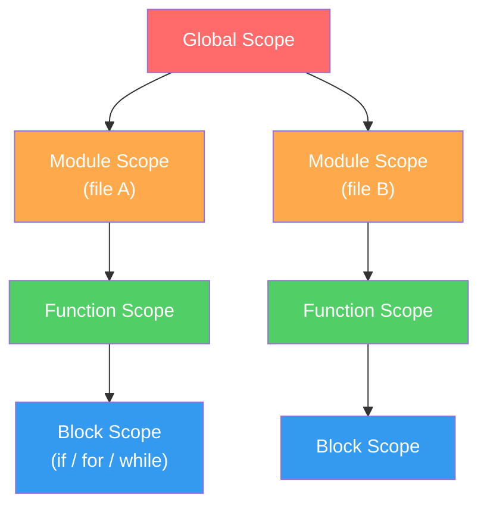
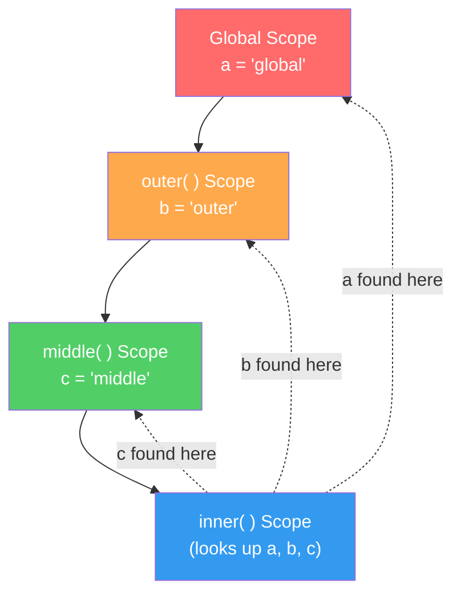
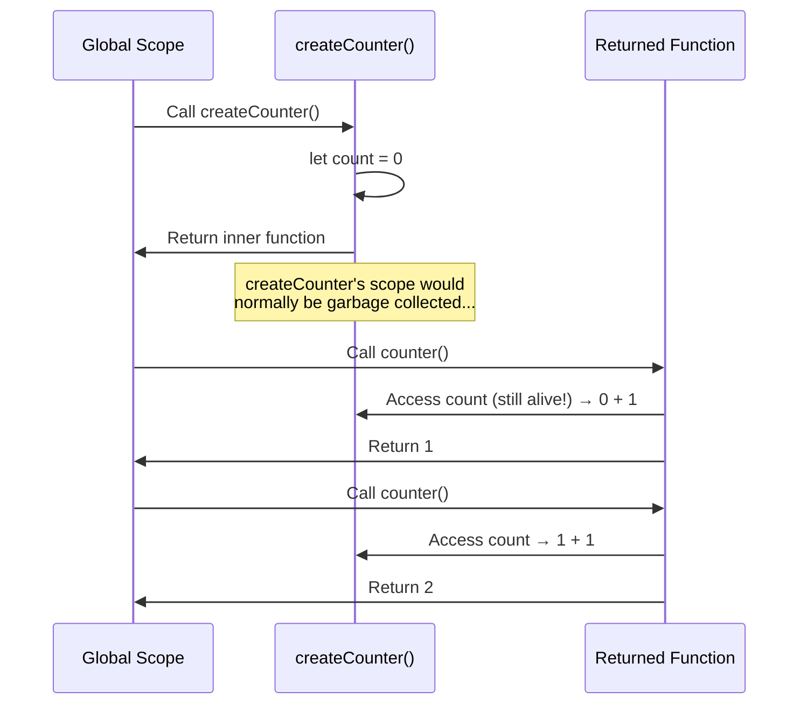
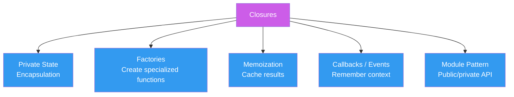

# Scope, Closures, and Hoisting: Where Variables Live

> The invisible rules that govern variable visibility, lifetime, and why closures are the most powerful concept.

---

## Table of Contents

- [1. Scope](#1-scope)
- [2. Lexical Scoping](#2-lexical-scoping)
- [3. Hoisting](#3-hoisting)
- [4. Closures](#4-closures)

---

## 1. Scope

Imagine you live in a house. Your bedroom has things only you can see — your journal, your mess, your secrets. The kitchen has things the whole family shares. And outside, the street has things everyone in the neighborhood can access.

That is scope. It is the set of rules that determines **where a variable is visible** and **where it is not**.

Every time you declare a variable, JavaScript asks one question: *"Where does this variable live?"* The answer determines who gets to read it, change it, or even know it exists.

### Global Scope

A variable declared outside any function or block lives in the **global scope**. Every line of code in your program can see it.

```js
const appName = "TaskMaster";

function greet() {
  console.log(appName); // "TaskMaster" — visible everywhere
}

greet();
```

Global variables feel convenient, but they are dangerous. Any function, any library, any mistake can overwrite them. In a browser, global variables attach to the `window` object, which means a third-party script can collide with your variable names. Treat global scope like a public bulletin board — put as little there as possible.

### Function Scope

Variables declared with `var` inside a function are visible **only within that function**. This was the original scoping mechanism in JavaScript before ES6.

```js
function calculateTax(amount) {
  var rate = 0.2;
  var tax = amount * rate;
  return tax;
}

calculateTax(100); // 20
// console.log(rate); // ReferenceError — rate does not exist here
```

The function creates a boundary. Nothing outside can reach in. This is why wrapping code in functions was the primary way to create private variables for decades.

### Block Scope

ES6 introduced `let` and `const`, which respect **block scope** — any pair of curly braces `{}` creates a boundary.

```js
if (true) {
  let secret = 42;
  const anotherSecret = 99;
  var leaked = "oops";
}

// console.log(secret);        // ReferenceError
// console.log(anotherSecret); // ReferenceError
console.log(leaked);           // "oops" — var ignores block scope!
```

This is the single biggest reason to stop using `var`. It does not respect `if`, `for`, or `while` blocks. It only respects function boundaries. `let` and `const` respect every `{}` they are declared in.

```js
for (let i = 0; i < 3; i++) {
  // i exists here
}
// console.log(i); // ReferenceError — i is gone

for (var j = 0; j < 3; j++) {
  // j exists here
}
console.log(j); // 3 — j leaked out of the loop
```

> **Gotcha:** The classic interview trap. Use `var` in a `for` loop with `setTimeout`, and every callback shares the same `j`. Use `let`, and each iteration gets its own copy. We will revisit this in the closures section.

### Module Scope

When you use ES modules (`import`/`export`), every file gets its own scope. A variable declared at the top level of a module is **not** global — it is private to that file unless explicitly exported.

```js
// utils.js
const API_KEY = "abc123"; // module-scoped, not global
export function fetchData() { /* ... */ }

// app.js
import { fetchData } from "./utils.js";
// console.log(API_KEY); // Not accessible — it was never exported
```

Module scope is the modern default. It solves the global pollution problem that plagued JavaScript for its first twenty years.



The hierarchy is clear: **global > module > function > block**. Each inner scope can see everything in its parent scopes, but parents cannot see into their children. Think of one-way mirrors — you can look out, but nobody can look in.

---

## 2. Lexical Scoping

Here is a question that trips up even experienced developers: when a function accesses a variable, does it use the value from **where the function was defined** or **where the function was called**?

The answer is **where it was defined**. Always. No exceptions.

This is called **lexical scoping** (also called static scoping), and it is one of the most important concepts in all of JavaScript. The word "lexical" means "relating to text" — the scope is determined by the physical position of the code in the source file, not by the runtime call stack.

```js
const greeting = "Hello";

function makeGreeter() {
  const greeting = "Bonjour";

  function greet(name) {
    return `${greeting}, ${name}!`;
  }

  return greet;
}

const frenchGreet = makeGreeter();
console.log(frenchGreet("Alice")); // "Bonjour, Alice!"
```

When `greet` looks up `greeting`, it does not care that the global scope also has a `greeting`. It looks at its **lexical environment** — the scope where it was physically written — and finds `"Bonjour"`.

### The Scope Chain

When JavaScript encounters a variable name, it searches for it using the **scope chain**:

1. Look in the current scope
2. If not found, look in the parent scope
3. Keep going up until you reach the global scope
4. If still not found, throw a `ReferenceError`

```js
const a = "global";

function outer() {
  const b = "outer";

  function middle() {
    const c = "middle";

    function inner() {
      console.log(a); // "global"  — found in global scope
      console.log(b); // "outer"   — found in outer's scope
      console.log(c); // "middle"  — found in middle's scope
    }

    inner();
  }

  middle();
}

outer();
```



The search always goes **up**, never sideways or down. A function cannot reach into a sibling function's variables.

```js
function sibling1() {
  const x = 10;
}

function sibling2() {
  // console.log(x); // ReferenceError — x lives in sibling1, not here
}
```

### Why "Defined, Not Called" Matters

This distinction becomes critical when you pass functions around as values:

```js
function createMultiplier(factor) {
  return function (number) {
    return number * factor; // "factor" comes from where this function was DEFINED
  };
}

const double = createMultiplier(2);
const triple = createMultiplier(3);

// These calls happen far away from where the functions were defined
console.log(double(5));  // 10
console.log(triple(5));  // 15
```

Even though `double` is called in the global scope, it still remembers that `factor` was `2` — because that was the value in the scope where the inner function was defined. This behavior is the foundation of **closures**, which we will explore in section 4.

> **Key insight:** Lexical scoping means you can determine the scope of any variable just by reading the source code. You never need to trace the execution path. This makes JavaScript code predictable — a function's behavior does not change depending on who calls it.

Some older languages (like early Lisp dialects and Bash) use **dynamic scoping**, where lookup depends on the call stack. JavaScript chose lexical scoping, and it is one of the best decisions in the language's design. It makes closures possible, enables powerful patterns like factories and modules, and keeps your code reasoning local instead of global.

---

## 3. Hoisting

Hoisting is the most misunderstood concept in JavaScript. People describe it as "variables being moved to the top of their scope." That description is half-right and half-misleading.

Here is what actually happens: during compilation (before any code runs), JavaScript **registers all declarations** in their respective scopes. The variables exist from the beginning of the scope, but **what value they hold** depends on how they were declared.

### `var` Hoisting: Declared and Initialized to `undefined`

```js
console.log(name); // undefined — not an error!
var name = "Alice";
console.log(name); // "Alice"
```

JavaScript sees this as:

```js
var name;            // declaration hoisted, initialized to undefined
console.log(name);   // undefined
name = "Alice";      // assignment stays in place
console.log(name);   // "Alice"
```

This is why `var` is treacherous. Instead of giving you an error when you use a variable before declaring it, it silently gives you `undefined`. You can spend hours debugging a bug caused by this.

### `let` and `const` Hoisting: The Temporal Dead Zone (TDZ)

`let` and `const` are also hoisted — but they are **not initialized**. They exist in the scope from the start, but accessing them before the declaration line throws a `ReferenceError`. The zone between the start of the scope and the declaration is called the **Temporal Dead Zone**.

```js
// --- TDZ for "age" starts here ---
// console.log(age); // ReferenceError: Cannot access 'age' before initialization
// --- TDZ for "age" ends here ---
let age = 25;
console.log(age); // 25
```


The TDZ is a feature, not a bug. It catches mistakes that `var` would silently swallow. If you try to use a variable before declaring it, you **should** get an error.

> **Gotcha:** The TDZ is per-scope, not per-file. A `let` in a block has its TDZ within that block, starting from the opening `{`.

```js
let x = "outer";

{
  // TDZ for inner x starts here
  // console.log(x); // ReferenceError — NOT "outer"! JavaScript knows a local x exists
  let x = "inner";
  console.log(x); // "inner"
}
```

This surprises people. You might expect the `console.log` to find the outer `x`, but JavaScript has already registered the inner `x` in this block's scope. It knows `x` exists locally, but it is in the TDZ, so it throws instead of falling back to the outer scope.

### Function Hoisting: Fully Lifted

Function **declarations** are the most aggressively hoisted. They are both declared and fully initialized — you can call them before they appear in the code.

```js
greet("Alice"); // "Hello, Alice!" — works perfectly

function greet(name) {
  return `Hello, ${name}!`;
}
```

But function **expressions** follow the rules of their variable keyword:

```js
// console.log(add(2, 3)); // TypeError: add is not a function
var add = function (a, b) {
  return a + b;
};

// console.log(subtract(5, 3)); // ReferenceError: Cannot access before initialization
const subtract = function (a, b) {
  return a - b;
};
```

With `var add`, the variable `add` is hoisted as `undefined`, so calling `undefined(2, 3)` throws a `TypeError`. With `const subtract`, the variable is in the TDZ, so you get a `ReferenceError`.

### The Complete Hoisting Cheat Sheet

```js
// What JavaScript sees when it compiles your code:

// 1. Function declarations — fully hoisted
function declared() { return "I work anywhere!"; }

// 2. var — hoisted, initialized to undefined
var x; // = undefined

// 3. let/const — hoisted, but NOT initialized (TDZ)
// let y;   — exists in scope but accessing throws ReferenceError
// const z; — same as let

// Then your code runs top-to-bottom with assignments in place
```

| Declaration | Hoisted? | Initialized? | Usable Before Declaration? |
|---|---|---|---|
| `var` | Yes | `undefined` | Yes (but dangerous) |
| `let` | Yes | No (TDZ) | No (ReferenceError) |
| `const` | Yes | No (TDZ) | No (ReferenceError) |
| `function` declaration | Yes | Fully | Yes |
| `function` expression | Follows `var`/`let`/`const` | Follows variable | Follows variable |

> **My opinion:** Never rely on hoisting intentionally. Declare everything at the top of its scope. Use `const` by default, `let` when you need reassignment, and forget `var` exists. If your code depends on hoisting to work, it is poorly organized.

---

## 4. Closures

A closure is when a function **remembers the variables from the scope where it was created**, even after that scope has finished executing.

Read that again. It is the entire concept in one sentence.

Every function in JavaScript forms a closure. But the term becomes interesting when an inner function outlives its outer function — when the outer function has returned, its local variables should be garbage collected, but the inner function still holds a reference to them. Those variables **stay alive**.

```js
function createCounter() {
  let count = 0; // this variable should "die" when createCounter returns

  return function () {
    count++;       // but it doesn't — because this function still references it
    return count;
  };
}

const counter = createCounter();
console.log(counter()); // 1
console.log(counter()); // 2
console.log(counter()); // 3
```



The variable `count` is not accessible from outside. You cannot do `counter.count` or `count` in the global scope. The **only** way to interact with it is through the returned function. This is **private state** — a concept that existed in JavaScript through closures long before the language got private class fields.

### Pattern: Private State with Multiple Methods

You can return an object with multiple functions that all close over the same variables:

```js
function createBankAccount(initialBalance) {
  let balance = initialBalance;
  const transactions = [];

  return {
    deposit(amount) {
      balance += amount;
      transactions.push({ type: "deposit", amount, date: new Date() });
      return balance;
    },
    withdraw(amount) {
      if (amount > balance) throw new Error("Insufficient funds");
      balance -= amount;
      transactions.push({ type: "withdrawal", amount, date: new Date() });
      return balance;
    },
    getBalance() {
      return balance;
    },
    getHistory() {
      return [...transactions]; // return a copy, not the original
    },
  };
}

const account = createBankAccount(100);
account.deposit(50);    // 150
account.withdraw(30);   // 120
account.getBalance();   // 120
// account.balance       — undefined. The variable is truly private.
```

This is the **module pattern** — it was the standard way to create encapsulated objects before ES6 classes.

### Pattern: Function Factories

Closures let you create specialized functions from general templates:

```js
function createTaxCalculator(rate) {
  return function (amount) {
    return amount * rate;
  };
}

const calculateVAT = createTaxCalculator(0.20);
const calculateGST = createTaxCalculator(0.10);
const calculateSalesTax = createTaxCalculator(0.0725);

console.log(calculateVAT(100));       // 20
console.log(calculateGST(100));       // 10
console.log(calculateSalesTax(100));  // 7.25
```

Each returned function closes over its own `rate`. The factory produces independent functions that carry their configuration with them.

### Pattern: Memoization

Closures make caching effortless. A memoized function remembers previous results:

```js
function memoize(fn) {
  const cache = new Map();

  return function (...args) {
    const key = JSON.stringify(args);

    if (cache.has(key)) {
      console.log("Cache hit for:", key);
      return cache.get(key);
    }

    console.log("Computing for:", key);
    const result = fn(...args);
    cache.set(key, result);
    return result;
  };
}

const expensiveAdd = memoize((a, b) => {
  // Imagine this takes 3 seconds
  return a + b;
});

expensiveAdd(1, 2); // "Computing for: [1,2]" → 3
expensiveAdd(1, 2); // "Cache hit for: [1,2]"  → 3
expensiveAdd(3, 4); // "Computing for: [3,4]" → 7
```

The `cache` variable lives inside the closure — invisible to the outside world, persistent across calls. No global state needed.

### The Classic Gotcha: Closures in Loops

This is the interview question that spawned a thousand blog posts:

```js
// BROKEN — var shares one variable across all iterations
for (var i = 0; i < 3; i++) {
  setTimeout(function () {
    console.log(i);
  }, 100);
}
// Output: 3, 3, 3 — not 0, 1, 2!
```

Why? Because `var i` has function scope (or global scope), not block scope. All three `setTimeout` callbacks close over the **same** `i`. By the time they run, the loop has finished and `i` is `3`.

```js
// FIXED — let creates a new variable per iteration
for (let i = 0; i < 3; i++) {
  setTimeout(function () {
    console.log(i);
  }, 100);
}
// Output: 0, 1, 2 ✓
```

With `let`, each iteration of the loop gets its own `i`. Each closure captures a different variable. This is the most compelling argument for `let` over `var` in a single example.

> **Key insight:** A closure does not capture the *value* of a variable at the time the function is created. It captures a *reference* to the variable itself. If the variable changes, the closure sees the new value. This is exactly why the `var` loop prints `3, 3, 3` — the closure sees the final value of the shared variable.

### When Closures Bite: Memory Leaks

Because closures keep variables alive, they can prevent garbage collection. If a closure holds a reference to a large object, that object stays in memory as long as the closure exists.

```js
function createHandler() {
  const hugeData = new Array(1_000_000).fill("x"); // 1 million strings

  return function () {
    // Even if this function never uses hugeData,
    // some engines keep the entire scope alive
    return "done";
  };
}

const handler = createHandler();
// hugeData might still be in memory because handler's closure references the scope
```

Modern engines are smart about this — V8 will typically garbage-collect variables that the inner function does not actually reference. But if you reference even one variable from the outer scope, the engine may keep the entire scope object alive. Be mindful of this in long-lived applications like servers or single-page apps.



Closures are not a technique you "use sometimes." They are the air JavaScript breathes. Every event handler, every callback, every `.then()`, every React component — they all depend on closures. Once you truly understand them, you stop seeing JavaScript as a language with quirks and start seeing it as a language with a beautifully consistent scoping model.