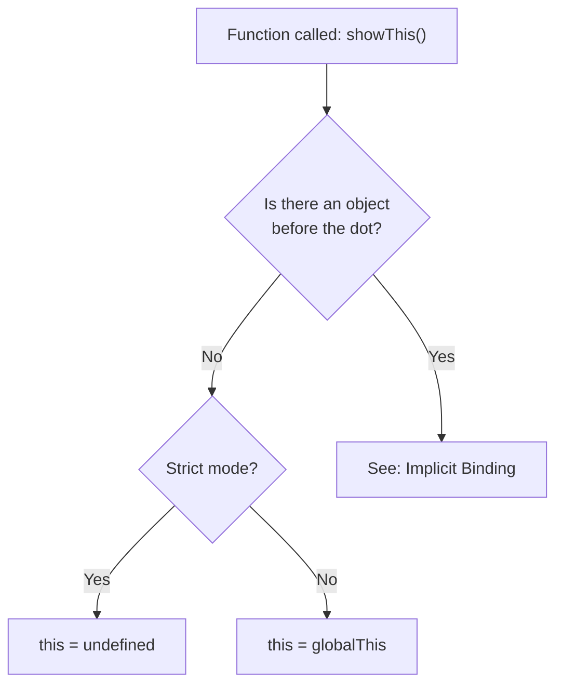
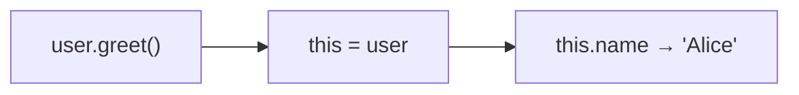
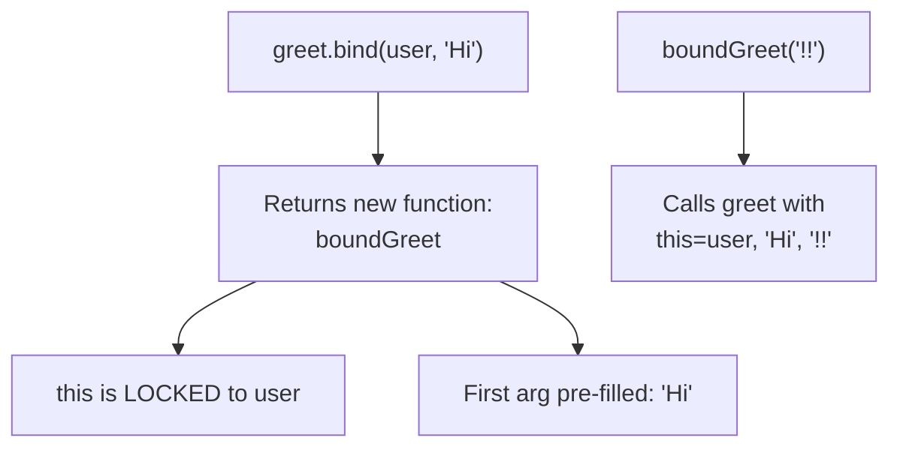
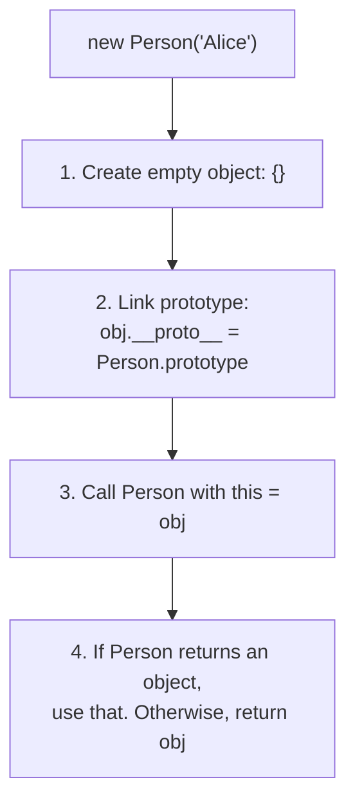
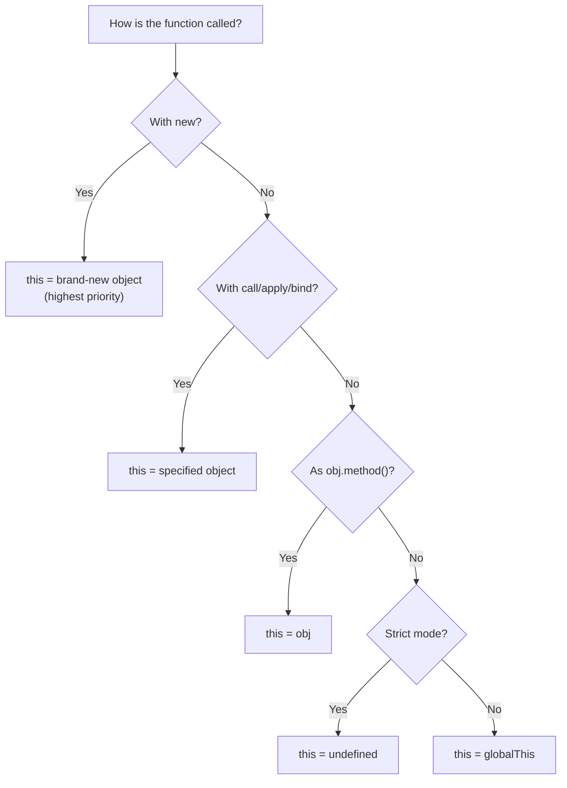
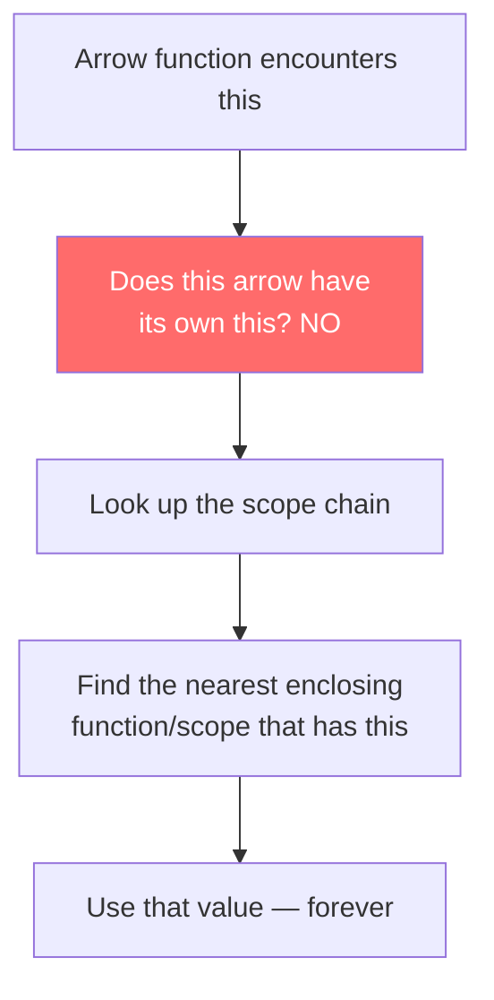

# The this Keyword: Four Rules and One Exception

> The most-misunderstood part of JS — default, implicit, explicit, new binding, and arrow functions.

---

## Table of Contents

- [1. Default Binding](#1-default-binding)
- [2. Implicit Binding](#2-implicit-binding)
- [3. Explicit Binding](#3-explicit-binding)
- [4. new Binding](#4-new-binding)
- [5. Arrow Functions and this](#5-arrow-functions-and-this)

---

## 1. Default Binding

Here is the truth that trips up every beginner: **`this` is not determined when you write the function — it is determined when you call it.** Forget everything you know about `this` from other languages. In JavaScript, `this` is a runtime binding, not a lexical one (with one exception we will cover in section 5).

When you call a plain function with no object in front of it, no `call`/`apply`, no `new` — JavaScript falls back to the **default binding**.

```js
function showThis() {
  console.log(this);
}

showThis(); // What is `this` here?
```

The answer depends on **strict mode**:

```js
// Sloppy mode (no "use strict")
function sloppy() {
  console.log(this); // globalThis (window in browsers, global in Node)
}
sloppy();

// Strict mode
"use strict";
function strict() {
  console.log(this); // undefined
}
strict();
```

> **Why does strict mode give you `undefined`?** Because pointing `this` at the global object by accident is one of the most dangerous things in JavaScript. You could accidentally create global variables, overwrite built-in properties, or cause bizarre bugs three files away. Strict mode shuts that door.

Here is how the engine thinks about it:



### The practical gotcha

Almost all modern code runs in strict mode — ES modules are strict by default, classes are strict by default, and any sane project has `"use strict"` at the top. So in practice, the default binding gives you `undefined`, not `globalThis`.

```js
// In an ES module (type="module" in browsers, .mjs in Node)
function whoAmI() {
  return this;
}
console.log(whoAmI()); // undefined — modules are always strict
```

This means that if you extract a method from an object and call it bare, you do not get the global object as a "safety net" — you get `undefined`, and then `this.something` throws a `TypeError`. That is actually a *good* thing. Failing loudly is better than silently mutating globals.

### One more thing: `globalThis`

Before ES2020, accessing the global object was a mess — `window` in browsers, `global` in Node, `self` in web workers. Now we have `globalThis`, which works everywhere. But you should almost never need it. If your code depends on the default binding pointing at the global object, something has gone wrong in your architecture.

> **Rule of thumb:** If you see `this` inside a standalone function (not a method, not a constructor), ask yourself — *should this even be using `this`?* Nine times out of ten, the answer is no.

---

## 2. Implicit Binding

This is the rule you will use the most in day-to-day code. When a function is called **as a method of an object** — meaning there is a dot before the function name — `this` points to the object on the left side of the dot.

```js
const user = {
  name: "Alice",
  greet() {
    console.log(`Hi, I'm ${this.name}`);
  }
};

user.greet(); // "Hi, I'm Alice"
```

The engine sees `user.greet()` and thinks: "There is an object (`user`) to the left of the dot, so `this` inside `greet` is `user`." Simple.



### Only the last object matters

When you chain objects, `this` is always the **immediate** object — the one closest to the function call:

```js
const company = {
  name: "Acme Corp",
  ceo: {
    name: "Bob",
    introduce() {
      console.log(`I'm ${this.name}`);
    }
  }
};

company.ceo.introduce(); // "I'm Bob" — not "I'm Acme Corp"
```

The call site is `company.ceo.introduce()`. The object immediately left of `.introduce()` is `ceo`, so `this` is `ceo`.

### The biggest trap: losing implicit binding

This is where most bugs come from. When you **extract** a method from an object, you lose the implicit binding:

```js
const user = {
  name: "Alice",
  greet() {
    console.log(`Hi, I'm ${this.name}`);
  }
};

const greetFn = user.greet; // Extracting the function
greetFn(); // "Hi, I'm undefined" (strict mode) or "Hi, I'm " (sloppy)
```

Why? Because `greetFn()` is a plain function call — no dot, no object. The engine falls back to **default binding**. The function does not "remember" that it once belonged to `user`. It was never *attached* to `user` in any meaningful way — it was just a reference stored in `user.greet`.

> Think of it like a business card. When someone hands you their card, the card does not magically stay connected to the person. It is just a piece of paper. A function reference is the same — it is just a pointer to some code. The `this` binding happens at the **call site**, not at the assignment site.

This trap shows up in three common patterns:

```js
// 1. Passing a method as a callback
setTimeout(user.greet, 1000); // this = undefined (strict)

// 2. Destructuring methods
const { greet } = user;
greet(); // this = undefined (strict)

// 3. Assigning to another variable
const fn = user.greet;
fn(); // this = undefined (strict)
```

All three are the same mistake: you extracted the function from its object, then called it without a dot.

### How to fix it

You have three options (we will cover the first two in the next sections):

1. **`bind()`** — create a new function with `this` permanently set
2. **Arrow functions** — lexically capture `this` from the surrounding scope
3. **Wrap it in another function** — `setTimeout(() => user.greet(), 1000)`

Option 3 works because the arrow function calls `user.greet()` *with the dot*, preserving implicit binding.

---

## 3. Explicit Binding

Sometimes you want to tell JavaScript exactly what `this` should be. No guessing, no relying on dots. That is what `call`, `apply`, and `bind` are for. They let you **explicitly** set the value of `this`.

### `call` — invoke now, pass args one by one

```js
function greet(greeting, punctuation) {
  console.log(`${greeting}, I'm ${this.name}${punctuation}`);
}

const user = { name: "Alice" };

greet.call(user, "Hello", "!"); // "Hello, I'm Alice!"
```

The first argument to `call` becomes `this`. The rest are passed to the function as regular arguments.

### `apply` — invoke now, pass args as an array

```js
greet.apply(user, ["Hey", "..."]); // "Hey, I'm Alice..."
```

`apply` is identical to `call`, except the arguments after `this` are wrapped in an array. A useful mnemonic: **a**pply takes an **a**rray, **c**all takes a **c**omma-separated list.

> **Modern note:** Since ES6 gave us the spread operator, `apply` has lost most of its usefulness. Instead of `fn.apply(obj, args)`, you can write `fn.call(obj, ...args)`. You will still see `apply` in older codebases, but in new code, `call` with spread is cleaner.

### `bind` — do not invoke now, return a new function

This is the big one. `bind` does not call the function — it **creates a new function** with `this` permanently locked:

```js
const boundGreet = greet.bind(user, "Hi");
boundGreet("!!"); // "Hi, I'm Alice!!"

// Even if you try to override it:
const otherUser = { name: "Bob" };
boundGreet.call(otherUser, "??"); // "Hi, I'm Alice??" — still Alice!
```

Once a function is bound, you cannot re-bind it. The first `bind` wins. This is intentional — `bind` is a commitment.



### When to use each

| Method | Invokes immediately? | Use case |
|--------|---------------------|----------|
| `call` | Yes | Borrowing a method once |
| `apply` | Yes | Same, but args are already in an array |
| `bind` | No — returns new fn | Event handlers, callbacks, partial application |

### Real-world pattern: method borrowing

One of the most common uses of explicit binding is borrowing methods from one object to use on another:

```js
const arrayLike = { 0: "a", 1: "b", 2: "c", length: 3 };

// arrayLike has no .slice() method, but Array.prototype does
const realArray = Array.prototype.slice.call(arrayLike);
console.log(realArray); // ["a", "b", "c"]
```

This works because `slice` only needs `this` to have numeric indices and a `length` property — it does not care if `this` is a "real" array. You are telling `slice`: "Run yourself, but pretend `this` is `arrayLike`."

> **Modern alternative:** `Array.from(arrayLike)` does the same thing and reads much better. Method borrowing with `call` is a pattern you should *recognize* but rarely *write* in new code.

### Gotcha: `bind` and event listeners

```js
const button = document.querySelector("#btn");
const handler = user.greet.bind(user);

button.addEventListener("click", handler);

// Later, to remove it:
button.removeEventListener("click", handler); // Works — same reference

// This would NOT work:
button.addEventListener("click", user.greet.bind(user));
button.removeEventListener("click", user.greet.bind(user)); // Fails! Different function
```

Every call to `bind` creates a **new** function. If you need to remove an event listener later, you must store the bound function in a variable. Two separate `bind()` calls produce two separate functions, even with identical arguments.

---

## 4. new Binding

The `new` keyword does something unusual in JavaScript: it hijacks a regular function and turns it into a **constructor**. When you call a function with `new`, JavaScript creates a fresh object and sets `this` to point at it — before a single line of your function runs.

Here is what `new` does, step by step:



```js
function Person(name) {
  // `this` is a brand-new empty object
  this.name = name;
  this.greet = function () {
    console.log(`Hi, I'm ${this.name}`);
  };
  // No explicit return — `new` returns `this` automatically
}

const alice = new Person("Alice");
console.log(alice.name); // "Alice"
alice.greet();           // "Hi, I'm Alice"
```

### What if you forget `new`?

Without `new`, it is just a regular function call. `this` falls back to default binding:

```js
// Oops — no `new`
const bob = Person("Bob"); // In strict mode: TypeError (cannot set property of undefined)
                           // In sloppy mode: accidentally creates global `name` and `greet`
console.log(bob);          // undefined — Person has no return statement
```

This is such a dangerous mistake that the community developed conventions to prevent it:

1. **Capital letter convention** — constructor functions start with uppercase (`Person`, not `person`)
2. **ES6 classes** — throw an error automatically if you forget `new`

```js
class Person {
  constructor(name) {
    this.name = name;
  }
}

const alice = new Person("Alice"); // Works
const bob = Person("Bob");         // TypeError: Class constructor cannot be invoked without 'new'
```

> **Opinion:** Always use `class` syntax for constructors. The function-based constructor pattern still works, but it offers zero protection against the missing-`new` bug. Classes enforce `new` at the language level, which is strictly better.

### `new` overrides explicit binding

Here is a fun priority question: what wins, `bind` or `new`?

```js
function Foo(name) {
  this.name = name;
}

const BoundFoo = Foo.bind({ name: "IGNORED" });
const obj = new BoundFoo("actual");
console.log(obj.name); // "actual" — `new` wins!
```

`new` is the **highest priority** binding rule. Even a `bind`-locked function gets a fresh `this` when called with `new`. The precedence order is:



### The return value gotcha

If a constructor explicitly returns an **object**, `new` uses that object instead of the one it created:

```js
function Sneaky() {
  this.name = "expected";
  return { name: "surprise" }; // Returning an object overrides `new`
}

const result = new Sneaky();
console.log(result.name); // "surprise"
```

But if you return a **primitive**, `new` ignores it:

```js
function NotSneaky() {
  this.name = "expected";
  return 42; // Primitive — ignored by `new`
}

const result = new NotSneaky();
console.log(result.name); // "expected"
```

This is one of those dark corners of JavaScript you rarely encounter in practice (nobody writes constructors that return random objects), but it shows up on interviews constantly.

---

## 5. Arrow Functions and this

Arrow functions are the **exception** to everything we just learned. They do not follow the four binding rules. They do not have their own `this` at all.

An arrow function **lexically captures** `this` from the enclosing scope — the scope where the arrow function was *defined*, not where it is *called*. This is the one case in JavaScript where `this` behaves like a regular variable lookup.

```js
const user = {
  name: "Alice",
  greetLater() {
    // `this` here is `user` (implicit binding on greetLater)
    setTimeout(() => {
      // Arrow function has no own `this`
      // It looks up the scope chain and finds `this` from greetLater
      console.log(`Hi, I'm ${this.name}`);
    }, 1000);
  }
};

user.greetLater(); // After 1 second: "Hi, I'm Alice"
```

Compare this with a regular function:

```js
const user = {
  name: "Alice",
  greetLater() {
    setTimeout(function () {
      // Regular function — default binding applies
      console.log(`Hi, I'm ${this.name}`); // undefined (strict) or "" (sloppy)
    }, 1000);
  }
};
```



### What "lexical" really means

Think of `this` in an arrow function like a closed-over variable. Just as a closure captures a variable from its parent scope, an arrow function captures `this` from its parent scope. It is frozen at definition time:

```js
function Timer() {
  this.seconds = 0;

  // Arrow captures `this` from Timer (the new object)
  setInterval(() => {
    this.seconds++;
    console.log(this.seconds);
  }, 1000);
}

const t = new Timer(); // Logs 1, 2, 3, 4... every second
```

Before arrow functions, you had to do the infamous `const self = this` hack or use `.bind(this)`. Arrow functions made both of those patterns obsolete.

### Things you cannot do with arrow functions

Because arrows have no own `this`, several things break:

**1. You cannot use them as constructors:**

```js
const Person = (name) => {
  this.name = name;
};

new Person("Alice"); // TypeError: Person is not a constructor
```

**2. You cannot use them as object methods (if you need `this`):**

```js
const user = {
  name: "Alice",
  // BAD — arrow captures `this` from the module/script scope, not from `user`
  greet: () => {
    console.log(`Hi, I'm ${this.name}`); // undefined
  }
};

user.greet(); // "Hi, I'm undefined"
```

This is a *very* common mistake. The arrow function does not get `user` as `this` because there is no enclosing function — the arrow is defined at the module scope, where `this` is `undefined` (strict mode) or `globalThis`.

> **Rule:** Use regular functions (or shorthand methods) for object methods. Use arrow functions for callbacks and closures where you *want* to inherit `this` from the parent.

**3. `call`, `apply`, and `bind` cannot override an arrow's `this`:**

```js
const arrow = () => this;

const obj = { name: "Alice" };
console.log(arrow.call(obj));  // Still the outer `this`, not obj
console.log(arrow.apply(obj)); // Same
console.log(arrow.bind(obj)()); // Same
```

`call`/`apply`/`bind` are completely ignored for `this` on arrow functions. The arguments still get passed through — it is only the `this` override that does nothing.

### The cheat sheet

| Pattern | Use arrow? |
|---------|-----------|
| Callback inside a method (`setTimeout`, `.map`, `.then`) | Yes — inherits `this` from the method |
| Object method | No — use shorthand `method() {}` |
| Constructor | No — arrows cannot be constructors |
| Event handler in a class | Yes — binds to the instance automatically |
| Top-level function | Does not matter — there is no useful `this` to inherit |

```js
class Stopwatch {
  seconds = 0;

  // Arrow as class field — `this` is always the instance
  tick = () => {
    this.seconds++;
    console.log(this.seconds);
  };

  start() {
    setInterval(this.tick, 1000); // No .bind() needed!
  }
}
```

This class field arrow pattern is arguably the cleanest way to handle `this` in modern JavaScript. The arrow is created inside the constructor (under the hood), so it captures the instance. You can pass `this.tick` anywhere — to `setTimeout`, to an event listener, to another module — and it will always have the right `this`.

> **Final thought:** `this` in JavaScript is not broken — it is just different. Once you memorize the four rules (default, implicit, explicit, `new`) and the one exception (arrow functions), every `this`-related bug becomes a simple detective story: *how was this function called?* Answer that, and you know what `this` is.