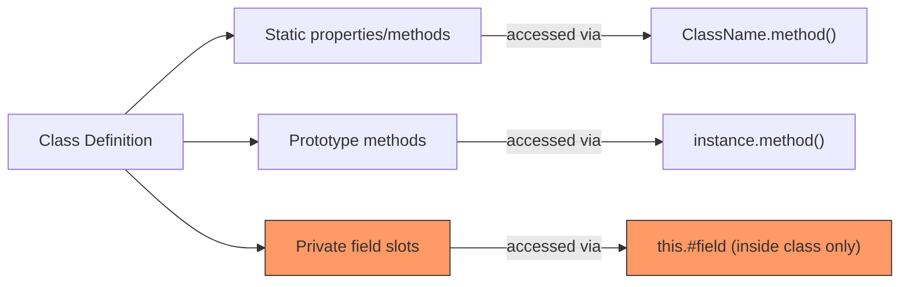
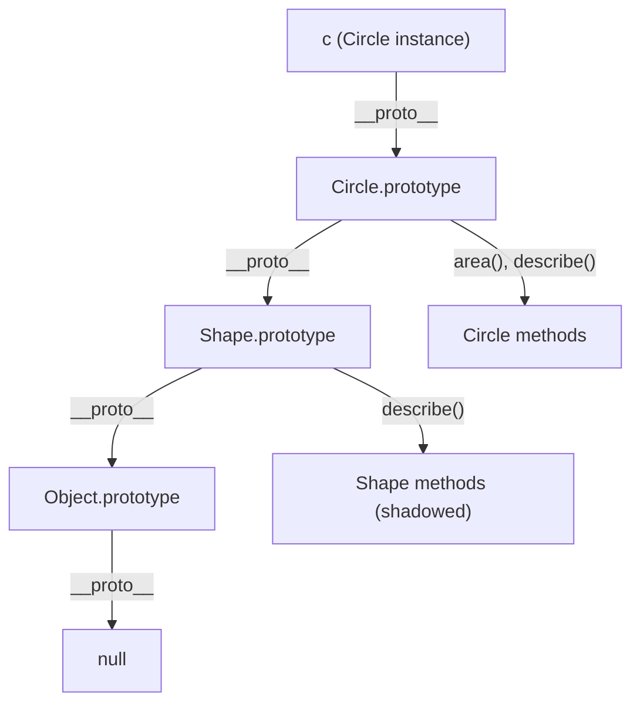
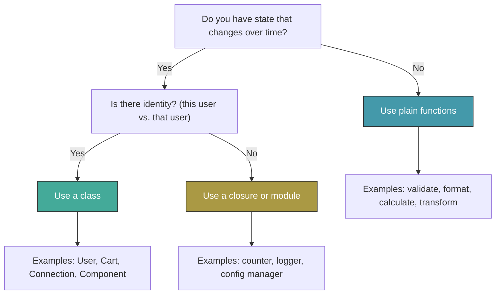

# Classes and Inheritance: Syntactic Sugar Over Prototypes

> Class syntax, private fields, static members, inheritance, and when to use classes vs functions.

---

## Table of Contents

- [1. Class Syntax](#1-class-syntax)
- [2. Private Fields and Static](#2-private-fields-and-static)
- [3. Inheritance](#3-inheritance)
- [4. When to Use Classes vs Functions](#4-when-to-use-classes-vs-functions)

---

## 1. Class Syntax

Before ES2015, creating objects with shared behavior meant wiring up constructor functions and prototype chains by hand. It worked, but it was ugly enough to scare newcomers away. The `class` keyword does not introduce a new object model -- JavaScript is still prototype-based under the hood. What it gives you is a cleaner, less error-prone way to express the same ideas.

Think of a class as a **blueprint for stamping out objects**. A factory has a blueprint on the wall; every widget that rolls off the line has the same shape, but each one carries its own serial number.

```js
class User {
  constructor(name, email) {
    // Instance properties -- unique to each object
    this.name = name;
    this.email = email;
    this.createdAt = new Date();
  }

  // Method -- shared via prototype, NOT copied onto each instance
  greet() {
    return `Hi, I'm ${this.name}`;
  }

  // Computed property name -- yes, this works
  [Symbol.toPrimitive](hint) {
    return hint === "string" ? this.name : null;
  }
}

const alice = new User("Alice", "alice@example.com");
console.log(alice.greet()); // "Hi, I'm Alice"
```

A few things to notice immediately:

**`constructor` is special.** It runs once when you call `new User(...)`. If you do not define one, JavaScript inserts an empty constructor for you. You cannot have two constructors -- that is a syntax error.

**Methods live on the prototype.** `alice.greet === User.prototype.greet` evaluates to `true`. This means a thousand `User` instances share a single `greet` function in memory, just like the old prototype pattern.

**No commas between members.** Unlike object literals, class bodies use no commas or semicolons between methods. Adding one is a syntax error. This trips people up constantly.

Let's see what the engine actually creates:

```mermaid
graph TD
    A["new User('Alice', ...)"] -->|creates| B["alice instance"]
    B -->|__proto__| C["User.prototype"]
    C -->|greet()| D["shared method"]
    C -->|constructor| E["User function"]
    E -->|prototype| C
```

> **Gotcha:** Classes are NOT hoisted the way function declarations are. A `function` declaration is available from the top of its scope; a `class` declaration throws a `ReferenceError` if you try to use it before the declaration line. This is because classes enter the Temporal Dead Zone, just like `let` and `const`.

```js
// This WORKS -- function declarations hoist
const u = new OldUser("Bob");
function OldUser(name) {
  this.name = name;
}

// This THROWS -- class declarations do NOT hoist
const v = new NewUser("Bob"); // ReferenceError!
class NewUser {
  constructor(name) {
    this.name = name;
  }
}
```

You can also write **class expressions**, which behave like function expressions:

```js
const Animal = class {
  constructor(species) {
    this.species = species;
  }
};
```

One more important detail: **class bodies run in strict mode automatically**. You do not need `"use strict"` at the top. This means sloppy-mode footguns -- like accidentally creating global variables by assigning to an undeclared name -- are caught as errors inside any class method.

The takeaway: `class` is not magic. It is a disciplined wrapper around the same prototype mechanics JavaScript has always used. If you can read prototypes, you can read classes. If you prefer classes, you still need to understand prototypes, because that is what the engine is actually doing.

---

## 2. Private Fields and Static

For years, JavaScript developers prefixed properties with an underscore (`_password`) and pretended that meant "private." Everyone could still access `user._password` -- it was a gentleman's agreement, not a lock on the door. ES2022 changed that with **true private fields** using the `#` prefix.

### Private Fields

```js
class BankAccount {
  // Declared at the top of the class body
  #balance;
  #owner;

  constructor(owner, initialDeposit) {
    this.#owner = owner;
    this.#balance = initialDeposit;
  }

  deposit(amount) {
    if (amount <= 0) throw new RangeError("Deposit must be positive");
    this.#balance += amount;
    return this.#balance;
  }

  get balance() {
    return this.#balance;
  }
}

const acct = new BankAccount("Alice", 100);
acct.deposit(50);
console.log(acct.balance);   // 150  (via the getter)
console.log(acct.#balance);  // SyntaxError! Truly private.
```

This is not a convention. The engine enforces it. Code outside the class body physically cannot reference `#balance` -- it is a syntax error at parse time, not a runtime check you can trick with `Object.getOwnPropertyNames()` or a `Proxy`. Private means private.

> **Gotcha:** Private fields must be **declared** in the class body before use. You cannot dynamically add `this.#newField` in a method if you did not declare `#newField` at the top. This is a deliberate design choice -- the engine needs to know the shape of every private field at class definition time.

You can also have **private methods**:

```js
class Validator {
  #rules = [];

  addRule(fn) {
    this.#rules.push(fn);
  }

  validate(value) {
    return this.#runAllRules(value);
  }

  #runAllRules(value) {
    return this.#rules.every((rule) => rule(value));
  }
}
```

### Static Members

A **static** method or property belongs to the class itself, not to instances. You call it on the constructor, not on objects.

```js
class MathUtils {
  static PI = 3.14159265;

  static clamp(value, min, max) {
    return Math.min(Math.max(value, min), max);
  }
}

console.log(MathUtils.PI);            // 3.14159265
console.log(MathUtils.clamp(15, 0, 10)); // 10

const m = new MathUtils();
console.log(m.clamp);  // undefined -- static lives on the class, not instances
```

Static members are useful for factory methods, configuration, and utility functions that relate to the class conceptually but do not need instance data.

### Static Blocks

ES2022 also introduced **static initialization blocks**, which run once when the class is evaluated. They are perfect for complex one-time setup:

```js
class Config {
  static defaults;

  static {
    // This runs once, at class definition time
    Config.defaults = Object.freeze({
      theme: "dark",
      language: "en",
      maxRetries: 3,
    });
  }
}
```

Here is how all these pieces relate:



> **Gotcha:** Static private fields exist too -- `static #count = 0;`. They are private to the class body and inaccessible from outside, including from subclasses. This is useful for things like instance counters or singleton patterns, but be aware that subclasses cannot read or modify a parent's static private fields.

The combination of private fields, static members, and static blocks finally gives JavaScript classes the encapsulation tools that developers from other languages expected. Use them. The underscore convention had its day; real privacy is better.

---

## 3. Inheritance

Inheritance lets one class **extend** another, reusing its structure and behavior while adding or overriding pieces. JavaScript implements this through prototype chains -- `extends` simply wires up the chain for you.

```js
class Shape {
  constructor(color) {
    this.color = color;
  }

  describe() {
    return `A ${this.color} shape`;
  }
}

class Circle extends Shape {
  constructor(color, radius) {
    super(color); // MUST call super() before using "this"
    this.radius = radius;
  }

  area() {
    return Math.PI * this.radius ** 2;
  }

  // Override parent method
  describe() {
    return `A ${this.color} circle with radius ${this.radius}`;
  }
}

const c = new Circle("red", 5);
console.log(c.describe()); // "A red circle with radius 5"
console.log(c.area());     // 78.539...
console.log(c instanceof Circle); // true
console.log(c instanceof Shape);  // true
```

The prototype chain looks like this:



### The `super` Keyword

`super` does two things depending on context:

- **In the constructor:** `super(...)` calls the parent constructor. You **must** call it before touching `this` in a derived class. Forgetting triggers a `ReferenceError`.
- **In methods:** `super.methodName()` calls the parent's version of that method.

```js
class Square extends Shape {
  constructor(color, side) {
    super(color);
    this.side = side;
  }

  describe() {
    // Extend rather than fully replace the parent behavior
    const base = super.describe();
    return `${base} (square, side=${this.side})`;
  }
}

const s = new Square("blue", 4);
console.log(s.describe());
// "A blue shape (square, side=4)"
```

### Why Deep Hierarchies Hurt

Inheritance is powerful in small doses, but class hierarchies deeper than two or three levels become brittle. The classic problem:

```
Animal → Pet → Dog → GuideDog → RetiredGuideDog
```

Every change to `Animal` ripples through four child classes. Adding a new behavior means deciding which level of the hierarchy owns it. If `GuideDog` needs behavior from both `Pet` and `ServiceAnimal`, you are stuck -- JavaScript has single inheritance.

This is where **composition** wins:

```js
// Instead of deep inheritance, compose behaviors
const withLogging = (base) => class extends base {
  log(message) {
    console.log(`[${new Date().toISOString()}] ${message}`);
  }
};

const withValidation = (base) => class extends base {
  validate(value, rules) {
    return rules.every((rule) => rule(value));
  }
};

// Mix behaviors together (mixin pattern)
class Service extends withLogging(withValidation(Object)) {
  process(data) {
    this.log("Processing started");
    if (!this.validate(data, [Boolean])) {
      throw new Error("Invalid data");
    }
    return data;
  }
}
```

> **Gotcha:** The mixin pattern shown above works but has limits. Each mixin creates an intermediate class in the prototype chain, so performance-sensitive hot paths might feel the impact. For complex composition, consider plain object composition -- storing collaborator objects as properties rather than merging class hierarchies.

**The rule of thumb:** Use inheritance when there is a genuine "is-a" relationship (a `Circle` **is a** `Shape`). Use composition when there is a "has-a" or "can-do" relationship (a `Service` **has** logging capability). When in doubt, compose.

---

## 4. When to Use Classes vs Functions

JavaScript gives you two powerful ways to organize code: classes and plain functions (including closures, factory functions, and modules). Neither is universally better. The choice depends on what you are modeling.

### Classes Shine for Entities

An **entity** is something with identity, state that changes over time, and behavior tied to that state. Think of users, shopping carts, database connections, UI components, game characters.

```js
class ShoppingCart {
  #items = [];

  addItem(product, quantity) {
    const existing = this.#items.find((i) => i.product.id === product.id);
    if (existing) {
      existing.quantity += quantity;
    } else {
      this.#items.push({ product, quantity });
    }
  }

  get total() {
    return this.#items.reduce(
      (sum, item) => sum + item.product.price * item.quantity,
      0
    );
  }

  get itemCount() {
    return this.#items.reduce((sum, item) => sum + item.quantity, 0);
  }
}
```

Classes are the right tool here because the cart is a **thing** -- it has identity (this cart vs. that cart), mutable state (items), and methods that operate on that state.

### Functions Shine for Logic

**Logic** is about transformation: data goes in, results come out. Validation, formatting, calculation, data transformation -- these are naturally expressed as functions.

```js
// Pure functions -- no state, no side effects, easy to test
const formatCurrency = (cents) =>
  `$${(cents / 100).toFixed(2)}`;

const applyDiscount = (price, percent) =>
  Math.round(price * (1 - percent / 100));

const validateEmail = (email) =>
  /^[^\s@]+@[^\s@]+\.[^\s@]+$/.test(email);

// Compose them freely
const formatDiscountedPrice = (price, discount) =>
  formatCurrency(applyDiscount(price, discount));
```

No class needed. No `this`. No `new`. Each function is independently testable, composable, and can be tree-shaken by bundlers.

### Decision Framework



### Factory Functions: The Middle Ground

Sometimes you want encapsulated state without full class ceremony. Factory functions with closures give you that:

```js
function createCounter(initial = 0) {
  let count = initial; // truly private via closure

  return {
    increment: () => ++count,
    decrement: () => --count,
    value: () => count,
  };
}

const counter = createCounter(10);
counter.increment();
console.log(counter.value()); // 11
// No way to access "count" directly
```

This achieves privacy without `#` syntax, does not need `new`, and the returned object is a plain object -- no prototype chain to worry about. The tradeoff: each instance gets its own copy of every function (no shared prototype), and you cannot use `instanceof`.

### Practical Guidelines

| Scenario | Recommendation |
| --- | --- |
| Domain entities (User, Order, Product) | Class |
| Utility/helper functions | Plain functions |
| React components | Functions (hooks) |
| State machines, services | Class or closure |
| One-off configuration | Module/closure |
| API clients with multiple methods | Class |
| Pure data transformations | Functions |
| Need `instanceof` checks | Class |

> **Opinionated take:** Modern JavaScript leans heavily toward functions. React moved from classes to hooks. Node.js middleware is functions. Most npm libraries export functions. Use classes when they genuinely clarify your code -- entities with state and behavior -- but resist the urge to class-ify everything. A 200-line class with one method is just a function wearing a suit.

The best codebases use both. Classes model the nouns (things in your system), functions model the verbs (what those things do to data). Knowing which tool fits which problem is the real skill.