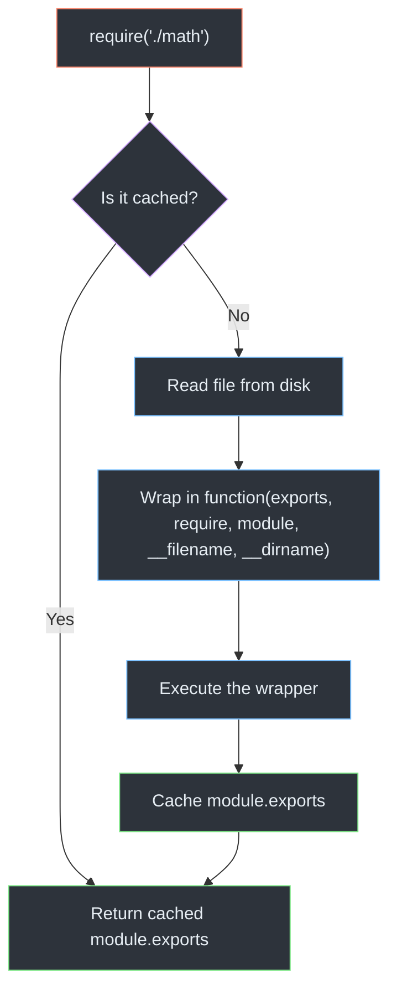
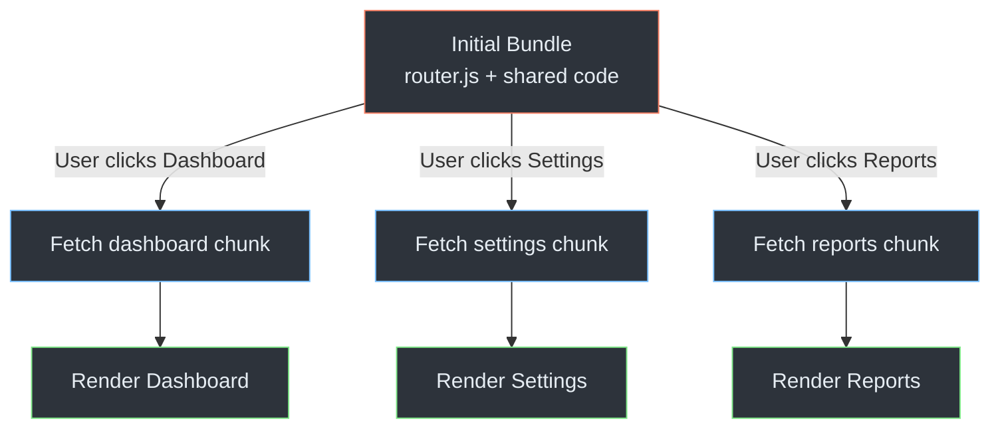
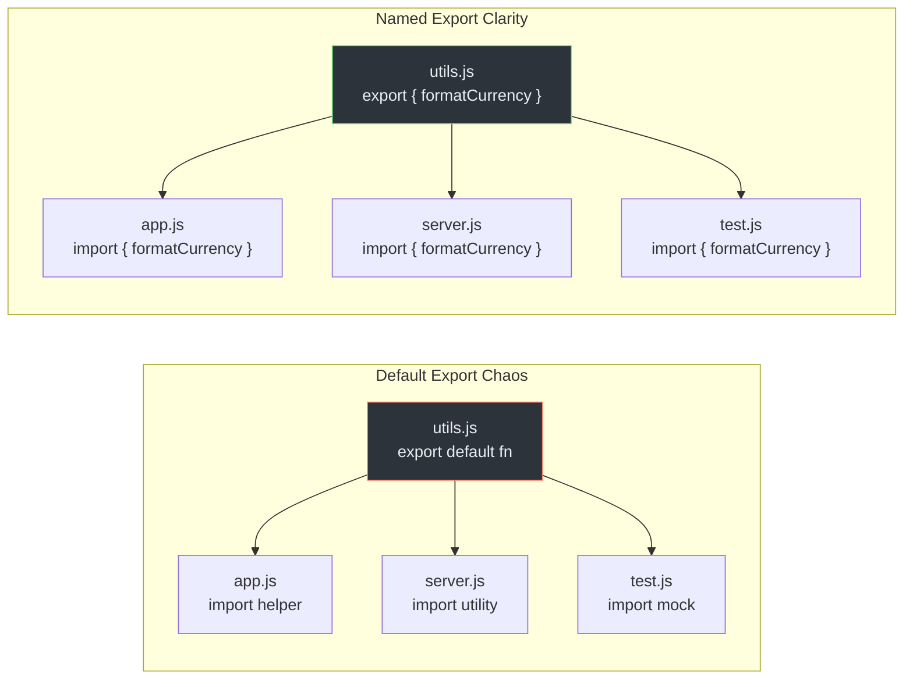
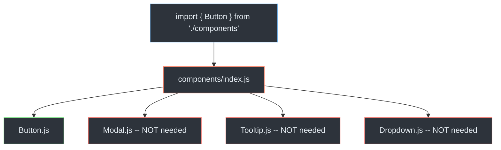
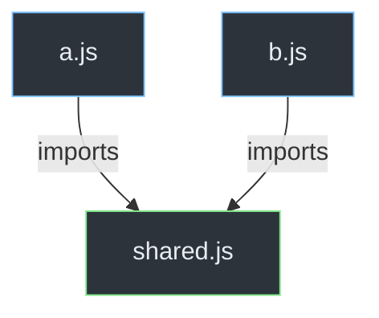

# Modules: Organizing Code for Humans and Machines

> ES Modules, CommonJS, dynamic imports, and module patterns.

---

## Table of Contents

- [1. ES Modules](#1-es-modules)
- [2. CommonJS](#2-commonjs)
- [3. Dynamic Imports](#3-dynamic-imports)
- [4. Module Patterns](#4-module-patterns)

---

## 1. ES Modules

Before modules, every JavaScript file dumped its variables into one shared global scope. Imagine an office where every employee throws their papers onto one enormous desk. You cannot find anything, names collide, and someone inevitably overwrites someone else's work. Modules give each file its own desk. You choose exactly what to share by sliding it through a window, and you choose exactly what to receive.

ES Modules (ESM) are the official module system baked into the JavaScript language since ES2015. They are **static**, meaning the structure of imports and exports is fixed at parse time, not at runtime. This single property unlocks nearly every advantage ESM has over older systems.

### Named Exports and Imports

```js
// math.js
export const PI = 3.141592653589793;

export function circleArea(radius) {
  return PI * radius ** 2;
}

export function circumference(radius) {
  return 2 * PI * radius;
}
```

```js
// app.js
import { circleArea, circumference } from './math.js';

console.log(circleArea(5));      // 78.539...
console.log(circumference(5));   // 31.415...
```

You name what you export. You name what you import. There is no ambiguity. If you rename something, your editor can find every import site and update it. This is the foundation of reliable refactoring.

### Default Exports

```js
// logger.js
export default function log(message) {
  console.log(`[${new Date().toISOString()}] ${message}`);
}
```

```js
// app.js
import log from './logger.js';
log('Application started');
```

A module can have at most **one** default export. The importer picks any name they want, which sounds convenient but is actually a trap. We will revisit this in Section 4.

### Renaming on Import

```js
import { circleArea as area } from './math.js';
```

Useful when two modules export functions with the same name. Prefer it over default exports because the original name is still visible in the import statement.

### The Namespace Import

```js
import * as MathUtils from './math.js';
console.log(MathUtils.PI);
```

This grabs everything into a single object. Handy for exploration, but it defeats tree-shaking if you only needed one function.

### Why Static Structure Matters: Tree-Shaking

Because ESM imports and exports are determined at parse time, a bundler can trace exactly which exports are used and which are dead code. This process is called **tree-shaking**.


In this example, the bundler sees that `app.js` only imports `circleArea`. It can safely exclude `PI` and `circumference` from the final bundle. With CommonJS, this analysis is impossible because require calls can happen inside `if` blocks, loops, or even be computed from strings.

### Strict Mode by Default

Every ES module runs in strict mode automatically. You never need to write `"use strict"` at the top. This means:

- Assigning to an undeclared variable throws an error instead of creating a global.
- Duplicate parameter names are forbidden.
- `this` at the top level is `undefined`, not `window`.

This last point catches people off guard. If you move code from a script tag into a module, any reference to `this` at the top level silently becomes `undefined`.

### Top-Level Await

In an ES module, you can use `await` at the top level without wrapping it in an async function:

```js
// config.js
const response = await fetch('/api/config');
export const config = await response.json();
```

```js
// app.js
import { config } from './config.js';
// config is fully resolved here -- the import waits
console.log(config.apiUrl);
```

Any module that imports `config.js` will wait for the fetch to complete before it executes. This is powerful but dangerous. A slow network request in a top-level await blocks every module that depends on it. Use it for initialization that genuinely must complete before anything else runs, not as a convenience to avoid writing an init function.

> **Gotcha:** Top-level await turns your module into an async module. If a synchronous CommonJS module tries to require it, it will fail. This is one of many interop headaches between the two systems.

### Using ESM in Practice

In the browser, add `type="module"` to your script tag:

```html
<script type="module" src="app.js"></script>
```

In Node.js, either name your file `.mjs` or set `"type": "module"` in your `package.json`. The second approach is almost always what you want for a project, because renaming every file is tedious and confusing.

---

## 2. CommonJS

CommonJS (CJS) is the module system that Node.js adopted in 2009, years before ES Modules existed. It solved the same problem -- isolating code into files with explicit interfaces -- but it did so with a fundamentally different philosophy. Where ESM is static and declarative, CommonJS is dynamic and imperative. Understanding both is not optional. You will encounter CJS in virtually every Node.js project created before 2020, in most npm packages, and in tooling configuration files that still require it today.

### The Basics: require and module.exports

```js
// math.js
const PI = 3.141592653589793;

function circleArea(radius) {
  return PI * radius ** 2;
}

function circumference(radius) {
  return 2 * PI * radius;
}

module.exports = { circleArea, circumference };
```

```js
// app.js
const { circleArea } = require('./math');

console.log(circleArea(5)); // 78.539...
```

`require` is a function. It reads a file, executes it, and returns whatever that file assigned to `module.exports`. That is the entire mental model.

### How require Actually Works



Node wraps your code in a function. That is why `__dirname` and `__filename` exist -- they are parameters injected by the wrapper, not magic globals. Once a module is loaded, it is cached. Calling `require('./math')` a second time returns the exact same object from memory. It does not re-execute the file.

### Dynamic by Nature

Because `require` is just a function, you can call it anywhere:

```js
if (process.env.NODE_ENV === 'test') {
  const mocks = require('./test-mocks');
  // use mocks
}
```

This flexibility is why tree-shaking does not work with CommonJS. A bundler cannot know at build time whether that `if` branch will execute. It must include `test-mocks.js` in the bundle just in case.

### exports vs module.exports

This is the single most confusing thing about CommonJS. Node passes a shortcut variable called `exports` into your module, which initially points to the same object as `module.exports`:

```js
// These two are equivalent:
exports.hello = function() { return 'hi'; };
module.exports.hello = function() { return 'hi'; };
```

But if you reassign `exports` directly, you break the reference:

```js
// BROKEN -- this does NOT export anything
exports = { hello: function() { return 'hi'; } };
```

```js
// WORKS -- this replaces the entire export
module.exports = { hello: function() { return 'hi'; } };
```

> **Gotcha:** If you need to export a single function, a class, or replace the export object entirely, you must use `module.exports =`. The `exports` shorthand only works for attaching properties to the existing object.

**The rule:** Always use `module.exports` when you are exporting the whole thing. Use `exports.name` only when attaching individual properties. Better yet, just always use `module.exports` and never think about it again.

### Synchronous Loading

CJS loads files synchronously. In Node.js on a server, this is fine -- files are on the local disk and load in microseconds. In a browser, synchronous loading would freeze the page while waiting for a network request. This is the core reason why CommonJS was never adopted by browsers and why ESM was designed differently.

### The Interop Problem

Here is where things get painful. The JavaScript ecosystem is split. Some packages are ESM-only. Some are CJS-only. Many ship both. When you mix them, strange things happen.

```js
// From an ESM file, importing a CJS module usually works:
import lodash from 'lodash'; // CJS default becomes the ESM default

// From a CJS file, importing an ESM module does NOT work:
const utils = require('./utils.mjs'); // Error!
// You must use dynamic import() instead:
const utils = await import('./utils.mjs');
```

The asymmetry exists because CJS is synchronous and ESM is asynchronous. You can downgrade async to sync (ESM importing CJS), but you cannot upgrade sync to async without changing the calling code.

Node.js has improved interop over the years, but you will still hit edge cases. When a CJS module does `module.exports = function() {}`, ESM sees it as a default export. When a CJS module does `exports.foo = ...` and `exports.bar = ...`, ESM *might* detect named exports via static analysis, or it might shove everything under `default`. The behavior depends on your Node version and the package's structure.

> **Opinion:** If you are starting a new project in 2026, use ESM. Set `"type": "module"` in your `package.json` and do not look back. The only reason to write CJS today is if you are maintaining a legacy codebase or writing a configuration file that specifically requires it (like older versions of Jest or Webpack configs).

---

## 3. Dynamic Imports

Static imports are resolved before your code runs. Every imported module is fetched, parsed, and executed upfront. For a small application, this is ideal -- everything is ready the moment your first line of code executes. For a large application, it is a disaster. You are forcing the user to download and parse your entire codebase before they can see a single pixel on the screen.

Dynamic `import()` solves this. It is a function-like syntax (technically not a function, but a syntactic form) that returns a Promise resolving to the module's namespace object. It lets you load code on demand, splitting your application into chunks that are fetched only when needed.

### The Syntax

```js
// Static import -- runs at parse time
import { circleArea } from './math.js';

// Dynamic import -- runs at execution time, returns a Promise
const mathModule = await import('./math.js');
console.log(mathModule.circleArea(5));
```

### Code Splitting in Practice

The most common use case is loading a feature only when the user navigates to it:

```js
// router.js
async function navigate(path) {
  switch (path) {
    case '/dashboard':
      const { Dashboard } = await import('./pages/dashboard.js');
      return new Dashboard();

    case '/settings':
      const { Settings } = await import('./pages/settings.js');
      return new Settings();

    case '/reports':
      const { Reports } = await import('./pages/reports.js');
      return new Reports();

    default:
      const { NotFound } = await import('./pages/not-found.js');
      return new NotFound();
  }
}
```



The initial bundle only contains the router and shared utilities. Each page is a separate chunk loaded on first navigation. Subsequent visits to the same page hit the cache.

### Conditional Loading

Unlike static imports, dynamic imports can live inside conditions, loops, and try/catch blocks:

```js
async function loadAnalytics() {
  if (userConsentsToTracking()) {
    const { init } = await import('./analytics.js');
    init();
  }
  // If the user doesn't consent, analytics.js is never downloaded
}
```

This is genuinely useful. You avoid shipping analytics code to users who will never execute it. The same pattern works for polyfills:

```js
if (!('IntersectionObserver' in window)) {
  await import('./polyfills/intersection-observer.js');
}
```

### Handling Default Exports

When the dynamically imported module uses a default export, you access it through the `.default` property:

```js
// logger.js
export default function log(msg) {
  console.log(msg);
}

// app.js
const loggerModule = await import('./logger.js');
loggerModule.default('Hello'); // note the .default

// Or destructure it:
const { default: log } = await import('./logger.js');
log('Hello');
```

This is awkward. It is another reason to prefer named exports.

### Error Handling

Network requests fail. Dynamic imports are network requests (in the browser). Always handle the failure:

```js
async function loadEditor() {
  try {
    const { Editor } = await import('./heavy-editor.js');
    return new Editor();
  } catch (error) {
    console.error('Failed to load editor:', error);
    // Show a fallback UI or retry
    return new PlainTextFallback();
  }
}
```

> **Gotcha:** Bundlers like Webpack and Rollup analyze `import()` calls at build time to create chunks. If you compute the module path dynamically from a variable, the bundler cannot determine which files to include. This either breaks the build or forces the bundler to include every possible file in that directory.

```js
// Bundler can analyze this -- static string
const mod = await import('./locales/en.js');

// Bundler CANNOT analyze this -- fully dynamic
const mod = await import(someVariable);

// Bundler can partially analyze this -- known directory, variable filename
const mod = await import(`./locales/${lang}.js`);
// Webpack bundles ALL files in ./locales/ into one chunk
```

Keep your dynamic import paths as static as possible. Use template literals with a fixed prefix and a single variable at most.

### When to Use Dynamic Imports

Use them for:
- **Route-based code splitting** -- load page components on navigation.
- **Feature gating** -- load premium features only for paying users.
- **Heavy libraries** -- load a charting library only when the user opens a chart.
- **Conditional polyfills** -- load shims only for browsers that need them.

Do not use them for small utility modules. The overhead of a network request and an additional chunk outweighs any savings for a module that is only a few kilobytes.

---

## 4. Module Patterns

Knowing the syntax of import and export is the easy part. Knowing how to structure your modules so that a codebase stays navigable at 10,000 files is the hard part. This section covers the patterns and anti-patterns that emerge in real projects.

### Named Exports Over Default Exports

This is the hill I will die on. Default exports are a mistake in nearly every codebase.

```js
// default export -- what is this called?
import whatever from './utils.js';

// named export -- you know exactly what you're getting
import { formatCurrency } from './utils.js';
```

With default exports:
- Every file can import the same thing under a different name, making it impossible to search the codebase for all usages.
- Your editor cannot auto-complete the import because it does not know the name until you type it.
- Refactoring the exported name does not propagate to importers because they chose their own name.

With named exports:
- There is one canonical name. Search for it and you find every usage.
- Your editor can auto-import it by name.
- Renaming the export is a mechanical, tool-assisted refactor.



> **The one exception:** If a module represents a single concept and has only one export (like a React component per file), a default export is tolerable. But even then, named exports work just as well and give you the refactoring benefits.

### Barrel Exports

A barrel is an `index.js` file that re-exports from multiple modules, creating a single entry point for a feature:

```js
// components/index.js  (the barrel)
export { Button } from './Button.js';
export { Modal } from './Modal.js';
export { Tooltip } from './Tooltip.js';
export { Dropdown } from './Dropdown.js';
```

```js
// consumer.js
import { Button, Modal } from './components/index.js';
```

This is convenient. One import path gives you access to everything in the `components` directory. But barrels come with a cost.

### The Barrel Problem



When you import `Button` from the barrel, the module system must evaluate `index.js`, which imports *all four* modules. If those modules have side effects or import heavy dependencies, you pay for all of them even though you only wanted `Button`. Tree-shaking can mitigate this in production bundled builds, but in development and in test environments, barrels cause noticeable slowdowns.

**The rule:** Use barrels at **package boundaries** (the public API of a library or a feature), not at every directory level. Within a feature, import directly from the source file. At the boundary of the feature, expose a curated barrel for external consumers.

```js
// Internal code within the feature -- direct imports
import { validate } from './validators/email.js';

// External code from another feature -- uses the barrel
import { EmailValidator } from '../email-feature/index.js';
```

### One Concept Per Module

A module should have a single reason to change. If you find yourself exporting a date formatter, a currency formatter, and a URL parser from the same `utils.js`, split them:

```
utils/
  formatDate.js
  formatCurrency.js
  parseUrl.js
  index.js        <-- barrel for convenience
```

Small, focused modules are easier to test, easier to replace, and easier to tree-shake.

### Avoiding Circular Dependencies

Circular dependencies happen when Module A imports Module B and Module B imports Module A. Both ESM and CJS handle this without crashing, but the behavior is confusing.

```js
// a.js
import { b } from './b.js';
export const a = 'A sees ' + b;

// b.js
import { a } from './a.js';
export const b = 'B sees ' + a;
```

One of them will see `undefined` because the other has not finished initializing yet. The fix is not to learn the exact evaluation order. The fix is to restructure your code so the cycle does not exist. Extract the shared dependency into a third module that both can import.



### The Facade Pattern

For libraries or larger features, expose a facade module that presents a clean, intentional API while hiding the messy internals:

```js
// payment/index.js -- the facade
export { processPayment } from './processor.js';
export { formatReceipt } from './receipt.js';
export { PaymentError } from './errors.js';

// Everything else in payment/ is an implementation detail.
// Internal modules can change freely without breaking consumers.
```

This is a barrel, but with intention. You are not re-exporting everything. You are curating a public surface area. Anything not exported through the facade is private by convention.

> **Final thought:** Modules are not just a JavaScript feature. They are an architecture tool. The way you draw boundaries between modules determines how understandable your codebase is, how fast your builds run, and how confidently you can change code without breaking something on the other side of the project. Get the syntax right, yes -- but spend more time thinking about where the boundaries should be.