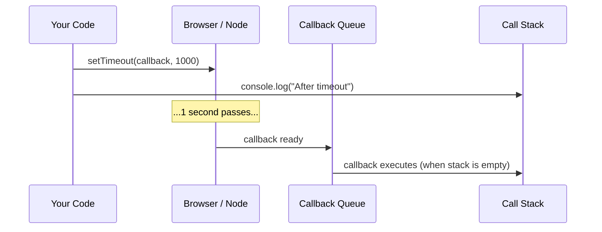
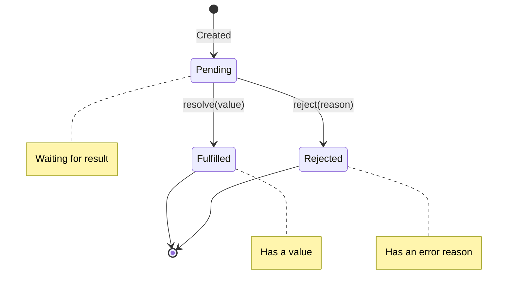
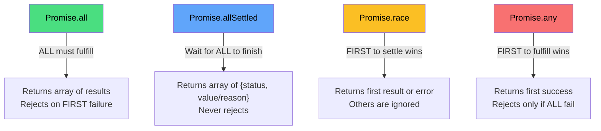
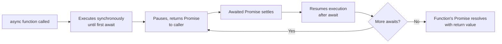
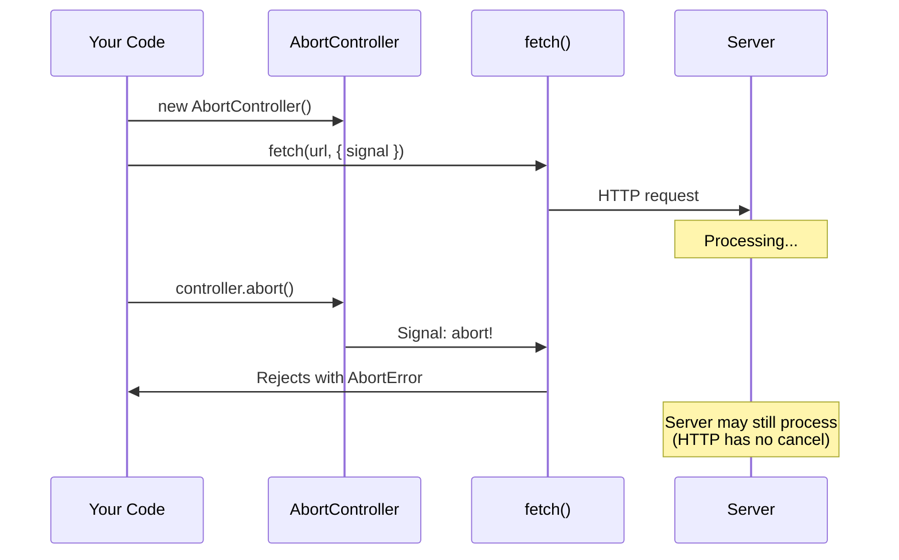

# Asynchronous JavaScript: Callbacks, Promises, and Async/Await

> The hardest concept after this — from callback hell to elegant async flows.

---

## Table of Contents

- [1. Callbacks](#1-callbacks)
- [2. Promises](#2-promises)
- [3. Promise Combinators](#3-promise-combinators)
- [4. Async Await](#4-async-await)
- [5. Parallel vs Serial](#5-parallel-vs-serial)
- [6. Cancellation](#6-cancellation)

---

## 1. Callbacks

JavaScript is single-threaded. It has one call stack, one thread of execution, one thing happening at a time. And yet the web is full of things that take time: network requests, file reads, timers, user interactions. So how does JavaScript handle waiting without freezing everything?

The answer: **it does not wait at all**. It delegates the slow work to the browser (or Node.js runtime), keeps executing the next line of code, and says "call me back when you are done." That "call me back" function is a **callback**.

```js
console.log("1: Before timeout");

setTimeout(() => {
  console.log("2: Inside timeout");
}, 1000);

console.log("3: After timeout");

// Output:
// 1: Before timeout
// 3: After timeout
// 2: Inside timeout  (after ~1 second)
```

This is the fundamental model. `setTimeout` does not pause your program. It schedules a callback and moves on immediately. The callback runs later, when the timer expires and the call stack is empty.



This works fine for one asynchronous operation. The problem starts when you need to chain them — do thing A, then when A finishes do thing B, then when B finishes do thing C:

```js
// "Callback Hell" — aka the Pyramid of Doom
getUser(userId, (err, user) => {
  if (err) {
    handleError(err);
    return;
  }
  getOrders(user.id, (err, orders) => {
    if (err) {
      handleError(err);
      return;
    }
    getOrderDetails(orders[0].id, (err, details) => {
      if (err) {
        handleError(err);
        return;
      }
      renderPage(user, orders, details);
    });
  });
});
```

Notice the pattern: every level nests deeper, every level repeats the same `if (err)` check, and the logic spirals rightward into unreadable territory. This is **callback hell**, and it has three real problems beyond aesthetics:

1. **Error handling is manual and repetitive.** You have to check for errors at every single level. Forget one check and an error silently disappears.
2. **Control flow is invisible.** Try adding a "retry on failure" or "timeout after 5 seconds" to that nested structure. It becomes spaghetti fast.
3. **Composition is impossible.** You cannot easily say "run these three callbacks in parallel and continue when all finish."

> **The Node.js convention:** Callbacks in Node follow the pattern `(error, result)` — error-first. If `error` is `null`, the operation succeeded. This convention is so universal that it has a name: **errbacks**. But convention is not enforcement. Nothing stops someone from calling the callback twice, or not at all, or forgetting the error parameter.

You can partially flatten callback hell by extracting named functions:

```js
function onUser(err, user) {
  if (err) return handleError(err);
  getOrders(user.id, onOrders);
}

function onOrders(err, orders) {
  if (err) return handleError(err);
  getOrderDetails(orders[0].id, onDetails);
}

function onDetails(err, details) {
  if (err) return handleError(err);
  renderPage(details);
}

getUser(userId, onUser);
```

This is more readable, but it scatters your logic across functions and still suffers from manual error handling. Callbacks were the only game in town for years. They powered jQuery's AJAX, Node.js's filesystem API, and early browser APIs. But the JavaScript community knew there had to be a better abstraction.

That abstraction arrived in ES2015 with a name that describes exactly what it does: a **Promise**.

---

## 2. Promises

A Promise is an object that represents a value you do not have yet but expect to receive in the future. Think of it like a restaurant pager. You order food, the restaurant hands you a buzzer. You do not have your food yet, but you have a *promise* that it will arrive. The buzzer will either buzz when the food is ready (fulfilled) or the waiter will come tell you they ran out of ingredients (rejected).

A Promise exists in exactly one of three states:



Once a Promise moves from **pending** to either **fulfilled** or **rejected**, it is **settled**. It can never change state again. A fulfilled Promise stays fulfilled forever with the same value. This immutability is what makes Promises trustworthy — unlike callbacks, which someone could invoke multiple times.

### Creating a Promise

```js
const promise = new Promise((resolve, reject) => {
  // This function runs immediately (it's the "executor")
  const data = doSomethingSync();

  if (data) {
    resolve(data);   // Transition to fulfilled
  } else {
    reject(new Error("No data found"));  // Transition to rejected
  }
});
```

The executor function receives two functions: `resolve` and `reject`. You call one or the other. Calling `resolve` after `reject` (or vice versa) does nothing — first call wins.

### Consuming a Promise: then, catch, finally

```js
fetch("/api/users/1")
  .then(response => response.json())    // fulfilled: transform the value
  .then(user => {
    console.log(user.name);
    return fetch(`/api/orders?userId=${user.id}`);
  })
  .then(response => response.json())
  .then(orders => console.log(orders))
  .catch(err => console.error("Something failed:", err))  // any rejection above
  .finally(() => hideLoadingSpinner());  // runs either way
```

This is the beauty of Promises: **chaining**. Each `.then()` returns a *new* Promise, so you can chain them flat instead of nesting. Compare this to the callback hell version — same logic, but readable top-to-bottom.

Key rules of `.then()`:

```js
// Rule 1: Return a value → next .then() receives it
Promise.resolve(1)
  .then(x => x + 1)    // returns 2
  .then(x => x * 3)    // receives 2, returns 6
  .then(x => console.log(x));  // 6

// Rule 2: Return a Promise → chain waits for it
Promise.resolve(1)
  .then(x => fetch("/api/data"))       // returns a Promise
  .then(response => response.json())   // waits for fetch, then runs

// Rule 3: Throw an error → jumps to nearest .catch()
Promise.resolve(1)
  .then(x => { throw new Error("boom"); })
  .then(x => console.log("skipped"))  // never runs
  .catch(err => console.log(err.message));  // "boom"
```

> **Gotcha: the forgotten return.** The single most common Promise bug is forgetting to `return` inside a `.then()`. If you call a function that returns a Promise but do not `return` it, the chain does not wait for it. The next `.then()` receives `undefined` and the inner Promise runs "detached" — its errors may go unhandled.

```js
// BUG: missing return
.then(user => {
  fetch(`/api/orders?userId=${user.id}`);  // not returned!
})
.then(response => {
  // response is undefined, not the fetch result
  response.json();  // TypeError!
})
```

> **Gotcha: `.catch()` placement matters.** A `.catch()` only handles rejections from the chain *above* it. If you place a `.then()` after a `.catch()`, and the `.catch()` does not re-throw, the chain continues as fulfilled.

```js
Promise.reject("fail")
  .catch(err => {
    console.log("Caught:", err);
    // implicitly returns undefined → next then runs normally
  })
  .then(() => console.log("This STILL runs"));
```

Promises solved callback hell. They gave us flat chains, a single error channel, and immutable state guarantees. But when you need to coordinate multiple async operations, you need something more — **combinators**.

---

## 3. Promise Combinators

So you have Promises. Now you need to juggle several of them at once. JavaScript gives you four built-in combinators for this, and each one answers a different question.



### Promise.all — "I need everything or nothing"

```js
const [users, products, config] = await Promise.all([
  fetch("/api/users").then(r => r.json()),
  fetch("/api/products").then(r => r.json()),
  fetch("/api/config").then(r => r.json()),
]);

// All three run in parallel
// If ANY one fails, the entire Promise.all rejects
```

`Promise.all` is the workhorse. Use it when you need multiple independent pieces of data and cannot proceed without all of them. It runs all Promises concurrently and resolves with an array of results in the same order you passed them.

**The critical behavior:** if any single Promise rejects, `Promise.all` rejects immediately with that error. The other Promises keep running in the background (you cannot cancel them from here), but their results are discarded. This is fail-fast behavior.

```js
// One failure kills everything
await Promise.all([
  Promise.resolve("ok"),
  Promise.reject("network down"),  // this fails
  Promise.resolve("also ok"),       // result discarded
]);
// Rejects with: "network down"
```

### Promise.allSettled — "Tell me what happened to each one"

```js
const results = await Promise.allSettled([
  fetch("/api/critical"),
  fetch("/api/optional"),
  fetch("/api/nice-to-have"),
]);

results.forEach(result => {
  if (result.status === "fulfilled") {
    console.log("Success:", result.value);
  } else {
    console.log("Failed:", result.reason);
  }
});
```

Unlike `Promise.all`, this combinator **never rejects**. It waits for every Promise to settle, then gives you an array of objects with `{ status: "fulfilled", value }` or `{ status: "rejected", reason }`. Use it when some failures are acceptable and you want to handle each result individually — batch API calls, sending notifications, loading optional widgets.

### Promise.race — "First to finish wins, period"

```js
// Timeout pattern: race the request against a timer
const result = await Promise.race([
  fetch("/api/slow-endpoint"),
  new Promise((_, reject) =>
    setTimeout(() => reject(new Error("Timeout")), 5000)
  ),
]);
```

`Promise.race` settles with the first Promise to settle, whether it fulfills or rejects. This is perfect for implementing timeouts. If the fetch finishes in 2 seconds, you get the response. If the timer fires first at 5 seconds, you get a rejection.

> **Gotcha:** "Race" means the first to settle — including the first to *reject*. If one of your Promises rejects instantly, `Promise.race` rejects instantly, even if another Promise was about to resolve successfully a millisecond later.

### Promise.any — "Give me the first success"

```js
// Try multiple CDN mirrors, use whichever responds first
const asset = await Promise.any([
  fetch("https://cdn1.example.com/bundle.js"),
  fetch("https://cdn2.example.com/bundle.js"),
  fetch("https://cdn3.example.com/bundle.js"),
]);
```

`Promise.any` resolves with the first Promise to **fulfill** — it ignores rejections unless they all reject. If every Promise fails, it throws an `AggregateError` containing all the individual errors. This is the optimistic version of `Promise.race`.

```js
// All fail → AggregateError
try {
  await Promise.any([
    Promise.reject("err1"),
    Promise.reject("err2"),
  ]);
} catch (err) {
  console.log(err instanceof AggregateError); // true
  console.log(err.errors); // ["err1", "err2"]
}
```

### Quick reference

| Combinator | Resolves when | Rejects when | Use case |
|---|---|---|---|
| `all` | All fulfill | Any rejects | Load all required data |
| `allSettled` | All settle | Never | Batch operations with partial failure |
| `race` | First settles | First settles (if rejection) | Timeouts, fastest mirror |
| `any` | First fulfills | All reject | Redundant sources, fallbacks |

Pick the combinator that matches your failure tolerance. `all` is strict. `allSettled` is comprehensive. `race` is impatient. `any` is optimistic.

---

## 4. Async Await

Promises solved callback hell. Async/await solves Promise-chain hell. It is syntactic sugar over Promises — nothing more, nothing less. Under the hood, every `async` function returns a Promise, and every `await` expression unwraps one. But the ergonomic difference is enormous.

```js
// Promise chain version
function loadDashboard(userId) {
  return fetch(`/api/users/${userId}`)
    .then(res => res.json())
    .then(user => fetch(`/api/orders?userId=${user.id}`))
    .then(res => res.json())
    .then(orders => ({ user, orders }))  // BUG: user is not in scope
    .catch(err => console.error(err));
}

// Async/await version
async function loadDashboard(userId) {
  try {
    const res = await fetch(`/api/users/${userId}`);
    const user = await res.json();

    const ordersRes = await fetch(`/api/orders?userId=${user.id}`);
    const orders = await ordersRes.json();

    return { user, orders };  // user is in scope — obviously
  } catch (err) {
    console.error(err);
  }
}
```

The async/await version reads top to bottom like synchronous code. Variables stay in scope naturally. Error handling uses the same `try/catch` you already know. There is no chain to break, no `.then()` to forget a `return` in.

### The rules

```js
// Rule 1: "async" makes a function return a Promise
async function greet() {
  return "hello";
}
greet().then(msg => console.log(msg)); // "hello"

// Rule 2: "await" pauses execution until the Promise settles
async function demo() {
  const result = await someAsyncOperation(); // pauses here
  console.log(result); // resumes here with the resolved value
}

// Rule 3: "await" on a rejected Promise throws
async function risky() {
  try {
    const data = await fetch("/api/broken"); // if this rejects...
  } catch (err) {
    console.log("Caught:", err);  // ...it lands here
  }
}

// Rule 4: "await" on a non-Promise just returns the value
const x = await 42; // x is 42, no Promise involved
```



### Error handling patterns

The `try/catch` approach works, but wrapping every function in try/catch gets verbose. Here are practical patterns:

```js
// Pattern 1: let it propagate (preferred for library code)
async function getUser(id) {
  const res = await fetch(`/api/users/${id}`);
  if (!res.ok) throw new Error(`HTTP ${res.status}`);
  return res.json();
}
// The CALLER decides how to handle the error

// Pattern 2: catch at the top level
async function main() {
  try {
    const user = await getUser(1);
    const orders = await getOrders(user.id);
    render(user, orders);
  } catch (err) {
    showErrorPage(err);
  }
}

// Pattern 3: per-operation catch when you need fallbacks
async function loadWithFallback() {
  const user = await getUser(1).catch(() => defaultUser);
  const orders = await getOrders(user.id).catch(() => []);
  render(user, orders);
}
```

> **Gotcha: forgetting to await.** If you call an async function without `await`, you get a Promise object, not the result. This is a silent bug because the code keeps running with a Promise where you expected data.

```js
async function bad() {
  const data = fetch("/api/data");  // forgot await!
  console.log(data);  // Promise {<pending>}  — not your data
}
```

> **Gotcha: await in loops.** Using `await` inside a `for` loop runs operations one by one (serial). This is sometimes intentional and sometimes a performance bug. If the operations are independent, use `Promise.all` instead. This matters enough that it deserves its own section.

---

## 5. Parallel vs Serial

This is where most developers lose performance without realizing it. The difference between parallel and serial async execution can be the difference between a 300ms page load and a 3-second one.

**Serial execution** means each operation waits for the previous one to complete:

```js
// SERIAL: each request waits for the last one — 3 seconds total
async function serial() {
  const users   = await fetch("/api/users");    // 1 second
  const orders  = await fetch("/api/orders");   // 1 second (starts AFTER users)
  const config  = await fetch("/api/config");   // 1 second (starts AFTER orders)
  return { users, orders, config };
}
```



```mermaid
gantt
    title Serial Execution (3 seconds total)
    dateFormat X
    axisFormat %s

    section Requests
    fetch users   :0, 1000
    fetch orders  :1000, 2000
    fetch config  :2000, 3000
```

**Parallel execution** starts all operations at once and waits for all to finish:

```js
// PARALLEL: all requests start at the same time — 1 second total
async function parallel() {
  const [users, orders, config] = await Promise.all([
    fetch("/api/users"),    // 1 second
    fetch("/api/orders"),   // 1 second (starts SIMULTANEOUSLY)
    fetch("/api/config"),   // 1 second (starts SIMULTANEOUSLY)
  ]);
  return { users, orders, config };
}
```



```mermaid
gantt
    title Parallel Execution (1 second total)
    dateFormat X
    axisFormat %s

    section Requests
    fetch users   :0, 1000
    fetch orders  :0, 1000
    fetch config  :0, 1000
```

The rule is simple: **if operation B does not depend on the result of operation A, they can run in parallel.** If B needs A's result, they must be serial.

```js
// MIXED: some serial (dependencies), some parallel (independent)
async function mixed() {
  // Step 1: Must get user first
  const user = await getUser(userId);

  // Step 2: Orders and preferences are independent of EACH OTHER
  //         but both depend on user — run them in parallel
  const [orders, preferences] = await Promise.all([
    getOrders(user.id),
    getPreferences(user.id),
  ]);

  return { user, orders, preferences };
}
```

### The subtle "already started" trap

There is a nuance that trips people up. A Promise starts executing the moment it is created, not when you `await` it:

```js
// This LOOKS serial but is actually parallel
async function sneakyParallel() {
  const p1 = fetch("/api/users");   // starts immediately
  const p2 = fetch("/api/orders");  // starts immediately

  const users  = await p1;  // waits for p1 to finish
  const orders = await p2;  // p2 may already be done by now
}
```

This works but `Promise.all` is better because it communicates intent clearly and fails fast if any request fails. With the pattern above, if `p1` rejects, you will never get to `await p2`, but `p2` is still running in the background with no error handling.

### When serial is correct

Do not blindly parallelize everything. Serial execution is the right choice when:

```js
// Correct serial: each step depends on the previous result
async function pipeline() {
  const token  = await authenticate();
  const user   = await getUser(token);        // needs token
  const orders = await getOrders(user.id);    // needs user.id
  return orders;
}

// Correct serial: rate limiting
async function gentleScraper(urls) {
  const results = [];
  for (const url of urls) {
    results.push(await fetch(url));  // intentionally one at a time
    await sleep(100);                // be polite to the server
  }
  return results;
}
```

> **Rule of thumb:** look at each `await` in your function. Ask: "Does this line need anything from the line above?" If the answer is no, those awaits should probably be wrapped in `Promise.all`.

---

## 6. Cancellation

Here is the dirty secret of Promises: **they have no built-in cancellation mechanism.** Once a Promise is created, it will run to completion. You cannot abort a `fetch` mid-flight, stop a timer early, or cancel a database query by rejecting a Promise.

This was a deliberate design choice. Promises represent a result, not the operation producing it. Cancellation is about the operation. So JavaScript provides a separate mechanism: **AbortController**.

```js
const controller = new AbortController();
const signal = controller.signal;

// Pass the signal to fetch
fetch("/api/large-dataset", { signal })
  .then(res => res.json())
  .then(data => console.log(data))
  .catch(err => {
    if (err.name === "AbortError") {
      console.log("Request was cancelled");
    } else {
      console.error("Real error:", err);
    }
  });

// Cancel it after 5 seconds
setTimeout(() => controller.abort(), 5000);
```



### Timeout pattern with AbortSignal.timeout

Modern JavaScript provides a cleaner timeout:

```js
// Built-in timeout — no manual AbortController needed
try {
  const res = await fetch("/api/slow", {
    signal: AbortSignal.timeout(5000),  // auto-aborts after 5 seconds
  });
  const data = await res.json();
} catch (err) {
  if (err.name === "TimeoutError") {
    console.log("Took too long");
  }
}
```

### Cancelling your own async operations

`AbortController` is not limited to `fetch`. You can wire it into any async operation:

```js
async function pollForStatus(taskId, signal) {
  while (true) {
    // Check if cancelled before each iteration
    signal.throwIfAborted();

    const res = await fetch(`/api/tasks/${taskId}`, { signal });
    const task = await res.json();

    if (task.status === "complete") return task;

    await new Promise(resolve => setTimeout(resolve, 2000));
  }
}

// Usage
const controller = new AbortController();

pollForStatus("abc123", controller.signal)
  .then(task => console.log("Done:", task))
  .catch(err => {
    if (err.name === "AbortError") console.log("Polling cancelled");
  });

// Cancel from a button click
cancelButton.addEventListener("click", () => controller.abort());
```

### Combining signals

When you need multiple reasons to cancel — a user action, a timeout, and a component unmount — you can combine signals:

```js
// Abort if EITHER the timeout fires OR the user cancels
const userController = new AbortController();

const combinedSignal = AbortSignal.any([
  AbortSignal.timeout(10000),       // 10 second timeout
  userController.signal,             // manual cancel
]);

fetch("/api/data", { signal: combinedSignal });
```

### Cleanup with signal event listeners

```js
async function expensiveOperation(signal) {
  const connection = await openDatabaseConnection();

  // Register cleanup if aborted
  signal.addEventListener("abort", () => {
    connection.close();
    console.log("Cleaned up database connection");
  }, { once: true });

  // Do work...
  const result = await connection.query("SELECT * FROM huge_table", { signal });
  connection.close();
  return result;
}
```

> **Gotcha: Abort does not stop the server.** `AbortController` cancels the request on the client side. The server may still be processing. If you need the server to stop, you need a separate cancellation protocol (like a cancel endpoint). This is not a JavaScript problem — it is a fundamental limitation of HTTP.

> **Gotcha: Reuse.** An `AbortController` can only be used once. After calling `.abort()`, the signal stays aborted permanently. If you need to cancel and restart, create a new controller.

```js
// WRONG: reusing an aborted controller
const controller = new AbortController();
controller.abort();
fetch("/api/data", { signal: controller.signal }); // Immediately aborts!

// RIGHT: create a new controller for each operation
let controller = new AbortController();
function restart() {
  controller.abort();                    // cancel the old one
  controller = new AbortController();    // create a fresh one
  fetch("/api/data", { signal: controller.signal });
}
```

Cancellation is the missing piece that turns Promises from a toy into a production tool. Without it, you get memory leaks from abandoned requests, stale data rendering over fresh data, and zombie operations consuming resources for results nobody wants. Always wire `AbortController` into any operation the user can navigate away from.