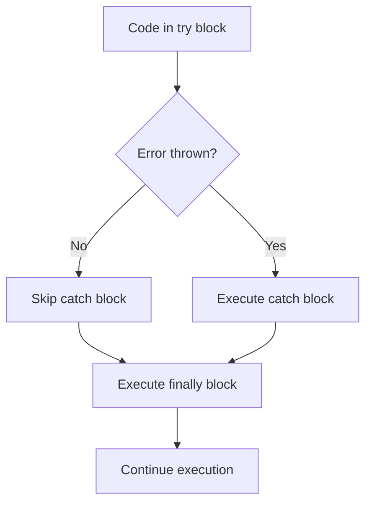
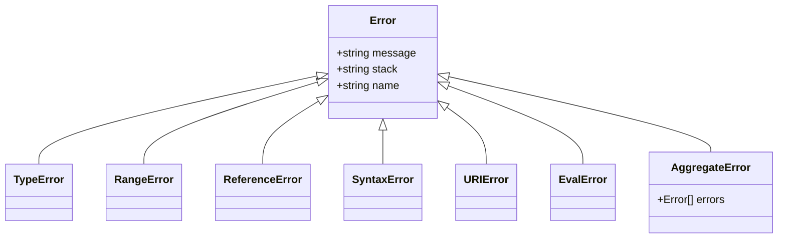
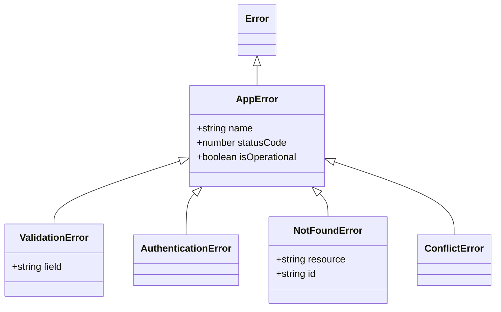
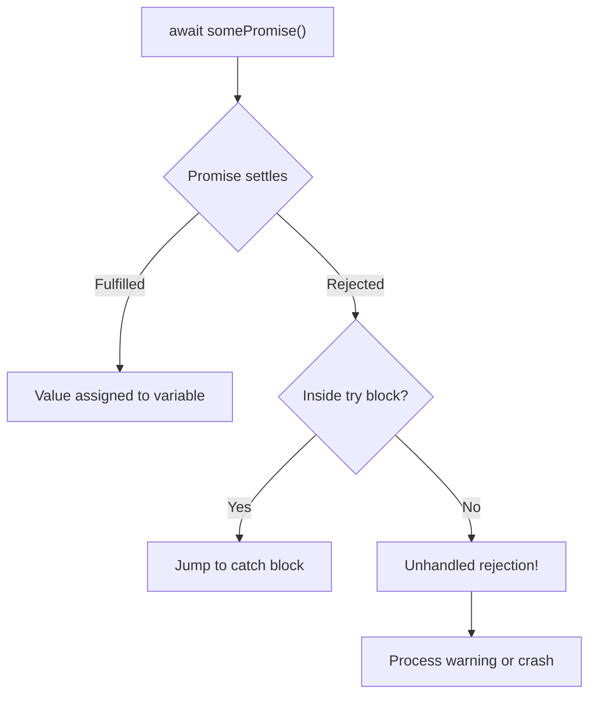
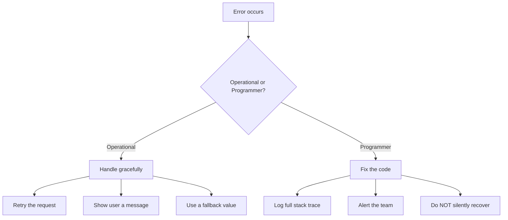

# Error Handling: Failing Gracefully

> Throwing, catching, custom errors, async errors, and failing fast.

---

## Table of Contents

- [1. Throwing and Catching](#1-throwing-and-catching)
- [2. Error Types](#2-error-types)
- [3. Custom Errors](#3-custom-errors)
- [4. Async Error Handling](#4-async-error-handling)
- [5. Error Semantics](#5-error-semantics)

---

## 1. Throwing and Catching

Every program encounters problems. A network request fails. A user submits garbage data. A file disappears. The question is never *if* your code will face errors — it is *how* it responds when they arrive.

JavaScript gives you a mechanism built around four keywords: `throw`, `try`, `catch`, and `finally`. Think of it like a fire alarm system. `throw` pulls the alarm. `try` marks the zone being monitored. `catch` is the response team. `finally` is the cleanup crew that shows up regardless of whether there was a fire.

```js
function divide(a, b) {
  if (b === 0) {
    throw new Error("Division by zero");
  }
  return a / b;
}

try {
  const result = divide(10, 0);
  console.log(result); // never reached
} catch (error) {
  console.error("Something went wrong:", error.message);
} finally {
  console.log("This always runs");
}
```

When `throw` executes, the engine stops running the current function and begins unwinding the call stack. It walks backwards through every function that called this one, looking for a `catch` block. If it finds one, execution resumes there. If it never finds one, your program crashes.



Here is the critical mental model: `throw` is not a return statement. It is an *ejection seat*. It does not just exit the current function — it exits every function between the throw site and the nearest catch, destroying all of their intermediate state.

The `finally` block runs no matter what. Error or no error. Even if you `return` from inside `try` or `catch`, `finally` still executes. This makes it the right place for cleanup — closing connections, releasing resources, restoring state.

```js
function readData() {
  const connection = openDatabase();
  try {
    const data = connection.query("SELECT * FROM users");
    return data;
  } catch (error) {
    console.error("Query failed:", error.message);
    return [];
  } finally {
    connection.close(); // always runs, even after return
  }
}
```

> **Gotcha:** You can `throw` anything in JavaScript — a string, a number, an object. Do not do this. Always throw `Error` objects. They carry a `.message`, a `.stack` trace, and they work with every debugging tool. Throwing a string is like pulling a fire alarm that does not tell the responders which floor the fire is on.

```js
// Bad — no stack trace, hard to debug
throw "something went wrong";

// Good — full stack trace, proper error object
throw new Error("something went wrong");
```

One more subtlety: `catch` binds the error to a variable, but since ES2019, you can omit it if you do not need it.

```js
try {
  JSON.parse("not json");
} catch {
  // we know it failed, we don't need the error details
  console.log("Invalid JSON, using defaults");
}
```

Use this sparingly. Most of the time, you want that error object — even if only for logging.

---

## 2. Error Types

JavaScript does not have just one kind of error. The language ships with a hierarchy of built-in error types, and each one tells you something specific about what went wrong. Learning to read these types is like learning to read medical symptoms — the diagnosis points you toward the cure.



**TypeError** is the one you will see most often. It fires when a value is not the type an operation expects. Calling a non-function. Accessing a property on `null` or `undefined`. Passing the wrong kind of argument to a built-in method.

```js
const user = null;
console.log(user.name);
// TypeError: Cannot read properties of null (reading 'name')

const notAFunction = 42;
notAFunction();
// TypeError: notAFunction is not a function

[1, 2, 3].flat("deep");
// Works but does nothing useful — flat expects a number depth
```

**RangeError** means a value exists but falls outside the acceptable range. Think of it as "right type, wrong magnitude."

```js
const arr = new Array(-1);
// RangeError: Invalid array length

const num = 1.5;
num.toFixed(200);
// RangeError: toFixed() digits argument must be between 0 and 100

function recurseForever() {
  return recurseForever();
}
recurseForever();
// RangeError: Maximum call stack size exceeded
```

**ReferenceError** means you used a variable that does not exist in any accessible scope. This is almost always a typo or a scoping bug.

```js
console.log(myVariable);
// ReferenceError: myVariable is not defined

// Common trap with let/const temporal dead zone
console.log(x);
let x = 5;
// ReferenceError: Cannot access 'x' before initialization
```

**SyntaxError** is the only one you usually cannot catch at runtime because the code fails to parse before it runs. The exception is `JSON.parse` and `eval`, which can produce catchable `SyntaxError`s.

```js
try {
  JSON.parse("{ broken json }");
} catch (error) {
  console.log(error instanceof SyntaxError); // true
}
```

**AggregateError** is newer (ES2021) and wraps multiple errors into one. You encounter it most often with `Promise.any()` when every promise rejects.

```js
const promises = [
  Promise.reject(new Error("API 1 down")),
  Promise.reject(new Error("API 2 down")),
  Promise.reject(new Error("API 3 down")),
];

try {
  await Promise.any(promises);
} catch (error) {
  console.log(error instanceof AggregateError); // true
  console.log(error.errors.length); // 3

  for (const e of error.errors) {
    console.log(e.message);
  }
}
```

You can also use `instanceof` to handle different error types differently in a single catch block:

```js
try {
  riskyOperation();
} catch (error) {
  if (error instanceof TypeError) {
    console.error("Bad data type:", error.message);
  } else if (error instanceof RangeError) {
    console.error("Value out of bounds:", error.message);
  } else {
    throw error; // re-throw what you don't understand
  }
}
```

> **Key principle:** If you catch an error and do not know how to handle it, re-throw it. A caught-and-ignored error is worse than a crash — it creates silent corruption that surfaces hours later in a completely unrelated part of your codebase.

---

## 3. Custom Errors

The built-in error types cover generic JavaScript problems, but your application has its own vocabulary. A `ValidationError` is not a `TypeError`. An `AuthenticationError` is not a `RangeError`. When you use generic errors for domain-specific problems, every catch block has to inspect the message string to figure out what happened. That is fragile and ugly.

Custom errors let you create a vocabulary of failure that matches your domain.

```js
class ValidationError extends Error {
  constructor(field, message) {
    super(message);
    this.name = "ValidationError";
    this.field = field;
  }
}

class AuthenticationError extends Error {
  constructor(message) {
    super(message);
    this.name = "AuthenticationError";
  }
}

class NotFoundError extends Error {
  constructor(resource, id) {
    super(`${resource} with id ${id} not found`);
    this.name = "NotFoundError";
    this.resource = resource;
    this.id = id;
  }
}
```

Now your catch blocks become meaningful:

```js
try {
  const user = await findUser(userId);
} catch (error) {
  if (error instanceof NotFoundError) {
    return res.status(404).json({ error: error.message });
  }
  if (error instanceof AuthenticationError) {
    return res.status(401).json({ error: "Please log in" });
  }
  // Unknown error — let it propagate
  throw error;
}
```



A solid pattern is to create a base `AppError` class that all your custom errors extend. This gives you a single `instanceof` check to distinguish "our errors" from unexpected system errors.

```js
class AppError extends Error {
  constructor(message, statusCode = 500) {
    super(message);
    this.name = this.constructor.name;
    this.statusCode = statusCode;
    this.isOperational = true; // we expected this could happen
  }
}

class ValidationError extends AppError {
  constructor(field, message) {
    super(message, 400);
    this.field = field;
  }
}

class NotFoundError extends AppError {
  constructor(resource, id) {
    super(`${resource} with id ${id} not found`, 404);
    this.resource = resource;
    this.id = id;
  }
}
```

Notice `this.name = this.constructor.name`. This trick automatically sets the error name to the class name without you hardcoding it in every subclass. When you log the error, you see `NotFoundError: User with id 42 not found` instead of the generic `Error`.

> **Gotcha:** You must call `super(message)` before accessing `this` in a constructor. This is a class inheritance rule in JavaScript, not specific to errors. If you forget, you get a `ReferenceError` — which is ironic when you are trying to build your own error class.

The `isOperational` flag is powerful. It lets a top-level error handler distinguish between errors you anticipated (bad input, missing records, expired tokens) and genuine bugs (null reference, logic errors). Operational errors get friendly messages. Programmer errors get logged and investigated.

```js
function globalErrorHandler(error) {
  if (error instanceof AppError && error.isOperational) {
    // expected failure — log it, respond gracefully
    logger.warn(error.message);
    return { status: error.statusCode, message: error.message };
  }

  // unexpected bug — sound the alarm
  logger.error("UNEXPECTED ERROR", error);
  alertOnCall(error);
  return { status: 500, message: "Internal server error" };
}
```

Custom errors are not overhead. They are documentation that executes. Every custom error class you create is a statement about what your system considers a known failure mode versus an unknown one.

---

## 4. Async Error Handling

Errors in asynchronous code are where most developers get burned. Synchronous errors follow a straight path up the call stack. Async errors do not — they happen in a different "timeline," and if you are not waiting for them, they vanish into the void.

With Promises, errors are captured by `.catch()`:

```js
fetch("https://api.example.com/data")
  .then((response) => response.json())
  .then((data) => console.log(data))
  .catch((error) => console.error("Fetch failed:", error.message));
```

The `.catch()` at the end handles any rejection in the entire chain. If the fetch fails, if `response.json()` throws, if any `.then()` callback throws — they all funnel into that single `.catch()`.

With `async/await`, you get to use the same `try/catch` syntax as synchronous code. This is one of the biggest wins of `async/await` — error handling reads naturally.

```js
async function loadUser(id) {
  try {
    const response = await fetch(`/api/users/${id}`);
    if (!response.ok) {
      throw new Error(`HTTP ${response.status}: ${response.statusText}`);
    }
    return await response.json();
  } catch (error) {
    console.error("Failed to load user:", error.message);
    return null;
  }
}
```



> **Critical gotcha:** `fetch` does not throw on HTTP errors. A 404 or 500 response resolves the promise successfully — the request completed, after all. You must check `response.ok` yourself. This is the single most common mistake with `fetch`.

When you run multiple async operations in parallel, `Promise.all` rejects on the first failure. If you need all results regardless of individual failures, use `Promise.allSettled`:

```js
// Fails fast — one rejection kills everything
try {
  const [users, posts] = await Promise.all([
    fetchUsers(),
    fetchPosts(),
  ]);
} catch (error) {
  // Which one failed? You don't know without extra work.
}

// Resilient — get results from everything
const results = await Promise.allSettled([
  fetchUsers(),
  fetchPosts(),
  fetchComments(),
]);

for (const result of results) {
  if (result.status === "fulfilled") {
    console.log("Got:", result.value);
  } else {
    console.error("Failed:", result.reason.message);
  }
}
```

The most dangerous async error is the **unhandled rejection** — a promise that rejects with no `.catch()` and no `try/catch` around its `await`. In modern Node.js, unhandled rejections crash the process by default. In browsers, they fire a warning event.

You should always install a global safety net:

```js
// Node.js
process.on("unhandledRejection", (reason, promise) => {
  console.error("Unhandled Rejection:", reason);
  // Log it, alert on-call, then decide: crash or continue?
});

// Browser
window.addEventListener("unhandledrejection", (event) => {
  console.error("Unhandled Rejection:", event.reason);
  event.preventDefault(); // prevents default console error
});
```

But this is a safety net, not a strategy. The real solution is to never leave a promise unhandled in the first place. Every `await` should be in a `try/catch`, and every promise chain should end with `.catch()`.

One subtle trap: forgetting to `await` an async call inside a `try` block.

```js
async function process() {
  try {
    // BUG: missing await — the error escapes the try/catch
    riskyAsyncOperation();
  } catch (error) {
    // This catch block will NEVER fire for riskyAsyncOperation's errors
    console.error(error);
  }
}
```

Without `await`, the promise floats away, and its rejection becomes unhandled. Always `await` your async calls if you want `try/catch` to work.

---

## 5. Error Semantics

Knowing the syntax of error handling is the easy part. Knowing *when* and *how* to use it — that is where engineering judgment lives. This section is about the philosophy of errors, and getting it wrong leads to the worst kind of bugs: the silent ones.

**Rule 1: Never swallow errors.**

This is the most violated rule in JavaScript:

```js
// The worst pattern in all of programming
try {
  doSomething();
} catch (error) {
  // silently ignored
}
```

An empty catch block is not error handling. It is error hiding. The failure still happened — you just destroyed the evidence. Weeks later, a user reports a bug that is impossible to reproduce because the error that caused it was swallowed three layers deep. At minimum, log the error. Better yet, decide explicitly what recovery looks like.

**Rule 2: Validate early, fail fast.**

Do not let bad data travel deep into your system before complaining. Check inputs at the boundary — where data enters your function, your API, your module. The further bad data travels, the harder the resulting error is to trace.

```js
// Bad — fails deep inside with a confusing error
function processOrder(order) {
  // 50 lines later...
  const total = order.items.reduce((sum, i) => sum + i.price * i.qty, 0);
  // TypeError: Cannot read properties of undefined (reading 'reduce')
}

// Good — fails immediately with a clear error
function processOrder(order) {
  if (!order) throw new ValidationError("order", "Order is required");
  if (!Array.isArray(order.items)) {
    throw new ValidationError("items", "Order must have an items array");
  }
  if (order.items.length === 0) {
    throw new ValidationError("items", "Order must have at least one item");
  }
  // now proceed with confidence
}
```

**Rule 3: Distinguish operational errors from programmer errors.**

This is the most important distinction in error handling:



**Operational errors** are runtime problems that happen to correct code: network timeouts, disk full, invalid user input, external service down. You expect these. You handle them.

**Programmer errors** are bugs: accessing an undefined variable, passing a string where a number is expected, off-by-one indexing. You do not handle these — you fix them. Trying to "recover" from a bug just masks it.

```js
// Operational — handle it
try {
  const data = await fetch("/api/users");
} catch (error) {
  showMessage("Could not load users. Please try again.");
}

// Programmer — do NOT silently recover
function getFirst(arr) {
  // If arr is undefined here, that is a bug in the caller.
  // Returning a default value hides the bug.
  if (!Array.isArray(arr)) {
    throw new TypeError("getFirst expects an array");
  }
  return arr[0];
}
```

**Rule 4: Consider the Result pattern.**

Instead of throwing, some functions can return a value that explicitly represents success or failure. This forces callers to deal with the error case — they cannot forget to add a `try/catch`.

```js
function parseJSON(str) {
  try {
    return { ok: true, value: JSON.parse(str) };
  } catch (error) {
    return { ok: false, error: error.message };
  }
}

const result = parseJSON(userInput);
if (!result.ok) {
  console.error("Bad JSON:", result.error);
} else {
  process(result.value);
}
```

The Result pattern works well for operations where failure is normal and expected — parsing, validation, lookups. It does not replace exceptions for truly exceptional situations. Use it where calling code should always consider both outcomes.

> **The golden rule of error handling:** Handle what you can, propagate what you cannot, and never pretend a failure did not happen. A crash with a stack trace is infinitely more debuggable than silent corruption.