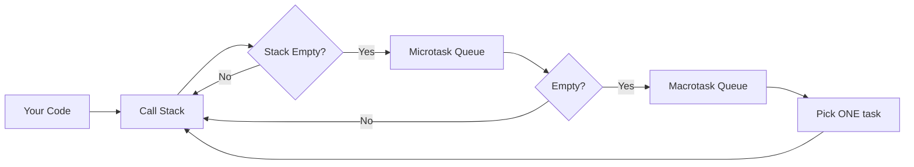
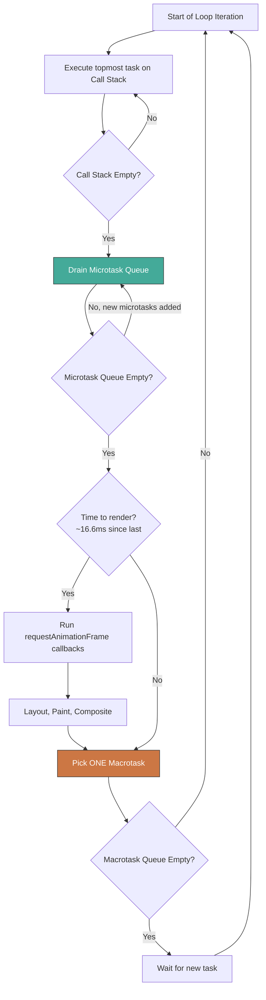
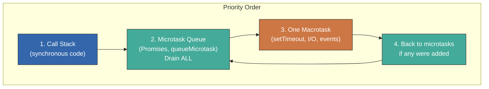
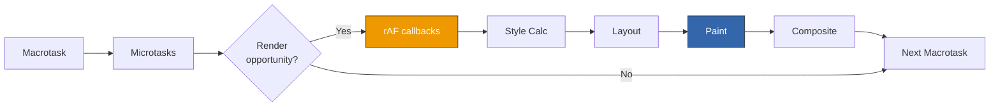
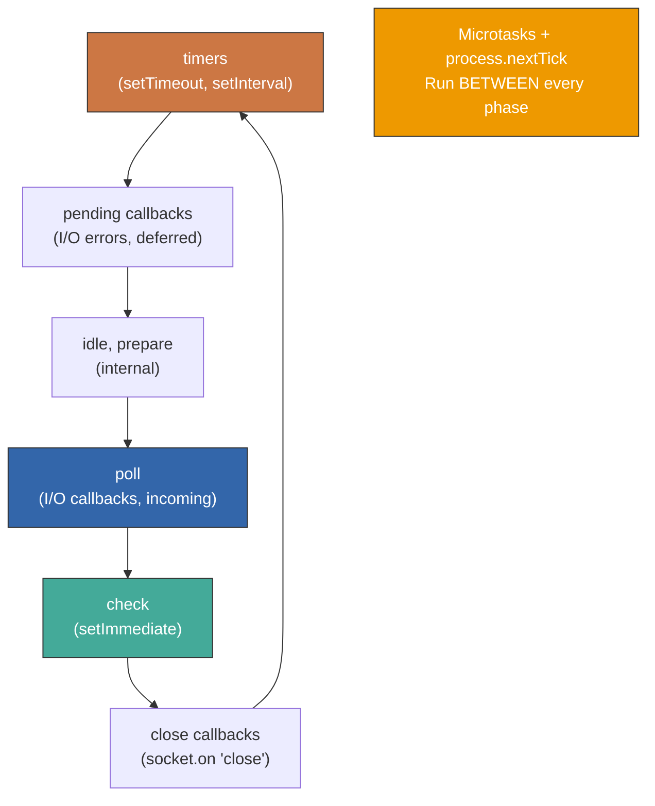

# The Event Loop: How JavaScript Actually Runs

> Call stack, task queues, microtasks, and the execution model that explains every timing surprise.

---

## Table of Contents

- [1. Mental Model](#1-mental-model)
- [2. The Loop](#2-the-loop)
- [3. Microtasks vs Macrotasks](#3-microtasks-vs-macrotasks)
- [4. Browser-Specific](#4-browser-specific)
- [5. Node-Specific](#5-node-specific)

---

## 1. Mental Model

JavaScript is single-threaded. One call stack. One thing at a time. That is not a limitation -- it is the entire design. Every timing surprise you have ever encountered, every "why did this log before that," every frozen UI -- it all traces back to this single fact and how the runtime works around it.

But "single-threaded" does not mean "can only do one thing." It means **JavaScript can only execute one piece of code at a time**. The environment around it -- the browser, Node.js -- is very much multi-threaded. The event loop is the bridge between your single thread and the multi-threaded world outside.

Think of it like a restaurant with one chef. The chef (your JS thread) can only cook one dish at a time. But the restaurant also has a dishwasher, a delivery driver, and waiters (Web APIs, the OS, libuv). The chef gives orders to them, keeps cooking, and when they come back with results, those results go into a queue. The chef picks up the next ticket when the current dish is done.



Here are the key players:

**The Call Stack** is where your code actually executes. Every function call pushes a frame, every return pops one. When the stack is empty, the engine looks for more work.

**Web APIs (browser) / C++ APIs (Node)** are the environment's helpers. When you call `setTimeout`, `fetch`, or `addEventListener`, you are handing work off to the runtime environment. JavaScript does not set the timer -- the browser does. JavaScript does not open the socket -- the OS does.

**The Task Queue (macrotask queue)** holds callbacks from timers, I/O, UI events. Each iteration of the loop picks **one** macrotask.

**The Microtask Queue** holds Promise callbacks, `queueMicrotask()` calls, and `MutationObserver` callbacks. This queue is drained **completely** before the loop moves on.

```js
// Your mental model should be:
// 1. Run synchronous code (call stack)
// 2. Drain ALL microtasks
// 3. Run ONE macrotask
// 4. Repeat

console.log("sync");          // 1: call stack

setTimeout(() => {
  console.log("macrotask");   // 4: macrotask queue
}, 0);

Promise.resolve().then(() => {
  console.log("microtask");   // 3: microtask queue
});

console.log("sync again");    // 2: still on the call stack

// Output: sync, sync again, microtask, macrotask
```

> **Key insight:** The call stack must be completely empty before *any* queued callback runs. This is why a long-running synchronous loop freezes everything -- the event loop literally cannot proceed until your code finishes and the stack is clear.

The runtime is not magic. It is a very specific, deterministic algorithm. Once you see it, you cannot unsee it.

---

## 2. The Loop

The event loop is not a `while(true)` in your JavaScript. It is a `while(true)` in the runtime -- written in C++ -- that orchestrates when your JavaScript runs. Let us trace through exactly what happens on each iteration.



Let us walk through a more involved example step by step:

```js
console.log("1");

setTimeout(() => {
  console.log("2");
  Promise.resolve().then(() => console.log("3"));
}, 0);

Promise.resolve().then(() => {
  console.log("4");
  setTimeout(() => console.log("5"), 0);
});

console.log("6");
```

Here is how the engine processes this:

**Step 1 -- Execute synchronous code (call stack):**
- `console.log("1")` -- prints `1`
- `setTimeout(cb1, 0)` -- hands `cb1` to the browser timer; it will enqueue a macrotask when the timer fires
- `Promise.resolve().then(cb2)` -- `cb2` goes into the microtask queue
- `console.log("6")` -- prints `6`
- Call stack is now empty

**Step 2 -- Drain microtask queue:**
- Execute `cb2`: prints `4`, calls `setTimeout(cb3, 0)` -- `cb3` will be a future macrotask
- Microtask queue is now empty

**Step 3 -- Pick one macrotask:**
- Execute `cb1`: prints `2`, calls `Promise.resolve().then(cb4)` -- `cb4` goes into microtask queue
- Call stack empties, **immediately drain microtasks again**
- Execute `cb4`: prints `3`

**Step 4 -- Pick next macrotask:**
- Execute `cb3`: prints `5`

**Final output: `1, 6, 4, 2, 3, 5`**

The critical rule people miss: **microtasks are drained after every macrotask completes**, not just once per loop iteration. If a macrotask creates a microtask, that microtask runs before the next macrotask. This is why Promises always "cut in line" ahead of timers.

```js
// Dangerous: microtasks that spawn microtasks
function recurse() {
  Promise.resolve().then(recurse);
}
recurse();
// This STARVES the event loop.
// Microtasks drain completely before macrotasks run.
// No setTimeout, no click handler, no rendering -- nothing
// gets a turn. The page freezes just like an infinite while loop.
```

> **Gotcha:** `setTimeout(fn, 0)` does not mean "run immediately." It means "run as soon as possible after the current call stack empties, all microtasks drain, and it is your turn in the macrotask queue." Browsers also clamp nested `setTimeout` calls to a minimum of 4ms after 5 levels of nesting.

---

## 3. Microtasks vs Macrotasks

This distinction is the source of most event loop confusion. Let us be precise about what goes where.

**Microtasks (high priority, drain completely):**
- `Promise.then()`, `.catch()`, `.finally()`
- `queueMicrotask()`
- `MutationObserver` callbacks
- `async/await` continuations (the code after `await` is a microtask)

**Macrotasks (normal priority, one at a time):**
- `setTimeout()`, `setInterval()`
- `setImmediate()` (Node.js)
- I/O callbacks
- UI rendering events (clicks, scroll, etc.)
- `MessageChannel` / `postMessage`
- `requestAnimationFrame` (technically its own category, but in macrotask timing territory)



The ordering guarantee is absolute. Here is the proof:

```js
// The classic interview question
setTimeout(() => console.log("timeout"), 0);
Promise.resolve().then(() => console.log("promise"));
queueMicrotask(() => console.log("microtask"));
console.log("sync");

// Output, always, in every compliant runtime:
// sync
// promise
// microtask
// timeout
```

Both `Promise.then` and `queueMicrotask` are microtasks. They run before `setTimeout` regardless of the order they were registered, because the entire microtask queue drains before the event loop picks the next macrotask.

Now here is where `async/await` makes things tricky:

```js
async function foo() {
  console.log("foo start");        // synchronous
  await Promise.resolve();
  console.log("foo after await");  // microtask!
}

console.log("script start");
foo();
console.log("script end");

// Output:
// script start
// foo start
// script end
// foo after await
```

Everything after `await` becomes a `.then()` callback internally. So `"foo after await"` is a microtask -- it runs after the synchronous code finishes but before any macrotask.

```js
// A more devious example: multiple awaits
async function a() {
  console.log("a1");
  await Promise.resolve();
  console.log("a2");
  await Promise.resolve();
  console.log("a3");
}

async function b() {
  console.log("b1");
  await Promise.resolve();
  console.log("b2");
  await Promise.resolve();
  console.log("b3");
}

a();
b();

// Output: a1, b1, a2, b2, a3, b3
// They interleave! Each await yields to the microtask queue,
// giving the other function a turn.
```

> **Gotcha:** Do not use microtasks for work deferral when you mean macrotasks. If you need to "yield to the browser" so it can paint, `queueMicrotask()` will NOT work -- microtasks run before rendering. Use `setTimeout(fn, 0)` or `requestAnimationFrame(fn)` instead.

This matters for real code. If you schedule a DOM update inside a `Promise.then()`, the browser has not rendered since the microtask queue drains before paint. That can be useful (batching DOM reads and writes) or harmful (long chains of microtasks blocking render).

```js
// This blocks rendering:
function heavyMicrotaskChain(n) {
  if (n <= 0) return;
  queueMicrotask(() => {
    doExpensiveWork();
    heavyMicrotaskChain(n - 1);
  });
}
heavyMicrotaskChain(10000); // Page frozen until all 10,000 run

// This yields to the browser between chunks:
function heavyWithYielding(n) {
  if (n <= 0) return;
  setTimeout(() => {
    doExpensiveWork();
    heavyWithYielding(n - 1);
  }, 0);
}
```

The rule of thumb: **microtasks for "as soon as possible, before anything else." Macrotasks for "when you get a chance, after the browser has had a breather."**

---

## 4. Browser-Specific

The browser event loop has unique concerns that do not exist in Node.js: rendering. The browser needs to paint frames, ideally at 60fps (one frame every ~16.6ms). The event loop in a browser interleaves JavaScript execution with layout, paint, and compositing.



### requestAnimationFrame (rAF)

`requestAnimationFrame` is your tool for visual updates. Its callbacks run **once per frame, right before the browser paints.** This makes it perfect for animations, scroll-linked effects, and any DOM manipulation you want to be visually smooth.

```js
// Smooth animation with rAF
function animate(element) {
  let position = 0;

  function step() {
    position += 2;
    element.style.transform = `translateX(${position}px)`;

    if (position < 300) {
      requestAnimationFrame(step); // Schedule next frame
    }
  }

  requestAnimationFrame(step); // Start
}
```

rAF is NOT a macrotask and NOT a microtask. It lives in its own phase of the browser event loop, executed at the beginning of each render opportunity. Here is what that means in practice:

```js
// rAF vs setTimeout ordering
setTimeout(() => console.log("timeout"), 0);

requestAnimationFrame(() => console.log("rAF"));

Promise.resolve().then(() => console.log("promise"));

// Output is typically:
// promise       (microtask -- always first)
// rAF           (before paint -- often before timeout)
// timeout       (macrotask)
//
// BUT: rAF and timeout ordering is NOT guaranteed.
// If the browser decides no render is needed, rAF may run later.
```

> **Gotcha:** Do not use `requestAnimationFrame` as a generic "defer" mechanism. It only fires when the browser is actually going to paint, which might not happen if the tab is hidden. Use `setTimeout` for general deferral.

### requestIdleCallback (rIC)

`requestIdleCallback` lets you schedule low-priority work for when the browser is idle -- after it has finished all the important work in a frame and has time left over.

```js
// Perfect for: analytics, pre-fetching, non-urgent computation
requestIdleCallback((deadline) => {
  // deadline.timeRemaining() tells you how many ms you have
  while (deadline.timeRemaining() > 0 && tasks.length > 0) {
    processTask(tasks.pop());
  }

  // If there are more tasks, schedule another idle callback
  if (tasks.length > 0) {
    requestIdleCallback(processRemainingTasks);
  }
}, { timeout: 2000 }); // Force run after 2s even if never idle
```

The priority hierarchy in the browser:

```js
// From highest to lowest priority:
// 1. Synchronous code (call stack)
// 2. Microtasks (Promise.then, queueMicrotask)
// 3. requestAnimationFrame (before paint)
// 4. Macrotasks (setTimeout, events)
// 5. requestIdleCallback (when idle)

// Practical consequence:
Promise.resolve().then(() => {
  // This runs BEFORE the browser paints.
  // Good: batching DOM changes.
  // Bad: doing heavy computation here blocks paint.
});

requestAnimationFrame(() => {
  // This runs RIGHT BEFORE paint.
  // Read layout values here, make final visual adjustments.
});

requestIdleCallback(() => {
  // This runs when the browser has nothing better to do.
  // Send analytics, prefetch resources, warm caches.
});
```

> **Gotcha:** `requestIdleCallback` has no Safari support as of 2025 (it was only recently shipped behind a flag). For cross-browser idle scheduling, you will need a polyfill or use `setTimeout` with a longer delay as a fallback. React's scheduler does exactly this internally.

One more browser-specific detail: **every call to `alert()`, `confirm()`, or `prompt()` pauses the entire event loop.** No timers fire, no Promises resolve, no rendering happens. These are relics of a simpler web and should never appear in production code.

---

## 5. Node-Specific

Node.js uses the same conceptual model -- single thread, event loop, microtasks before macrotasks -- but the implementation is built on **libuv** rather than browser rendering logic, and the loop has distinct phases.



### The Phases

Each iteration of the Node.js event loop passes through these phases in order:

1. **Timers** -- executes callbacks from `setTimeout` and `setInterval` whose threshold has elapsed
2. **Pending callbacks** -- executes I/O callbacks deferred from the previous iteration (certain system errors)
3. **Idle/Prepare** -- internal housekeeping, you never interact with this
4. **Poll** -- retrieves new I/O events, executes I/O-related callbacks. This is where Node spends most of its time, waiting for incoming connections, file reads, etc.
5. **Check** -- `setImmediate()` callbacks run here
6. **Close callbacks** -- e.g., `socket.on('close', ...)`

Between **every** phase transition, Node drains all microtasks (Promises) and all `process.nextTick()` callbacks.

### process.nextTick vs setImmediate

These two are the source of endless confusion, and their names are backwards from what you would expect.

```js
// process.nextTick: runs BEFORE the event loop continues
// (before microtasks, highest priority callback in Node)
process.nextTick(() => console.log("nextTick"));

// setImmediate: runs in the CHECK phase of the current
// (or next) event loop iteration
setImmediate(() => console.log("immediate"));

// Promise.then: microtask, runs after nextTick
Promise.resolve().then(() => console.log("promise"));

// Output:
// nextTick
// promise
// immediate
```

The priority in Node.js is: `process.nextTick` > `Promise microtasks` > `setImmediate` > `setTimeout`.

```js
// The classic confusing case:
setTimeout(() => console.log("timeout"), 0);
setImmediate(() => console.log("immediate"));

// Output: NONDETERMINISTIC at the top level!
// Sometimes timeout first, sometimes immediate first.
// Depends on how quickly the process initializes.

// BUT inside an I/O callback, order is guaranteed:
const fs = require("fs");
fs.readFile(__filename, () => {
  setTimeout(() => console.log("timeout"), 0);
  setImmediate(() => console.log("immediate"));
});
// Output: ALWAYS immediate, timeout
// Because I/O callbacks run in the poll phase,
// and check (setImmediate) comes right after poll,
// while timers come at the start of the NEXT iteration.
```

> **Gotcha:** `process.nextTick` can starve the event loop just like recursive microtasks in the browser. If you call `process.nextTick` recursively, I/O callbacks never fire. The Node.js docs themselves recommend `setImmediate` for most use cases.

```js
// DON'T: recursive nextTick starves I/O
function bad() {
  process.nextTick(bad);
}
bad(); // I/O never gets a turn

// DO: setImmediate lets the loop breathe
function good() {
  setImmediate(good);
}
good(); // I/O callbacks still fire between iterations
```

### Practical Node.js Patterns

```js
// Use setImmediate to break up CPU-intensive work
function processChunk(data, index, callback) {
  const CHUNK_SIZE = 1000;
  const end = Math.min(index + CHUNK_SIZE, data.length);

  for (let i = index; i < end; i++) {
    heavyComputation(data[i]);
  }

  if (end < data.length) {
    // Yield to the event loop so I/O can be processed
    setImmediate(() => processChunk(data, end, callback));
  } else {
    callback();
  }
}

// Use process.nextTick for ensuring async consistency
function readFromCache(key, callback) {
  const cached = cache.get(key);
  if (cached) {
    // Without nextTick, this callback fires synchronously.
    // That breaks the contract: "callback is always async."
    process.nextTick(() => callback(null, cached));
  } else {
    db.read(key, callback); // genuinely async
  }
}
```

The Node.js event loop has no rendering phase, no `requestAnimationFrame`, no `requestIdleCallback`. It is purely about I/O scheduling. But the core mental model is identical: **one thread, clear priority order, and the loop that ties it all together.**