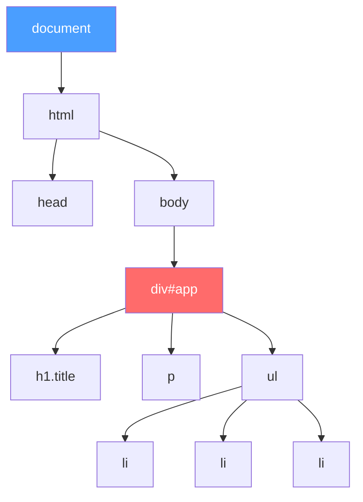
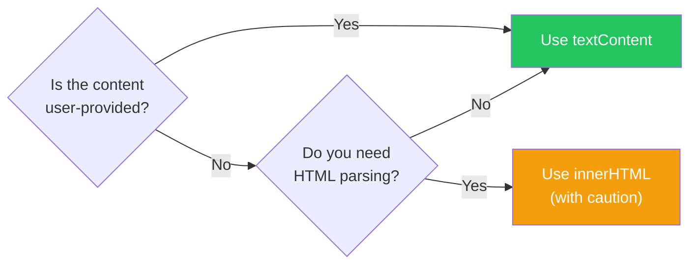
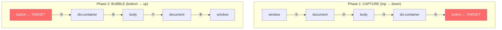
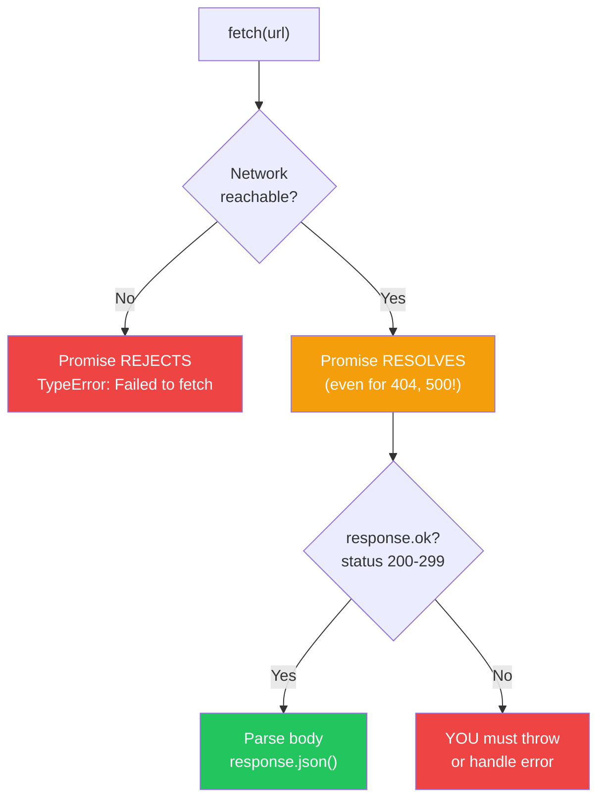
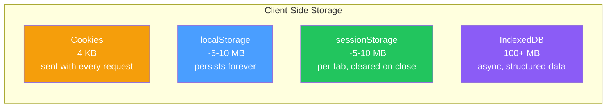
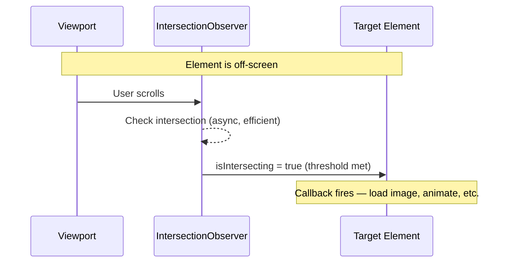

# Browser APIs and the DOM: JavaScript Meets the Web

> DOM manipulation, events, fetch, storage, and the Web APIs that make browsers a platform.

---

## Table of Contents

- [1. The DOM](#1-the-dom)
- [2. Events](#2-events)
- [3. Fetch and HTTP](#3-fetch-and-http)
- [4. Storage](#4-storage)
- [5. Other Essential APIs](#5-other-essential-apis)

---

## 1. The DOM

JavaScript the language can run anywhere — servers, robots, toasters. But JavaScript in the **browser** has a superpower: the DOM. The Document Object Model is how the browser turns your HTML into a living, breathing tree of objects that JavaScript can read, change, and destroy.

Think of it this way: HTML is a blueprint. The browser reads that blueprint and builds a house — the DOM. JavaScript is the resident who can repaint walls, add rooms, or knock out a window.



### Finding Elements

Forget `getElementById` — the modern way is `querySelector` and `querySelectorAll`. They use CSS selector syntax, which you already know:

```js
// Single element (first match)
const app = document.querySelector('#app');
const title = document.querySelector('.title');
const firstLink = document.querySelector('a[href^="https"]');

// All matches (returns a NodeList, not an Array)
const items = document.querySelectorAll('li');

// NodeList gotcha: it's not a real array
items.forEach(item => console.log(item)); // works
items.map(item => item.textContent);       // TypeError!

// Convert to array when you need array methods
const textsArray = [...items].map(item => item.textContent);
```

> **Gotcha:** `querySelectorAll` returns a **static** NodeList — a snapshot in time. If you add more `<li>` elements later, your `items` variable won't include them. The older `getElementsByClassName` returns a **live** HTMLCollection that auto-updates, but it's rarely what you actually want.

### Reading and Changing Content

This is where things get interesting — and dangerous:

```js
const heading = document.querySelector('h1');

// textContent: safe, plain text only
heading.textContent = 'Hello, World!';
heading.textContent = '<b>Bold?</b>'; // renders as literal text: "<b>Bold?</b>"

// innerHTML: parses HTML — powerful but dangerous
heading.innerHTML = '<em>Emphasis!</em>'; // renders as italic text

// THE XSS TRAP
const userInput = '';
heading.innerHTML = userInput; // executes the attacker's script
heading.textContent = userInput; // safe: renders as harmless text
```

**Rule of thumb:** Use `textContent` for user-provided data. Always. The only time you reach for `innerHTML` is when you control the HTML string yourself and you trust every character in it. Even then, think twice.



### Creating and Removing Elements

The DOM isn't read-only. You can build entire interfaces from scratch:

```js
// Create an element
const card = document.createElement('div');
card.classList.add('card');
card.textContent = 'I was born in JavaScript';

// Add it to the page
document.querySelector('#app').appendChild(card);

// Insert before a specific sibling
const container = document.querySelector('#app');
const reference = container.querySelector('.existing-element');
container.insertBefore(card, reference);

// Modern: insertAdjacentHTML (position matters)
container.insertAdjacentHTML('beforeend', '<p>Added at the end</p>');
// positions: 'beforebegin' | 'afterbegin' | 'beforeend' | 'afterend'

// Remove an element
card.remove(); // modern, clean
// Old way: card.parentNode.removeChild(card);
```

> **Performance note:** If you're adding many elements in a loop, build them in a `DocumentFragment` first, then append the fragment once. Each direct DOM insertion forces the browser to recalculate layout. Batch your writes.

```js
const fragment = document.createDocumentFragment();
for (let i = 0; i < 1000; i++) {
  const li = document.createElement('li');
  li.textContent = `Item ${i}`;
  fragment.appendChild(li);
}
document.querySelector('ul').appendChild(fragment); // one reflow, not 1000
```

The DOM API is verbose compared to what frameworks give you, but understanding it is non-negotiable. React, Vue, and Svelte all generate DOM operations under the hood. When something breaks, you debug the DOM, not the abstraction.

---

## 2. Events

The DOM is a tree. Events are how that tree talks to your code. Every click, keypress, scroll, resize, form submission, and mouse wiggle is an event. Understanding the event system is understanding how interactive web pages work.

### addEventListener: The Right Way

```js
const button = document.querySelector('#submit');

// The modern way
button.addEventListener('click', function (event) {
  console.log('Clicked!', event.target);
});

// With an arrow function
button.addEventListener('click', (e) => {
  e.preventDefault(); // stop default browser behavior (form submit, link nav)
  console.log('Handled');
});

// DON'T use inline handlers in HTML
// <button onclick="handleClick()"> — this is the 2005 way. Stop.
```

You can attach multiple listeners to the same event on the same element. They all fire, in order. This is impossible with the old `button.onclick = ...` assignment pattern, which overwrites any previous handler.

### Capture and Bubble: The Event's Journey

Here is the part most developers skip and then regret. When you click a button nested inside a div inside the body, the event doesn't just fire on the button. It travels:



By default, `addEventListener` listens during the **bubble** phase. To listen during capture instead:

```js
// Third argument: true = capture phase
document.body.addEventListener('click', (e) => {
  console.log('Body saw it during CAPTURE');
}, true);

// Or use the options object (more readable)
document.body.addEventListener('click', (e) => {
  console.log('Body saw it during CAPTURE');
}, { capture: true });
```

You can stop the event's journey with `event.stopPropagation()`, but be cautious — other code (analytics, accessibility tools) might depend on seeing that event bubble up.

### Event Delegation: The Pro Pattern

Imagine a to-do list with 500 items. Do you add 500 click listeners? No. You add **one** listener to the parent and check which child was clicked:

```js
const list = document.querySelector('#todo-list');

// ONE listener for ALL items (even ones added later!)
list.addEventListener('click', (event) => {
  const item = event.target.closest('li'); // find the nearest <li> ancestor
  if (!item) return; // click wasn't on an item
  if (!list.contains(item)) return; // safety check

  item.classList.toggle('done');
});
```

This is **event delegation**. It works because events bubble. Benefits:
- **Performance:** One listener instead of hundreds.
- **Dynamic elements:** Items added after page load are automatically handled.
- **Memory:** Fewer listeners means less memory and no cleanup needed when removing elements.

> **The `closest()` method** walks up the DOM tree from the target, looking for the first ancestor matching the selector. It's essential for delegation because `event.target` might be a `<span>` inside the `<li>`, not the `<li>` itself.

### Passive Listeners: Don't Block the Scroll

Touch and scroll events have a performance trap. The browser has to wait for your handler to finish before it knows whether you called `preventDefault()`. This creates visible jank:

```js
// BAD: browser must wait to see if you prevent scrolling
window.addEventListener('scroll', handleScroll);

// GOOD: promise the browser you won't call preventDefault()
window.addEventListener('scroll', handleScroll, { passive: true });

// If you DO need to prevent default (e.g., custom touch gestures):
element.addEventListener('touchmove', (e) => {
  e.preventDefault(); // this will throw a warning if passive: true
}, { passive: false }); // explicitly opt out
```

> **Note:** Chrome and Firefox now default `touchstart` and `touchmove` to `passive: true` on `document`-level listeners. If your old code calls `preventDefault()` on those and suddenly stops working, this is why.

### Cleanup

Always remove listeners when they're no longer needed (single-page apps, component unmounting):

```js
const handler = (e) => console.log(e);
button.addEventListener('click', handler);

// Later:
button.removeEventListener('click', handler);

// Or use the once option for one-shot listeners:
button.addEventListener('click', (e) => {
  console.log('I fire once and self-destruct');
}, { once: true });
```

> **Gotcha:** You can't remove an anonymous function listener. `removeEventListener` matches by **reference**. If you passed an inline arrow function to `addEventListener`, you have no reference to remove it later. Always save the function to a variable if you'll need to remove it.

---

## 3. Fetch and HTTP

Before `fetch`, we had `XMLHttpRequest` — a clunky, callback-based API designed in an era of XML. `fetch` replaced it with Promises and a clean interface. But it has one behavior that trips up everyone who touches it.

### The Basics

```js
// Simple GET request
const response = await fetch('https://api.example.com/users');
const users = await response.json();

// POST with a JSON body
const response = await fetch('https://api.example.com/users', {
  method: 'POST',
  headers: {
    'Content-Type': 'application/json',
  },
  body: JSON.stringify({ name: 'Ada', role: 'engineer' }),
});
```

### The Biggest Gotcha: fetch Does NOT Reject on HTTP Errors

This is the single most important thing to understand about `fetch`. A `404 Not Found` or `500 Internal Server Error` is **not** a rejected Promise. The Promise only rejects on **network failures** — when the request couldn't be made at all (DNS failure, offline, CORS block).

```js
// THIS IS WRONG — no error handling for HTTP errors
try {
  const response = await fetch('/api/data');
  const data = await response.json(); // blows up if response is 404 HTML page
} catch (err) {
  // Only catches network failures, NOT 404s or 500s
}

// THIS IS RIGHT
async function safeFetch(url, options) {
  const response = await fetch(url, options);

  if (!response.ok) { // .ok is true for status 200-299
    throw new Error(`HTTP ${response.status}: ${response.statusText}`);
  }

  return response.json();
}

try {
  const data = await safeFetch('/api/data');
} catch (err) {
  console.error('Request failed:', err.message);
}
```



> **Why does it work this way?** The `fetch` designers considered any completed HTTP round-trip a "success" from the network's perspective. A `404` is the server successfully telling you something doesn't exist. Controversial? Yes. But knowing this puts you ahead of most developers.

### Aborting Requests

What if the user navigates away or types a new search query? You need to cancel the in-flight request. Enter `AbortController`:

```js
const controller = new AbortController();

// Pass the signal to fetch
const fetchPromise = fetch('/api/search?q=react', {
  signal: controller.signal,
});

// Cancel anytime
controller.abort();

// The fetch promise rejects with an AbortError
try {
  const response = await fetchPromise;
} catch (err) {
  if (err.name === 'AbortError') {
    console.log('Request was cancelled');
  } else {
    throw err; // re-throw real errors
  }
}
```

A practical pattern — cancel the previous search when a new one starts:

```js
let currentController = null;

async function search(query) {
  // Cancel any in-flight request
  if (currentController) {
    currentController.abort();
  }

  currentController = new AbortController();

  try {
    const response = await fetch(`/api/search?q=${encodeURIComponent(query)}`, {
      signal: currentController.signal,
    });

    if (!response.ok) throw new Error(`HTTP ${response.status}`);
    return await response.json();
  } catch (err) {
    if (err.name === 'AbortError') return null; // silently ignore cancellations
    throw err;
  }
}
```

### Timeout with AbortSignal

`fetch` has no built-in timeout. You build one with `AbortSignal.timeout()`:

```js
// Abort after 5 seconds
const response = await fetch('/api/slow-endpoint', {
  signal: AbortSignal.timeout(5000),
});

// Combine abort reasons: user cancellation OR timeout
const controller = new AbortController();
const timeoutId = setTimeout(() => controller.abort(), 5000);

try {
  const response = await fetch('/api/data', { signal: controller.signal });
  clearTimeout(timeoutId);
  // ...
} catch (err) {
  clearTimeout(timeoutId);
  throw err;
}
```

### Response Types

The response body can be consumed in multiple formats, but **only once**:

```js
const response = await fetch('/api/data');

// Pick ONE — the body is a stream and can only be read once
const json = await response.json();   // parse as JSON
const text = await response.text();   // raw text
const blob = await response.blob();   // binary data (images, files)
const buffer = await response.arrayBuffer(); // raw bytes
const formData = await response.formData();  // form data

// If you need to read the body twice, clone first:
const cloned = response.clone();
const json = await response.json();
const text = await cloned.text(); // read the clone separately
```

> **Tip:** Libraries like `axios` or `ky` add conveniences (auto-throw on errors, retries, interceptors), but `fetch` is built into every browser and has zero bundle cost. Start with `fetch`. Add a library when you genuinely need features it doesn't have.

---

## 4. Storage

Browsers give you multiple ways to persist data on the client. Each has different capacity, lifetime, and use cases. Picking the wrong one is a common source of bugs and security issues.



### localStorage and sessionStorage

These are the simplest. They share the same API but differ in lifetime:

```js
// localStorage: persists until explicitly cleared (survives browser restart)
localStorage.setItem('theme', 'dark');
localStorage.getItem('theme');    // 'dark'
localStorage.removeItem('theme');
localStorage.clear();              // nuke everything

// sessionStorage: same API, but scoped to the tab
// Opening a new tab = new sessionStorage (even same URL)
sessionStorage.setItem('formDraft', JSON.stringify({ name: 'Ada' }));
```

**Critical limitation: strings only.**

```js
// WRONG — silently converts to string
localStorage.setItem('count', 42);
localStorage.getItem('count'); // '42' (string!)
localStorage.getItem('count') + 1; // '421' (string concatenation)

// RIGHT — serialize and deserialize
localStorage.setItem('user', JSON.stringify({ name: 'Ada', age: 36 }));
const user = JSON.parse(localStorage.getItem('user'));

// DEFENSIVE — handle missing/corrupt data
function getStoredJSON(key, fallback) {
  try {
    const raw = localStorage.getItem(key);
    return raw ? JSON.parse(raw) : fallback;
  } catch {
    return fallback; // corrupt data, return fallback
  }
}
```

> **Gotcha:** `localStorage` is **synchronous** and blocks the main thread. For small reads/writes this is fine. For megabytes of data, it will freeze your UI. That's what IndexedDB is for.

> **Security note:** Never store tokens, passwords, or sensitive data in `localStorage`. It's accessible to any JavaScript on the page, including XSS attacks. If an attacker injects a script, `localStorage.getItem('authToken')` is the first thing they'll try.

### Cookies

Cookies are the oldest storage mechanism and the only one automatically sent to the server with every HTTP request. This makes them uniquely suited for authentication tokens — but also uniquely dangerous for performance (every cookie travels with every request to that domain).

```js
// Setting a cookie (the API is... not great)
document.cookie = 'theme=dark; path=/; max-age=31536000'; // 1 year
document.cookie = 'lang=en; path=/; max-age=31536000';

// Reading cookies (returns ALL cookies as one string)
console.log(document.cookie); // 'theme=dark; lang=en'

// Parsing cookies into an object
function getCookies() {
  return Object.fromEntries(
    document.cookie.split('; ').map(c => c.split('='))
  );
}
getCookies(); // { theme: 'dark', lang: 'en' }

// Deleting a cookie (set max-age to 0)
document.cookie = 'theme=; max-age=0';
```

For auth tokens, let the **server** set cookies with `HttpOnly` (JavaScript can't read them), `Secure` (HTTPS only), and `SameSite=Strict` (prevents CSRF). You should never set auth cookies from client-side JavaScript.

### IndexedDB

When you need real storage — megabytes of structured data, offline-first apps, caching API responses — you need IndexedDB. The native API is notoriously painful, so I'll show the concept and then the pragmatic approach:

```js
// The raw API is callback-based and verbose. Here's the gist:
const request = indexedDB.open('myDatabase', 1);

request.onupgradeneeded = (event) => {
  const db = event.target.result;
  const store = db.createObjectStore('users', { keyPath: 'id' });
  store.createIndex('email', 'email', { unique: true });
};

request.onsuccess = (event) => {
  const db = event.target.result;
  const tx = db.transaction('users', 'readwrite');
  const store = tx.objectStore('users');

  store.put({ id: 1, name: 'Ada', email: 'ada@example.com' });

  store.get(1).onsuccess = (e) => {
    console.log(e.target.result); // { id: 1, name: 'Ada', ... }
  };
};
```

> **In practice**, nobody uses the raw IndexedDB API. Use a wrapper like **idb** (by Jake Archibald) which gives you Promises and a sane interface:

```js
import { openDB } from 'idb';

const db = await openDB('myDatabase', 1, {
  upgrade(db) {
    db.createObjectStore('users', { keyPath: 'id' });
  },
});

await db.put('users', { id: 1, name: 'Ada', email: 'ada@example.com' });
const user = await db.get('users', 1);
```

### When to Use What

| Need | Use | Why |
|------|-----|-----|
| Theme/language preference | `localStorage` | Small, persistent, sync is fine |
| Form draft in current tab | `sessionStorage` | Dies with the tab, no leakage |
| Auth token | `HttpOnly` cookie (server-set) | Automatic, secure, can't be stolen by XSS |
| Offline app data cache | IndexedDB | Async, large, structured |
| Shopping cart | `localStorage` or IndexedDB | Depends on size and complexity |

---

## 5. Other Essential APIs

The browser is a platform, not just a document viewer. Here are the APIs that separate someone who knows JavaScript from someone who knows the **web platform**.

### URL API

Stop manually parsing URLs with string splitting. The `URL` constructor does it properly:

```js
const url = new URL('https://example.com:8080/search?q=hello&lang=en#results');

url.hostname;     // 'example.com'
url.port;         // '8080'
url.pathname;     // '/search'
url.hash;         // '#results'

// URLSearchParams: the right way to handle query strings
url.searchParams.get('q');      // 'hello'
url.searchParams.has('lang');   // true
url.searchParams.set('page', '2');
url.searchParams.delete('lang');
url.toString(); // 'https://example.com:8080/search?q=hello&page=2#results'

// Build URLs safely (auto-encodes special characters)
const params = new URLSearchParams({ q: 'hello world', page: '1' });
params.toString(); // 'q=hello+world&page=1'
```

### History API

Single-page apps (SPAs) need to change the URL without reloading the page. That's `history.pushState`:

```js
// Change URL without page reload
history.pushState({ page: 'about' }, '', '/about');

// Replace current entry (no back button entry created)
history.replaceState({ page: 'about' }, '', '/about');

// Listen for back/forward navigation
window.addEventListener('popstate', (event) => {
  console.log('User navigated to:', location.pathname);
  console.log('State:', event.state);
  renderPage(location.pathname); // your SPA routing logic
});
```

> **Note:** `pushState` changes the URL but does NOT trigger `popstate`. Only browser back/forward buttons (or `history.back()`/`history.forward()`) trigger it. This catches people off guard when building routers.

### IntersectionObserver

Need to know when an element scrolls into view? Lazy-loading images, infinite scroll, scroll-triggered animations — all of these used to require expensive `scroll` event listeners with `getBoundingClientRect()`. `IntersectionObserver` does it efficiently:

```js
const observer = new IntersectionObserver(
  (entries) => {
    entries.forEach((entry) => {
      if (entry.isIntersecting) {
        entry.target.classList.add('visible');
        // Optionally stop observing after first trigger
        observer.unobserve(entry.target);
      }
    });
  },
  {
    threshold: 0.1,   // trigger when 10% visible
    rootMargin: '100px', // start loading 100px before visible
  }
);

// Observe all images with data-src
document.querySelectorAll('img[data-src]').forEach((img) => {
  observer.observe(img);
});
```



### Web Workers

JavaScript is single-threaded. Heavy computation blocks the UI. Web Workers let you run code in a background thread:

```js
// main.js
const worker = new Worker('worker.js');

worker.postMessage({ data: hugeArray }); // send data to worker

worker.onmessage = (event) => {
  console.log('Result from worker:', event.data);
};

worker.onerror = (event) => {
  console.error('Worker error:', event.message);
};
```

```js
// worker.js — runs in a separate thread
self.onmessage = (event) => {
  const result = heavyComputation(event.data);
  self.postMessage(result); // send result back to main thread
};
```

> **Limitations:** Workers have no access to the DOM, `window`, or `document`. They communicate only through `postMessage`. Data is **copied** (structured clone), not shared — unless you use `SharedArrayBuffer` and `Atomics`, which is advanced territory.

### WebSockets

`fetch` is request-response: you ask, the server answers. WebSockets are bidirectional — the server can push data to you at any time. Chat apps, live dashboards, multiplayer games:

```js
const ws = new WebSocket('wss://example.com/live');

ws.onopen = () => {
  console.log('Connected');
  ws.send(JSON.stringify({ type: 'subscribe', channel: 'prices' }));
};

ws.onmessage = (event) => {
  const data = JSON.parse(event.data);
  updateUI(data);
};

ws.onclose = (event) => {
  console.log(`Closed: ${event.code} ${event.reason}`);
  // Implement reconnection logic here
};

ws.onerror = (event) => {
  console.error('WebSocket error');
};
```

> **Tip:** Always implement reconnection logic with exponential backoff. Connections will drop — networks are unreliable. Also consider Server-Sent Events (SSE) via `EventSource` if you only need server-to-client push (simpler, auto-reconnects, works over HTTP).

### Canvas API

Canvas gives you a pixel-level drawing surface. Charts, games, image processing, generative art — anything visual that goes beyond CSS:

```js
const canvas = document.querySelector('#myCanvas');
const ctx = canvas.getContext('2d');

// Draw a rectangle
ctx.fillStyle = '#4a9eff';
ctx.fillRect(10, 10, 200, 100);

// Draw text
ctx.font = '24px sans-serif';
ctx.fillStyle = '#333';
ctx.fillText('Hello Canvas', 20, 65);

// Draw a circle
ctx.beginPath();
ctx.arc(300, 60, 40, 0, Math.PI * 2);
ctx.fillStyle = '#ff6b6b';
ctx.fill();

// For complex graphics and games, consider the animation loop:
function animate() {
  ctx.clearRect(0, 0, canvas.width, canvas.height);
  // draw your scene...
  requestAnimationFrame(animate); // ~60fps, synced with display
}
animate();
```

> **When to use Canvas vs. SVG:** Canvas is imperative (you draw pixels), SVG is declarative (you describe shapes). Canvas wins for many objects, animations, and pixel manipulation. SVG wins for interactive charts, scalable graphics, and accessibility (SVG elements live in the DOM and can be inspected, clicked, and read by screen readers).

### The Big Picture

These APIs are what turn a "JavaScript developer" into a "web platform developer." You don't need to memorize every method — you need to know what's possible so you can reach for the right tool:

| Problem | API |
|---------|-----|
| Need to know when something scrolls into view | IntersectionObserver |
| Heavy computation blocking the UI | Web Workers |
| Real-time server updates | WebSocket or SSE |
| Drawing charts/games | Canvas or SVG |
| SPA routing without page reloads | History API |
| Parsing/building URLs safely | URL / URLSearchParams |

The browser is the most widely deployed application platform in history. These APIs are your toolkit for building on it.