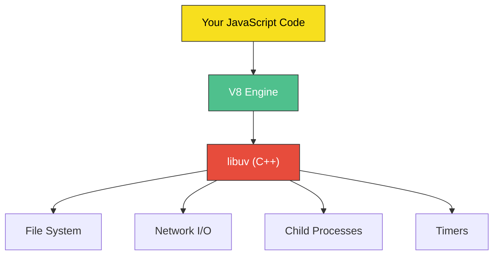
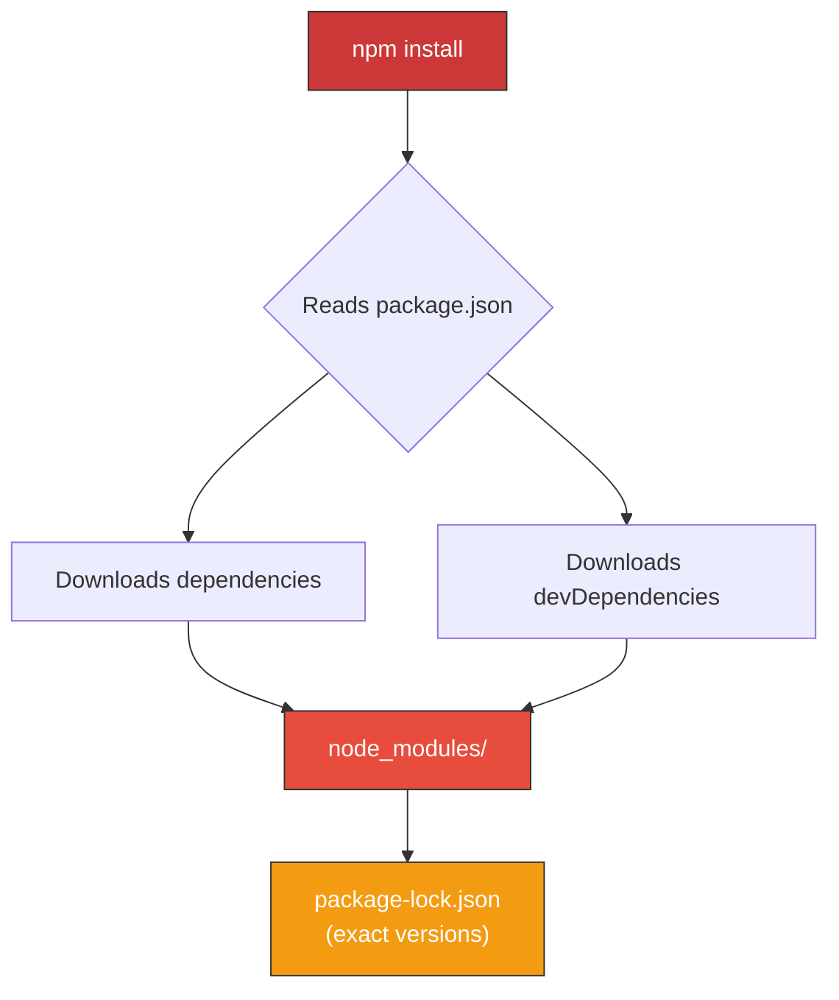
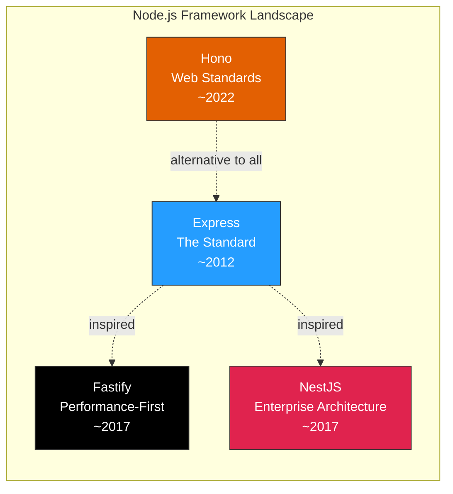

# Node.js Runtime: JavaScript Beyond the Browser

> V8 on the server — filesystem, streams, npm, and backend frameworks.

---

## Table of Contents

- [1. What Node Is](#1-what-node-is)
- [2. Core Modules](#2-core-modules)
- [3. Streams](#3-streams)
- [4. npm Ecosystem](#4-npm-ecosystem)
- [5. Frameworks](#5-frameworks)

---

## 1. What Node Is

Here is a question that confused a lot of people in 2009: why would you run JavaScript *outside* a browser? The answer turned out to be one of the most consequential decisions in modern software history.

Node.js is **V8 (Chrome's JavaScript engine) bolted onto a C++ runtime** that provides access to the operating system. That is all it is. The browser gives JavaScript the DOM, `window`, and `fetch`. Node gives JavaScript the filesystem, network sockets, and child processes. Same language, radically different capabilities.



The genius is **libuv**, the C++ library underneath. It handles all I/O operations asynchronously using an event loop. When you read a file, Node does not block the entire process waiting for the disk. It delegates the work to the OS, continues executing your code, and calls your callback when the data is ready.

```js
// This does NOT block. Node keeps running other code
// while the OS reads the file from disk.
import { readFile } from "node:fs/promises";

const data = await readFile("./config.json", "utf-8");
console.log(JSON.parse(data));
```

This **non-blocking I/O model** is why a single Node process can handle thousands of concurrent connections. A traditional threaded server (like classic Apache) creates one thread per request. A Node server uses one thread for JavaScript, offloading all the waiting to the OS kernel.

> **Key insight:** Node is single-threaded for *your* code, but multi-threaded under the hood. libuv maintains a thread pool (default: 4 threads) for operations the OS cannot do asynchronously, like DNS lookups and filesystem calls on some platforms.

```js
// The event loop in simplified form
// 1. Execute synchronous code
// 2. Check for pending I/O callbacks
// 3. Run setImmediate callbacks
// 4. Run setTimeout/setInterval callbacks
// 5. Check for close events
// 6. Repeat (or exit if nothing is pending)
```

Here is what trips people up: **Node is not inherently fast at computation.** It is fast at *waiting*. If your server mostly reads from databases, calls APIs, and serves files, Node is excellent. If it needs to do heavy math, image processing, or video encoding, that single thread becomes a bottleneck. You can work around this with worker threads (we will get to those), but CPU-bound work is not Node's sweet spot.

To run Node, you write a `.js` or `.mjs` file and execute it:

```bash
node server.mjs
```

There is no compilation step, no build command. Node reads your file, V8 compiles it to machine code on the fly (JIT compilation), and runs it. When the event loop has nothing left to do, the process exits.

> **Gotcha:** Node uses CommonJS (`require`/`module.exports`) by default. To use ES modules (`import`/`export`), either name your files `.mjs` or add `"type": "module"` to your `package.json`. Mixing the two systems is a recurring source of frustration.

---

## 2. Core Modules

Node ships with a rich standard library. You do not need npm for basic tasks. Since Node 16+, the convention is to prefix built-in modules with `node:` to make it explicit that you are importing from the runtime, not a third-party package.


### `fs` — File System

The most-used module. Every function comes in three flavors: callback, synchronous, and promise-based. **Always use the promise-based version** unless you have a specific reason not to.

```js
import { readFile, writeFile, readdir, stat, mkdir } from "node:fs/promises";

// Read a file
const content = await readFile("./data.txt", "utf-8");

// Write a file (creates it if it doesn't exist, overwrites if it does)
await writeFile("./output.txt", "Hello from Node!");

// List directory contents
const files = await readdir("./src");

// Get file metadata
const info = await stat("./data.txt");
console.log(info.size);       // bytes
console.log(info.isFile());   // true
console.log(info.mtime);      // last modified date

// Create a directory (recursive: true acts like mkdir -p)
await mkdir("./logs/2026/may", { recursive: true });
```

> **Gotcha:** `readFile` loads the *entire file* into memory. For large files (logs, CSVs, videos), use streams instead. Reading a 2GB file with `readFile` will crash your process.

### `path` — File Paths

Never concatenate paths with string concatenation. Windows uses `\`, Unix uses `/`, and bugs are waiting. The `path` module handles this correctly on every platform.

```js
import path from "node:path";

path.join("src", "utils", "helpers.js");
// Unix:    "src/utils/helpers.js"
// Windows: "src\\utils\\helpers.js"

path.resolve(".", "src", "index.js");
// "/absolute/path/to/project/src/index.js"

path.basename("/app/src/index.js");  // "index.js"
path.extname("photo.jpg");           // ".jpg"
path.dirname("/app/src/index.js");   // "/app/src"
```

### `crypto` — Hashing and Encryption

```js
import { createHash, randomBytes, randomUUID } from "node:crypto";

// Hash a password (for demonstration — use bcrypt/argon2 in production)
const hash = createHash("sha256")
  .update("my-secret-password")
  .digest("hex");

// Generate random bytes for tokens
const token = randomBytes(32).toString("hex");

// Generate a UUID
const id = randomUUID(); // "a1b2c3d4-e5f6-..."
```

### `http` — Web Server

The raw `http` module is low-level. You almost always want a framework on top of it, but understanding the foundation matters.

```js
import { createServer } from "node:http";

const server = createServer((req, res) => {
  if (req.url === "/" && req.method === "GET") {
    res.writeHead(200, { "Content-Type": "application/json" });
    res.end(JSON.stringify({ message: "Hello, Node!" }));
  } else {
    res.writeHead(404);
    res.end("Not Found");
  }
});

server.listen(3000, () => {
  console.log("Server running on http://localhost:3000");
});
```

### `child_process` — Run External Commands

```js
import { execFile } from "node:child_process";
import { promisify } from "node:util";

const execFileAsync = promisify(execFile);

// Run a command and capture output
const { stdout } = await execFileAsync("git", ["log", "--oneline", "-5"]);
console.log(stdout);
```

> **Security warning:** Never use `exec()` with user-provided input. It spawns a shell and is vulnerable to command injection. Use `execFile()` or `spawn()` instead — they bypass the shell entirely.

### `worker_threads` — Parallel JavaScript

When you need actual CPU parallelism, worker threads let you run JavaScript in a separate thread with its own V8 instance.

```js
import { Worker, isMainThread, workerData, parentPort } from "node:worker_threads";

if (isMainThread) {
  // Main thread: create a worker
  const worker = new Worker(new URL(import.meta.url), {
    workerData: { iterations: 1_000_000_000 }
  });
  worker.on("message", (result) => console.log("Result:", result));
} else {
  // Worker thread: do heavy computation
  let sum = 0;
  for (let i = 0; i < workerData.iterations; i++) {
    sum += Math.sqrt(i);
  }
  parentPort.postMessage(sum);
}
```

### `events` — The EventEmitter Pattern

Almost everything in Node is built on EventEmitter. Streams, HTTP servers, and sockets all inherit from it.

```js
import { EventEmitter } from "node:events";

class OrderSystem extends EventEmitter {}

const orders = new OrderSystem();

orders.on("placed", (order) => {
  console.log(`Order ${order.id} placed — sending confirmation email`);
});

orders.on("placed", (order) => {
  console.log(`Order ${order.id} placed — updating inventory`);
});

// Fire the event — both listeners run
orders.emit("placed", { id: "ORD-42", total: 99.99 });
```

---

## 3. Streams

Streams are Node's answer to a fundamental problem: **how do you process data that is too large to fit in memory?** You process it piece by piece, like water flowing through a pipe.

Imagine reading a 10GB log file. With `readFile`, you need 10GB of RAM. With a stream, you process one chunk at a time, using maybe 64KB of memory. This is not an optimization — it is the difference between your server running and your server crashing.


### The Four Stream Types

```js
import { createReadStream, createWriteStream } from "node:fs";
import { Transform } from "node:stream";

// 1. Readable — a source of data
const readable = createReadStream("./huge-file.log", { encoding: "utf-8" });

// 2. Writable — a destination for data
const writable = createWriteStream("./output.log");

// 3. Transform — reads input, modifies it, writes output
const uppercase = new Transform({
  transform(chunk, encoding, callback) {
    callback(null, chunk.toString().toUpperCase());
  }
});

// 4. Duplex — both readable and writable independently
//    (TCP sockets are Duplex streams)
```

### Backpressure: The Most Important Concept

Here is what most tutorials skip. Imagine a readable stream producing data at 100MB/s, but your writable stream (maybe writing to a slow disk) can only handle 20MB/s. Without backpressure, the excess data piles up in memory until your process runs out of RAM and crashes.

Backpressure is the mechanism by which a slow consumer tells a fast producer to **slow down**. When a writable stream's internal buffer fills up, `write()` returns `false`. The readable stream should pause until the writable emits a `drain` event.

```js
// WRONG — ignores backpressure, will eat memory
readable.on("data", (chunk) => {
  writable.write(chunk); // What if this returns false?
});

// RIGHT — use pipeline(), which handles backpressure automatically
import { pipeline } from "node:stream/promises";

await pipeline(
  createReadStream("./input.log"),
  uppercase,
  createWriteStream("./output.log")
);
console.log("Pipeline complete!");
```

> **Rule of thumb:** Never manually pipe streams with `.on("data")` and `.write()`. Use `pipeline()` from `node:stream/promises`. It handles backpressure, error propagation, and cleanup automatically. The older `.pipe()` method handles backpressure but does *not* propagate errors properly — prefer `pipeline()`.

### Async Iterators: The Modern Way

Since Node 10+, readable streams are async iterables. This is the cleanest way to consume them:

```js
import { createReadStream } from "node:fs";
import { createInterface } from "node:readline";

// Process a file line by line using almost no memory
const fileStream = createReadStream("./server.log");
const lines = createInterface({ input: fileStream });

let errorCount = 0;
for await (const line of lines) {
  if (line.includes("ERROR")) {
    errorCount++;
  }
}
console.log(`Found ${errorCount} errors`);
```

### Real-World Stream Example

Here is a practical pipeline that reads a CSV, filters rows, transforms data, and compresses the output:

```js
import { createReadStream, createWriteStream } from "node:fs";
import { pipeline } from "node:stream/promises";
import { createGzip } from "node:zlib";
import { Transform } from "node:stream";

// Filter: only keep lines containing "ERROR"
const filterErrors = new Transform({
  transform(chunk, encoding, callback) {
    const lines = chunk.toString().split("\n");
    const errors = lines.filter(line => line.includes("ERROR"));
    callback(null, errors.join("\n") + "\n");
  }
});

await pipeline(
  createReadStream("./application.log"),   // Read from disk
  filterErrors,                             // Keep only errors
  createGzip(),                             // Compress
  createWriteStream("./errors.log.gz")      // Write compressed file
);
```

> **Gotcha:** The `transform` function receives chunks, not lines. A chunk can contain half a line at the end and the other half at the start of the next chunk. For line-by-line processing, use `readline.createInterface()` or a proper line-splitting transform. The naive `split("\n")` approach above will occasionally mangle lines at chunk boundaries.

---

## 4. npm Ecosystem

npm (Node Package Manager) is three things: a **CLI tool** that ships with Node, a **registry** (npmjs.com) hosting over 2 million packages, and the reason Node took over the world. Love it or hate it, you cannot avoid it.

### `package.json` — Your Project's Identity

Every Node project starts with this file. It is not optional boilerplate — it is how Node understands your project.

```js
// package.json
{
  "name": "my-api",
  "version": "1.0.0",
  "type": "module",              // Enable ES modules (import/export)
  "main": "src/index.js",        // Entry point for CommonJS consumers
  "scripts": {
    "dev": "node --watch src/index.js",
    "start": "node src/index.js",
    "test": "node --test src/**/*.test.js",
    "lint": "eslint src/"
  },
  "dependencies": {
    "fastify": "^5.2.0",         // Production dependency
    "pg": "^8.13.0"
  },
  "devDependencies": {
    "eslint": "^9.0.0"           // Development only
  }
}
```



### Semver: Why `^` and `~` Matter

Every npm package uses semantic versioning: **MAJOR.MINOR.PATCH**.

```
^5.2.0  → "compatible with 5.2.0"  → allows 5.2.1, 5.3.0, 5.9.9
                                       but NOT 6.0.0
~5.2.0  → "approximately 5.2.0"   → allows 5.2.1, 5.2.9
                                       but NOT 5.3.0
5.2.0   → "exactly this version"   → allows nothing else
```

The `^` (caret) is the default and what `npm install` writes. It trusts package authors to not break things in minor releases. This trust is **frequently misplaced**. A package at `5.3.0` might introduce a subtle bug that breaks your app, even though semver says it should be safe.

> **The lock file is your lifeline.** `package-lock.json` records the *exact* versions installed. Always commit it to version control. Without it, `npm install` on a different machine might resolve to different patch versions and produce different behavior. This is the "works on my machine" problem in JavaScript form.

### Essential npm Commands

```bash
# Initialize a new project
npm init -y

# Install a production dependency
npm install express

# Install a dev dependency
npm install --save-dev typescript

# Install exact versions from lock file (CI/production)
npm ci

# Run a script from package.json
npm run dev

# Update packages within semver ranges
npm update

# Check for known vulnerabilities
npm audit
```

> **Critical distinction:** `npm install` vs `npm ci`. In CI/CD pipelines and production deployments, always use `npm ci`. It deletes `node_modules`, installs *exactly* what is in the lock file, and fails if the lock file is out of sync with `package.json`. Using `npm install` in production is a recipe for non-reproducible builds.

### The `node_modules` Problem

The `node_modules` directory is famously enormous. A fresh Next.js project can have 300MB of dependencies. This is not just a joke about disk space — it creates real problems:

- **Supply chain attacks:** Every package you install can run arbitrary code at install time via `postinstall` scripts
- **Dependency hell:** Two packages might need conflicting versions of the same dependency
- **Audit fatigue:** `npm audit` regularly reports vulnerabilities in deep transitive dependencies you have never heard of

### Alternatives to npm

**pnpm** uses a content-addressable store and hard links, so packages are stored once on disk even if used by multiple projects. It is faster and uses less space. If you work on a monorepo, pnpm is the better choice.

**Yarn** (Berry/v4) takes a different approach with Plug'n'Play — it eliminates `node_modules` entirely and resolves modules from a `.pnp.cjs` file. Clever, but it breaks tools that expect `node_modules` to exist.

```bash
# pnpm — drop-in replacement, same commands
pnpm install
pnpm add fastify
pnpm run dev
```

---

## 5. Frameworks

The raw `http` module gives you a TCP socket and an event. You have to parse URLs, handle routing, decode bodies, set headers, manage errors, and implement middleware yourself. Frameworks do this for you, but they make very different trade-offs.



### Express: The Incumbent

Express is to Node what jQuery was to the browser — omnipresent, battle-tested, and showing its age. It has been the default choice since 2012 and is still the most-used Node framework.

```js
import express from "express";

const app = express();
app.use(express.json()); // Parse JSON bodies

// Middleware — runs on every request
app.use((req, res, next) => {
  console.log(`${req.method} ${req.url}`);
  next(); // Pass control to the next handler
});

app.get("/users/:id", async (req, res) => {
  const user = await db.findUser(req.params.id);
  if (!user) return res.status(404).json({ error: "Not found" });
  res.json(user);
});

app.listen(3000);
```

Express's middleware pattern is simple: functions receive `(req, res, next)` and either respond or call `next()`. The problem is that Express was designed before async/await existed. Unhandled promise rejections in route handlers do not trigger error middleware — they silently crash the process. Express 5 (finally released after years in beta) fixes this, but most tutorials and middleware are still written for Express 4.

> **Opinion:** If you are starting a new project today, there is no compelling reason to choose Express over Fastify or Hono. Express's ecosystem advantage is real but shrinking. Pick it if your team already knows it deeply or you need a specific Express-only middleware.

### Fastify: Speed With Structure

Fastify was built from the ground up to be fast. It uses JSON Schema for request/response validation, which doubles as documentation and enables serialization optimizations. It is roughly 2-3x faster than Express in benchmarks.

```js
import Fastify from "fastify";

const app = Fastify({ logger: true });

// Schema-based validation — invalid requests never reach your handler
const getUserSchema = {
  params: {
    type: "object",
    properties: {
      id: { type: "string", format: "uuid" }
    },
    required: ["id"]
  },
  response: {
    200: {
      type: "object",
      properties: {
        id: { type: "string" },
        name: { type: "string" },
        email: { type: "string" }
      }
    }
  }
};

app.get("/users/:id", { schema: getUserSchema }, async (request, reply) => {
  const user = await db.findUser(request.params.id);
  if (!user) {
    reply.code(404);
    return { error: "Not found" };
  }
  return user; // Fastify auto-serializes based on schema
});

await app.listen({ port: 3000 });
```

Fastify's plugin system is more structured than Express middleware. Plugins are encapsulated — they have their own scope and can be composed without conflicting.

### Hono: The Universal Framework

Hono takes a radically different approach: it builds on **Web Standard APIs** (Request, Response, fetch) instead of Node-specific APIs. This means the same code runs on Node, Deno, Bun, Cloudflare Workers, and AWS Lambda without modification.

```js
import { Hono } from "hono";
import { cors } from "hono/cors";
import { logger } from "hono/logger";

const app = new Hono();

app.use("*", logger());
app.use("/api/*", cors());

app.get("/users/:id", async (c) => {
  const id = c.req.param("id");
  const user = await db.findUser(id);
  if (!user) return c.json({ error: "Not found" }, 404);
  return c.json(user);
});

// Run on Node
import { serve } from "@hono/node-server";
serve({ fetch: app.fetch, port: 3000 });
```

Hono is tiny (~14KB), fast, and its router is the best in class. If you are building APIs that might need to run on edge platforms, Hono is the obvious choice.

### NestJS: Enterprise Architecture

NestJS is a different beast entirely. It is a full **application framework** inspired by Angular, using TypeScript decorators, dependency injection, and modular architecture. While Express/Fastify/Hono give you a request router, NestJS gives you an *opinion on how to structure your entire application*.

```ts
// users.controller.ts
import { Controller, Get, Param, NotFoundException } from "@nestjs/common";
import { UsersService } from "./users.service";

@Controller("users")
export class UsersController {
  constructor(private readonly usersService: UsersService) {}

  @Get(":id")
  async findOne(@Param("id") id: string) {
    const user = await this.usersService.findOne(id);
    if (!user) throw new NotFoundException();
    return user;
  }
}

// users.service.ts
import { Injectable } from "@nestjs/common";

@Injectable()
export class UsersService {
  async findOne(id: string) {
    return await db.findUser(id);
  }
}
```

NestJS excels when you have a large team and a complex domain. The enforced structure prevents the "every developer does it differently" problem. The cost is significant boilerplate and a learning curve for developers unfamiliar with dependency injection patterns.

### Deno and Bun: The New Runtimes

Node is no longer the only option. Both Deno and Bun run JavaScript and TypeScript natively.

**Deno** (created by Node's original author) is secure by default — your code cannot access the filesystem or network unless you explicitly grant permission. It uses web-standard APIs, imports via URLs, and has a built-in linter, formatter, and test runner.

**Bun** prioritizes raw speed. It uses JavaScriptCore (Safari's engine) instead of V8 and implements Node APIs for compatibility. Bun's install speed, startup time, and runtime performance regularly beat Node in benchmarks.

```bash
# Deno — explicit permissions
deno run --allow-net --allow-read server.ts

# Bun — Node-compatible, faster startup
bun run server.ts
```

> **Practical advice:** Node is not going anywhere. Its ecosystem is massive, corporate backing is strong, and most production JavaScript runs on it. Learn Node first. Pick up Deno or Bun when you have a specific reason — Deno for security-sensitive serverless, Bun for when startup time matters (like CLI tools). The good news: since all three are converging on web-standard APIs, code portability is improving rapidly.

---