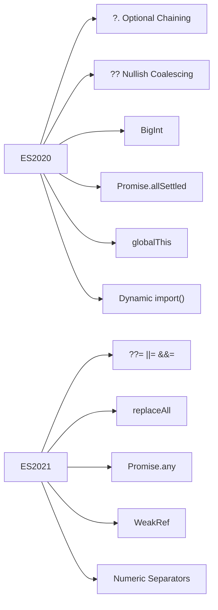
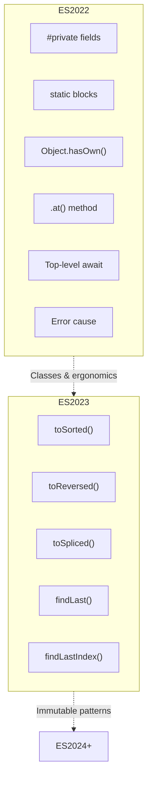
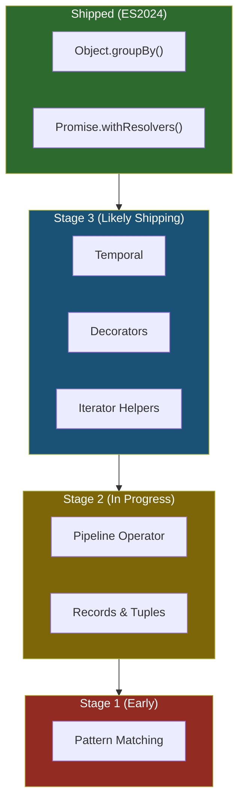

# Modern JavaScript: ES2020 Through ES2025

> The features shipped since 2020 and proposals shaping the next decade.

---

## Table of Contents

- [1. ES2020 and ES2021](#1-es2020-and-es2021)
- [2. ES2022 and ES2023](#2-es2022-and-es2023)
- [3. ES2024 and Beyond](#3-es2024-and-beyond)

---

## 1. ES2020 and ES2021

JavaScript moves fast now. Since the TC39 committee switched to yearly releases in 2015, every June brings a new batch of features. But the 2020-2021 era was special -- it filled in gaps that had frustrated developers for years. These were not flashy headline features; they were quality-of-life improvements that made everyday code shorter, safer, and more expressive.

### ES2020: The "Finally Safe" Release

**Optional chaining (`?.`)** is the single most impactful operator added to JavaScript since the arrow function. Before it, accessing deeply nested properties was a minefield:

```js
// Before: defensive programming nightmare
const street = user && user.address && user.address.street;

// After: one clean expression
const street = user?.address?.street; // undefined if any link is missing
```

It works on method calls too: `obj.doSomething?.()` calls the method only if it exists. This is not the same as a try/catch -- it returns `undefined` rather than throwing.

**Nullish coalescing (`??`)** is the companion to optional chaining. The classic `||` fallback has a well-known bug: it treats `0`, `""`, and `false` as falsy. The `??` operator only triggers on `null` or `undefined`:

```js
const port = config.port || 3000;  // Bug: port 0 becomes 3000
const port = config.port ?? 3000;  // Correct: only null/undefined trigger the default
```

> **Gotcha:** You cannot mix `??` with `||` or `&&` without parentheses. JavaScript throws a syntax error to prevent ambiguity. Write `(a ?? b) || c`, never `a ?? b || c`.

**BigInt** lets you work with integers beyond `Number.MAX_SAFE_INTEGER` (2^53 - 1). Append `n` to a literal or use the `BigInt()` constructor:

```js
const huge = 9007199254740993n; // Exact -- no floating-point drift
huge + 1n; // 9007199254740994n

// You cannot mix BigInt and Number
huge + 1; // TypeError -- this is intentional, not a bug
```

**`Promise.allSettled()`** solves a real problem. `Promise.all()` short-circuits on the first rejection, which means you lose the results of promises that did succeed. `allSettled` waits for every promise to finish and reports all outcomes:

```js
const results = await Promise.allSettled([
  fetch('/api/users'),
  fetch('/api/orders'),
  fetch('/api/inventory')
]);

// Every result has { status: 'fulfilled', value } or { status: 'rejected', reason }
const failures = results.filter(r => r.status === 'rejected');
```

**`globalThis`** finally gives us a universal reference to the global object. Before this, you needed `window` in browsers, `global` in Node, and `self` in web workers. Now `globalThis` works everywhere.

**Dynamic `import()`** turns module loading into an expression that returns a promise. This is the foundation of code splitting in every modern bundler:

```js
const module = await import('./heavy-chart-library.js');
module.renderChart(data);
```

### ES2021: Small but Mighty

**Logical assignment operators** (`??=`, `||=`, `&&=`) combine logic with assignment:

```js
// Old way
if (user.name === null || user.name === undefined) {
  user.name = 'Anonymous';
}

// New way
user.name ??= 'Anonymous';

// ||= assigns if the left side is falsy
opts.verbose ||= true;

// &&= assigns only if the left side is truthy
user.session &&= refreshSession(user.session);
```

**`String.prototype.replaceAll()`** does what the name says. Before this, you needed a regex with the global flag just to replace every occurrence of a substring:

```js
'a-b-c'.replace('-', '_');    // 'a_b-c' -- only the first match
'a-b-c'.replaceAll('-', '_'); // 'a_b_c' -- all matches
```

**`Promise.any()`** resolves with the first fulfilled promise (ignoring rejections). It is the optimistic counterpart to `Promise.race()`, which resolves or rejects with whichever promise settles first:

```js
// Race multiple CDNs -- use whichever responds first
const response = await Promise.any([
  fetch('https://cdn1.example.com/data.json'),
  fetch('https://cdn2.example.com/data.json'),
  fetch('https://cdn3.example.com/data.json')
]);
```

If every promise rejects, you get an `AggregateError` containing all the individual errors.

**`WeakRef`** and `FinalizationRegistry` give you low-level control over garbage collection. A `WeakRef` holds an object without preventing it from being collected:

```js
let cache = new WeakRef(expensiveObject);

// Later...
const obj = cache.deref(); // Returns the object, or undefined if it was collected
if (obj) {
  obj.doWork();
}
```

> **Warning:** Do not reach for `WeakRef` in application code. It is designed for library authors building caches and observables. The garbage collector makes no timing guarantees, so your `deref()` call might return `undefined` at any moment.

**Numeric separators** (`_`) make large numbers readable. They have zero runtime effect -- the engine strips them out:

```js
const billion = 1_000_000_000;
const bytes   = 0xFF_FF_FF_FF;
const bits    = 0b1010_0001_1000_0101;
```



---

## 2. ES2022 and ES2023

ES2022 was the year JavaScript classes finally became complete. The language had been shipping incomplete class features since 2015, and developers had been using naming conventions like `_privateField` as a workaround. No more. ES2023 then turned its attention to arrays, adding immutable alternatives to methods that had been mutating data in place since the beginning.

### ES2022: Classes Grow Up

**True private fields** use the `#` prefix. This is not a convention -- the engine enforces privacy. Accessing a `#` field from outside the class throws a hard syntax error, not a runtime error:

```js
class BankAccount {
  #balance = 0;

  deposit(amount) {
    if (amount <= 0) throw new Error('Amount must be positive');
    this.#balance += amount;
  }

  get balance() {
    return this.#balance;
  }
}

const account = new BankAccount();
account.deposit(100);
account.balance;   // 100 (through the getter)
account.#balance;  // SyntaxError -- truly private
```

You can also have private methods (`#validate()`) and private static fields (`static #instances = 0`).

**Static initialization blocks** let you run complex setup logic inside a class definition. Think of them as a constructor for the class itself, not for instances:

```js
class Database {
  static connection;

  static {
    try {
      Database.connection = connectToDatabase(process.env.DB_URL);
    } catch (e) {
      Database.connection = connectToFallback();
    }
  }
}
```

Without static blocks, you would have to put this initialization code outside the class body, splitting the definition across two locations.

**`Object.hasOwn()`** replaces the awkward `Object.prototype.hasOwnProperty.call(obj, key)` pattern:

```js
// Old way -- verbose and easy to get wrong
Object.prototype.hasOwnProperty.call(obj, 'name');

// New way
Object.hasOwn(obj, 'name'); // true or false
```

> **Why not `obj.hasOwnProperty()`?** Because an object created with `Object.create(null)` has no prototype, so calling methods on it throws. `Object.hasOwn()` is safe regardless of how the object was created.

**The `.at()` method** works on arrays, strings, and typed arrays. Its killer feature is negative indexing:

```js
const arr = ['a', 'b', 'c', 'd', 'e'];

arr.at(0);   // 'a'
arr.at(-1);  // 'e' -- last element
arr.at(-2);  // 'd'

// Before .at(), you had to write:
arr[arr.length - 1]; // 'e'
```

**Top-level `await`** lets you use `await` outside of an `async` function, but only in ES modules. This is a game-changer for scripts that need to fetch configuration before exporting anything:

```js
// config.mjs
const response = await fetch('/api/config');
export const config = await response.json();

// app.mjs
import { config } from './config.mjs'; // Waits for the fetch to complete
```

> **Gotcha:** Top-level `await` blocks the loading of any module that imports yours. Use it for genuinely asynchronous initialization, not for convenience. A slow top-level await in a deeply imported module can stall your entire application startup.

**`Error` cause** lets you chain errors. When you catch a low-level error and throw a higher-level one, you can now preserve the original:

```js
try {
  await fetch('/api/data');
} catch (err) {
  throw new Error('Failed to load dashboard data', { cause: err });
}

// The caller can inspect the chain:
// error.cause → the original fetch error
// error.cause.cause → even deeper, if applicable
```

This replaces ad-hoc patterns like `error.originalError = caught` and gives tooling a standard chain to walk.

### ES2023: Immutable Array Operations

JavaScript arrays have always mutated in place. `sort()` rearranges the original array. `reverse()` flips it. `splice()` tears pieces out. ES2023 added copying counterparts that return new arrays and leave the original untouched:

```js
const original = [3, 1, 4, 1, 5, 9];

// Mutating (old)
original.sort();       // original is now [1, 1, 3, 4, 5, 9]

// Non-mutating (new)
const sorted = original.toSorted();     // new array, original unchanged
const reversed = original.toReversed(); // new array, original unchanged
const spliced = original.toSpliced(2, 1, 99); // removes index 2, inserts 99
```

These are not just syntactic sugar. They eliminate an entire class of bugs where one part of your code sorts an array that another part was still iterating over.

**`findLast()` and `findLastIndex()`** search from the end of an array:

```js
const transactions = [
  { id: 1, type: 'deposit' },
  { id: 2, type: 'withdrawal' },
  { id: 3, type: 'deposit' },
  { id: 4, type: 'withdrawal' }
];

// Find the most recent withdrawal
const last = transactions.findLast(t => t.type === 'withdrawal');
// { id: 4, type: 'withdrawal' }
```

Before `findLast`, you had to reverse the array (creating a copy) and then use `find`, or write a manual loop counting backwards. Neither was readable.



---

## 3. ES2024 and Beyond

The JavaScript specification is a living document, and features move through a four-stage proposal process before they land. Stage 4 means the feature is finalized and will appear in the next edition of the spec. Stages 2 and 3 mean the feature is likely coming but the API might still change. Understanding this pipeline is essential -- you will see blog posts hyping stage-2 features that might never ship.

### ES2024: The Shipped Features

**`Object.groupBy()` and `Map.groupBy()`** are utility functions the language has needed since day one. Every project either pulls in Lodash's `_.groupBy` or writes it from scratch. Now it is built in:

```js
const inventory = [
  { name: 'apples',  type: 'fruit' },
  { name: 'bananas', type: 'fruit' },
  { name: 'carrots', type: 'vegetable' },
  { name: 'celery',  type: 'vegetable' }
];

const grouped = Object.groupBy(inventory, item => item.type);
// {
//   fruit: [{ name: 'apples', ... }, { name: 'bananas', ... }],
//   vegetable: [{ name: 'carrots', ... }, { name: 'celery', ... }]
// }
```

`Map.groupBy()` does the same thing but returns a `Map`, which is useful when your grouping keys are objects or other non-string values.

> **Note:** `Object.groupBy` is a static method, not an array method. This was a deliberate design choice to avoid prototype pollution concerns and to signal that the operation returns a plain object, not an array.

**`Promise.withResolvers()`** extracts the resolve and reject functions from a promise, eliminating the "deferred pattern" boilerplate:

```js
// Old way -- the awkward "deferred" pattern
let resolve, reject;
const promise = new Promise((res, rej) => {
  resolve = res;
  reject = rej;
});

// New way -- clean and direct
const { promise, resolve, reject } = Promise.withResolvers();

// Now you can pass resolve/reject to event handlers, callbacks, etc.
button.addEventListener('click', () => resolve('clicked'));
setTimeout(() => reject(new Error('Timeout')), 5000);
```

This is especially useful when bridging callback-based APIs with promise-based code, or when building custom async primitives like queues and semaphores.

### Proposals Shaping the Future

The following features are at various stages of the TC39 proposal process. None of them are guaranteed to ship in their current form, but they represent the direction the language is heading.

**Temporal** (Stage 3) is a complete replacement for the `Date` object -- and it is long overdue. `Date` has been broken since 1995: it mutates in place, has no time zone support, and month indices start at 0. Temporal introduces immutable, time-zone-aware types:

```js
// Temporal API (Stage 3 -- syntax may evolve)
const now = Temporal.Now.plainDateTimeISO();
const meeting = Temporal.PlainDateTime.from('2025-03-15T14:30:00');

// Duration arithmetic that actually works
const later = meeting.add({ hours: 1, minutes: 30 });

// Time zone conversions without pain
const zonedTime = Temporal.ZonedDateTime.from({
  timeZone: 'America/New_York',
  year: 2025, month: 3, day: 15,
  hour: 14, minute: 30
});

const tokyoTime = zonedTime.withTimeZone('Asia/Tokyo');
```

> **Why this matters:** Libraries like Moment.js and date-fns exist solely because `Date` is inadequate. Temporal will eventually make them unnecessary for most use cases.

**The Pipeline Operator (`|>`)** (Stage 2) brings a functional programming staple to JavaScript. It lets you chain function calls left-to-right instead of nesting them inside-out:

```js
// Without pipeline -- read inside-out
const result = capitalize(trim(removePunctuation(input)));

// With pipeline -- read left-to-right (Stage 2 "hack-style" proposal)
const result = input
  |> removePunctuation(%)
  |> trim(%)
  |> capitalize(%);
```

The `%` is the "topic token" -- it represents the value flowing through the pipeline. This proposal has been stuck at Stage 2 for a while because the committee is debating the exact syntax, but the concept has broad support.

**Records and Tuples** (Stage 2) introduce deeply immutable data structures. A Record is like a frozen object, and a Tuple is like a frozen array, but they are compared by value rather than by reference:

```js
// Records (immutable objects, compared by value)
const point1 = #{ x: 1, y: 2 };
const point2 = #{ x: 1, y: 2 };
point1 === point2; // true -- value equality, not reference equality

// Tuples (immutable arrays, compared by value)
const coord1 = #[1, 2, 3];
const coord2 = #[1, 2, 3];
coord1 === coord2; // true
```

This solves one of the deepest pain points in JavaScript: object comparison. Today, `{ x: 1 } === { x: 1 }` is `false` because objects are compared by reference. Records and Tuples would make value comparison a first-class concept.

**Pattern Matching** (Stage 1) brings `match` expressions that are far more powerful than `switch`:

```js
// Pattern matching (Stage 1 -- speculative syntax)
const describe = (response) => match (response) {
  when ({ status: 200, body }) -> `Success: ${body}`,
  when ({ status: 404 })       -> 'Not Found',
  when ({ status: 500, error }) -> `Server Error: ${error}`,
  when ({ status }) if (status >= 300 && status < 400) -> 'Redirect',
};
```

Pattern matching combines destructuring, type checking, and conditional logic into a single expression. If you have used pattern matching in Rust, Elixir, or Haskell, this is the same idea adapted to JavaScript's dynamic type system.

**Decorators** (Stage 3) provide a standard way to wrap and modify classes and their members. Frameworks like Angular and libraries like MobX have been using non-standard decorator syntax for years. The TC39 proposal standardizes the concept:

```js
// Decorators (Stage 3)
function logged(originalMethod, context) {
  return function (...args) {
    console.log(`Calling ${context.name} with`, args);
    return originalMethod.apply(this, args);
  };
}

class TaskRunner {
  @logged
  run(taskName) {
    // method body
  }
}
```

**Iterator Helpers** (Stage 3, shipping in engines) add `.map()`, `.filter()`, `.take()`, and `.drop()` to all iterators -- not just arrays. This means you can lazily transform generators and other iterable sources without converting them to arrays first:

```js
function* fibonacci() {
  let a = 0, b = 1;
  while (true) {
    yield a;
    [a, b] = [b, a + b];
  }
}

// Get the first 10 even Fibonacci numbers -- lazily evaluated
const evenFibs = fibonacci()
  .filter(n => n % 2 === 0)
  .take(10)
  .toArray();
// [0, 2, 8, 34, 144, 610, 2584, 10946, 46368, 196418]
```



> **Practical advice:** Use ES2020-ES2024 features today -- they are supported in all modern browsers and Node.js. For Stage 3 proposals, watch the compatibility tables and start experimenting in side projects. For Stage 1-2 proposals, follow the discussion but do not build production architecture around syntax that might change or be withdrawn entirely.