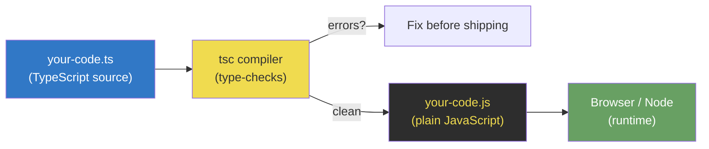
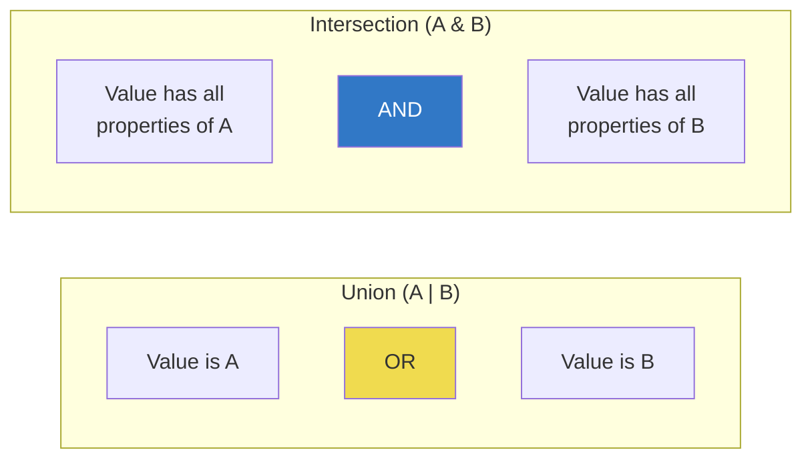
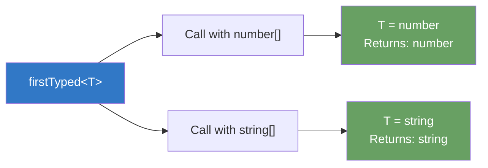
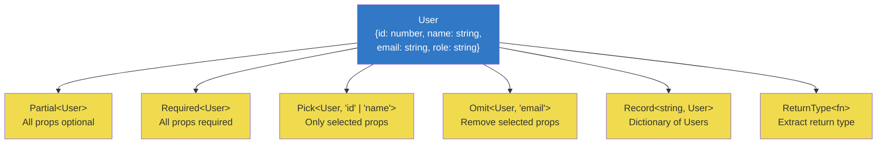
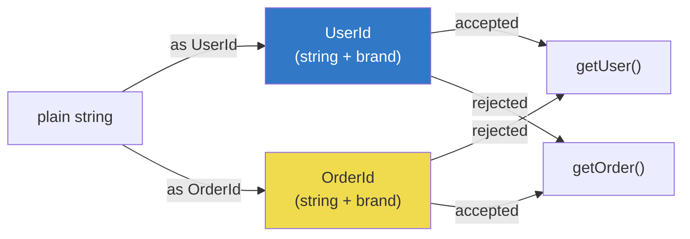
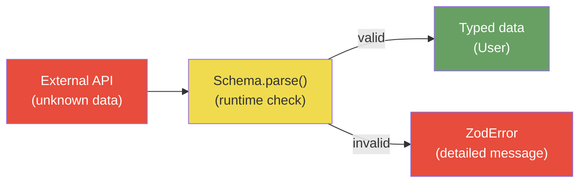

# TypeScript: JavaScript at Scale

> Static types, generics, utility types, and why production JS means TypeScript.

---

## Table of Contents

- [1. What TypeScript Adds](#1-what-typescript-adds)
- [2. Type System Fundamentals](#2-type-system-fundamentals)
- [3. Generics](#3-generics)
- [4. Utility Types](#4-utility-types)
- [5. Advanced TypeScript](#5-advanced-typescript)

---

## 1. What TypeScript Adds

JavaScript trusts you completely. It will happily let you subtract an array from a boolean, call a method on `undefined`, and pass four arguments to a function that expects two. It will not complain until runtime, and even then, only if that exact code path executes in production at 3 AM on a Saturday.

TypeScript exists because trust without verification is a liability at scale.

### The Core Idea

TypeScript is a **static type checker** that runs *before* your code executes. It reads your JavaScript, infers (or accepts explicit) types, and flags contradictions. Then it **strips every type annotation away** and emits plain JavaScript. Your runtime never sees a single TypeScript-specific character.



This is the fundamental contract: **types exist at compile time only**. There is no runtime type enforcement. A `string` type annotation does not generate a `typeof` check in the output. This matters enormously when you're dealing with data from APIs, user input, or anything else you don't control — we'll address that gap in Section 5.

### What You Actually Get

**Catch bugs before they run.** The most boring benefit is the most valuable. TypeScript catches misspelled property names, incorrect function arguments, impossible state shapes, and null access — all before a single user encounters them.

```js
// TypeScript catches this immediately
const user = { name: "Alice", age: 30 };
console.log(user.nme);
//               ^^^ Property 'nme' does not exist on type '{ name: string; age: number; }'
```

**Self-documenting code.** Types are documentation that cannot go stale. A function signature tells you exactly what goes in and what comes out, and the compiler enforces that contract with every change.

```js
// Without types: what does this return? What's "options"? Hope the README is current.
function fetchUsers(options) { /* ... */ }

// With types: the signature IS the documentation
function fetchUsers(options: {
  page: number;
  limit: number;
  role?: "admin" | "user";
}): Promise<User[]> { /* ... */ }
```

**Refactoring confidence.** Rename a property, and TypeScript shows you every file that breaks. Change a function's return type, and every consumer that assumed the old shape lights up. This is the difference between "refactoring" and "introducing 47 bugs."

**Editor intelligence.** Autocomplete, inline errors, go-to-definition, and rename-symbol all become precise rather than heuristic. This isn't a nice-to-have — it changes how fast you write code.

### Inference Does the Heavy Lifting

A common misconception is that TypeScript means annotating everything. In practice, TypeScript's **type inference** is remarkably good. You annotate function parameters and return types; the compiler figures out the rest.

```js
// You don't need to annotate any of this
const count = 42;                    // inferred as number
const names = ["Alice", "Bob"];      // inferred as string[]
const doubled = names.map(n => n.toUpperCase()); // inferred as string[]

// You DO annotate function boundaries — this is the contract
function add(a: number, b: number): number {
  return a + b;
}
```

> **Rule of thumb:** Annotate function signatures (inputs and outputs). Let inference handle local variables, expressions, and intermediate values. If you're annotating everything, you're working too hard.

### TypeScript Is Not a Different Language

TypeScript is a **superset** of JavaScript. Every valid JavaScript file is valid TypeScript (with sufficiently loose settings). You can adopt it incrementally: rename `.js` to `.ts`, fix the errors, and move on. You don't rewrite anything. You add precision to what already exists.

This is why saying "I'll learn TypeScript later" makes less sense than it sounds. TypeScript *is* JavaScript — with a compiler that catches your mistakes before your users do.

---

## 2. Type System Fundamentals

TypeScript's type system is **structural**, not nominal. It doesn't care what you *name* a type — it cares what *shape* it has. Two types with identical structures are interchangeable, regardless of whether they share a declaration. This is the single most important concept to internalize, and it shapes every decision the language makes.

### Primitives and Literals

The primitive types map directly to JavaScript's runtime values:

```js
let name: string = "Alice";
let age: number = 30;
let active: boolean = true;
let nothing: null = null;
let missing: undefined = undefined;
let id: bigint = 9007199254740993n;
let key: symbol = Symbol("key");
```

But TypeScript goes further with **literal types** — a type that is a *specific value*, not just a category:

```js
let direction: "north" | "south" | "east" | "west";
direction = "north"; // fine
direction = "up";    // Error: Type '"up"' is not assignable

let httpStatus: 200 | 404 | 500;
httpStatus = 200;    // fine
httpStatus = 302;    // Error
```

Literal types are the foundation of TypeScript's power. They let you model *exact* values, not just broad categories.

> **Gotcha:** `const` declarations infer literal types, `let` declarations infer wide types. `const x = "hello"` gives type `"hello"`. `let x = "hello"` gives type `string`. This is because `let` can be reassigned — the compiler assumes it will be.

### Unions and Intersections

**Unions** (`|`) mean "one of these types." **Intersections** (`&`) mean "all of these types combined."

```js
// Union: either a string or a number
type ID = string | number;

// Intersection: both types merged
type Timestamped = { createdAt: Date };
type Named = { name: string };
type TimestampedUser = Timestamped & Named;
// Result: { createdAt: Date; name: string }
```



### Interfaces vs Type Aliases

This is the question every TypeScript developer asks first. Here is the honest answer:

```js
// Interface: describes an object shape. Can be extended and merged.
interface User {
  id: number;
  name: string;
}

interface AdminUser extends User {
  permissions: string[];
}

// Type alias: names any type expression. More flexible.
type ID = string | number;           // Can't do this with interface
type Coordinate = [number, number];  // Can't do this with interface
type Handler = (event: Event) => void;

// For objects, either works:
type Product = {
  id: number;
  name: string;
};
```

**Use `interface` for object shapes that might be extended.** Use `type` for unions, tuples, primitives, and computed types. In practice, `type` handles more situations. Pick one convention for your team and be consistent.

> **Gotcha:** Interfaces support **declaration merging** — if you declare the same interface name twice, TypeScript merges them. This is useful for extending third-party types, but it can also cause accidental merges that are extremely hard to debug.

### Narrowing: Making the Compiler Smarter

TypeScript tracks control flow. When you check a type at runtime, TypeScript narrows the type in that branch:

```js
function formatValue(value: string | number): string {
  if (typeof value === "string") {
    // TypeScript knows: value is string here
    return value.toUpperCase();
  }
  // TypeScript knows: value is number here
  return value.toFixed(2);
}
```

Narrowing works with `typeof`, `instanceof`, `in`, equality checks, and **discriminated unions** — the most useful pattern in TypeScript:

```js
type Shape =
  | { kind: "circle"; radius: number }
  | { kind: "rectangle"; width: number; height: number };

function area(shape: Shape): number {
  switch (shape.kind) {
    case "circle":
      // TypeScript knows: shape is { kind: "circle"; radius: number }
      return Math.PI * shape.radius ** 2;
    case "rectangle":
      // TypeScript knows: shape is { kind: "rectangle"; width: number; height: number }
      return shape.width * shape.height;
  }
}
```

The `kind` property is the **discriminant** — a literal type that uniquely identifies each variant. This pattern is how you model state machines, API responses, and any scenario with mutually exclusive shapes.

### Type Assertions: `as` and `satisfies`

Sometimes you know more than the compiler. Type assertions let you override inference:

```js
// "as" overrides the type entirely
const input = document.getElementById("email") as HTMLInputElement;
input.value = "alice@example.com"; // fine, we asserted it's an input

// "satisfies" checks the type WITHOUT widening
const config = {
  port: 3000,
  host: "localhost",
  debug: true,
} satisfies Record<string, string | number | boolean>;

// config.port is still inferred as number (not string | number | boolean)
// but TypeScript verified the shape matches the constraint
```

> **Prefer `satisfies` over `as`.** The `as` keyword silences the compiler — you lose safety. `satisfies` validates the type while preserving the narrower inferred type. It is the assertion you actually want 90% of the time.

> **Never use `as any`.** It is a fire extinguisher that also disables the smoke alarm. If you need it, you have a type design problem worth solving instead.

---

## 3. Generics

Generics are type-level **parameters**. They let you write functions, classes, and types that work with *any* type while preserving exact type information. Without generics, you'd either lose type safety (using `any`) or duplicate code for every type variant.

### The Core Intuition

Think of a generic as a **function for types**. A regular function takes a value and returns a value. A generic takes a type and returns a type.

```js
// Without generics: you lose type information
function first(arr: any[]): any {
  return arr[0];
}
const val = first([1, 2, 3]); // val is "any" — useless

// With generics: type flows through
function firstTyped<T>(arr: T[]): T {
  return arr[0];
}
const num = firstTyped([1, 2, 3]);       // num is number
const str = firstTyped(["a", "b", "c"]); // str is string
```



The `<T>` is a **type parameter** — a placeholder that gets filled in when the function is called. TypeScript infers `T` from the arguments, so you rarely need to specify it explicitly.

### Constraints: Limiting What T Can Be

Unconstrained generics accept anything, which means you can't assume anything about `T` inside the function. **Constraints** narrow what `T` must look like:

```js
// T must have a "length" property
function longest<T extends { length: number }>(a: T, b: T): T {
  return a.length >= b.length ? a : b;
}

longest("alice", "bob");     // works: strings have length
longest([1, 2], [1, 2, 3]); // works: arrays have length
longest(10, 20);             // Error: number doesn't have length
```

The `extends` keyword in generics means "must be assignable to" — it's a constraint, not inheritance.

### Defaults: Sensible Fallbacks

Generic parameters can have defaults, just like function parameters:

```js
type ApiResponse<TData = unknown, TError = Error> = {
  data: TData | null;
  error: TError | null;
  status: number;
};

// Use with specific types
const userResponse: ApiResponse<User> = { data: user, error: null, status: 200 };

// Use with defaults
const genericResponse: ApiResponse = { data: null, error: new Error("fail"), status: 500 };
```

### Conditional Types: Type-Level If/Else

Conditional types let you choose between types based on a condition. The syntax mirrors the ternary operator:

```js
// If T is a string, result is true; otherwise false
type IsString<T> = T extends string ? true : false;

type A = IsString<"hello">; // true
type B = IsString<42>;      // false
```

This becomes powerful when combined with `infer` — a keyword that extracts types from within a pattern:

```js
// Extract the return type of a function
type MyReturnType<T> = T extends (...args: any[]) => infer R ? R : never;

type A = MyReturnType<() => string>;           // string
type B = MyReturnType<(x: number) => boolean>; // boolean
```

> `infer` is pattern matching for types. It says "I don't know what this type is yet, but capture it as R and let me use it."

### Mapped Types: Transforming Shapes

Mapped types iterate over the keys of an existing type and produce a new type:

```js
// Make every property optional
type MyPartial<T> = {
  [K in keyof T]?: T[K];
};

// Make every property readonly
type MyReadonly<T> = {
  readonly [K in keyof T]: T[K];
};

// Make every property a string
type Stringify<T> = {
  [K in keyof T]: string;
};

interface User {
  id: number;
  name: string;
  active: boolean;
}

type StringUser = Stringify<User>;
// { id: string; name: string; active: string }
```

The pattern `[K in keyof T]` loops over every key in `T`. You can filter, transform, or remap keys — this is how TypeScript's built-in utility types work under the hood.

### Template Literal Types

TypeScript can compute string types:

```js
type EventName = "click" | "focus" | "blur";
type Handler = `on${Capitalize<EventName>}`;
// "onClick" | "onFocus" | "onBlur"

type HTTPMethod = "GET" | "POST" | "PUT" | "DELETE";
type Endpoint = `/api/${"users" | "posts"}`;
// "/api/users" | "/api/posts"
```

This lets you model string-based APIs (CSS properties, event names, route paths) with full type safety. Libraries like Express route handlers and CSS-in-JS systems use these extensively.

---

## 4. Utility Types

TypeScript ships with a library of built-in utility types that transform existing types. These are not magic — they're all built from generics, mapped types, and conditional types. Understanding them means understanding the patterns from Section 3 in practice.

### The Essential Six

These six utility types cover 90% of real-world type transformations:



### Partial and Required

`Partial<T>` makes every property optional. `Required<T>` makes every property required. They're inverses.

```js
interface User {
  id: number;
  name: string;
  email: string;
  bio?: string;
}

// Partial: useful for update operations where you send only changed fields
function updateUser(id: number, changes: Partial<User>): void {
  // changes can be { name: "Alice" } or { email: "new@email.com" } or any subset
}

updateUser(1, { name: "Alice" });          // fine
updateUser(1, { name: "Alice", bio: "..." }); // fine
updateUser(1, {});                          // also fine (nothing to update)

// Required: forces all optional properties to be present
type CompleteUser = Required<User>;
// { id: number; name: string; email: string; bio: string }
// bio is no longer optional
```

### Pick and Omit

`Pick<T, Keys>` selects specific properties. `Omit<T, Keys>` removes them. They're also inverses.

```js
interface Article {
  id: number;
  title: string;
  body: string;
  authorId: number;
  createdAt: Date;
  updatedAt: Date;
}

// Pick: extract only what a list view needs
type ArticlePreview = Pick<Article, "id" | "title" | "createdAt">;
// { id: number; title: string; createdAt: Date }

// Omit: everything except internal fields
type ArticleInput = Omit<Article, "id" | "createdAt" | "updatedAt">;
// { title: string; body: string; authorId: number }
```

> **Real-world pattern:** API responses often have more fields than you want to expose to the UI. `Pick` defines your view model. Form inputs often exclude auto-generated fields. `Omit` defines your creation type.

### Record

`Record<Keys, Value>` creates an object type where every key has the same value type:

```js
// Simple dictionary
type UserMap = Record<string, User>;
const users: UserMap = {
  alice: { id: 1, name: "Alice", email: "a@b.com" },
  bob: { id: 2, name: "Bob", email: "b@b.com" },
};

// Enum-like mapping: ensure every status has a config
type Status = "idle" | "loading" | "success" | "error";
type StatusConfig = Record<Status, { color: string; message: string }>;

const statusMap: StatusConfig = {
  idle: { color: "gray", message: "Waiting..." },
  loading: { color: "blue", message: "Loading..." },
  success: { color: "green", message: "Done!" },
  error: { color: "red", message: "Failed." },
  // If you forget one, TypeScript complains
};
```

`Record` with a union key type is one of the most underused patterns. It guarantees exhaustive coverage — if you add a new status, the compiler forces you to handle it everywhere a `StatusConfig` is used.

### ReturnType and Parameters

These extract type information from functions:

```js
function createUser(name: string, age: number) {
  return { id: Math.random(), name, age, createdAt: new Date() };
}

type NewUser = ReturnType<typeof createUser>;
// { id: number; name: string; age: number; createdAt: Date }

type CreateUserArgs = Parameters<typeof createUser>;
// [string, number]
```

> **Why this matters:** When a function's return type is complex or computed, `ReturnType` lets you derive a type from the implementation rather than duplicating it. The function is the single source of truth.

### Composing Utility Types

The real power comes from combining them:

```js
interface User {
  id: number;
  name: string;
  email: string;
  role: "admin" | "user";
  lastLogin: Date;
}

// A form for editing profile: only name and email, both optional
type ProfileForm = Partial<Pick<User, "name" | "email">>;
// { name?: string; email?: string }

// A readonly version for display
type UserDisplay = Readonly<Omit<User, "lastLogin">>;
// { readonly id: number; readonly name: string; readonly email: string; readonly role: "admin" | "user" }

// API response wrapper
type ApiList<T> = {
  items: T[];
  total: number;
  page: number;
};
type UserListResponse = ApiList<Pick<User, "id" | "name" | "role">>;
```

Think of utility types as Lego blocks. Each one does a simple transformation. Chain them to build exactly the type shape your context requires, derived from a single source-of-truth type definition.

---

## 5. Advanced TypeScript

This section covers patterns you'll encounter in library code, framework internals, and production codebases that have outgrown the basics. These aren't academic exercises — they solve real problems that simpler approaches can't handle.

### Recursive Conditional Types

Conditional types can reference themselves, enabling operations on arbitrarily nested structures:

```js
// Deeply make every property optional, recursively
type DeepPartial<T> = T extends object
  ? { [K in keyof T]?: DeepPartial<T[K]> }
  : T;

interface Config {
  database: {
    host: string;
    port: number;
    credentials: {
      user: string;
      password: string;
    };
  };
  logging: {
    level: "debug" | "info" | "error";
  };
}

// Every nested property becomes optional
type PartialConfig = DeepPartial<Config>;
// Now you can pass { database: { port: 5432 } } without filling in every field
```

This pattern is how libraries like `lodash` type `_.merge`, and how ORMs type partial update queries. The recursion terminates when `T` is no longer an object (primitives pass through unchanged).

### Branded Types: Nominal Typing in a Structural System

TypeScript's structural typing means a `string` is a `string` — the compiler can't distinguish a `UserId` from an `Email` if both are strings. **Branded types** add a phantom property to create nominally distinct types:

```js
// Create a "brand" that exists only at the type level
type Brand<T, B extends string> = T & { readonly __brand: B };

type UserId = Brand<string, "UserId">;
type OrderId = Brand<string, "OrderId">;

function getUser(id: UserId): User { /* ... */ }
function getOrder(id: OrderId): Order { /* ... */ }

// You can't accidentally mix them
const userId = "usr_123" as UserId;
const orderId = "ord_456" as OrderId;

getUser(userId);    // fine
getUser(orderId);   // Error: OrderId is not assignable to UserId
getUser("random");  // Error: string is not assignable to UserId
```



The `__brand` property never exists at runtime — it's a compile-time fiction. But it prevents the entire category of "passed the wrong ID to the wrong function" bugs that are otherwise invisible in a structural type system.

### tsconfig: The `strict` Flag and Friends

Your `tsconfig.json` determines how aggressively TypeScript checks your code. The `strict` flag is a shorthand for enabling multiple strict checks at once:

```js
// tsconfig.json — the non-negotiable starting point
{
  "compilerOptions": {
    "strict": true,              // enables ALL strict checks
    "target": "ES2022",          // output modern JavaScript
    "module": "ESNext",          // use ES modules
    "moduleResolution": "bundler", // for Vite, webpack, etc.
    "esModuleInterop": true,     // sane import behavior
    "skipLibCheck": true,        // skip checking node_modules types
    "noUncheckedIndexedAccess": true  // treat obj[key] as possibly undefined
  }
}
```

What `strict: true` enables:

- **`strictNullChecks`**: `null` and `undefined` are not assignable to other types. This alone catches more bugs than every other flag combined.
- **`noImplicitAny`**: Forces you to type things the compiler can't infer. No silent `any` leaks.
- **`strictFunctionTypes`**: Enforces correct function parameter variance.
- **`strictPropertyInitialization`**: Class properties must be initialized.

> **Non-negotiable opinion:** Never start a project without `strict: true`. Turning it on later in a large codebase is a multi-week migration. Starting with it costs nothing.

The `noUncheckedIndexedAccess` flag deserves special mention. Without it, `Record<string, User>` tells TypeScript that *every* key access returns a `User`. With it, every key access returns `User | undefined`, forcing you to handle the missing case. Enable it. Always.

### Runtime Validation: Closing the Type Gap

TypeScript's types evaporate at runtime. When data crosses a **trust boundary** — an API response, a URL parameter, a file read, a WebSocket message — TypeScript has no way to verify it matches your types. You need runtime validation.

**Zod** and **Valibot** are schema libraries that validate data at runtime and infer TypeScript types from the schema:

```js
import { z } from "zod";

// Define the schema once — it's both runtime validation AND a TypeScript type
const UserSchema = z.object({
  id: z.number(),
  name: z.string().min(1),
  email: z.string().email(),
  role: z.enum(["admin", "user"]),
});

// Infer the TypeScript type from the schema
type User = z.infer<typeof UserSchema>;
// { id: number; name: string; email: string; role: "admin" | "user" }

// Validate at trust boundaries
async function fetchUser(id: number): Promise<User> {
  const response = await fetch(`/api/users/${id}`);
  const data = await response.json();

  // This ACTUALLY checks the data at runtime
  return UserSchema.parse(data);
  // Throws ZodError if the API returns unexpected shape
}
```



The key insight is **single source of truth**: the Zod schema defines both the runtime validation and the TypeScript type. You never have a type definition that disagrees with its validation logic, because they're the same object.

> **Valibot** is a lighter alternative to Zod with a tree-shakeable, function-based API. If bundle size matters (frontend apps), evaluate Valibot. If you want the largest ecosystem and most documentation, Zod is the default choice.

### When to Use What

| Pattern | Use When |
|---------|----------|
| Branded types | Same primitive type, different semantic meaning (IDs, currencies, units) |
| Recursive conditionals | Operating on deeply nested structures generically |
| `satisfies` | Validating a value matches a type without widening inference |
| Zod/Valibot | Any data from outside your program (APIs, forms, files, environment variables) |
| `strict: true` | Always. Every project. No exceptions. |

TypeScript's advanced features exist because JavaScript codebases hit real walls at scale. Branded types prevent ID mixups that cause data corruption. Runtime validation catches API contract violations before they cascade through your app. Strict mode catches the null reference errors that account for a staggering percentage of production bugs. These aren't theoretical — they're the tools that make large-scale JavaScript development survivable.