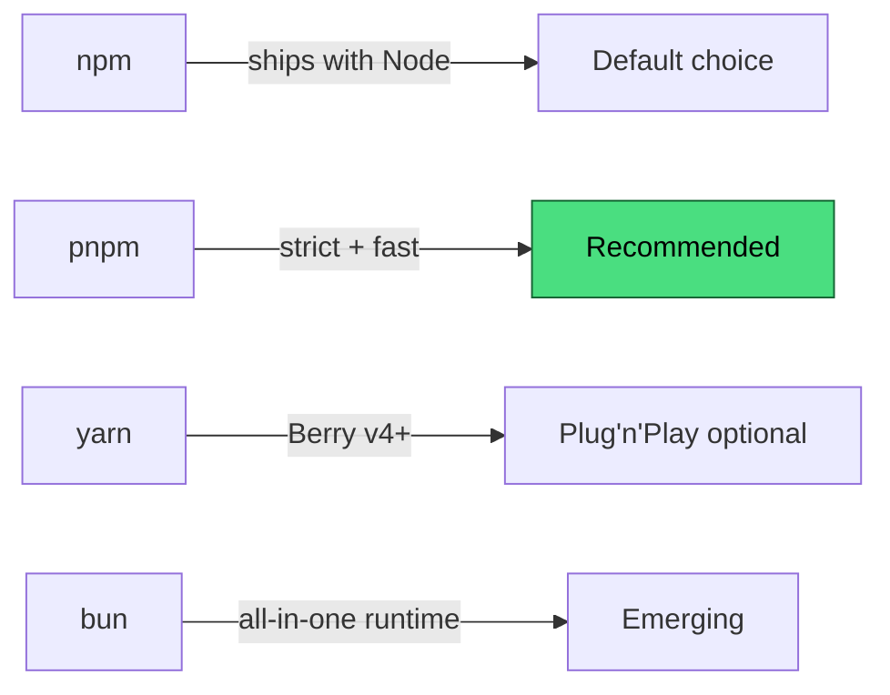
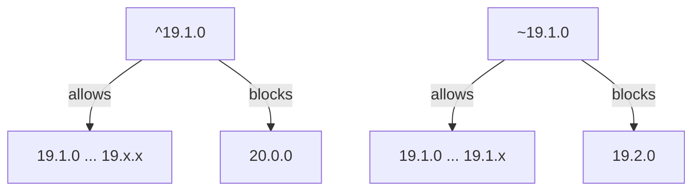
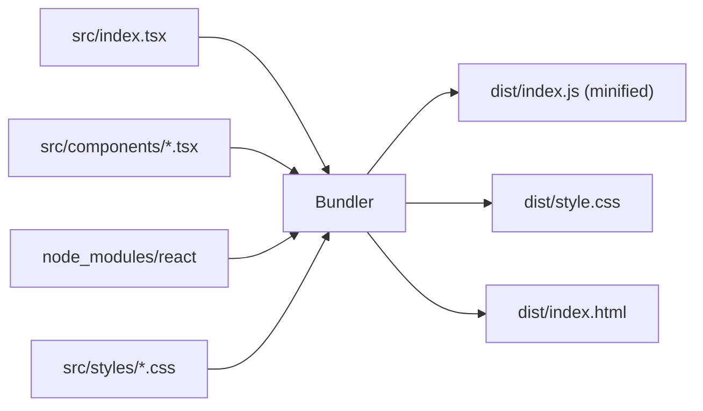
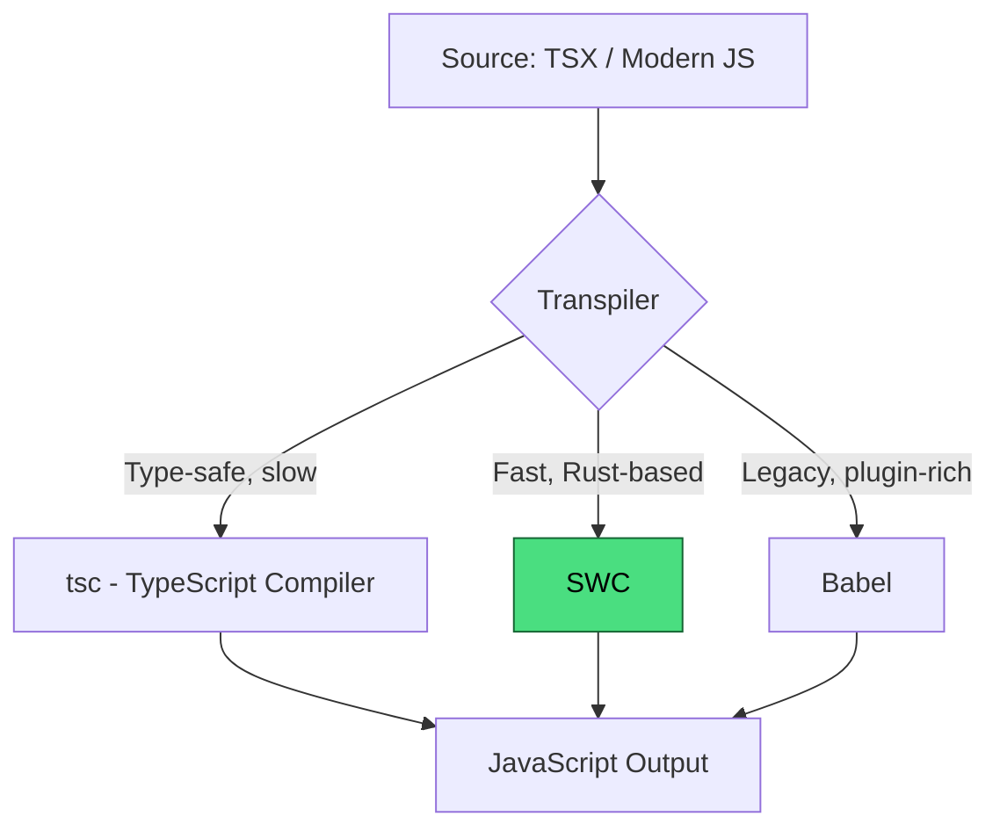
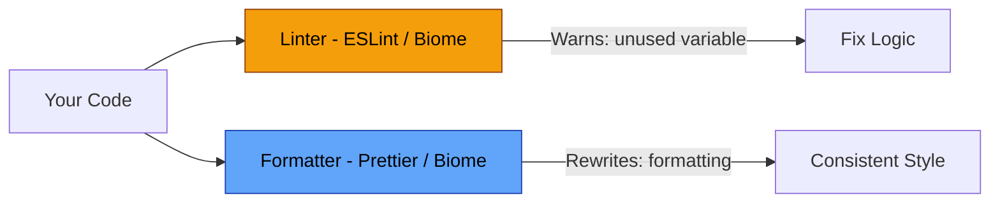
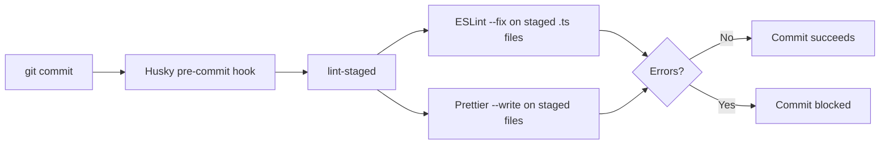
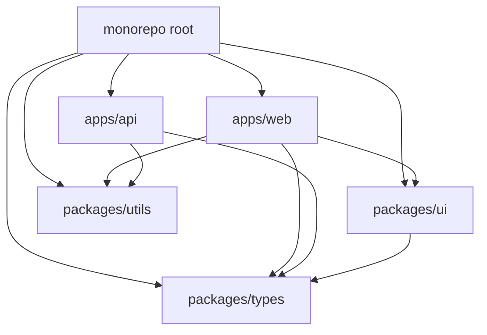
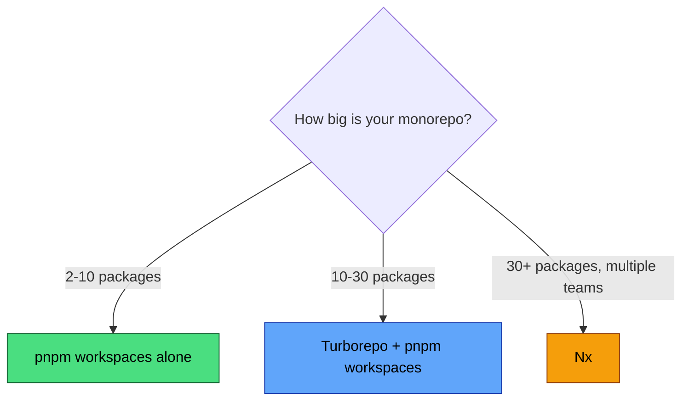

# Tooling and Build: The JavaScript Development Stack

> Package managers, bundlers, linters, formatters, and the tools that turn source into production.

---

## Table of Contents

- [1. Package Managers](#1-package-managers)
- [2. Bundlers](#2-bundlers)
- [3. Linters and Formatters](#3-linters-and-formatters)
- [4. Monorepo Tools](#4-monorepo-tools)

---

## 1. Package Managers

A package manager is the supply chain of your project. It fetches libraries from registries, resolves version conflicts, and locks everything down so your teammate's machine builds the same thing yours does. Get this wrong and you get phantom bugs that only appear in CI or on someone else's laptop.

### The Landscape



**npm** comes free with every Node.js install. It works. It is also the slowest of the four, and its `node_modules` structure allows "phantom dependencies" --- packages you never declared but can still import because a dependency of a dependency hoisted them. This leads to code that works on your machine but breaks when a transitive dependency updates.

**pnpm** (our recommendation) solves this with a content-addressable store and strict symlinks. Every package lives in a global store once, and each project gets symlinks to exactly the versions it declared. No phantom dependencies. Installs are fast because identical packages across projects share disk space.

```bash
# Install pnpm globally
npm install -g pnpm

# Start a new project
pnpm init
pnpm add react react-dom
pnpm add -D typescript @types/react

# The lockfile is pnpm-lock.yaml --- commit it
```

**yarn** (Berry / v4+) introduced Plug'n'Play, which eliminates `node_modules` entirely by patching Node's resolution. It is clever, but PnP breaks tools that assume `node_modules` exists. You can disable PnP and use `node_modules` mode, at which point yarn behaves a lot like pnpm.

**bun** is a runtime, package manager, bundler, and test runner in one binary. It is blazing fast because it is written in Zig and skips npm's resolution algorithm in favor of its own. The tradeoff: it is younger, and edge cases still surface. Great for new side projects, risky for large production codebases --- today.

### The Lockfile Is Sacred

Every package manager generates a lockfile (`package-lock.json`, `pnpm-lock.yaml`, `yarn.lock`, `bun.lockb`). This file pins exact versions. **Commit it. Never `.gitignore` it.** Without it, `install` becomes non-deterministic.

> **Gotcha:** Never mix package managers in the same project. If you see both a `package-lock.json` and a `pnpm-lock.yaml` in a repo, one of them is lying. Pick one manager and add a `preinstall` script that enforces it.

```json
{
  "scripts": {
    "preinstall": "npx only-allow pnpm"
  }
}
```

### Dependencies vs. DevDependencies

This distinction matters more than people think. `dependencies` ship to production. `devDependencies` are build-time only --- linters, test runners, type checkers. If you put `eslint` in `dependencies`, your Docker image gets heavier for no reason. If you put `express` in `devDependencies`, your production server crashes.

```bash
pnpm add express            # runtime dependency
pnpm add -D eslint prettier # dev-only
```

### Version Ranges and `^` vs `~`

When you `pnpm add react`, your `package.json` gets `"react": "^19.1.0"`. That caret means "any version compatible with 19.1.0" --- so `19.2.0` is fine, but `20.0.0` is not. The tilde (`~19.1.0`) is stricter: only patch updates (`19.1.1`, `19.1.2`). For most libraries, caret is fine because the lockfile pins the exact version anyway. The range only matters when you run `pnpm update`.



> **Rule of thumb:** Use pnpm. Commit your lockfile. Enforce your package manager choice. Separate runtime dependencies from dev dependencies. Everything else is a detail.

---

## 2. Bundlers

Browsers do not understand your `import` statements the way Node does. They cannot resolve `node_modules`. They do not know what `.tsx` means. A bundler takes your source tree --- hundreds of modules, JSX files, CSS imports, images --- and produces optimized files a browser can actually load.

### Why Bundling Exists



Without a bundler, you would need to ship thousands of individual files and manage their load order manually. Bundling also enables tree-shaking (removing unused code), code-splitting (loading only what the current page needs), and minification (shrinking file size).

### Vite: The Default Choice

Vite is the bundler you should reach for first. It uses **esbuild** for development (near-instant hot module replacement) and **Rollup** for production builds (battle-tested optimization). This split gives you the best of both worlds: speed during development, reliability in production.

```bash
pnpm create vite my-app --template react-ts
cd my-app
pnpm install
pnpm dev   # dev server with HMR
pnpm build # production build to dist/
```

Vite's config is minimal by design:

```js
// vite.config.ts
import { defineConfig } from "vite";
import react from "@vitejs/plugin-react";

export default defineConfig({
  plugins: [react()],
  build: {
    sourcemap: true, // always enable for debugging production issues
  },
});
```

> **Why not Webpack?** Webpack dominated for a decade and still powers enormous codebases. But its configuration is notoriously complex, its dev server is slower, and its plugin ecosystem carries years of cruft. If you are starting a new project in 2026, there is no reason to choose Webpack. If you are maintaining a legacy Webpack project, migrating to Vite is usually worth the effort.

### esbuild: The Speed Demon

esbuild is written in Go and is 10-100x faster than JavaScript-based bundlers. Vite uses it under the hood for dev transforms, but you can also use it directly for simple builds --- API servers, CLI tools, or libraries that do not need Rollup's advanced chunking.

```bash
pnpm add -D esbuild

# Bundle a Node.js CLI tool
npx esbuild src/cli.ts --bundle --platform=node --outfile=dist/cli.js
```

esbuild's limitation: it does not do type checking. It strips types and moves on. That is intentional --- type checking is tsc's job (we will cover this in section 3).

### Rollup: The Library Bundler

Rollup produces the cleanest output of any bundler. It was designed for libraries, not applications. If you are publishing an npm package, Rollup (often via Vite's library mode) gives you tree-shakeable ESM output that consumers can optimize further.

### Turbopack: The Next.js Path

Turbopack is Vercel's Rust-based bundler, designed as Webpack's successor for Next.js. As of 2026, it is stable for development in Next.js but not yet a general-purpose tool. If you use Next.js, you get Turbopack automatically. If you do not, Vite is the better choice.

### Transpilers: tsc, SWC, and Babel

A bundler often delegates the actual code transformation to a transpiler:



**tsc** is authoritative for type checking but slow for transpilation. Use it for checking, not building.

**SWC** is a Rust-based transpiler that handles TypeScript and JSX at extreme speed. Vite's React plugin uses SWC by default. Next.js uses SWC. It is the de facto standard for fast builds.

**Babel** was the original transpiler that brought modern JavaScript to older browsers. It has a rich plugin ecosystem (decorators, legacy proposals), but it is JavaScript-based and slower. You only need Babel if you depend on a Babel-specific plugin that SWC does not support yet.

> **The modern split:** Use SWC (via Vite or Next.js) for fast transpilation. Use `tsc --noEmit` separately for type checking. This gives you speed and safety without coupling them.

---

## 3. Linters and Formatters

Linters find bugs. Formatters fix style. They sound similar but serve fundamentally different purposes, and conflating them causes endless friction on teams.

A **linter** analyzes your code for logical problems: unused variables, missing `await`, unsafe type coercions, accessibility violations. It says "this code might be wrong."

A **formatter** rewrites your code to match a consistent style: indentation, semicolons, trailing commas, line width. It says "this code should look like this."



### ESLint: The Standard Linter

ESLint has been the JavaScript linter for over a decade. In 2024, it moved to **flat config** (`eslint.config.js`), replacing the old `.eslintrc` cascade. If you are starting a new project, use flat config exclusively.

```js
// eslint.config.js
import js from "@eslint/js";
import tseslint from "typescript-eslint";
import reactPlugin from "eslint-plugin-react";

export default tseslint.config(
  js.configs.recommended,
  ...tseslint.configs.strictTypeChecked,
  {
    plugins: { react: reactPlugin },
    rules: {
      "no-console": "warn",
      "@typescript-eslint/no-floating-promises": "error", // catch unhandled promises
    },
    languageOptions: {
      parserOptions: {
        projectService: true, // enable type-aware linting
      },
    },
  },
  {
    ignores: ["dist/", "node_modules/"],
  }
);
```

> **Gotcha:** ESLint's old config format (`.eslintrc.json`, `.eslintrc.js` with `module.exports`) is deprecated. Do not use it for new projects. Flat config is simpler, explicit, and composable.

### Prettier: The Opinionated Formatter

Prettier formats your code and gives you almost no options. That is the point. Teams stop arguing about tabs versus spaces because Prettier already decided. It handles JavaScript, TypeScript, CSS, HTML, JSON, Markdown, and more.

```bash
pnpm add -D prettier

# Format everything
npx prettier --write .
```

```json
// .prettierrc (keep it minimal)
{
  "semi": true,
  "singleQuote": false,
  "trailingComma": "all",
  "printWidth": 80
}
```

The critical rule: **do not use ESLint for formatting.** The old `eslint-plugin-prettier` and `eslint-config-prettier` dance is over. Let ESLint lint. Let Prettier format. They do not overlap if you keep them separate.

### Biome: The All-in-One Alternative

Biome (formerly Rome) is a single Rust-based tool that lints *and* formats. It is dramatically faster than ESLint + Prettier because it parses your code once instead of twice and does not run in a JavaScript runtime.

```bash
pnpm add -D @biomejs/biome
npx biome init  # generates biome.json

# Lint and format in one command
npx biome check --write .
```

```json
// biome.json
{
  "linter": {
    "enabled": true,
    "rules": {
      "recommended": true,
      "suspicious": {
        "noExplicitAny": "error"
      }
    }
  },
  "formatter": {
    "enabled": true,
    "indentStyle": "space",
    "indentWidth": 2
  }
}
```

Biome's tradeoff: it has fewer rules and plugins than ESLint. If you need type-aware linting (`@typescript-eslint/no-floating-promises`), you still need ESLint with `typescript-eslint`. Biome is excellent for projects that want speed and simplicity and can live within its rule set.

> **Our recommendation:** For most teams, ESLint (flat config, type-aware) + Prettier is the safe choice. For smaller projects or teams that value speed and simplicity, Biome is compelling. Either way, pick one approach and enforce it.

### Type Checking in CI: `tsc --noEmit`

Your bundler (Vite, esbuild, SWC) strips types --- it does not check them. If you skip type checking, you can ship TypeScript that compiles to broken JavaScript. The fix: run `tsc --noEmit` in CI.

```json
{
  "scripts": {
    "typecheck": "tsc --noEmit",
    "lint": "eslint .",
    "format:check": "prettier --check .",
    "ci": "pnpm typecheck && pnpm lint && pnpm format:check"
  }
}
```

`--noEmit` tells TypeScript to check types without producing output files. It is fast enough for CI and catches the errors your bundler silently ignores.

### Husky + lint-staged: The Pre-commit Gate

Running linters on your entire codebase before every commit is slow. **lint-staged** runs linters only on files you are about to commit. **Husky** sets up the Git hook that triggers it.

```bash
pnpm add -D husky lint-staged
npx husky init
```

```json
// package.json
{
  "lint-staged": {
    "*.{ts,tsx}": ["eslint --fix", "prettier --write"],
    "*.{json,md,css}": ["prettier --write"]
  }
}
```

```bash
# .husky/pre-commit
pnpm lint-staged
```

Now every commit is automatically linted and formatted. Developers who forget to run the linter get caught before their code reaches the remote. CI becomes the second gate, not the only one.



> **Gotcha:** Husky hooks only run locally. A developer can skip them with `--no-verify`. That is why you still need CI checks --- they are the authoritative gate that cannot be bypassed.

---

## 4. Monorepo Tools

A monorepo is a single repository that contains multiple packages or applications. Instead of spreading your frontend, backend, shared libraries, and design system across five repos, you put them all in one. The benefit is atomic changes: you can update a shared type definition and fix every consumer in a single commit.

The challenge is scale. When your repo has 15 packages, running `build`, `test`, and `lint` across all of them takes minutes. Monorepo tools solve this with **task orchestration** (run things in the right order), **caching** (skip work that has not changed), and **dependency graph awareness** (know which packages depend on which).



### pnpm Workspaces: The Foundation

Before reaching for a monorepo tool, you need a workspace manager. pnpm workspaces let you declare multiple packages in one repo and link them together without publishing to npm.

```yaml
# pnpm-workspace.yaml
packages:
  - "apps/*"
  - "packages/*"
```

```
my-monorepo/
  pnpm-workspace.yaml
  package.json
  apps/
    web/
      package.json    # depends on @my/ui, @my/utils
    api/
      package.json    # depends on @my/utils
  packages/
    ui/
      package.json    # name: @my/ui
    utils/
      package.json    # name: @my/utils
    types/
      package.json    # name: @my/types
```

```json
// apps/web/package.json
{
  "name": "@my/web",
  "dependencies": {
    "@my/ui": "workspace:*",
    "@my/utils": "workspace:*"
  }
}
```

The `workspace:*` protocol tells pnpm to link to the local package instead of fetching from npm. When you publish, pnpm replaces it with the actual version number.

> **pnpm workspaces alone** handle dependency linking and let you run scripts per package with `pnpm --filter @my/web dev`. For small monorepos (2-5 packages), this is often enough. You do not need Turborepo or Nx until running all tasks becomes noticeably slow.

### Turborepo: Fast Task Orchestration

Turborepo is a build system for monorepos that understands your dependency graph and caches task outputs. It does not replace pnpm workspaces --- it sits on top of them.

```json
// turbo.json
{
  "$schema": "https://turbo.build/schema.json",
  "tasks": {
    "build": {
      "dependsOn": ["^build"],
      "outputs": ["dist/**"]
    },
    "lint": {},
    "typecheck": {},
    "dev": {
      "cache": false,
      "persistent": true
    }
  }
}
```

The `"dependsOn": ["^build"]` line is the key. The `^` means "build my dependencies first." If `@my/web` depends on `@my/ui`, Turborepo builds `@my/ui` before `@my/web`, automatically. Independent packages build in parallel.

```bash
# Build everything, respecting the dependency graph
turbo build

# Only build packages affected by recent changes
turbo build --filter=...[HEAD~1]

# Dev server for just the web app and its dependencies
turbo dev --filter=@my/web...
```

Turborepo's killer feature is **remote caching**. If a teammate already built `@my/ui` with the same inputs, Turborepo downloads the cached output instead of rebuilding. In CI, this can cut build times from minutes to seconds.

### Nx: The Full Framework

Nx is more opinionated and more powerful than Turborepo. Where Turborepo is a task runner you bolt onto an existing workspace, Nx is a full build framework with code generators, dependency graph visualization, and deep integrations with specific frameworks.

```bash
npx nx graph  # opens a visual dependency graph in your browser
npx nx affected --target=test  # only test what changed
npx nx run @my/web:build
```

Nx shines in large organizations with dozens of packages and teams that need enforced boundaries (this package cannot import from that one). Its `project.json` configuration is more verbose than Turborepo's `turbo.json`, but it gives you finer control.

**Turborepo vs. Nx:**



### The Practical Setup

Here is a minimal monorepo with pnpm workspaces and Turborepo:

```json
// root package.json
{
  "name": "@my/monorepo",
  "private": true,
  "scripts": {
    "build": "turbo build",
    "dev": "turbo dev",
    "lint": "turbo lint",
    "typecheck": "turbo typecheck",
    "ci": "turbo build lint typecheck"
  },
  "devDependencies": {
    "turbo": "^2.5.0"
  }
}
```

Shared configuration (ESLint, TypeScript, Prettier) lives in a `packages/config-*` package that other packages extend. This avoids duplicating config files across 15 `package.json` files.

```
packages/
  config-eslint/
    index.js          # shared ESLint flat config
  config-typescript/
    base.json         # shared tsconfig
    react.json        # extends base, adds JSX
    node.json         # extends base, targets Node
```

```json
// apps/web/tsconfig.json
{
  "extends": "@my/config-typescript/react.json",
  "compilerOptions": {
    "outDir": "dist"
  },
  "include": ["src"]
}
```

> **Gotcha:** The biggest monorepo mistake is premature adoption. If you have one app and one shared library, a monorepo tool adds complexity for almost no benefit. Start with a single repo and a `src/` folder. Extract packages when you genuinely need to share code across multiple applications. Add Turborepo when builds get slow. Add Nx when you need governance. Do not optimize for problems you do not have yet.