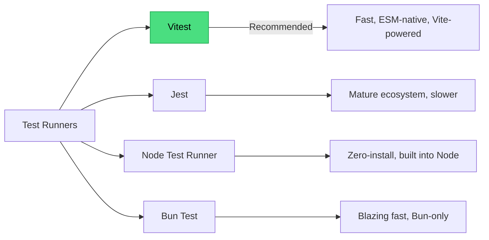
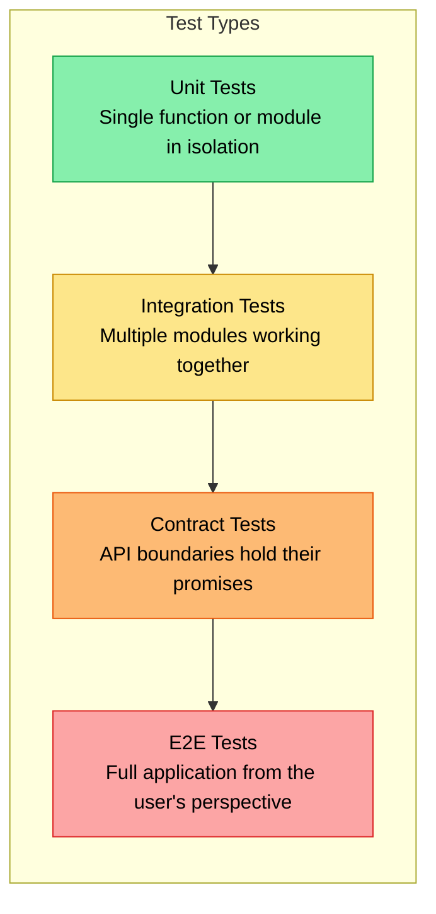
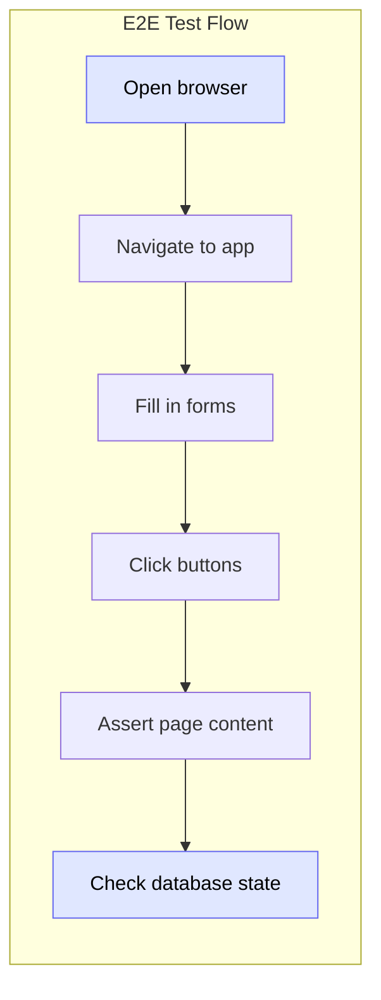
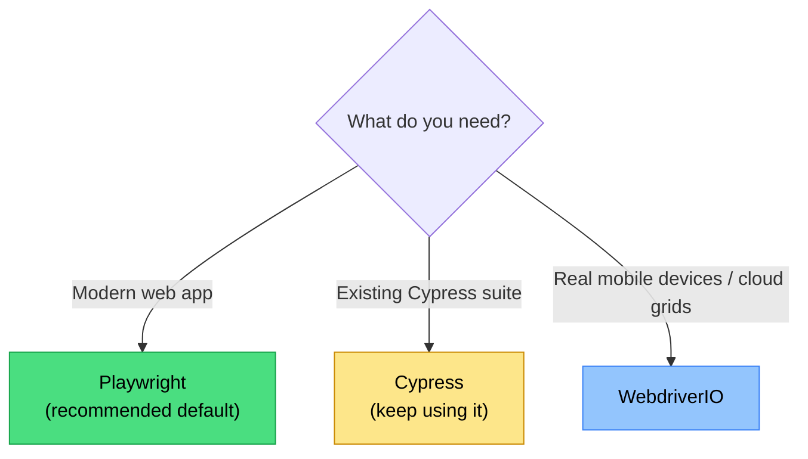
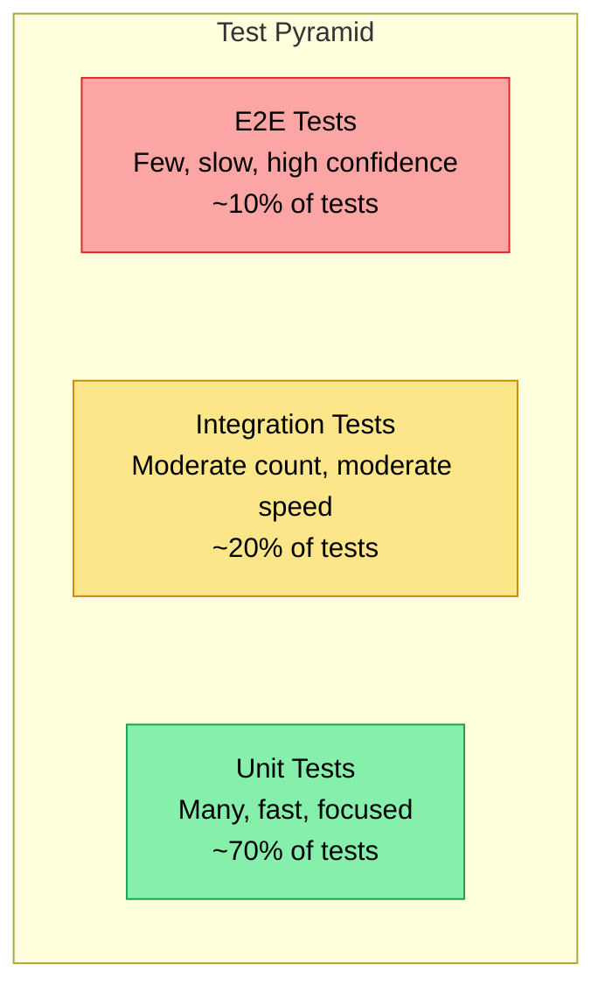

# Testing: Writing Code That Proves Your Code Works

> Test runners, assertion patterns, mocking, E2E, and sustainable testing strategy.

---

## Table of Contents

- [1. Test Runners](#1-test-runners)
- [2. Test Types](#2-test-types)
- [3. End-to-End Testing](#3-end-to-end-testing)
- [4. Coverage and Strategy](#4-coverage-and-strategy)

---

## 1. Test Runners

You have written a function. It works -- you tested it by hand in the console, maybe refreshed the browser a few times. Ship it.

Six months later, someone changes a utility three folders away and your function silently breaks. Nobody notices for two weeks. That is the cost of "I tested it manually."

A **test runner** is a program that executes your test files, compares actual results against expected ones, and reports what passed or failed. It is the difference between "I think this works" and "I can prove this works, automatically, every time."

### The Landscape in 2026



**Vitest** is the clear recommendation for most projects. It uses the same configuration as Vite (which you are likely already using), supports ESM natively without hacks, runs tests in parallel by default, and has a Jest-compatible API so migration is painless. It is fast -- not "slightly faster" but "watch mode feels instant" fast.

```js
// math.test.js -- Your first Vitest test
import { describe, it, expect } from 'vitest';
import { add, divide } from './math.js';

describe('add', () => {
  it('adds two positive numbers', () => {
    expect(add(2, 3)).toBe(5);
  });

  it('handles negative numbers', () => {
    expect(add(-1, -1)).toBe(-2);
  });
});

describe('divide', () => {
  it('divides evenly', () => {
    expect(divide(10, 2)).toBe(5);
  });

  it('throws on division by zero', () => {
    expect(() => divide(10, 0)).toThrow('Cannot divide by zero');
  });
});
```

Run it:

```bash
npx vitest run          # single run
npx vitest              # watch mode (re-runs on file change)
```

### Anatomy of a Test

Every test follows the same three-step pattern, sometimes called **Arrange-Act-Assert**:

```js
it('calculates total price with tax', () => {
  // Arrange: set up the scenario
  const cart = { items: [{ price: 100 }, { price: 50 }] };
  const taxRate = 0.1;

  // Act: do the thing
  const total = calculateTotal(cart, taxRate);

  // Assert: verify the result
  expect(total).toBe(165);
});
```

This pattern is universal. It works the same way in Jest, in Node's built-in runner, in every language's testing framework. Learn it once, use it everywhere.

### The Assertion API

Vitest (and Jest) give you a rich set of matchers:

```js
// Equality
expect(value).toBe(5);              // strict ===
expect(obj).toEqual({ a: 1 });      // deep equality (use this for objects)

// Truthiness
expect(thing).toBeTruthy();
expect(other).toBeFalsy();
expect(val).toBeNull();
expect(val).toBeDefined();

// Numbers
expect(0.1 + 0.2).toBeCloseTo(0.3); // floating point!
expect(count).toBeGreaterThan(0);

// Strings
expect(message).toMatch(/error/i);
expect(name).toContain('Alice');

// Arrays / Objects
expect(list).toContain('apple');
expect(list).toHaveLength(3);
expect(user).toHaveProperty('email');

// Exceptions
expect(() => riskyCall()).toThrow();
expect(() => riskyCall()).toThrow('specific message');

// Async
await expect(fetchUser(1)).resolves.toEqual({ id: 1, name: 'Alice' });
await expect(fetchUser(-1)).rejects.toThrow('Not found');
```

> **Gotcha:** `toBe` uses `Object.is` -- it compares by reference for objects. Two different objects with the same properties will fail `toBe`. Always use `toEqual` for objects and arrays.

### When Jest Still Makes Sense

Jest is not dead. If you have a large existing Jest test suite, there is no urgent reason to migrate. Jest's ecosystem -- custom matchers, snapshot testing, module mocking -- is mature and battle-tested. The main pain point is speed and ESM support, both of which require workarounds.

### Node's Built-in Test Runner

Since Node 18, you get `node:test` with zero installation:

```js
import { describe, it } from 'node:test';
import assert from 'node:assert/strict';

describe('add', () => {
  it('works', () => {
    assert.strictEqual(add(2, 3), 5);
  });
});
```

This is perfect for libraries that want zero dependencies. The API is intentionally minimal. No fancy matchers, no watch mode out of the box, no parallel workers by default. For applications, Vitest is the better choice.

### Bun Test

If your project already runs on Bun, its built-in test runner is extremely fast. The API mirrors Jest. The catch: your tests must run under Bun, not Node, which limits portability.

> **Opinion:** Start with Vitest. Move to the Node runner for zero-dep libraries. Use Bun test only if Bun is already your runtime. Avoid starting new projects on Jest in 2026.

---

## 2. Test Types

Not all tests are created equal. A unit test that checks `add(2, 3) === 5` is valuable but will not catch a bug where the checkout page sends the wrong total to the payment API. Different test types catch different categories of bugs.



### Unit Tests

A unit test exercises a single function, class, or module in isolation. Dependencies are replaced with fakes. They run in milliseconds and you should have thousands of them.

```js
// Pure functions are the easiest to unit test
import { describe, it, expect } from 'vitest';
import { formatCurrency } from './format.js';

describe('formatCurrency', () => {
  it('formats USD with two decimals', () => {
    expect(formatCurrency(1234.5, 'USD')).toBe('$1,234.50');
  });

  it('handles zero', () => {
    expect(formatCurrency(0, 'USD')).toBe('$0.00');
  });

  it('handles negative amounts', () => {
    expect(formatCurrency(-50, 'EUR')).toBe('-€50.00');
  });
});
```

When a unit has dependencies, you **mock** them:

```js
import { describe, it, expect, vi } from 'vitest';
import { getUser } from './user-service.js';
import * as db from './database.js';

// Replace the real database module with a fake
vi.mock('./database.js');

describe('getUser', () => {
  it('returns user from database', async () => {
    // Arrange: tell the mock what to return
    db.findById.mockResolvedValue({ id: 1, name: 'Alice' });

    // Act
    const user = await getUser(1);

    // Assert
    expect(user).toEqual({ id: 1, name: 'Alice' });
    expect(db.findById).toHaveBeenCalledWith(1);
  });

  it('throws when user not found', async () => {
    db.findById.mockResolvedValue(null);

    await expect(getUser(999)).rejects.toThrow('User not found');
  });
});
```

> **Gotcha:** Over-mocking is the most common testing mistake. If you mock everything, your tests prove that your mocks work, not that your code works. Mock at the boundary (network, database, file system) and let everything else use real implementations.

### Integration Tests

Integration tests verify that multiple modules work correctly together. The classic example: your service layer talking to a real (test) database.

```js
import { describe, it, expect, beforeEach } from 'vitest';
import { createOrder, getOrder } from './order-service.js';
import { setupTestDb, teardownTestDb } from './test-helpers.js';

describe('Order Service (integration)', () => {
  beforeEach(async () => {
    await setupTestDb(); // real DB, test data
  });

  it('creates and retrieves an order', async () => {
    const created = await createOrder({
      userId: 1,
      items: [{ productId: 42, quantity: 2 }],
    });

    const retrieved = await getOrder(created.id);
    expect(retrieved.items).toHaveLength(1);
    expect(retrieved.items[0].productId).toBe(42);
    expect(retrieved.status).toBe('pending');
  });
});
```

### Testing Library: Test Behavior, Not Implementation

For UI components, **Testing Library** is essential. Its philosophy is simple: test what the user sees and does, not internal component state.

```js
import { render, screen } from '@testing-library/react';
import userEvent from '@testing-library/user-event';
import { LoginForm } from './LoginForm';

it('shows error on invalid email', async () => {
  const user = userEvent.setup();
  render(<LoginForm onSubmit={vi.fn()} />);

  // Interact like a real user would
  await user.type(screen.getByLabelText('Email'), 'not-an-email');
  await user.click(screen.getByRole('button', { name: 'Sign In' }));

  // Assert what the user sees
  expect(screen.getByText('Please enter a valid email')).toBeInTheDocument();
});
```

> Notice: no `wrapper.find('.error-message')`, no checking `component.state.hasError`. If you rename a CSS class, the test still passes. If you refactor from `useState` to `useReducer`, the test still passes. That is the point.

### MSW: Mock the Network, Not the Code

**Mock Service Worker** intercepts HTTP requests at the network level. Your code makes real `fetch` calls -- MSW catches them before they leave the process.

```js
import { http, HttpResponse } from 'msw';
import { setupServer } from 'msw/node';

const server = setupServer(
  http.get('/api/users/:id', ({ params }) => {
    return HttpResponse.json({ id: params.id, name: 'Alice' });
  }),

  http.post('/api/orders', async ({ request }) => {
    const body = await request.json();
    return HttpResponse.json({ id: 'order-1', ...body }, { status: 201 });
  })
);

beforeAll(() => server.listen());
afterEach(() => server.resetHandlers());
afterAll(() => server.close());

it('fetches user data', async () => {
  // Your actual code runs -- fetch() is intercepted by MSW
  const user = await fetchUser(1);
  expect(user.name).toBe('Alice');
});
```

This is vastly superior to mocking `fetch` directly because your actual HTTP logic (headers, error handling, retries) gets tested too.

### Faker and fast-check: Generate Test Data

Hardcoded test data is fragile. **Faker** generates realistic random data:

```js
import { faker } from '@faker-js/faker';

function createTestUser(overrides = {}) {
  return {
    id: faker.string.uuid(),
    name: faker.person.fullName(),
    email: faker.internet.email(),
    createdAt: faker.date.past(),
    ...overrides,
  };
}

it('displays user profile', () => {
  const user = createTestUser({ name: 'Test User' });
  render(<UserProfile user={user} />);
  expect(screen.getByText('Test User')).toBeInTheDocument();
});
```

**fast-check** takes this further with **property-based testing** -- it generates hundreds of random inputs and checks that invariants always hold:

```js
import { test } from 'vitest';
import fc from 'fast-check';

test('JSON.parse reverses JSON.stringify for any object', () => {
  fc.assert(
    fc.property(
      fc.jsonValue(),
      (value) => {
        const roundTripped = JSON.parse(JSON.stringify(value));
        expect(roundTripped).toEqual(value);
      }
    )
  );
});

test('sort is idempotent', () => {
  fc.assert(
    fc.property(
      fc.array(fc.integer()),
      (arr) => {
        const once = [...arr].sort((a, b) => a - b);
        const twice = [...once].sort((a, b) => a - b);
        expect(once).toEqual(twice);
      }
    )
  );
});
```

Property-based tests find edge cases you never imagined. They are especially powerful for parsers, serializers, and algorithms.

### Contract Tests

When your frontend and backend are separate codebases, **contract tests** verify that both sides agree on the shape of their communication:

```js
// The contract: what the API promises to return
const UserContract = {
  id: expect.any(Number),
  name: expect.any(String),
  email: expect.stringMatching(/@/),
  createdAt: expect.any(String), // ISO date
};

it('GET /api/users/:id matches the contract', async () => {
  const response = await fetch('/api/users/1');
  const user = await response.json();
  expect(user).toEqual(expect.objectContaining(UserContract));
});
```

If the backend changes `createdAt` from a string to a number, this test catches it before production breaks.

---

## 3. End-to-End Testing

Unit and integration tests verify pieces. End-to-end (E2E) tests verify the whole machine -- browser, frontend, backend, database -- working together as a real user would experience it. They are slow, occasionally flaky, and absolutely essential.



### Playwright: The Default Choice

**Playwright** is the default E2E framework for JavaScript projects in 2026. Built by Microsoft, it controls Chromium, Firefox, and WebKit with a single API. Tests run in parallel, headless by default, with auto-waiting that eliminates most flake.

```js
// tests/checkout.spec.js
import { test, expect } from '@playwright/test';

test('user can complete checkout', async ({ page }) => {
  // Navigate
  await page.goto('/products');

  // Add item to cart
  await page.getByRole('button', { name: 'Add to Cart' }).first().click();

  // Go to cart
  await page.getByRole('link', { name: 'Cart (1)' }).click();

  // Proceed to checkout
  await page.getByRole('button', { name: 'Checkout' }).click();

  // Fill shipping form
  await page.getByLabel('Full Name').fill('Alice Smith');
  await page.getByLabel('Address').fill('123 Main St');
  await page.getByLabel('City').fill('Portland');

  // Submit
  await page.getByRole('button', { name: 'Place Order' }).click();

  // Verify confirmation
  await expect(page.getByText('Order confirmed')).toBeVisible();
  await expect(page.getByText('Order #')).toBeVisible();
});
```

Notice the pattern: **every interaction uses accessible selectors** -- `getByRole`, `getByLabel`, `getByText`. Not CSS classes, not test IDs (except as a last resort). This makes tests resilient to UI refactors and doubles as an accessibility audit.

### Playwright's Key Features

```js
// Auto-waiting: Playwright waits for elements automatically.
// No need for explicit sleep() or waitFor() in most cases.
await page.getByRole('button', { name: 'Submit' }).click();
// ^ Playwright waits until the button is visible, enabled, and stable

// Network interception (like MSW but for E2E)
await page.route('/api/payments', async (route) => {
  await route.fulfill({
    status: 200,
    body: JSON.stringify({ success: true, transactionId: 'test-123' }),
  });
});

// Visual regression testing (built-in)
await expect(page).toHaveScreenshot('checkout-page.png');

// Trace viewer for debugging failed tests
// npx playwright test --trace on
// npx playwright show-trace trace.zip

// Multiple browsers in one config
// playwright.config.js
export default {
  projects: [
    { name: 'chromium', use: { browserName: 'chromium' } },
    { name: 'firefox', use: { browserName: 'firefox' } },
    { name: 'webkit', use: { browserName: 'webkit' } },
  ],
};
```

### Page Object Model

As your E2E suite grows, raw test files become unwieldy. The **Page Object Model** encapsulates page interactions:

```js
// pages/checkout-page.js
export class CheckoutPage {
  constructor(page) {
    this.page = page;
  }

  async fillShipping({ name, address, city }) {
    await this.page.getByLabel('Full Name').fill(name);
    await this.page.getByLabel('Address').fill(address);
    await this.page.getByLabel('City').fill(city);
  }

  async placeOrder() {
    await this.page.getByRole('button', { name: 'Place Order' }).click();
  }

  async expectConfirmation() {
    await expect(this.page.getByText('Order confirmed')).toBeVisible();
  }
}

// tests/checkout.spec.js -- clean and readable
test('user can complete checkout', async ({ page }) => {
  const checkout = new CheckoutPage(page);
  await page.goto('/checkout');

  await checkout.fillShipping({
    name: 'Alice Smith',
    address: '123 Main St',
    city: 'Portland',
  });

  await checkout.placeOrder();
  await checkout.expectConfirmation();
});
```

### Cypress and WebdriverIO

**Cypress** popularized the modern E2E testing experience with its time-travel debugger and real-time browser preview. It is still a solid choice, especially if your team already knows it. The main limitation: it only supports Chromium-family browsers (plus experimental Firefox). There is no WebKit/Safari support.

**WebdriverIO** follows the W3C WebDriver protocol. It is the right pick when you need to test on real mobile devices, run tests on cloud grids (BrowserStack, Sauce Labs), or test native mobile apps. It is more complex to set up but covers scenarios Playwright and Cypress cannot.



### Fighting Flakiness

E2E tests have a reputation for flakiness. Most flake comes from three sources:

1. **Race conditions.** The test clicks before the element is ready. Playwright's auto-waiting handles 90% of this, but for dynamic content, use explicit assertions: `await expect(element).toBeVisible()` before interacting.

2. **Shared state.** Tests depend on data from previous tests. Fix: each test sets up its own data. Use API calls in `beforeEach` to seed the database rather than clicking through the UI.

3. **Animations and timers.** Disable CSS animations in test mode. Mock timers for deliberate delays.

```js
// Disable animations globally in playwright.config.js
export default {
  use: {
    // Reduce motion to eliminate animation-related flake
    contextOptions: {
      reducedMotion: 'reduce',
    },
  },
};
```

> **Opinion:** If an E2E test is flaky more than 1% of the time, fix it or delete it. A flaky test that everyone ignores is worse than no test at all -- it teaches the team to distrust the test suite.

---

## 4. Coverage and Strategy

You have a test runner, you know the test types, and you can write E2E flows. The final question is the hardest one: **what should you actually test?**

### Code Coverage with c8

Coverage tools measure which lines, branches, and functions your tests execute. Vitest uses **c8** (or **v8 coverage**) out of the box:

```bash
npx vitest run --coverage
```

This produces a report showing percentages per file:

```
--------------------|---------|----------|---------|---------|
File                | % Stmts | % Branch | % Funcs | % Lines |
--------------------|---------|----------|---------|---------|
src/cart.js         |   94.12 |    85.71 |     100 |   94.12 |
src/auth.js         |   78.57 |    60.00 |   66.67 |   78.57 |
src/format.js       |     100 |      100 |     100 |     100 |
--------------------|---------|----------|---------|---------|
```

Configure it in `vitest.config.js`:

```js
export default {
  test: {
    coverage: {
      provider: 'v8',
      reporter: ['text', 'html', 'lcov'],
      exclude: [
        'node_modules/',
        'tests/',
        '**/*.config.js',
        '**/*.d.ts',
      ],
      thresholds: {
        statements: 80,
        branches: 75,
        functions: 80,
        lines: 80,
      },
    },
  },
};
```

> **Gotcha:** 100% coverage does not mean your code is correct. Coverage tells you which code was *executed*, not whether the assertions were *meaningful*. A test that calls a function without asserting anything produces coverage with zero value.

### Mutation Testing: The Coverage Killer

If coverage measures "did this line run," **mutation testing** measures "would my tests catch a bug here?" It systematically modifies your source code (mutations) and checks whether your tests fail. If a test suite still passes after changing `>` to `>=`, your tests are not actually verifying the boundary.

**Stryker** is the standard tool:

```bash
npx stryker init    # interactive setup
npx stryker run     # run mutation testing
```

```js
// Stryker will mutate your code like this:
// Original:
function isAdult(age) {
  return age >= 18;
}

// Mutation 1: change >= to >
// Mutation 2: change 18 to 17
// Mutation 3: remove the return statement

// If your test only checks isAdult(20) === true,
// Mutation 1 SURVIVES (isAdult(18) still not tested)
```

Mutation testing is slow -- it runs your entire test suite once per mutation. Use it periodically (weekly CI job) rather than on every commit.

### The Test Pyramid



The test pyramid is a guide, not a law. The principle: **have more of the fast, cheap tests and fewer of the slow, expensive ones.**

- **Unit tests** are your foundation. They are fast, precise, and cheap to write. When a unit test fails, you know exactly what broke.
- **Integration tests** catch wiring bugs -- the pieces work individually but break when connected. Run them less frequently.
- **E2E tests** verify critical user journeys. You do not need an E2E test for every feature, but you absolutely need them for signup, login, checkout, and whatever your core product does.

### Test Behavior, Not Implementation

This is the single most important testing principle. Compare:

```js
// BAD: Testing implementation details
it('sets isLoading to true when fetch starts', () => {
  const { result } = renderHook(() => useUsers());
  act(() => result.current.fetchUsers());
  expect(result.current.isLoading).toBe(true);  // tied to internal state
});

// GOOD: Testing behavior the user observes
it('shows a spinner while loading users', async () => {
  render(<UserList />);
  expect(screen.getByRole('progressbar')).toBeInTheDocument();
  await waitFor(() => {
    expect(screen.queryByRole('progressbar')).not.toBeInTheDocument();
  });
  expect(screen.getByText('Alice')).toBeInTheDocument();
});
```

The first test breaks when you refactor the hook's internals. The second test breaks only when the user experience changes. That is exactly what you want.

### A Practical Strategy

Here is an opinionated testing strategy that works for most web applications:

1. **Write unit tests for pure logic.** Utilities, formatters, validators, state reducers, algorithms. Aim for high coverage here because it is cheap.

2. **Write integration tests for connected modules.** Service + database, component + API, form + validation. Use MSW for network boundaries.

3. **Write E2E tests for critical paths only.** User registration, authentication, the core product flow, payment. Five to fifteen solid E2E tests beat fifty fragile ones.

4. **Run unit and integration tests on every commit.** They should finish in under 60 seconds.

5. **Run E2E tests on every PR and nightly.** They will take minutes, and that is fine.

6. **Track coverage but do not worship it.** 80% is a good target. Chasing 100% leads to testing getter functions and config files, which is waste.

7. **Run mutation testing weekly.** It reveals where your tests are theatrical -- producing green coverage without catching real bugs.

```js
// vitest.config.js -- a production-ready config
import { defineConfig } from 'vitest/config';

export default defineConfig({
  test: {
    globals: true,
    environment: 'jsdom',
    setupFiles: ['./tests/setup.js'],
    coverage: {
      provider: 'v8',
      reporter: ['text', 'html'],
      thresholds: {
        statements: 80,
        branches: 75,
      },
    },
    // Separate slow tests
    typecheck: { enabled: true },
  },
});
```

```js
// tests/setup.js -- shared test configuration
import '@testing-library/jest-dom/vitest';
import { cleanup } from '@testing-library/react';
import { afterEach } from 'vitest';

// Automatically clean up after each test
afterEach(() => {
  cleanup();
});
```

> **Final opinion:** The best test suite is the one your team actually runs and trusts. A small, fast, reliable suite that catches real bugs is infinitely better than a sprawling, slow, flaky one that everyone skips. Start small. Test the scary parts. Expand from confidence, not from obligation.