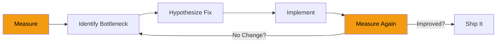
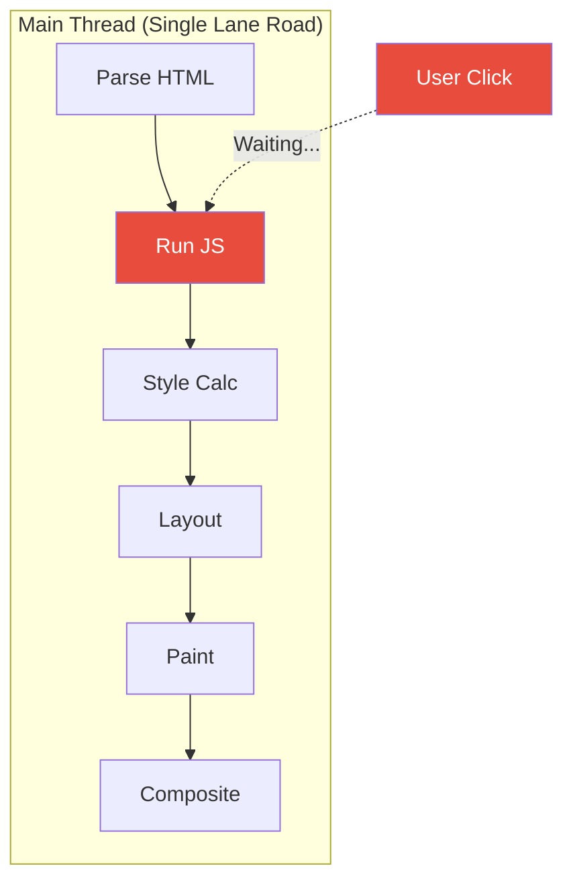
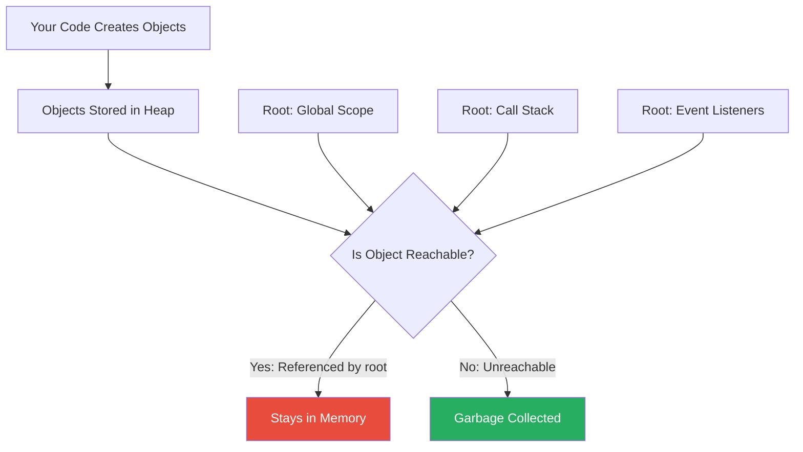
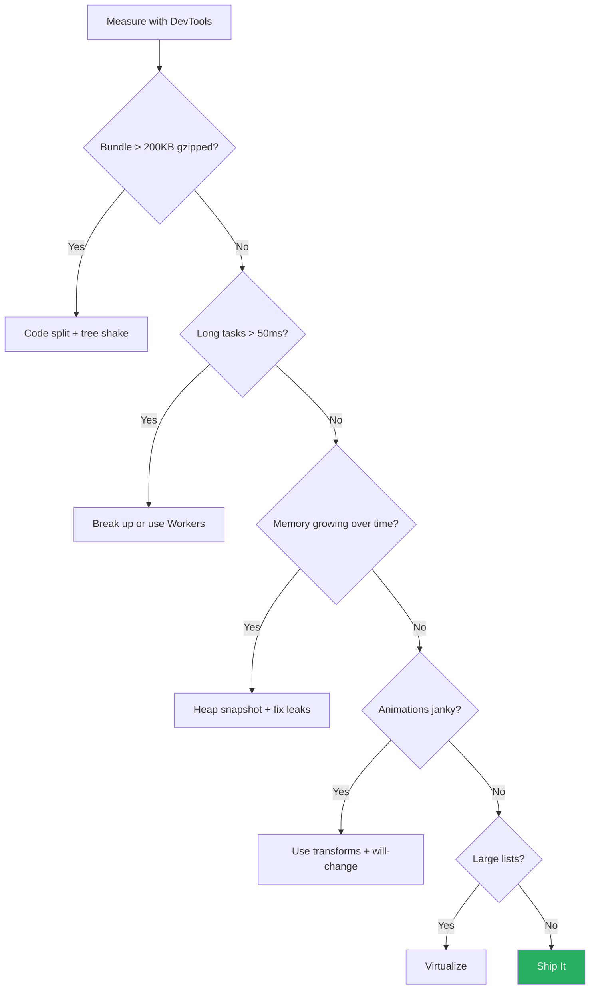

# Performance: Making JavaScript Fast

> Measurement, main thread optimization, memory, bundle size, and rendering performance.

---

## Table of Contents

- [1. Measurement](#1-measurement)
- [2. JavaScript-Specific](#2-javascript-specific)
- [3. Memory](#3-memory)
- [4. Bundle Size](#4-bundle-size)
- [5. Rendering](#5-rendering)

---

## 1. Measurement

**The cardinal sin of performance work is optimizing before measuring.** You would not prescribe medicine without a diagnosis. Performance optimization without profiling is the same reckless guesswork.

### The Performance Mindset



Notice that the loop starts and ends with measurement. This is not optional. Your intuition about what is slow is almost always wrong. The browser does thousands of things you cannot see, and the bottleneck is rarely where you expect it.

### DevTools Performance Panel

The Chrome DevTools Performance panel is your operating room. Record a session, and you get a flame chart showing every function call, every layout, every paint, every garbage collection event, all plotted on a timeline.

```js
// Quick way to mark sections for the Performance panel
performance.mark('data-fetch-start');

const data = await fetchLargeDataset();

performance.mark('data-fetch-end');
performance.measure('Data Fetch', 'data-fetch-start', 'data-fetch-end');

// Read the measurement
const [entry] = performance.getEntriesByName('Data Fetch');
console.log(`Fetch took ${entry.duration.toFixed(2)}ms`);
```

`performance.mark()` and `performance.measure()` create named entries that show up directly in the DevTools timeline. They cost almost nothing to run and are invaluable for understanding real timing.

### Web Vitals: The Metrics That Matter

Google defined Core Web Vitals as the metrics that correlate most strongly with user experience. You should know these cold:

| Metric | What It Measures | Good Threshold |
|--------|-----------------|----------------|
| **LCP** (Largest Contentful Paint) | When the main content becomes visible | < 2.5s |
| **INP** (Interaction to Next Paint) | Responsiveness to user input | < 200ms |
| **CLS** (Cumulative Layout Shift) | Visual stability (things jumping around) | < 0.1 |

```js
// Measure Web Vitals in your app
import { onLCP, onINP, onCLS } from 'web-vitals';

function sendToAnalytics(metric) {
  const body = JSON.stringify({
    name: metric.name,
    value: metric.value,
    id: metric.id,
  });
  // Use sendBeacon so the request survives page unload
  navigator.sendBeacon('/analytics', body);
}

onLCP(sendToAnalytics);
onINP(sendToAnalytics);
onCLS(sendToAnalytics);
```

### Lighthouse vs. Real User Monitoring (RUM)

Lighthouse runs in a simulated environment. It gives you a lab score, a controlled, repeatable snapshot. It is excellent for catching regressions in CI but terrible at telling you what real users experience.

**RUM (Real User Monitoring)** collects actual performance data from actual browsers on actual networks. A user on a 3G connection in Lagos and a user on fiber in Oslo will have wildly different experiences. Lighthouse cannot model that.

> **Opinionated take:** Run Lighthouse in CI to prevent regressions. Use RUM (via `web-vitals` + your analytics) to understand reality. If you only do one, pick RUM. Lab scores are vanity metrics if they do not match the field.

### The Performance API Deep Cut

Beyond marks and measures, the Performance API gives you access to navigation timing, resource timing, and long task detection:

```js
// Find all resources that took more than 500ms to load
const slowResources = performance.getEntriesByType('resource')
  .filter(r => r.duration > 500)
  .map(r => ({ name: r.name, duration: Math.round(r.duration) }));

console.table(slowResources);

// Detect long tasks (blocks the main thread > 50ms)
const observer = new PerformanceObserver((list) => {
  for (const entry of list.getEntries()) {
    console.warn(`Long task detected: ${entry.duration.toFixed(0)}ms`);
  }
});
observer.observe({ type: 'longtask', buffered: true });
```

Long tasks are the silent killers of interactivity. Any task over 50ms blocks the main thread, which means the user clicks a button and nothing happens. The PerformanceObserver for `longtask` is how you catch them.

---

## 2. JavaScript-Specific

The browser has one main thread. One. Everything that matters, parsing HTML, running JavaScript, calculating styles, painting pixels, happens on that single thread. When your JavaScript hogs it, the entire page freezes.

### The Main Thread Bottleneck



Think of the main thread as a single-lane road. When a heavy JavaScript function is occupying the road, every other operation (including responding to the user typing or clicking) has to wait in line.

### Breaking Up Long Tasks

The most impactful optimization you can make is breaking long tasks into smaller chunks. The browser needs idle moments between chunks to handle user input.

```js
// BAD: Process 10,000 items in one go - blocks the main thread
function processAllItems(items) {
  for (const item of items) {
    heavyComputation(item); // Main thread is locked
  }
}

// GOOD: Yield to the browser between chunks
async function processItemsInChunks(items, chunkSize = 100) {
  for (let i = 0; i < items.length; i += chunkSize) {
    const chunk = items.slice(i, i + chunkSize);

    for (const item of chunk) {
      heavyComputation(item);
    }

    // Yield to the browser so it can handle user input
    await new Promise(resolve => setTimeout(resolve, 0));
  }
}
```

The `setTimeout(resolve, 0)` trick gives the browser a chance to process pending events, paint updates, and respond to user actions before your code continues.

### requestIdleCallback: Do Work When the Browser Is Free

`requestIdleCallback` lets you schedule low-priority work during the browser's idle periods. The browser tells you how much free time it has, and you decide whether to use it.

```js
function processBackgroundQueue(queue) {
  requestIdleCallback((deadline) => {
    // deadline.timeRemaining() tells you how many ms are free
    while (deadline.timeRemaining() > 1 && queue.length > 0) {
      const task = queue.shift();
      task(); // Do one unit of work
    }

    // If there's more work, schedule another idle callback
    if (queue.length > 0) {
      processBackgroundQueue(queue);
    }
  });
}

// Usage: queue up non-urgent analytics or prefetching
const queue = [
  () => trackAnalyticsEvent('page_view'),
  () => prefetchNextPage(),
  () => updateRecommendations(),
];

processBackgroundQueue(queue);
```

> **Gotcha:** `requestIdleCallback` is not available in Safari as of mid-2025. Use a polyfill or feature detection: `const rIC = window.requestIdleCallback || (cb => setTimeout(cb, 1));`

### Web Workers: Escape the Main Thread Entirely

For truly heavy computation, move the work off the main thread completely. Web Workers run JavaScript in a background thread.

```js
// worker.js
self.onmessage = function(e) {
  const { data } = e;
  // Heavy computation happens here, off the main thread
  const result = data.reduce((sum, num) => {
    // Simulate heavy work
    for (let i = 0; i < 1000; i++) {
      sum += Math.sqrt(num * i);
    }
    return sum;
  }, 0);

  self.postMessage(result);
};

// main.js
const worker = new Worker('worker.js');

worker.postMessage(largeArray);
worker.onmessage = (e) => {
  console.log('Result from worker:', e.data);
  // Main thread was never blocked
};
```

Workers communicate through message passing. They cannot touch the DOM. Think of them as a separate room where heavy lifting happens while the main room stays responsive.

### Memoization: Do Not Compute the Same Thing Twice

```js
function memoize(fn) {
  const cache = new Map();
  return function (...args) {
    const key = JSON.stringify(args);
    if (cache.has(key)) return cache.get(key);
    const result = fn.apply(this, args);
    cache.set(key, result);
    return result;
  };
}

// Expensive function called repeatedly with same inputs
const expensiveCalc = memoize((n) => {
  console.log(`Computing for ${n}...`);
  let result = 0;
  for (let i = 0; i < n * 1000000; i++) result += Math.random();
  return result;
});

expensiveCalc(5); // Computing for 5... (slow)
expensiveCalc(5); // Instant - returned from cache
```

> **Gotcha:** `JSON.stringify` as a cache key is simple but fragile. It fails with circular references, ignores `undefined` values, and does not distinguish `Map`/`Set` from empty objects. For production memoization, use a library or a more robust key strategy.

### Avoid Layout Thrashing

Layout thrashing happens when you read a layout property, then write to the DOM, then read again, forcing the browser to recalculate layout repeatedly in the same frame.

```js
// BAD: Layout thrashing - forces recalculation on every iteration
const elements = document.querySelectorAll('.item');
elements.forEach(el => {
  const height = el.offsetHeight;       // READ (forces layout)
  el.style.height = height * 2 + 'px';  // WRITE (invalidates layout)
  // Next iteration's READ forces layout again
});

// GOOD: Batch reads, then batch writes
const elements = document.querySelectorAll('.item');
const heights = Array.from(elements).map(el => el.offsetHeight); // All READs

elements.forEach((el, i) => {
  el.style.height = heights[i] * 2 + 'px'; // All WRITEs
});
```

The rule is simple: **read everything first, then write everything.** Never interleave reads and writes.

---

## 3. Memory

Memory leaks in JavaScript are sneaky. The garbage collector handles most cleanup automatically, so developers rarely think about memory. Then one day the page crashes after being open for 20 minutes because it is consuming 2 GB of RAM.

### How JavaScript Memory Works



The garbage collector frees memory that is no longer reachable from any "root" (the global scope, the call stack, active event listeners, timers). A memory leak happens when you hold a reference to something you no longer need, preventing the garbage collector from doing its job.

### The Four Classic Leaks

**1. Detached DOM Nodes**

```js
// LEAK: The DOM node is removed from the page but still referenced
let cachedElement = document.getElementById('heavy-widget');

function removeWidget() {
  cachedElement.remove(); // Gone from the DOM tree
  // But cachedElement still holds a reference!
  // The entire DOM subtree stays in memory
}

// FIX: Clear the reference
function removeWidget() {
  cachedElement.remove();
  cachedElement = null; // Now the GC can free it
}
```

**2. Forgotten Event Listeners**

```js
// LEAK: Listeners accumulate on every call
function setupHandler() {
  window.addEventListener('resize', () => {
    recalculateLayout(); // New closure created every call
  });
}

// FIX: Use a named function and clean up
function recalculateLayout() { /* ... */ }

function setupHandler() {
  window.addEventListener('resize', recalculateLayout);
}

function teardown() {
  window.removeEventListener('resize', recalculateLayout);
}
```

> **Gotcha:** You cannot remove an anonymous function listener. If you pass a new arrow function to `addEventListener`, you have no way to call `removeEventListener` for that exact function. Always use named functions or `AbortController` for cleanup.

**3. Closures That Capture Too Much**

```js
// LEAK: The closure captures `hugeData` even though it only needs `summary`
function processData() {
  const hugeData = fetchGigabyteDataset();
  const summary = computeSummary(hugeData);

  return function getSummary() {
    return summary;
    // `hugeData` is still in scope, still in memory
  };
}

// FIX: Null out the large reference
function processData() {
  let hugeData = fetchGigabyteDataset();
  const summary = computeSummary(hugeData);
  hugeData = null; // Free the reference

  return function getSummary() {
    return summary;
  };
}
```

**4. Forgotten Timers and Intervals**

```js
// LEAK: Interval runs forever, holding references
const data = loadExpensiveData();
setInterval(() => {
  updateDashboard(data); // `data` can never be GC'd
}, 1000);

// FIX: Store the ID and clear when done
const intervalId = setInterval(() => {
  updateDashboard(data);
}, 1000);

function cleanup() {
  clearInterval(intervalId);
}
```

### Finding Leaks with Heap Snapshots

Chrome DevTools Memory panel lets you take heap snapshots. The workflow is:

1. Take a snapshot (baseline).
2. Perform the action you suspect leaks memory (open a modal, navigate, scroll).
3. Take another snapshot.
4. Compare them. Look for objects that grew in count but should not have.

Filter by "Detached" in the snapshot view to find DOM nodes that exist in memory but are no longer attached to the document tree. These are almost always leaks.

### WeakMap and WeakRef: Memory-Safe References

`WeakMap` holds keys weakly. If nothing else references the key, the entire entry gets garbage collected.

```js
// WeakMap: Associate metadata with DOM elements without leaking
const elementMetadata = new WeakMap();

function trackElement(el) {
  elementMetadata.set(el, {
    createdAt: Date.now(),
    interactions: 0,
  });
}

// When `el` is removed from the DOM and no other code references it,
// the WeakMap entry is automatically garbage collected.
// No manual cleanup needed!

// WeakRef: Hold a reference that does not prevent GC
const cache = new Map();

function getCached(key, compute) {
  const ref = cache.get(key);
  if (ref) {
    const value = ref.deref(); // Returns undefined if GC'd
    if (value !== undefined) return value;
  }

  const value = compute();
  cache.set(key, new WeakRef(value));
  return value;
}
```

> **When to use which:** `WeakMap` is for when your key is an object and you want the entry to disappear when the key is garbage collected. `WeakRef` is for when you want to hold a reference to a value but you are fine with it disappearing. Use `WeakRef` with `FinalizationRegistry` if you need a callback when the object is collected, but treat it as a last resort, not a primary cleanup mechanism.

---

## 4. Bundle Size

Every kilobyte of JavaScript you ship must be downloaded, parsed, compiled, and executed. On a fast laptop with good Wi-Fi, nobody notices. On a mid-range phone over 3G (which is still the global median experience), every extra kilobyte costs real seconds.

### The Cost of JavaScript


JavaScript is the most expensive asset type byte-for-byte. A 200KB image is decoded by optimized native code. A 200KB JavaScript bundle must go through parsing, compilation, and execution, all on the main thread. Treat JavaScript bytes as significantly more expensive than image bytes.

### Tree Shaking: Only Ship What You Use

Tree shaking is the process of eliminating dead code. It only works with ES Modules (`import`/`export`), not CommonJS (`require`).

```js
// math.js - ES Module
export function add(a, b) { return a + b; }
export function subtract(a, b) { return a - b; }
export function multiply(a, b) { return a * b; }
export function divide(a, b) { return a / b; }

// Hypothetical giant function nobody calls
export function matrixInverse(matrix) {
  // 500 lines of code...
}

// app.js
import { add, multiply } from './math.js';
// Tree shaking removes subtract, divide, and matrixInverse
// They never appear in your final bundle
```

> **Gotcha:** Tree shaking fails silently when modules have side effects. If a module executes code at import time (not just exporting functions), bundlers cannot safely remove it. Mark side-effect-free packages in `package.json` with `"sideEffects": false` to help bundlers optimize aggressively.

```json
{
  "name": "my-library",
  "sideEffects": false
}
```

### Code Splitting: Load Code When Needed

Instead of shipping one massive bundle, split your code so users only download what they need for the current page.

```js
// Static import: loaded immediately, increases initial bundle
import { renderChart } from './chart-library.js';

// Dynamic import: loaded on demand, reduces initial bundle
button.addEventListener('click', async () => {
  const { renderChart } = await import('./chart-library.js');
  renderChart(data);
});
```

Dynamic `import()` returns a promise. The browser fetches the module only when the `import()` call executes. This is the foundation of route-based splitting in frameworks:

```js
// Route-based code splitting (framework-agnostic concept)
const routes = {
  '/':        () => import('./pages/home.js'),
  '/about':   () => import('./pages/about.js'),
  '/dashboard': () => import('./pages/dashboard.js'),
  // Each page is a separate chunk downloaded only when visited
};

async function navigate(path) {
  const loader = routes[path];
  if (!loader) return show404();

  const module = await loader();
  module.render(document.getElementById('app'));
}
```

### Choosing Smaller Alternatives

Before adding a dependency, check its size. Use [bundlephobia.com](https://bundlephobia.com) to see the actual cost.

| Heavy Library | Lighter Alternative | Size Savings |
|---------------|-------------------|--------------|
| `moment` (300KB) | `date-fns` (tree-shakeable) or `dayjs` (2KB) | ~95% |
| `lodash` (72KB) | `lodash-es` (tree-shakeable) or native methods | ~80% |
| `axios` (13KB) | `fetch` (built-in, 0KB) | 100% |
| `uuid` (4KB) | `crypto.randomUUID()` (built-in) | 100% |

```js
// Before: importing all of lodash for one function
import _ from 'lodash';
_.debounce(handleSearch, 300);

// After: import only what you use from the ES module version
import debounce from 'lodash-es/debounce';
debounce(handleSearch, 300);

// Best: write the 8 lines yourself for a common utility
function debounce(fn, ms) {
  let timeoutId;
  return function (...args) {
    clearTimeout(timeoutId);
    timeoutId = setTimeout(() => fn.apply(this, args), ms);
  };
}
```

### Analyzing Your Bundle

You cannot reduce what you cannot see. Use your bundler's analysis tools to visualize what is in your output.

```bash
# Webpack
npx webpack --profile --json=stats.json
npx webpack-bundle-analyzer stats.json

# Vite / Rollup
npx vite build --report
# or add rollup-plugin-visualizer to your config
```

The resulting treemap shows every module and its contribution to the total size. You will almost always find a surprise: a library you forgot about, a polyfill you no longer need, or a dependency pulling in its own dependency tree.

> **Rule of thumb:** If your total JavaScript bundle exceeds 200KB gzipped for an initial page load, something is wrong. Audit it. Most marketing pages can ship under 50KB. Complex apps should aim for under 150KB for the initial route.

---

## 5. Rendering

Performance is not just about JavaScript execution speed. The user sees pixels on a screen, and getting those pixels there efficiently is an entire discipline. The browser's rendering pipeline has distinct phases, and understanding them tells you exactly what to avoid.

### The Rendering Pipeline


Every visual change triggers some portion of this pipeline. The further left you trigger, the more expensive the change:

- **Layout** (reflow): Triggered by changes to geometry (width, height, position, margin). Most expensive.
- **Paint**: Triggered by changes to appearance (color, background, box-shadow). Expensive.
- **Composite**: Triggered by changes to transforms and opacity. Cheapest by far.

### Forced Synchronous Layout

This is the rendering equivalent of layout thrashing (covered in Section 2), but the key insight is understanding why it happens at the browser level:

```js
// BAD: Forces the browser to calculate layout mid-frame
element.style.width = '500px';       // Schedule layout
const height = element.offsetHeight;  // FORCE layout NOW to read geometry
element.style.height = height + 'px'; // Invalidate layout again

// GOOD: Use requestAnimationFrame to batch with the browser's natural cycle
requestAnimationFrame(() => {
  // All writes happen together during the frame's script phase
  element.style.width = '500px';
  element.style.height = '300px';
});
```

### CSS Transforms and the Compositor

The single most impactful rendering optimization: **animate only `transform` and `opacity`.** These properties can be handled entirely by the compositor thread (a separate thread from the main thread), meaning animations stay smooth even when JavaScript is busy.

```js
// BAD: Animating left/top triggers layout every frame
element.style.transition = 'left 0.3s';
element.style.left = '200px'; // Layout -> Paint -> Composite (every frame)

// GOOD: Animating transform skips layout and paint
element.style.transition = 'transform 0.3s';
element.style.transform = 'translateX(200px)'; // Composite only!
```

```css
/* Tell the browser to promote an element to its own compositor layer */
.animated-element {
  will-change: transform;
}

/* Or for a one-off animation */
.modal-entering {
  will-change: opacity, transform;
}
```

> **Gotcha:** Do not apply `will-change` to everything. Each promoted layer consumes GPU memory. Applying it to 200 elements is worse than applying it to none. Use it on elements that will actually animate, and remove it when the animation ends.

```js
// Apply will-change before animation, remove after
element.style.willChange = 'transform';
element.addEventListener('transitionend', () => {
  element.style.willChange = 'auto';
}, { once: true });

element.style.transform = 'translateX(200px)';
```

### Virtualization: Render Only What Is Visible

If you have a list of 10,000 items, rendering all 10,000 DOM nodes is catastrophic. The browser must lay out, paint, and composite all of them. Virtualization means rendering only the items currently visible in the viewport, plus a small buffer.

```js
// Simplified virtualization concept
class VirtualList {
  constructor(container, items, itemHeight) {
    this.container = container;
    this.items = items;
    this.itemHeight = itemHeight;

    // Total height to make scrollbar correct
    container.style.height = '400px';
    container.style.overflow = 'auto';

    this.content = document.createElement('div');
    this.content.style.height = `${items.length * itemHeight}px`;
    this.content.style.position = 'relative';
    container.appendChild(this.content);

    container.addEventListener('scroll', () => this.render());
    this.render();
  }

  render() {
    const scrollTop = this.container.scrollTop;
    const viewportHeight = this.container.clientHeight;

    const startIndex = Math.floor(scrollTop / this.itemHeight);
    const endIndex = Math.min(
      startIndex + Math.ceil(viewportHeight / this.itemHeight) + 1,
      this.items.length
    );

    // Clear and render only visible items
    this.content.innerHTML = '';
    for (let i = startIndex; i < endIndex; i++) {
      const el = document.createElement('div');
      el.textContent = this.items[i];
      el.style.position = 'absolute';
      el.style.top = `${i * this.itemHeight}px`;
      el.style.height = `${this.itemHeight}px`;
      this.content.appendChild(el);
    }
  }
}
```

In production, use a library like `@tanstack/virtual` or `react-window`. The concept above shows the principle: only create DOM nodes for what the user can see.

### Image Optimization

Images are often the heaviest assets on a page. Optimizing them requires no JavaScript expertise, just discipline.

```html
<!-- Lazy load: only fetch when the image nears the viewport -->


<!-- Responsive images: send the right size for the device -->


<!-- Prevent CLS: always set dimensions -->

```

```js
// Programmatic lazy loading with IntersectionObserver for more control
const observer = new IntersectionObserver((entries) => {
  for (const entry of entries) {
    if (entry.isIntersecting) {
      const img = entry.target;
      img.src = img.dataset.src;
      observer.unobserve(img);
    }
  }
}, { rootMargin: '200px' }); // Start loading 200px before visible

document.querySelectorAll('img[data-src]').forEach(img => {
  observer.observe(img);
});
```

### The Performance Checklist

Before you ship, walk through this:



Performance is not a one-time task. It is a practice. Measure, fix, measure again. Set budgets. Fail the build if the bundle exceeds them. Add performance tests to CI. The fastest code is the code you never ship, the smartest optimization is the one you prove matters with data.