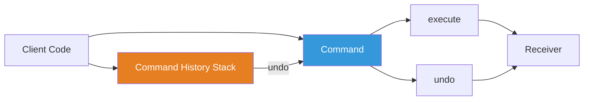
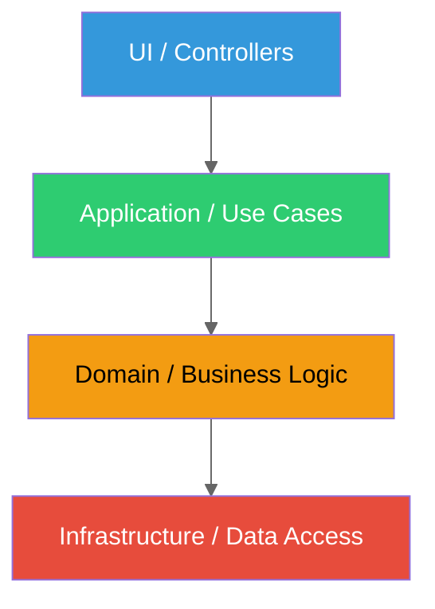

# Patterns and Architecture: Structuring Code That Scales

> Design patterns, functional composition, code organization, API design, and the architecture decisions that separate scripts from systems.

---

## Table of Contents

- [1. Programming Paradigms](#1-programming-paradigms)
- [2. Design Patterns](#2-design-patterns)
- [3. Functional Patterns](#3-functional-patterns)
- [4. Code Organization](#4-code-organization)
- [5. Concurrency Patterns](#5-concurrency-patterns)

---

## 1. Programming Paradigms

JavaScript does not force a paradigm on you. It hands you a loaded toolbox and says "good luck." This is both its greatest strength and the reason codebases rot. You need to understand the paradigms available and pick the right one for the problem, not the one you saw in a blog post last week.

### Functional Programming

Functional programming is about building programs from pure functions, immutable data, and composition. A pure function takes inputs, returns an output, and touches nothing else. No database calls, no DOM mutations, no modifying the argument you passed in.

```js
// Pure: same input always gives same output, no side effects
function calculateTotal(items, taxRate) {
  return items.reduce((sum, item) => sum + item.price * item.qty, 0) * (1 + taxRate);
}

// Impure: reads external state, mutates the argument
let taxRate = 0.2;
function calculateTotal(items) {
  items.sort((a, b) => a.price - b.price); // Mutates the original array!
  return items.reduce((sum, item) => sum + item.price * item.qty, 0) * (1 + taxRate);
}
```

Immutability is the companion to purity. Instead of changing objects in place, you create new ones. This kills entire categories of bugs: race conditions, stale closures reading mutated state, undo/redo becoming trivial.

```js
// Immutable update: spread to create a new object
const user = { name: 'Alice', age: 30, address: { city: 'Paris' } };
const updated = { ...user, age: 31 };

// Deep update: nested spreads get ugly fast
const movedUser = {
  ...user,
  address: { ...user.address, city: 'Lyon' },
};
```

> **Gotcha:** The spread operator performs a shallow copy. If your object is three levels deep, you need three levels of spreading. This is why libraries like Immer exist -- they let you write mutating syntax that produces immutable results.

### Object-Oriented Programming

JavaScript's OOP is prototype-based, not class-based (the `class` keyword is syntactic sugar). Two principles matter most in practice:

**Encapsulation** -- hiding internal state behind a public interface. With `#private` fields (ES2022), JavaScript finally has real encapsulation without closures.

```js
class BankAccount {
  #balance = 0;

  deposit(amount) {
    if (amount <= 0) throw new Error('Amount must be positive');
    this.#balance += amount;
  }

  get balance() {
    return this.#balance; // Read-only access
  }
}
```

**Polymorphism** -- different objects responding to the same interface. Duck typing makes this natural in JavaScript: if it has a `.render()` method, you can call `.render()`.

### Reactive Programming

Reactive programming models data as streams that propagate changes automatically. If A depends on B and C, updating B automatically recalculates A.

**Signals** are the modern reactive primitive. Frameworks like Solid, Angular, and Preact use them. The idea is simple: a reactive value that notifies subscribers when it changes.

```js
// Conceptual signal implementation
function createSignal(initial) {
  let value = initial;
  const subscribers = new Set();

  const get = () => { track(get); return value; };
  const set = (next) => {
    value = typeof next === 'function' ? next(value) : next;
    subscribers.forEach(fn => fn());
  };
  get.subscribe = (fn) => { subscribers.add(fn); return () => subscribers.delete(fn); };

  return [get, set];
}
```

**Observables** (RxJS) are streams of values over time. They shine for complex async coordination -- debouncing search input, merging WebSocket streams, retrying failed HTTP requests with backoff.

### Event-Driven Architecture

Node.js is built on this. The `EventEmitter` pattern decouples producers from consumers. The producer emits an event; it does not know or care who is listening.

```js
import { EventEmitter } from 'node:events';

class OrderService extends EventEmitter {
  placeOrder(order) {
    this.emit('order:placed', order);
  }
}

const orders = new OrderService();
orders.on('order:placed', (order) => sendConfirmationEmail(order));
orders.on('order:placed', (order) => updateInventory(order));
orders.on('order:placed', (order) => notifyWarehouse(order));
```

The `OrderService` does not import the email service, the inventory service, or the warehouse service. They are fully decoupled. This is powerful for extensibility but dangerous for debuggability: when an event fires and something breaks, there is no call stack pointing to the registration site.

---

## 2. Design Patterns

Design patterns are not recipes to follow. They are names for solutions you have probably already invented on your own. Knowing the names lets you communicate with other developers and recognize when a pattern is appropriate versus when you are forcing a square peg into a round hole.

### Module Pattern (Now ES Modules)

The old IIFE module pattern is dead. ES Modules give you file-level encapsulation for free. Everything not exported is private.

```js
// userService.js
const API_BASE = '/api/users'; // Private, not exported

export async function getUser(id) {
  const res = await fetch(`${API_BASE}/${id}`);
  return res.json();
}
```

> **Gotcha:** ES Modules are singletons by default. The module body executes once, and every importer gets the same instance. This makes the "singleton pattern" in JavaScript an anti-pattern -- you already have it. Creating a `Singleton` class with `getInstance()` is fighting the language.

### Factory Pattern

Factories return constructed objects without using `new`. They are simpler than classes when you do not need inheritance, and they naturally support returning different types based on input.

```js
function createLogger(transport = 'console') {
  const transports = {
    console: (msg) => console.log(msg),
    file: (msg) => fs.appendFileSync('app.log', msg + '\n'),
    remote: (msg) => fetch('/logs', { method: 'POST', body: msg }),
  };

  const log = transports[transport];
  if (!log) throw new Error(`Unknown transport: ${transport}`);

  return {
    info: (msg) => log(`[INFO] ${msg}`),
    error: (msg) => log(`[ERROR] ${msg}`),
    warn: (msg) => log(`[WARN] ${msg}`),
  };
}
```

### Observer / Pub-Sub

You saw `EventEmitter` above. The browser has its own version: custom events on the DOM, `BroadcastChannel` for cross-tab communication, and `AbortController` as an observable cancellation signal.

```js
// Custom events on the DOM
const event = new CustomEvent('cart:updated', {
  detail: { items: cart.items, total: cart.total },
  bubbles: true,
});
document.dispatchEvent(event);

// Listening anywhere in the app
document.addEventListener('cart:updated', (e) => {
  renderCartBadge(e.detail.items.length);
});
```

### Strategy Pattern

Replace conditionals with pluggable behaviors. Instead of a switch statement that grows forever, accept a strategy function.

```js
// Instead of a growing switch statement for validation:
const validators = {
  email: (v) => /^[^\s@]+@[^\s@]+\.[^\s@]+$/.test(v),
  phone: (v) => /^\+?[\d\s-]{7,15}$/.test(v),
  url: (v) => { try { new URL(v); return true; } catch { return false; } },
};

function validate(value, type) {
  const strategy = validators[type];
  if (!strategy) throw new Error(`No validator for type: ${type}`);
  return strategy(value);
}

// Adding a new type requires zero changes to `validate`
validators.uuid = (v) => /^[0-9a-f]{8}-[0-9a-f]{4}/.test(v);
```

### Other Patterns Worth Knowing

**Adapter** -- wraps an incompatible interface to make it compatible. You write adapters constantly when switching from one HTTP library to another or abstracting over localStorage vs IndexedDB.

**Decorator** -- wraps a function to add behavior. This is just higher-order functions: `withRetry(fetchData, 3)`, `withLogging(processOrder)`, `withAuth(handler)`.

**Builder** -- constructs complex objects step by step. Useful for query builders, configuration objects, or anything where construction has many optional parameters.

**Repository** -- abstracts data access behind a consistent interface. Your business logic calls `userRepo.findById(id)`, not `db.query('SELECT * FROM users WHERE id = $1', [id])`.

**Command** -- encapsulates an action as an object. Enables undo/redo, queueing, and logging. Each command has `execute()` and `undo()` methods.



---

## 3. Functional Patterns

Functional patterns are not about using `.map()` instead of `for` loops. They are about composing small, testable, reusable pieces into complex behavior. The building blocks are function composition, currying, and algebraic types.

### Composition with Pipe

The most important functional pattern: build complex transformations by chaining simple ones. Each function takes one input and returns one output. The output of one becomes the input of the next.

```js
// pipe: left-to-right composition
const pipe = (...fns) => (x) => fns.reduce((v, f) => f(v), x);

// Small, testable, reusable functions
const trim = (s) => s.trim();
const lowercase = (s) => s.toLowerCase();
const slugify = (s) => s.replace(/\s+/g, '-');
const removeSpecialChars = (s) => s.replace(/[^a-z0-9-]/g, '');

// Compose them into a pipeline
const toSlug = pipe(trim, lowercase, slugify, removeSpecialChars);

toSlug('  Hello World! This is a Test  ');
// => 'hello-world-this-is-a-test'
```

Each function does one thing. Each is trivial to test in isolation. The pipeline is declarative: you can read it top to bottom and understand the transformation without tracing through loops and temporary variables.

### Currying and Partial Application

Currying transforms a function that takes multiple arguments into a sequence of functions that each take one. This lets you "pre-load" arguments to create specialized versions.

```js
const curry = (fn) => {
  const arity = fn.length;
  return function curried(...args) {
    if (args.length >= arity) return fn(...args);
    return (...more) => curried(...args, ...more);
  };
};

const multiply = curry((a, b) => a * b);
const double = multiply(2);
const triple = multiply(3);

[1, 2, 3].map(double);  // [2, 4, 6]
[1, 2, 3].map(triple);  // [3, 6, 9]

// Real-world: curried fetch wrapper
const api = curry((method, path, body) =>
  fetch(path, { method, body: JSON.stringify(body), headers: { 'Content-Type': 'application/json' } })
);

const post = api('POST');
const put = api('PUT');
await post('/api/users', { name: 'Alice' });
```

### Lenses for Nested Immutable Updates

Nested immutable updates with spread syntax are painful. Lenses solve this. A lens focuses on a specific path in a data structure and lets you read, set, or transform the value at that path immutably.

```js
// Simplified lens implementation
const lens = (getter, setter) => ({ get: getter, set: setter });
const view = (l, obj) => l.get(obj);
const set = (l, val, obj) => l.set(val, obj);
const over = (l, fn, obj) => set(l, fn(view(l, obj)), obj);

const addressLens = lens(
  (user) => user.address,
  (address, user) => ({ ...user, address }),
);
const cityLens = lens(
  (addr) => addr.city,
  (city, addr) => ({ ...addr, city }),
);

// Compose lenses to focus deeper
const composeLens = (outer, inner) => lens(
  (obj) => view(inner, view(outer, obj)),
  (val, obj) => over(outer, (a) => set(inner, val, a), obj),
);

const userCityLens = composeLens(addressLens, cityLens);

const user = { name: 'Alice', address: { city: 'Paris', zip: '75001' } };
view(userCityLens, user);                  // 'Paris'
set(userCityLens, 'Lyon', user);           // { name: 'Alice', address: { city: 'Lyon', zip: '75001' } }
over(userCityLens, (c) => c.toUpperCase(), user); // { ..., address: { city: 'PARIS', ... } }
```

In production, use Ramda's `R.lensPath` or Immer instead of building this yourself. But understanding the concept makes you a better developer.

### Result and Option Types

JavaScript has `null`, `undefined`, thrown exceptions, and rejected promises. This is four different ways to say "something went wrong," and none of them force the caller to handle the failure. Result types fix this.

```js
// Simple Result type
const Ok = (value) => ({ ok: true, value });
const Err = (error) => ({ ok: false, error });

function parseJSON(str) {
  try {
    return Ok(JSON.parse(str));
  } catch (e) {
    return Err(e.message);
  }
}

const result = parseJSON('{"valid": true}');
if (result.ok) {
  console.log(result.value); // { valid: true }
} else {
  console.log(result.error); // Compiler cannot reach here for valid JSON
}
```

Libraries like **Effect** (the spiritual successor to fp-ts) take this further with full algebraic data types, typed errors, dependency injection, and structured concurrency. Effect is opinionated and heavy, but for complex backend services it eliminates entire categories of runtime surprises.

> **Gotcha:** Do not introduce fp-ts or Effect into a codebase where the team does not understand functors, monads, and algebraic data types. You will create unreadable code that only one person can maintain. Start with simple Result types and `pipe`. Graduate to Effect when the team is ready.

---

## 4. Code Organization

Architecture is about managing dependencies. Every architectural pattern you have ever heard of is a different answer to the same question: "What is allowed to depend on what?"

### Feature-First Organization

Organizing by type (`/components`, `/hooks`, `/utils`, `/services`) forces you to jump between five folders to understand one feature. Feature-first organization groups everything related to a feature together.

```
# Bad: organized by type
src/
  components/
    UserProfile.tsx
    OrderList.tsx
    ProductCard.tsx
  hooks/
    useUser.ts
    useOrders.ts
  services/
    userService.ts
    orderService.ts

# Good: organized by feature
src/
  features/
    users/
      UserProfile.tsx
      useUser.ts
      userService.ts
      userTypes.ts
    orders/
      OrderList.tsx
      useOrders.ts
      orderService.ts
```

### Layered Architecture and the Dependency Rule



The **dependency rule**: dependencies point inward. The domain layer knows nothing about the database, the HTTP framework, or the UI. The application layer orchestrates domain logic but does not know if it is being called from a REST endpoint or a CLI command.

**Hexagonal architecture** (ports and adapters) makes this explicit: the domain defines ports (interfaces), and adapters implement them. Swapping from PostgreSQL to MongoDB means writing a new adapter, not touching business logic.

```js
// Domain: defines the port (interface)
// userRepository.port.js
export const UserRepository = {
  findById: (id) => { throw new Error('Not implemented'); },
  save: (user) => { throw new Error('Not implemented'); },
};

// Infrastructure: implements the adapter
// postgresUserRepository.js
export function createPostgresUserRepo(pool) {
  return {
    findById: async (id) => {
      const { rows } = await pool.query('SELECT * FROM users WHERE id = $1', [id]);
      return rows[0] ?? null;
    },
    save: async (user) => {
      await pool.query('INSERT INTO users (id, name) VALUES ($1, $2)', [user.id, user.name]);
    },
  };
}

// Application: uses the port, does not know about Postgres
export function createUserService(userRepo) {
  return {
    getUser: (id) => userRepo.findById(id),
    register: async (data) => {
      const user = { id: crypto.randomUUID(), ...data };
      await userRepo.save(user);
      return user;
    },
  };
}
```

### API Design

Your choice of API protocol shapes your entire system.

| Protocol | Best For | Trade-off |
|----------|----------|-----------|
| **REST** | CRUD resources, public APIs, caching | Over/under-fetching, no type safety |
| **GraphQL** | Complex UIs needing flexible queries | Schema complexity, N+1 queries, caching hard |
| **tRPC** | Full-stack TypeScript (shared types) | Couples client and server, TypeScript only |
| **gRPC** | Service-to-service, high throughput | Binary protocol, browser needs proxy |
| **WebSockets** | Real-time bidirectional communication | Connection management, reconnection logic |
| **SSE** | Server-to-client streaming (notifications) | Unidirectional, limited browser connections |

> **Opinion:** If you are building a full-stack TypeScript app, use tRPC. The type safety from database to UI eliminates an entire class of integration bugs. If you are exposing a public API, use REST with OpenAPI. GraphQL is worth the complexity only when you have genuinely diverse clients (mobile, web, third-party) querying the same data in very different shapes.

---

## 5. Concurrency Patterns

JavaScript is single-threaded. This is not a limitation -- it is a design choice that eliminates data races, deadlocks, and mutex hell. But "single-threaded" does not mean "cannot do parallel work." It means you need to be deliberate about what runs where and how work is coordinated.

### Worker Pools for CPU Work

The main thread handles UI and I/O. CPU-intensive work (image processing, data parsing, cryptography) blocks it. Move that work to Web Workers (browser) or Worker Threads (Node.js).

```js
// Node.js: Worker pool for CPU-bound tasks
import { Worker } from 'node:worker_threads';

function runInWorker(script, data) {
  return new Promise((resolve, reject) => {
    const worker = new Worker(script, { workerData: data });
    worker.on('message', resolve);
    worker.on('error', reject);
  });
}

// Process multiple images in parallel
const images = ['a.png', 'b.png', 'c.png', 'd.png'];
const results = await Promise.all(
  images.map((img) => runInWorker('./resize-worker.js', { path: img, width: 800 }))
);
```

In production, use a worker pool (like `piscina` or `workerpool`) instead of spawning a new worker per task. Worker creation has overhead.

### Job Queues

For work that outlives a single request (sending emails, generating reports, processing uploads), use a job queue. BullMQ with Redis is the standard in the Node.js ecosystem.

```js
import { Queue, Worker as BullWorker } from 'bullmq';

const emailQueue = new Queue('emails', { connection: { host: 'localhost' } });

// Producer: enqueue a job
await emailQueue.add('welcome', { to: 'alice@example.com', name: 'Alice' });

// Consumer: process jobs (runs in a separate process)
const worker = new BullWorker('emails', async (job) => {
  await sendEmail(job.data.to, `Welcome, ${job.data.name}!`);
}, { connection: { host: 'localhost' }, concurrency: 5 });
```

Job queues give you retry logic, dead letter queues, rate limiting, delayed jobs, and job prioritization for free. Do not build this yourself with `setTimeout` and a database table.

### AbortController Propagation

`AbortController` is the standard cancellation mechanism in JavaScript. The pattern that most developers miss: propagate the signal through every async boundary.

```js
async function fetchUserWithPosts(userId, signal) {
  // Both requests respect the same cancellation signal
  const user = await fetch(`/api/users/${userId}`, { signal }).then(r => r.json());
  const posts = await fetch(`/api/users/${userId}/posts`, { signal }).then(r => r.json());
  return { ...user, posts };
}

// Usage: cancel if the user navigates away
const controller = new AbortController();

fetchUserWithPosts(42, controller.signal)
  .then(renderProfile)
  .catch((err) => {
    if (err.name === 'AbortError') return; // Expected, not a real error
    handleError(err);
  });

// User clicks away
controller.abort();
```

### Stream Backpressure

When you read data faster than you can write it, memory explodes. Backpressure is the mechanism that tells the producer to slow down. Node.js streams handle this automatically when you pipe, but you need to understand it when building custom streams.

```js
import { createReadStream, createWriteStream } from 'node:fs';
import { pipeline } from 'node:stream/promises';
import { createGzip } from 'node:zlib';

// pipeline handles backpressure automatically
await pipeline(
  createReadStream('huge-file.csv'),
  createGzip(),
  createWriteStream('huge-file.csv.gz')
);
// No matter how large the file, memory stays constant
```

> **Gotcha:** Never use `readable.on('data', ...)` for large streams. It disables backpressure and reads as fast as possible, filling memory. Use `pipeline` or `for await...of` (which respects backpressure automatically).

### Anti-Patterns: What Not to Do

These are the patterns that create bugs, technical debt, and 3 AM pages. Recognize them instantly and refuse to ship them.

| Anti-Pattern | Why It Is Dangerous |
|---|---|
| **God objects** | One object that knows everything and does everything. Impossible to test, impossible to change. |
| **Callback hell** | Deeply nested callbacks. Use async/await. No exceptions. |
| **Mutating shared state** | Two pieces of code modifying the same object. The source of the most insidious bugs in JavaScript. |
| **Catching and ignoring errors** | `catch (e) {}` is a time bomb. At minimum, log it. |
| **`==` instead of `===`** | Loose equality has 24 special coercion rules. Nobody remembers all 24. Use `===`. |
| **Global pollution** | Attaching to `window` or `globalThis`. Conflicts are inevitable at scale. |
| **Magic strings** | `if (status === 'actve')` -- spot the typo? Use constants or enums. |
| **Barrel files re-exporting everything** | `index.ts` that re-exports 200 modules. Kills tree shaking and slows builds. |
| **Premature abstraction** | Creating a `BaseService` before you have two services. Wait for the duplication to prove itself. |

The single most important architectural skill is not knowing patterns -- it is knowing when not to use them. Every pattern adds indirection. Every abstraction has a cost. The right amount of architecture is the minimum that keeps your code maintainable at its current scale, not the scale you fantasize about reaching.