# Prerequisites: What You Need Before React Native

> The React, JavaScript, tooling, and mobile knowledge you must have before writing your first React Native component.

---

## Table of Contents

1. [React (Non-Negotiable)](#1-react-non-negotiable)
2. [JavaScript / TypeScript](#2-javascript--typescript)
3. [Tooling](#3-tooling)
4. [Mobile Concepts](#4-mobile-concepts)

---

## 1. React (Non-Negotiable)

### Why React knowledge comes first

React Native is not a separate framework that happens to look like React. It **is** React — the same component model, the same hooks, the same reconciliation engine — running against a different renderer. On the web, React talks to `react-dom` and produces `<div>` and `<span>` elements. In React Native, React talks to a bridge (or the new architecture's JSI) and produces native `UIView` and `android.view.View` instances. The component code you write is the same. If you do not already understand React, you will be fighting two learning curves at once, and you will lose both.

Here is the key mental model. React itself is just a library that decides **what** should be on screen — it builds a tree of elements and figures out what changed. It does **not** know how to draw anything. The drawing is delegated to a "renderer." `react-dom` is the renderer for browsers. `react-native` is the renderer for phones. Same brain, different hands.

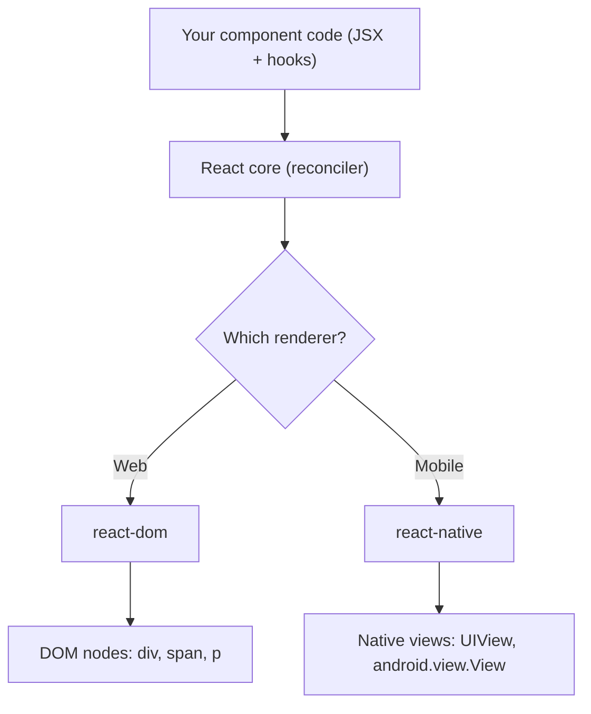

This is a checklist, not a tutorial. If any item below feels unfamiliar, go back to the React chapters and fill the gap before continuing. Treat a "no" on any line as a hard stop.

### Functional components, JSX, props, and state

Every React Native screen is a tree of functional components. You must be comfortable with writing a component that accepts props, holds local state, and returns JSX. Class components still work, but the ecosystem — navigation libraries, animation libraries, state managers — assumes functions and hooks everywhere. Do not bother learning the class lifecycle for React Native work.

```tsx
// This component works identically in React web and React Native
// (swap <div> / <p> for <View> / <Text> and you're done)
type GreetingProps = {
  name: string;
};

function Greeting({ name }: GreetingProps) {
  const [visits, setVisits] = useState(0);

  useEffect(() => {
    setVisits(prev => prev + 1);
  }, []);

  return (
    <View>
      <Text>Hello, {name}. Visit #{visits}</Text>
    </View>
  );
}
```

On the web you return `<div>` and `<p>`. In React Native you return `<View>` and `<Text>`. The React knowledge — props typing, state initialization, the effect — is identical.

There is one JSX rule that trips up every web developer in their first hour: **in React Native, raw text must live inside a `<Text>` component.** On the web, `<div>Hello</div>` is fine. In React Native, `<View>Hello</View>` is a runtime crash. `<View>` is closer to a `<div>` with `display: flex` baked in — a layout box — and it cannot hold loose characters.

| Web (react-dom) | React Native | Notes |
|-----------------|--------------|-------|
| `<div>` | `<View>` | Layout box. Flexbox by default, no text inside directly. |
| `<p>`, `<span>`, `<h1>` | `<Text>` | The ONLY place raw text is allowed. |
| `` | `<Image>` | Needs explicit width/height; no intrinsic size from a URL. |
| `<button>` | `<Pressable>` / `<Button>` | No default styling on `Pressable`; you build it. |
| `<input>` | `<TextInput>` | |
| CSS file / className | `StyleSheet.create` + `style` prop | No CSS cascade, no global stylesheet. |

> **Common mistake:** `Invariant Violation: Text strings must be rendered within a <Text> component.` This almost always means you put text (or a trailing space, or a stray `{condition && 'text'}`) directly inside a `<View>`. Wrap it in `<Text>`.

### All core hooks

You need hands-on experience with every hook in this list before touching React Native, because mobile-specific libraries lean on them heavily:

| Hook | Why it matters in RN |
|------|----------------------|
| `useState` | Local UI state — modals, toggles, form fields |
| `useEffect` | Subscribing to device events (keyboard, app state, deep links) |
| `useRef` | Holding references to native views for imperative methods (scroll, focus, measure) |
| `useMemo` | Expensive list transformations on constrained mobile hardware |
| `useCallback` | Stable callbacks for `FlatList` render items (avoids full re-renders of long lists) |
| `useContext` | Theme, locale, authentication — RN apps pass these deeply |
| `useReducer` | Complex screen state where multiple fields change together |

If you have only used `useState` and `useEffect`, you are not ready. React Native performance depends on you knowing when to reach for `useMemo` and `useCallback` — mobile devices do not have the headroom to re-render carelessly.

Here is a concrete example of `useMemo` + `useCallback` earning their keep in a list screen, the single most common performance scenario in mobile apps:

```tsx
function ContactList({ contacts, query }: { contacts: Contact[]; query: string }) {
  // useMemo: only re-filter when the inputs actually change.
  // On a 5,000-row list on a budget Android phone, re-filtering on every
  // keystroke-driven re-render would drop frames.
  const filtered = useMemo(
    () => contacts.filter(c => c.name.toLowerCase().includes(query.toLowerCase())),
    [contacts, query],
  );

  // useCallback: a STABLE function identity so FlatList doesn't think
  // renderItem changed on every render (which would re-render every row).
  const renderItem = useCallback(
    ({ item }: { item: Contact }) => <ContactRow contact={item} />,
    [],
  );

  return <FlatList data={filtered} renderItem={renderItem} keyExtractor={c => c.id} />;
}
```

> **Pro tip:** The web forgives wasteful renders because the DOM diff is cheap and runs on the same fast machine the user is sitting at. On a $150 Android phone, that same wastefulness shows up as visible stutter. `useMemo`/`useCallback` are not premature optimization in RN list code — they are table stakes.

### Custom hooks and rules of hooks

Navigation libraries like React Navigation expose hooks (`useNavigation`, `useFocusEffect`). Animation libraries expose hooks (`useSharedValue`, `useAnimatedStyle`). You will consume dozens of custom hooks and write your own (`useKeyboardHeight`, `useAppState`, `useDebounce`). If you do not understand how custom hooks compose built-in hooks, or why hooks cannot be called conditionally, you will produce bugs that are invisible until they crash.

```tsx
// A custom hook you'll write within your first week of RN
function useAppState() {
  const [appState, setAppState] = useState(AppState.currentState);

  useEffect(() => {
    const sub = AppState.addEventListener('change', setAppState);
    return () => sub.remove();
  }, []);

  return appState;
}
```

This is pure React — `useState` plus `useEffect` with a cleanup. The only RN-specific part is `AppState`. If the hook pattern feels unfamiliar, stop here and study hooks first.

The "rules of hooks" exist because React identifies each hook by the **order** it is called in, not by a name. Every render must call the same hooks in the same sequence. If you hide a hook behind an `if`, the order shifts between renders and React's internal bookkeeping points at the wrong slot.

```tsx
// WRONG — hook called conditionally. The hook order changes when
// `isLoggedIn` flips, and React's state slots get misaligned.
function Profile({ isLoggedIn }: { isLoggedIn: boolean }) {
  if (isLoggedIn) {
    const [name, setName] = useState(''); // ❌ sometimes called, sometimes not
  }
  // ...
}

// RIGHT — always call the hook, branch on the value instead.
function Profile({ isLoggedIn }: { isLoggedIn: boolean }) {
  const [name, setName] = useState(''); // ✅ always called, always in order
  if (!isLoggedIn) return <LoginPrompt />;
  // ...
}
```

> **Gotcha:** The ESLint rule `react-hooks/rules-of-hooks` catches most violations at write time. Install ESLint on day one (see the Tooling section) — on mobile you do not have a browser console babysitting you, so let the linter be your first line of defense.

### The rendering model

React Native uses the same reconciler as React web. When state changes, the component re-renders, React diffs the virtual tree, and only the changed nodes are sent to the native side. Understanding re-renders, reconciliation keys, and why returning a new object from a parent forces children to re-render is not optional knowledge — it is the primary performance lever you have.

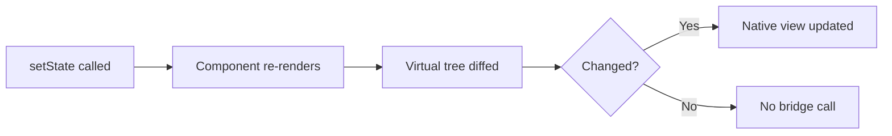

On the web, an unnecessary re-render costs a cheap DOM update. On mobile, an unnecessary re-render can cross the JS-to-native bridge and trigger a layout pass on the UI thread. The cost is higher, so the knowledge matters more.

A subtle trap that bites web and mobile developers alike: passing a freshly-created object, array, or function down as a prop defeats memoization, because a new reference is `!==` the old one even when the contents are identical.

```tsx
// Every render creates a NEW style object and a NEW onPress function.
// A memoized <Row> would re-render anyway because the props "changed".
<Row style={{ padding: 8 }} onPress={() => doThing(id)} />

// Fix: hoist the style (StyleSheet.create) and stabilize the callback.
const styles = StyleSheet.create({ row: { padding: 8 } });
const onPress = useCallback(() => doThing(id), [id]);
<Row style={styles.row} onPress={onPress} />
```

> **Pro tip:** `StyleSheet.create({...})` is not just convention. It registers your styles once and lets RN pass an integer ID across the bridge instead of a fresh object on every render. It is both a performance win and a stable reference — a two-for-one.

### Refs, imperative handles, and Suspense

You will call `.scrollToIndex()` on a `FlatList` ref, `.focus()` on a `TextInput` ref, and `.measure()` on a `View` ref. `useRef` and `forwardRef` / `useImperativeHandle` are not edge cases in React Native — they are daily tools.

```tsx
// Imperative focus — extremely common in forms where tapping
// "Next" on the keyboard should jump to the following field.
function LoginForm() {
  const passwordRef = useRef<TextInput>(null);

  return (
    <>
      <TextInput
        placeholder="Email"
        returnKeyType="next"
        onSubmitEditing={() => passwordRef.current?.focus()} // imperative jump
      />
      <TextInput ref={passwordRef} placeholder="Password" secureTextEntry />
    </>
  );
}
```

Refs are the escape hatch for the small set of operations that are inherently imperative — focusing an input, scrolling a list to a row, measuring a view's pixel position. On the web you reached for refs to call `.focus()` or `.play()` on a `<video>`; in RN the same instinct applies, just to native components.

Suspense is newer in the mobile world, but data-fetching libraries (React Query, SWR) and the React Native New Architecture are increasingly built around it. You should understand `<Suspense>` boundaries and how they interact with fallback UI at a conceptual level, even if you have not used them in production yet.

---

## 2. JavaScript / TypeScript

### ES2022+ features you will use daily

React Native projects are transpiled by Metro (the bundler), so you get modern syntax out of the box. The codebase you read — library source, Stack Overflow answers, official docs — assumes you know all of these fluently:

```tsx
// Destructuring (props, hook returns, API responses)
const { userId, token } = route.params;
const [items, setItems] = useState<Item[]>([]);

// Spread (immutable state updates, merging style objects)
const updated = { ...user, name: newName };
const combined = StyleSheet.compose(baseStyle, overrideStyle);

// Optional chaining (deeply nested API responses)
const city = response?.data?.address?.city ?? 'Unknown';

// Nullish coalescing (default values that respect 0 and '')
const pageSize = config.pageSize ?? 20;

// Template literals, array methods (map, filter, find, reduce)
const ids = users.filter(u => u.isActive).map(u => u.id);
```

If any of these look unfamiliar, do not proceed. React Native code is dense with destructuring and optional chaining. Reading it will be painful without fluency.

One distinction that causes real bugs: `??` (nullish coalescing) is **not** the same as `||` (logical or). `||` treats `0`, `''`, and `false` as "missing"; `??` only treats `null` and `undefined` that way. On a settings screen where `0` is a valid value (volume, brightness, a count), using `||` silently overwrites the user's `0` with your default.

```tsx
const volume = settings.volume || 10; // ❌ user's volume of 0 becomes 10
const volume = settings.volume ?? 10; // ✅ only undefined/null falls back to 10
```

> **Gotcha:** `a?.b.c` short-circuits the WHOLE chain to `undefined` if `a` is nullish — it does not throw. But `(a?.b).c` does throw if `a` is nullish, because the parentheses force `.c` to run on `undefined`. Keep the `?.` flowing through every uncertain hop.

### Promises, async/await, and error propagation

Every network call, every storage read, every permission request in React Native is async. You need to be comfortable chaining `async/await`, propagating errors with try/catch, and understanding what happens when a Promise rejects inside a `useEffect`.

```tsx
// A pattern you'll write hundreds of times in RN
useEffect(() => {
  let cancelled = false;

  async function loadProfile() {
    try {
      const res = await fetch(`https://api.example.com/user/${id}`);
      if (!res.ok) throw new Error(`HTTP ${res.status}`);
      const data = await res.json();
      if (!cancelled) setProfile(data);
    } catch (err) {
      if (!cancelled) setError(err instanceof Error ? err.message : 'Unknown');
    }
  }

  loadProfile();
  return () => { cancelled = true; };
}, [id]);
```

The `cancelled` flag pattern is critical on mobile. When a user navigates away from a screen, the component unmounts, but the network request keeps going. Without the flag, you call `setState` on an unmounted component. On the web this is a warning; on mobile it can cause subtle navigation bugs.

This diagram shows why the flag matters — the timeline of a fast tap-and-leave:

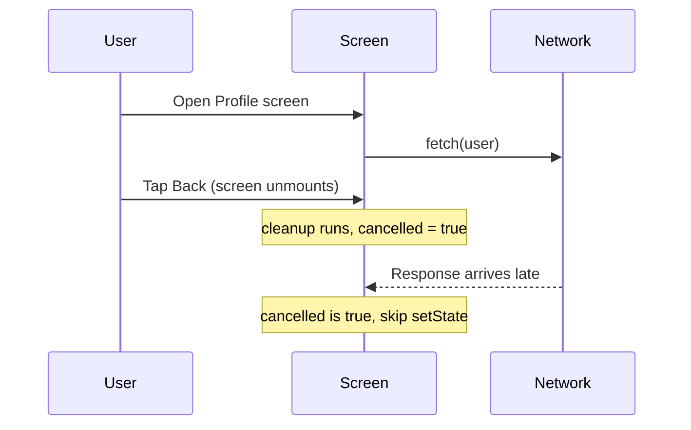

> **Common mistake:** Marking the effect callback itself `async` — `useEffect(async () => {...})`. An async function returns a Promise, but `useEffect` expects the return value to be a cleanup function (or nothing). React will treat the Promise as a "cleanup function" and your real cleanup never runs. Always declare an inner `async` function and call it, as shown above.

### Closures and the event loop

On the web, closure bugs show up as stale state in event handlers. On mobile, the same bugs show up in gesture callbacks, animation drivers, and native event listeners — and they are harder to debug because you cannot just open browser DevTools.

```tsx
// The classic stale closure bug — even more painful in RN
function BrokenTimer() {
  const [count, setCount] = useState(0);

  useEffect(() => {
    const id = setInterval(() => {
      // count is captured from the first render — always 0
      setCount(count + 1); // stuck at 1
    }, 1000);
    return () => clearInterval(id);
  }, []); // empty deps = effect runs once, closure captures initial count

  // Fix: use functional update
  // setCount(prev => prev + 1);
}
```

Why does this happen? A closure "freezes" the variables it can see at the moment the function is created. The `setInterval` callback was created during the first render, when `count` was `0`, so it forever sees `0`. The functional update `setCount(prev => prev + 1)` sidesteps the trap by asking React for the *current* value instead of reading the stale captured one.

You also need to understand the event loop — specifically that long-running synchronous work on the JS thread blocks the bridge and freezes animations. If you do not know why `JSON.parse` on a 2 MB payload freezes scrolling, you are not ready.

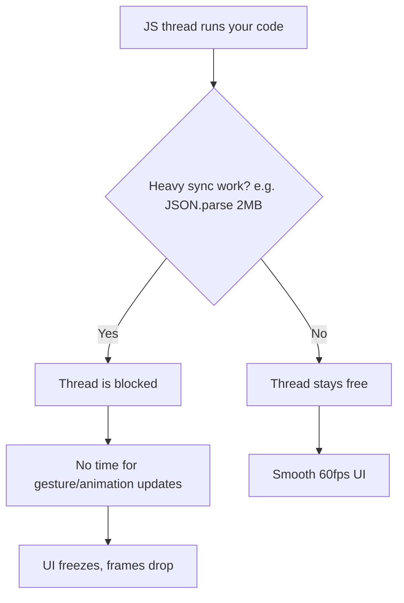

> **Pro tip:** React Native (in the classic architecture) runs your JavaScript on a single thread, separate from the native UI thread. As long as the JS thread keeps up, animations driven natively stay smooth — but anything you do synchronously in JS (parsing, sorting a huge array, a tight loop) stalls everything you control. Offload heavy work, chunk it, or move it off the JS thread (e.g. `InteractionManager`, worklets) rather than running it inline during an interaction.

### TypeScript: generics, utility types, discriminated unions

React Native in 2026 is TypeScript-first. The official template ships with TypeScript. Navigation params, API responses, and component props all benefit from strong typing.

```tsx
// Generics: you'll type API responses and hook returns
async function fetchData<T>(url: string): Promise<T> {
  const res = await fetch(url);
  return res.json() as Promise<T>;
}

// Utility types: Partial for optional updates, Pick for subsets
type UserUpdate = Partial<Pick<User, 'name' | 'email' | 'avatar'>>;

// Discriminated unions: great for screen states
type ScreenState =
  | { status: 'loading' }
  | { status: 'error'; message: string }
  | { status: 'success'; data: User[] };

function renderScreen(state: ScreenState) {
  switch (state.status) {
    case 'loading': return <ActivityIndicator />;
    case 'error':   return <Text>{state.message}</Text>;
    case 'success': return <UserList data={state.data} />;
  }
}

// as const: useful for action types and config objects
const ROUTES = {
  HOME: 'Home',
  PROFILE: 'Profile',
  SETTINGS: 'Settings',
} as const;

type RouteName = typeof ROUTES[keyof typeof ROUTES];
// => 'Home' | 'Profile' | 'Settings'
```

The discriminated union deserves special attention because it maps perfectly onto the lifecycle of every screen that loads data. The shared `status` field (the "discriminant") lets TypeScript *narrow* the type inside each `case` — in the `'error'` branch it knows `message` exists; in the `'success'` branch it knows `data` exists. This makes impossible states impossible: you can never accidentally read `state.data` while `status` is `'loading'`, because that field does not exist on that variant.

| TS feature | What it buys you in RN | Typical use |
|------------|----------------------|-------------|
| Generics `<T>` | One typed helper for many response shapes | `fetchData<User>(url)` |
| `Partial<T>` | Optional-everything for updates/patches | Edit forms, `PATCH` bodies |
| `Pick<T, K>` / `Omit<T, K>` | Carve a subset of an existing type | Props derived from a model |
| Discriminated union | Exhaustive, safe screen/render states | loading / error / success |
| `as const` | Freeze literals into narrow string-literal types | Route names, action types |

> **Gotcha:** React Navigation's type system is one of the more complex generic setups you will encounter. If you cannot read `NativeStackScreenProps<RootStackParamList, 'Profile'>` and understand what it means, brush up on generics before starting.

---

## 3. Tooling

### Package managers: npm, yarn, pnpm

React Native projects use the same Node.js package managers as web projects. The ecosystem has largely settled: **yarn** (Classic or Berry) is the most common in RN projects, but **npm** works fine and **pnpm** is gaining traction. Pick one and learn it well.

| Manager | Strengths | When to use |
|---------|-----------|-------------|
| **npm** | Ships with Node, zero setup, fine for RN | Solo projects, simplest path, CI defaults |
| **yarn (Classic/Berry)** | Most common in existing RN repos, fast, mature | Joining a team that already uses it |
| **pnpm** | Disk-efficient (shared store), strict deps | Monorepos, many projects on one machine |

> **Gotcha:** Never mix managers in one repo. A project with both a `package-lock.json` and a `yarn.lock` will resolve different dependency trees depending on who runs `install`, and RN's native modules are exactly the kind of dependency where a version drift turns into a broken build. Commit one lockfile, delete the others.

What matters more than which manager you choose:

- **Lockfiles.** `package-lock.json`, `yarn.lock`, or `pnpm-lock.yaml` must be committed. React Native is notoriously sensitive to dependency version mismatches — a minor version bump in a native module can break your iOS build. If you do not commit your lockfile, your teammate's `install` pulls different versions and their build fails while yours works. This is not hypothetical; it happens weekly.

- **Semver.** You need to read `^1.2.3` and know it allows `1.x.x` but not `2.0.0`. You need to know that `~1.2.3` only allows `1.2.x`. React Native libraries frequently ship breaking changes in minor versions (the ecosystem moves fast and not everyone follows semver strictly), so understanding what your lockfile pins and what it allows to float is essential.

| Range | Allows | Blocks | Meaning |
|-------|--------|--------|---------|
| `1.2.3` | only `1.2.3` | everything else | Exact pin |
| `~1.2.3` | `1.2.3` → `1.2.x` | `1.3.0` | Patch updates only |
| `^1.2.3` | `1.2.3` → `1.x.x` | `2.0.0` | Minor + patch updates |
| `*` | anything | nothing | Never do this in RN |

```bash
# Commands you should be able to run without thinking
npm install                    # Install from lockfile
npm install react-native-svg  # Add a dependency
npm ls react-native            # Check installed version
npx react-native doctor       # Diagnose environment issues
```

### Git: branching, rebasing, conflict resolution

Mobile releases are more structured than web deploys. You will typically have a `main` branch, feature branches, and release branches. You need to be comfortable with:

- Creating and switching branches
- Rebasing feature branches onto `main` to keep history clean
- Resolving merge conflicts in `package.json` and lockfiles (these are common and annoying)
- Cherry-picking a fix from `main` into a release branch when a critical bug needs to ship

Why is mobile more branch-heavy than web? On the web, you deploy a fix and every user has it on their next page load. On mobile, a version is **frozen** the moment it ships to the store — users on v1.2 stay on v1.2 until they update. So teams keep a release branch alive per shipped version to back-port critical hotfixes, while `main` races ahead with new work. That is what cherry-pick is for.

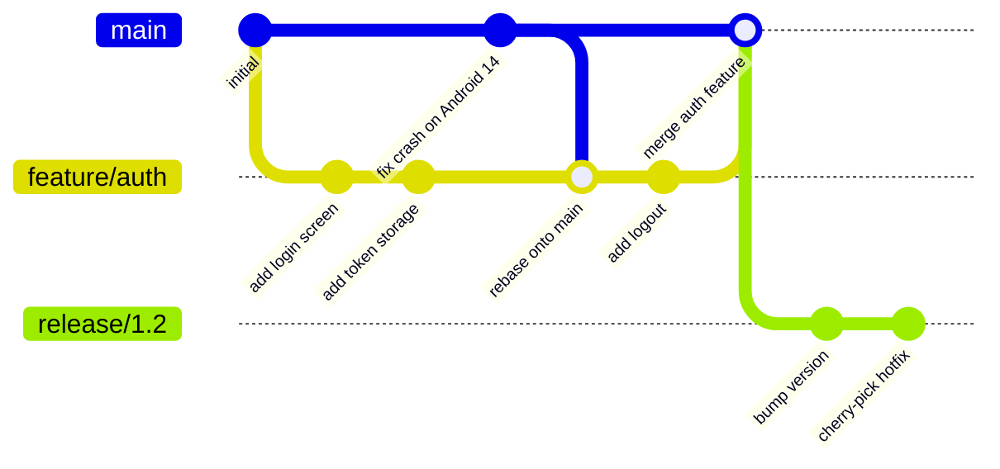

> **Gotcha:** Merge conflicts in `yarn.lock` look terrifying — thousands of lines of hashes. Do not try to resolve them by hand. Delete the lockfile, run `yarn install`, and commit the regenerated lockfile. This is safe because the `package.json` constraints are the source of truth.

### CLI fluency

You will spend time in the terminal. React Native's CLI is how you build, run, link native modules, and diagnose problems. You should be comfortable running commands, reading error output, and navigating a project's directory structure from the command line.

```bash
# Commands you'll run every day
npx react-native start              # Start Metro bundler
npx react-native run-ios            # Build and run on iOS simulator
npx react-native run-android        # Build and run on Android emulator
npx react-native doctor             # Check environment setup
npx pod-install                     # Install CocoaPods (iOS deps)
```

If you use Expo (recommended for new projects), the commands change but the principle is the same:

```bash
npx expo start                      # Start development server
npx expo run:ios                    # Build native iOS
npx expo run:android                # Build native Android
npx expo install react-native-svg   # Install with correct version
```

It helps to know what these two layers actually are. **Metro** is the bundler — RN's equivalent of Webpack/Vite. It watches your files, transpiles modern JS/TS, and serves a single JavaScript bundle to the running app. The **native build** (Xcode for iOS, Gradle for Android) compiles the actual app shell that loads that bundle. In development they work together: the native app runs once, and Metro hot-swaps your JS as you edit.

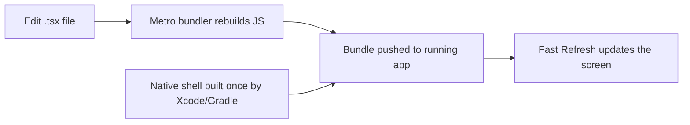

> **Gotcha:** "It worked yesterday and now it's broken" is very often a stale Metro cache. Before deep-debugging, try `npx react-native start --reset-cache` (or `npx expo start -c`). It resolves a startling share of mysterious red screens.

### VS Code

VS Code is the editor most React Native developers use. Install these extensions before you start:

- **ESLint** — catches hook rule violations and common mistakes
- **Prettier** — consistent formatting across the team
- **React Native Tools** — debugger integration, IntelliSense for RN APIs
- **Error Lens** — inline error display so you see TypeScript errors immediately

> **Opinionated take:** Use Expo for every new project unless you have a proven, specific reason not to. Expo's managed workflow handles native module linking, build configuration, and over-the-air updates. The "bare workflow" escape hatch exists if you hit a wall. Starting with bare React Native CLI in 2026 is like starting a web project by configuring Webpack from scratch — possible, but a waste of your first week.

| Approach | Setup cost | Native control | Best for |
|----------|-----------|----------------|----------|
| **Expo (managed)** | Minutes, no Xcode needed to start | High via config plugins + EAS | Almost every new app |
| **Expo (with dev client)** | Low | Full custom native code allowed | Apps needing a custom native module |
| **Bare RN CLI** | Hours, full native toolchain | Total, manual | Existing native apps, niche constraints |

---

## 4. Mobile Concepts

### iOS vs Android: two worlds, one codebase

React Native promises "learn once, write anywhere" — not "write once, run anywhere." The distinction matters. You write one JavaScript codebase, but the two platforms have different navigation paradigms, different design languages, different hardware constraints, and different review processes. You need a mental model of how each platform works, even though you are writing JavaScript.

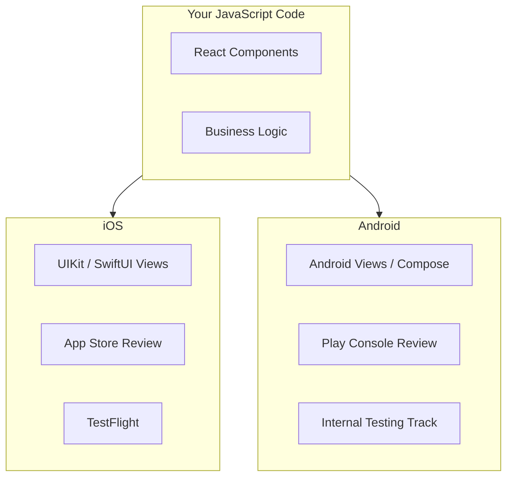

Here is a quick reference for the differences you will actually feel as a developer:

| Aspect | iOS | Android |
|--------|-----|---------|
| Design language | Human Interface Guidelines | Material Design |
| Back navigation | No hardware back button; swipe / nav bar | Hardware/gesture back button (handle it!) |
| Distribution | App Store + TestFlight | Play Store + tracks |
| Review wait | Hours to ~a day | Often near-instant for test tracks |
| Process kills | Suspends, less aggressive | Can destroy Activity anytime |

> **Common mistake:** Forgetting the Android hardware back button. iOS has no equivalent, so web developers building on a Mac/simulator never notice — then an Android user taps Back inside a modal and the whole app exits. Handle it explicitly (React Navigation does much of this for you, but custom modals and flows need `BackHandler`).

**App lifecycle** works differently on each platform. On iOS, an app moves through states: inactive, active, background, suspended. On Android, the system can destroy and recreate your Activity at any time (screen rotation, memory pressure). React Native abstracts most of this through the `AppState` API, but you need to know the underlying model so you can handle edge cases — like saving form data when the OS kills your app in the background.

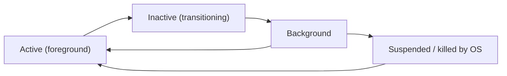

```tsx
// Persist draft state when the app leaves the foreground,
// because the OS may kill it before the user returns.
useEffect(() => {
  const sub = AppState.addEventListener('change', state => {
    if (state === 'background') {
      saveDraft(formValues); // last chance before a possible kill
    }
  });
  return () => sub.remove();
}, [formValues]);
```

### App store distribution

You cannot just deploy to a URL. Mobile apps go through a review process, and getting your app to testers requires specific tooling:

- **iOS / TestFlight:** You build an archive in Xcode (or via EAS Build), upload it to App Store Connect, and invite testers through TestFlight. Apple reviews even TestFlight builds (though the review is lighter). Expect 24-48 hours for the first build review. Subsequent builds to the same group are usually available within an hour.

- **Android / Play Internal Testing:** You upload an AAB (Android App Bundle) to the Google Play Console and create an internal testing track. Testers get a link. Internal track builds are available almost immediately — no review wait. The review happens when you promote to production.

The single biggest mental shift from web: there is a gatekeeper between your code and your users.

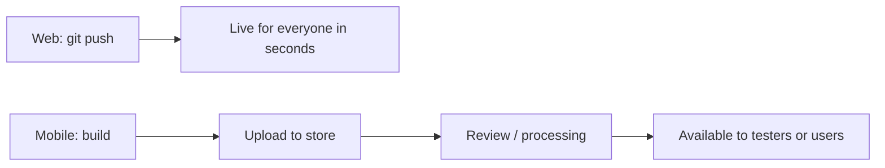

> **Gotcha:** iOS builds expire after 90 days on TestFlight. If your beta program runs long, testers' apps will stop launching. You need a CI pipeline that regularly produces fresh builds. Do not rely on manually archiving from your laptop.

> **Pro tip:** Because store review is slow, the ecosystem leans on **over-the-air (OTA) updates** (Expo Updates / EAS Update) to ship JavaScript-only fixes without a new binary. This works precisely because your JS bundle is separate from the native shell (see the Metro diagram earlier) — but note that stores only permit OTA for JS/asset changes, not new native code.

### The permissions model

On the web, you ask for camera access with `navigator.mediaDevices.getUserMedia()` and the browser shows a prompt. On mobile, permissions are more granular, more permanent, and more consequential.

Both platforms require you to **declare** permissions ahead of time (in `Info.plist` on iOS, in `AndroidManifest.xml` on Android) and then **request** them at runtime. If you forget the declaration, the runtime request silently fails. If you request at the wrong time (on app launch instead of when the user taps the camera button), the user denies it and you may not get another chance — iOS rate-limits permission prompts.

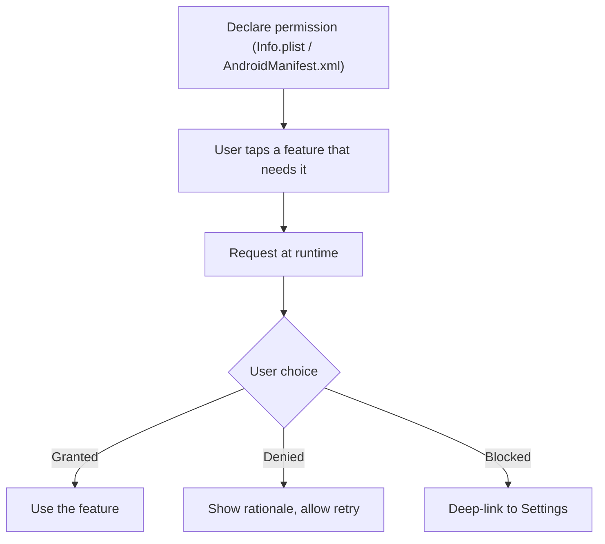

```tsx
// react-native-permissions — the standard library for this
import { request, PERMISSIONS, RESULTS } from 'react-native-permissions';
import { Platform } from 'react-native';

async function requestCamera(): Promise<boolean> {
  const permission = Platform.select({
    ios: PERMISSIONS.IOS.CAMERA,
    android: PERMISSIONS.ANDROID.CAMERA,
  });

  if (!permission) return false;

  const result = await request(permission);

  switch (result) {
    case RESULTS.GRANTED:
      return true;
    case RESULTS.DENIED:
      // User said no — can ask again (iOS) or is permanent (Android varies)
      return false;
    case RESULTS.BLOCKED:
      // User previously denied and checked "don't ask again"
      // Must direct them to Settings
      return false;
    default:
      return false;
  }
}
```

> **Key difference from web:** On the web, denying a permission prompt just means you get asked again next time. On iOS, after a denial, the system may not show the prompt again — you have to send the user to the Settings app. Design your UX around this: explain *why* you need the permission before triggering the system prompt.

> **Pro tip:** The "pre-permission" pattern is industry standard: show your own friendly screen ("We use the camera so you can scan receipts — ready?") *before* you trigger the real OS prompt. If the user says "not now" on your screen, you have spent nothing — the precious, possibly one-time OS prompt is still in your pocket for when they are ready to say yes.

### Safe areas: notches, Dynamic Islands, and system bars

On the web, your content starts at `(0, 0)` and you do not worry about hardware overlapping your UI. On mobile, the status bar, the home indicator (iPhone), the Dynamic Island (iPhone 14 Pro+), the navigation bar (Android), and the camera notch all eat into your screen space. If you do not account for them, your content renders behind the status bar or under the home indicator.

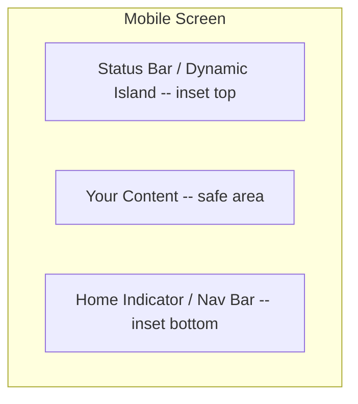

React Native provides the `SafeAreaView` component (iOS only) and the more complete `react-native-safe-area-context` library (cross-platform). You will wrap your screens in a `SafeAreaProvider` and use the `useSafeAreaInsets` hook to get the exact pixel values for each edge.

```tsx
import { useSafeAreaInsets } from 'react-native-safe-area-context';

function MyScreen() {
  const insets = useSafeAreaInsets();

  return (
    <View style={{
      flex: 1,
      paddingTop: insets.top,
      paddingBottom: insets.bottom,
    }}>
      <Text>Content that never hides behind the notch</Text>
    </View>
  );
}
```

Think of insets as four numbers — `top`, `bottom`, `left`, `right` — describing how many points of padding each edge needs to clear the hardware. The hook gives you live values that update on rotation and differ per device, so you apply them as padding (or margin) rather than guessing.

| Option | Platforms | Gives you | Verdict |
|--------|-----------|-----------|---------|
| Core `SafeAreaView` | iOS only | Auto padding, no raw numbers | Avoid — incomplete |
| `react-native-safe-area-context` (`SafeAreaView`) | iOS + Android | Auto padding, cross-platform | Good default |
| `useSafeAreaInsets()` | iOS + Android | Raw inset numbers per edge | Best for custom layouts |

> **Gotcha:** The built-in `SafeAreaView` from React Native core only works on iOS and only applies padding. Use `react-native-safe-area-context` instead — it works on both platforms, gives you the raw inset values, and plays nicely with React Navigation (which needs insets for its header and tab bar calculations).

The values change depending on device and orientation. An iPhone SE has a top inset of 20 points. An iPhone 15 Pro has a top inset of 59 points (Dynamic Island). An Android device with a camera hole-punch has a top inset that varies by manufacturer. Never hard-code these numbers — always read them from the safe area context.